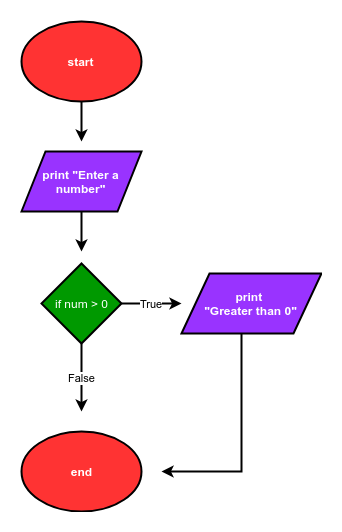
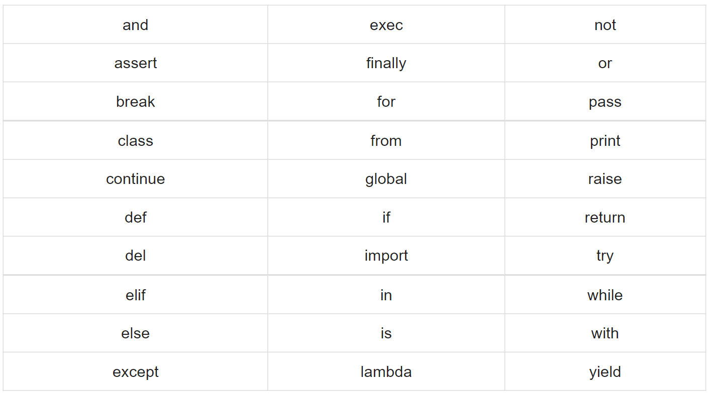
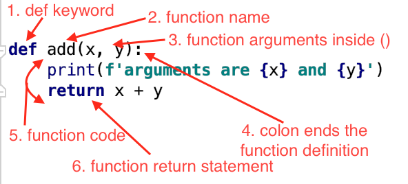
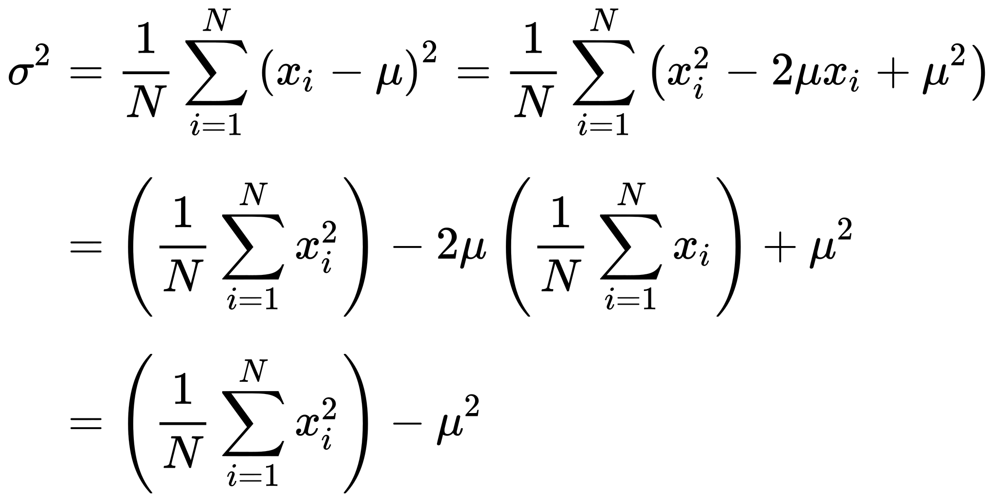
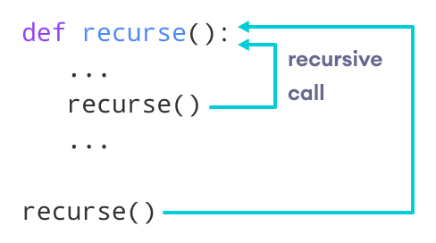
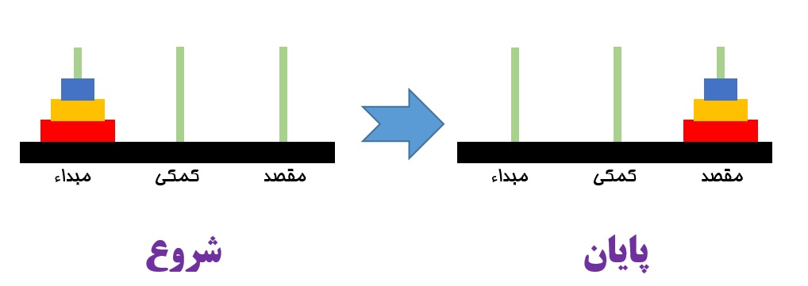
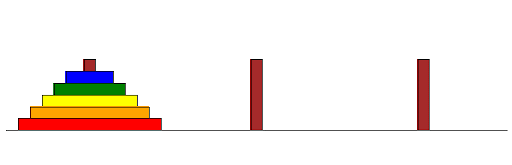
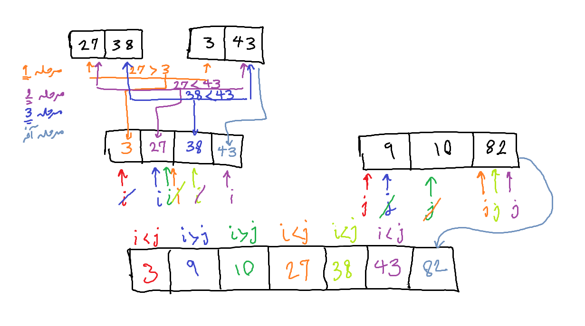
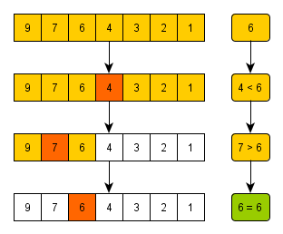

<div style="direction:rtl;line-height:300%;"><font face="XB Nazanin" size=5>
<div align=center>
<font face="IranNastaliq" size=40 color=#C35513>
<p></p>
به نام خدا
</font>
<br>
<font>
دانشگاه علامه طباطبائی - دانشکده آمار، علوم ریاضی و کامپیوتر
</font>
<br>
<font color=blue>
آموزش پایتون
</font>
<br>
نویسنده: نیلوفر مینوئی
، دکتر محمدرضا اصغری اسکوئی
    <br>
    استاد مدرس:  دکتر محمدرضا اصغری اسکوئی
    </div>
<hr/>
</font>
</div></div>

<div style="direction:rtl;line-height:300%;"><font face="XB Nazanin" size=5>
<div align=center>
<font color=#C35513>
معرفی درس و هدف درس
</font><p></p> 
</div>
 هدف از درس برنامه سازی (پایتون) توسعه و تعمیق دانش و مهارت دانشجویان در زمینه تفکر سیستمی، آلگوریتم و برنامه نویسی در محیط پایتون است. اهداف اصلی در این درس عبارتند از:
<br>
<ul>
<li>آشنائی با مبانی برنامه نویسی و ساختارهای برنامه سازی در پایتون </li>   
<li>آشنائی با توابع و ساختارهای پیشرفته از جمله لیست، دیکشنری، کلاس و آبجکت و ساختار توابع بازگشتی</li> 
<li>آشنائی با برنامه نویسی شی گرا، وراثت، برنامه های مرتب سازی و جستجو و مفهوم پیچیدگی محاسباتی </li>
<li>آشنائی با کتابخانه های پایتون Python, Numpy, Matplotlib … </li> 
<li> پیاده سازی و کسب مهارت انجام پروژه‌های درسی </li> 
</ul>
<hr> 
</font>
</div>

<div style="direction:rtl;line-height:300%;"><font face="XB Zar" size=4>
<h3><a  name="menu"> فهرست محتویات</a></h3>
<ol style="margin-right: 0;">
<li><a href="#section1">مقدمه بر ساختار رایانه و مبانی زبان های برنامه نویسی 	</a></li>
<li><a href="#section2">ویژگی‌های زبان پایتون و برنامه سازی و نصب محیط ژوپیتر پایتون 	</a></li>
<li><a href="#section3">متغیر، عبارت (Expression) و دستور (Statement)، اولین برنامه</a></li>
<li><a href="#section4">ساختار کنترل شرطی if و چند نمونه برنامه </a></li>
<li><a href="#section5">ساختار کنترل حلقه while, for  و چند نمونه برنامه </a></li>
<li><a href="#section6">تابع و انواع توابع، کتابخانه‌ای، ماجول و پکیج، تعریف تابع</a></li>
<li><a href="#section7">متغیر، عبارت عملگرهای محاسباتی و اعشاری </a></li>
<li><a href="#section8">متغیر، عبارترشته های حرفی (Strings) </a></li>
<li><a href="#section9">ساختارهای تاپل و لیست (List, Tuples) و ماتریس </a></li>
<li><a href="#section10">ماجول‌های محاسباتی، تصادفی و رسم نمودار  </a></li>
<li><a href="#section11">کار با فایل‌ها و ذخیره و بازیابی داده در فایل </a></li>
<li><a href="#section12">توابع بازگشتی و ساختار مجموعه و دیکشنری (Set, Dictionary) </a></li>
<li><a href="#section13">مفهوم کلاس و برنامه سازی شی گرا </a></li>
<li><a href="#section14">الگوریتم جستجو و مرتب سازی </a></li>
<li><a href="#section15">محاسبات ماتریسی با کتابخانه Numpy  و Scipy</a></li>
<li><a href="#section16">مروری بر مباحث </a></li>
</ol>
</font>
</div>

<font color=135FC3 size=6>
<p></p>
<div align=center><a  name="section1" href="#menu">فصل 1: مقدمه بر ساختار رایانه و مبانی زبان های برنامه نویسی</a></div>
</font>
<div style="direction:rtl;line-height:300%;"><font face="XB Nazanin" size=5>
<font color=#C31330>
<br>
در این بخش با مطالب زیر آشنا می‌شویم:
<ol>
 <li><a  href="#sub1sec1">برنامه چیست</a></li>
 <li><a  href="#sub2sec1">زبان برنامه‌نویسی چیست</a></li>
</ol>
</font>
<font color=#C31330>
<a  href="#menu">بازگشت به فهرست</a>
</font>
</font></div>

<div style="direction:rtl;line-height:300%;"><font face="XB Nazanin" size=5>
    <font color=#C31330 size=5>
    <p></p>
    <div align=center><a  name="sub1sec1">برنامه چیست</a>
    </div></font>
    <p></p>
    برنامه یک سری فعالیت ها و دستورات است که شما را به هدف یا جوابی که می‌خواهید می‌رساند. برای یک برنامه ابتدا باید یک مسئله وجود داشته باشد. سپس برای آن مسئله یک برنامه نوشته می‌شود که بتواند شما را به جواب برساند. 
    ممکن از یک جواب حدودی برای شما معیین شده باشد؛ اما در اکثر موارد جوابی در دست شما نیست و برنامه را به قصد یافتن جواب می‌نویسید. 
    <br>
</font>
</div>


<div style="direction:rtl;line-height:300%;"><font face="XB Nazanin" size=5>
    <font color=#C31330 size=5>
    <p></p>
    <div align=center><a  name="sub2sec1">زبان برنامه‌نویسی چیست</a>
    </div></font>
    <p></p>
    زبان برنامه نویسی دستورات مد نظر شما در یک برنامه را به طوری تعریف می‌کند که برای یک سیستم قابل فهم باشد.
    برخی زبان‌ها بسیار پایه‌ای هستند و برخی زبان‌ها در سطح‌های بسیار بالا و قابل فهم‌تر برای انسان تعریف شده‌اند.
    <br>
    به طور کلی زبان‌ها شامل 2 دسته سطح بالا و سطح پایین می‌شوند.
    در زبان های سطح بالا کاربر یا برنامه‌نویس دخالتی در مدیریت حافظه ندارد و به زبان انسان بسیار نزدیکتر است. پایتون، جاوا، جاوا اسکریپت، c# و بسیاری از زبان‌های دیگر در این دسته از زبان‌ها قرار می‌گیرند.
    در زبان‌های سطح پایین زبان اسمبلی(assembly) جزو این دسته از زبان‌ها است.
    اما دسته دیگری از زبان‌ها موجود است که در بین این دو قرار دارد. هم ویژگی‌های زبان‌های سطح بالا را دارد و هم ویژگی‌های زبان‌های سطح پایین.
    زبان C و C++ در این دسته قرار می‌گیرند.
    <br>
    از طرفی دیگر زبان های سطح بالا خود دارای 2 نوع مختلف هستند: مفسری و کامپایلری.
    <br>
    در زبان های مفسری کد خط به خط به زبان سطح پایین تبدیل می‌شود و اگر آن خط ایرادی نداشته باشد توسط سیستم اجرا می‌شود تا زمانی که خطی دارای خطا باشد.
    در زبان‌های کامپایلری کل کد یکجا به زبان سطح پایین تبدیل شده و در صورت نداشتن خطا در هیچ یک از خط ها اجرا می‌شود.
    <br>
    اما زبان پایتون می‌تواند در هر دو دسته قرار بگیرد. بسته به تنظیمات می‌تواند به صورت مفسری و یا کامپایلری اجرا شود.
    <br>
    <br>
</font>
</div>

<font color=135FC3 size=6>
<p></p>

<div align=center><a  name="section2" href="#menu">فصل 2: ویژگی‌های زبان پایتون و برنامه سازی و نصب محیط ژوپیتر پایتون</a></div>
</font>
<div style="direction:rtl;line-height:300%;"><font face="XB Nazanin" size=5>
<font color=#C31330>
مقدمه
</font><p></p>
زبان پایتون یکی از محبوب‌ترین زبان‌های برنامه نویسی است. این زبان از سال 2017 در صدرجدول محبوب ترین زبان‌های برنامه‌نویسی دنیا قرار دارد. علت آن سادگی این زبان  نسبت به زبان‌های محبوب و پرکاربرد دیگر مانند جاوا، سی و سی پلاس پلاس است. برای تولید برنامه اگر زبان انگیلیسی را به عنوان زبان گفتاری در نظر بگیرید، برنامه نوشتن با زبان پایتون مانند صحبت به این زبان است.<br>
برنامه‌نویسی نیز نوعی از تفکر است که با آن می‌توان انجام کاری را به کامپیوتر یا سیستم تحت فرمان شما القا کرد. در آغاز درک این بخش می‌تواند یکی از سخت‌ترین قسمت‌های کد نویسی باشد زیرا درک چگونگی عملکرد مغز کامپیوتری در این بخش قرار دارد.<br>
در ادامه با نصب محیط برنامه نویسی آناکندا و جزئیات بیشتر در مورد پایتون و درک زبان کامپیوتر آشنا می‌شویم: <br>
<a  name="section2menu">فهرست این فصل:</a>
<ol>
 <li><a  href="#sub1sec2">نصب آناکندا</a></li>
 <li><a  href="#sub2sec2">درک زبان کامپیوتر</a></li>
 <li><a  href="#sub3sec2">آشنایی مقدماتی با پایتون</a></li>
</ol>
</font>
<br>
<font color=#C31330>
<a  href="#menu">بازگشت به فهرست</a>
</font></div>

<font color=#C31330 size=5>
<p></p>
<div align=center><a  name="sub1sec2">نصب آناکندا</a></div></font>
<div style="direction:rtl;line-height:300%;"><font face="XB Nazanin" size=5>
<p></p>
در پایین 3 مرحله دانلود آناکندا را مشاهده می‌کنید: <br>
<br />
<table cellspacing="0" cellpadding="0" border="0">
    <tr>
        <td style="text-align: center;">
            
            <br />
            مرحله 1: <a href="https://www.anaconda.com/products/individual">سایت آناکندا</a>
        </td>
        <td style="text-align: center;">
            
            <br />
            مرحله 2
        </td>
    </tr>
    <tr>
        <td style="text-align: center;">
            
            <br />
            مرحله 3
        </td>
    </tr>
</table>
<br>
با توجه به سیستم خود نسخه مورد نظر را دانلود کنید. سپس با استفاده از مراحل زیر اقدام به نصب آناکندا کنید:<br>
    <br />
<table cellspacing="0" cellpadding="0" border="0">
    <tr>
        <td style="text-align: center;">
            
            <br />
            مرحله 1
        </td>
        <td style="text-align: center;">
            
            <br />
            مرحله 2
        </td>
    </tr>
    <tr>
        <td style="text-align: center;">
            
            <br />
            مرحله 3
        </td>
        <td style="text-align: center;">
            
            <br />
            مرحله 4
        </td>
    </tr>
    <tr>
        <td style="text-align: center;">
            
            <br />
            مرحله 5
        </td>
        <td style="text-align: center;">
            
            <br />
            مرحله 6
        </td>
    </tr>
    <tr>
        <td style="text-align: center;">
            
            <br />
            مرحله 7
        </td>
        <td style="text-align: center;">
            
            <br />
            مرحله 8
        </td>
    </tr>
</table>
<br>
با استفاده از مراحل بالا قادر به نسب آناکندا خواهید بود. آناکندا یک محیط کلی است که در آن می‌توانید به محیط های مختلف برای برنامه نویسی پایتون دسترسی پیدا کنید.
برای مثال در تصویر آخر 3 محیط مختلف مشاهده می‌کنید که هر کدام دسترسی‌های  خاصی را در اختیار شما قرار می‌دهند. در این کلاس بیشتر از دو محیط ژوپیتر نوت بوک و ژوپیتر لب استفاده می‌شود. این دو محیط سبک بوده و امکان اجرای جز به جز کد را برای ما فراهم می‌آورد. <br>
اسپایدر عموما برای اجرای یک فایل کامل پایتون به صورت یکجا مورد استفاده قرار می‌گیرد. فرمت فایل های ایجاد شده در ژوپیتر .ipynb
است و فرمت فایل های پایتون که در اسپایدر ایجاد می‌شوند عموما .py 
است که به عنوان فایل پایتون شناخته می‌شوند.
<br>
</font>
<br>
<font color=#C31330>
<a  href="#section2menu">بازگشت به فهرست</a>
</font></div>

<font color=#C31330 size=5>
<p></p>
<div align=center><a name="sub2sec2">درک زبان کامپیوتر</a></div></font>
<div style="direction:rtl;line-height:300%;"><font face="XB Nazanin" size=5>
<p></p>
برای برنامه نویسی نیاز است ابتدا هدف خود را مشخص کنید سپس آن را دسته بندی کنید. دسته بندی کار به صورت مرحله ای خواهد بود. هیچگاه نیاز نیست از ابتدای کار برنامه شما کامل و بدون ایراد باشد. برنامه کامل در ابتدا همیشه با آزمون و خطا به وجود می‌آید.
<br>
برای حل یک مسئله ابتدا باید مسئله را درک کرده، سپس یک راه حل اولیه برای آن در ذهن خود طراحی کنیم. پس از این مراحل نوبت به برنامه نویسی اولیه طرح ما می‌رسد. در نهایت برنامه را می‌آزماییم و در صورتی که نیاز به تغییرات داشت و یا خطایی در حین اجرای آن به وجود آمد، به مرحله قبل برمی‌گردیم و برنامه را بازنویسی می‌کنیم. در صورتی که در بازنویسی برنامه هیچ روند صعودی‌ای مشاهده نشود باید به مرحله قبل تر باز گشت و در طراحی اولیه بازبینی انجام شود.
<br>
برای مثال به نمونه زیر توجه کنید:
 
<br>
 یک مسئله ساده روشن نشدن چراغ می‌تواند مثال خوبی از فهم روند کار باشد. اولین روشی که به ذهن میرسد بررسی اتصال به برق است. در صورت جدا بودن از برق آن را روشن می‌کنیم. در صورتی که اتصال برقرار باشد و همچنان برق روشن نشود، سوختگی لامپ را بررسی می‌کنیم. اگر سوخته باشد لامپ را تعویض می‌کنیم. در غیر این صورت نیاز به یک چراغ جدید است.
<br>
نمونه دیگری از برنامه که به کد نویسی و زبان کامپیوتر نزدیک تر است نمونه برنامه زیر است که اعداد بزرگتر از صفر را تشخیص می‌دهد: 
 
<br>
ساده ترین کار برای تشخیص یک عدد مثبت استفاده از نماد ریاضی «بزرگتری» است. اگر عدد از صفر بزرگتر باشد به عنوان عدد بزرگتر از صفر یا مثبت اعلام می‌شود. در غیر این صورت هیچگونه اعلامی وجود ندارد.
<br>
اگر نیاز به اعلام عددهای کوچک تر از صفر بود به مراحل بالا چه چیزی اضافه می‌شد؟
<br>
کمی فراتر برویم. اگر بخواهیم 2 عدد را با هم جمع کنیم چه؟
<br>
ابتدا نیاز داریم 2 عدد را بگیریم (یا بخوانیم) سپس آن دو عدد را با هم جمع کنیم و در آخر مجموع را نمایش دهیم. فلوچارت این روند مشابه تصویر زیر خواهد بود:
    
<br>
حال فلوچارت بالا را به زبان خود توضیح دهید.
<br>
<font color=#C31330 size=4>
(یادگیری فلوچارت ضروری نیست و فقط برای درک بهتر از زبان کامپیوتر مورد استفاده قرار گرفته است)
</font>
<br>
حال روند مثال های زیر را به زبان خود بیان کنید:
<ol>
    <li>تبدیل دما از فارنهایت به درجه سانتیگراد</li>
    <li>عددی را به توان 2 رساندن</li>
    <li>به دست آوردن محیط یک مثلث</li>
</ol>
</font>
<br>
<font color=#C31330>
<a  href="#section2menu">بازگشت به فهرست</a>
</font></div>

<font color=#C31330 size=5>
<p></p>
<div align=center><a name="sub3sec2">آشنایی مقدماتی با پایتون</a></div></font>
<div style="direction:rtl;line-height:300%;"><font face="XB Nazanin" size=5>
<p></p>
    برای آن که با پایتون آشنایی اولیه پیدا کنیم، نیاز است ابتدا با برخی از تعریف‌های اولیه آشنا شویم:
    <br>
    
    برخی از کلمات خاص در زبان پایتون هستند که با آنها در آینده بیشتر آشنا می‌شویم.
    <br>
    برای مثال کلمه print از جمله این کلمات است که کاربرد آن نمایش هر آنچه درون آن نوشته شده است می‌باشد.
</font>
</div>


```python
print("به کلاس پایتون خوش آمدید")
```

    به کلاس پایتون خوش آمدید
    


```python
print("مقدار شما میتواند عدد باشد: ")
print(123)
print(-5)
print(3.14)
```

    مقدار شما میتواند عدد باشد: 
    123
    -5
    3.14
    


```python
print("شما میتوانید ابتدا عدد را به عنوان متغیر تعریف کنید و سپس آن را چاپ کنید")
a = 12
print(a)
```

    شما میتوانید ابتدا عدد را به عنوان متغیر تعریف کنید و سپس آن را چاپ کنید
    12
    

<div style="direction:rtl;line-height:300%;"><font face="XB Nazanin" size=5>
در واقع تابع print() برای خروجی در پایتون استفاده می‌شود.
<br>
    برای گرفتن ورودی از کاربر برنامه از کلمه input همانند نمونه زیر استفاده می‌شود:
</font></div>


```python
input()
```

    12
    


    '12'


<div style="direction:rtl;line-height:300%;"><font face="XB Nazanin" size=5>
برای نگهداری مقدار ورودی آن را در یک متغیر ذخیره می‌کنیم. در این حالت بعدا میتوانید از آن استفاده کنید.
    <br>
     برای درک بهتر مثال جمع دو عدد را در نظر بگیرید. آن را به صورت زیر پیاده سازی می‌کنیم:
</font></div>


```python
number1 = input()
number2 = input('عدد دوم را وارد کنید ')
sum_of_2_numbers = number1+number2
print(sum_of_2_numbers)
```

    2
    عدد دوم را وارد کنید 3
    23
    

<div style="direction:rtl;line-height:300%;"><font face="XB Nazanin" size=5>
با آن که راه حل ما درست به نظر می‌رسد اما جواب ما درست نیست. دلیل آن این است که ورودی ها در پایتون به صورت رشته هستند.
    <br>
    اما رشته چیست؟
    <br>
    تمام مقادیر در پایتون به شکلی تعریف می‌شوند. انواع متغیرها شامل رشته، اعداد(عدد صحیح، عدد اعشار و عدد مختلط) و انواع دیگری از مقادیر مانند لیست، دیکشنری و ... هستند.
    <br>
    با توجه به توضیحات برای آن که یک مقدار را به نوع دیگری از مقدار تبدیل کنیم نیاز به کَست کردن یا تبدیل یک نوع به نوع دیگر داریم.
</font></div>


```python
number1 = input("enter first number: ")
number2 = input('enter second number: ')
n1 = int(number1)
n2 = int(number2)
sum_of_2_numbers = n1+n2
print("The sum is ",sum_of_2_numbers)
```

    enter first number: 2
    enter second number: 3
    The sum is  5
    

<font color=#C31330>
<a  href="#section2menu">بازگشت به فهرست</a>
</font>

<div style="direction:rtl;line-height:300%;"><font face="XB Nazanin" size=5>
    <font color=135FC3 size=6>
<p></p>
<div align=center><a  name="section3" href="#menu">فصل 3: متغیر، عبارت (Expression) و دستور (Statement)، اولین برنامه</a></div>
</font>
<font color=#C31330>
مقدمه
</font><p></p>
در فصل گذشته با تعدادی از متغیرها آشنا شدیم. در این فصل مثال‌های بیشتری از آنها می‌بینیم. سپس عبارات بیشتر و دستورهای بیشتری را مرور کرده و برنامه های ساده‌ای را می‌نویسیم.<br>
<a  name="section3menu">فهرست این فصل:</a>
<ol>
 <li><a  href="#sub1sec3">انواع متغیر</a></li>
 <li><a  href="#sub2sec3">عبارت و دستور</a></li>
 <li><a  href="#sub3sec3">برنامه‌های ساده</a></li>
</ol>
</font>
<br>
<font color=#C31330>
<a  href="#menu">بازگشت به فهرست اصلی</a>
</font></div>

<font color=#C31330 size=5>
<p></p>
<div align=center><a name="sub1sec3">انواع متغیر</a></div></font>
<div style="direction:rtl;line-height:300%;"><font face="XB Nazanin" size=5>
<p></p>
    همان طور که در فصل گذشته به آن اشاره شد، انواع متغیرها در پایتون شامل اعداد، رشته ها، لیست، تاپل و دیکشنری است. برخلاف برخی دیگر از زبان‌های برنامه نویسی مانند cو java ، در پایتون نیاز به مشخص کردن نوع متغیر هنگام تعریف آن نیست. بسته به مقداری که برای متغیر تعیین می‌شود، نوع متغیر برای زبان پایتون مشخص می‌شود.
    بنابراین در صورتی که به متغیر به طور مثال a مقدار 2 تعریف شود، پایتون نوع آن را int در نظر می‌گیرد که عدد صحیح است.
    اگر برای آن مقدار 2.1 در نظر گرفته شود، متغیر a به عنوان float در نظر گرفته می‌شود که به معنای اعداد اعشاری است.
    اگر به آن مقدار '2' داده شود، آن را به عنوان یک رشته در نظر می‌گیرد.
    <br>
    به مثال های زیر در مورد انواع متغیر ها توجه کنید:
</font>
</div>


```python
a = 2
type(a) # عدد صحیح
```


    int


```python
a = 2.0
type(a) # عدد اعشار
```


    float


```python
a = '2'
type(a) # رشته
```


    str


<div style="direction:rtl;line-height:300%;"><font face="XB Nazanin" size=5>
<p></p>
    همان طور که مشاهده می‌کنید، متغیری به نام a سه مقدار متفاوت گرفته و با هر بار تعلق متغیر به آن، نوع آن نیز تغییر کرده است.
    بنابراین اگر در حین برنامه مقدار یک متغیر را تغییر بدهید دیگر نمی‌توانید به عملکرد سابق آن بازگردید.
    <br>
    <font color=#C31330>
    به همین دلیل از استفاده از کلمات کلیدی به عنوان نام متغیر خودداری کنید.
    </font>
    زیرا این کار باعث می‌شود این نام‌ها کارایی خود را از دست بدهند.
    <br>
    همچنین کلمه typeکه یکی از کلمات کلیدی هستند برای تشخیص نوع یک متغیر یا به طور کلی یک نام مورد استفاده قرار می‌گیرد.
    type می‌تواند انواع دیگری مانند توابع، کلاس‌ها و ... را نیز تشخیص بدهد.
    <br>
    <br>
    در برخی از توابع از پیش تعیین شده مانند print می‌توانید بیش از یک مقدار قرار دهید:
</font>
</div>


```python
a = "a string"
b = 123
print(a,b)
print('a is',a , 'and b is', b)
```

    a string 123
    a is a string and b is 123
    

<div style="direction:rtl;line-height:300%;"><font face="XB Nazanin" size=5>
<p></p>
    همچنین امکان کَست دو مقدار به هم (در صورت امکان تبدیل دو مثدار به هم) را نیز داریم. به این معنا که اگر عددی در غالب رشته باشد توانایی تبدیل آن به عدد را داریم.
    یا میتوانیم در صورت نیاز عددی را به رشته تبدیل کنیم. 
    <br>
    همچنین در برخی موارد پیش می‌آید که نیاز داریم در یک عدد اعشار تنها از قسمت صحیح آن استفاده کنیم. این کار هم با استفاده از کَست قابل انجام است:
</font>
</div>


```python
a = '2.3'
print(a,'before casting',type(a))
a = float(a)
print(a,'after casting',type(a))
```

    2.3 before casting <class 'str'>
    2.3 after casting <class 'float'>
    


```python
a = 3.14
print(a,'before casting',type(a))
a = str(a)
print(a,'after casting',type(a))
a = float(a)
print(a,'after casting again',type(a))
a = int(a)
print(a,'after casting again from float to int',type(a))
```

    3.14 before casting <class 'float'>
    3.14 after casting <class 'str'>
    3.14 after casting again <class 'float'>
    3 after casting again from float to int <class 'int'>
    

<div style="direction:rtl;line-height:300%;"><font face="XB Nazanin" size=5>
<p></p>
     به خاطر داشته باشید برخی از توابع در حالت عادی خروجی چاپی ندارند مانند type، به این معنا که اگر چند مورد از این توابع را پشت هم صدا کنید تنها آخرین عمل شما نمایش داده می‌شود.
    نمایش آخرین مقدار هم تنها به دلیل استفاده شما از ژوپیتر است زیرا ژوپیتر این امکان را به شما می‌دهد که خروجی یک تابع را بدون استفاده از تابع print ببینید.
    بنابراین برای مشاهده تمام خروجی‌ها حتما از print استفاده کنید.
    <br>
    
</font>
</div>


```python
a = "a string"
b = 123
type(a)
type(b)
```


    int


```python
print("a's type is",type(a))
print("b's type is", type(b))
```

    a's type is <class 'str'>
    b's type is <class 'int'>
    

<div style="direction:rtl;line-height:300%;"><font face="XB Nazanin" size=5>
<p></p>
    انواع دیگری از متغیرها که بعدا با آنها بیشتر آشنا می‌شوید به صورت زیر هستند:    
</font>
</div>


```python
b = True #  بولین که دو مقدار درست و غلط را به خود میگیرد
print(b, type(b))
```

    True <class 'bool'>
    


```python
l = [1,2,3,4] #لیست
print(l, type(l))
```

    [1, 2, 3, 4] <class 'list'>
    


```python
t = (1,2,3,4) # تاپل
print(t, type(t))
```

    (1, 2, 3, 4) <class 'tuple'>
    


```python
st = {1,2,2,3,4,5} # مجموعه
print(st, type(st))
```

    {1, 2, 3, 4, 5} <class 'set'>
    


```python
d = {'key1':1, 'key2':2} # دیکشنری
print(d, type(d))
```

    {'key1': 1, 'key2': 2} <class 'dict'>
    

<font color=#C31330>
<a  href="#section3menu">بازگشت به فهرست</a>
</font>

<font color=#C31330 size=5>
<p></p>
<div align=center><a name="sub2sec3">عبارت و دستور</a></div></font>
<div style="direction:rtl;line-height:300%;"><font face="XB Nazanin" size=5>
<p></p>
    در پایتون و تمامی زبان‌های برنامه نویسی دیگر، برای نوشتن یک کد نیاز به مجموعه ای از عبارات و دستورات دارید. هر خطی از کد که نوشته می‌شود مجموعه‌ای از دستورات و عبارات است.
    برای مثال کلمه print یک دستور و مقادیری که درون پرانتز آن قرار می‌گیرند عبارت است.
    <br>
    تمامی کلمات کلیدی نوعی دستور هستند. برای مثال کلمه بررسی شرط یا if یک نوع دستور است که مسئولیت آن بررسی درستی عبارتی است که درون آن قرار می‌گیرد.
    برخی از عبارات را در ادامه با هم میبینیم:
</font>
</div>


```python
1>2
```


    False


```python
1<2
```


    True


```python
1==1
```


    True


```python
2<=2
```


    True


```python
2<2
```


    False


<div style="direction:rtl;line-height:300%;"><font face="XB Nazanin" size=5>
<p></p>
    برخی عبارات بسیار ساده هستند. برای مثال عملیاتی مانند + و یا - برخی از عملگرهای ساده‌ای هستند که کار مشخص خود را انجام می‌دهند. 
    <br>
    <code>*</code> عملگرمربوط به ضرب دو مقدار
    <br>
    <code>/</code> عملگر مربوط به تقسیم
    <br>
    <code>**</code> عملگر مربوط به توان
    <br>
    <code>%</code> باقی مانده عدد اول نسبت به عدد دوم را نشان میدهد
    <br>
    <code>//</code> خارج قسمت عدد اول نسبت به عدد دوم را نشان میدهد
    <br>
    <br>
    همچنین عملگرهای دیگری هم هستند که برای بررسی صحیح یا غلط بودنِ وضعیت دو مقدار نسبت به هم از آنها استفاده می‌شود. برای مثال:
    <br>
    <code>==</code> آیا دو مقدار با هم برابرند
    <br>
    <code>=!</code> آیا دو مقدار با هم برابر نیستند
    <br>
    <code>&lt;</code> آیا مقدار اول بزرگتر از مقدار دوم است
    <br>
    <code>&gt;</code> آیا مقدار اول کوچکتر از مقدار دوم است
    <br>
    <code>=&lt;</code> آیا مقدار اول بزرگتر مساوی از مقدار دوم است
    <br>
    <code>=&gt;</code>   آیا مقدار اول کوچکتر مساوی از مقدار دوم است                
<br>
<br>
    از جمله برخی دستورات ساده می‌توان به دستورات شرطی و دستور حلقه اشاره کرد.
    دستور شرطی با عبارت ifشروع می‌شود. همانطور که در انگلیسی نیز از این کلمه استفاده می‌شود، در صورت استفاده از آن به دنبال درستی و یا نا درستی عبارت بعد آن هستیم:
    <br>
    برای مثال اگر عدد 1 بزرگتر از 2 باشد:
    <br>
    <div style="direction:ltr;line-height:300%;">
    <code>if 1>2:</code>
    </div>
    <br>
    همانطور که مشخص است منتظر یک عبار آنگاه هستیم ...
    <br>
    به عبارت بعد if عبارت شرطی می‌گویند که در صورت درست بودن آن وارد مرحله بعد در شرط می‌شود که همان عبارت آنگاه است و همچنین اگر عبارت شرطی درست نباشد، از دستورات داخل شرط صرف نظر می‌شود.
    <br>
     به مرور با این مطالب با مثال‌های متعدد بیشتر آشنا می‌شویم. به مثال‌های زیر توجه کنید:
</font>
</div>


```python
a = 1
b = 1.1
if a>b: #عبارت شرطی درست نیست پس وارد عبارت آنگاه که پرینت است نمیشویم
    print('a is bigger than b')
if a<b:# عبارت شرطی درست است پس وارد آنگاه میشویم
    print('a is smaller than b')
    
```

    a is smaller than b
    

<font color=#C31330 size=4>
<a  href="#section3menu">بازگشت به فهرست</a>
</font>

<font color=#C31330 size=5>
<p></p>
<div align=center><a name="sub2sec3">برنامه‌های ساده</a></div></font>
<div style="direction:rtl;line-height:300%;"><font face="XB Nazanin" size=5>
<p></p>
    با دانستن اطلاعات بالا می‌توانیم برخی از برنامه‌های ساده را نوشته و اجرا کنیم.
    <br>
</font>
</div>


```python
# محاسبه مساحت دایره
pi = 3.14159 # تعریف عدد پی
radius = 2.2 # تعریف اندازه شعاع
area = pi*(radius**2) # محاسبه مساحت با فرمول مریوطه
print(area) # نمایش مقدار مساحت
```

    15.205295600000001
    


```python
# حال استفاده از مقادیر بالا که از قبل تعیین شده
radius = radius + 1 # افزودن 1 به مقدار قبلی
print(area)     # در حال حاضر مقدار مساحت تغییری نکرده است
area = pi*(radius**2) # مساحت را دوباره حساب میکنیم 
print(area) # حال مساحت تغییر میکند
```

    15.205295600000001
    32.169881600000004
    


```python
#  جا به جایی دو متغیر با هم
x = input('Enter value of x: ')
y = input('Enter value of y: ')
temp = x
x = y
y = temp

print('The value of x after swapping: {}'.format(x)) # نوعی دیگر از روش های پرینت کردن
print('The value of y after swapping: {}'.format(y))
```

    Enter value of x: 10
    Enter value of y: 5
    The value of x after swapping: 5
    The value of y after swapping: 10
    


```python
# نوعی دیگر از جا به جایی دو متغیر با هم
x = 5
y = 10

x, y = y, x
print("x =", x)
print("y =", y)
```

    x = 10
    y = 5
    

<font color=#C31330 size=4>
<a  href="#menu">بازگشت به فهرست اصلی</a>
</font>

<div style="direction:rtl;line-height:300%;"><font face="XB Nazanin" size=5>
    <font color=135FC3 size=6>
<p></p>
<div align=center><a  name="section4" href="#menu">فصل 4: ساختار کنترل شرطی if چند نمونه برنامه</a></div>
</font>
<font color=#C31330>
مقدمه
</font><p></p>
    در فصل گذشته با شرط کمی آشنا شدیم. در این فصل آن را به دقت مورد بررسی قرار می‌دهیم و با چند نمونه برنامه با استفاده از if پیاده‌سازی می‌کنیم.<br>
    ابتدا از تعاریف اولیه عبارات شرطی شروع می‌کنیم و سپس به سراغ نمونه‌های ساده تا پیشرفته از عبارات شرطی می‌رویم.<br>
    همانطور که در فصل گذشته خواندیم، در if یک شرط قرار داده می‌شود. اگر این شرط برقرار باشد و جواب درست بدهد وارد شرط می‌شویم و کد آن را اجرا می‌کنیم.
    اگر این شرط برقرار نباشد از کدهای داخل شرط if رد می‌شویم و آنها را نادیده می‌گیریم.
    درک بهتری از این توصیفات در تصویر زیر قابل مشاهده است:
    <br>
    
    <br>
    به چند مثال ساده زیر توجه کنید:
</font>
</div>


```python
if 1>2:
    print('یک محال')
if 2>1:
    print('یک اتفاق همیشگی')
```

    یک اتفاق همیشگی
    


```python
name = 'Niloofar'
if name=='Niloofar': # بررسی برابری عبارت با استفاده از دو مساوی
    print('Your name is Niloofar')
else: # در صورتی که عبارت شرطی برقرار نباشد وارد این قسمت میشود
    print('Your name in not Niloofar but '+name)# نوعی دیگر از چاپ
```

    Your name is Niloofar
    

<div style="direction:rtl;line-height:300%;"><font face="XB Nazanin" size=5>
<p></p>
    در نمونه بالا عبارتی جدید مشاهده می‌کنید.
    در کل دستور if با دو عبارت elif و else همراه است.
    دستور elif به معنای "اگرنه" است و در صورتی بررسی می‌شود که عبارت شرطی قبلی درست نباشد.
    دستور else نیز حالتی است که هیچ یک از دستورات شرطی قبلی بر قرار نباشند و در نهایت به این دستور می‌رسیم. بنابراین بدون هیچ شرطی وارد این دستور می‌شود.
    <br>
    <font color='C31330'>
    به خاطر داشته باشید که این دو دستور همیشه به دنبال دستور if می‌آیند و بدون آن بی معنی هستند.
    </font><br>
    به مثال‌های زیر توجه کنید:
</font>
</div>


```python
n = input('Enter a number: ') #به خاطر داشته باشید عددی که وارد میکنید به صورت رشته است و باید به عدد تبدیل شود
n = int(n)
if n>0:
    print('Your number is positive')
elif n<0:
    print('Your number is negative')
else:
    print('Your number is 0')

```

    Enter a number: 0
    Your number is 0
    

<div style="direction:rtl;line-height:300%;"><font face="XB Nazanin" size=5>
<p></p>
    در مثال بالا در صورتی که عدد مثبت وارد کنید، عبارت داخل if اجرا می‌شود و دیگر دستورات بعدی که elif و else هستند خوانده نمی‌شوند.
    اگر عدد وارد شده منفی باشد، دستور if بررسی می‌شود و چون برقرار نیست بدون وارد شدن به کد داخل آن به بررسی دستور بعدی می‌رود.
    از آنجایی که عدد منفی است و این شرط برقرار می‌شود برنامه های داخل آن خوانده می‌شوند و از دستورات شرطی بعدی صرف نظر می‌شود.
    در صورتی که عدد وارد شده صفر باشد، دستور if بررسی می‌شود سپس دستور elif بررسی می‌شود و در آخر بدون هیچ بررسی اضافه‌ای وارد else می‌شود و دستورات آن را اجرا می‌کند.
    <br>
    حال یک بازی میسازیم.
    در این بازی یک عدد به طور تصادفی توسط کامپیوتر بین 1 تا 10 انتخاب می‌شود. سپس از شما خواسته می‌شود که عدد را حدس بزنید.
    در نهایت حدس شما با حدس برنامه مقایسه می‌شود و نتیجه به شما اعلام می‌شود.
</font>
</div>


```python
### این قسمت مربوط به حدس است و فعلا نیازی به یادگیری آن نیست ####
from numpy.random import randint
n = randint(1,11)
################################################################
guess = int(input('Enter your guess: ')) # عدد حدسی خود را وارد میکنید. این عدد همینجا تبدیل به اینت میشود

if guess==n:
    print('حدس شما درست بود')
elif guess<1 or guess>10:
    print('شما بین 1 تا 10 حدس نزدید')
elif guess>n:
    print('حدس شما بیشتر از عدد بود')
else:
    print('حدس شما کمتر از عدد بود')
    
print('The number was',n)
```

    Enter your guess: 2
    حدس شما کمتر از عدد بود
    The number was  8
    

<div style="direction:rtl;line-height:300%;"><font face="XB Nazanin" size=5>
<p></p>
    با استفاده از شرط‌های تو در تو می‌توان حالت های بیشتری را بررسی کرد.
    <br>
    شرط‌های تو در تو را می‌توان به طورت زیر پیاده‌سازی کرد:
</font>
</div>


```python
### این قسمت مربوط به حدس است و فعلا نیازی به یادگیری آن نیست ####
from numpy.random import randint
n = randint(1,11)
################################################################
guess = int(input('Enter your guess: ')) # عدد حدسی خود را وارد میکنید. این عدد همینجا تبدیل به اینت میشود

if guess==n:
    print('حدس شما درست بود')
elif guess<1 or guess>10:
    print('شما بین 1 تا 10 حدس نزدید')
elif guess>n:
    print('حدس شما بیشتر از عدد بود')
    print("یک عدد دیگر بین 1 و  "+str(guess)+" انتخاب کنید")
    newguess = int(input('Enter your new guess: '))
    if guess==n:
        print('حدس شما درست بود')
    elif newguess<1 or newguess>10:
        print('شما بین 1 تا 10 حدس نزدید')
    elif newguess>n:
        print('حدس شما بیشتر از عدد بود')
    else:
        print('حدس شما کمتر از عدد بود')
else:
    print('حدس شما کمتر از عدد بود')
    print("یک عدد دیگر بین "+str(guess)+" و 10 انتخاب کنید")
    newguess = int(input('Enter your new guess: '))
    if guess==n:
        print('حدس شما درست بود')
    elif newguess<1 or newguess>10:
        print('شما بین 1 تا 10 حدس نزدید')
    elif newguess>n:
        print('حدس شما بیشتر از عدد بود')
    else:
        print('حدس شما کمتر از عدد بود')
    
print('The number was',n)
```

    Enter your guess: 5
    حدس شما کمتر از عدد بود
    یک عدد دیگر بین 5 و 10 انتخاب کنید
    Enter your new guess: 9
    حدس شما بیشتر از عدد بود
    The number was 7
    

<div style="direction:rtl;line-height:300%;"><font face="XB Nazanin" size=5>
<p></p>
    در مثال بالا در نگاه اول یک پیچیدگی در کد میبینیم. اما در صورت دقت بیشتر به میبینیم که در هر یک از شرایط بالا بار دیگر از همان روند حدسی استفاده شده است و به این صورت برای بار دیگر عدد حدسی بررسی می‌شود و نتیجه را به بیننده اعلام می‌کند.
</font>
    <br>
<font color=#C31330 size=4>
<a  href="#menu">بازگشت به فهرست اصلی</a>
</font>
</div>

<div style="direction:rtl;line-height:300%;"><font face="XB Nazanin" size=5>
    <font color=135FC3 size=6>
<p></p>
<div align=center><a  name="section5" href="#menu">فصل 5: ساختار کنترل حلقه while, for و چند نمونه برنامه</a></div>
</font>
<font color=#C31330>
مقدمه
</font><p></p>
    در فصل قبل در مورد عبارت های شرطی صحبت کردیم و یک بازی نوشتیم که در آن باید یک عدد را که توسط کامپیوتر انتخاب شده بود را حدس می‌زدیم.
    پیش بردن این برنامه تنها با عبارت های شرطی بسیار زمانبر است. برای آنکه بتوانیم با شیوه بهتری کد بنویسیم نیازمند حلقه‌ها نیز هستیم.
    <br>
    حلقه‌ها در پیاده سازی برنامه‌ها به شدت به کمک برنامه نویس می‌آیند. یکی از استفاده‌های آنها(همانطور که گفته شد) در پیاده‌سازی برنامه‌هایی است که نیازمند تکرار یک سری کد هستند.
    <br>
    برای مثال فرض کنید می‌خواهید اعداد 1 تا 10 را به ترتیب چاپ کنید و یا یک دنباله را پیاده‌سازی کنید و یا کارهایی از این دست؛ در این حالت‌ها نیازمند استفاده از حلقه‌ها هستید.
    <br>
    برای نوشتن حلقه در پایتون می‌توان از دو مدل 
    <code>for</code>
    و
    <code>while</code>
    استفاده کرد.
    هر یک از این حلقه‌ها، ویژگی مربوط به خود را دارند و بنا به این ویژگی و کاری که می‌خواهید در آن از این دو استفاده کنید می‌توانند گزینه بهتری برای کد شما باشند.
    در این فصل با هر دوی این نمونه‌ها آشنا می‌شویم.
    <br>
    <br>
    حال با هم دو نمونه ساده از یک برنامه ساده جهت چاپ اعداد از 0 تا 9 را می‌بینیم و آنها را به دقت و ریز به ریز بررسی می‌کنیم:
</font>
</div>


```python
for i in range(10):
    print(i)
```

    0
    1
    2
    3
    4
    5
    6
    7
    8
    9
    

<div style="direction:rtl;line-height:300%;"><font face="XB Nazanin" size=5>
<p></p>
در این کد بالا برای نوشتن اعداد از 0 تا 9 تنها از 2 خط کد استفاده شده است.
در خط اول عبارت
<code>for</code>
را داریم. برای پیاده‌سازی حلقه
<code>for</code>
به چند قسمت نیاز داریم:
    <br>
    1. متغیری که آن را در حلقه جلو می‌بریم (در اینجا از i استفاده شده است)
    <br>
    2. یک ویژگی  قابل جلو بردن، برای مثال یک لیست یا ماژول range* که یک ویژگی از پیش تعیین شده است و در آن می‌توان تکرار** را تعریف کرد.
    <br>
    <br>
    با استفاده از این ویژگی‌ها می‌توان یک حلقه را نوشت و از آن استفاده کرد.
    <br>
    <br>
    * عبارت 
    <code>range</code>
    یک تابع است (با توابع در ادامه درس بیشتر آشنا می‌شویم) که در آن می‌توانیم به چند روش پیش برویم. ساده‌ترین حالت استفاده از آن که در این کد از آن بهره گرفته شده است آوردن تنها مقدار پایانی است.
    برای مثال 
    <code>range(10)</code>
    به این معنا است که از 0 شروع کن و تا یکی قبل از 10 پیش برو که همان 9 است.
    حالت بعدی زمانی است که هم شروع و هم پایان رو برای آن تعیین می‌کنیم.
    برای مثال
    <code>range(1,11)</code>
     که در این حالت عدد ما به جای شروع از 0، از 1 شروع می‌شود و تا 10 جلو می‌رود و دیگر به 11 نمی‌رسد.
    و در حالت آخر می‌توانیم قدم را هم برای آن مشخص کنیم. برای مثال می‌گوییم دوتا دوتا جلو برود.
    در این صورت داریم
    <code>range(1,11,2)</code>
    که در آن 2 عدد قدم است و بعد از 1، 3 و سپس 5 و ...، تا 9 را داریم و دیگر 11 اجرا نمی‌شود.
    <br>
    <font color='C31330'>
    نکته: به خاطر داشته باشید که در range تنها اعداد صحیح قرار می‌گیرند و به محض اعشاری شدن، به شما خطا می‌دهد.
    </font>
    <br>
    ** منظور از تکرار کلمه iteration است. در iterator ها یک اتفاق به ترتیبی که در آن تعریف شده جلو می‌رود. range یک نوع iterator است.
    <br>
    <br>
    در پایین همان برنامه بالا را با استفاده از حلقه
    <code>while</code>
    تعریف کرده‌ایم:
</font>
</div>


```python
i = 0
while i<10:
    print(i)
    i=i+1
```

    0
    1
    2
    3
    4
    5
    6
    7
    8
    9
    

<div style="direction:rtl;line-height:300%;"><font face="XB Nazanin" size=5>
<p></p>
    حلقه 
    <code>while</code>
    مانند یک عبارت شرطی می‌ماند؛ با این تقاوت که تا زمانی که شرط آن برقرار نشود از محدوده آن بیرون نمی‌آید. بنابراین اگر بنویسید
    <code>while(True):</code>
    یا هر شرطی که هیچ وقت اتفاق نمی‌افتد را به عنوان شرط خروجی بگذارید، هیچگاه از این حلقه خارج نمی‌شود و رم شما بعد از مدتی پر شده و پیام خطا دریافت می‌کنید.
    <font color='C31330'>
    به خاطر داشته باشید که این عبارت مانند if است و اگر عبارت غلطی در ورودی آن بگذارید وارد while نخواهد شد.
    </font>
    <br>
    بنابراین برای تولید یک حلقه با استفاده از
    <code>while</code>
    تنها به یک شرط نیاز داریم؛ اما باید حواسمان باشد در داخل این حلقه طوری برنامه نوشته شود که به آن شرط برسیم.
    مثلا در برنامه بالا، شرط ما رساندن متغیر تعریف شده i به عدد 9 است ( از آنجایی که گفته‌ایم i اکید کوچکتر از 10 باشد).
    سپس با استفاده از عبارت
    <code>i = i+1</code>
    در هر بار تکرار حلقه یک واحد به آن اضافه کردیم تا زمانی که به 10 برسد و حلقه دیگر ادامه پیدا نکند و قبل از چاپ از آن خارج شود.
    <br>
    <br>
    حال چند مثال دیگر را با هم در زیر می‌بینیم:
    <br>
    ابتدا دنباله زیر را پیاده‌سازی می‌کنیم:
    <br>
    <code>a(n) = 2*a(n-1), a(1) = 1</code>
    <br>
    در دنباله بالا بنا به عددی که انتخاب می‌شود به همان تعداد 2 در مقدار قبلی ضرب می‌شود. به طور کلی 2 به توان عدد n می‌رسد.
</font>
</div>


```python
# پیاده سازی با for
a = 1
n = 10
for i in range(n):
    a = 2*a
print(a)
```

    1024
    


```python
# پیاده سازی با while
a = 1
n = 10
i = 0
while i<n:
    a=2*a
    i+=1 #همان i=i+1
    # عبارت بالا نوعی دیگر برای پیاده سازی این نوع عبارت ها است و برای تمامی اعمال ریاضی کاربردی است
print(a)
```

    1024
    

<div style="direction:rtl;line-height:300%;"><font face="XB Nazanin" size=5>
<p></p>
    حال فرض کنید می‌خواهیم اعداد را با یک فاصله کنار هم چاپ کنیم. اینجا تنها مهارتی که لازم است نوع استفاده از print است:
</font>
</div>


```python
# with for:
n=5
for i in range(n):
    print(i, end='\t')# اند مشخص میکند که پس از چاپ تابع چه کاری انجام دهد و ما به آن گفتیم که از تَب استفاده کند
    
```

    0	1	2	3	4	


```python
# with while:
n = 5
i = 0
while i<n:
    print(i, end = '\t')
    i+=1
```

    0	1	2	3	4	

<div style="direction:rtl;line-height:300%;"><font face="XB Nazanin" size=5>
<p></p>
    با دانستن مراحل بالا به سراغ چاپ یک ماتریس می‌رویم.
    همانطور که می‌دانید برای نوشتن یک ماتریس(منظور نوشتن اعداد به شکل ماتریسی است و نه خود ماتریس در پایتون) نیاز است تا اعداد به تعداد کنار هم و به تعدادی زیر هم نوشته شوند.
    <font color='C31330'>
    در این حالت نیاز است از حلقه‌های تو در تو استفاده شود.
    </font>
    در ادامه با استفاده از for یک نوشتار ماتریسی را پیاده سازی می‌کنیم.
</font>
</div>


```python
# پیاده سازی نوشتاری یک ماتریس 3 در 3
for i in range(3):# تعداد سطر ها را مشخص میکند
    for j in range(3):# تعداد ستون ها را مشخص میکند
        print(1, end = '\t')
    print()#برای آن که در انتهای خط یک اینتر داشته باشیم و به خط بعد برویم
```

    1	1	1	
    1	1	1	
    1	1	1	
    

<div style="direction:rtl;line-height:300%;"><font face="XB Nazanin" size=5>
<p></p>
    با استفاده از مثال بالا یک ماتریس 4 در 4 بنویسید که درایه های آن از 1 تا 16 برود.
    (این مثال را خود پیاده سازی کنید)
</font>
</div>


```python

```

<div style="direction:rtl;line-height:300%;"><font face="XB Nazanin" size=5>
<p></p>
    حال بازی قبل را که حدس زدن عدد بود با استفاده از حلقه تکمیل می‌کنیم.
    من در اینجا از حلقه while استفاده می‌کنم.
</font>
</div>


```python
### این قسمت مربوط به حدس است و فعلا نیازی به یادگیری آن نیست ####
from numpy.random import randint
n = randint(1,11)
################################################################
guess = int(input('Enter your guess: ')) # عدد حدسی خود را وارد میکنید. این عدد همینجا تبدیل به اینت میشود

while guess!=n: #تبدیل ایف به وایل
    if guess<1 or guess>10:
        print('شما بین 1 تا 10 حدس نزدید')
    elif guess>n:
        print('حدس شما بیشتر از عدد بود')
    else:
        print('حدس شما کمتر از عدد بود')
    guess = int(input('Enter your guess: ')) # گرفتن دوباره حدس قبل از تکرار دوباره حلقه
    

print('حدس شما درست بود')
print('The number was',n)
```

    Enter your guess: 5
    حدس شما کمتر از عدد بود
    Enter your guess: 7
    حدس شما درست بود
    The number was 7
    

<div style="direction:rtl;line-height:300%;"><font face="XB Nazanin" size=5>
<p></p>
    در پایان نیاز است در مورد عملگر break و کاربرد آن در حلقه ها نیز صحبت کنیم.
    در برخی موارد نمی‌توانیم شرط خاصی در ابتدا برای حلقه while تعیین کنیم و یا پس از اتفاقی می‌خواهیم به کار حلقه پایان بدهیم.
    در این صورت می‌توانیم با استفاده از عبارت شرطی if، اگر اتفاق مورد نظر افتاد به کار حلقه پایان بدهیم و این کار بدون در نظر گرفتن شرط while و ادامه تکرارهای for اتفاق می‌افتد.
    نمونه ای از این عملکرد را در زیر می‌بینیم:
</font>
</div>


```python
# نمونه ای ساده در استفاده از برک در فور
for i in range(2,100000):
    print(i)
    if i%973==0:
        break

```

    2
    3
    4
    5
    6
    7
    8
    9
    10
    11
    12
    13
    14
    15
    16
    17
    18
    19
    20
    21
    22
    23
    24
    25
    26
    27
    28
    29
    30
    31
    32
    33
    34
    35
    36
    37
    38
    39
    40
    41
    42
    43
    44
    45
    46
    47
    48
    49
    50
    51
    52
    53
    54
    55
    56
    57
    58
    59
    60
    61
    62
    63
    64
    65
    66
    67
    68
    69
    70
    71
    72
    73
    74
    75
    76
    77
    78
    79
    80
    81
    82
    83
    84
    85
    86
    87
    88
    89
    90
    91
    92
    93
    94
    95
    96
    97
    98
    99
    100
    101
    102
    103
    104
    105
    106
    107
    108
    109
    110
    111
    112
    113
    114
    115
    116
    117
    118
    119
    120
    121
    122
    123
    124
    125
    126
    127
    128
    129
    130
    131
    132
    133
    134
    135
    136
    137
    138
    139
    140
    141
    142
    143
    144
    145
    146
    147
    148
    149
    150
    151
    152
    153
    154
    155
    156
    157
    158
    159
    160
    161
    162
    163
    164
    165
    166
    167
    168
    169
    170
    171
    172
    173
    174
    175
    176
    177
    178
    179
    180
    181
    182
    183
    184
    185
    186
    187
    188
    189
    190
    191
    192
    193
    194
    195
    196
    197
    198
    199
    200
    201
    202
    203
    204
    205
    206
    207
    208
    209
    210
    211
    212
    213
    214
    215
    216
    217
    218
    219
    220
    221
    222
    223
    224
    225
    226
    227
    228
    229
    230
    231
    232
    233
    234
    235
    236
    237
    238
    239
    240
    241
    242
    243
    244
    245
    246
    247
    248
    249
    250
    251
    252
    253
    254
    255
    256
    257
    258
    259
    260
    261
    262
    263
    264
    265
    266
    267
    268
    269
    270
    271
    272
    273
    274
    275
    276
    277
    278
    279
    280
    281
    282
    283
    284
    285
    286
    287
    288
    289
    290
    291
    292
    293
    294
    295
    296
    297
    298
    299
    300
    301
    302
    303
    304
    305
    306
    307
    308
    309
    310
    311
    312
    313
    314
    315
    316
    317
    318
    319
    320
    321
    322
    323
    324
    325
    326
    327
    328
    329
    330
    331
    332
    333
    334
    335
    336
    337
    338
    339
    340
    341
    342
    343
    344
    345
    346
    347
    348
    349
    350
    351
    352
    353
    354
    355
    356
    357
    358
    359
    360
    361
    362
    363
    364
    365
    366
    367
    368
    369
    370
    371
    372
    373
    374
    375
    376
    377
    378
    379
    380
    381
    382
    383
    384
    385
    386
    387
    388
    389
    390
    391
    392
    393
    394
    395
    396
    397
    398
    399
    400
    401
    402
    403
    404
    405
    406
    407
    408
    409
    410
    411
    412
    413
    414
    415
    416
    417
    418
    419
    420
    421
    422
    423
    424
    425
    426
    427
    428
    429
    430
    431
    432
    433
    434
    435
    436
    437
    438
    439
    440
    441
    442
    443
    444
    445
    446
    447
    448
    449
    450
    451
    452
    453
    454
    455
    456
    457
    458
    459
    460
    461
    462
    463
    464
    465
    466
    467
    468
    469
    470
    471
    472
    473
    474
    475
    476
    477
    478
    479
    480
    481
    482
    483
    484
    485
    486
    487
    488
    489
    490
    491
    492
    493
    494
    495
    496
    497
    498
    499
    500
    501
    502
    503
    504
    505
    506
    507
    508
    509
    510
    511
    512
    513
    514
    515
    516
    517
    518
    519
    520
    521
    522
    523
    524
    525
    526
    527
    528
    529
    530
    531
    532
    533
    534
    535
    536
    537
    538
    539
    540
    541
    542
    543
    544
    545
    546
    547
    548
    549
    550
    551
    552
    553
    554
    555
    556
    557
    558
    559
    560
    561
    562
    563
    564
    565
    566
    567
    568
    569
    570
    571
    572
    573
    574
    575
    576
    577
    578
    579
    580
    581
    582
    583
    584
    585
    586
    587
    588
    589
    590
    591
    592
    593
    594
    595
    596
    597
    598
    599
    600
    601
    602
    603
    604
    605
    606
    607
    608
    609
    610
    611
    612
    613
    614
    615
    616
    617
    618
    619
    620
    621
    622
    623
    624
    625
    626
    627
    628
    629
    630
    631
    632
    633
    634
    635
    636
    637
    638
    639
    640
    641
    642
    643
    644
    645
    646
    647
    648
    649
    650
    651
    652
    653
    654
    655
    656
    657
    658
    659
    660
    661
    662
    663
    664
    665
    666
    667
    668
    669
    670
    671
    672
    673
    674
    675
    676
    677
    678
    679
    680
    681
    682
    683
    684
    685
    686
    687
    688
    689
    690
    691
    692
    693
    694
    695
    696
    697
    698
    699
    700
    701
    702
    703
    704
    705
    706
    707
    708
    709
    710
    711
    712
    713
    714
    715
    716
    717
    718
    719
    720
    721
    722
    723
    724
    725
    726
    727
    728
    729
    730
    731
    732
    733
    734
    735
    736
    737
    738
    739
    740
    741
    742
    743
    744
    745
    746
    747
    748
    749
    750
    751
    752
    753
    754
    755
    756
    757
    758
    759
    760
    761
    762
    763
    764
    765
    766
    767
    768
    769
    770
    771
    772
    773
    774
    775
    776
    777
    778
    779
    780
    781
    782
    783
    784
    785
    786
    787
    788
    789
    790
    791
    792
    793
    794
    795
    796
    797
    798
    799
    800
    801
    802
    803
    804
    805
    806
    807
    808
    809
    810
    811
    812
    813
    814
    815
    816
    817
    818
    819
    820
    821
    822
    823
    824
    825
    826
    827
    828
    829
    830
    831
    832
    833
    834
    835
    836
    837
    838
    839
    840
    841
    842
    843
    844
    845
    846
    847
    848
    849
    850
    851
    852
    853
    854
    855
    856
    857
    858
    859
    860
    861
    862
    863
    864
    865
    866
    867
    868
    869
    870
    871
    872
    873
    874
    875
    876
    877
    878
    879
    880
    881
    882
    883
    884
    885
    886
    887
    888
    889
    890
    891
    892
    893
    894
    895
    896
    897
    898
    899
    900
    901
    902
    903
    904
    905
    906
    907
    908
    909
    910
    911
    912
    913
    914
    915
    916
    917
    918
    919
    920
    921
    922
    923
    924
    925
    926
    927
    928
    929
    930
    931
    932
    933
    934
    935
    936
    937
    938
    939
    940
    941
    942
    943
    944
    945
    946
    947
    948
    949
    950
    951
    952
    953
    954
    955
    956
    957
    958
    959
    960
    961
    962
    963
    964
    965
    966
    967
    968
    969
    970
    971
    972
    973
    


```python
# حال بازی خود را جوری طراحی میکنیم که اگر کاربر بین 1 تا 10 انتخاب نکرد جریمه شود
### این قسمت مربوط به حدس است و فعلا نیازی به یادگیری آن نیست ####
from numpy.random import randint
n = randint(1,11)
################################################################
guess = int(input('Enter your guess: ')) 

while guess!=n:
    if guess<1 or guess>10:# اگر کاربر قوانین بازی را رعایت نکند از بازی منع میشود
        print('شما بین 1 تا 10 حدس نزدید. از بازی خارج میشوید')
        break # در اینجا از حلقه خارج میشویم 
    elif guess>n:
        print('حدس شما بیشتر از عدد بود')
    else:
        print('حدس شما کمتر از عدد بود')
    guess = int(input('Enter your guess: ')) 

if guess == n: # به این شرط نیاز داریم تا اگر کاربر از قوانین سرپیچی کرد و از حلقه خارج شد چاپ پایین اجرا نشود
    print('حدس شما درست بود')

print('The number was',n)
```

    Enter your guess: 3
    حدس شما کمتر از عدد بود
    Enter your guess: 11
    شما بین 1 تا 10 حدس نزدید. از بازی خارج میشوید
    The number was 7
    

<div style="direction:rtl;line-height:300%;"><font face="XB Nazanin" size=5>
<p></p>
    بنابراین جا چند خط ساده بازی خودمان را تکمیل کردیم.
    در فصل آینده با توابع آشنا می‌شویم که یکی از کاربردی‌ترین و اصلی‌ترین بخش‌های برنامه نویسی است.
    <br>
    <a  href="#menu">بازگشت به فهرست اصلی</a>
</font>
</div>

<font color=135FC3 size=6>
<p></p>

<div align=center><a  name="section6" href="#menu">فصل 6: تابع و انواع توابع کتابخانه‌ای، ماجول و پکیج، تعریف تابع</a></div>
</font>
<div style="direction:rtl;line-height:300%;"><font face="XB Nazanin" size=5>
<font color=#C31330>
مقدمه
</font><p></p>
    تا اینجا با دانستن شرط و حلقه توانستیم برخی برنامه‌های ساده را بنویسیم. همچنین از برخی ویژگی‌های از پیش تعیین شده مانند print نیز استفاده کردیم.
    همانطور که گفتم print یک تابع است. از توابع استفاده‌های زیادی می‌شود.
    گاهی خودمان آنها را می‌نویسیم و گاهی از نمونه‌های از پیش تعیین شده مانند print استفاده می‌کنیم.
    توابع مانند حلقه‌ها دارای چند قسمت اساسی هستند.
    به شکل زیر توجه کنید:
    <br>
    
    <br>
    برای تعریف یک تابع نیازمند چند بخش هستیم.
    <br>
    1. تعریف کلمه کلیدی def
    <br>
    2. نامی که برای آن تابع در نظر داریم
    <br>
    3. تعریف نام برای ورودی هایی که قرار است در تابع از آن ها استفاده کنیم
    <br>
    4. دو نقطه که در تمامی تعاریف ( همانطور که قبلا در شرط و حلقه هم دیدیم) باید حتما آورده شود
    <br>
    5. تعریف بدنه تابع یا همان عملیاتی که قرار است برروی ورودی انجام گیرد
    <br>
    6. و در نهایت برگرداندن خروجی مد نظر با استفاده از کلمه کلیدی return
    <br>
    <br>
    تابع پرینت نیز یکی از همین انواع است.
    یک یا چند مقدار را به عنوان ورودی می‌گیرد و کار آن نمایش این ورودی‌ها در خروجی سیستم است. غیر از ورودی های نمایشی متغیرهای دیگری هم می‌تواند بگیرد که تنظیمات نمایش خروجی را تغییر می‌دهند؛ مانند تغییر کاراکتر پایانی از enter به tab و یا space و بسیاری ویژگی‌های دیگر که قابل تغییر هستند.
    <br>
    برای درک بهتر آنچه گفته شده به چند مثال ساده زیر توجه کنید:
</font>
</div>


```python
# برنامه ای برای بازگرداندن جمع 3 عدد
def add3(a,b,c):
    s = a+b+c
    return s
add3(1,2,3)# توجه کنید که این خط نمایش داده نمیشود زیرا آن زا پرینت نکرده ایم و این باعث میشود نمایش داده نشود
add3(2,2,3)
```


    7


```python
print(add3(2,2,2))
print(add3(3,4,5))
```

    6
    12
    


```python
# شما همچنین میتوانید خروجی را در یک متغیر ذخیره کنید و سپس از آن متغیر استفاده کنید
khoruji = add3(1,2,3)
print(khoruji)
```

    6
    


```python
# تابعی برای تبدیل کیلومتر به مایل

def KM2ML(kilometers):
    # conversion factor
    conv_fac = 0.621371
    # calculate miles
    miles = kilometers * conv_fac
    return miles

# مقدار کیلومتر را از کاربر میگیریم
kilometers = float(input("Enter value in kilometers: "))
# خروجی تابع را در متغیر زیر ذخیره میکنیم
ml = KM2ML(kilometers) # به خاطر داشته باشید که متغیری که در تابع تعریف میکنید میتواند هم نام متغیری باشد که به آن میفرستید
#                       اما این دو متغیر در حافظه دو متغیر جدا هستند و تنها نام مشابه دارند
# در نهایت آن ها را نمایش میدهیم
print('%0.2f kilometers is equal to %0.2f miles' %(kilometers,ml))
```

    Enter value in kilometers: 12
    12.00 kilometers is equal to 7.46 miles
    

<div style="direction:rtl;line-height:300%;"><font face="XB Nazanin" size=5>
<p></p>
    حال شما یک برنامه بنویسید که برعکس کار بالا را انجام بدهد.
    به این معنا که مایل را به کیلومتر تغییر دهید:
    <br>
</font>
</div>


```python

```

<div style="direction:rtl;line-height:300%;"><font face="XB Nazanin" size=5>
<p></p>
    تا اینجا به جز تابع print که بسیار از آن استفاده کردیم، توابع دیگری نیز بودند که بدون آن که بدانیم از آن ها استفاده کردیم.
    تابع 
    <code>type()</code>
    یکی دیگر از این توابع است.
    همچنین تمامی کست ها با استفاده از نوعی تابع انجام می‌گیرند:
    <br>
    <code>int, float, str</code>
    <br>
    برخی توابع دیگر هم هستند که هنوز با آنها آشنا نشدیم و به صورت ویژگی‌هایی درون یک ویژگی دیگر قرار دارند. برای مثال وقتی یک رشته را تعریف می‌کنیم، توابعی از پیش تعیین شده برای آن وجود دارد که می‌تواند تغییراتی در آن به وجود بیاورد و یا بخش خاصی از آن را برگرداند.
    در لیست‌ها نیز این توابع وجود دارند. تابعی داخلی در لیست موجود است که آن را مرتب می‌کند و یا جایگاه یک مقدار را به شما می‌دهد.
    <br>
    از این دست توابع به وفور در کلاس‌های مختلف پایتون یافت می‌شوند.
    در فصل‌های آتی که با این کلاس‌های مختلف آشنا می‌شویم، با توابع آنها نیز بیشتر آشنا می‌شویم.
    <br>
    با هم چند مثال دیگر از برنامه‌های ترکیبی از مطالبی که تا اینجا خوانده ایم را ببینیم:
</font>
</div>


```python
# در این برنامه میبینیم که آیا یک عدد زوج است یا نه:
def is_even(number):
    if number%2==0:
        return True
    return False #در این خط از اِلس استفاده نکردیم زیرا درصورتی که عبارت شرطی بالا درست باشد ریترن میشود و دیگر به این خط نمیرسد
```


```python
print(is_even(2), is_even(3))
```

    True False
    


```python
# در این برنامه از برنامه بالا استفاده میکنیم و برای یک تعداد خاص پرینت میکنیم که آیا عدد فرد است یا زوج
def check_odd_even(n):
    for i in range(n):
        if is_even(i): # استفاده از تابع قبلی در درون این تابع
            print(i, 'زوج است')
        else:
            print(i, 'فرد است')
```


```python
check_odd_even(10)
```

    0 زوج است
    1 فرد است
    2 زوج است
    3 فرد است
    4 زوج است
    5 فرد است
    6 زوج است
    7 فرد است
    8 زوج است
    9 فرد است
    


```python
# چاپ کردن تمام فاکتور های یک عدد:
def print_factors(x):
    print("The factors of",x,"are:")
    for i in range(1, x + 1):
        if x % i == 0:
            print(i)
print_factors(10)
```

    The factors of 10 are:
    1
    2
    5
    10
    

<div style="direction:rtl;line-height:300%;"><font face="XB Nazanin" size=5>
<p></p>
    به جز توابعی که تا اینجا تعریف شدند، کلاس‌هایی وجود دارند که دارای توابع بسیاری هستند و برای کمک و راحت سازی برنامه‌نویسی در اختیار ما قرار داده شده‌اند.
    کتابخانه numpy و random از کتابخانه های بسیار اولیه هستند که هر برنامه‌نویسی در مقطعی به آنها نیاز پیدا می‌کند.
    کتابخانه numpy مربوط به عملیات ریاضی است و یک کتابخانه بسیار بزرگ و جامع شامل کلاس‌های بسیار است که هر کدام توابع مخصوص به خود را دارند.
    برای مثال برخی از توابع ریاضی به راحتی توسط نامپای قابل دسترسی هستند. نمونه های زیر را در نظر بگیرید:
</font>
</div>


```python
# ابتدا نیاز داریم تا نامپای را صدا بزنیم و آن را فراخوانی کنیم تا بتوانیم از آن استفاده کنیم
import numpy
# حال میتوانیم از بخش های مختلف آن استفاده کنیم
print('sqrt(4) :', numpy.sqrt(4)) # تابع مربوط به جذر
print('abs(-10) :',numpy.abs(-10)) # قدرمطلق
print('sin(pi/2) :',numpy.sin(numpy.pi/2)) # محاسبه سینوس 90 درجه یا پی دوم
print('matrix zeros 2x2:', numpy.zeros((2,2))) # ساخت یک ماتریس صفر 2 در 2
```

    sqrt(4) : 2.0
    abs(-10) : 10
    sin(pi/2) : 1.0
    matrix zeros 2x2: [[0. 0.]
     [0. 0.]]
    

<div style="direction:rtl;line-height:300%;"><font face="XB Nazanin" size=5>
<p></p>
    بنا به استفاده میتوانید با یک سرچ ساده از توابع بسیار متنوع نامپای استفاده کنید.
    همچنین کتابخانه رندم با آن که به صورت جداگانه قابل فراخوانی و استفاده است، در داخل نامپای نیز وجود دارد و میتوانید از آن نیز استفاده کنید.
    اما اگر بخواهیم random را فراخوانی کنیم به صورت زیر خواهد بود:
</font>
</div>


```python
import random
for _ in range(10):
    print(random.randint(1,10))
```

    4
    2
    7
    9
    3
    9
    8
    7
    1
    10
    

<div style="direction:rtl;line-height:300%;"><font face="XB Nazanin" size=5>
<p></p>
    در کد بالا برخی موارد متفاوت وجود دارند. ابتدا از for استفاده کردیم و به جای متغیر مربوط به شمارنده از _ استفاده کردیم. از آنجایی که نیاز به متغیر شمارنده نداریم، می‌توانیم به جای تعریف یک متغیر در این جایگاه از _ استفاده کنیم و آن را ندید بگیریم.
    در قسمت بعد از randint استفاده کرده‌ایم؛ به این معنی که یک عدد تصادفی صحیح می‌خواهیم و عدد 1 و 10 نیز بازه بسته مورد نظر ما برای این کار است.
    تابع random نیز خود یک عدد تصادفی بین 0 تا 1 در اختیار شما قرار می‌دهد:
</font>
</div>


```python
random.random()
```


    0.06604910926804664


<div style="direction:rtl;line-height:300%;"><font face="XB Nazanin" size=5>
<p></p>
    بنابراین با دانستن پایه مطالب تا اینجا پیاده‌سازی بسیاری از برنامه‌های ساده امکان پذیر هستند.
    در فصل آینده بیشتر در مورد عملگرها و اعداد اعشاری صحبت می‌کنیم و آشنا می‌شویم.
</font>
    <br>
<font color=#C31330 size=4>
<a  href="#menu">بازگشت به فهرست اصلی</a>
</font>
</div>

<font color=135FC3 size=6>
<p></p>

<div align=center><a  name="section7" href="#menu">فصل 7: متغیر، عبارت عملگرهای محاسباتی و اعشاری</a></div>
</font>
<div style="direction:rtl;line-height:300%;"><font face="XB Nazanin" size=5>
<font color=#C31330>
مقدمه
</font><p></p>
    تا اینجا با ساخت عبارت‌های اعشاری آشنا شدیم. در این فصل چند مثال ساده و پیچیده از برنامه‌نویسی و کار با این نوع متغیر‌ها می‌بینیم.
    <br>
    <br>
    در مثال زیر میخواهیم یک بهره وامی ساده را با استفاده از فرمول زیر محاسبه کنیم:
    <br>
    Simple Interest = (P x T x R)/100
    <br>
    که در آن P مقدار وامی که می‌گیرید، T مدت زمانی است که پول را باز می‌گردانید و در نهایت R درصد بهره است.
    اگر بخواهیم این مقادیر را به صورت ورودی به یک تابع بدهیم،
    کد مربوط به آن به صورت زیر خواهد بود:
</font>
</div>


```python
p = float(input('Enter principle amount: ')) # آن را به عدد اعشار کست کردیم
t = int(input('Enter time(days): ')) # آن را به عدد صحیح کست کردیم
r = float(input('Enter rate: ')) # آن را به عدد اعشار کست کردیم

def cal_interest(p,t,r):
    return (p*t*r)/100

cal_interest(p,t,r)
```

    Enter principle amount: 1000000
    Enter time(days): 30
    Enter rate: 8.5
    


    2550000.0


<div style="direction:rtl;line-height:300%;"><font face="XB Nazanin" size=5>
    حال اگر نوع بهره را به یک حالت پیچیده تر تبدیل کنیم، تابع را برای آن پیاده سازی کنید. فرمول آن به صورت زیر است:
    <br>
    A = P(1 + R/100)^t 
    <br>
    Compound Interest = A – P 

</font>
</div>


```python

```

<div style="direction:rtl;line-height:300%;"><font face="XB Nazanin" size=5>
    حال فرض کنید می‌خواهید نمرات یک کلاس را بگیرید و میانگین و واریانس آنها را حساب کنید.
    <br>
    این کار را به صورت زیر انجام می‌دهید:
</font>
</div>


```python
# ابتدا فرض میکنیم کلاس شامل 5 نفر است و نمرات آن ها را با استفاده از فور میگیریم
n = 5
s = 0 # یک متغیر برای جمع تمامی نمرات تعریف میکنیم.
# میخواهیم نمرات را دانه دانه از افراد بپرسیم و بالافاصله جمع بزنیم
for _ in range(n):
    newScore = float(input('What is your score? '))
    s = s+newScore
# حال معدل کلاس را در زیر نمایش میدهیم
print('معدل کلاس برابر است با :', s/n)
```

    What is your score? 10
    What is your score? 15
    What is your score? 17
    What is your score? 14
    What is your score? 9
    معدل کلاس برابر است با : 13.0
    

<div style="direction:rtl;line-height:300%;"><font face="XB Nazanin" size=5>
    یکم آن را پیچیده تر می‌کنیم. این بار واریانس را نیز حساب می‌کنیم
    برای آن به جای استفاده از فرمول معروف و اولیه، از فرمول زیر استفاده می‌کنیم
    که اثبات تبدیل از فرمول اولیه آن نیز قابل مشاهده است:
    
</font>
</div>


```python
n = 5
s = 0
varInsideSum = 0 # متغیر اولیه برای محاسبه سام داخلی را نیز تغریف میکنیم
for _ in range(n):
    newScore = float(input('What is your score? '))
    s = s+newScore
    varInsideSum = varInsideSum+ newScore**2
# حال معدل کلاس را در زیر نمایش میدهیم
mean = s/n
print('معدل کلاس برابر است با :', mean)
print('واریانس کلاس برابر است با :', (varInsideSum/n) - mean**2)

```

    What is your score? 20
    What is your score? 15
    What is your score? 16
    What is your score? 13
    What is your score? 17
    معدل کلاس برابر است با : 16.2
    واریانس کلاس برابر است با : 5.360000000000014
    

<div style="direction:rtl;line-height:300%;"><font face="XB Nazanin" size=5>
    حال با دانستن این داده ها به سراغ مرحله بعد می‌رویم.
    این بار به جای آن که از for استفاده کنیم، از while استفاده می‌کنیم و می‌گوییم تا زمانی محاسبه را ادامه بدهد که عبارت ورودی برابر عدد -1 است.
    <br>
    آیا می‌توانید این برنامه را خود پیاده سازی کنید؟
</font>
</div>


```python

```

<div style="direction:rtl;line-height:300%;"><font face="XB Nazanin" size=5>
    در برنامه بعد یک تابع مینویسیم که با توجه به شعاع داده شده به آن، مساحت یک دایره را محاسبه کند:
</font>
</div>


```python
def circle_area(r):
    import numpy as np # در اینجا به نامپای نام ان پی دادیم تا در صدا کردن آن راحت تر باشم
    return np.pi*r*r

radius = 10
circle_area(radius)
```


    314.1592653589793


```python
# حال برای محیط دایره مانند کد بالا پیاده سازی کنید:
def circle_perimeter(r):
    # در اینجا پَس را پاک کنید و کد خود را بنویسید
    pass 

radius = 10
circle_perimeter(radius)
```

<div style="direction:rtl;line-height:300%;"><font face="XB Nazanin" size=5>
<p></p>
    بنابراین، یک نگاه اجمالی دیگر به اعداد اعشار و استفاده از آنها داشتیم.
    در فصل آینده به طور مفصل با رشته و و انواع توابع آن آشنا می‌شویم.
</font>
    <br>
<font color=#C31330 size=4>
<a  href="#menu">بازگشت به فهرست اصلی</a>
</font>
</div>

<div style="direction:rtl;line-height:300%;"><font face="XB Nazanin" size=5>
    <font color=135FC3 size=6>
<p></p>
<div align=center><a  name="section8" href="#menu">فصل 8:متغیر، عبارت رشته های حرفی (Strings)</a></div>
</font>
<font color=#C31330>
مقدمه
</font><p></p>
    پس از آشنایی با برخی مبانی برنامه نویسی به سراغ آشنایی کامل‌تر با رشته‌ها، برخی توابع موجود در آن و استفاده‌های متفاوتی که می‌توان از یک رشته داشت، می‌رویم.
    از جمله کارهایی که می‌توان با رشته ها کرد جدا کردن قسمتی از آن است؛ یا گشتن به دنبال یک کاراکتر خاص در آن، بررسی تعداد یک کاراکتر در آن، بزرگ کردن و یا کوچک کردن تمامی کاراکترها، چسباندن دو رشته و یا قسمتی از دو رشته  به هم و بسیاری از کارهای دیگر که در این فصل با آنها آشنا می‌شویم.
    <br>
    <br>
    در ادامه به سراغ انواع ترکیب رشته‌ها با هم می‌رویم:
</font>
</div>


```python
s = "I'm here to learn how to code with Java."
s
```


    "I'm here to learn how to code with Java."


```python
#اندازه یک رشته را بر میگرداند 
len(s)
```


    40


```python
# میگوییم که اول تا اخر یک رشته را به ما بدهد
s[0:len(s)]
```


    "I'm here to learn how to code with Java."


```python
# همان عملکرد بالا را دارد که به زبان ساده تر بیان شده است
s[:]
```


    "I'm here to learn how to code with Java."


```python
# چک میکنیم که آیا با هم برابرند یا نه؟
s[0:len(s)]==s[:]
```


    True


```python
#حذف 5 کاراکتر آخر شامل جاوا و نقطه
s[:-5]
```


    "I'm here to learn how to code with "


```python
# حال به جای جاوا کلمه پایتون را جایگذاری میکنیم
s[:-5]+'python.'
# همانطور که میبینید در اینجا از جمع استفاده کردیم تا دو رشته را به هم بچسبانیم
```


    "I'm here to learn how to code with python."


```python
# حال این جایگذینی را ذخیره میکنیم و آن را نمایش میدهیم
new_s = s[:-5] + 'python.'
print(new_s)
```

    I'm here to learn how to code with python.
    


```python
# با دستور زیر تمامی حروف در رشته کوچک میشوند
s_lowered = new_s.lower()
s_lowered
```


    "i'm here to learn how to code with python."


```python
# با دستور زیر، تمامی حروف در رشته بزرگ میشوند
s_uppered = s_lowered.upper()
s_uppered
```


    "I'M HERE TO LEARN HOW TO CODE WITH PYTHON."


```python
#و در دستور زیر جمله به حالت اصلی خود برمیگردد، به این منظور که کلمه اول در جمله با حرف بزرگ آغاز میشود
s_cap = s_uppered.capitalize()
s_cap
```


    "I'm here to learn how to code with python."


```python
#در دستور زیر تعداد یک کاراکتر و یا یک زیر رشته در رشته اصلی شمرده و نمایش داده میشود
s.count('a')
```


    3


```python
# دستور زیر جایگاه شروع اولین اتفاق یک کاراکتر و یا زیررشته را نشان میدهد
s.index('to')
```


    9


```python
#حال در دستور زیر همان عملکرد جایگذینی بالا به صورت اتوماتیک توسط توابع آماده اتفاق می افتد.
new_s = s.replace('Java','python')
print(s)
print(new_s)
```

    I'm here to learn how to code with Java.
    I'm here to learn how to code with python.
    


```python
# حال اگر بخواهیم یک رشته را چندین بار تکرار کنیم کافی است آن را ضرب کنیم
print('*--*'*10)
# در زیر به عنوان خروجی رشته بالا 10 بار پشت هم تکرار میشود. انگار رشته را 10 بار به خودش چسبانده ایم
```

    *--**--**--**--**--**--**--**--**--**--*
    


```python
# میتوانید به راحتی وجود یک کاراکتر یا زیر رشته را در یک رشته بررسی کنید
'am' in s
```


    False


```python
'Java' in s
```


    True


```python
#حتی اگر بخواهید ببینید آیا زیر رشته ای در یک رشته نیست نیز میتوانید از یک نات استفاده کنید
'python' not in s
```


    True


<div style="direction:rtl;line-height:300%;"><font face="XB Nazanin" size=5>
    حال برخی توابع رشته را بررسی میکنیم که خود بررسی کننده هستند. این توابع می‌توانند چک کنند که آیا یک رشته به صورت کامل عددی است، حرفی است و یا تمام کاراکترهای آن کوچک هستند:
</font>
</div>


```python
'1234'.isnumeric()
```


    True


```python
'1d3df'.isnumeric()
```


    False


```python
'3.14'.isnumeric() # then you can not use them to identify float numbers
```


    False


```python
'1234'.isalpha()
```


    False


```python
'abc'.isalpha()
```


    True


```python
'abc'.islower()
```


    True


```python
'ABC'.isupper()
```


    True


<div style="direction:rtl;line-height:300%;"><font face="XB Nazanin" size=5>
    برخی دیگر از توابع نیز هستند که می‌توان از آنها استفاده کرد و کاربرد های خود را دارند:
    
</font>
</div>


```python
'uberraschung ist schon'.split()
```


    ['uberraschung', 'ist', 'schon']


<div style="direction:rtl;line-height:300%;"><font face="XB Nazanin" size=5>
    در دستور بالا تابع split را داریم که با استفاده از آن می‌توانیم یک جمله را به صورت کلمه کلمه و یا با استفاده از کاراکتر یا زیررشته دلخواه جدا کنیم.
    برای مثال جدا سازی کاراکتری به نمونه زیر توجه کنید:
</font>
</div>


```python
"let's see what can we do with this sentence? what? what can we create?".split('what')
```


    ["let's see ", ' can we do with this sentence? ', '? ', ' can we create?']


<div style="direction:rtl;line-height:300%;"><font face="XB Nazanin" size=5>
    حالت معمول برای استفاده از کاراکترها برای جدا سازی، قرار دادن کاراکترهای علامت‌های پایانی به عنوان کاراکتر جداسازی هست؛ ولی همانطور که در بالا دیدیم هر چیزی قابل استفاده است.
    <br>
    خروجی این تابع یک لیست است که تمام زیر رشته های جدا شده را در یک لیست به شما تحویل می‌دهد. با لیست ها در فصل بعد بیشتر آشنا می‌شویم.
    <br>
    <br>
    حال وقت آن است که تعدادی مثال از رشته ها با هم حل کنیم:
    <br>
    1.یک رشته را به صورت برعکس چاپ کنیم:
</font>
</div>


```python
s = 'abcdefg'
print('First approach: ')
for i in range(len(s)-1,-1,-1):
    print(s[i], end=' ')
print()
print('Second approach: ')
print(s[::-1]) # اینجا میگوییم تمام رشته را به از -1 به عقب برود که در واقع همان آخرین مقدار است

```

    First approach: 
    g f e d c b a 
    Second approach: 
    gfedcba
    

<div style="direction:rtl;line-height:300%;"><font face="XB Nazanin" size=5>
    2. اندازه یک رشته را بدون استفاده از تابع len به دست بیاورید:
</font>
</div>


```python
s = 'Python  Claassss !'
counter = 0
for ch in s:
    counter+=1 # same as --> counter=counter+1
print('length of String is '+str(counter))
```

    length of String is 18
    

<div style="direction:rtl;line-height:300%;"><font face="XB Nazanin" size=5>
    3. تابعی برای پیدا کردن تعداد یک کاراکتر خاص در رشته بدون استفاده از تابع آماده:
</font>
</div>


```python
s = 'aaa, This is a sentence with a lot of a, aaaa.'
def countCharacter(char):
    counter = 0
    for ch in s:
        if ch==char:
            counter+=1 # same as --> counter=counter+1
    print('Count of character \''+char+'\' in this sentence is '+str(counter))
    # \' is a way to add ' in a string defined with ''
countCharacter('a')
```

    Count of character 'a' in this sentence is 10
    

<div style="direction:rtl;line-height:300%;"><font face="XB Nazanin" size=5>
    4. چک کنیم که یک رشته متقارن است یا خیر:
    <br>
    <font size=4>
    در راه حل زیر نوع پیچیده تری از برنامه نویسی را می‌بینید.
    برای بررسی متقارن بودن یا نبودن از یک بولین (boolean) استفاده شده است.
    برای چاپ نیز از یک روش یک خطی جهت بررسی بولین بالا استفاده شده است که if و else را یکجا در خود دارد.
    در حال حاضر نیاز به یادگیری این روش و فهم آن نیست اما بد نیست بدانیم روش‌های دیگری نیز برای کد زدن هستند.
    </font>
</font>
</div>


```python
snt = s = 'asdsa'

isPalindrome = True
while len(s)>1:
    if s[-1]!=s[0]:
        isPalindrome = False
        break
    s = s[1:-1]
print('"'+snt+'" is Palindrome') if isPalindrome else print('"'+snt+'" is not Palindrome')
        
```

    "asdsa" is Palindrome
    

<div style="direction:rtl;line-height:300%;"><font face="XB Nazanin" size=5>
    مثال های بسیاری در مورد رشته‌ها وجود دارند که می‌توانید خود آنها را حل کنید.
    با یک سرچ کوچک در گوگل می‌توانید به تعداد بسیاری منبع دسترسی پیدا کنید که در آنها مثال‌های حل شده یافت می‌شوند.
    در اینجا به همین چند مثال بسنده می‌کنیم.
    <br>
    در فصل آینده با لیست‌ها و تاپل‌ها آشنا می‌شویم و مثال‌های مختلف از آنها را می‌بینیم.
    <br>
    </font>
<font color=#C31330 size=4>
<a  href="#menu">بازگشت به فهرست اصلی</a>
</font>
</div>

<div style="direction:rtl;line-height:300%;"><font face="XB Nazanin" size=5>
    <font color=135FC3 size=6>
<p></p>
<div align=center><a  name="section9" href="#menu">فصل 9: ساختارهای تاپل و لیست (List, Tuples) و ماتریس</a></div>
</font>
<font color=#C31330>
مقدمه
</font><p></p>
    در این فصل با مفهوم های پیچیده تری در زبان برنامه نویسی پایتون آشنا می‌شویم. لیست‌ها و تاپل‌ها کاربردهای بسیاری در برنامه نویسی دارند و در موارد مختلف از آنها استفاده می‌شود. در فصل قبل نیز مشاهده کردیم که برای جدا کردن اجزای یک جمله یا متن از متدی استفاده می‌شود که داده‌ها را در نهایت در یک لیست می‌ریزد.
    <br>
    در این فصل با زیر بخش‌های آشنا می‌شویم:
    <br>
    <a  name="section9menu">فهرست این فصل:</a>
    <ol>
     <li><a  href="#sub1sec9">لیست</a></li>
     <li><a  href="#sub2sec9">تاپل</a></li>
     <li><a  href="#sub3sec9">لیست و تاپل تودرتو و ماتریس</a></li>
    </ol>
</font>
</div>

<font color=#C31330 size=5>
<p></p>
<div align=center><a name="sub1sec9">لیست</a></div></font>
<div style="direction:rtl;line-height:300%;"><font face="XB Nazanin" size=5>
<p></p>
    لیست‌ها یک کلاس از پیش تعریف شده در پایتون هستند که دارای ویژگی تکرار هستند.
    به این معنا که در یک لیست می‌توان تعداد زیادی متغیر از هر نوع داشت.
    برای تعریف آنها می‌توان از دو روش استفاده کرد که با هم در ادامه می‌بینیم.
    <br>
    این نکته را در خاطر داشته باشید که برای ذخیره لیست‌ها نیز، مانند هر متغیر دیگری نیاز به تعریف آنها با یک نام هست:
</font>
<br>
<font color=#C31330>
<a  href="#section9menu">بازگشت به فهرست</a>
</font></div>


```python
l1 = [1,2,3,4]# روش معمول تر برای تعریف یک لیست از پایه
print('l1 is ',l1)
l2 = list(range(4))# اینجا رینج را تبدیل به یک لیست کرده ایم. رینج خود یک ویژگی جدا است و با لیست متفاوت است
print('l2 is ',l2)
```

    l1 is  [1, 2, 3, 4]
    l2 is  [0, 1, 2, 3]
    


```python
# تعریف یک لیست خالی
l3 = []
print(l3)
```

    []
    


```python
# حال به لیست حالی مقدار اضافه میکنیم
l3.append('an element')
l3.append('another element')
l3.append(2)
l3.append(13)
l3.append(1.618)
print(l3)
```

    ['an element', 'another element', 2, 13, 1.618]
    

<div style="direction:rtl;line-height:300%;"><font face="XB Nazanin" size=5>
<p></p>
    تابع append برای اضافه کردن المان در لیست ساخته شده و به راحتی هر نوع متغیری را به لیست اضافه می‌کند.
    همانطور که در متغیرهای رشته ای نیز دیدیم، متغیرهای لیستی نیز دارای تعداد بسیاری توابع داخلی هستند که در ادامه با برخی از آنها آشنا می‌شویم:
    <br>
    این کار را با لیست l3 که در بالا تعریف کردیم ادامه می‌دهیم.
    <font color=#C31330>
    توجه داشته باشید که پس از تعریف یک متغیر و اجرای آن در یک session، تا زمان بستن آن session و یا ری استارت کردن کرنل آن متغیر قابل استفاده است. 
    </font>
</font>
</div>


```python
l3.remove(13) #حذف یک المان خاص از لیست
print(l3)
```

    ['an element', 'another element', 2, 1.618]
    


```python
l3.remove(13) # اگر چیزی که در لیست نیست را حذف کنیم به ارور بر میخوریم
print(l3)
```


    ---------------------------------------------------------------------------

    ValueError                                Traceback (most recent call last)

    <ipython-input-13-bc9b9c8fe723> in <module>
    ----> 1 l3.remove(13) #
          2 print(l3)
    

    ValueError: list.remove(x): x not in list


```python
print(l3.pop()) # این دستور اخرین مقدار لیست را از آن خارج میکند و به عنوان یک مقدار به شما میدهد
print(l3)
```

    1.618
    ['an element', 'another element', 2]
    


```python
l3.append(3.14)
l3.append(2)
l3.append(2)
print(l3)
# میتوانید تعداد یک مقدار را در لیست جست و جو کنید
print('There is',l3.count(2),'2s in l3.')
```

    ['an element', 'another element', 2, 3.14, 2, 2]
    There is 3 2s in l3.
    


```python
l3.index(2) # مقدار اولین بار دیده شدنِ المانی که در ورودی برای آن مشخص کرده اید را برمیگرداند
```


    2


<div style="direction:rtl;line-height:300%;"><font face="XB Nazanin" size=5>
<p></p>
    تا اینجا با برخی توابع داخلی لیست آشنا شدیم. دیگر توابع هستند که برخی از آنها را در ادامه می‌بینیم و باقی را می‌توانید خود با استفاده از 
    <font color=#C31330>
    کلید های کمکی
    </font>
    در ژوپیتر ببینید و یا گوگل کنید.
    <br>
    کلید های کمکی به صورت زیر است.
    <br>
    نام مد نظر را می‌زنید برای مثال l3 و پس از گذاشتن . جلوی آن دکمه 
    <font color=#C31330>
    shift + tab
    </font>
    را میزنید.
    در این حالت انتخاب هایی که دارید به شما نمایش داده می‌شود و توابعی که برای آن کلاس تعریف شده است به شما نمایش داده می‌شود.
    <br>
    حال اگر بخواهیم به یک لیست تعدادی بیشتر از یک مقدار را اضافه کنیم به صورت زیر عمل می‌کنیم:
</font>
</div>


```python
l3.extend([1.618, 123, 56, 26])
print(l3)
```

    ['an element', 'another element', 2, 3.14, 2, 2, 1.618, 123, 56, 26]
    


```python
# or you can go with this method
l3 = l3 + [1.618, 123, 56, 26]
```


```python
print(l3)
```

    ['an element', 'another element', 2, 3.14, 2, 2, 1.618, 123, 56, 26, 1.618, 123, 56, 26]
    

<div style="direction:rtl;line-height:300%;"><font face="XB Nazanin" size=5>
<p></p>
    اما تا اینجا صرفا با توابع لیست آشنا شدیم و همانطور که متوجه شدید بسیار مشابه با رشته است.
    در رشته ها هر یک از کارکترها یک المان از رشته کامل حساب می‌شوند.
    تفاوت اصلی رشته و لیست در قابلیت تغییر در المان ها پس از تعریف آن است.
    به این مفهوم mutability می‌گویند.
    یک رشته immutable است اما یک لیست mutable است.
    <br>
    حال جا دارد که دسترسی به یک عضو و چگونگی تغییر آن را ببینیم:
</font>
</div>


```python
print('first element of l3 is:', l3[0])
print('The second one is:',l3[1])
```

    first element of l3 is: an element
    The second one is: another element
    

<div style="direction:rtl;line-height:300%;"><font face="XB Nazanin" size=5>
<p></p>
    بنابراین تنها با نوشتن کروشه باز و بسته و قرار دادن عدد مکانی آنها می‌توانیم به متغیر مورد نظر دسترسی پیدا کنیم.
    <br>
    <font color=#C31330>
    توجه کنید که درلیست ها، جایگاه از 0 شروع می‌شود. بنابراین عدد مکان مقدار اول برابر 0 است.
    </font>
    <br>
    <font color=#C31330>
        نکته دیگری که باید توجه شود توانایی استفاده از اعداد منفی برای دسترسی به داده از انتهای لیست است.
    </font>
    به مثال زیر دقت کنید:
</font>
</div>


```python
print(l3)
print('Last element is:',l3[-1])
```

    ['an element', 'another element', 2, 3.14, 2, 2, 1.618, 123, 56, 26, 1.618, 123, 56, 26]
    Last element is: 26
    

<div style="direction:rtl;line-height:300%;"><font face="XB Nazanin" size=5>
<p></p>
    همانطور که می‌بینید 1- مقدار آخر لیست است، به همین ترتیب باقی نیز از طریق اعداد منفی قابل دسترسی هستند.
    <br>
    اما اگر بخواهیم یک مقدار خاص در لیست را تغییر بدهیم کافی است بگوییم در جایگاهی که آن مقدار قرار دارن چیز دیگری جایگزین شود.
</font>
</div>


```python
print('previous one: ',l3)
l3[2] = 'changing 2 to this'
print('after change: ',l3)
```

    previous one:  ['an element', 'another element', 2, 3.14, 2, 2, 1.618, 123, 56, 26, 1.618, 123, 56, 26]
    after change:  ['an element', 'another element', 'changing 2 to this', 3.14, 2, 2, 1.618, 123, 56, 26, 1.618, 123, 56, 26]
    

<div style="direction:rtl;line-height:300%;"><font face="XB Nazanin" size=5>
<p></p>
    مرتب کردن و برعکس کردن نیز از توابعی است که به صورت پیش فرض برای لیست ها تعریف شده است:
</font>
</div>


```python
l4 = [2,5,1,7,3,9,45]
l4.reverse()
print(l4)
```

    [45, 9, 3, 7, 1, 5, 2]
    


```python
l4.sort()
print(l4)
```

    [1, 2, 3, 5, 7, 9, 45]
    

<div style="direction:rtl;line-height:300%;"><font face="XB Nazanin" size=5>
<p></p>
    همانطور که می‌بینید این دو تابع برروی خود لیست تغییرات می‌دهد و اگر آنها را پرینت کنید ورودی null می‌دهند زیرا هیچ return ای برای آنها تعریف نشده است.
    <br>
    حال چند مثال را با هم حل می‌کنیم:
    <br>
    1. برنامه ای که مقدار اول و آخر یک لیست را با هم جا به جا کند:
</font>
</div>


```python
l = [7,4,6,3,5,2,9,1]
temp = l[0]# مقدار اول را در یک متغیر موقت قرار میدهیم
l[0] = l[-1]# مقدار اخر را در مقدار اول میگذاریم
l[-1] = temp# مقدار موقت را در مقدار آخر میگذاریم
print(l)
```

    [1, 4, 6, 3, 5, 2, 9, 7]
    


```python
l = [7,4,6,3,5,2,9,1]
l[0],l[-1] = l[-1],l[0] # یکجا و قبل تغییر مقدار اول را در مقدار آخر و مقدار آخر را در مقدار اول میگذاریم
print(l)
```

    [1, 4, 6, 3, 5, 2, 9, 7]
    

<div style="direction:rtl;line-height:300%;"><font face="XB Nazanin" size=5>
<p></p>
    کد بالا با استفاده از ویژگی های پایتون امکان پذیر است و کد نویسی را بسیار راحت تر می‌کند.
    <br>
    2. اندازه گیری تعداد المان ها در یک لیست:
</font>
</div>


```python
l = [7,4,6,3,5,2,9,1]
counter = 0
for x in l: # you can go into a list element by element like this
    counter= counter+1
print('Length of the list is',counter)
```

    Length of the list is 8
    


```python
# ! with defult defs:
len(l)
```


    8


<div style="direction:rtl;line-height:300%;"><font face="XB Nazanin" size=5>
<p></p>
    3.اعداد فرد در یک لیست را نمایش دهید:
</font>
</div>


```python
l = [7,4,6,3,5,2,9,1]
for x in l:
    if x%2==1:
        print(x)
```

    7
    3
    5
    9
    1
    


```python
l = [7,4,6,3,5,2,9,1]
# دسترسی مستقیم به مقادیر با استفاده از حلقه زیر امکانپذیر است
for i in range(len(l)):
    if l[i]%2==1:
        print(l[i])
```

    7
    3
    5
    9
    1
    

<div style="direction:rtl;line-height:300%;"><font face="XB Nazanin" size=5>
<p></p>
    <br>
    4. مقادیر لیست را یکی در میان منفی کنید:
</font>
</div>


```python
l = [7,4,6,3,5,2,9,1]
for i in range(len(l)):
    if i%2==1:
        l[i] = -l[i]
print(l)
```

    [7, -4, 6, -3, 5, -2, 9, -1]
    

<font color=#C31330 size=5>
<p></p>
<div align=center><a name="sub2sec9">تاپل</a></div></font>
<div style="direction:rtl;line-height:300%;"><font face="XB Nazanin" size=5>
<p></p>
    اما پس از آشنایی با لیست، لازم است با تاپل ها نیز آشنا شویم.
    تاپل بسیار شبیه به لیست است اما تفاوتی که دارد این است که مانند رشته، پس از تعریف غیرقابل تغییر یا immutable است.
    برای تعریف آن از پرانتز استفاده می‌شود.
    مانند لیست می‌تواند شامل هر نوع متغیری درون خود باشد.
    <br>
    چند نمونه از تاپل و توابع آن را در زیر می‌بینیم:
</font>
<br>
<a  href="#section9menu">بازگشت به فهرست</a>
</div>


```python
tup1 = (1,2,3,4)
print("tup1:", tup1)
tup2 = ('elem1', 'elem2','elem3')
print('tup2:',tup2)
tup3 = ('math',12,'science',18.25)
print('tup3:',tup3)
```

    tup1: (1, 2, 3, 4)
    tup2: ('elem1', 'elem2', 'elem3')
    tup3: ('math', 12, 'science', 18.25)
    


```python
# empty tuple:
tup4 = ()
print(type(tup4))
```

    <class 'tuple'>
    


```python
# tuple with one emelent: !do not do this
tup5 = (21)
print('type tup5:',type(tup5))

# do this
tup5 = (21,)
print('type tup5:',type(tup5))
```

    type tup5: <class 'int'>
    type tup5: <class 'tuple'>
    


```python
#گرفتن بخش خاصی از تاپل
tup3 = ('math',12,'science',18.25)
print('tup[1:3]:', tup3[1:3])
```

    tup[1:3]: (12, 'science')
    


```python
# افزودن دو تاپل به هم
tup6 = tup1 + tup2
print('tup6 (tup1 + tup2):',tup6)
```

    tup6 (tup1 + tup2): (1, 2, 3, 4, 'elem1', 'elem2', 'elem3')
    


```python
#میتوانید به یک مقدار دسترسی پیدا کنید
tup6[0]
```


    1


```python
# اما نمیتوانید آن را تغییر دهید
tup6[0] = 2
```


    ---------------------------------------------------------------------------

    TypeError                                 Traceback (most recent call last)

    <ipython-input-11-68882d828b54> in <module>
          1 #
    ----> 2 tup6[0] = 2
    

    TypeError: 'tuple' object does not support item assignment


```python
# برگرداندن تعداد یک مقدار خاص که در تاپل موجود است.
tup6.count(2)
```


    1


```python
# برگرداندن اندیس یک مقدار که در تاپل وجود دارد
tup6.index(3)
```


    2


<div style="direction:rtl;line-height:300%;"><font face="XB Nazanin" size=5>
<p></p>
    در تاپل ها نمی‌توان مقداری را حذف کرد اما می‌توان همیشه با join دو تاپل به هم و ساخت تاپل جدید مقادیر را اضافه و کم کرد.
    اضافه کردن یک مقدار به میان یک تاپل به صورت زیر انجام می‌شود.
<br>
    اما اگر بخواهیم با همین روش یک مقدار را حذف کنیم چه؟ پاسخ این پرسش با شما.
</font>
</div>


```python
print('old tup6 :',tup6)
tup6 = tup6[:4]+(5,)+tup6[4:]
print('tup6 after adding 5 to it :', tup6)
```

    old tup6 : (1, 2, 3, 4, 'elem1', 'elem2', 'elem3')
    tup6 after adding 5 to it : (1, 2, 3, 4, 5, 'elem1', 'elem2', 'elem3')
    

<div style="direction:rtl;line-height:300%;"><font face="XB Nazanin" size=5>
<p></p>
    بنابراین تاپل ها نیز به همین سادگی به پایان رسیدند.
</font>
</div>
<br>
<br>
<font color=#C31330 size=5>
<p></p>
<div align=center><a name="sub3sec9">ماتریس ها و تاپل های تو در تو</a></div></font>
<div style="direction:rtl;line-height:300%;"><font face="XB Nazanin" size=5>
<p></p>
    پس از آشنایی با تاپل ها و لیست ها، نوبت به استفاده آن ها به صورت تودرتو می‌رسد.
    چند مثال زیر به عنوان نمونه برنامه هایی از لیست ها و تاپل های تو در تو است.
</font>
<br>
<a  href="#section9menu">بازگشت به فهرست</a>
</div>


```python
#1 تعریف یک ماتریس:
mat1 = [[1,2,3],[4,5,6]]
print(mat1)
```

    [[1, 2, 3], [4, 5, 6]]
    


```python
#2 چاپ یک ماتریس تعریف شده:
mat1 = [[1,2,3],[4,5,6]]

print('First approach:')
for x in mat1:
    for y in x:
        print(y, end='\t')
    print()
    
print('-*-'*10)
print('Second approach:')
for i in range(len(mat1)):
    for j in range(len(mat1[i])):
        print(mat1[i][j], end='\t')
    print()
```

    First approach:
    1	2	3	
    4	5	6	
    -*--*--*--*--*--*--*--*--*--*-
    Second approach:
    1	2	3	
    4	5	6	
    


```python
#3 یک ماتریس تعریف کنید که اسم و معدل افراد را به صورت تاپل در خود داشته باشد
#آن را از کاربر بگیرید :

students = []
while True:
    inpt = input('Would you like to proceed: ')
    if inpt in ['No','no','','n']:
        break
    name = input('Enter person\'s name: ')
    score = float(input('Add the score: '))
    students.append((name,score))
print(students)
```

    Would you like to proceed: yes
    Enter person's name: Mohammad
    Add the score: 10
    Would you like to proceed: yes
    Enter person's name: Yasaman
    Add the score: 16.5
    Would you like to proceed: yes
    Enter person's name: Sasan
    Add the score: 20
    Would you like to proceed: y
    Enter person's name: Mina
    Add the score: 20
    Would you like to proceed: y
    Enter person's name: Sina
    Add the score: 13.75
    Would you like to proceed: no
    [('Mohammad', 10.0), ('Yasaman', 16.5), ('Sasan', 20.0), ('Mina', 20.0), ('Sina', 13.75)]
    


```python
#4 دو ماتریس را با هم جمع کنید :
m1 = [[1,1,1],[1,1,1]]
m2 = [[1,23,41],[65,12,9]]

# این کار را نکنید
m3 = m1+m2
print('m1+m2:',m3)

#از این روش یا هر روش مشابه استفاده کنید
m3 = []
for i in range(len(m1)):
    temp = []
    for j in range(len(m1[i])):
        temp.append(m1[i][j]+m2[i][j])
    m3.append(temp)
print('The right answer is:',m3)
    
```

    m1+m2: [[1, 1, 1], [1, 1, 1], [1, 23, 41], [65, 12, 9]]
    The right answer is: [[2, 24, 42], [66, 13, 10]]
    


```python
#5 یک تابع بسازید که ماتریس مربعی با اندازه دلخواه بسازد :
def matn(n):
    mat = []
    for i in range(n):
        temp = []
        for j in range(n):
            inpt = float(input('you value for row %i, col %i : '%(i,j)))
            temp.append(inpt)
        mat.append(temp)
    return mat

n = int(input('Enter n for nxn matrix: '))
yourMat = matn(n)
print(yourMat)
```

    Enter n for nxn matrix: 2
    you value for row 0, col 0 : 1
    you value for row 0, col 1 : 2
    you value for row 1, col 0 : 3
    you value for row 1, col 1 : 4
    [[1.0, 2.0], [3.0, 4.0]]
    


```python
### 6 مقادیر یک تاپل تو در تو را نشان دهید
# اینجا مقادیر منحصر به فرد مد نظر است بنابراین از مجموعه استفاده کنید :
tup = ((2,1),(2,4),(21,4),(32,65),(35,4),(6,12))

myNumbers = []
for x,y in tup:
    myNumbers = myNumbers + [x,y]
mySet = set(myNumbers)
print(mySet)
```

    {32, 1, 2, 65, 4, 35, 6, 12, 21}
    


```python
# نمونه دیگری از مثال بالا
tup = ((2,1),(2,4,21,4),(32,65),(35,46,12))

myNumbers = []
for t in tup:
    myNumbers = myNumbers + list(t)
mySet = set(myNumbers)
print(mySet)
```

    {32, 1, 2, 65, 4, 35, 12, 46, 21}
    

<div style="direction:rtl;line-height:300%;"><font face="XB Nazanin" size=5>
<p></p>
    تا اینجا چند مثال ساده از ماتریس ها و تاپل های تو در تو حل کردیم. بنابراین تا حدی یاد گرفتیم که چگونه می‌توان با آنها برخورد کرد.
    هرچند همیشه مطالبی برای یادگیری هست.
    به نوع برنامه نویسی گفته شده در این متن بسنده نکنید.
    کدنویسی مانند شخصیت است و بنا به هر فرد می‌تواند متفاوت باشد.
    در اینجا ساده ترین و قابل‌فهمترین نوع کد نویسی برای مبتدی ها آورده شده اما برای اطلاعات بیشتر و کد نویسی ها متفاوت می‌توانید نمونه های نوشته شده توسط افراد مختلف را بخوانید و از آنها نوع کدنویسی مورد نظر خود را استخراج کنید.
    گاهی راه حل های پیچیده تر می‌توانند در عین حال که خطوط کد نویسی شما را کمتر می‌کنند، ساده تر و قابل فهم تر باشند.
<br>
    در فصل آینده با چگونگی کشیدن نمودار ها و استفاده از مقادیر تصادفی آشنا می‌شویم.
    <br>
    <br>
<a  href="#menu">بازگشت به فهرست اصلی</a>
</font>
</div>

<div style="direction:rtl;line-height:300%;"><font face="XB Nazanin" size=5>
    <font color=135FC3 size=6>
<p></p>
<div align=center><a  name="section10" href="#menu">فصل 10: ماژول‌های محاسباتی، تصادفی و رسم نمودار</a></div>
</font>
<font color=#C31330>
مقدمه
</font><p></p>
    در این فصل با کتابخانه‌های numpy و random و مهمترین کتابخانه پس از این دو یا همان matplotlib آشنا می‌شویم.
    کتابخانه‌ها به ترتیب برای عملیات محاسباتی و ریاضی، استفاده از داده‌های تصادفی و در نهایت کشیدن انواع نمودار هستند.
    <br>
    به دلیل در هم تنیدگی مثال ها در این فصل قادر به جدا کردن آنها از هم نیستیم.
    بنابراین ابتدا آنها را به صورت جدا تعریف کرده و در نهایت مثالهای آنها را می‌بینیم.
    <br>
    <a  name="section10menu">فهرست این فصل:</a>
    <ol>
     <li><a  href="#sub1sec10">کتابخانه های numpy و random</a></li>
     <li><a  href="#sub2sec10">کتابخانه matplotlib</a></li>
     <li><a  href="#sub3sec10">مثال های این فصل</a></li>
    </ol>
</font>
</div>

<div style="direction:rtl;line-height:300%;"><font face="XB Nazanin" size=5>
    <font color=#C31330 size=5>
    <p></p>
    <div align=center><a name="sub1sec10">کتابخانه های numpy و random</a></div></font>
    <p></p>
    این دو کتابخانه، همانطور که قبلا هم به آن اشاره شد، دو کتابخانه اصلی در پایتون هستند و بسیاری از کارهای محاسباتی و ریاضی به صورت پایه ای با این دو کتابخانه و به خصوص با استفاده از numpy پیاده سازی می‌شود.
    تا حدودی در فصل 6 با این دو کتابخانه آشنا شدیم.
    وقت آن است که به صورت عمیق تری وارد آنها بشویم.
    <br>
    در ادامه به سراغ استفاده از numpy میرویم:
</font>
<br>
<a  href="#section10menu">بازگشت به فهرست</a>
</div>


```python
import numpy as np

a = np.arange(15).reshape(3, 5) 
# ارینج تابعی مشابه رینج است که قابلیت های بیشتری را در خود دارد
# ریشیپ نیز قابلیتی است که میتوانید با استفاده از آن یه آرایه را به صورت خطی یا به صورت ماتریسی نمایش بدهید
# فقط به خاطر داشته باشید تعداد مقادیر با تعداد مقادیری که آن را تبدیل میکنید برابر باشد
# برای مثال در ماتریس بالا نمیتوان ریشیپ 4 و 4 را استفاده کرد زیرا تعداد ارقام ما 15 تاست و نه 16 تا
a
```


    array([[ 0,  1,  2,  3,  4],
           [ 5,  6,  7,  8,  9],
           [10, 11, 12, 13, 14]])


```python
# با استفاده از شیپ که یک تابع بسیار پرکاربردی است میتوانید ابعاد یک ماتریس یا آرایه را به دست بیاورید
a.shape
```


    (3, 5)


```python
a.ndim # دایمنشن یا بعد آرایه را به شما میدهد. برای مثال اینجا ماتریس ما دارای دو بعد است
```


    2


```python
# میتوانید آرایه خود را با استفاده از یک مارتریس یا لیست تعریف شده در پایتون بسازید
b = np.array([6, 7, 8]) 
b
```


    array([6, 7, 8])


<div style="direction:rtl;line-height:300%;"><font face="XB Nazanin" size=5>
    <p></p>
    اما سوالی که اینجا پیش می‌آید این است که "فرق لیست معمولی و آرایه چیست؟"
    برای پاسخ به این سوال می‌توان گفت لیست یک کلاس از پیش تعریف شده در پایتون است و ویژگی های مربوط به خود را دارد.
    در صورتی که آرایه یک زیر مجموعه از کتابخانه numpy است و ویژگی های آن به مراتب بیشتر از لیست است.
    دلیل آن هم از استفاده های مختلف آرایه ها در ریاضیات نشأت می‌گیرد.
    <br>
    تقریبا در تمامی توابع و کلاس های تعریف شده در  numpy از آرایه استفاده می‌شود. حتی اگر ورودی شما به صورت لیست باشد و ایرادی هم به شما وارد نشود، در نهایت خروجی شما آرایه است. 
    این به آن معناست که در طی عملیات ورودی شما به آرایه تبدیل شده است.
    به مرور با ویژگی‌های مختلف آرایه آشنا می‌شویم.
    <br>
     برای ساخت ماتریس‌های تمام صفر، تمام یک و همانی می‌توان از توابع آماده استفاده کرد:
</font>
</div>


```python
np.zeros((3, 4))
```


    array([[0., 0., 0., 0.],
           [0., 0., 0., 0.],
           [0., 0., 0., 0.]])


```python
np.ones((2, 3, 4)) # یک ماتریس 3 بعدی
```


    array([[[1., 1., 1., 1.],
            [1., 1., 1., 1.],
            [1., 1., 1., 1.]],
    
           [[1., 1., 1., 1.],
            [1., 1., 1., 1.],
            [1., 1., 1., 1.]]])


```python
 np.eye(3)
```


    array([[1., 0., 0.],
           [0., 1., 0.],
           [0., 0., 1.]])


```python
# همانطور که گفتم تابع ارنج از رینج قابلیت های بیشتری دارد:
np.arange(0, 2, 0.3)
```


    array([0. , 0.3, 0.6, 0.9, 1.2, 1.5, 1.8])


<div style="direction:rtl;line-height:300%;"><font face="XB Nazanin" size=5>
    <p></p>
    می‌توانید به روش زیر یک تابع یا مقدار خاص تعریف شده را از یک کتابخانه به صورت جدا فراخوانی کنید و از آن استفاده کنید.
    <br>
    در مثال زیر تابع linspace را فراخوانی کرده ایم و از آن استفاده می‌کنیم.
    به این صورت از فراخوانی تمام کتابخانه تنها برای استفاده از یک تابع جلوگیری می‌کنیم:
    <br>
    (توجه داشته باشید که می‌توانیم چند مقدار مختلف را نیز فراخوانی کنیم)
</font>
</div>


```python
from numpy import linspace

linspace(0, 2, 9)   # این تابع از 0 تا 2 پی، 100 مقدار تعریف میکند که فاصله یکسانی از هم دارند
```


    array([0.  , 0.25, 0.5 , 0.75, 1.  , 1.25, 1.5 , 1.75, 2.  ])


```python
from numpy import sin,pi

x = linspace(0, 2 * pi, 100)
# یکی از ویژگی های بسیار مورد استفاده در نامپای این است که یک تابع را میتوانید برروی یک آرایه پیاده سازی کنید و همه نتایج را یکجا بگیرد
f = sin(x)
print(f)
```

    [ 0.00000000e+00  6.34239197e-02  1.26592454e-01  1.89251244e-01
      2.51147987e-01  3.12033446e-01  3.71662456e-01  4.29794912e-01
      4.86196736e-01  5.40640817e-01  5.92907929e-01  6.42787610e-01
      6.90079011e-01  7.34591709e-01  7.76146464e-01  8.14575952e-01
      8.49725430e-01  8.81453363e-01  9.09631995e-01  9.34147860e-01
      9.54902241e-01  9.71811568e-01  9.84807753e-01  9.93838464e-01
      9.98867339e-01  9.99874128e-01  9.96854776e-01  9.89821442e-01
      9.78802446e-01  9.63842159e-01  9.45000819e-01  9.22354294e-01
      8.95993774e-01  8.66025404e-01  8.32569855e-01  7.95761841e-01
      7.55749574e-01  7.12694171e-01  6.66769001e-01  6.18158986e-01
      5.67059864e-01  5.13677392e-01  4.58226522e-01  4.00930535e-01
      3.42020143e-01  2.81732557e-01  2.20310533e-01  1.58001396e-01
      9.50560433e-02  3.17279335e-02 -3.17279335e-02 -9.50560433e-02
     -1.58001396e-01 -2.20310533e-01 -2.81732557e-01 -3.42020143e-01
     -4.00930535e-01 -4.58226522e-01 -5.13677392e-01 -5.67059864e-01
     -6.18158986e-01 -6.66769001e-01 -7.12694171e-01 -7.55749574e-01
     -7.95761841e-01 -8.32569855e-01 -8.66025404e-01 -8.95993774e-01
     -9.22354294e-01 -9.45000819e-01 -9.63842159e-01 -9.78802446e-01
     -9.89821442e-01 -9.96854776e-01 -9.99874128e-01 -9.98867339e-01
     -9.93838464e-01 -9.84807753e-01 -9.71811568e-01 -9.54902241e-01
     -9.34147860e-01 -9.09631995e-01 -8.81453363e-01 -8.49725430e-01
     -8.14575952e-01 -7.76146464e-01 -7.34591709e-01 -6.90079011e-01
     -6.42787610e-01 -5.92907929e-01 -5.40640817e-01 -4.86196736e-01
     -4.29794912e-01 -3.71662456e-01 -3.12033446e-01 -2.51147987e-01
     -1.89251244e-01 -1.26592454e-01 -6.34239197e-02 -2.44929360e-16]
    

<div style="direction:rtl;line-height:300%;"><font face="XB Nazanin" size=5>
    <p></p>
    عملیات ساده ماتریسی به راحتی با استفاده از آرایه ها امکان پذیر است:
    <br>
</font>
</div>


```python
A = np.array([[1, 1],
              [0, 1]])
B = np.array([[2, 0],
              [3, 4]])
A * B # ضرب ارایه در ارایه
```


    array([[2, 0],
           [0, 4]])


```python
A + B 
```


    array([[3, 1],
           [3, 5]])


```python
A.dot(B) # ضرب ماتریسی
```


    array([[5, 4],
           [3, 4]])


<div style="direction:rtl;line-height:300%;"><font face="XB Nazanin" size=5>
    <p></p>
    تمامی توابع رندم در numpy نیز یافت می‌شوند. 
    در برخی موارد با نام های متفاوت و نوع استفاده متفاوت در دسترس هستند.
    <br>
    در اینجا برای استفاده از توابع رندم از توابع تعریف شده در کتابخانه numpy استفاده می‌کنیم.
</font>
</div>


```python
# ساخت یک ماتریس رندم:
a = np.random.random((2,3))
a
```


    array([[0.8579226 , 0.0089118 , 0.63352182],
           [0.53982644, 0.98585598, 0.36547568]])


```python
# میتوانید تمامی مقادیر موجود را جمع کنید
a.sum()
```


    3.391514328048655


```python
# کمترین مقدار در تمامی مقادیر را بگیرید
a.min()
```


    0.008911802854719708


```python
# بیشترین مقدار در تمامی مقادیر:
a.max()
```


    0.985855981384956


<div style="direction:rtl;line-height:300%;"><font face="XB Nazanin" size=5>
    <p></p>
    قبل از آنکه به سراغ توابع مختلف کتابخانه random برویم لازم است اشاره ای به بانک اطلاعات کتابخانه numpy در آدرس زیر بکنم.
    <br>
    <a  href=https://numpy.org/doc/stable/user/quickstart.html>https://numpy.org/doc/stable/user/quickstart.html</a>
    <br>
    در اینجا می‌توانید با کتابخانه numpy به صورت کامل آشنا شوید و مطالب بسیاری در مورد این کتابخانه و قابلیت‌های آن بیاموزید.
    <br>
    حال نوبت به بررسی بیشتر کتابخانه random می‌رسد.
    ایجاد اعداد تصادفی در پایتون کاملا تصادفی نیست.
    این اعداد به روند خاصی تولید می‌شوند اما تعداد این روند‌های خاص آنقدر زیاد است که میتوان آنها را تصادفی در نظر گرفت. به همین دلیل به آن نام شبه تصادفی داده‌اند.
    <br>
    روند تولید این اعداد به این صورت است که یک عدد به عنوان پایه و شروع کنند در نظر گرفته می‌شود و اعداد تصادفی بعد از آن همیشه یک مقدار خاص هستند.
    این عدد به عنوان هسته یا seed نامیده می‌شود و در صف طولانی اعداد شبیه تصادفی به عنوان پایه آن است.
    برای مثال اگر هسته را 1 انتخاب کنیم روند به صورت زیر خواهد بود:
</font>
</div>


```python
import random
random.seed(1)
print(random.random())
print(random.random())
print(random.random())
print(random.random())
print('-*-'*10)
random.seed(1)
print(random.random())
print(random.random())
print(random.random())
print(random.random())
```

    0.13436424411240122
    0.8474337369372327
    0.763774618976614
    0.2550690257394217
    -*--*--*--*--*--*--*--*--*--*-
    0.13436424411240122
    0.8474337369372327
    0.763774618976614
    0.2550690257394217
    

<div style="direction:rtl;line-height:300%;"><font face="XB Nazanin" size=5>
    <p></p>
    همانطور که می‌بینید این روند تغییر نمی‌کند تا زمانی که برای آن seed مشخص می‌کنید.
    در واقع عدد بعد یک هسته همیشه یک مقدار خاص است.
    <br>
    <font color=#C31330>
    اما اگر برای اعداد تصادفی هسته مشخص نکنید چه؟
    </font>
    <br>
    در این صورت از زمان سیستم شما استفاده می‌شود.
    عدد این زمان به عنوان هسته در نظر گرفته می‌شود و به این صورت اعداد شما همیشه متفاوت خواهند بود.
    <br>
</font>
</div>


```python
print(random.random())
print(random.random())
print(random.random())
print(random.random())
```

    0.49543508709194095
    0.4494910647887381
    0.651592972722763
    0.7887233511355132
    


```python
random.seed()
print(random.random())
print(random.random())
print(random.random())
print(random.random())
```

    0.918528949834484
    0.188264971272462
    0.3241377292065952
    0.5110727620015786
    

<div style="direction:rtl;line-height:300%;"><font face="XB Nazanin" size=5>
    <p></p>
    حال به سراغ انواع مختلف تولید داده می‌رویم و یکی یکی آنها را بررسی می‌کنیم:
    <br>
</font>
</div>


```python
# تابع زیر مانند انتخاب یک عدد در رینج یک سری اعداد است
# تنها یک عدد تولید میکند و در ورژنهای جدید این اعداد با شانس مساوی ایجاد میشود.
print(random.randrange(10))
print(random.randrange(0,10))
print(random.randrange(10,20))
print(random.randrange(2,6))
```

    3
    2
    10
    4
    


```python
# تابع زیر مشابه بالایی است با این تفاوت که عدد پایانی نیز میتواند جزو انتخاب ها باشد
random.randint(10, 20)
```


    13


```python
# در تابع زیر میتوانیم در یک لیست یا یک مقدار تکرار شونده یکی را انتخاب کنیم
random.choice([2,5,7,9])
```


    5


```python
# با استفاده از تابع زیر میتوانید یک مقدار تکرار شونده مانند لیست را به هم بریزید
l = [1,2,3,4]
random.shuffle(l)
print(l)
```

    [3, 1, 4, 2]
    


```python
# یک مقدار را به صورت رندم از بین 0 تا 1 انتخاب میکند. 1 در این مقادیر هیچگاه ظاهر نمیشود
random.random()
```


    0.4251803400480886


```python
# تولید یک عدد با استفاده از توزیع یکنواخت
random.uniform(1,10)
```


    1.701178533243477


```python
# در تابع زیر مقدار تصادفی شما از توزیع گوسین با میانگین و واریانس تعیین شده تولید میشود
random.gauss(mu=10, sigma=3.5)
```


    14.576503773085825


```python
# در تابع زیر مقدار تصادفی شما از توزیع نرمال با میانگین و واریانس تعیین شده تولید میشود
random.normalvariate(mu=10, sigma=3.5)
```


    8.648983407302723


<div style="direction:rtl;line-height:300%;"><font face="XB Nazanin" size=5>
    <p></p>
    باقی توزیع ها و انواع ایجاد مقادیر تصادفی در کتابخانه random را می‌توانید در سایت زیر بیابید:
    <br>
    <a  href=https://docs.python.org/3/library/random.html>https://docs.python.org/3/library/random.html</a>
    <br>
     در بخش بعد با کتابخانه matplotlib آشنا می‌شویم و آن را بررسی می‌کنیم.
    <br>
</font>
</div>

<div style="direction:rtl;line-height:300%;"><font face="XB Nazanin" size=5>
    <font color=#C31330 size=5>
    <p></p>
    <div align=center><a name="sub2sec10">کتابخانه matplotlib</a></div></font>
    <p></p>
     با استفاده از این کتابخانه می‌توان انواع نمودارها را نشان داد.
    قسمت های مختلف کتابخانه به شما دسترسی های مختلفی از رنگ، نوع و ویژگی‌های اضافه به شما می‌دهند.
    در اینجا به ساده ترین حالت برای ساخت یک یا چند نمودار می‌پردازیم.
    <br>
    ابتدا نمودارهای مختلف با امتحان می‌کنیم، سپس به سراغ کشیدن چند نمودار در کنار هم می‌رویم.
    <br>
</font>
<br>
<a  href="#section10menu">بازگشت به فهرست</a>
</div>

<div style="direction:rtl;line-height:300%;"><font face="XB Nazanin" size=5>
    <p></p>
    در مثال های زیر به ترتیب کشیدن نمودار ها را میبینیم. اما اول باید یک سری نکات در مورد کشیدن نمودارها را بیان کنم. 
    <br>
    برای کشیدن نمودارها نیاز به فراخوانی کلاس  pyplot از کتابخانه matplotlib داریم.
    در این کلاس نمودارهای مختلف تعریف شده‌اند و می‌توانیم به راحتی از آنها استفاده کنیم.
    <br>
    نکته بعدی به  نمایش نمودار باز می‌گردد.
    برای نمایش یک نمودار حتما باید از تابع show استفاده شود.
    در غیر این صورت در محیط های دیگر تابع خود را نمی‌بینید.
    این تابع در واقع کار print را برای نمودار انجام می‌دهد.
    (قابل ذکر است که مانند تمام خروجی های دیگر نمایش آخرین نمودار به عنوان خروجی در ژوپیتر نیز جزو ویژگی های این محیط است.)
</font>
</div>


```python
#یک لیست تعریف میکنیم تا تمامی نمودار های را با استفاده از آن رسم کنیم
l = [1,2,3,1,2,7,1,2,9,1,5,7,5,9,3,5,7,4,2,8,7,4,2,4,7,4,3,2,5,6,7,8,9,8,6,5,4,3,3,2]
```


```python
from matplotlib import pyplot as plt # تعریف کلاس پایپلات به عنوان پی ال تی
plt.plot(l)
# این تابع به ترتیب اعضای داخل لیست را برروی نمودار نقطه گذاری میکند
# در حالت دیفالت این تابع حالت خطی و رنگ آبی را برای نمایش لیست شما انتخاب میکند
plt.show()
```


    

    


```python
# برای تغییر حالت نمودار از خطی به نقطه ای کافی است
# به عنوان آخرین ورودی به آن یک استرینگ بدهیم که شکل آن را مشخص کند
plt.plot(l,'.') # other formats: o , *, ^, +, x, v, p, d, h, -*, --, 1,2,3,4
plt.show()
```


    

    


```python
# میتوانید رنگ را نیز تغییر دهید
plt.plot(l,'r') # other colors: b,g,k,w,c,m,y ... 
# and you can use some names like orange if using separately from pattern
plt.show()
```


    

    


```python
# حال ترکیب دو دستور بالا
plt.plot(l, 'co')
plt.show()
```


    

    


```python
#  در اینجا برای مقادیر ایکس نمودار نیز مقدار تعیین میکنیم:
x = range(2,2*len(l)+1,2)
print(list(x))
plt.plot(x,l,'m.')
plt.show()
```

    [2, 4, 6, 8, 10, 12, 14, 16, 18, 20, 22, 24, 26, 28, 30, 32, 34, 36, 38, 40, 42, 44, 46, 48, 50, 52, 54, 56, 58, 60, 62, 64, 66, 68, 70, 72, 74, 76, 78, 80]
    


    

    


<div style="direction:rtl;line-height:300%;"><font face="XB Nazanin" size=5>
    <p></p>
    با استفاده از تابع plot می‌توان بسیاری از موارد دلخواه را نمایش داد.
    تنظیمات دیگری نیز وجود دارد که پس از تعریف باقی نمودار ها به آن ها نیز می‌پردازیم.
    <br>
</font>
</div>


```python
# تعداد ایکس و لیست دوم باید برابر باشند زیرا لیست دوم بلندی اعضای لیست اول است
plt.bar(range(len(l)),l)
plt.show()
```


    

    


```python
# نمودار زیر مانند پلاتی عمل میکند که پترن آن نقطه ای است
# تفاوتی که اینجا وچود دارد امکانات بیشتری است که این تابع به شما میدهد
plt.scatter(range(len(l)),l)
plt.show()
```


    

    


```python
# در نموداری زیر، هیستوگرام یک لیست را میبینید.
# میتوانید تعداد ستون ها و یا فاصله ستون ها را نیز در آن مشخص کنید
plt.hist(l)
plt.show()
```


    

    


<div style="direction:rtl;line-height:300%;"><font face="XB Nazanin" size=5>
    <p></p>
    حال با داشتن آشنایی به باقی انواع نمودار، نوبت به اطلاعات بیشتر است.
    <br>
    در مثال زیر جزئیات بیشتر را در کشیدن یک نمودار میبینیم:
</font>
</div>


```python
l.sort() # ابتدا لیست خود را مرتب میکنیم که نمای بهتری از آن را ببینیم
plt.figure(figsize=(10,5))  # مشخص کردن اندازه پلات : مقدار اول مربوط به محور افقی و مقدار دوم مربوط به محور عمودی است
plt.plot(l,'g--')
plt.title('This is a plot!') # نام کلی پلات
plt.xlabel('this is x axis') # نام محور ایکس
plt.ylabel('this is y axis') # نام محور وای
plt.xticks(range(0, len(l) ,2), rotation=45) # مقادیر روی محور ایکس
plt.grid(True, axis='x') # داشتن یا نداشتن گرید 

plt.show()
```


    

    


<div style="direction:rtl;line-height:300%;"><font face="XB Nazanin" size=5>
    <p></p>
    حال در زیر یاد می‌گیریم چگونه چند نمودار را همزمان و کنار هم رسم کنیم: 
    <br>
</font>
</div>


```python
plt.figure(figsize=(9, 3))
# پلات مورد نظر با تنظیمات مورد نظر را انتخاب میکنیم
# در کد زیر تعدا پلات های ما 1 در 3 است
# یعنی یک سطر و 3 ستون
plt.subplot(131) # اولین پلات از 3 پلات: مقدار اول تعداد سطر، دوم تعداد ستون و اخرین عدد مربوط به پلات است
plt.bar(range(len(l)),l)
plt.xlabel('this is x label plot1')

plt.subplot(132) # پلات دوم از سری پلات
plt.scatter(range(len(l)),l)
plt.ylabel('this is y label plot2')

plt.subplot(133) # سومین پلات
plt.plot(l)
plt.title('this is plot3')
# مقدار زیر برای کل پلات هاست
plt.suptitle('Categorical Plotting')
plt.show()
```


    

    


<div style="direction:rtl;line-height:300%;"><font face="XB Nazanin" size=5>
    <p></p>
    همانطور که می‌بینید میتوان برای هر subplot تنظیمات مربوط به خودش را انجام داد
    <br>
    چند نکته مهم وجود دارد که باید به آنها اشاره شود.
    اول آن که عدد subplot ها از 1 شروع می‌شود و نه 0. به آن دقت کنید.
    دوم آنکه اگر شما 2 سطر و 3 ستون داشتید آنگاه در سطر 2 ستون 1، نمودار 4 ام قرار می‌گیرد و به همین ترتیب تا عدد 6 ام که سطر 2 و ستون 3 است.
</font>
</div>

<div style="direction:rtl;line-height:300%;"><font face="XB Nazanin" size=5>
    <font color=#C31330 size=5>
    <p></p>
    <div align=center><a name="sub3sec10">مثال های این فصل</a></div></font>
    <p></p>
    نوبت به آن می‌رسد که مثال های مختلفی از مجموع مطالب یاد گرفته شده در این فصل را ببینیم:
    <br>
</font>
<br>
<a  href="#section10menu">بازگشت به فهرست</a>
</div>


```python
# در مثال زیر  که یک مثال از آموزش خود کتابخانه متپلاتلیب است میخواهیم 3 نمودار ایکس، دو ایکس و سه ایکس را ببینیم:
import numpy as np
from matplotlib import pyplot as plt 

t = np.arange(0., 5., 0.2)

# میتوان 3 نمودار را در یک جا نمایش داد
# به این ترتیب که 3 مقدار اول ایکس، ایگرگ و پترن نمودار اول، 3 مقدار دوم مربوط به نمودار 2 و 3 مقدار سوم مربوط به نمودار 3 است.
plt.plot(t, t, 'r--', t, t**2, 'bs', t, t**3, 'g^')
plt.show()
```


    

    


----


```python
# نمایش دو نمودار با استفاده از تابع کوسینوس و یک تابع تعریف شده
import numpy as np
from matplotlib import pyplot as plt 

def f(t):
    return np.exp(-t) * np.cos(2*np.pi*t)

t1 = np.arange(0.0, 5.0, 0.1) # تغریف نقاط مربوط به دایره های نمودار اول
t2 = np.arange(0.0, 5.0, 0.02)## تعریف نقطه برای خط نمودار اول

plt.figure()
plt.subplot(211)
plt.plot(t1, f(t1), 'bo', t2, f(t2), 'k') # نمودار اول

plt.subplot(212)
plt.plot(t2, np.cos(2*np.pi*t2), 'r--')  # نمودار دوم
plt.show()
```


    

    


---


```python
#  نمایش هیستوگرام و تابع اصلی برای یک نمونه داده

import numpy as np
import matplotlib.pyplot as plt

np.random.seed(19680801) # معرفی یک هسته خاص برای آنکه نمودار همیشه یک شکل باشد

# تعریف داده
mu = 100  # تعریف میانگین
sigma = 15  # تعریف انحراف معیار
# تعریف 437 مقدار در یک توزیع نرمال ک توسط میانگین و انحراف معیار دلخواه ما تغییر میکنند
x = mu + sigma * np.random.randn(437) 

# مشخص کردن تعداد ستون ها
num_bins = 50

# داده های هیستوگرام 3 دسته هستند که مقدار مورد نظر ما در بینز وجود دارد
n, bins, patches = plt.hist(x, num_bins, density=True)

# در زیر تابع مربوط به تعریف تابع نرمال با میانگین و انحراف معیار ما است
y = ((1 / (np.sqrt(2 * np.pi) * sigma)) * 
     np.exp(-0.5 * (1 / sigma * (bins - mu))**2))
plt.plot(bins, y, '--') # بینز به تنهایی دارای این ویژگی است که هیستوگرام را در پلات به صورت کامل نمایش بدهد
plt.xlabel('Smarts')
plt.ylabel('Probability density')
plt.title(r'Histogram of IQ: $\mu=100$, $\sigma=15$')

plt.show()
```


    

    


---


```python
# فرض کنید چند نقطه دارید و میخواهید خطی میان آنها رسم کنید و سپس میزان خطای حدودی خود را نمایش دهید:
import numpy as np
import matplotlib.pyplot as plt

N = 21 
x = np.linspace(0, 10, 11) # یازده نقطه بین 0 و 10
y = [3.9, 4.4, 10.8, 10.3, 11.2, 13.1, 14.1,  9.9, 13.9, 15.1, 12.5] # مقادیر آن 11 نقطه به شرح زیر است

# fit a linear curve an estimate its y-values and their error.
a, b = np.polyfit(x, y, deg=1) # این تابع یک خط حدودی که نزدیک ترین به تمام نقاط شماست را به آنها فیت میکند
# مقادیر به دست آمده از تابع بالا مقادیر مربوط به یک پولی نومیال هستند که در مورد ما یک خط است
y_est = a * x + b # مقادیر خطی را در جای خود میگذاریم و در ایکس ضرب میکنیم تا ایگرگ را به ما بدهد
y_err = x.std() * np.sqrt(1/len(x) +
                          (x - x.mean())**2 / np.sum((x - x.mean())**2)) # مقدار خطا را با استفاده از این تابع محاسبه میکنیم

# نمودار اصلی را میکشید
plt.plot(x, y_est, '-')
# تابع زیر نمودار خطا را رسم میکند
plt.fill_between(x, y_est - y_err, y_est + y_err, alpha=0.2)
# حال وقت کشید نقاط اصلی است
plt.plot(x, y, 'o', color='tab:brown')
plt.show()
```


    

    


برای مثال های بیشتر به سایت زیر سر بزنید:
---

https://matplotlib.org/stable/gallery/index.html

<a  href="#menu">بازگشت به فهرست اصلی</a>
--
---

<div style="direction:rtl;line-height:300%;"><font face="XB Nazanin" size=5>
    <font color=135FC3 size=6>
<p></p>
<div align=center><a  name="section11" href="#menu">فصل 11: کار با فایل‌ها و ذخیره و بازیابی داده در فایل</a></div>
</font>
<font color=#C31330>
مقدمه
</font><p></p>
    فایل ها بخش جزء جدا نشدنی از برنامه نویسی هستند. 
    در صورتی که بخواهید اطلاعات پایانی یک برنامه را ذخیره کنید و یا داده‌های آمده از جای دیگری را مورد ارزیابی و یا بررسی قرار دهید نیاز به خواندن و نوشتن فایل‌ها دارید.
    <br>
    در اینجا با قسمت کوچکی از کار با فایل ها آشنا می‌شویم.
    <br>
    یاد می‌گیریم چگونه داده ها را در فایل ذخیره کنیم، از فایل بخوانیم و خطاهای مربوط به فایل را کنترل کنیم.
    <br>
    پس به سراغ مثال های این فصل می‌رویم تا کار با فایل را به صورت عملی ببینیم:
    <br>
    <font color = C31330 size=4>
    در ابتدا نیاز است به این نکته اشاره کنم که در فراخوانی فایل نیاز است مُد آن را مشخص کنیم.
    در اینجا w به معنای نوشتن است و r به معنای خواندن. مد های دیگری هم هست که در صورت نیاز به مرور به آنها اشاره می‌شود.
</font>
</font>
</div>


```python
s = 'I want to add this sentence in the file with name myfile.txt'
#ابتدا نیاز است فایل خود را باز کنید
f = open('myfile.txt','w')
# سپس در اینجا با استفاده از پرینت مقداری که میخواهیم را در فایل اضافه میکنیم:
print(s,file=f)
# در اینجا با استفاده از رایت این کار را انجام میدهیم:
f.write(s)
f.write('this is the end!')
# در نهایت حتما فایل خود را ببندید
f.close()
```


```python
# حال وقت آن است که فایل خود را بخوانیم:

# این بار از یک روش دیگر برای باز کردن فایل استفاده میکنیم که کار را برای ما راحت تر کند
# با این شیوه نیاز به بستن فایل در خواندن نیست
with open('myfile.txt','r') as f:
    myContent = f.read()
    print(myContent)
```

    I want to add this sentence in the file with name myfile.txt
    I want to add this sentence in the file with name myfile.txtthis is the end!
    

<div style="direction:rtl;line-height:300%;"><font face="XB Nazanin" size=5>
    <p></p>
    در بالا میبینید که در خط دوم جمله مورد نظر به جمله دوم چسبیده است.
    این اتفاق به این دلیل افتاده است که بین write های متوالی هیچ اتفاقی رخ نمی‌دهد.
    به این معنا که در صورت استفاده از write اگر می‌خواهید جمله بعدی شما در خط بعد باشد در انتهای جمله خود یک
    <code>n\</code>
    اضافه کنید.
    در غیر این صورت یک space قرار دهید که جمله بعد شما فاصله بگیرد و یا space را به صورت جداگانه write کنید.
    <br>
    به مثال زیر دقت کنید:
</font>
</div>


```python
s = 'I want to add this sentence in the file with name myfile.txt'

with open('myfile.txt','w') as f:
    f.write(s)
    f.write('\n')
    f.write('Again, '+s)
f.close()

# حال فایل را میخوانیم تا ببینیم در آن چه اتفاقی افتاده است
with open('myfile.txt','r') as f:
    myContent = f.read()
    print(myContent)
```

    I want to add this sentence in the file with name myfile.txt
    Again, I want to add this sentence in the file with name myfile.txt
    

<div style="direction:rtl;line-height:300%;"><font face="XB Nazanin" size=5>
    <p></p>
    اگر دقت کرده باشید فایل myfile را بار دیگر صدا کردیم و در آن مقادیر جدید ریختیم اما چیزی که به ما نمایش داده می‌شود تنها مقادیر جدید است.
    دلیل آن به مد بر‌می‌گردند. در مد w ما هربار که فایل را صدا می‌زنیم به چشم فایل جدید به آن نگاه می‌کند.
    اگر وجود داشته باشد از اول ذخیره می‌شود و اگر وجود نداشته باشد ساخته می‌شود.
    <br>
    در صورتی که می‌خواهید به فایل خود مقداری جدید اضافه کنید از مد a استفاده کنید که به معنای append است.
    در این حالت اگر فایل شما موجود نباشد به خطا برمی‌خورید. این اتفاق در خواندن فایل هم ممکن است رخ بدهد.
    <br>
    برای برطرف کردن این موضوع میتوان از متد های مختلفی در پایتون استفاده کرد. به مثال زیر دقت کنید:
</font>
</div>


```python
with open('notmyfile.txt','r') as f:
    myContent = f.read()
    print(myContent)
```


    ---------------------------------------------------------------------------

    FileNotFoundError                         Traceback (most recent call last)

    <ipython-input-9-525b2de9464b> in <module>
    ----> 1 with open('notmyfile.txt','r') as f:
          2     myContent = f.read()
          3     print(myContent)
    

    FileNotFoundError: [Errno 2] No such file or directory: 'notmyfile.txt'


```python
# امتحان کردن یک دستور:
try:
    with open('notmyfile.txt','r') as f:
        myContent = f.read()
        print(myContent)
# در صورتی که دستور به خطا بر بخورد:
except Exception as e:
    # خطای ای دارای دو مقدار است. خط رخداد و اتفاق افتاده
    print("Oops! '", e.args[1], "' occurred in line",e.args[0])
```

    Oops! ' No such file or directory ' occurred in line 2
    

<div style="direction:rtl;line-height:300%;"><font face="XB Nazanin" size=5>
    <p></p>
    بنابراین با در خط بالا استفاده از try و except را نیز دیدید.
    <br>
    اما تا اینجا ما فقط نام و فرمت فایل مد نظر را نوشتیم.
    <br>
    این فایل کجا ذخیره می‌شود؟
    <br>
    چگونه می‌توان فایل ها را از قسمت های دیگر خواند؟
    <br>
    جواب این سوالات به ترتیب این است:
    <br>
    این فایل در جایی ذخیره می‌شود که فایل ژوپیتر شما یا همان فایل .ipynb شما در آنجا قرار دارد.
    <br>
    در صورتی که می‌خواهید فایل را از یک جای دیگر بخوانید آدرس آن را کپی کنید و جای تمامی \ ها را با / تغییر دهید.
</font>
</div>


```python
try:
    with open('C:/Users/Niloo/Documents/My Python Project/myfile.txt','r') as f:
        myContent = f.read()
        print(myContent)
except Exception as e:
    print("Oops! '", e.args[1], "' occurred in line",e.args[0])
```

    I want to add this sentence in the file with name myfile.txt
    Again, I want to add this sentence in the file with name myfile.txt
    

<div style="direction:rtl;line-height:300%;"><font face="XB Nazanin" size=5>
    <p></p>
    برخی دیگر از توابع هستند که در خطوط زیر با آنها نیز آشنا می‌شویم:
    <br>
</font>
</div>


```python
with open('myfile.txt','r') as f:
    # یک لاین را میخواند و فایل را سر خط بعدی نگه میدارد:
    myContent = f.readline()
    # خط بعدی را میخواند
    myContent2 = f.readline()
    print('first line:')
    print(myContent)
    print('second line:')
    print(myContent2)
```

    first line:
    I want to add this sentence in the file with name myfile.txt
    
    second line:
    Again, I want to add this sentence in the file with name myfile.txt
    


```python
with open('myfile.txt','r') as f:
    #تمام خط ها را در مقادیر جدا میخواند و آنها را در لیست قرار میدهد:
    myContent = f.readlines()
    print(myContent)
```

    ['I want to add this sentence in the file with name myfile.txt\n', 'Again, I want to add this sentence in the file with name myfile.txt']
    


```python
with open('myfile.txt','r') as f:
    #چند مقدار داخلی کلاس فایل:
    print("File name:",f.name)
    print('File mode:',f.mode)
    # چند تابع کلاس فایل:
    print('Is it readable? ',f.readable())
    print('Is it writable? ',f.writable())
    
```

    File name: myfile.txt
    File mode: r
    Is it readable?  True
    Is it writable?  False
    

<div style="direction:rtl;line-height:300%;"><font face="XB Nazanin" size=5>
    <p></p>
    حال چند مثال را با هم حل می‌کنیم:
    <br>
    اما قبل از آن که به سراغ حل مسائل برویم نیاز است یک فایل داشته باشیم تا بتوانیم مثال های خود را روی آن اعمال کنیم.
    بنابراین ابتدا این فایل را تعریف می‌کنیم:
    <br>
    \n\ هایی که در رشته می‌بینید جهت راحتی ما و فهم رشته تعریف شده است.
    \ در آخر هر خط به تنهایی می‌گوید که رشته در خط بعد ادامه دارد.
</font>
</div>


```python
s = "Buddy, you're a boy, make a big noise\n\
Playing in the street, gonna be a big man someday\n\
You got mud on your face, you big disgrace\n\
Kicking your can all over the place, singin'\n\
We will, we will rock you\n\
We will, we will rock you\n\
Buddy, you're a young man, hard man\n\
Shouting in the street, gonna take on the world someday\n\
You got blood on your face, you big disgrace\n\
Waving your banner all over the place\n\
We will, we will rock you, sing it!\n\
We will, we will rock you, yeah\n\
Buddy, you're an old man, poor man\n\
Pleading with your eyes, gonna get you some peace someday\n\
You got mud on your face, big disgrace\n\
Somebody better put you back into your place, do it!\n\
We will, we will rock you, yeah, yeah, come on\n\
We will, we will rock you, alright, louder!\n\
We will, we will rock you, one more time\n\
We will, we will rock you\n\
Yeah"

with open('we will rock you.txt','w') as f:
    f.write(s)
f.close()    

with open('we will rock you.txt','r') as f:
    myContent = f.read()
    print(myContent)
```

    Buddy, you're a boy, make a big noise
    Playing in the street, gonna be a big man someday
    You got mud on your face, you big disgrace
    Kicking your can all over the place, singin'
    We will, we will rock you
    We will, we will rock you
    Buddy, you're a young man, hard man
    Shouting in the street, gonna take on the world someday
    You got blood on your face, you big disgrace
    Waving your banner all over the place
    We will, we will rock you, sing it!
    We will, we will rock you, yeah
    Buddy, you're an old man, poor man
    Pleading with your eyes, gonna get you some peace someday
    You got mud on your face, big disgrace
    Somebody better put you back into your place, do it!
    We will, we will rock you, yeah, yeah, come on
    We will, we will rock you, alright, louder!
    We will, we will rock you, one more time
    We will, we will rock you
    Yeah
    

<div style="direction:rtl;line-height:300%;"><font face="XB Nazanin" size=5>
    <p></p>
    حال با داشتن فایل به سراغ مثال می‌رویم.
    <br>
    1. می‌خواهیم تعداد خط های فایل را به دست بیاوریم.
</font>
</div>


```python
with open('we will rock you.txt','r') as f:
    myContent = f.readlines()
    print('We have',len(myContent),'line(s).')
```

    We have 21 line(s).
    

<div style="direction:rtl;line-height:300%;"><font face="XB Nazanin" size=5>
    <p></p>
    برای مثال بالا می‌توان راه حل های دیگر هم داشت. اینجا این راه حل را برای آن انتخاب کردیم.
    <br>
    2. تعداد اتفاق کلمه will را در فایل به دست بیاورید.
</font>
</div>


```python
with open('we will rock you.txt','r') as f:
    myContent = f.read()
    
words = myContent.split()
count = 0
for w in words:
    if w=='will':
        count+=1
print('Number of "will" occurrence is',count)
```

    Number of "will" occurrence is 8
    

<div style="direction:rtl;line-height:300%;"><font face="XB Nazanin" size=5>
    <p></p>
    در مثال بالا انتظار میرود تعداد willها بسیار بیشتر از 8 باشد. اما دلیل این که ما عدد 8 را میبینیم چیست؟
    <br>
    به لیست زیر دقت کنید.
    تقریبا نیمی کلمه های will دارای یک ویرگول هستند که از کلمه جدا نشده‌اند. بنابراین در چک بالا لحاظ نمی‌شوند.
</font>
</div>


```python
words
```


    ['Buddy,',
     "you're",
     'a',
     'boy,',
     'make',
     'a',
     'big',
     'noise',
     'Playing',
     'in',
     'the',
     'street,',
     'gonna',
     'be',
     'a',
     'big',
     'man',
     'someday',
     'You',
     'got',
     'mud',
     'on',
     'your',
     'face,',
     'you',
     'big',
     'disgrace',
     'Kicking',
     'your',
     'can',
     'all',
     'over',
     'the',
     'place,',
     "singin'",
     'We',
     'will,',
     'we',
     'will',
     'rock',
     'you',
     'We',
     'will,',
     'we',
     'will',
     'rock',
     'you',
     'Buddy,',
     "you're",
     'a',
     'young',
     'man,',
     'hard',
     'man',
     'Shouting',
     'in',
     'the',
     'street,',
     'gonna',
     'take',
     'on',
     'the',
     'world',
     'someday',
     'You',
     'got',
     'blood',
     'on',
     'your',
     'face,',
     'you',
     'big',
     'disgrace',
     'Waving',
     'your',
     'banner',
     'all',
     'over',
     'the',
     'place',
     'We',
     'will,',
     'we',
     'will',
     'rock',
     'you,',
     'sing',
     'it!',
     'We',
     'will,',
     'we',
     'will',
     'rock',
     'you,',
     'yeah',
     'Buddy,',
     "you're",
     'an',
     'old',
     'man,',
     'poor',
     'man',
     'Pleading',
     'with',
     'your',
     'eyes,',
     'gonna',
     'get',
     'you',
     'some',
     'peace',
     'someday',
     'You',
     'got',
     'mud',
     'on',
     'your',
     'face,',
     'big',
     'disgrace',
     'Somebody',
     'better',
     'put',
     'you',
     'back',
     'into',
     'your',
     'place,',
     'do',
     'it!',
     'We',
     'will,',
     'we',
     'will',
     'rock',
     'you,',
     'yeah,',
     'yeah,',
     'come',
     'on',
     'We',
     'will,',
     'we',
     'will',
     'rock',
     'you,',
     'alright,',
     'louder!',
     'We',
     'will,',
     'we',
     'will',
     'rock',
     'you,',
     'one',
     'more',
     'time',
     'We',
     'will,',
     'we',
     'will',
     'rock',
     'you',
     'Yeah']


<div style="direction:rtl;line-height:300%;"><font face="XB Nazanin" size=5>
    <p></p>
    برای آنکه این مسئله را حل کنیم نیاز است از ویژگی های رشته استفاده کنیم و ابتدا تمامی ویرگول ها را از آن حذف کنیم.
    <br>
</font>
</div>


```python
with open('we will rock you.txt','r') as f:
    myContent = f.read()
# به خط زیر دفت کنید:
myContent = myContent.replace(',','') # در ابتدا ویرگول ها با هیچی جایگزین میشوند

words = myContent.split()
count = 0
for w in words:
    if w=='will':
        count+=1
print('Number of "will" occurrence is',count)
```

    Number of "will" occurrence is 16
    

<div style="direction:rtl;line-height:300%;"><font face="XB Nazanin" size=5>
    <p></p>
    با این دو مثال این فصل را به پایان می‌رسانیم.
    <br>
    مثال های بیشتری در طول مسیر یادگیری به چشم شما خواهد خورد.
    در فصل بعد با یادگیری دیکشنری چند مثال از فایل نیز می‌بینیم.
    <br>
    همچنین توابع بازگشتی نیز در فصل بعد مورد بررسی قرار می‌گیرند.
</font>
</div>

<a  href="#menu">بازگشت به فهرست اصلی</a>
---

<div style="direction:rtl;line-height:300%;"><font face="XB Nazanin" size=5>
    <font color=135FC3 size=6>
<p></p>
<div align=center><a  name="section12" href="#menu">فصل 12: توابع بازگشتی و ساختار مجموعه و دیکشنری (Set, Dictionary)</a></div>
</font>
<font color=#C31330>
مقدمه
</font><p></p>
    می‌توان گفت درک توابع بازگشتی کمی سخت تر از مباحث دیگری است که تا اینجا با آن آشنا شدید.
    در این فصل با مثال های متعدد، از آسان به سخت، سعی می‌شود این توابع به طور کامل برای شما جا بیافتد.
    <br>
    در بخش بعدی مجموعه و دیکشنری را داریم. با مجموعه سابقا آشنا شده اید؛ اما اینجا دوباره آن را خواهیم دید.
    دیکشنری یک ساختار بسیار کاربردی است که بالاخره در این فصل با آن آشنا خواهیم شد و چند مثال از آن را با هم می‌بینیم.
    <br>
    <a  name="section12menu">فهرست این فصل را به دو قسمت تقسیم می‌کنیم:</a>
    <ol>
     <li><a  href="#sub1sec12">توابع بازگشتی</a></li>
     <li><a  href="#sub2sec12">مجموعه و دیکشنری</a></li>
    </ol>
    <font color = C31330 size=4>
</font>
</font>
</div>

<div style="direction:rtl;line-height:300%;"><font face="XB Nazanin" size=5>
    <font color=#C31330 size=5>
    <p></p>
    <div align=center><a name="sub1sec12">توابع بازگشتی</a></div></font>
    <p></p>
    توابع بازگشتی نوعی از توابع هستند که خود را در داخل خود صدا می‌زنند.
    به این ترتیب در هر باز اجرای تابع، در میان دستورها بار دیگر به خود باز می‌گردند.
    به تصویر زیر توجه کنید:
    <br>
      
    <br>
    در خارج از تابع، مانند تمام توابع دیگر، آن را صدا می‌زنیم.
    در داخل تابع نیز آن را صدا زدیم و هر با به خط مربوطه برسد، به ابتدای تابع باز می‌گردد.
    تا زمانی که طبق شرطی، بازگشت قبل از صدا زدن تابع اتفاق بیافتد و یا شرطی برای بازگشت بگذاریم که از یک جایی به بعد آن خط را رد کند.
    <br>
    این صحبت ها ممکن از در حال حاضر برای شما بی معنی به نظر برسد. بنابراین پیشنهاد می‌کنم بعد از دیدن چند مثال این توضیحات را دوباره بخوانید تا فهم آن برای شما آسان تر شود.
    <br>
    اما وقت آن است که به سراغ مثال ها برویم و برخی از آنها را به صورت مو به مو بررسی کنیم.
    <br>
    <a  href="#section12menu">بازگشت به فهرست</a>
    <br>
    <br>
    مثال اول: می‌خواهیم برای n بار 2 را در خودش ضرب کنیم؛ در واقع 2 را به توان n برسانیم:
</font>
</div>


```python
# تابع را تعریف میکنیم
def power2(n):
    # یک شرط برای تمام شدن تابع قرار میدهیم
    if n==1:
        return 2
    # بازگشت را برای آن تعریف میکنیم
    return 2*power2(n-1)
```


```python
power2(3) # دو به توان 3 میرسد
```


    8


<div style="direction:rtl;line-height:300%;"><font face="XB Nazanin" size=5>
    <p></p>
    در تابع بالا همانطور که می‌بینیم یک شرط وجود دارد که اگر مقدار ورودی یا همان توان برابر 1 بود تنها 2 را برگرداند.
    این تابع را می‌توان بهبود هم بخشید. برای مثال بگوییم اگر توان برابر صفر بود مقدار 1 را برگرداند.
    این برگرداندن زود موقع باعث می‌شود تابع به خطوط دیگر دسترسی نداشته باشد
    <br>
    اما قسمت اصلی در خط بعد قرار می‌گیرد. جایی که خود تابع را صدا می‌زنیم.
    این قسمت به دو بخش تقسیم می‌شود:
    <br>
    1. قسمت return
    <br>
    2. قسمت صدا کردن تابع
    <br>
    در قسمت اول یک بازگشت تعریف می‌کنیم که نتیجه ما را در نهایت بازگرداند و ما بتوانیم ان را ببینیم.
    همچنین هر باز مقدار برگردد تا بتوان آن را در 2 ضرب کرد و به مقدار بعدی برسیم.
    بنابراین اگر بخواهیم این تابع را برای n=4 نمایش بدهیم به صورت زیر خواهد بود:
    <br>
      
    <br>
    همانطور که در تصویر بالا می‌بینید هر باز تابع در خودش صدا زده می‌شود یک فضا در حافظه باز می‌کند و محاسبات داخل آن را انجام می‌دهد.
    این کار آن قدر ادامه پیدا می‌کند تا دیگر تابعی باز نشود و یک مقدار بازگردد. سپس محاسبات توابع یکی یکی کامل می‌شود و عقب باز می‌گردد.
    <br>
    <br>
    مثال دوم فاکتوریل است.
    در تابع فاکتوریل داریم  n! = n*(n-1)*...*3*2*1 .
    تا اینجا می‌دانیم چگونه می‌توان این تابع را به صورت تکراری و با استفاده از for پیاده سازی کرد.
    حال این تابع را به صورت بازگشتی در زیر پیاده سازی می‌کنیم.
</font>
</div>


```python
def fact(n):
    # شرط پایانی برای تابع همانطور که در فاکتوریل وجود دارد
    if n==0 or n==1:
        return 1
    # حال هر بار فاکتوریل را در مقادیر قبلی ضرب میکنیم
    return n*fact(n-1)
```


```python
fact(3)
```


    6


<div style="direction:rtl;line-height:300%;"><font face="XB Nazanin" size=5>
    <p></p>
    کاری که در مثال بالا انجام می‌دهیم این است که می‌نویسیم n! = n*((n-1)!) .
    <br>
    سپس در مرحله بعد خواهیم داشت :
    <div style="direction:ltr">(n-1)! = (n-1)*(n-2)!</div>
    این کار تا زمانی ادامه دارد که به 1! برسیم. در این حالت دیگر تابع فراخوانی نمی‌شود و عدد 1 برمی‌گردد. 
    سپس مانند مثال قبل تمام توابع باز شده یکی یکی مقادیر را برمی‌گردانند.
    <br>
    <br>
    در مثال سوم محاسبه عدد nام فیبوناتچی را داریم.
    <br>
    تابع فیبوناتچی به صورت زیر است:
    <br>
    <div style="direction:ltr">
        n if n = 0, n = 1 
        <br>
        otherwise fib(n) = fib(n-1) + fib(n-2)
    </div>
</font>
</div>


```python
def fibo(n):
    if n==1 or n==0:
        return n
    return fibo(n-1)+fibo(n-2)

# حال مقادیر 1 تا 9 دنباله را میبینیم:
for i in range(1,10):
    print(fibo(i), end = '\t')
```

    1	1	2	3	5	8	13	21	34	

<div style="direction:rtl;line-height:300%;"><font face="XB Nazanin" size=5>
    <p></p>
    تفاوت مسئله بالا در تعداد بارهایی است که تابع در خودش فراخوانی می‌شود.
    روند در تابع بالا له این صورت است که تمامی مراحل مربوط به تابع قبل+ انجام می‌شود سپس به سراغ مراحل تابع دومی یا همان فراخوانی بعد + می‌رود.
    در آخر کار نیز، پس از پایان کار تابع دوم مقدار نهایی برمی‌گردد
    <br>
    همانطور که متوجه شدید این به این معنی است که یک کار دوبار انجام می‌شود.
    با این که حل این مسئله به این روش بهینه نیست اما فهم مسئله را برای ما آسان تر می‌کند.
    <br>
    <br>
    در مثال چهارم مسئله برج هانوی را داریم که یکی از مسائل معروف در توابع بازگشتی در ریاضی است.
    <br>
    این مسئله به این صورت است که سه میله داریم و در یکی از آن ها تعدادی حلقه بازی از بزرگ به کوچک مانند شکل زیر چیده شده اند، می‌خواهیم آن ها را به همین صورت به ستون آخر منتقل کنیم:
    <br>
      
    <br>
    شاید فکر کنید راحت است. اما پیچیدگی مسئله به آن قسمت برمی‌گردد که هر بار تنها می‌توانید یک حلقه را جابه‌جا کنید.
    بنا براین تابع ریاضی آن برای حداقل تعداد حرکت در این مسیر به صورت ریاضی در زیر تعریف شده است:
    <div style="direction:ltr">
        1 if n = 1 
        <br>
        otherwise h(n) = 2*h(n-1)+1
    </div>
    در این تابع n تعداد حلقه هاست.
</font>
</div>


```python
def hanoi(n):
    if n==1:
        return 1
    return 2*hanoi(n-1)+1


hanoi(4)
```


    15


<div style="direction:rtl;line-height:300%;"><font face="XB Nazanin" size=5>
    <p></p>
    برای آن که روند را با هم ببینیم می‌توانید به گیف زیر دقت کنید و تعداد حرکات را بشمارید:
    <br>
      
    <br>
    <br>
    مسائل بسیاری از این دست وجود دارند. که برخی از آن ها را دیدیم.
    <br>
    به عنوان آخرین مثال فرض کنیم می‌خواهیم یک لیست را آن قدر تقسیم کنیم که تمامی داده های آن جدا شوند.
    <br>
</font>
</div>


```python
def devider(l):
    #اگر لیست شامل یک مقدار بود آن را چاپ کند:
    if len(l)<2:
        print(l)
        return # این فسمت برای پایان دادن به بازگشت است
    # عدد عنصر میانه ی لیست را میگیرد تا بتوانیم هر بار لیست را تفسیم کنیم
    mid = len(l)//2
    # حال بخش سمت راست را دوباره به تابع میفرستیم
    devider(l[:mid])
    # حال بخش سمت چپ را دوباره برای تقسیم میفرستیم
    devider(l[mid:])
    

    
l = [1,2,3,4,5,6,7]
devider(l)
```

    [1]
    [2]
    [3]
    [4]
    [5]
    [6]
    [7]
    

<div style="direction:rtl;line-height:300%;"><font face="XB Nazanin" size=5>
    <p></p>
    با دیدن این مثال این بخش را به پایان می‌رسانیم.
    <br>
    در بخش آینده به آشنایی با دیکشنری و مجموعه می‌پردازیم.
    <br>
    <br>
    <a  href="#section12menu">بازگشت به فهرست این فصل</a>
</font>
</div>

<div style="direction:rtl;line-height:300%;"><font face="XB Nazanin" size=5>
    <font color=#C31330 size=5>
    <p></p>
    <div align=center><a name="sub1sec12">مجموعه و دیکشنری</a></div></font>
    <p></p>
    دو ساختار مجموعه و دیکشنری از یک مدل برای پیاده‌سازی تبعیت می‌کنند.
    هر دوی آنها با استفاده از {} تعریف می‌شوند؛ اما فرق اساسی آن ها در ساختار داخلی آنها است.
    <br>
    با چگونگی ساختار داخلی مجموعه در فصل های قبل آشنا شدید اما برای آن که بار دیگر مروری بر آن داشته باشیم، در اینجا نیز به آن اشاره می‌کنیم.
    <br>
    مجموعه ها در پایتون و تمام زبان های دیگر برنامه نویسی، مانند مجموعه در ریاضی عمل می‌کنند. 
    به این مفهوم که از هر شیء تنها یک مورد می‌تواند در آنها وجود داشته باشد.
    بنابراین نوشتن آن مانند لیستی از اشیاء است که تنها یک مورد از هر کدام را نگه می‌دارد. در ضمن همانطور که گفته شد با {} تعریف می‌شود.
    <br>
    <br>
    در مورد دیکشنری لازم است ابتدا یک تعریف مختصر از آن را داشته باشیم؛ سپس پیاده سازی آن را با هم ببینیم.
    <br>
    در دیکشنری‌ها هر عضو دارای یک کلید و یک مقدار است. 
    در لیست‌ها داشتیم عنصر یکم برابر فلان مقدار. 
    در اینجا به جای آن که عنصر یکم را صدا بزنیم می‌گوییم عنصر فلان کلید برابر فلان مقدار است.
    <br>
    <a  href="#section12menu">بازگشت به فهرست</a>
    <br>
    <br>
    حال برای آن که این موارد را به طور کامل متوجه شویم نیاز به مثال است.
    ابتدا به سراغ مثال‌های مجموعه و سپس به سراغ مثال‌های دیکشنری می‌رویم:
</font>
</div>


```python
st = {1,2,3,1,2,3,4,2,3,1,5}
print(st)
```

    {1, 2, 3, 4, 5}
    


```python
st = set([1,2,3,1,2,3,4,2,3,1,5]) # یک لیست را تبدیل به مجموعه میکند و یا یک مجموعه خالی میسازد
print(st)
```

    {1, 2, 3, 4, 5}
    


```python
# میخواهیم در لیست زیر تعداد اعضا و تعداد اعضای منحصر به فرد را بیابیم
l = [2,1,5,3,6,2,4,6,9,6,12,5,3,12,6,65,124,356,1,2,43,12,43,64,21]

print('Number of elements:', len(l))
print('Number of unique elements:',len(set(l)))
# همانطور که در زیر میبینید یک تابع از پیش تعریف شده در پایتون وجود دارد که همه ساختارهای تکراری را مرتب میکند
print('Unique elements are:', sorted(set(l)))
# برخلاف سورت لیست، این تابع یک کپی از ساخ÷تار تکراری را بازمیگرداند و نه خود ساختار را
```

    Number of elements: 25
    Number of unique elements: 14
    Unique elements are: [1, 2, 3, 4, 5, 6, 9, 12, 21, 43, 64, 65, 124, 356]
    

<div style="direction:rtl;line-height:300%;"><font face="XB Nazanin" size=5>
    <p></p>
    حال چند مثال  و تعریف از دیکشنری ببینیم:
    <br>
</font>
</div>


```python
# دیکشنری خالی:
dic = dict()
print(dic, type(dic))

# دیکشنری با تعریف داده در آن:
dic = {0:123, '1':'fist val', 2:'second val', '4th key': 3}
print('dic = ',dic)

# دسترسی به مقادیر با استفاده از کلید:
print("dic['1']: ",dic['1'])
print("dic[2]: ",dic[2])
print("dic['4th key']: ",dic['4th key'])

# تغییر یک مقدار از یک کلید:
dic['1'] = 43
print("dictionary after changing dic['1']: ",dic)

# اضافه کردن یک کلید و مقدار آن:
dic[534] = 'new val'
print("dictionary after adding new key and value: ",dic)

# حذف یک مقدار و کلید آن:
del(dic['1'])
print("dictionary after deleting dic['1']: ",dic)

```

    {} <class 'dict'>
    dic =  {0: 123, '1': 'fist val', 2: 'second val', '4th key': 3}
    dic['1']:  fist val
    dic[2]:  second val
    dic['4th key']:  3
    dictionary after changing dic['1']:  {0: 123, '1': 43, 2: 'second val', '4th key': 3}
    dictionary after adding new key and value:  {0: 123, '1': 43, 2: 'second val', '4th key': 3, 534: 'new val'}
    dictionary after deleting dic['1']:  {0: 123, 2: 'second val', '4th key': 3, 534: 'new val'}
    

<div style="direction:rtl;line-height:300%;"><font face="XB Nazanin" size=5>
    <p></p>
    اما اطلاعات دیگری هم هست که می‌توانید از دیکشنری بگیرید:
    <br>
</font>
</div>


```python
# از دیکشنری تعریف شده در بالا استفاده میکنیم:

print('dictionary keys: ',dic.keys()) #کلید های دیکشنری را بر میگرداند
print('dictionary values: ',dic.values()) # مقادیر دیکشنری را برمیگرداند
print('items: ',dic.items()) # تمام داده ها را به صورت لیستی از تاپل ها بازمیگرداند
print('pop last item: ', dic.popitem()) # اخرین تاپل کلید و مقدار را باز میگرداند
print('pop a  of a key',dic.pop(0))# مقدار یک کلید مشخص شده را بر میگرداند.
# اگر پاپ را به خاطر داشته باشید، بازگرداندن همراه با حذف آن مقدار است
```

    dictionary keys:  dict_keys([0, 2, '4th key', 534])
    dictionary values:  dict_values([123, 'second val', 3, 'new val'])
    items:  dict_items([(0, 123), (2, 'second val'), ('4th key', 3), (534, 'new val')])
    pop last item:  (534, 'new val')
    pop a value 123
    


```python
dic
```


    {2: 'second val', '4th key': 3}


<div style="direction:rtl;line-height:300%;"><font face="XB Nazanin" size=5>
    <p></p>
    اما نوبت به حل چند مثال می‌رسد:
    <br>
    <br>
    1. می‌خواهیم نمرات یک کلاس را در درس های متفاوت در یک دیکشنری ذخیره کنیم
</font>
</div>


```python
dic = {'math':[10,14,20,19,15,17], 'art':[20,19,20,14,13,15], 'science':[20,19,18,19,16,20]}

# mean of every course:
for key in dic.keys():
    m = sum(dic[key])/len(dic[key]) # میانگین برای لیست هر کلید محاسبه میشود
    print("{} mean is {:.6f}".format(key,m)) # مقادیر میانگین تا 6 رقم رند میشوند
```

    math mean is 15.833333
    art mean is 16.833333
    science mean is 18.666667
    

<div style="direction:rtl;line-height:300%;"><font face="XB Nazanin" size=5>
    <p></p>
    <br>
    <br>
    2.حال می‌خواهیم با استفاده از فایل یک متن را بخوانیم و تعداد کلمات یونیک یا منحصر به فرد را به استفاده از دیکشنری ذخیره کنیم:
</font>
</div>


```python
# از فایل ذخیره شده در فصل قبل استفاده میکنیم:
with open('we will rock you.txt','r') as f:
    myContent = f.read()
myContent = myContent.replace(',','')
words = myContent.split()
# تا اینجا از اطلاعات فصل قبل استفاده کردیم
# حال به سراغ ذخیره تعداد هر کلمه یونیک در لیست بالا میرویم:
# برای این کار دو روش داریم.
# 1. میتوانیم ابتدا از مجموعه استفاده کنیم و سپس تعداد را با استفاده از حلقه بشماریم:

# مجموعه و دیکشنری خود را میسازیم
uniqueWords = set(words)
wordDict1 = dict()

for w in uniqueWords:
    wordDict1[w] = 0 # برای تمام کلمات موجود یک کلید میسازیم با مقدار 0
# حال زمان محاسبه تعداد است
for w in words:
    wordDict1[w]+=1 # هر کلمه ای که میبینیم، یک عدد به مقدار آن کلمه در دیکشنری اضافه میکنیم.

print('Our dictionary in first method:\n ', wordDict1)        


# البته روش بالا هزینه بر است.
# زیرا هم از مجموعه و هم از دیکشنری استفاده شده است. بنابراین به سراغ روش دوم میرویم:
# 2. برای کم کردن هزینه تنها استفاده از دیکشنری کافی است:

# این بار تنها دیکشنری را میسازیم
wordDict2 = dict()

for w in words:
    if w in wordDict2.keys():
        wordDict2[w]+=1 # اگر آن کلمه در کلید وجود داشت به مقدار آن یکی اضافه شود
    else:
        wordDict2[w]=1 # اگر کلمه برای اولین بار دیده میشود و هنوز در کلید نیست آن را با مقدار یک اضافه کن

print('Our dictionary in second method:\n ', wordDict2)    
```

    Our dictionary in first method:
      {'in': 2, 'hard': 1, 'on': 5, 'it!': 2, 'one': 1, 'Yeah': 1, 'noise': 1, 'we': 8, 'take': 1, 'Buddy': 3, 'peace': 1, 'some': 1, 'time': 1, 'mud': 2, 'old': 1, 'with': 1, 'Waving': 1, 'alright': 1, 'Playing': 1, 'poor': 1, "singin'": 1, 'street': 2, 'will': 16, 'the': 5, 'Somebody': 1, 'back': 1, 'banner': 1, 'your': 7, 'more': 1, 'put': 1, 'be': 1, 'do': 1, 'man': 5, 'an': 1, 'young': 1, 'Pleading': 1, 'You': 3, 'got': 3, 'boy': 1, 'face': 3, 'you': 12, 'make': 1, 'disgrace': 3, 'Shouting': 1, 'louder!': 1, 'yeah': 3, "you're": 3, 'a': 4, 'big': 5, 'into': 1, 'get': 1, 'better': 1, 'Kicking': 1, 'We': 8, 'come': 1, 'can': 1, 'sing': 1, 'gonna': 3, 'eyes': 1, 'world': 1, 'blood': 1, 'all': 2, 'someday': 3, 'rock': 8, 'over': 2, 'place': 3}
    Our dictionary in second method:
      {'Buddy': 3, "you're": 3, 'a': 4, 'boy': 1, 'make': 1, 'big': 5, 'noise': 1, 'Playing': 1, 'in': 2, 'the': 5, 'street': 2, 'gonna': 3, 'be': 1, 'man': 5, 'someday': 3, 'You': 3, 'got': 3, 'mud': 2, 'on': 5, 'your': 7, 'face': 3, 'you': 12, 'disgrace': 3, 'Kicking': 1, 'can': 1, 'all': 2, 'over': 2, 'place': 3, "singin'": 1, 'We': 8, 'will': 16, 'we': 8, 'rock': 8, 'young': 1, 'hard': 1, 'Shouting': 1, 'take': 1, 'world': 1, 'blood': 1, 'Waving': 1, 'banner': 1, 'sing': 1, 'it!': 2, 'yeah': 3, 'an': 1, 'old': 1, 'poor': 1, 'Pleading': 1, 'with': 1, 'eyes': 1, 'get': 1, 'some': 1, 'peace': 1, 'Somebody': 1, 'better': 1, 'put': 1, 'back': 1, 'into': 1, 'do': 1, 'come': 1, 'alright': 1, 'louder!': 1, 'one': 1, 'more': 1, 'time': 1, 'Yeah': 1}
    


```python
# ممکن است در خطوط بالا یکسانی دو دیکشنری دیده نشود
# بنابراین در خطوط پایین آن ها را از بیشترین مقدار اتفاق تا کمترین مرتب میکنیم تا مقایسه راحت شود:

print('Our dictionary in first method after sort:\n ',
      dict(sorted(wordDict1.items(),key=lambda i: i[1], reverse=True)))
print('Our dictionary in second method after sort:\n ',
      dict(sorted(wordDict2.items(),key=lambda i: i[1], reverse=True)))
#! نیاز نیست کد های مربوط به مرتب سازی را یاد بگیرید
```

    Our dictionary in first method after sort:
      {'will': 16, 'you': 12, 'we': 8, 'We': 8, 'rock': 8, 'your': 7, 'on': 5, 'the': 5, 'man': 5, 'big': 5, 'a': 4, 'Buddy': 3, 'You': 3, 'got': 3, 'face': 3, 'disgrace': 3, 'yeah': 3, "you're": 3, 'gonna': 3, 'someday': 3, 'place': 3, 'in': 2, 'it!': 2, 'mud': 2, 'street': 2, 'all': 2, 'over': 2, 'hard': 1, 'one': 1, 'Yeah': 1, 'noise': 1, 'take': 1, 'peace': 1, 'some': 1, 'time': 1, 'old': 1, 'with': 1, 'Waving': 1, 'alright': 1, 'Playing': 1, 'poor': 1, "singin'": 1, 'Somebody': 1, 'back': 1, 'banner': 1, 'more': 1, 'put': 1, 'be': 1, 'do': 1, 'an': 1, 'young': 1, 'Pleading': 1, 'boy': 1, 'make': 1, 'Shouting': 1, 'louder!': 1, 'into': 1, 'get': 1, 'better': 1, 'Kicking': 1, 'come': 1, 'can': 1, 'sing': 1, 'eyes': 1, 'world': 1, 'blood': 1}
    Our dictionary in second method after sort:
      {'will': 16, 'you': 12, 'We': 8, 'we': 8, 'rock': 8, 'your': 7, 'big': 5, 'the': 5, 'man': 5, 'on': 5, 'a': 4, 'Buddy': 3, "you're": 3, 'gonna': 3, 'someday': 3, 'You': 3, 'got': 3, 'face': 3, 'disgrace': 3, 'place': 3, 'yeah': 3, 'in': 2, 'street': 2, 'mud': 2, 'all': 2, 'over': 2, 'it!': 2, 'boy': 1, 'make': 1, 'noise': 1, 'Playing': 1, 'be': 1, 'Kicking': 1, 'can': 1, "singin'": 1, 'young': 1, 'hard': 1, 'Shouting': 1, 'take': 1, 'world': 1, 'blood': 1, 'Waving': 1, 'banner': 1, 'sing': 1, 'an': 1, 'old': 1, 'poor': 1, 'Pleading': 1, 'with': 1, 'eyes': 1, 'get': 1, 'some': 1, 'peace': 1, 'Somebody': 1, 'better': 1, 'put': 1, 'back': 1, 'into': 1, 'do': 1, 'come': 1, 'alright': 1, 'louder!': 1, 'one': 1, 'more': 1, 'time': 1, 'Yeah': 1}
    

<div style="direction:rtl;line-height:300%;"><font face="XB Nazanin" size=5>
    <p></p>
    <br>
    <br>
    3. به عنوان آخرین مثال می‌خواهیم دو دیکشنری را با هم ترکیب کنیم.
    ابتدا دو دیکشنری از تعداد کلمات می‌سازیم، سپس این دو را یکی می‌کنیم:
    </font>
</div>


```python
hotelCalifornia = " On a dark desert highway, cool wind in my hair \
Warm smell of colitas, rising up through the air \
Up ahead in the distance, I saw a shimmering light \
My head grew heavy and my sight grew dim \
I had to stop for the night \
There she stood in the doorway; \
I heard the mission bell \
And I was thinking to myself, \
\"This could be Heaven or this could be Hell\" \
Then she lit up a candle and she showed me the way \
There were voices down the corridor, \
I thought I heard them say... \
Welcome to the Hotel California \
Such a lovely place (Such a lovely place) \
Such a lovely face \
Plenty of room at the Hotel California \
Any time of year (Any time of year) \
You can find it here \
Her mind is Tiffany-twisted, she got the Mercedes bends \
She got a lot of pretty, pretty boys she calls friends \
How they dance in the courtyard, sweet summer sweat. \
Some dance to remember, some dance to forget \
So I called up the Captain, \
\"Please bring me my wine\" \
He said, \"We haven't had that spirit here since nineteen sixty nine\" \
And still those voices are calling from far away, \
Wake you up in the middle of the night \
Just to hear them say... \
Welcome to the Hotel California \
Such a lovely place (Such a lovely place)\
Such a lovely face \
They livin' it up at the Hotel California\
What a nice surprise (what a nice surprise)\
Bring your alibis\
Mirrors on the ceiling,\
The pink champagne on ice\
And she said \"We are all just prisoners here, of our own device\" \
And in the master's chambers, \
They gathered for the feast \
They stab it with their steely knives, \
But they just can't kill the beast \
Last thing I remember, I was \
Running for the door \
I had to find the passage back \
To the place I was before \
Relax,  said the night man, \
We are programmed to receive . \
You can check-out any time you like, \
But you can never leave!"


weWillRockYou = "Buddy, you're a boy, make a big noise\n\
Playing in the street, gonna be a big man someday\n\
You got mud on your face, you big disgrace\n\
Kicking your can all over the place, singin'\n\
We will, we will rock you\n\
We will, we will rock you\n\
Buddy, you're a young man, hard man\n\
Shouting in the street, gonna take on the world someday\n\
You got blood on your face, you big disgrace\n\
Waving your banner all over the place\n\
We will, we will rock you, sing it!\n\
We will, we will rock you, yeah\n\
Buddy, you're an old man, poor man\n\
Pleading with your eyes, gonna get you some peace someday\n\
You got mud on your face, big disgrace\n\
Somebody better put you back into your place, do it!\n\
We will, we will rock you, yeah, yeah, come on\n\
We will, we will rock you, alright, louder!\n\
We will, we will rock you, one more time\n\
We will, we will rock you\n\
Yeah"

# علائم نگارشی را حذف میکنیم:
for p in '.,"\'!;()':
    hotelCalifornia = hotelCalifornia.replace(p,'')
    weWillRockYou = weWillRockYou.replace(p,'')
#کلمات را جدا میکنیم
wordsWWRY = weWillRockYou.split()
wordsHC = hotelCalifornia.split()

#دیکشنری را برای هر کدام به صورت جدا میسازیم
dictWWRY = dict()
dictHC = dict()
for w in wordsWWRY:
    if w in dictWWRY.keys():
        dictWWRY[w]+=1
    else:
        dictWWRY[w]=1

for w in wordsHC:
    if w in dictHC.keys():
        dictHC[w]+=1
    else:
        dictHC[w]=1

#------------------------------------------------------        
# حال وقت ترکیب دو دیکشنری است
#حال داده ها را با هم مخلوط میکنیم
# من در اینجا تصمیم گرفتم داده های دیکشنری وی ویل راک یو را در هتل کالیفورنیا بریزم

for (k,v) in dictWWRY.items():
    if k in dictHC.keys():
        dictHC[k]+=dictWWRY[k]
    else:
        dictHC[k]=dictWWRY[k]
print(dictHC)
```

    {'On': 1, 'a': 16, 'dark': 1, 'desert': 1, 'highway': 1, 'cool': 1, 'wind': 1, 'in': 8, 'my': 3, 'hair': 1, 'Warm': 1, 'smell': 1, 'of': 7, 'colitas': 1, 'rising': 1, 'up': 5, 'through': 1, 'the': 29, 'air': 1, 'Up': 1, 'ahead': 1, 'distance': 1, 'I': 11, 'saw': 1, 'shimmering': 1, 'light': 1, 'My': 1, 'head': 1, 'grew': 2, 'heavy': 1, 'and': 2, 'sight': 1, 'dim': 1, 'had': 3, 'to': 9, 'stop': 1, 'for': 3, 'night': 3, 'There': 2, 'she': 6, 'stood': 1, 'doorway': 1, 'heard': 2, 'mission': 1, 'bell': 1, 'And': 3, 'was': 3, 'thinking': 1, 'myself': 1, 'This': 1, 'could': 2, 'be': 3, 'Heaven': 1, 'or': 1, 'this': 1, 'Hell': 1, 'Then': 1, 'lit': 1, 'candle': 1, 'showed': 1, 'me': 2, 'way': 1, 'were': 1, 'voices': 2, 'down': 1, 'corridor': 1, 'thought': 1, 'them': 2, 'say': 2, 'Welcome': 2, 'Hotel': 4, 'California': 3, 'Such': 5, 'lovely': 6, 'place': 7, 'face': 5, 'Plenty': 1, 'room': 1, 'at': 2, 'Any': 2, 'time': 4, 'year': 2, 'You': 5, 'can': 4, 'find': 2, 'it': 5, 'here': 3, 'Her': 1, 'mind': 1, 'is': 1, 'Tiffany-twisted': 1, 'got': 5, 'Mercedes': 1, 'bends': 1, 'She': 1, 'lot': 1, 'pretty': 2, 'boys': 1, 'calls': 1, 'friends': 1, 'How': 1, 'they': 2, 'dance': 3, 'courtyard': 1, 'sweet': 1, 'summer': 1, 'sweat': 1, 'Some': 1, 'remember': 2, 'some': 2, 'forget': 1, 'So': 1, 'called': 1, 'Captain': 1, 'Please': 1, 'bring': 1, 'wine': 1, 'He': 1, 'said': 3, 'We': 11, 'havent': 1, 'that': 1, 'spirit': 1, 'since': 1, 'nineteen': 1, 'sixty': 1, 'nine': 1, 'still': 1, 'those': 1, 'are': 3, 'calling': 1, 'from': 1, 'far': 1, 'away': 1, 'Wake': 1, 'you': 15, 'middle': 1, 'Just': 1, 'hear': 1, 'placeSuch': 1, 'They': 3, 'livin': 1, 'CaliforniaWhat': 1, 'nice': 2, 'surprise': 1, 'what': 1, 'surpriseBring': 1, 'your': 8, 'alibisMirrors': 1, 'on': 7, 'ceilingThe': 1, 'pink': 1, 'champagne': 1, 'iceAnd': 1, 'all': 3, 'just': 2, 'prisoners': 1, 'our': 1, 'own': 1, 'device': 1, 'masters': 1, 'chambers': 1, 'gathered': 1, 'feast': 1, 'stab': 1, 'with': 2, 'their': 1, 'steely': 1, 'knives': 1, 'But': 2, 'cant': 1, 'kill': 1, 'beast': 1, 'Last': 1, 'thing': 1, 'Running': 1, 'door': 1, 'passage': 1, 'back': 2, 'To': 1, 'before': 1, 'Relax': 1, 'man': 6, 'programmed': 1, 'receive': 1, 'check-out': 1, 'any': 1, 'like': 1, 'never': 1, 'leave': 1, 'Buddy': 3, 'youre': 3, 'boy': 1, 'make': 1, 'big': 5, 'noise': 1, 'Playing': 1, 'street': 2, 'gonna': 3, 'someday': 3, 'mud': 2, 'disgrace': 3, 'Kicking': 1, 'over': 2, 'singin': 1, 'will': 16, 'we': 8, 'rock': 8, 'young': 1, 'hard': 1, 'Shouting': 1, 'take': 1, 'world': 1, 'blood': 1, 'Waving': 1, 'banner': 1, 'sing': 1, 'yeah': 3, 'an': 1, 'old': 1, 'poor': 1, 'Pleading': 1, 'eyes': 1, 'get': 1, 'peace': 1, 'Somebody': 1, 'better': 1, 'put': 1, 'into': 1, 'do': 1, 'come': 1, 'alright': 1, 'louder': 1, 'one': 1, 'more': 1, 'Yeah': 1}
    

<div style="direction:rtl;line-height:300%;"><font face="XB Nazanin" size=5>
    <p></p>
    بنابراین با مثال بالا این بخش را نیز به پایان می‌رسانیم.
    <br>
    کار با دیکشنری بسیار ساده و لذت بخش است و کاربرد های بسیاری در دنیای واقعی دارد.
    <br>
    در فصل آینده با کلاس ها آشنا می‌شویم.
    یکی از مهم ترین بخش ها در برنامه نویسی کلاس ها هستند که در فصل بعد با آنها در سطح اولیه آشنا می‌شویم.
    <br>
    <br>
    <a  href="#menu">بازگشت به فهرست اصلی</a>
</font>
</div>

<div style="direction:rtl;line-height:300%;"><font face="XB Nazanin" size=5>
    <font color=135FC3 size=6>
<p></p>
<div align=center><a  name="section13" href="#menu" href="#menu">فصل 13: مفهوم کلاس و برنامه سازی شی گرا</a></div>
</font>
<font color=#C31330>
مقدمه
</font><p></p>
    برنامه نویسی شیء گرا یا Object Oriented Programming جزء مطالبی است که خیلی به گوش شما می‌خورد اما ممکن است مفهوم آن هیچگاه برای شما واضح نباشد.
    برای آن که این مفهوم برای شما جا بیافتد نیاز است به آن به چشم ساده تری نگاه کنید.
    <br>
    در پایتون به محض تعریف کردن کلاس و موارد وابسته به آن، شما با برنامه نویسی شیء گرا رو به رو هستید.
    بنابراین حتی ممکن است از این که از روش OOP استفاده می‌کنید مطلع هم نباشید.
    <br>
    بگذارید در این فصل این نام را کنار بگذاریم و به چشم ساده به مطالب نگاه کنیم.
    تنها لازم است به خاطر داشته باشید در ادامه هر مطلبی که به کلاس و اجزای آن مرتبت است جزء برنامه نویسی شیء گرا تلقی می‌شود.
    <br>
    شاید از قبل بدانید که یک کتابخانه از تعداد متعددی کلاس تشکیل شده است؛
    و یا تمامی ویژگی هایی که در پایتون از آن ها استفاده می‌کنید یک کلاس هستند.
    برای مثال لیست در پایتون به صورت کلاس تعریف شده است. رشته، عدد، مجموعه و دیکشنری نیز کلاس های متفاوتی هستند به صورت از پیش تعیین شده در پایتون وجود دارند.
    اگر دقت کرده باشید زمانی که از type استفاده می‌کنیم از عبارت class استفاده می‌کند.
    <br>
    وقت آن است که به سراغ تعریف کلاس و چند مثال برویم:
    <font color = C31330 size=4>
</font>
</font>
</div>


```python
class name_of_your_class(): # در پرانتز ارث بری را خواهیم داشت که بعدا در مورد آن صحبت میکنیم
    def __init__(self): # *
        print('In the initial defenition!')
    
myclass = name_of_your_class() #**
```

    In the initial defenition!
    

<div style="direction:rtl;line-height:300%;"><font face="XB Nazanin" size=5>
    <p></p>
    * در بالا یک تابع اولیه است که در تمامی کلاس ها وجود دارد.
    در آن یک ورودی self هست که حتما باید در تابع اولیه باشد.
    self یک مقدار اولیه است که با استفاده از آن می‌توان از ویژگی های از پیش تعیین شده کلاس استفاده کرد.
    به مرور با این ویژگی ها آشنا می‌شویم.
    <br>
    در تابع اولیه یک پرینت گذاشته ایم. همان طور که در ** می‌بینید ما تنها از کلاس یک مقدار تعریف کردیم. به محض تعریف کلاس تابع اولیه اجرا می‌شود.
    به همین دلیل پرینت اجرا شده است.
    <br>
    حال به مثال خود می افزاییم:
</font>
</div>


```python
class name_of_your_class():
    def __init__(self): 
        print('In the initial defenition!')
    
    def myPrint(self, val):
        print(str(val))
        
myclass = name_of_your_class()
myclass.myPrint('print this.')
```

    In the initial defenition!
    print this.
    

<div style="direction:rtl;line-height:300%;"><font face="XB Nazanin" size=5>
    <p></p>
    در بالا یک تابع دیگر نیز به کلاس اضافه کردیم.
    در ورودی دو مقدار گرفته است. یکی همان self که مقدار اولیه است و اجازه استفاده از ویژگی های کلاس را به ما می‌دهد.
    دومی مقداری که قرار است در پرینت از آن استفاده شود.
    <br>
    استفاده از SELF برای این است که می‌خواهیم در خارج از کلاس از این تابع استفاده کنیم.
    <br>
    پس از تعریف کلاس در خط آخر (9) از تابع پرینت استفاده کردیم و یک مقدار را برای آن ارسال کردیم تا پرینت کند.
    <br>
    حال به مثال زیر توجه کنید. اگر خود کلاس را پرینت کنیم چه می‌شود؟
</font>
</div>


```python
class name_of_your_class():
    def __init__(self): 
        print('In the initial defenition!')
    
    def myPrint(self, val):
        print(str(val))
        
myclass = name_of_your_class()
print(myclass)
```

    In the initial defenition!
    <__main__.name_of_your_class object at 0x000001E60C4A9B08>
    

<div style="direction:rtl;line-height:300%;"><font face="XB Nazanin" size=5>
    <p></p>
    فرض کنید می‌خواهیم در صورت پرینت کلاس اطلاعات خاصی را به شما نشان دهد.
    در آن صورت از تابع زیر استفاده می‌کنیم که ویژگی های آن باز هم از پیش تعیین شده هستند
    <br>
</font>
</div>


```python
class name_of_your_class():
    def __init__(self): 
        print('In the initial defenition!')
    
    def myPrint(self, val):
        print(str(val))
        
    def __str__(self):
        return 'This is class name_of_your_class'
        
myclass = name_of_your_class()
print(myclass)
```

    In the initial defenition!
    This is class name_of_your_class
    

<div style="direction:rtl;line-height:300%;"><font face="XB Nazanin" size=5>
    <p></p>
    همانطور که می‌بینید یک رشته بازمی‌گرداند که در آن می‌توانید هر اطلاعاتی که مایل هستید را نشان بدهید.
    <br>
    <br>
    اما بیایید کلاسی تعریف کنیم که در آن اطلاعات یک انسان را ثبت کنیم.
    به این معنا که هر انسان یک کلاس باشد.
</font>
</div>


```python
class person():
    def __init__(self, name): # در مرحله اول نام فرد را به عنوان ورودی میگیریم
        self.name = name # در اینجا نام را به عنوان یک متغیر داخل کلاس تعریف میکنیم که آن را نگهداری کنیم
        self.age = None # یک متغیر سن نیز تعریف میکنیم تا بعدا آن را مقدار دهی کنیم
        
    # در تابع زیر سن را مشخص میکنیم
    def set_age(self, age): 
        self.age = age
    # در زیر نیز سن را بر میگردانیم   
    def get_age(self):
        return self.age
    
    # اضافه کردن دو کلاس به هم این تابع را صدا میکند
    # به خط 34 دقت کنید
    def __add__(self, otherPerson):
        return self.age + otherPerson.age
        
    def __str__(self):
        return "This person's name is "+self.name+" and they are "+str(self.age)+" year(s) old."

    
# حال زمان آن رسیده است که یک فرد را تعریف کنیم:
person1 = person('Niloofar')
print(person1)
person1.set_age(26)
print(person1)

# نفر دوم را معرفی میکنیم:
person2 = person('Your Name')
person2.set_age(20)
print(person2)

# حال دو نفر را با هم جمع میکنیم
print('add two peaple: ', person2+person1)
```

    This person's name is Niloofar and they are None year(s) old.
    This person's name is Niloofar and they are 26 year(s) old.
    This person's name is Your Name and they are 20 year(s) old.
    add two peaple:  46
    

<div style="direction:rtl;line-height:300%;"><font face="XB Nazanin" size=5>
    <p></p>
    در عمل جمع می‌توانید خیلی کار ها انجام دهید. 
    در اینجا تعریف ما برای جمع سن آنها بود.
    <br>
    <br>
    می‌توانیم با همین روش اطلاعات دیگری را نیز به کلاس خود اضافه کنیم.
    این بار یک ساز را تعریف می‌کنیم:
</font>
</div>


```python
class instrument():
    def __init__(this, name_of_instrument, voice_of_instrument = None, age_of_instrument=None, type_of = None):
        this.name = name_of_instrument
        this.voice = voice_of_instrument
        this.age = age_of_instrument
        this.type = type_of
        
    def set_voice(this,voice_of_instrument):
        this.voice = voice_of_instrument
        
    def set_age(this, age_of_instrument):
        this.age = age_of_instrument 
    
    def set_type(this, type_of):
        this.type = type_of
        
    def __add__(this, other):
        return str(this.voice)+' and '+str(other.voice)
    def __str__(this):
        return str(this.voice)
    
#
ins1 = instrument('Guitar',voice_of_instrument='ring ring')
ins2 = instrument('Piano', 'ding dong')
print(ins1)
print(ins2)
print(ins1+ins2)
print(ins2+ins1)
```

    ring ring
    ding dong
    ring ring and ding dong
    ding dong and ring ring
    

<div style="direction:rtl;line-height:300%;"><font face="XB Nazanin" size=5>
    <p></p>
    در تابع ابتدایی کلاس بالا نوع دیگری از تعریف متغیر ها را می‌بینید.
    می‌توانید به این صورت اجازه تعریف متغیر در اول کار یا بعدا را به کاربر بدهید.
    اگر نام ورودی ها را بیان کنید می‌توانید به هر ترتیبی ورودی های خود را بدهید. 
    اما اگر نام ورودی ها را وارد نکنید حتما باید به ترتیب داخل تابع ورودی ها را وارد کنید.
    <br>
    برای مثال اگر بخواهید تنها سن ساز را مشخص کنید و نه صدای آن را؛ نیاز است بنویسید
    age_of_instrument=1
    که به این ترتیب از انتخاب مقدار صدا صرف نظر کرده اید.
    <br>
    <font color = C31330>
    نکته دیگری که در کلاس بالا وجود دارد استفاده از کلمه this به جای کلمه self است.
    با این روش به شما نشان داده شد که نام برای این متغیر اهمیتی ندارد و هر نامی به عنوان اولین متغیر تعریف شود متغیر مربوط به کلاس برای استفاده از ویژگی های آن است.
        </font>
    <br>
    <br>
    حال در زیر یک کلاس تعریف می‌کنیم برای یک کلاس درس که در آن می‌توانیم شماره دانشجویی افراد را به همراه نمره آنان تعریف کنیم:
</font>
</div>


```python
class math():
    def __init__(self):
        self.classDict = dict()
        
    def add_score(self, stdID, score):
        if stdID in self.classDict.keys():
            print('This ID is already in the list.')
        else:
            self.classDict[stdID] = score
        
    def change_score(self, stdID, score):
        if stdID not in self.classDict.keys():
            print('This student ID is not in the class yet. please try adding the score.')
            print('Current scudents are ', list(self.classDict.keys()))
        else:
            self.classDict[stdID] = score
    
    def mean_of_class(self):
        return sum(self.classDict.values())/len(self.classDict)
    
    def __sub__(self, stdID):
        if stdID in self.classDict.keys():
            self.classDict.pop(stdID)
        else:
            print('No such student ID in list.')
    
    def __str__(self):
        return str(self.classDict)
            
myMath = math()
myMath.add_score('10',20)
myMath.add_score('12',19)
myMath.add_score('11',12)
myMath.add_score('20',18)
myMath.add_score('18',20)

#افزودن مقداری که قبلا در دیکشنری وجود داشته
myMath.add_score('11',15)

# تغییر مقدار بالا
myMath.change_score('11',15)

# تغییر مقداری که در کلید های دیکشنری نیست
myMath.change_score('111',16)

print('Mean of class:',myMath.mean_of_class())

# حذف یک کلید با مقدار آن
myMath-'10'
print(myMath)

```

    This ID is already in the list.
    This student ID is not in the class yet. please try adding the score.
    Current scudents are  ['10', '12', '11', '20', '18']
    Mean of class: 18.4
    {'12': 19, '11': 15, '20': 18, '18': 20}
    

<div style="direction:rtl;line-height:300%;"><font face="XB Nazanin" size=5>
    <p></p>
    در کلاس بالا در ابتدا هیچ ورودی ای نگرفتیم و تنها یک دیکشنری خالی تعریف کردیم.
    سپس با تعریف یک تابع، داده ها را به صورت یکی یکی به آن اضافه کردیم.
    اما برای بهبود از افزودن دوباره یا همان تغییر مقدار یک کلید جلوگیری کردیم. به جای آن در تابع دیگری امکان تغییر مقدار را دادیم.
    <br>
    در تابع دیگری امکان درخواست میانگین کلاس را فراهم کردیم.
    <br>
    تابع پرینت مخصوص پرینت را نیز به شکلی تعریف کردیم که دیکشنری را به ما نشان دهد.
    <br>
    اما نکته قابل توجه تابع 
    <font color = C31330>__sub__</font>
    است که باز هم یک تابع با ویژگی های از پیش تعیین شده است.
    در این تابع اگر کلاس منهای یک مقدار شود (که در اینجا آن مقدار رشته و کلید است) این تابع فراخوانی می‌شود.
    کاری که برای این تابع در نظر گرفته شده است حذف آن کلید و مقدارش از دیکشنری است.
    <br>
    شما می‌توانید هر تابعی که می‌خواهید و مد نظر دارید را به توابع بالا اضافه کنید و کارایی مورد نظر را در کلاس پیاده سازی کنید.
    <br>
    <br>
    حال با یادگیری کلاس و دیدن چند نمونه از آن به سراغ مفهوم ارث بری می‌رویم.
    <br>
    ارث بری در کلاس مفهوم جدیدی نیست. 
    چرا؟
    زیرا حتی زمانی که یک کلاس را به صورت معمولی تعریف می‌کنید از مفهوم ارث بری استفاده می‌کنید.
    به مثال زیر دقت کنید:
</font>
</div>


```python
class name_of_your_class(object):
    def __init__(self): 
        print('In the initial defenition!')
    
myclass = name_of_your_class()
```

    In the initial defenition!
    

<div style="direction:rtl;line-height:300%;"><font face="XB Nazanin" size=5>
    <p></p>
    کلاس بالا را در ابتدای این فصل دیدید.
    اما در اینجا کلاس از object ارث برده است.
    دلیل نداشتن تفاوت آن با کلاس اول این است که پایتون این امکان را می‌دهد که کلاس ها ارث بری پنهان از ویژگی های اولیه داشته باشند.
    به همین دلیل نیاز به نوشتن object نداریم.
    <br>
    <br>
    اما با این مثال متوجه شدیم که برای ارث بری کافی است نام کلاس قبلی (که از آن ارث برده میشود و کلاس پدر نام دارد) را هنگام تعریف کلاس در پرانتز بنویسیم.
    حال می‌خواهیم یک کلاس دانشجو تعریف کنیم که از کلاس انسان که بالا تر تعریف شده است ارث ببرد:
</font>
</div>


```python
# کلاس انسان که قبلا تعریف شده بود:
class person():
    def __init__(self, name):
        self.name = name
        self.age = None
    
    def set_age(self, age): 
        self.age = age
    def get_age(self):
        return self.age
    def __add__(self, otherPerson):
        return self.age + otherPerson.age
    def __str__(self):
        return "This person's name is "+self.name+" and they are "+str(self.age)+" year(s) old."

# کلاس دانشجو:
class student(person):
    def __init__(self, name, stdID):
        # ابتدا اطلاعاتی که در کلاس پدر وجود دارند و نیاز به تعریف دوباره ندارند را به کلاس پدر باز میگردانیم
        person.__init__(self,name) 
        self.stdid = stdID
        
    def __str__(self):
        return self.name+' '+self.stdid

std1 = student('Asta','10')
std1.set_age(16) # تابعی در کلاس پدر که به آن دسترسی داریم
print('age: ',std1.get_age()) # باز هم تابعی در کلاس پدر
print(std1)

```

    age:  16
    Asta 10
    

<div style="direction:rtl;line-height:300%;"><font face="XB Nazanin" size=5>
    <p></p>
    با مثال بالا به راحتی از ارث بری استفاده کردیم و راحتی کار با آن را دیدیم.
    <br>
    <br>
    به مثال زیر نیز توجه کنید:
</font>
</div>


```python
# کلاس ساز که قبلا پیاده سازی شده بود:
class instrument():
    def __init__(this, name_of_instrument, voice_of_instrument = None, age_of_instrument=None, type_of = None):
        this.name = name_of_instrument
        this.voice = voice_of_instrument
        this.age = age_of_instrument
        this.type = type_of
        
    def set_voice(this,voice_of_instrument):
        this.voice = voice_of_instrument
        
    def set_age(this, age_of_instrument):
        this.age = age_of_instrument 
    
    def set_type(this, type_of):
        this.type = type_of
        
    def __add__(this, other):
        return str(this.voice)+' and '+str(other.voice)
    def __str__(this):
        return str(this.voice)

    
# کلاس ساز سیمی را پیاده سازی میکنیم:
class string_instrument(instrument):
    def __init__(self, name_of_instrument, age_of_instrument=None):
        instrument.__init__(self, name_of_instrument, 'ring ring', 
                            age_of_instrument = age_of_instrument, type_of='string')
        self.material_of_body = 'wood'
        
    def set_material_of_body(self, material):
        self.material_of_body = material


# تعریف دو مقدار از کلاس
guitarC = string_instrument('guitar')
print(guitarC)

guitarE = string_instrument('guitar El')
guitarE.set_material_of_body('metal')
print(guitarE)
```

    ring ring
    ring ring
    

<div style="direction:rtl;line-height:300%;"><font face="XB Nazanin" size=5>
    <p></p>
    در مثال بالا کلاس فرزند اطلاعات خاصی در خود ندارد.
    حتی برای آن تابع مخصوص پرینت هم تعریف نشده است. بنابراین به میزان زیادی به تابع پدر تکیه می‌کند.
    <br>
    شما می‌توانید از تمامی ویژگی های پدر استفاده کنید. فرقی ندارد این اطلاعات چه باشند.
    تا زمانی که همان نام بار دیگر در کلاس فرزند دوباره تعریف نشده باشند به سراغ توابع کلاس پدر می‌رود.
    <br>
    <br>
    برای این فصل تا همینجا کافی است.
    با کلاس ها آشنا شدیم و یک آشنایی سطحی با ارث بری نیز پیدا کردیم.
    در فصل آینده به سراغ الگوریتم های مرتب سازی و جستوجو میرویم و چند نمونه از آن را را با هم بررسی می‌کنیم.
    <br>
</font>
    <a  href="#menu">بازگشت به فهرست اصلی</a>
</div>

<div style="direction:rtl;line-height:300%;"><font face="XB Nazanin" size=5>
    <font color=135FC3 size=6>
<p></p>
<div align=center><a  name="section14" href="#menu">فصل 14: الگوریتم جستجو و مرتب سازی</a></div>
</font>
<font color=#C31330>
مقدمه
</font><p></p>
    به طور کلی الگوریتم های بسیار متفاوتی در طول زمان برای مرتب سازی به وجود آمده‌اند.
    تفاوت آنها در روند و زمان مرتب‌سازی است.
    برخی از دیگری بهینه‌تر هستند.
    برای مثال الگوریتم استفاده شده در توابع از پیش تعریف شدۀ مرتب سازی در عموم زبان‌های برنامه نویسی، بهینه ترین حالت مرتب سازی است.
    <br>
    در اینجا با برخی از این الگوریتم‌ها از جمله مرتب سازی حبابی 
    (bubble sort)،
    مرتب سازی انتخابی
    (selction sort)،
    و مرتب سازی ادغامی
    (merge sort)
    آشنا می‌شویم.
    <br>
    سپس به سراغ چند نوع از روش جستوجو می‌رویم و آنها را با هم مرور می‌کنیم.
    <font color = C31330 size=4>
</font>
</font>
</div>

<div style="direction:rtl;line-height:300%;"><font face="XB Nazanin" size=5>
    <p></p>
    می‌دانیم که اگر یک تعداد کارت شامل عدد را به تعداد بی نهایت بار به هم بریزیم بالاخره در جایی به ترتیبی بر می‌خوریم که در آن کارت ها به صورت مرتب چیده شده‌اند.
    اما زندگی این زمان را به ما نمی‌دهد. :)
    <br>
    بنابراین به سراغ روش‌های هوشمندانه تر می‌رویم.
    یکی از این روش ها مرتب سازی حبابی است که روند آن به صورت زیر است:
    <br>
     
    <br>
    با توجه به تصویر، هر دو مقدار به صورت دوتا دوتا با هم مقایسه می‌شوند و تا آخر لیست می‌رود.
    بار دیگر از ابتدای لیست شروع می‌کنیم و این کار را آن قدر انجام می‌دهیم تا تمام لیست مرتب شود و دیگر هیچ عنصری جا به جا نشود.
    آن موقع است که مرتب سازی به پایان رسیده است.
    <br>
    اما توضیح تا اینجا کافی است. وقت آن است که به سراغ کد برویم.
</font>
</div>


```python
def bubble_sort(L):
    swap = True
    while swap:                         # تا زمانی که جا به جایی انجام میشود در داخل حلقه میمانیم
        print('bubble sort: ' + str(L)) # هر مرحله را به شما نشان میدهد
        swap =False                     # فرض میکنیم جا به جایی نداریم
        for j in range(1, len(L)):      # هر بار از عنصر دوم شروع میکنیم تا آخر میرویم
            if L[j-1] > L[j]:           # اگر عنصری که روی آن هستیم از عنصر قبل خودش کوچکتر بود آنها را جا به جا میکنیم
                swap = True
                L[j-1],L[j] = L[j],L[j-1]
```


```python
testList = [1,3,5,7,2,6,25,18,13]

print(bubble_sort(testList)) # چیزی باز نمیگرداند زیرا در تابع ریترن تعریف نشده است
print(testList)# همان لیست اصلی مرتب شده است
```

    bubble sort: [1, 3, 5, 7, 2, 6, 25, 18, 13]
    bubble sort: [1, 3, 5, 2, 6, 7, 18, 13, 25]
    bubble sort: [1, 3, 2, 5, 6, 7, 13, 18, 25]
    bubble sort: [1, 2, 3, 5, 6, 7, 13, 18, 25]
    None
    [1, 2, 3, 5, 6, 7, 13, 18, 25]
    

<div style="direction:rtl;line-height:300%;"><font face="XB Nazanin" size=5>
    <p></p>
    مرحله به مرحله اتفاقی که در تابع می افتد را می‌بینید.
    در نهایت نتیجه خود لیست است که مرتب شده است و لیست جدیدی بر نمی‌گردد.
    <br>
    در زیر به سراغ مرتب سازی انتخابی می‌رویم.
    ابتدا به گیف زیر دقت کنید:
    <br>
     
    <br>
    در مرتب سازی انتخابی، از ابتدای لیست شروع می‌کنیم. آن را به عنوان عضو مقایسه شوند در نظر می‌گیریم و دانه دانه با باقی داده ها مقایسه می‌کنیم.
    اگر در طول مقایسه عضو کوچکتری یافت شد آن را به عنوان جایگزین در نظر می‌گیریم و باز هم جلوتر می‌رویم. 
    اگر تا اخر لیست عضو کوچکتری یافت شد آن جایگزین می‌کنیم.
    <br>
    این توضیحات مربوط به الگوریتم اصلی است که در تصویر هم می‌بینید.
    اما از آنجا که پیاده سازی آن کمی سخت تر است، در پیاده سازی زیر روشی را می‌بینیم که در طول مقایسه هرگاه به مقدار کوچکتر رسید آن را جایگزین می‌کند و سپس مقایسه را با آن مقدار کوچکتر انجام می‌دهد:
</font>
</div>


```python
def selection_sort(L):
    suffixSt = 0                           # شمارنده انتخابی جایگاه
    while suffixSt != len(L):              # تازمانی که به ته لیست نرسیده ایم
        print('selection sort: ' + str(L)) # جهت دیدن لیست در هر مرحله
        for i in range(suffixSt, len(L)):  # از جایگاه انتخابی به بعد را با آن جایگاه مقایسه میکنیم
            if L[i] < L[suffixSt]:         # هربار هنصر جایگاه انتخابی بزرگتر از عنصر جایگاه مقایسه ای بود وارد این شرط میشود
                L[suffixSt], L[i] = L[i], L[suffixSt] # جای دو عنصر را عوض میکند
        suffixSt += 1                      # جایگاه انتخابی را یکی به جلو میبریم
    
```


```python
testList = [1,3,5,7,2,6,25,18,13]

print(selection_sort(testList)) # باز هم اطلاعاتی باز نمیگرداند زیرا مرتب سازی روی لیست اولیه انجام میگیرد
print(testList)
```

    selection sort: [1, 3, 5, 7, 2, 6, 25, 18, 13]
    selection sort: [1, 3, 5, 7, 2, 6, 25, 18, 13]
    selection sort: [1, 2, 5, 7, 3, 6, 25, 18, 13]
    selection sort: [1, 2, 3, 7, 5, 6, 25, 18, 13]
    selection sort: [1, 2, 3, 5, 7, 6, 25, 18, 13]
    selection sort: [1, 2, 3, 5, 6, 7, 25, 18, 13]
    selection sort: [1, 2, 3, 5, 6, 7, 25, 18, 13]
    selection sort: [1, 2, 3, 5, 6, 7, 13, 25, 18]
    selection sort: [1, 2, 3, 5, 6, 7, 13, 18, 25]
    None
    [1, 2, 3, 5, 6, 7, 13, 18, 25]
    

<div style="direction:rtl;line-height:300%;"><font face="XB Nazanin" size=5>
    <p></p>
    به عنوان آخرین مرتب سازی که در این درس با آن رو به رو هستیم مرتب سازی ترکیبی یا ادغامی را داریم.
    این مرتب سازی از دیگر مرتب سازی هایی که تا اینجا دیدیم سریع تر است اما فضای بیشتری را به خود اختصاص می‌دهد.
    همچنین لیست را در یک لیست جدید باز می‌گرداند.
    این الگوریتم یکی از سریع ترین الگوریتم ها در نوع مقایسه ای و البته نسبت به دو تای دیگر کمی پیچیده تر است.
    به تصویر زیر دقت کنید:
    <br>
     
    <br>
    این تصویر نشان دهنده کاری است که در الگوریتم ادغامی انجام می‌گیرد.
    ابتدا لیست به عناصر تکی باز می‌شود.
    سپس این لیست ها دو به دو با هم مقایسه و داده ها از کوچک به بزرگ چیده می‌شوند.
    در نهایت تمامی این لیست ها جمع شده و یک لیست مرتب را تحویل می‌دهند.
    <br>
    اما بخش جمع شدن داده ها کمی به توضیح بیشتر نیاز دارد.
    به همین تصویر بالا دقت کنید.
    دو لیست در بالا را در پایین به صورت جزئی مورد بررسی قرار می‌دهیم:
    <br>
     
    <br>
    در مرحله اول دو لیست کوچک را به صورت دستی مقایسه کردیم و روش انسانی را دیدیم.
    در مرحله بعد از روش کامپیوتری استفاده کردیم و i و j را به جلو بردیم و داده ها را در لیست بزرگتر قرار دادیم.
    <br>
    برای آن که مرحله دوم بهتر جا بیافتد به صورت نوشته مراحل را توضیح می‌دهم:
    <br>
</font>
</div>

<div style="direction:rtl;line-height:300%;"><font face="XB Nazanin" size=5>
    <p></p>
    1.
    ابتدا شمارنده i بر روی 3 قرار دارد و شمارنده j برروی 9.
    3 از 9 کوچکتر است پس 3 نوشته می‌شود و شمارنده ی i یکی به جلو می‌رود.
    <br>
    2.
    حال شمانده i برروی27 قرار دارد و شمارنده j همچنان برروی 9 است.
    این بار 9 نوشته می‌شود و شمارنده j یکی به جلو می‌رود.
    <br>
    3.
    در مرحله بعد باز هم 10 از 27 کوچکتر است پس شمارنده i همچنان در جای خود است و شمارنده j یکی به جلو می‌رود.
    <br>
    4.
    حال شمارنده j به 82 می‌رسد.
    جون از 27 بزرگتر است این بار شمارنده i به جلو می‌رود.
    <br>
    5.
    در مرحله بعد باز هم 38 از 82 کوچکتر است بنابراین باز هم شمارنده i  به جلو می‌روند و شمارنده j تکان نمی‌خورد.
    <br>
    6.
     در مرحله بعدی نیز بار دیگر 43 کوچکتر از 82 است.
    پس لیست اول به اتمام می‌رسد و از لیست دوم مقادیری می‌ماند.
    <br>
    7.
    در این مرحله هر چه از لیست دوم مانده را به ته لیست بزرگ اضافه می‌کنیم.
    <br>
</font>
</div>


```python
# در تابع زیر اعضای جدا شده با هم مقایسه میشود.
# بنابراین ورودی یک لیست در چپ و یک لیست در راست است
def merge(left, right):
    result = []
    i,j = 0,0
    while i < len(left) and j < len(right): # تا زمانی که میتوان بین دوتا مقایسه کرد انجام میشود
        if left[i] < right[j]:
            result.append(left[i])
            i += 1
        else:
            result.append(right[j])
            j += 1
    # به خاطر داشته باشید که پس از اتمام حلقه بالا تنها یکی از حلقه های پایین رخ میدهد
    while (i < len(left)): # اگر داده های از لیست چپ مانده بود همه را اضافه میکند
        result.append(left[i])
        i += 1
    while (j < len(right)): # اگر داده از لیست راست مانده بود آنها را اضافه میکند
        result.append(right[j])
        j += 1
    print('merge: ' + str(left) + '&' + str(right) + ' to ' +str(result)) # چاپ هر مرحله
    return result

# در زیر  لیست بزرگ تا زمانی که دارای یک مقدار یکی باشد به صورت کپی  از هم جدا میشود
# و پس از باز شدن توسط تابع بالا مرتب میشود
def merge_sort(L):
    print('merge sort: ' + str(L)) # برای آن که هر مرحله ببینیم چه اتفاقی می افتد
    if len(L) < 2: # اگر اندازه لیست کمتر از 2 بود خود لیست عددی را بر میگرداند
        return L[:] # لیستی از یک عدد
    else:
        middle = len(L)//2 # میانه ی لیست را در نظر میگیریم
        left = merge_sort(L[:middle]) # شما چپ لیست را دوباره باز میگردانیم و آن را در چپ ذخیره میکنیم
        right = merge_sort(L[middle:]) # سمت راس را دوباره برای تکه شدن بر میگردانیم و آن را در راست ذخیره میکنیم
        return merge(left, right) # در نهایت راست و چپ را برای اتصال به هم به تابع بالا میفرستیم
```


```python
testList = [1,3,5,7,2,6,25,18,13]

print(merge_sort(testList)) # اینجا در نهایت یک لیست بازگردانده میشود
```

    merge sort: [1, 3, 5, 7, 2, 6, 25, 18, 13]
    merge sort: [1, 3, 5, 7]
    merge sort: [1, 3]
    merge sort: [1]
    merge sort: [3]
    merge: [1]&[3] to [1, 3]
    merge sort: [5, 7]
    merge sort: [5]
    merge sort: [7]
    merge: [5]&[7] to [5, 7]
    merge: [1, 3]&[5, 7] to [1, 3, 5, 7]
    merge sort: [2, 6, 25, 18, 13]
    merge sort: [2, 6]
    merge sort: [2]
    merge sort: [6]
    merge: [2]&[6] to [2, 6]
    merge sort: [25, 18, 13]
    merge sort: [25]
    merge sort: [18, 13]
    merge sort: [18]
    merge sort: [13]
    merge: [18]&[13] to [13, 18]
    merge: [25]&[13, 18] to [13, 18, 25]
    merge: [2, 6]&[13, 18, 25] to [2, 6, 13, 18, 25]
    merge: [1, 3, 5, 7]&[2, 6, 13, 18, 25] to [1, 2, 3, 5, 6, 7, 13, 18, 25]
    [1, 2, 3, 5, 6, 7, 13, 18, 25]
    

<div style="direction:rtl;line-height:300%;"><font face="XB Nazanin" size=5>
    <p></p>
    <br>
    با این توضیحات مرتب سازی به پایان میرسد و به سراغ جستوجو می‌رویم.
    <br>
    ساده ترین الگوریتم جستوجویی که می‌توانیم پیاده سازی کنیم الگوریتم جستوجوی خطی است.
    به این صورت که می‌توانیم یکی یکی اعضای یک لیست را جلو برویم و به دنبال هدف مورد نظر باشیم.
    <br>
    پیاده سازی آن را در زیر می‌بینیم:
    <br>
</font>
</div>


```python
def linear_search(l, element):
    place = -1 # اگر  المان هیچگاه پیدا نشد مقدار -1 میدهد
    for i in range(len(l)):
        if l[i]==element: #اگر پیدا شد عدد مکان
            place=i
            break
    return place


testList = [1,3,5,7,2,6,25,18,13]
we_search_for = 18
print(linear_search(testList,we_search_for))
```

    7
    

<div style="direction:rtl;line-height:300%;"><font face="XB Nazanin" size=5>
    <p></p>
    <br>
    در جستوجوی زیر جستوجوی باینری یا دودویی را داریم.
    در این جستوجو ابتدا لیست مرتب شده است. به همین دلیل کار بسیار سریع تر انجام می‌شود.
    <br>
    این جستوجو بسیار سریع تر از قبلی است و به این صورت است که ابتدا المان وسط را بررسی می‌کند. 
    اگر مقدار شما بیشتر از آن باشد قسمت راست و اگر کمتر باشد بخش چپ را بررسی می‌کند.
    دوباره به سراغ المان وسط آن بخش می‌رود و این کار را تا زمانی ادامه می‌دهد که آن المان را پیدا کند و یا به آخرین مقدار رسیده باشد.
    <br>
    به تصویر زیر دقت کنید:
    <br>
     
    <br>
    هر بار عنصر وسط لیست را چک می‌کنیم تا به هدف برسیم.
    <br>
    حال مقایسه زیر را نیز ببینید که تفاوت بین تعداد حرکات جستوجوی دودویی و خطی است:
    <br>
     
    <br>
    اما کد بازگشتی این جستوجو به صورت زیر است:
</font>
</div>


```python
# مقادیر لیست، المانی که دنبال آن هستیم، بخش شروع و پایان را برای تابع میفرستیم.
# در ابتدا شروع و پایان ابتدا و انتهای لیست هستند
def binary_search_recursive(array, element, start, end):
    # شزط پایانی بازگشتی
    if start > end: # اگر عدد شروع بزرگتر از عدد پایان شد کار را به اتمام میرسانیم
        return -1
    print('Now we are in this part: ',array[start:end])
    # برای باقی حالات ابتدا میانه را برای شروع و پایان به دست می آوریم
    mid = (start + end) // 2
    # اگر مقدار همان چیزی بود که دنبالس هستیم آن را بر میگردانیم
    if element == array[mid]:
        return mid
    # اگر میانه از مقدار مورد نظر بزرگتر بود به سمت چپ میرویم
    if element < array[mid]:
        return binary_search_recursive(array, element, start, mid-1)
    # اگر میانه از مقدار مورد نظر  کوچکتر بود به سمت راست میرویم
    else:
        return binary_search_recursive(array, element, mid+1, end)
```


```python
test_list = [1,3,4,5,6,7,12,14,24,45,67]
elem = 45
binary_search_recursive(test_list, elem, 0, len(test_list))
```

    Now we are in this part:  [1, 3, 4, 5, 6, 7, 12, 14, 24, 45, 67]
    Now we are in this part:  [12, 14, 24, 45, 67]
    Now we are in this part:  [45, 67]
    Now we are in this part:  []
    


    9


<div style="direction:rtl;line-height:300%;"><font face="XB Nazanin" size=5>
    <p></p>
    با پیاده سازی جستوجوی باینری، این فصل به پایان می‌رسد.
    <br>
    در این فصل با برخی از الگوریتم های مرتب سازی و جستوجو آشنا شدیم.
    در فصل آینده به سراغ برخی از محاسبات ماتریسی با کمک دو کتابخانه scipy و numpy می‌رویم.
    <br>
</font>
    <a  href="#menu">بازگشت به فهرست اصلی</a>
</div>

<div style="direction:rtl;line-height:300%;"><font face="XB Nazanin" size=5>
    <font color=135FC3 size=6>
<p></p>
<div align=center><a  name="section15" href="#menu">فصل 15: محاسبات ماتریسی با کتابخانه Numpy و Scipy</a></div>
</font>
<font color=#C31330>
مقدمه
</font><p></p>
    کتابخانه  scipy برپایه کتابخانه numpy تولید شده است و برای برنامه نویسی خطی مورد استفاده قرار می‌گیرد.
    این برنامه به طور کلی برای بهینه سازی است.
    بنابراین در این فصل تنها اشاره کوچکی به آن خواهیم داشت.
    <br>
    به عنوان یک معرفی کلی از کتابخانه scipy، می‌توان به برخی از زیر بخش های آن در پایین اشاره کرد:
    <br>
    برخی توابع خاص (scipy.special)
    <br>
    انتگرال گیری (scipy.integrate)
    <br>
    بهینه سازی (scipy.optimize)
    <br>
    جبر خطی (scipy.linalg)
    <br>
    محاسبات آماری (scipy.stats)
    <br>
    و بسیاری دیگر که در اینجا به آنها اشاره نشده است.
    <font color = C31330 size=4></font>
    <br>
    به عنوان  شروع به سراغ برخی توابع خاص می‌رویم:
</font>
</div>


```python
import numpy as np
import scipy.special as sc
import matplotlib.pyplot as plt

x= np.linspace(0, 1, 50)


def binary_entropy(x):
    return -(sc.xlogy(x, x) + sc.xlog1py(1 - x, -x))/np.log(2)


be = binary_entropy(x)
plt.plot(x,be)
plt.show()
```


    

    


```python
# با استفاده از کد زیر میتوانید به تمامی تابع های مختلفی که در اسپشال تعریف شده اند دسترسی پیدا کنید
#و به هر کدام نیاز داشتید آن را  مورد استفاده قرار بدهید
help(sc)
```

    Help on package scipy.special in scipy:
    
    NAME
        scipy.special
    
    DESCRIPTION
        ========================================
        Special functions (:mod:`scipy.special`)
        ========================================
        
        .. currentmodule:: scipy.special
        
        Nearly all of the functions below are universal functions and follow
        broadcasting and automatic array-looping rules.
        
        .. seealso::
        
           `scipy.special.cython_special` -- Typed Cython versions of special functions
        
        
        Error handling
        ==============
        
        Errors are handled by returning NaNs or other appropriate values.
        Some of the special function routines can emit warnings or raise
        exceptions when an error occurs. By default this is disabled; to
        query and control the current error handling state the following
        functions are provided.
        
        .. autosummary::
           :toctree: generated/
        
           geterr                 -- Get the current way of handling special-function errors.
           seterr                 -- Set how special-function errors are handled.
           errstate               -- Context manager for special-function error handling.
           SpecialFunctionWarning -- Warning that can be emitted by special functions.
           SpecialFunctionError   -- Exception that can be raised by special functions.
        
        Available functions
        ===================
        
        Airy functions
        --------------
        
        .. autosummary::
           :toctree: generated/
        
           airy     -- Airy functions and their derivatives.
           airye    -- Exponentially scaled Airy functions and their derivatives.
           ai_zeros -- Compute `nt` zeros and values of the Airy function Ai and its derivative.
           bi_zeros -- Compute `nt` zeros and values of the Airy function Bi and its derivative.
           itairy   -- Integrals of Airy functions
        
        
        Elliptic functions and integrals
        --------------------------------
        
        .. autosummary::
           :toctree: generated/
        
           ellipj    -- Jacobian elliptic functions.
           ellipk    -- Complete elliptic integral of the first kind.
           ellipkm1  -- Complete elliptic integral of the first kind around `m` = 1.
           ellipkinc -- Incomplete elliptic integral of the first kind.
           ellipe    -- Complete elliptic integral of the second kind.
           ellipeinc -- Incomplete elliptic integral of the second kind.
        
        Bessel functions
        ----------------
        
        .. autosummary::
           :toctree: generated/
        
           jv       -- Bessel function of the first kind of real order and complex argument.
           jve      -- Exponentially scaled Bessel function of order `v`.
           yn       -- Bessel function of the second kind of integer order and real argument.
           yv       -- Bessel function of the second kind of real order and complex argument.
           yve      -- Exponentially scaled Bessel function of the second kind of real order.
           kn       -- Modified Bessel function of the second kind of integer order `n`
           kv       -- Modified Bessel function of the second kind of real order `v`
           kve      -- Exponentially scaled modified Bessel function of the second kind.
           iv       -- Modified Bessel function of the first kind of real order.
           ive      -- Exponentially scaled modified Bessel function of the first kind.
           hankel1  -- Hankel function of the first kind.
           hankel1e -- Exponentially scaled Hankel function of the first kind.
           hankel2  -- Hankel function of the second kind.
           hankel2e -- Exponentially scaled Hankel function of the second kind.
        
        The following is not an universal function:
        
        .. autosummary::
           :toctree: generated/
        
           lmbda -- Jahnke-Emden Lambda function, Lambdav(x).
        
        Zeros of Bessel functions
        ^^^^^^^^^^^^^^^^^^^^^^^^^
        
        These are not universal functions:
        
        .. autosummary::
           :toctree: generated/
        
           jnjnp_zeros -- Compute zeros of integer-order Bessel functions Jn and Jn'.
           jnyn_zeros  -- Compute nt zeros of Bessel functions Jn(x), Jn'(x), Yn(x), and Yn'(x).
           jn_zeros    -- Compute zeros of integer-order Bessel function Jn(x).
           jnp_zeros   -- Compute zeros of integer-order Bessel function derivative Jn'(x).
           yn_zeros    -- Compute zeros of integer-order Bessel function Yn(x).
           ynp_zeros   -- Compute zeros of integer-order Bessel function derivative Yn'(x).
           y0_zeros    -- Compute nt zeros of Bessel function Y0(z), and derivative at each zero.
           y1_zeros    -- Compute nt zeros of Bessel function Y1(z), and derivative at each zero.
           y1p_zeros   -- Compute nt zeros of Bessel derivative Y1'(z), and value at each zero.
        
        Faster versions of common Bessel functions
        ^^^^^^^^^^^^^^^^^^^^^^^^^^^^^^^^^^^^^^^^^^
        
        .. autosummary::
           :toctree: generated/
        
           j0  -- Bessel function of the first kind of order 0.
           j1  -- Bessel function of the first kind of order 1.
           y0  -- Bessel function of the second kind of order 0.
           y1  -- Bessel function of the second kind of order 1.
           i0  -- Modified Bessel function of order 0.
           i0e -- Exponentially scaled modified Bessel function of order 0.
           i1  -- Modified Bessel function of order 1.
           i1e -- Exponentially scaled modified Bessel function of order 1.
           k0  -- Modified Bessel function of the second kind of order 0, :math:`K_0`.
           k0e -- Exponentially scaled modified Bessel function K of order 0
           k1  -- Modified Bessel function of the second kind of order 1, :math:`K_1(x)`.
           k1e -- Exponentially scaled modified Bessel function K of order 1.
        
        Integrals of Bessel functions
        ^^^^^^^^^^^^^^^^^^^^^^^^^^^^^
        
        .. autosummary::
           :toctree: generated/
        
           itj0y0     -- Integrals of Bessel functions of order 0.
           it2j0y0    -- Integrals related to Bessel functions of order 0.
           iti0k0     -- Integrals of modified Bessel functions of order 0.
           it2i0k0    -- Integrals related to modified Bessel functions of order 0.
           besselpoly -- Weighted integral of a Bessel function.
        
        Derivatives of Bessel functions
        ^^^^^^^^^^^^^^^^^^^^^^^^^^^^^^^
        
        .. autosummary::
           :toctree: generated/
        
           jvp  -- Compute nth derivative of Bessel function Jv(z) with respect to `z`.
           yvp  -- Compute nth derivative of Bessel function Yv(z) with respect to `z`.
           kvp  -- Compute nth derivative of real-order modified Bessel function Kv(z)
           ivp  -- Compute nth derivative of modified Bessel function Iv(z) with respect to `z`.
           h1vp -- Compute nth derivative of Hankel function H1v(z) with respect to `z`.
           h2vp -- Compute nth derivative of Hankel function H2v(z) with respect to `z`.
        
        Spherical Bessel functions
        ^^^^^^^^^^^^^^^^^^^^^^^^^^
        
        .. autosummary::
           :toctree: generated/
        
           spherical_jn -- Spherical Bessel function of the first kind or its derivative.
           spherical_yn -- Spherical Bessel function of the second kind or its derivative.
           spherical_in -- Modified spherical Bessel function of the first kind or its derivative.
           spherical_kn -- Modified spherical Bessel function of the second kind or its derivative.
        
        Riccati-Bessel functions
        ^^^^^^^^^^^^^^^^^^^^^^^^
        
        These are not universal functions:
        
        .. autosummary::
           :toctree: generated/
        
           riccati_jn -- Compute Ricatti-Bessel function of the first kind and its derivative.
           riccati_yn -- Compute Ricatti-Bessel function of the second kind and its derivative.
        
        Struve functions
        ----------------
        
        .. autosummary::
           :toctree: generated/
        
           struve       -- Struve function.
           modstruve    -- Modified Struve function.
           itstruve0    -- Integral of the Struve function of order 0.
           it2struve0   -- Integral related to the Struve function of order 0.
           itmodstruve0 -- Integral of the modified Struve function of order 0.
        
        
        Raw statistical functions
        -------------------------
        
        .. seealso:: :mod:`scipy.stats`: Friendly versions of these functions.
        
        .. autosummary::
           :toctree: generated/
        
           bdtr         -- Binomial distribution cumulative distribution function.
           bdtrc        -- Binomial distribution survival function.
           bdtri        -- Inverse function to `bdtr` with respect to `p`.
           bdtrik       -- Inverse function to `bdtr` with respect to `k`.
           bdtrin       -- Inverse function to `bdtr` with respect to `n`.
           btdtr        -- Cumulative distribution function of the beta distribution.
           btdtri       -- The `p`-th quantile of the beta distribution.
           btdtria      -- Inverse of `btdtr` with respect to `a`.
           btdtrib      -- btdtria(a, p, x).
           fdtr         -- F cumulative distribution function.
           fdtrc        -- F survival function.
           fdtri        -- The `p`-th quantile of the F-distribution.
           fdtridfd     -- Inverse to `fdtr` vs dfd.
           gdtr         -- Gamma distribution cumulative distribution function.
           gdtrc        -- Gamma distribution survival function.
           gdtria       -- Inverse of `gdtr` vs a.
           gdtrib       -- Inverse of `gdtr` vs b.
           gdtrix       -- Inverse of `gdtr` vs x.
           nbdtr        -- Negative binomial cumulative distribution function.
           nbdtrc       -- Negative binomial survival function.
           nbdtri       -- Inverse of `nbdtr` vs `p`.
           nbdtrik      -- Inverse of `nbdtr` vs `k`.
           nbdtrin      -- Inverse of `nbdtr` vs `n`.
           ncfdtr       -- Cumulative distribution function of the non-central F distribution.
           ncfdtridfd   -- Calculate degrees of freedom (denominator) for the noncentral F-distribution.
           ncfdtridfn   -- Calculate degrees of freedom (numerator) for the noncentral F-distribution.
           ncfdtri      -- Inverse cumulative distribution function of the non-central F distribution.
           ncfdtrinc    -- Calculate non-centrality parameter for non-central F distribution.
           nctdtr       -- Cumulative distribution function of the non-central `t` distribution.
           nctdtridf    -- Calculate degrees of freedom for non-central t distribution.
           nctdtrit     -- Inverse cumulative distribution function of the non-central t distribution.
           nctdtrinc    -- Calculate non-centrality parameter for non-central t distribution.
           nrdtrimn     -- Calculate mean of normal distribution given other params.
           nrdtrisd     -- Calculate standard deviation of normal distribution given other params.
           pdtr         -- Poisson cumulative distribution function.
           pdtrc        -- Poisson survival function.
           pdtri        -- Inverse to `pdtr` vs m.
           pdtrik       -- Inverse to `pdtr` vs k.
           stdtr        -- Student t distribution cumulative distribution function.
           stdtridf     -- Inverse of `stdtr` vs df.
           stdtrit      -- Inverse of `stdtr` vs `t`.
           chdtr        -- Chi square cumulative distribution function.
           chdtrc       -- Chi square survival function.
           chdtri       -- Inverse to `chdtrc`.
           chdtriv      -- Inverse to `chdtr` vs `v`.
           ndtr         -- Gaussian cumulative distribution function.
           log_ndtr     -- Logarithm of Gaussian cumulative distribution function.
           ndtri        -- Inverse of `ndtr` vs x.
           chndtr       -- Non-central chi square cumulative distribution function.
           chndtridf    -- Inverse to `chndtr` vs `df`.
           chndtrinc    -- Inverse to `chndtr` vs `nc`.
           chndtrix     -- Inverse to `chndtr` vs `x`.
           smirnov      -- Kolmogorov-Smirnov complementary cumulative distribution function.
           smirnovi     -- Inverse to `smirnov`.
           kolmogorov   -- Complementary cumulative distribution function of Kolmogorov distribution.
           kolmogi      -- Inverse function to `kolmogorov`.
           tklmbda      -- Tukey-Lambda cumulative distribution function.
           logit        -- Logit ufunc for ndarrays.
           expit        -- Expit ufunc for ndarrays.
           boxcox       -- Compute the Box-Cox transformation.
           boxcox1p     -- Compute the Box-Cox transformation of 1 + `x`.
           inv_boxcox   -- Compute the inverse of the Box-Cox transformation.
           inv_boxcox1p -- Compute the inverse of the Box-Cox transformation.
           owens_t      -- Owen's T Function.
        
        
        Information Theory functions
        ----------------------------
        
        .. autosummary::
           :toctree: generated/
        
           entr         -- Elementwise function for computing entropy.
           rel_entr     -- Elementwise function for computing relative entropy.
           kl_div       -- Elementwise function for computing Kullback-Leibler divergence.
           huber        -- Huber loss function.
           pseudo_huber -- Pseudo-Huber loss function.
        
        
        Gamma and related functions
        ---------------------------
        
        .. autosummary::
           :toctree: generated/
        
           gamma        -- Gamma function.
           gammaln      -- Logarithm of the absolute value of the Gamma function for real inputs.
           loggamma     -- Principal branch of the logarithm of the Gamma function.
           gammasgn     -- Sign of the gamma function.
           gammainc     -- Regularized lower incomplete gamma function.
           gammaincinv  -- Inverse to `gammainc`.
           gammaincc    -- Regularized upper incomplete gamma function.
           gammainccinv -- Inverse to `gammaincc`.
           beta         -- Beta function.
           betaln       -- Natural logarithm of absolute value of beta function.
           betainc      -- Incomplete beta integral.
           betaincinv   -- Inverse function to beta integral.
           psi          -- The digamma function.
           rgamma       -- Gamma function inverted.
           polygamma    -- Polygamma function n.
           multigammaln -- Returns the log of multivariate gamma, also sometimes called the generalized gamma.
           digamma      -- psi(x[, out]).
           poch         -- Rising factorial (z)_m.
        
        
        Error function and Fresnel integrals
        ------------------------------------
        
        .. autosummary::
           :toctree: generated/
        
           erf           -- Returns the error function of complex argument.
           erfc          -- Complementary error function, ``1 - erf(x)``.
           erfcx         -- Scaled complementary error function, ``exp(x**2) * erfc(x)``.
           erfi          -- Imaginary error function, ``-i erf(i z)``.
           erfinv        -- Inverse function for erf.
           erfcinv       -- Inverse function for erfc.
           wofz          -- Faddeeva function.
           dawsn         -- Dawson's integral.
           fresnel       -- Fresnel sin and cos integrals.
           fresnel_zeros -- Compute nt complex zeros of sine and cosine Fresnel integrals S(z) and C(z).
           modfresnelp   -- Modified Fresnel positive integrals.
           modfresnelm   -- Modified Fresnel negative integrals.
           voigt_profile -- Voigt profile.
        
        These are not universal functions:
        
        .. autosummary::
           :toctree: generated/
        
           erf_zeros      -- Compute nt complex zeros of error function erf(z).
           fresnelc_zeros -- Compute nt complex zeros of cosine Fresnel integral C(z).
           fresnels_zeros -- Compute nt complex zeros of sine Fresnel integral S(z).
        
        Legendre functions
        ------------------
        
        .. autosummary::
           :toctree: generated/
        
           lpmv     -- Associated Legendre function of integer order and real degree.
           sph_harm -- Compute spherical harmonics.
        
        These are not universal functions:
        
        .. autosummary::
           :toctree: generated/
        
           clpmn -- Associated Legendre function of the first kind for complex arguments.
           lpn   -- Legendre function of the first kind.
           lqn   -- Legendre function of the second kind.
           lpmn  -- Sequence of associated Legendre functions of the first kind.
           lqmn  -- Sequence of associated Legendre functions of the second kind.
        
        Ellipsoidal harmonics
        ---------------------
        
        .. autosummary::
           :toctree: generated/
        
           ellip_harm   -- Ellipsoidal harmonic functions E^p_n(l).
           ellip_harm_2 -- Ellipsoidal harmonic functions F^p_n(l).
           ellip_normal -- Ellipsoidal harmonic normalization constants gamma^p_n.
        
        Orthogonal polynomials
        ----------------------
        
        The following functions evaluate values of orthogonal polynomials:
        
        .. autosummary::
           :toctree: generated/
        
           assoc_laguerre   -- Compute the generalized (associated) Laguerre polynomial of degree n and order k.
           eval_legendre    -- Evaluate Legendre polynomial at a point.
           eval_chebyt      -- Evaluate Chebyshev polynomial of the first kind at a point.
           eval_chebyu      -- Evaluate Chebyshev polynomial of the second kind at a point.
           eval_chebyc      -- Evaluate Chebyshev polynomial of the first kind on [-2, 2] at a point.
           eval_chebys      -- Evaluate Chebyshev polynomial of the second kind on [-2, 2] at a point.
           eval_jacobi      -- Evaluate Jacobi polynomial at a point.
           eval_laguerre    -- Evaluate Laguerre polynomial at a point.
           eval_genlaguerre -- Evaluate generalized Laguerre polynomial at a point.
           eval_hermite     -- Evaluate physicist's Hermite polynomial at a point.
           eval_hermitenorm -- Evaluate probabilist's (normalized) Hermite polynomial at a point.
           eval_gegenbauer  -- Evaluate Gegenbauer polynomial at a point.
           eval_sh_legendre -- Evaluate shifted Legendre polynomial at a point.
           eval_sh_chebyt   -- Evaluate shifted Chebyshev polynomial of the first kind at a point.
           eval_sh_chebyu   -- Evaluate shifted Chebyshev polynomial of the second kind at a point.
           eval_sh_jacobi   -- Evaluate shifted Jacobi polynomial at a point.
        
        The following functions compute roots and quadrature weights for
        orthogonal polynomials:
        
        .. autosummary::
           :toctree: generated/
        
           roots_legendre    -- Gauss-Legendre quadrature.
           roots_chebyt      -- Gauss-Chebyshev (first kind) quadrature.
           roots_chebyu      -- Gauss-Chebyshev (second kind) quadrature.
           roots_chebyc      -- Gauss-Chebyshev (first kind) quadrature.
           roots_chebys      -- Gauss-Chebyshev (second kind) quadrature.
           roots_jacobi      -- Gauss-Jacobi quadrature.
           roots_laguerre    -- Gauss-Laguerre quadrature.
           roots_genlaguerre -- Gauss-generalized Laguerre quadrature.
           roots_hermite     -- Gauss-Hermite (physicst's) quadrature.
           roots_hermitenorm -- Gauss-Hermite (statistician's) quadrature.
           roots_gegenbauer  -- Gauss-Gegenbauer quadrature.
           roots_sh_legendre -- Gauss-Legendre (shifted) quadrature.
           roots_sh_chebyt   -- Gauss-Chebyshev (first kind, shifted) quadrature.
           roots_sh_chebyu   -- Gauss-Chebyshev (second kind, shifted) quadrature.
           roots_sh_jacobi   -- Gauss-Jacobi (shifted) quadrature.
        
        The functions below, in turn, return the polynomial coefficients in
        ``orthopoly1d`` objects, which function similarly as `numpy.poly1d`.
        The ``orthopoly1d`` class also has an attribute ``weights``, which returns
        the roots, weights, and total weights for the appropriate form of Gaussian
        quadrature. These are returned in an ``n x 3`` array with roots in the first
        column, weights in the second column, and total weights in the final column.
        Note that ``orthopoly1d`` objects are converted to `~numpy.poly1d` when doing
        arithmetic, and lose information of the original orthogonal polynomial.
        
        .. autosummary::
           :toctree: generated/
        
           legendre    -- Legendre polynomial.
           chebyt      -- Chebyshev polynomial of the first kind.
           chebyu      -- Chebyshev polynomial of the second kind.
           chebyc      -- Chebyshev polynomial of the first kind on :math:`[-2, 2]`.
           chebys      -- Chebyshev polynomial of the second kind on :math:`[-2, 2]`.
           jacobi      -- Jacobi polynomial.
           laguerre    -- Laguerre polynomial.
           genlaguerre -- Generalized (associated) Laguerre polynomial.
           hermite     -- Physicist's Hermite polynomial.
           hermitenorm -- Normalized (probabilist's) Hermite polynomial.
           gegenbauer  -- Gegenbauer (ultraspherical) polynomial.
           sh_legendre -- Shifted Legendre polynomial.
           sh_chebyt   -- Shifted Chebyshev polynomial of the first kind.
           sh_chebyu   -- Shifted Chebyshev polynomial of the second kind.
           sh_jacobi   -- Shifted Jacobi polynomial.
        
        .. warning::
        
           Computing values of high-order polynomials (around ``order > 20``) using
           polynomial coefficients is numerically unstable. To evaluate polynomial
           values, the ``eval_*`` functions should be used instead.
        
        
        Hypergeometric functions
        ------------------------
        
        .. autosummary::
           :toctree: generated/
        
           hyp2f1 -- Gauss hypergeometric function 2F1(a, b; c; z).
           hyp1f1 -- Confluent hypergeometric function 1F1(a, b; x).
           hyperu -- Confluent hypergeometric function U(a, b, x) of the second kind.
           hyp0f1 -- Confluent hypergeometric limit function 0F1.
        
        
        Parabolic cylinder functions
        ----------------------------
        
        .. autosummary::
           :toctree: generated/
        
           pbdv -- Parabolic cylinder function D.
           pbvv -- Parabolic cylinder function V.
           pbwa -- Parabolic cylinder function W.
        
        These are not universal functions:
        
        .. autosummary::
           :toctree: generated/
        
           pbdv_seq -- Parabolic cylinder functions Dv(x) and derivatives.
           pbvv_seq -- Parabolic cylinder functions Vv(x) and derivatives.
           pbdn_seq -- Parabolic cylinder functions Dn(z) and derivatives.
        
        Mathieu and related functions
        -----------------------------
        
        .. autosummary::
           :toctree: generated/
        
           mathieu_a -- Characteristic value of even Mathieu functions.
           mathieu_b -- Characteristic value of odd Mathieu functions.
        
        These are not universal functions:
        
        .. autosummary::
           :toctree: generated/
        
           mathieu_even_coef -- Fourier coefficients for even Mathieu and modified Mathieu functions.
           mathieu_odd_coef  -- Fourier coefficients for even Mathieu and modified Mathieu functions.
        
        The following return both function and first derivative:
        
        .. autosummary::
           :toctree: generated/
        
           mathieu_cem     -- Even Mathieu function and its derivative.
           mathieu_sem     -- Odd Mathieu function and its derivative.
           mathieu_modcem1 -- Even modified Mathieu function of the first kind and its derivative.
           mathieu_modcem2 -- Even modified Mathieu function of the second kind and its derivative.
           mathieu_modsem1 -- Odd modified Mathieu function of the first kind and its derivative.
           mathieu_modsem2 -- Odd modified Mathieu function of the second kind and its derivative.
        
        Spheroidal wave functions
        -------------------------
        
        .. autosummary::
           :toctree: generated/
        
           pro_ang1   -- Prolate spheroidal angular function of the first kind and its derivative.
           pro_rad1   -- Prolate spheroidal radial function of the first kind and its derivative.
           pro_rad2   -- Prolate spheroidal radial function of the secon kind and its derivative.
           obl_ang1   -- Oblate spheroidal angular function of the first kind and its derivative.
           obl_rad1   -- Oblate spheroidal radial function of the first kind and its derivative.
           obl_rad2   -- Oblate spheroidal radial function of the second kind and its derivative.
           pro_cv     -- Characteristic value of prolate spheroidal function.
           obl_cv     -- Characteristic value of oblate spheroidal function.
           pro_cv_seq -- Characteristic values for prolate spheroidal wave functions.
           obl_cv_seq -- Characteristic values for oblate spheroidal wave functions.
        
        The following functions require pre-computed characteristic value:
        
        .. autosummary::
           :toctree: generated/
        
           pro_ang1_cv -- Prolate spheroidal angular function pro_ang1 for precomputed characteristic value.
           pro_rad1_cv -- Prolate spheroidal radial function pro_rad1 for precomputed characteristic value.
           pro_rad2_cv -- Prolate spheroidal radial function pro_rad2 for precomputed characteristic value.
           obl_ang1_cv -- Oblate spheroidal angular function obl_ang1 for precomputed characteristic value.
           obl_rad1_cv -- Oblate spheroidal radial function obl_rad1 for precomputed characteristic value.
           obl_rad2_cv -- Oblate spheroidal radial function obl_rad2 for precomputed characteristic value.
        
        Kelvin functions
        ----------------
        
        .. autosummary::
           :toctree: generated/
        
           kelvin       -- Kelvin functions as complex numbers.
           kelvin_zeros -- Compute nt zeros of all Kelvin functions.
           ber          -- Kelvin function ber.
           bei          -- Kelvin function bei
           berp         -- Derivative of the Kelvin function `ber`.
           beip         -- Derivative of the Kelvin function `bei`.
           ker          -- Kelvin function ker.
           kei          -- Kelvin function ker.
           kerp         -- Derivative of the Kelvin function ker.
           keip         -- Derivative of the Kelvin function kei.
        
        These are not universal functions:
        
        .. autosummary::
           :toctree: generated/
        
           ber_zeros  -- Compute nt zeros of the Kelvin function ber(x).
           bei_zeros  -- Compute nt zeros of the Kelvin function bei(x).
           berp_zeros -- Compute nt zeros of the Kelvin function ber'(x).
           beip_zeros -- Compute nt zeros of the Kelvin function bei'(x).
           ker_zeros  -- Compute nt zeros of the Kelvin function ker(x).
           kei_zeros  -- Compute nt zeros of the Kelvin function kei(x).
           kerp_zeros -- Compute nt zeros of the Kelvin function ker'(x).
           keip_zeros -- Compute nt zeros of the Kelvin function kei'(x).
        
        Combinatorics
        -------------
        
        .. autosummary::
           :toctree: generated/
        
           comb -- The number of combinations of N things taken k at a time.
           perm -- Permutations of N things taken k at a time, i.e., k-permutations of N.
        
        Lambert W and related functions
        -------------------------------
        
        .. autosummary::
           :toctree: generated/
        
           lambertw    -- Lambert W function.
           wrightomega -- Wright Omega function.
        
        Other special functions
        -----------------------
        
        .. autosummary::
           :toctree: generated/
        
           agm         -- Arithmetic, Geometric Mean.
           bernoulli   -- Bernoulli numbers B0..Bn (inclusive).
           binom       -- Binomial coefficient
           diric       -- Periodic sinc function, also called the Dirichlet function.
           euler       -- Euler numbers E0..En (inclusive).
           expn        -- Exponential integral E_n.
           exp1        -- Exponential integral E_1 of complex argument z.
           expi        -- Exponential integral Ei.
           factorial   -- The factorial of a number or array of numbers.
           factorial2  -- Double factorial.
           factorialk  -- Multifactorial of n of order k, n(!!...!).
           shichi      -- Hyperbolic sine and cosine integrals.
           sici        -- Sine and cosine integrals.
           softmax     -- Softmax function.
           log_softmax -- Logarithm of softmax function.
           spence      -- Spence's function, also known as the dilogarithm.
           zeta        -- Riemann zeta function.
           zetac       -- Riemann zeta function minus 1.
        
        Convenience functions
        ---------------------
        
        .. autosummary::
           :toctree: generated/
        
           cbrt      -- Cube root of `x`.
           exp10     -- 10**x.
           exp2      -- 2**x.
           radian    -- Convert from degrees to radians.
           cosdg     -- Cosine of the angle `x` given in degrees.
           sindg     -- Sine of angle given in degrees.
           tandg     -- Tangent of angle x given in degrees.
           cotdg     -- Cotangent of the angle `x` given in degrees.
           log1p     -- Calculates log(1+x) for use when `x` is near zero.
           expm1     -- exp(x) - 1 for use when `x` is near zero.
           cosm1     -- cos(x) - 1 for use when `x` is near zero.
           round     -- Round to nearest integer.
           xlogy     -- Compute ``x*log(y)`` so that the result is 0 if ``x = 0``.
           xlog1py   -- Compute ``x*log1p(y)`` so that the result is 0 if ``x = 0``.
           logsumexp -- Compute the log of the sum of exponentials of input elements.
           exprel    -- Relative error exponential, (exp(x)-1)/x, for use when `x` is near zero.
           sinc      -- Return the sinc function.
    
    PACKAGE CONTENTS
        _basic
        _comb
        _ellip_harm
        _ellip_harm_2
        _generate_pyx
        _lambertw
        _logsumexp
        _mptestutils
        _precompute (package)
        _spherical_bessel
        _test_round
        _testutils
        _ufuncs
        _ufuncs_cxx
        add_newdocs
        basic
        cython_special
        orthogonal
        setup
        sf_error
        specfun
        spfun_stats
        tests (package)
    
    CLASSES
        builtins.Exception(builtins.BaseException)
            scipy.special.sf_error.SpecialFunctionError
        builtins.Warning(builtins.Exception)
            scipy.special.sf_error.SpecialFunctionWarning
        builtins.object
            scipy.special._ufuncs.errstate
        
        class SpecialFunctionError(builtins.Exception)
         |  Exception that can be raised by special functions.
         |  
         |  Method resolution order:
         |      SpecialFunctionError
         |      builtins.Exception
         |      builtins.BaseException
         |      builtins.object
         |  
         |  Data descriptors defined here:
         |  
         |  __weakref__
         |      list of weak references to the object (if defined)
         |  
         |  ----------------------------------------------------------------------
         |  Methods inherited from builtins.Exception:
         |  
         |  __init__(self, /, *args, **kwargs)
         |      Initialize self.  See help(type(self)) for accurate signature.
         |  
         |  ----------------------------------------------------------------------
         |  Static methods inherited from builtins.Exception:
         |  
         |  __new__(*args, **kwargs) from builtins.type
         |      Create and return a new object.  See help(type) for accurate signature.
         |  
         |  ----------------------------------------------------------------------
         |  Methods inherited from builtins.BaseException:
         |  
         |  __delattr__(self, name, /)
         |      Implement delattr(self, name).
         |  
         |  __getattribute__(self, name, /)
         |      Return getattr(self, name).
         |  
         |  __reduce__(...)
         |      Helper for pickle.
         |  
         |  __repr__(self, /)
         |      Return repr(self).
         |  
         |  __setattr__(self, name, value, /)
         |      Implement setattr(self, name, value).
         |  
         |  __setstate__(...)
         |  
         |  __str__(self, /)
         |      Return str(self).
         |  
         |  with_traceback(...)
         |      Exception.with_traceback(tb) --
         |      set self.__traceback__ to tb and return self.
         |  
         |  ----------------------------------------------------------------------
         |  Data descriptors inherited from builtins.BaseException:
         |  
         |  __cause__
         |      exception cause
         |  
         |  __context__
         |      exception context
         |  
         |  __dict__
         |  
         |  __suppress_context__
         |  
         |  __traceback__
         |  
         |  args
        
        class SpecialFunctionWarning(builtins.Warning)
         |  Warning that can be emitted by special functions.
         |  
         |  Method resolution order:
         |      SpecialFunctionWarning
         |      builtins.Warning
         |      builtins.Exception
         |      builtins.BaseException
         |      builtins.object
         |  
         |  Data descriptors defined here:
         |  
         |  __weakref__
         |      list of weak references to the object (if defined)
         |  
         |  ----------------------------------------------------------------------
         |  Methods inherited from builtins.Warning:
         |  
         |  __init__(self, /, *args, **kwargs)
         |      Initialize self.  See help(type(self)) for accurate signature.
         |  
         |  ----------------------------------------------------------------------
         |  Static methods inherited from builtins.Warning:
         |  
         |  __new__(*args, **kwargs) from builtins.type
         |      Create and return a new object.  See help(type) for accurate signature.
         |  
         |  ----------------------------------------------------------------------
         |  Methods inherited from builtins.BaseException:
         |  
         |  __delattr__(self, name, /)
         |      Implement delattr(self, name).
         |  
         |  __getattribute__(self, name, /)
         |      Return getattr(self, name).
         |  
         |  __reduce__(...)
         |      Helper for pickle.
         |  
         |  __repr__(self, /)
         |      Return repr(self).
         |  
         |  __setattr__(self, name, value, /)
         |      Implement setattr(self, name, value).
         |  
         |  __setstate__(...)
         |  
         |  __str__(self, /)
         |      Return str(self).
         |  
         |  with_traceback(...)
         |      Exception.with_traceback(tb) --
         |      set self.__traceback__ to tb and return self.
         |  
         |  ----------------------------------------------------------------------
         |  Data descriptors inherited from builtins.BaseException:
         |  
         |  __cause__
         |      exception cause
         |  
         |  __context__
         |      exception context
         |  
         |  __dict__
         |  
         |  __suppress_context__
         |  
         |  __traceback__
         |  
         |  args
        
        class errstate(builtins.object)
         |  errstate(**kwargs)
         |  
         |  Context manager for special-function error handling.
         |  
         |  Using an instance of `errstate` as a context manager allows
         |  statements in that context to execute with a known error handling
         |  behavior. Upon entering the context the error handling is set with
         |  `seterr`, and upon exiting it is restored to what it was before.
         |  
         |  Parameters
         |  ----------
         |  kwargs : {all, singular, underflow, overflow, slow, loss, no_result, domain, arg, other}
         |      Keyword arguments. The valid keywords are possible
         |      special-function errors. Each keyword should have a string
         |      value that defines the treatement for the particular type of
         |      error. Values must be 'ignore', 'warn', or 'other'. See
         |      `seterr` for details.
         |  
         |  See Also
         |  --------
         |  geterr : get the current way of handling special-function errors
         |  seterr : set how special-function errors are handled
         |  numpy.errstate : similar numpy function for floating-point errors
         |  
         |  Examples
         |  --------
         |  >>> import scipy.special as sc
         |  >>> from pytest import raises
         |  >>> sc.gammaln(0)
         |  inf
         |  >>> with sc.errstate(singular='raise'):
         |  ...     with raises(sc.SpecialFunctionError):
         |  ...         sc.gammaln(0)
         |  ...
         |  >>> sc.gammaln(0)
         |  inf
         |  
         |  We can also raise on every category except one.
         |  
         |  >>> with sc.errstate(all='raise', singular='ignore'):
         |  ...     sc.gammaln(0)
         |  ...     with raises(sc.SpecialFunctionError):
         |  ...         sc.spence(-1)
         |  ...
         |  inf
         |  
         |  Methods defined here:
         |  
         |  __enter__(self)
         |  
         |  __exit__(self, exc_type, exc_value, traceback)
         |  
         |  __init__(self, **kwargs)
         |  
         |  ----------------------------------------------------------------------
         |  Data descriptors defined here:
         |  
         |  __dict__
         |      dictionary for instance variables (if defined)
         |  
         |  __weakref__
         |      list of weak references to the object (if defined)
    
    FUNCTIONS
        ai_zeros(nt)
            Compute `nt` zeros and values of the Airy function Ai and its derivative.
            
            Computes the first `nt` zeros, `a`, of the Airy function Ai(x);
            first `nt` zeros, `ap`, of the derivative of the Airy function Ai'(x);
            the corresponding values Ai(a');
            and the corresponding values Ai'(a).
            
            Parameters
            ----------
            nt : int
                Number of zeros to compute
            
            Returns
            -------
            a : ndarray
                First `nt` zeros of Ai(x)
            ap : ndarray
                First `nt` zeros of Ai'(x)
            ai : ndarray
                Values of Ai(x) evaluated at first `nt` zeros of Ai'(x)
            aip : ndarray
                Values of Ai'(x) evaluated at first `nt` zeros of Ai(x)
            
            Examples
            --------
            >>> from scipy import special
            >>> a, ap, ai, aip = special.ai_zeros(3)
            >>> a
            array([-2.33810741, -4.08794944, -5.52055983])
            >>> ap
            array([-1.01879297, -3.24819758, -4.82009921])
            >>> ai
            array([ 0.53565666, -0.41901548,  0.38040647])
            >>> aip
            array([ 0.70121082, -0.80311137,  0.86520403])
            
            References
            ----------
            .. [1] Zhang, Shanjie and Jin, Jianming. "Computation of Special
                   Functions", John Wiley and Sons, 1996.
                   https://people.sc.fsu.edu/~jburkardt/f_src/special_functions/special_functions.html
        
        assoc_laguerre(x, n, k=0.0)
            Compute the generalized (associated) Laguerre polynomial of degree n and order k.
            
            The polynomial :math:`L^{(k)}_n(x)` is orthogonal over ``[0, inf)``,
            with weighting function ``exp(-x) * x**k`` with ``k > -1``.
            
            Notes
            -----
            `assoc_laguerre` is a simple wrapper around `eval_genlaguerre`, with
            reversed argument order ``(x, n, k=0.0) --> (n, k, x)``.
        
        bei_zeros(nt)
            Compute nt zeros of the Kelvin function bei.
            
            Parameters
            ----------
            nt : int
                Number of zeros to compute. Must be positive.
            
            Returns
            -------
            ndarray
                First `nt` zeros of the Kelvin function.
            
            See Also
            --------
            bei
            
            References
            ----------
            .. [1] Zhang, Shanjie and Jin, Jianming. "Computation of Special
                   Functions", John Wiley and Sons, 1996.
                   https://people.sc.fsu.edu/~jburkardt/f_src/special_functions/special_functions.html
        
        beip_zeros(nt)
            Compute nt zeros of the derivative of the Kelvin function bei.
            
            Parameters
            ----------
            nt : int
                Number of zeros to compute. Must be positive.
            
            Returns
            -------
            ndarray
                First `nt` zeros of the derivative of the Kelvin function.
            
            See Also
            --------
            bei, beip
            
            References
            ----------
            .. [1] Zhang, Shanjie and Jin, Jianming. "Computation of Special
                   Functions", John Wiley and Sons, 1996.
                   https://people.sc.fsu.edu/~jburkardt/f_src/special_functions/special_functions.html
        
        ber_zeros(nt)
            Compute nt zeros of the Kelvin function ber.
            
            Parameters
            ----------
            nt : int
                Number of zeros to compute. Must be positive.
            
            Returns
            -------
            ndarray
                First `nt` zeros of the Kelvin function.
            
            See Also
            --------
            ber
            
            References
            ----------
            .. [1] Zhang, Shanjie and Jin, Jianming. "Computation of Special
                   Functions", John Wiley and Sons, 1996.
                   https://people.sc.fsu.edu/~jburkardt/f_src/special_functions/special_functions.html
        
        bernoulli(n)
            Bernoulli numbers B0..Bn (inclusive).
            
            References
            ----------
            .. [1] Zhang, Shanjie and Jin, Jianming. "Computation of Special
                   Functions", John Wiley and Sons, 1996.
                   https://people.sc.fsu.edu/~jburkardt/f_src/special_functions/special_functions.html
        
        berp_zeros(nt)
            Compute nt zeros of the derivative of the Kelvin function ber.
            
            Parameters
            ----------
            nt : int
                Number of zeros to compute. Must be positive.
            
            Returns
            -------
            ndarray
                First `nt` zeros of the derivative of the Kelvin function.
            
            See Also
            --------
            ber, berp
            
            References
            ----------
            .. [1] Zhang, Shanjie and Jin, Jianming. "Computation of Special
                   Functions", John Wiley and Sons, 1996.
                   https://people.sc.fsu.edu/~jburkardt/f_src/special_functions/special_functions.html
        
        bi_zeros(nt)
            Compute `nt` zeros and values of the Airy function Bi and its derivative.
            
            Computes the first `nt` zeros, b, of the Airy function Bi(x);
            first `nt` zeros, b', of the derivative of the Airy function Bi'(x);
            the corresponding values Bi(b');
            and the corresponding values Bi'(b).
            
            Parameters
            ----------
            nt : int
                Number of zeros to compute
            
            Returns
            -------
            b : ndarray
                First `nt` zeros of Bi(x)
            bp : ndarray
                First `nt` zeros of Bi'(x)
            bi : ndarray
                Values of Bi(x) evaluated at first `nt` zeros of Bi'(x)
            bip : ndarray
                Values of Bi'(x) evaluated at first `nt` zeros of Bi(x)
            
            Examples
            --------
            >>> from scipy import special
            >>> b, bp, bi, bip = special.bi_zeros(3)
            >>> b
            array([-1.17371322, -3.2710933 , -4.83073784])
            >>> bp
            array([-2.29443968, -4.07315509, -5.51239573])
            >>> bi
            array([-0.45494438,  0.39652284, -0.36796916])
            >>> bip
            array([ 0.60195789, -0.76031014,  0.83699101])
            
            References
            ----------
            .. [1] Zhang, Shanjie and Jin, Jianming. "Computation of Special
                   Functions", John Wiley and Sons, 1996.
                   https://people.sc.fsu.edu/~jburkardt/f_src/special_functions/special_functions.html
        
        c_roots = roots_chebyc(n, mu=False)
            Gauss-Chebyshev (first kind) quadrature.
            
            Compute the sample points and weights for Gauss-Chebyshev
            quadrature. The sample points are the roots of the nth degree
            Chebyshev polynomial of the first kind, :math:`C_n(x)`. These
            sample points and weights correctly integrate polynomials of
            degree :math:`2n - 1` or less over the interval :math:`[-2, 2]`
            with weight function :math:`w(x) = 1 / \sqrt{1 - (x/2)^2}`. See
            22.2.6 in [AS]_ for more details.
            
            Parameters
            ----------
            n : int
                quadrature order
            mu : bool, optional
                If True, return the sum of the weights, optional.
            
            Returns
            -------
            x : ndarray
                Sample points
            w : ndarray
                Weights
            mu : float
                Sum of the weights
            
            See Also
            --------
            scipy.integrate.quadrature
            scipy.integrate.fixed_quad
            
            References
            ----------
            .. [AS] Milton Abramowitz and Irene A. Stegun, eds.
                Handbook of Mathematical Functions with Formulas,
                Graphs, and Mathematical Tables. New York: Dover, 1972.
        
        cg_roots = roots_gegenbauer(n, alpha, mu=False)
            Gauss-Gegenbauer quadrature.
            
            Compute the sample points and weights for Gauss-Gegenbauer
            quadrature. The sample points are the roots of the nth degree
            Gegenbauer polynomial, :math:`C^{\alpha}_n(x)`. These sample
            points and weights correctly integrate polynomials of degree
            :math:`2n - 1` or less over the interval :math:`[-1, 1]` with
            weight function :math:`w(x) = (1 - x^2)^{\alpha - 1/2}`. See
            22.2.3 in [AS]_ for more details.
            
            Parameters
            ----------
            n : int
                quadrature order
            alpha : float
                alpha must be > -0.5
            mu : bool, optional
                If True, return the sum of the weights, optional.
            
            Returns
            -------
            x : ndarray
                Sample points
            w : ndarray
                Weights
            mu : float
                Sum of the weights
            
            See Also
            --------
            scipy.integrate.quadrature
            scipy.integrate.fixed_quad
            
            References
            ----------
            .. [AS] Milton Abramowitz and Irene A. Stegun, eds.
                Handbook of Mathematical Functions with Formulas,
                Graphs, and Mathematical Tables. New York: Dover, 1972.
        
        chebyc(n, monic=False)
            Chebyshev polynomial of the first kind on :math:`[-2, 2]`.
            
            Defined as :math:`C_n(x) = 2T_n(x/2)`, where :math:`T_n` is the
            nth Chebychev polynomial of the first kind.
            
            Parameters
            ----------
            n : int
                Degree of the polynomial.
            monic : bool, optional
                If `True`, scale the leading coefficient to be 1. Default is
                `False`.
            
            Returns
            -------
            C : orthopoly1d
                Chebyshev polynomial of the first kind on :math:`[-2, 2]`.
            
            Notes
            -----
            The polynomials :math:`C_n(x)` are orthogonal over :math:`[-2, 2]`
            with weight function :math:`1/\sqrt{1 - (x/2)^2}`.
            
            See Also
            --------
            chebyt : Chebyshev polynomial of the first kind.
            
            References
            ----------
            .. [1] Abramowitz and Stegun, "Handbook of Mathematical Functions"
                   Section 22. National Bureau of Standards, 1972.
        
        chebys(n, monic=False)
            Chebyshev polynomial of the second kind on :math:`[-2, 2]`.
            
            Defined as :math:`S_n(x) = U_n(x/2)` where :math:`U_n` is the
            nth Chebychev polynomial of the second kind.
            
            Parameters
            ----------
            n : int
                Degree of the polynomial.
            monic : bool, optional
                If `True`, scale the leading coefficient to be 1. Default is
                `False`.
            
            Returns
            -------
            S : orthopoly1d
                Chebyshev polynomial of the second kind on :math:`[-2, 2]`.
            
            Notes
            -----
            The polynomials :math:`S_n(x)` are orthogonal over :math:`[-2, 2]`
            with weight function :math:`\sqrt{1 - (x/2)}^2`.
            
            See Also
            --------
            chebyu : Chebyshev polynomial of the second kind
            
            References
            ----------
            .. [1] Abramowitz and Stegun, "Handbook of Mathematical Functions"
                   Section 22. National Bureau of Standards, 1972.
        
        chebyt(n, monic=False)
            Chebyshev polynomial of the first kind.
            
            Defined to be the solution of
            
            .. math::
                (1 - x^2)\frac{d^2}{dx^2}T_n - x\frac{d}{dx}T_n + n^2T_n = 0;
            
            :math:`T_n` is a polynomial of degree :math:`n`.
            
            Parameters
            ----------
            n : int
                Degree of the polynomial.
            monic : bool, optional
                If `True`, scale the leading coefficient to be 1. Default is
                `False`.
            
            Returns
            -------
            T : orthopoly1d
                Chebyshev polynomial of the first kind.
            
            Notes
            -----
            The polynomials :math:`T_n` are orthogonal over :math:`[-1, 1]`
            with weight function :math:`(1 - x^2)^{-1/2}`.
            
            See Also
            --------
            chebyu : Chebyshev polynomial of the second kind.
        
        chebyu(n, monic=False)
            Chebyshev polynomial of the second kind.
            
            Defined to be the solution of
            
            .. math::
                (1 - x^2)\frac{d^2}{dx^2}U_n - 3x\frac{d}{dx}U_n
                  + n(n + 2)U_n = 0;
            
            :math:`U_n` is a polynomial of degree :math:`n`.
            
            Parameters
            ----------
            n : int
                Degree of the polynomial.
            monic : bool, optional
                If `True`, scale the leading coefficient to be 1. Default is
                `False`.
            
            Returns
            -------
            U : orthopoly1d
                Chebyshev polynomial of the second kind.
            
            Notes
            -----
            The polynomials :math:`U_n` are orthogonal over :math:`[-1, 1]`
            with weight function :math:`(1 - x^2)^{1/2}`.
            
            See Also
            --------
            chebyt : Chebyshev polynomial of the first kind.
        
        clpmn(m, n, z, type=3)
            Associated Legendre function of the first kind for complex arguments.
            
            Computes the associated Legendre function of the first kind of order m and
            degree n, ``Pmn(z)`` = :math:`P_n^m(z)`, and its derivative, ``Pmn'(z)``.
            Returns two arrays of size ``(m+1, n+1)`` containing ``Pmn(z)`` and
            ``Pmn'(z)`` for all orders from ``0..m`` and degrees from ``0..n``.
            
            Parameters
            ----------
            m : int
               ``|m| <= n``; the order of the Legendre function.
            n : int
               where ``n >= 0``; the degree of the Legendre function.  Often
               called ``l`` (lower case L) in descriptions of the associated
               Legendre function
            z : float or complex
                Input value.
            type : int, optional
               takes values 2 or 3
               2: cut on the real axis ``|x| > 1``
               3: cut on the real axis ``-1 < x < 1`` (default)
            
            Returns
            -------
            Pmn_z : (m+1, n+1) array
               Values for all orders ``0..m`` and degrees ``0..n``
            Pmn_d_z : (m+1, n+1) array
               Derivatives for all orders ``0..m`` and degrees ``0..n``
            
            See Also
            --------
            lpmn: associated Legendre functions of the first kind for real z
            
            Notes
            -----
            By default, i.e. for ``type=3``, phase conventions are chosen according
            to [1]_ such that the function is analytic. The cut lies on the interval
            (-1, 1). Approaching the cut from above or below in general yields a phase
            factor with respect to Ferrer's function of the first kind
            (cf. `lpmn`).
            
            For ``type=2`` a cut at ``|x| > 1`` is chosen. Approaching the real values
            on the interval (-1, 1) in the complex plane yields Ferrer's function
            of the first kind.
            
            References
            ----------
            .. [1] Zhang, Shanjie and Jin, Jianming. "Computation of Special
                   Functions", John Wiley and Sons, 1996.
                   https://people.sc.fsu.edu/~jburkardt/f_src/special_functions/special_functions.html
            .. [2] NIST Digital Library of Mathematical Functions
                   https://dlmf.nist.gov/14.21
        
        comb(N, k, exact=False, repetition=False)
            The number of combinations of N things taken k at a time.
            
            This is often expressed as "N choose k".
            
            Parameters
            ----------
            N : int, ndarray
                Number of things.
            k : int, ndarray
                Number of elements taken.
            exact : bool, optional
                If `exact` is False, then floating point precision is used, otherwise
                exact long integer is computed.
            repetition : bool, optional
                If `repetition` is True, then the number of combinations with
                repetition is computed.
            
            Returns
            -------
            val : int, float, ndarray
                The total number of combinations.
            
            See Also
            --------
            binom : Binomial coefficient ufunc
            
            Notes
            -----
            - Array arguments accepted only for exact=False case.
            - If N < 0, or k < 0, then 0 is returned.
            - If k > N and repetition=False, then 0 is returned.
            
            Examples
            --------
            >>> from scipy.special import comb
            >>> k = np.array([3, 4])
            >>> n = np.array([10, 10])
            >>> comb(n, k, exact=False)
            array([ 120.,  210.])
            >>> comb(10, 3, exact=True)
            120
            >>> comb(10, 3, exact=True, repetition=True)
            220
        
        diric(x, n)
            Periodic sinc function, also called the Dirichlet function.
            
            The Dirichlet function is defined as::
            
                diric(x, n) = sin(x * n/2) / (n * sin(x / 2)),
            
            where `n` is a positive integer.
            
            Parameters
            ----------
            x : array_like
                Input data
            n : int
                Integer defining the periodicity.
            
            Returns
            -------
            diric : ndarray
            
            Examples
            --------
            >>> from scipy import special
            >>> import matplotlib.pyplot as plt
            
            >>> x = np.linspace(-8*np.pi, 8*np.pi, num=201)
            >>> plt.figure(figsize=(8, 8));
            >>> for idx, n in enumerate([2, 3, 4, 9]):
            ...     plt.subplot(2, 2, idx+1)
            ...     plt.plot(x, special.diric(x, n))
            ...     plt.title('diric, n={}'.format(n))
            >>> plt.show()
            
            The following example demonstrates that `diric` gives the magnitudes
            (modulo the sign and scaling) of the Fourier coefficients of a
            rectangular pulse.
            
            Suppress output of values that are effectively 0:
            
            >>> np.set_printoptions(suppress=True)
            
            Create a signal `x` of length `m` with `k` ones:
            
            >>> m = 8
            >>> k = 3
            >>> x = np.zeros(m)
            >>> x[:k] = 1
            
            Use the FFT to compute the Fourier transform of `x`, and
            inspect the magnitudes of the coefficients:
            
            >>> np.abs(np.fft.fft(x))
            array([ 3.        ,  2.41421356,  1.        ,  0.41421356,  1.        ,
                    0.41421356,  1.        ,  2.41421356])
            
            Now find the same values (up to sign) using `diric`. We multiply
            by `k` to account for the different scaling conventions of
            `numpy.fft.fft` and `diric`:
            
            >>> theta = np.linspace(0, 2*np.pi, m, endpoint=False)
            >>> k * special.diric(theta, k)
            array([ 3.        ,  2.41421356,  1.        , -0.41421356, -1.        ,
                   -0.41421356,  1.        ,  2.41421356])
        
        ellip_harm(h2, k2, n, p, s, signm=1, signn=1)
            Ellipsoidal harmonic functions E^p_n(l)
            
            These are also known as Lame functions of the first kind, and are
            solutions to the Lame equation:
            
            .. math:: (s^2 - h^2)(s^2 - k^2)E''(s) + s(2s^2 - h^2 - k^2)E'(s) + (a - q s^2)E(s) = 0
            
            where :math:`q = (n+1)n` and :math:`a` is the eigenvalue (not
            returned) corresponding to the solutions.
            
            Parameters
            ----------
            h2 : float
                ``h**2``
            k2 : float
                ``k**2``; should be larger than ``h**2``
            n : int
                Degree
            s : float
                Coordinate
            p : int
                Order, can range between [1,2n+1]
            signm : {1, -1}, optional
                Sign of prefactor of functions. Can be +/-1. See Notes.
            signn : {1, -1}, optional
                Sign of prefactor of functions. Can be +/-1. See Notes.
            
            Returns
            -------
            E : float
                the harmonic :math:`E^p_n(s)`
            
            See Also
            --------
            ellip_harm_2, ellip_normal
            
            Notes
            -----
            The geometric interpretation of the ellipsoidal functions is
            explained in [2]_, [3]_, [4]_. The `signm` and `signn` arguments control the
            sign of prefactors for functions according to their type::
            
                K : +1
                L : signm
                M : signn
                N : signm*signn
            
            .. versionadded:: 0.15.0
            
            References
            ----------
            .. [1] Digital Library of Mathematical Functions 29.12
               https://dlmf.nist.gov/29.12
            .. [2] Bardhan and Knepley, "Computational science and
               re-discovery: open-source implementations of
               ellipsoidal harmonics for problems in potential theory",
               Comput. Sci. Disc. 5, 014006 (2012)
               :doi:`10.1088/1749-4699/5/1/014006`.
            .. [3] David J.and Dechambre P, "Computation of Ellipsoidal
               Gravity Field Harmonics for small solar system bodies"
               pp. 30-36, 2000
            .. [4] George Dassios, "Ellipsoidal Harmonics: Theory and Applications"
               pp. 418, 2012
            
            Examples
            --------
            >>> from scipy.special import ellip_harm
            >>> w = ellip_harm(5,8,1,1,2.5)
            >>> w
            2.5
            
            Check that the functions indeed are solutions to the Lame equation:
            
            >>> from scipy.interpolate import UnivariateSpline
            >>> def eigenvalue(f, df, ddf):
            ...     r = ((s**2 - h**2)*(s**2 - k**2)*ddf + s*(2*s**2 - h**2 - k**2)*df - n*(n+1)*s**2*f)/f
            ...     return -r.mean(), r.std()
            >>> s = np.linspace(0.1, 10, 200)
            >>> k, h, n, p = 8.0, 2.2, 3, 2
            >>> E = ellip_harm(h**2, k**2, n, p, s)
            >>> E_spl = UnivariateSpline(s, E)
            >>> a, a_err = eigenvalue(E_spl(s), E_spl(s,1), E_spl(s,2))
            >>> a, a_err
            (583.44366156701483, 6.4580890640310646e-11)
        
        ellip_harm_2(h2, k2, n, p, s)
            Ellipsoidal harmonic functions F^p_n(l)
            
            These are also known as Lame functions of the second kind, and are
            solutions to the Lame equation:
            
            .. math:: (s^2 - h^2)(s^2 - k^2)F''(s) + s(2s^2 - h^2 - k^2)F'(s) + (a - q s^2)F(s) = 0
            
            where :math:`q = (n+1)n` and :math:`a` is the eigenvalue (not
            returned) corresponding to the solutions.
            
            Parameters
            ----------
            h2 : float
                ``h**2``
            k2 : float
                ``k**2``; should be larger than ``h**2``
            n : int
                Degree.
            p : int
                Order, can range between [1,2n+1].
            s : float
                Coordinate
            
            Returns
            -------
            F : float
                The harmonic :math:`F^p_n(s)`
            
            Notes
            -----
            Lame functions of the second kind are related to the functions of the first kind:
            
            .. math::
            
               F^p_n(s)=(2n + 1)E^p_n(s)\int_{0}^{1/s}\frac{du}{(E^p_n(1/u))^2\sqrt{(1-u^2k^2)(1-u^2h^2)}}
            
            .. versionadded:: 0.15.0
            
            See Also
            --------
            ellip_harm, ellip_normal
            
            Examples
            --------
            >>> from scipy.special import ellip_harm_2
            >>> w = ellip_harm_2(5,8,2,1,10)
            >>> w
            0.00108056853382
        
        ellip_normal(h2, k2, n, p)
            Ellipsoidal harmonic normalization constants gamma^p_n
            
            The normalization constant is defined as
            
            .. math::
            
               \gamma^p_n=8\int_{0}^{h}dx\int_{h}^{k}dy\frac{(y^2-x^2)(E^p_n(y)E^p_n(x))^2}{\sqrt((k^2-y^2)(y^2-h^2)(h^2-x^2)(k^2-x^2)}
            
            Parameters
            ----------
            h2 : float
                ``h**2``
            k2 : float
                ``k**2``; should be larger than ``h**2``
            n : int
                Degree.
            p : int
                Order, can range between [1,2n+1].
            
            Returns
            -------
            gamma : float
                The normalization constant :math:`\gamma^p_n`
            
            See Also
            --------
            ellip_harm, ellip_harm_2
            
            Notes
            -----
            .. versionadded:: 0.15.0
            
            Examples
            --------
            >>> from scipy.special import ellip_normal
            >>> w = ellip_normal(5,8,3,7)
            >>> w
            1723.38796997
        
        erf_zeros(nt)
            Compute the first nt zero in the first quadrant, ordered by absolute value.
            
            Zeros in the other quadrants can be obtained by using the symmetries erf(-z) = erf(z) and
            erf(conj(z)) = conj(erf(z)).
            
            
            Parameters
            ----------
            nt : int
                The number of zeros to compute
            
            Returns
            -------
            The locations of the zeros of erf : ndarray (complex)
                Complex values at which zeros of erf(z)
            
            Examples
            --------
            >>> from scipy import special
            >>> special.erf_zeros(1)
            array([1.45061616+1.880943j])
            
            Check that erf is (close to) zero for the value returned by erf_zeros
            
            >>> special.erf(special.erf_zeros(1))
            array([4.95159469e-14-1.16407394e-16j])
            
            References
            ----------
            .. [1] Zhang, Shanjie and Jin, Jianming. "Computation of Special
                   Functions", John Wiley and Sons, 1996.
                   https://people.sc.fsu.edu/~jburkardt/f_src/special_functions/special_functions.html
        
        euler(n)
            Euler numbers E(0), E(1), ..., E(n).
            
            The Euler numbers [1]_ are also known as the secant numbers.
            
            Because ``euler(n)`` returns floating point values, it does not give
            exact values for large `n`.  The first inexact value is E(22).
            
            Parameters
            ----------
            n : int
                The highest index of the Euler number to be returned.
            
            Returns
            -------
            ndarray
                The Euler numbers [E(0), E(1), ..., E(n)].
                The odd Euler numbers, which are all zero, are included.
            
            References
            ----------
            .. [1] Sequence A122045, The On-Line Encyclopedia of Integer Sequences,
                   https://oeis.org/A122045
            .. [2] Zhang, Shanjie and Jin, Jianming. "Computation of Special
                   Functions", John Wiley and Sons, 1996.
                   https://people.sc.fsu.edu/~jburkardt/f_src/special_functions/special_functions.html
            
            Examples
            --------
            >>> from scipy.special import euler
            >>> euler(6)
            array([  1.,   0.,  -1.,   0.,   5.,   0., -61.])
            
            >>> euler(13).astype(np.int64)
            array([      1,       0,      -1,       0,       5,       0,     -61,
                         0,    1385,       0,  -50521,       0, 2702765,       0])
            
            >>> euler(22)[-1]  # Exact value of E(22) is -69348874393137901.
            -69348874393137976.0
        
        factorial(n, exact=False)
            The factorial of a number or array of numbers.
            
            The factorial of non-negative integer `n` is the product of all
            positive integers less than or equal to `n`::
            
                n! = n * (n - 1) * (n - 2) * ... * 1
            
            Parameters
            ----------
            n : int or array_like of ints
                Input values.  If ``n < 0``, the return value is 0.
            exact : bool, optional
                If True, calculate the answer exactly using long integer arithmetic.
                If False, result is approximated in floating point rapidly using the
                `gamma` function.
                Default is False.
            
            Returns
            -------
            nf : float or int or ndarray
                Factorial of `n`, as integer or float depending on `exact`.
            
            Notes
            -----
            For arrays with ``exact=True``, the factorial is computed only once, for
            the largest input, with each other result computed in the process.
            The output dtype is increased to ``int64`` or ``object`` if necessary.
            
            With ``exact=False`` the factorial is approximated using the gamma
            function:
            
            .. math:: n! = \Gamma(n+1)
            
            Examples
            --------
            >>> from scipy.special import factorial
            >>> arr = np.array([3, 4, 5])
            >>> factorial(arr, exact=False)
            array([   6.,   24.,  120.])
            >>> factorial(arr, exact=True)
            array([  6,  24, 120])
            >>> factorial(5, exact=True)
            120
        
        factorial2(n, exact=False)
            Double factorial.
            
            This is the factorial with every second value skipped.  E.g., ``7!! = 7 * 5
            * 3 * 1``.  It can be approximated numerically as::
            
              n!! = special.gamma(n/2+1)*2**((m+1)/2)/sqrt(pi)  n odd
                  = 2**(n/2) * (n/2)!                           n even
            
            Parameters
            ----------
            n : int or array_like
                Calculate ``n!!``.  Arrays are only supported with `exact` set
                to False.  If ``n < 0``, the return value is 0.
            exact : bool, optional
                The result can be approximated rapidly using the gamma-formula
                above (default).  If `exact` is set to True, calculate the
                answer exactly using integer arithmetic.
            
            Returns
            -------
            nff : float or int
                Double factorial of `n`, as an int or a float depending on
                `exact`.
            
            Examples
            --------
            >>> from scipy.special import factorial2
            >>> factorial2(7, exact=False)
            array(105.00000000000001)
            >>> factorial2(7, exact=True)
            105
        
        factorialk(n, k, exact=True)
            Multifactorial of n of order k, n(!!...!).
            
            This is the multifactorial of n skipping k values.  For example,
            
              factorialk(17, 4) = 17!!!! = 17 * 13 * 9 * 5 * 1
            
            In particular, for any integer ``n``, we have
            
              factorialk(n, 1) = factorial(n)
            
              factorialk(n, 2) = factorial2(n)
            
            Parameters
            ----------
            n : int
                Calculate multifactorial. If `n` < 0, the return value is 0.
            k : int
                Order of multifactorial.
            exact : bool, optional
                If exact is set to True, calculate the answer exactly using
                integer arithmetic.
            
            Returns
            -------
            val : int
                Multifactorial of `n`.
            
            Raises
            ------
            NotImplementedError
                Raises when exact is False
            
            Examples
            --------
            >>> from scipy.special import factorialk
            >>> factorialk(5, 1, exact=True)
            120
            >>> factorialk(5, 3, exact=True)
            10
        
        fresnel_zeros(nt)
            Compute nt complex zeros of sine and cosine Fresnel integrals S(z) and C(z).
            
            References
            ----------
            .. [1] Zhang, Shanjie and Jin, Jianming. "Computation of Special
                   Functions", John Wiley and Sons, 1996.
                   https://people.sc.fsu.edu/~jburkardt/f_src/special_functions/special_functions.html
        
        fresnelc_zeros(nt)
            Compute nt complex zeros of cosine Fresnel integral C(z).
            
            References
            ----------
            .. [1] Zhang, Shanjie and Jin, Jianming. "Computation of Special
                   Functions", John Wiley and Sons, 1996.
                   https://people.sc.fsu.edu/~jburkardt/f_src/special_functions/special_functions.html
        
        fresnels_zeros(nt)
            Compute nt complex zeros of sine Fresnel integral S(z).
            
            References
            ----------
            .. [1] Zhang, Shanjie and Jin, Jianming. "Computation of Special
                   Functions", John Wiley and Sons, 1996.
                   https://people.sc.fsu.edu/~jburkardt/f_src/special_functions/special_functions.html
        
        gegenbauer(n, alpha, monic=False)
            Gegenbauer (ultraspherical) polynomial.
            
            Defined to be the solution of
            
            .. math::
                (1 - x^2)\frac{d^2}{dx^2}C_n^{(\alpha)}
                  - (2\alpha + 1)x\frac{d}{dx}C_n^{(\alpha)}
                  + n(n + 2\alpha)C_n^{(\alpha)} = 0
            
            for :math:`\alpha > -1/2`; :math:`C_n^{(\alpha)}` is a polynomial
            of degree :math:`n`.
            
            Parameters
            ----------
            n : int
                Degree of the polynomial.
            monic : bool, optional
                If `True`, scale the leading coefficient to be 1. Default is
                `False`.
            
            Returns
            -------
            C : orthopoly1d
                Gegenbauer polynomial.
            
            Notes
            -----
            The polynomials :math:`C_n^{(\alpha)}` are orthogonal over
            :math:`[-1,1]` with weight function :math:`(1 - x^2)^{(\alpha -
            1/2)}`.
        
        genlaguerre(n, alpha, monic=False)
            Generalized (associated) Laguerre polynomial.
            
            Defined to be the solution of
            
            .. math::
                x\frac{d^2}{dx^2}L_n^{(\alpha)}
                  + (\alpha + 1 - x)\frac{d}{dx}L_n^{(\alpha)}
                  + nL_n^{(\alpha)} = 0,
            
            where :math:`\alpha > -1`; :math:`L_n^{(\alpha)}` is a polynomial
            of degree :math:`n`.
            
            Parameters
            ----------
            n : int
                Degree of the polynomial.
            alpha : float
                Parameter, must be greater than -1.
            monic : bool, optional
                If `True`, scale the leading coefficient to be 1. Default is
                `False`.
            
            Returns
            -------
            L : orthopoly1d
                Generalized Laguerre polynomial.
            
            Notes
            -----
            For fixed :math:`\alpha`, the polynomials :math:`L_n^{(\alpha)}`
            are orthogonal over :math:`[0, \infty)` with weight function
            :math:`e^{-x}x^\alpha`.
            
            The Laguerre polynomials are the special case where :math:`\alpha
            = 0`.
            
            See Also
            --------
            laguerre : Laguerre polynomial.
        
        geterr(...)
            Get the current way of handling special-function errors.
            
            Returns
            -------
            err : dict
                A dictionary with keys "singular", "underflow", "overflow",
                "slow", "loss", "no_result", "domain", "arg", and "other",
                whose values are from the strings "ignore", "warn", and
                "raise". The keys represent possible special-function errors,
                and the values define how these errors are handled.
            
            See Also
            --------
            seterr : set how special-function errors are handled
            errstate : context manager for special-function error handling
            numpy.geterr : similar numpy function for floating-point errors
            
            Notes
            -----
            For complete documentation of the types of special-function errors
            and treatment options, see `seterr`.
            
            Examples
            --------
            By default all errors are ignored.
            
            >>> import scipy.special as sc
            >>> for key, value in sorted(sc.geterr().items()):
            ...     print("{}: {}".format(key, value))
            ...
            arg: ignore
            domain: ignore
            loss: ignore
            no_result: ignore
            other: ignore
            overflow: ignore
            singular: ignore
            slow: ignore
            underflow: ignore
        
        h1vp(v, z, n=1)
            Compute nth derivative of Hankel function H1v(z) with respect to `z`.
            
            Parameters
            ----------
            v : array_like
                Order of Hankel function
            z : array_like
                Argument at which to evaluate the derivative. Can be real or
                complex.
            n : int, default 1
                Order of derivative
            
            Returns
            -------
            scalar or ndarray
                Values of the derivative of the Hankel function.
            
            Notes
            -----
            The derivative is computed using the relation DLFM 10.6.7 [2]_.
            
            References
            ----------
            .. [1] Zhang, Shanjie and Jin, Jianming. "Computation of Special
                   Functions", John Wiley and Sons, 1996, chapter 5.
                   https://people.sc.fsu.edu/~jburkardt/f_src/special_functions/special_functions.html
            .. [2] NIST Digital Library of Mathematical Functions.
                   https://dlmf.nist.gov/10.6.E7
        
        h2vp(v, z, n=1)
            Compute nth derivative of Hankel function H2v(z) with respect to `z`.
            
            Parameters
            ----------
            v : array_like
                Order of Hankel function
            z : array_like
                Argument at which to evaluate the derivative. Can be real or
                complex.
            n : int, default 1
                Order of derivative
            
            Returns
            -------
            scalar or ndarray
                Values of the derivative of the Hankel function.
            
            Notes
            -----
            The derivative is computed using the relation DLFM 10.6.7 [2]_.
            
            References
            ----------
            .. [1] Zhang, Shanjie and Jin, Jianming. "Computation of Special
                   Functions", John Wiley and Sons, 1996, chapter 5.
                   https://people.sc.fsu.edu/~jburkardt/f_src/special_functions/special_functions.html
            .. [2] NIST Digital Library of Mathematical Functions.
                   https://dlmf.nist.gov/10.6.E7
        
        h_roots = roots_hermite(n, mu=False)
            Gauss-Hermite (physicist's) quadrature.
            
            Compute the sample points and weights for Gauss-Hermite
            quadrature. The sample points are the roots of the nth degree
            Hermite polynomial, :math:`H_n(x)`. These sample points and
            weights correctly integrate polynomials of degree :math:`2n - 1`
            or less over the interval :math:`[-\infty, \infty]` with weight
            function :math:`w(x) = e^{-x^2}`. See 22.2.14 in [AS]_ for
            details.
            
            Parameters
            ----------
            n : int
                quadrature order
            mu : bool, optional
                If True, return the sum of the weights, optional.
            
            Returns
            -------
            x : ndarray
                Sample points
            w : ndarray
                Weights
            mu : float
                Sum of the weights
            
            Notes
            -----
            For small n up to 150 a modified version of the Golub-Welsch
            algorithm is used. Nodes are computed from the eigenvalue
            problem and improved by one step of a Newton iteration.
            The weights are computed from the well-known analytical formula.
            
            For n larger than 150 an optimal asymptotic algorithm is applied
            which computes nodes and weights in a numerically stable manner.
            The algorithm has linear runtime making computation for very
            large n (several thousand or more) feasible.
            
            See Also
            --------
            scipy.integrate.quadrature
            scipy.integrate.fixed_quad
            numpy.polynomial.hermite.hermgauss
            roots_hermitenorm
            
            References
            ----------
            .. [townsend.trogdon.olver-2014]
                Townsend, A. and Trogdon, T. and Olver, S. (2014)
                *Fast computation of Gauss quadrature nodes and
                weights on the whole real line*. :arXiv:`1410.5286`.
            .. [townsend.trogdon.olver-2015]
                Townsend, A. and Trogdon, T. and Olver, S. (2015)
                *Fast computation of Gauss quadrature nodes and
                weights on the whole real line*.
                IMA Journal of Numerical Analysis
                :doi:`10.1093/imanum/drv002`.
            .. [AS] Milton Abramowitz and Irene A. Stegun, eds.
                Handbook of Mathematical Functions with Formulas,
                Graphs, and Mathematical Tables. New York: Dover, 1972.
        
        he_roots = roots_hermitenorm(n, mu=False)
            Gauss-Hermite (statistician's) quadrature.
            
            Compute the sample points and weights for Gauss-Hermite
            quadrature. The sample points are the roots of the nth degree
            Hermite polynomial, :math:`He_n(x)`. These sample points and
            weights correctly integrate polynomials of degree :math:`2n - 1`
            or less over the interval :math:`[-\infty, \infty]` with weight
            function :math:`w(x) = e^{-x^2/2}`. See 22.2.15 in [AS]_ for more
            details.
            
            Parameters
            ----------
            n : int
                quadrature order
            mu : bool, optional
                If True, return the sum of the weights, optional.
            
            Returns
            -------
            x : ndarray
                Sample points
            w : ndarray
                Weights
            mu : float
                Sum of the weights
            
            Notes
            -----
            For small n up to 150 a modified version of the Golub-Welsch
            algorithm is used. Nodes are computed from the eigenvalue
            problem and improved by one step of a Newton iteration.
            The weights are computed from the well-known analytical formula.
            
            For n larger than 150 an optimal asymptotic algorithm is used
            which computes nodes and weights in a numerical stable manner.
            The algorithm has linear runtime making computation for very
            large n (several thousand or more) feasible.
            
            See Also
            --------
            scipy.integrate.quadrature
            scipy.integrate.fixed_quad
            numpy.polynomial.hermite_e.hermegauss
            
            References
            ----------
            .. [AS] Milton Abramowitz and Irene A. Stegun, eds.
                Handbook of Mathematical Functions with Formulas,
                Graphs, and Mathematical Tables. New York: Dover, 1972.
        
        hermite(n, monic=False)
            Physicist's Hermite polynomial.
            
            Defined by
            
            .. math::
            
                H_n(x) = (-1)^ne^{x^2}\frac{d^n}{dx^n}e^{-x^2};
            
            :math:`H_n` is a polynomial of degree :math:`n`.
            
            Parameters
            ----------
            n : int
                Degree of the polynomial.
            monic : bool, optional
                If `True`, scale the leading coefficient to be 1. Default is
                `False`.
            
            Returns
            -------
            H : orthopoly1d
                Hermite polynomial.
            
            Notes
            -----
            The polynomials :math:`H_n` are orthogonal over :math:`(-\infty,
            \infty)` with weight function :math:`e^{-x^2}`.
        
        hermitenorm(n, monic=False)
            Normalized (probabilist's) Hermite polynomial.
            
            Defined by
            
            .. math::
            
                He_n(x) = (-1)^ne^{x^2/2}\frac{d^n}{dx^n}e^{-x^2/2};
            
            :math:`He_n` is a polynomial of degree :math:`n`.
            
            Parameters
            ----------
            n : int
                Degree of the polynomial.
            monic : bool, optional
                If `True`, scale the leading coefficient to be 1. Default is
                `False`.
            
            Returns
            -------
            He : orthopoly1d
                Hermite polynomial.
            
            Notes
            -----
            
            The polynomials :math:`He_n` are orthogonal over :math:`(-\infty,
            \infty)` with weight function :math:`e^{-x^2/2}`.
        
        ivp(v, z, n=1)
            Compute derivatives of modified Bessel functions of the first kind.
            
            Compute the nth derivative of the modified Bessel function `Iv`
            with respect to `z`.
            
            Parameters
            ----------
            v : array_like
                Order of Bessel function
            z : array_like
                Argument at which to evaluate the derivative; can be real or
                complex.
            n : int, default 1
                Order of derivative
            
            Returns
            -------
            scalar or ndarray
                nth derivative of the modified Bessel function.
            
            See Also
            --------
            iv
            
            Notes
            -----
            The derivative is computed using the relation DLFM 10.29.5 [2]_.
            
            References
            ----------
            .. [1] Zhang, Shanjie and Jin, Jianming. "Computation of Special
                   Functions", John Wiley and Sons, 1996, chapter 6.
                   https://people.sc.fsu.edu/~jburkardt/f_src/special_functions/special_functions.html
            .. [2] NIST Digital Library of Mathematical Functions.
                   https://dlmf.nist.gov/10.29.E5
        
        j_roots = roots_jacobi(n, alpha, beta, mu=False)
            Gauss-Jacobi quadrature.
            
            Compute the sample points and weights for Gauss-Jacobi
            quadrature. The sample points are the roots of the nth degree
            Jacobi polynomial, :math:`P^{\alpha, \beta}_n(x)`. These sample
            points and weights correctly integrate polynomials of degree
            :math:`2n - 1` or less over the interval :math:`[-1, 1]` with
            weight function :math:`w(x) = (1 - x)^{\alpha} (1 +
            x)^{\beta}`. See 22.2.1 in [AS]_ for details.
            
            Parameters
            ----------
            n : int
                quadrature order
            alpha : float
                alpha must be > -1
            beta : float
                beta must be > -1
            mu : bool, optional
                If True, return the sum of the weights, optional.
            
            Returns
            -------
            x : ndarray
                Sample points
            w : ndarray
                Weights
            mu : float
                Sum of the weights
            
            See Also
            --------
            scipy.integrate.quadrature
            scipy.integrate.fixed_quad
            
            References
            ----------
            .. [AS] Milton Abramowitz and Irene A. Stegun, eds.
                Handbook of Mathematical Functions with Formulas,
                Graphs, and Mathematical Tables. New York: Dover, 1972.
        
        jacobi(n, alpha, beta, monic=False)
            Jacobi polynomial.
            
            Defined to be the solution of
            
            .. math::
                (1 - x^2)\frac{d^2}{dx^2}P_n^{(\alpha, \beta)}
                  + (\beta - \alpha - (\alpha + \beta + 2)x)
                    \frac{d}{dx}P_n^{(\alpha, \beta)}
                  + n(n + \alpha + \beta + 1)P_n^{(\alpha, \beta)} = 0
            
            for :math:`\alpha, \beta > -1`; :math:`P_n^{(\alpha, \beta)}` is a
            polynomial of degree :math:`n`.
            
            Parameters
            ----------
            n : int
                Degree of the polynomial.
            alpha : float
                Parameter, must be greater than -1.
            beta : float
                Parameter, must be greater than -1.
            monic : bool, optional
                If `True`, scale the leading coefficient to be 1. Default is
                `False`.
            
            Returns
            -------
            P : orthopoly1d
                Jacobi polynomial.
            
            Notes
            -----
            For fixed :math:`\alpha, \beta`, the polynomials
            :math:`P_n^{(\alpha, \beta)}` are orthogonal over :math:`[-1, 1]`
            with weight function :math:`(1 - x)^\alpha(1 + x)^\beta`.
        
        jn_zeros(n, nt)
            Compute zeros of integer-order Bessel functions Jn.
            
            Compute `nt` zeros of the Bessel functions :math:`J_n(x)` on the
            interval :math:`(0, \infty)`. The zeros are returned in ascending
            order. Note that this interval excludes the zero at :math:`x = 0`
            that exists for :math:`n > 0`.
            
            Parameters
            ----------
            n : int
                Order of Bessel function
            nt : int
                Number of zeros to return
            
            Returns
            -------
            ndarray
                First `n` zeros of the Bessel function.
            
            See Also
            --------
            jv
            
            References
            ----------
            .. [1] Zhang, Shanjie and Jin, Jianming. "Computation of Special
                   Functions", John Wiley and Sons, 1996, chapter 5.
                   https://people.sc.fsu.edu/~jburkardt/f_src/special_functions/special_functions.html
            
            Examples
            --------
            >>> import scipy.special as sc
            
            We can check that we are getting approximations of the zeros by
            evaluating them with `jv`.
            
            >>> n = 1
            >>> x = sc.jn_zeros(n, 3)
            >>> x
            array([ 3.83170597,  7.01558667, 10.17346814])
            >>> sc.jv(n, x)
            array([-0.00000000e+00,  1.72975330e-16,  2.89157291e-16])
            
            Note that the zero at ``x = 0`` for ``n > 0`` is not included.
            
            >>> sc.jv(1, 0)
            0.0
        
        jnjnp_zeros(nt)
            Compute zeros of integer-order Bessel functions Jn and Jn'.
            
            Results are arranged in order of the magnitudes of the zeros.
            
            Parameters
            ----------
            nt : int
                Number (<=1200) of zeros to compute
            
            Returns
            -------
            zo[l-1] : ndarray
                Value of the lth zero of Jn(x) and Jn'(x). Of length `nt`.
            n[l-1] : ndarray
                Order of the Jn(x) or Jn'(x) associated with lth zero. Of length `nt`.
            m[l-1] : ndarray
                Serial number of the zeros of Jn(x) or Jn'(x) associated
                with lth zero. Of length `nt`.
            t[l-1] : ndarray
                0 if lth zero in zo is zero of Jn(x), 1 if it is a zero of Jn'(x). Of
                length `nt`.
            
            See Also
            --------
            jn_zeros, jnp_zeros : to get separated arrays of zeros.
            
            References
            ----------
            .. [1] Zhang, Shanjie and Jin, Jianming. "Computation of Special
                   Functions", John Wiley and Sons, 1996, chapter 5.
                   https://people.sc.fsu.edu/~jburkardt/f_src/special_functions/special_functions.html
        
        jnp_zeros(n, nt)
            Compute zeros of integer-order Bessel function derivatives Jn'.
            
            Compute `nt` zeros of the functions :math:`J_n'(x)` on the
            interval :math:`(0, \infty)`. The zeros are returned in ascending
            order. Note that this interval excludes the zero at :math:`x = 0`
            that exists for :math:`n > 1`.
            
            Parameters
            ----------
            n : int
                Order of Bessel function
            nt : int
                Number of zeros to return
            
            Returns
            -------
            ndarray
                First `n` zeros of the Bessel function.
            
            See Also
            --------
            jvp, jv
            
            References
            ----------
            .. [1] Zhang, Shanjie and Jin, Jianming. "Computation of Special
                   Functions", John Wiley and Sons, 1996, chapter 5.
                   https://people.sc.fsu.edu/~jburkardt/f_src/special_functions/special_functions.html
            
            Examples
            --------
            >>> import scipy.special as sc
            
            We can check that we are getting approximations of the zeros by
            evaluating them with `jvp`.
            
            >>> n = 2
            >>> x = sc.jnp_zeros(n, 3)
            >>> x
            array([3.05423693, 6.70613319, 9.96946782])
            >>> sc.jvp(n, x)
            array([ 2.77555756e-17,  2.08166817e-16, -3.01841885e-16])
            
            Note that the zero at ``x = 0`` for ``n > 1`` is not included.
            
            >>> sc.jvp(n, 0)
            0.0
        
        jnyn_zeros(n, nt)
            Compute nt zeros of Bessel functions Jn(x), Jn'(x), Yn(x), and Yn'(x).
            
            Returns 4 arrays of length `nt`, corresponding to the first `nt`
            zeros of Jn(x), Jn'(x), Yn(x), and Yn'(x), respectively. The zeros
            are returned in ascending order.
            
            Parameters
            ----------
            n : int
                Order of the Bessel functions
            nt : int
                Number (<=1200) of zeros to compute
            
            Returns
            -------
            Jn : ndarray
                First `nt` zeros of Jn
            Jnp : ndarray
                First `nt` zeros of Jn'
            Yn : ndarray
                First `nt` zeros of Yn
            Ynp : ndarray
                First `nt` zeros of Yn'
            
            See Also
            --------
            jn_zeros, jnp_zeros, yn_zeros, ynp_zeros
            
            References
            ----------
            .. [1] Zhang, Shanjie and Jin, Jianming. "Computation of Special
                   Functions", John Wiley and Sons, 1996, chapter 5.
                   https://people.sc.fsu.edu/~jburkardt/f_src/special_functions/special_functions.html
        
        js_roots = roots_sh_jacobi(n, p1, q1, mu=False)
            Gauss-Jacobi (shifted) quadrature.
            
            Compute the sample points and weights for Gauss-Jacobi (shifted)
            quadrature. The sample points are the roots of the nth degree
            shifted Jacobi polynomial, :math:`G^{p,q}_n(x)`. These sample
            points and weights correctly integrate polynomials of degree
            :math:`2n - 1` or less over the interval :math:`[0, 1]` with
            weight function :math:`w(x) = (1 - x)^{p-q} x^{q-1}`. See 22.2.2
            in [AS]_ for details.
            
            Parameters
            ----------
            n : int
                quadrature order
            p1 : float
                (p1 - q1) must be > -1
            q1 : float
                q1 must be > 0
            mu : bool, optional
                If True, return the sum of the weights, optional.
            
            Returns
            -------
            x : ndarray
                Sample points
            w : ndarray
                Weights
            mu : float
                Sum of the weights
            
            See Also
            --------
            scipy.integrate.quadrature
            scipy.integrate.fixed_quad
            
            References
            ----------
            .. [AS] Milton Abramowitz and Irene A. Stegun, eds.
                Handbook of Mathematical Functions with Formulas,
                Graphs, and Mathematical Tables. New York: Dover, 1972.
        
        jvp(v, z, n=1)
            Compute derivatives of Bessel functions of the first kind.
            
            Compute the nth derivative of the Bessel function `Jv` with
            respect to `z`.
            
            Parameters
            ----------
            v : float
                Order of Bessel function
            z : complex
                Argument at which to evaluate the derivative; can be real or
                complex.
            n : int, default 1
                Order of derivative
            
            Returns
            -------
            scalar or ndarray
                Values of the derivative of the Bessel function.
            
            Notes
            -----
            The derivative is computed using the relation DLFM 10.6.7 [2]_.
            
            References
            ----------
            .. [1] Zhang, Shanjie and Jin, Jianming. "Computation of Special
                   Functions", John Wiley and Sons, 1996, chapter 5.
                   https://people.sc.fsu.edu/~jburkardt/f_src/special_functions/special_functions.html
            .. [2] NIST Digital Library of Mathematical Functions.
                   https://dlmf.nist.gov/10.6.E7
        
        kei_zeros(nt)
            Compute nt zeros of the Kelvin function kei.
            
            Parameters
            ----------
            nt : int
                Number of zeros to compute. Must be positive.
            
            Returns
            -------
            ndarray
                First `nt` zeros of the Kelvin function.
            
            See Also
            --------
            kei
            
            References
            ----------
            .. [1] Zhang, Shanjie and Jin, Jianming. "Computation of Special
                   Functions", John Wiley and Sons, 1996.
                   https://people.sc.fsu.edu/~jburkardt/f_src/special_functions/special_functions.html
        
        keip_zeros(nt)
            Compute nt zeros of the derivative of the Kelvin function kei.
            
            Parameters
            ----------
            nt : int
                Number of zeros to compute. Must be positive.
            
            Returns
            -------
            ndarray
                First `nt` zeros of the derivative of the Kelvin function.
            
            See Also
            --------
            kei, keip
            
            References
            ----------
            .. [1] Zhang, Shanjie and Jin, Jianming. "Computation of Special
                   Functions", John Wiley and Sons, 1996.
                   https://people.sc.fsu.edu/~jburkardt/f_src/special_functions/special_functions.html
        
        kelvin_zeros(nt)
            Compute nt zeros of all Kelvin functions.
            
            Returned in a length-8 tuple of arrays of length nt.  The tuple contains
            the arrays of zeros of (ber, bei, ker, kei, ber', bei', ker', kei').
            
            References
            ----------
            .. [1] Zhang, Shanjie and Jin, Jianming. "Computation of Special
                   Functions", John Wiley and Sons, 1996.
                   https://people.sc.fsu.edu/~jburkardt/f_src/special_functions/special_functions.html
        
        ker_zeros(nt)
            Compute nt zeros of the Kelvin function ker.
            
            Parameters
            ----------
            nt : int
                Number of zeros to compute. Must be positive.
            
            Returns
            -------
            ndarray
                First `nt` zeros of the Kelvin function.
            
            See Also
            --------
            ker
            
            References
            ----------
            .. [1] Zhang, Shanjie and Jin, Jianming. "Computation of Special
                   Functions", John Wiley and Sons, 1996.
                   https://people.sc.fsu.edu/~jburkardt/f_src/special_functions/special_functions.html
        
        kerp_zeros(nt)
            Compute nt zeros of the derivative of the Kelvin function ker.
            
            Parameters
            ----------
            nt : int
                Number of zeros to compute. Must be positive.
            
            Returns
            -------
            ndarray
                First `nt` zeros of the derivative of the Kelvin function.
            
            See Also
            --------
            ker, kerp
            
            References
            ----------
            .. [1] Zhang, Shanjie and Jin, Jianming. "Computation of Special
                   Functions", John Wiley and Sons, 1996.
                   https://people.sc.fsu.edu/~jburkardt/f_src/special_functions/special_functions.html
        
        kvp(v, z, n=1)
            Compute nth derivative of real-order modified Bessel function Kv(z)
            
            Kv(z) is the modified Bessel function of the second kind.
            Derivative is calculated with respect to `z`.
            
            Parameters
            ----------
            v : array_like of float
                Order of Bessel function
            z : array_like of complex
                Argument at which to evaluate the derivative
            n : int
                Order of derivative.  Default is first derivative.
            
            Returns
            -------
            out : ndarray
                The results
            
            Examples
            --------
            Calculate multiple values at order 5:
            
            >>> from scipy.special import kvp
            >>> kvp(5, (1, 2, 3+5j))
            array([-1.84903536e+03+0.j        , -2.57735387e+01+0.j        ,
                   -3.06627741e-02+0.08750845j])
            
            
            Calculate for a single value at multiple orders:
            
            >>> kvp((4, 4.5, 5), 1)
            array([ -184.0309,  -568.9585, -1849.0354])
            
            Notes
            -----
            The derivative is computed using the relation DLFM 10.29.5 [2]_.
            
            References
            ----------
            .. [1] Zhang, Shanjie and Jin, Jianming. "Computation of Special
                   Functions", John Wiley and Sons, 1996, chapter 6.
                   https://people.sc.fsu.edu/~jburkardt/f_src/special_functions/special_functions.html
            .. [2] NIST Digital Library of Mathematical Functions.
                   https://dlmf.nist.gov/10.29.E5
        
        l_roots = roots_laguerre(n, mu=False)
            Gauss-Laguerre quadrature.
            
            Compute the sample points and weights for Gauss-Laguerre
            quadrature. The sample points are the roots of the nth degree
            Laguerre polynomial, :math:`L_n(x)`. These sample points and
            weights correctly integrate polynomials of degree :math:`2n - 1`
            or less over the interval :math:`[0, \infty]` with weight function
            :math:`w(x) = e^{-x}`. See 22.2.13 in [AS]_ for details.
            
            Parameters
            ----------
            n : int
                quadrature order
            mu : bool, optional
                If True, return the sum of the weights, optional.
            
            Returns
            -------
            x : ndarray
                Sample points
            w : ndarray
                Weights
            mu : float
                Sum of the weights
            
            See Also
            --------
            scipy.integrate.quadrature
            scipy.integrate.fixed_quad
            numpy.polynomial.laguerre.laggauss
            
            References
            ----------
            .. [AS] Milton Abramowitz and Irene A. Stegun, eds.
                Handbook of Mathematical Functions with Formulas,
                Graphs, and Mathematical Tables. New York: Dover, 1972.
        
        la_roots = roots_genlaguerre(n, alpha, mu=False)
            Gauss-generalized Laguerre quadrature.
            
            Compute the sample points and weights for Gauss-generalized
            Laguerre quadrature. The sample points are the roots of the nth
            degree generalized Laguerre polynomial, :math:`L^{\alpha}_n(x)`.
            These sample points and weights correctly integrate polynomials of
            degree :math:`2n - 1` or less over the interval :math:`[0,
            \infty]` with weight function :math:`w(x) = x^{\alpha}
            e^{-x}`. See 22.3.9 in [AS]_ for details.
            
            Parameters
            ----------
            n : int
                quadrature order
            alpha : float
                alpha must be > -1
            mu : bool, optional
                If True, return the sum of the weights, optional.
            
            Returns
            -------
            x : ndarray
                Sample points
            w : ndarray
                Weights
            mu : float
                Sum of the weights
            
            See Also
            --------
            scipy.integrate.quadrature
            scipy.integrate.fixed_quad
            
            References
            ----------
            .. [AS] Milton Abramowitz and Irene A. Stegun, eds.
                Handbook of Mathematical Functions with Formulas,
                Graphs, and Mathematical Tables. New York: Dover, 1972.
        
        laguerre(n, monic=False)
            Laguerre polynomial.
            
            Defined to be the solution of
            
            .. math::
                x\frac{d^2}{dx^2}L_n + (1 - x)\frac{d}{dx}L_n + nL_n = 0;
            
            :math:`L_n` is a polynomial of degree :math:`n`.
            
            Parameters
            ----------
            n : int
                Degree of the polynomial.
            monic : bool, optional
                If `True`, scale the leading coefficient to be 1. Default is
                `False`.
            
            Returns
            -------
            L : orthopoly1d
                Laguerre Polynomial.
            
            Notes
            -----
            The polynomials :math:`L_n` are orthogonal over :math:`[0,
            \infty)` with weight function :math:`e^{-x}`.
        
        lambertw(z, k=0, tol=1e-08)
            lambertw(z, k=0, tol=1e-8)
            
            Lambert W function.
            
            The Lambert W function `W(z)` is defined as the inverse function
            of ``w * exp(w)``. In other words, the value of ``W(z)`` is
            such that ``z = W(z) * exp(W(z))`` for any complex number
            ``z``.
            
            The Lambert W function is a multivalued function with infinitely
            many branches. Each branch gives a separate solution of the
            equation ``z = w exp(w)``. Here, the branches are indexed by the
            integer `k`.
            
            Parameters
            ----------
            z : array_like
                Input argument.
            k : int, optional
                Branch index.
            tol : float, optional
                Evaluation tolerance.
            
            Returns
            -------
            w : array
                `w` will have the same shape as `z`.
            
            Notes
            -----
            All branches are supported by `lambertw`:
            
            * ``lambertw(z)`` gives the principal solution (branch 0)
            * ``lambertw(z, k)`` gives the solution on branch `k`
            
            The Lambert W function has two partially real branches: the
            principal branch (`k = 0`) is real for real ``z > -1/e``, and the
            ``k = -1`` branch is real for ``-1/e < z < 0``. All branches except
            ``k = 0`` have a logarithmic singularity at ``z = 0``.
            
            **Possible issues**
            
            The evaluation can become inaccurate very close to the branch point
            at ``-1/e``. In some corner cases, `lambertw` might currently
            fail to converge, or can end up on the wrong branch.
            
            **Algorithm**
            
            Halley's iteration is used to invert ``w * exp(w)``, using a first-order
            asymptotic approximation (O(log(w)) or `O(w)`) as the initial estimate.
            
            The definition, implementation and choice of branches is based on [2]_.
            
            See Also
            --------
            wrightomega : the Wright Omega function
            
            References
            ----------
            .. [1] https://en.wikipedia.org/wiki/Lambert_W_function
            .. [2] Corless et al, "On the Lambert W function", Adv. Comp. Math. 5
               (1996) 329-359.
               https://cs.uwaterloo.ca/research/tr/1993/03/W.pdf
            
            Examples
            --------
            The Lambert W function is the inverse of ``w exp(w)``:
            
            >>> from scipy.special import lambertw
            >>> w = lambertw(1)
            >>> w
            (0.56714329040978384+0j)
            >>> w * np.exp(w)
            (1.0+0j)
            
            Any branch gives a valid inverse:
            
            >>> w = lambertw(1, k=3)
            >>> w
            (-2.8535817554090377+17.113535539412148j)
            >>> w*np.exp(w)
            (1.0000000000000002+1.609823385706477e-15j)
            
            **Applications to equation-solving**
            
            The Lambert W function may be used to solve various kinds of
            equations, such as finding the value of the infinite power
            tower :math:`z^{z^{z^{\ldots}}}`:
            
            >>> def tower(z, n):
            ...     if n == 0:
            ...         return z
            ...     return z ** tower(z, n-1)
            ...
            >>> tower(0.5, 100)
            0.641185744504986
            >>> -lambertw(-np.log(0.5)) / np.log(0.5)
            (0.64118574450498589+0j)
        
        legendre(n, monic=False)
            Legendre polynomial.
            
            Defined to be the solution of
            
            .. math::
                \frac{d}{dx}\left[(1 - x^2)\frac{d}{dx}P_n(x)\right]
                  + n(n + 1)P_n(x) = 0;
            
            :math:`P_n(x)` is a polynomial of degree :math:`n`.
            
            Parameters
            ----------
            n : int
                Degree of the polynomial.
            monic : bool, optional
                If `True`, scale the leading coefficient to be 1. Default is
                `False`.
            
            Returns
            -------
            P : orthopoly1d
                Legendre polynomial.
            
            Notes
            -----
            The polynomials :math:`P_n` are orthogonal over :math:`[-1, 1]`
            with weight function 1.
            
            Examples
            --------
            Generate the 3rd-order Legendre polynomial 1/2*(5x^3 + 0x^2 - 3x + 0):
            
            >>> from scipy.special import legendre
            >>> legendre(3)
            poly1d([ 2.5,  0. , -1.5,  0. ])
        
        lmbda(v, x)
            Jahnke-Emden Lambda function, Lambdav(x).
            
            This function is defined as [2]_,
            
            .. math:: \Lambda_v(x) = \Gamma(v+1) \frac{J_v(x)}{(x/2)^v},
            
            where :math:`\Gamma` is the gamma function and :math:`J_v` is the
            Bessel function of the first kind.
            
            Parameters
            ----------
            v : float
                Order of the Lambda function
            x : float
                Value at which to evaluate the function and derivatives
            
            Returns
            -------
            vl : ndarray
                Values of Lambda_vi(x), for vi=v-int(v), vi=1+v-int(v), ..., vi=v.
            dl : ndarray
                Derivatives Lambda_vi'(x), for vi=v-int(v), vi=1+v-int(v), ..., vi=v.
            
            References
            ----------
            .. [1] Zhang, Shanjie and Jin, Jianming. "Computation of Special
                   Functions", John Wiley and Sons, 1996.
                   https://people.sc.fsu.edu/~jburkardt/f_src/special_functions/special_functions.html
            .. [2] Jahnke, E. and Emde, F. "Tables of Functions with Formulae and
                   Curves" (4th ed.), Dover, 1945
        
        log_softmax(x, axis=None)
            Logarithm of softmax function::
            
                log_softmax(x) = log(softmax(x))
            
            Parameters
            ----------
            x : array_like
                Input array.
            axis : int or tuple of ints, optional
                Axis to compute values along. Default is None and softmax will be
                computed over the entire array `x`.
            
            Returns
            -------
            s : ndarray or scalar
                An array with the same shape as `x`. Exponential of the result will
                sum to 1 along the specified axis. If `x` is a scalar, a scalar is
                returned.
            
            Notes
            -----
            `log_softmax` is more accurate than ``np.log(softmax(x))`` with inputs that
            make `softmax` saturate (see examples below).
            
            .. versionadded:: 1.5.0
            
            Examples
            --------
            >>> from scipy.special import log_softmax
            >>> from scipy.special import softmax
            >>> np.set_printoptions(precision=5)
            
            >>> x = np.array([1000.0, 1.0])
            
            >>> y = log_softmax(x)
            >>> y
            array([   0., -999.])
            
            >>> with np.errstate(divide='ignore'):
            ...   y = np.log(softmax(x))
            ...
            >>> y
            array([  0., -inf])
        
        logsumexp(a, axis=None, b=None, keepdims=False, return_sign=False)
            Compute the log of the sum of exponentials of input elements.
            
            Parameters
            ----------
            a : array_like
                Input array.
            axis : None or int or tuple of ints, optional
                Axis or axes over which the sum is taken. By default `axis` is None,
                and all elements are summed.
            
                .. versionadded:: 0.11.0
            keepdims : bool, optional
                If this is set to True, the axes which are reduced are left in the
                result as dimensions with size one. With this option, the result
                will broadcast correctly against the original array.
            
                .. versionadded:: 0.15.0
            b : array-like, optional
                Scaling factor for exp(`a`) must be of the same shape as `a` or
                broadcastable to `a`. These values may be negative in order to
                implement subtraction.
            
                .. versionadded:: 0.12.0
            return_sign : bool, optional
                If this is set to True, the result will be a pair containing sign
                information; if False, results that are negative will be returned
                as NaN. Default is False (no sign information).
            
                .. versionadded:: 0.16.0
            
            Returns
            -------
            res : ndarray
                The result, ``np.log(np.sum(np.exp(a)))`` calculated in a numerically
                more stable way. If `b` is given then ``np.log(np.sum(b*np.exp(a)))``
                is returned.
            sgn : ndarray
                If return_sign is True, this will be an array of floating-point
                numbers matching res and +1, 0, or -1 depending on the sign
                of the result. If False, only one result is returned.
            
            See Also
            --------
            numpy.logaddexp, numpy.logaddexp2
            
            Notes
            -----
            NumPy has a logaddexp function which is very similar to `logsumexp`, but
            only handles two arguments. `logaddexp.reduce` is similar to this
            function, but may be less stable.
            
            Examples
            --------
            >>> from scipy.special import logsumexp
            >>> a = np.arange(10)
            >>> np.log(np.sum(np.exp(a)))
            9.4586297444267107
            >>> logsumexp(a)
            9.4586297444267107
            
            With weights
            
            >>> a = np.arange(10)
            >>> b = np.arange(10, 0, -1)
            >>> logsumexp(a, b=b)
            9.9170178533034665
            >>> np.log(np.sum(b*np.exp(a)))
            9.9170178533034647
            
            Returning a sign flag
            
            >>> logsumexp([1,2],b=[1,-1],return_sign=True)
            (1.5413248546129181, -1.0)
            
            Notice that `logsumexp` does not directly support masked arrays. To use it
            on a masked array, convert the mask into zero weights:
            
            >>> a = np.ma.array([np.log(2), 2, np.log(3)],
            ...                  mask=[False, True, False])
            >>> b = (~a.mask).astype(int)
            >>> logsumexp(a.data, b=b), np.log(5)
            1.6094379124341005, 1.6094379124341005
        
        lpmn(m, n, z)
            Sequence of associated Legendre functions of the first kind.
            
            Computes the associated Legendre function of the first kind of order m and
            degree n, ``Pmn(z)`` = :math:`P_n^m(z)`, and its derivative, ``Pmn'(z)``.
            Returns two arrays of size ``(m+1, n+1)`` containing ``Pmn(z)`` and
            ``Pmn'(z)`` for all orders from ``0..m`` and degrees from ``0..n``.
            
            This function takes a real argument ``z``. For complex arguments ``z``
            use clpmn instead.
            
            Parameters
            ----------
            m : int
               ``|m| <= n``; the order of the Legendre function.
            n : int
               where ``n >= 0``; the degree of the Legendre function.  Often
               called ``l`` (lower case L) in descriptions of the associated
               Legendre function
            z : float
                Input value.
            
            Returns
            -------
            Pmn_z : (m+1, n+1) array
               Values for all orders 0..m and degrees 0..n
            Pmn_d_z : (m+1, n+1) array
               Derivatives for all orders 0..m and degrees 0..n
            
            See Also
            --------
            clpmn: associated Legendre functions of the first kind for complex z
            
            Notes
            -----
            In the interval (-1, 1), Ferrer's function of the first kind is
            returned. The phase convention used for the intervals (1, inf)
            and (-inf, -1) is such that the result is always real.
            
            References
            ----------
            .. [1] Zhang, Shanjie and Jin, Jianming. "Computation of Special
                   Functions", John Wiley and Sons, 1996.
                   https://people.sc.fsu.edu/~jburkardt/f_src/special_functions/special_functions.html
            .. [2] NIST Digital Library of Mathematical Functions
                   https://dlmf.nist.gov/14.3
        
        lpn(n, z)
            Legendre function of the first kind.
            
            Compute sequence of Legendre functions of the first kind (polynomials),
            Pn(z) and derivatives for all degrees from 0 to n (inclusive).
            
            See also special.legendre for polynomial class.
            
            References
            ----------
            .. [1] Zhang, Shanjie and Jin, Jianming. "Computation of Special
                   Functions", John Wiley and Sons, 1996.
                   https://people.sc.fsu.edu/~jburkardt/f_src/special_functions/special_functions.html
        
        lqmn(m, n, z)
            Sequence of associated Legendre functions of the second kind.
            
            Computes the associated Legendre function of the second kind of order m and
            degree n, ``Qmn(z)`` = :math:`Q_n^m(z)`, and its derivative, ``Qmn'(z)``.
            Returns two arrays of size ``(m+1, n+1)`` containing ``Qmn(z)`` and
            ``Qmn'(z)`` for all orders from ``0..m`` and degrees from ``0..n``.
            
            Parameters
            ----------
            m : int
               ``|m| <= n``; the order of the Legendre function.
            n : int
               where ``n >= 0``; the degree of the Legendre function.  Often
               called ``l`` (lower case L) in descriptions of the associated
               Legendre function
            z : complex
                Input value.
            
            Returns
            -------
            Qmn_z : (m+1, n+1) array
               Values for all orders 0..m and degrees 0..n
            Qmn_d_z : (m+1, n+1) array
               Derivatives for all orders 0..m and degrees 0..n
            
            References
            ----------
            .. [1] Zhang, Shanjie and Jin, Jianming. "Computation of Special
                   Functions", John Wiley and Sons, 1996.
                   https://people.sc.fsu.edu/~jburkardt/f_src/special_functions/special_functions.html
        
        lqn(n, z)
            Legendre function of the second kind.
            
            Compute sequence of Legendre functions of the second kind, Qn(z) and
            derivatives for all degrees from 0 to n (inclusive).
            
            References
            ----------
            .. [1] Zhang, Shanjie and Jin, Jianming. "Computation of Special
                   Functions", John Wiley and Sons, 1996.
                   https://people.sc.fsu.edu/~jburkardt/f_src/special_functions/special_functions.html
        
        mathieu_even_coef(m, q)
            Fourier coefficients for even Mathieu and modified Mathieu functions.
            
            The Fourier series of the even solutions of the Mathieu differential
            equation are of the form
            
            .. math:: \mathrm{ce}_{2n}(z, q) = \sum_{k=0}^{\infty} A_{(2n)}^{(2k)} \cos 2kz
            
            .. math:: \mathrm{ce}_{2n+1}(z, q) = \sum_{k=0}^{\infty} A_{(2n+1)}^{(2k+1)} \cos (2k+1)z
            
            This function returns the coefficients :math:`A_{(2n)}^{(2k)}` for even
            input m=2n, and the coefficients :math:`A_{(2n+1)}^{(2k+1)}` for odd input
            m=2n+1.
            
            Parameters
            ----------
            m : int
                Order of Mathieu functions.  Must be non-negative.
            q : float (>=0)
                Parameter of Mathieu functions.  Must be non-negative.
            
            Returns
            -------
            Ak : ndarray
                Even or odd Fourier coefficients, corresponding to even or odd m.
            
            References
            ----------
            .. [1] Zhang, Shanjie and Jin, Jianming. "Computation of Special
                   Functions", John Wiley and Sons, 1996.
                   https://people.sc.fsu.edu/~jburkardt/f_src/special_functions/special_functions.html
            .. [2] NIST Digital Library of Mathematical Functions
                   https://dlmf.nist.gov/28.4#i
        
        mathieu_odd_coef(m, q)
            Fourier coefficients for even Mathieu and modified Mathieu functions.
            
            The Fourier series of the odd solutions of the Mathieu differential
            equation are of the form
            
            .. math:: \mathrm{se}_{2n+1}(z, q) = \sum_{k=0}^{\infty} B_{(2n+1)}^{(2k+1)} \sin (2k+1)z
            
            .. math:: \mathrm{se}_{2n+2}(z, q) = \sum_{k=0}^{\infty} B_{(2n+2)}^{(2k+2)} \sin (2k+2)z
            
            This function returns the coefficients :math:`B_{(2n+2)}^{(2k+2)}` for even
            input m=2n+2, and the coefficients :math:`B_{(2n+1)}^{(2k+1)}` for odd
            input m=2n+1.
            
            Parameters
            ----------
            m : int
                Order of Mathieu functions.  Must be non-negative.
            q : float (>=0)
                Parameter of Mathieu functions.  Must be non-negative.
            
            Returns
            -------
            Bk : ndarray
                Even or odd Fourier coefficients, corresponding to even or odd m.
            
            References
            ----------
            .. [1] Zhang, Shanjie and Jin, Jianming. "Computation of Special
                   Functions", John Wiley and Sons, 1996.
                   https://people.sc.fsu.edu/~jburkardt/f_src/special_functions/special_functions.html
        
        multigammaln(a, d)
            Returns the log of multivariate gamma, also sometimes called the
            generalized gamma.
            
            Parameters
            ----------
            a : ndarray
                The multivariate gamma is computed for each item of `a`.
            d : int
                The dimension of the space of integration.
            
            Returns
            -------
            res : ndarray
                The values of the log multivariate gamma at the given points `a`.
            
            Notes
            -----
            The formal definition of the multivariate gamma of dimension d for a real
            `a` is
            
            .. math::
            
                \Gamma_d(a) = \int_{A>0} e^{-tr(A)} |A|^{a - (d+1)/2} dA
            
            with the condition :math:`a > (d-1)/2`, and :math:`A > 0` being the set of
            all the positive definite matrices of dimension `d`.  Note that `a` is a
            scalar: the integrand only is multivariate, the argument is not (the
            function is defined over a subset of the real set).
            
            This can be proven to be equal to the much friendlier equation
            
            .. math::
            
                \Gamma_d(a) = \pi^{d(d-1)/4} \prod_{i=1}^{d} \Gamma(a - (i-1)/2).
            
            References
            ----------
            R. J. Muirhead, Aspects of multivariate statistical theory (Wiley Series in
            probability and mathematical statistics).
        
        obl_cv_seq(m, n, c)
            Characteristic values for oblate spheroidal wave functions.
            
            Compute a sequence of characteristic values for the oblate
            spheroidal wave functions for mode m and n'=m..n and spheroidal
            parameter c.
            
            References
            ----------
            .. [1] Zhang, Shanjie and Jin, Jianming. "Computation of Special
                   Functions", John Wiley and Sons, 1996.
                   https://people.sc.fsu.edu/~jburkardt/f_src/special_functions/special_functions.html
        
        p_roots = roots_legendre(n, mu=False)
            Gauss-Legendre quadrature.
            
            Compute the sample points and weights for Gauss-Legendre
            quadrature. The sample points are the roots of the nth degree
            Legendre polynomial :math:`P_n(x)`. These sample points and
            weights correctly integrate polynomials of degree :math:`2n - 1`
            or less over the interval :math:`[-1, 1]` with weight function
            :math:`w(x) = 1.0`. See 2.2.10 in [AS]_ for more details.
            
            Parameters
            ----------
            n : int
                quadrature order
            mu : bool, optional
                If True, return the sum of the weights, optional.
            
            Returns
            -------
            x : ndarray
                Sample points
            w : ndarray
                Weights
            mu : float
                Sum of the weights
            
            See Also
            --------
            scipy.integrate.quadrature
            scipy.integrate.fixed_quad
            numpy.polynomial.legendre.leggauss
            
            References
            ----------
            .. [AS] Milton Abramowitz and Irene A. Stegun, eds.
                Handbook of Mathematical Functions with Formulas,
                Graphs, and Mathematical Tables. New York: Dover, 1972.
        
        pbdn_seq(n, z)
            Parabolic cylinder functions Dn(z) and derivatives.
            
            Parameters
            ----------
            n : int
                Order of the parabolic cylinder function
            z : complex
                Value at which to evaluate the function and derivatives
            
            Returns
            -------
            dv : ndarray
                Values of D_i(z), for i=0, ..., i=n.
            dp : ndarray
                Derivatives D_i'(z), for i=0, ..., i=n.
            
            References
            ----------
            .. [1] Zhang, Shanjie and Jin, Jianming. "Computation of Special
                   Functions", John Wiley and Sons, 1996, chapter 13.
                   https://people.sc.fsu.edu/~jburkardt/f_src/special_functions/special_functions.html
        
        pbdv_seq(v, x)
            Parabolic cylinder functions Dv(x) and derivatives.
            
            Parameters
            ----------
            v : float
                Order of the parabolic cylinder function
            x : float
                Value at which to evaluate the function and derivatives
            
            Returns
            -------
            dv : ndarray
                Values of D_vi(x), for vi=v-int(v), vi=1+v-int(v), ..., vi=v.
            dp : ndarray
                Derivatives D_vi'(x), for vi=v-int(v), vi=1+v-int(v), ..., vi=v.
            
            References
            ----------
            .. [1] Zhang, Shanjie and Jin, Jianming. "Computation of Special
                   Functions", John Wiley and Sons, 1996, chapter 13.
                   https://people.sc.fsu.edu/~jburkardt/f_src/special_functions/special_functions.html
        
        pbvv_seq(v, x)
            Parabolic cylinder functions Vv(x) and derivatives.
            
            Parameters
            ----------
            v : float
                Order of the parabolic cylinder function
            x : float
                Value at which to evaluate the function and derivatives
            
            Returns
            -------
            dv : ndarray
                Values of V_vi(x), for vi=v-int(v), vi=1+v-int(v), ..., vi=v.
            dp : ndarray
                Derivatives V_vi'(x), for vi=v-int(v), vi=1+v-int(v), ..., vi=v.
            
            References
            ----------
            .. [1] Zhang, Shanjie and Jin, Jianming. "Computation of Special
                   Functions", John Wiley and Sons, 1996, chapter 13.
                   https://people.sc.fsu.edu/~jburkardt/f_src/special_functions/special_functions.html
        
        perm(N, k, exact=False)
            Permutations of N things taken k at a time, i.e., k-permutations of N.
            
            It's also known as "partial permutations".
            
            Parameters
            ----------
            N : int, ndarray
                Number of things.
            k : int, ndarray
                Number of elements taken.
            exact : bool, optional
                If `exact` is False, then floating point precision is used, otherwise
                exact long integer is computed.
            
            Returns
            -------
            val : int, ndarray
                The number of k-permutations of N.
            
            Notes
            -----
            - Array arguments accepted only for exact=False case.
            - If k > N, N < 0, or k < 0, then a 0 is returned.
            
            Examples
            --------
            >>> from scipy.special import perm
            >>> k = np.array([3, 4])
            >>> n = np.array([10, 10])
            >>> perm(n, k)
            array([  720.,  5040.])
            >>> perm(10, 3, exact=True)
            720
        
        polygamma(n, x)
            Polygamma functions.
            
            Defined as :math:`\psi^{(n)}(x)` where :math:`\psi` is the
            `digamma` function. See [dlmf]_ for details.
            
            Parameters
            ----------
            n : array_like
                The order of the derivative of the digamma function; must be
                integral
            x : array_like
                Real valued input
            
            Returns
            -------
            ndarray
                Function results
            
            See Also
            --------
            digamma
            
            References
            ----------
            .. [dlmf] NIST, Digital Library of Mathematical Functions,
                https://dlmf.nist.gov/5.15
            
            Examples
            --------
            >>> from scipy import special
            >>> x = [2, 3, 25.5]
            >>> special.polygamma(1, x)
            array([ 0.64493407,  0.39493407,  0.03999467])
            >>> special.polygamma(0, x) == special.psi(x)
            array([ True,  True,  True], dtype=bool)
        
        pro_cv_seq(m, n, c)
            Characteristic values for prolate spheroidal wave functions.
            
            Compute a sequence of characteristic values for the prolate
            spheroidal wave functions for mode m and n'=m..n and spheroidal
            parameter c.
            
            References
            ----------
            .. [1] Zhang, Shanjie and Jin, Jianming. "Computation of Special
                   Functions", John Wiley and Sons, 1996.
                   https://people.sc.fsu.edu/~jburkardt/f_src/special_functions/special_functions.html
        
        ps_roots = roots_sh_legendre(n, mu=False)
            Gauss-Legendre (shifted) quadrature.
            
            Compute the sample points and weights for Gauss-Legendre
            quadrature. The sample points are the roots of the nth degree
            shifted Legendre polynomial :math:`P^*_n(x)`. These sample points
            and weights correctly integrate polynomials of degree :math:`2n -
            1` or less over the interval :math:`[0, 1]` with weight function
            :math:`w(x) = 1.0`. See 2.2.11 in [AS]_ for details.
            
            Parameters
            ----------
            n : int
                quadrature order
            mu : bool, optional
                If True, return the sum of the weights, optional.
            
            Returns
            -------
            x : ndarray
                Sample points
            w : ndarray
                Weights
            mu : float
                Sum of the weights
            
            See Also
            --------
            scipy.integrate.quadrature
            scipy.integrate.fixed_quad
            
            References
            ----------
            .. [AS] Milton Abramowitz and Irene A. Stegun, eds.
                Handbook of Mathematical Functions with Formulas,
                Graphs, and Mathematical Tables. New York: Dover, 1972.
        
        riccati_jn(n, x)
            Compute Ricatti-Bessel function of the first kind and its derivative.
            
            The Ricatti-Bessel function of the first kind is defined as :math:`x
            j_n(x)`, where :math:`j_n` is the spherical Bessel function of the first
            kind of order :math:`n`.
            
            This function computes the value and first derivative of the
            Ricatti-Bessel function for all orders up to and including `n`.
            
            Parameters
            ----------
            n : int
                Maximum order of function to compute
            x : float
                Argument at which to evaluate
            
            Returns
            -------
            jn : ndarray
                Value of j0(x), ..., jn(x)
            jnp : ndarray
                First derivative j0'(x), ..., jn'(x)
            
            Notes
            -----
            The computation is carried out via backward recurrence, using the
            relation DLMF 10.51.1 [2]_.
            
            Wrapper for a Fortran routine created by Shanjie Zhang and Jianming
            Jin [1]_.
            
            References
            ----------
            .. [1] Zhang, Shanjie and Jin, Jianming. "Computation of Special
                   Functions", John Wiley and Sons, 1996.
                   https://people.sc.fsu.edu/~jburkardt/f_src/special_functions/special_functions.html
            .. [2] NIST Digital Library of Mathematical Functions.
                   https://dlmf.nist.gov/10.51.E1
        
        riccati_yn(n, x)
            Compute Ricatti-Bessel function of the second kind and its derivative.
            
            The Ricatti-Bessel function of the second kind is defined as :math:`x
            y_n(x)`, where :math:`y_n` is the spherical Bessel function of the second
            kind of order :math:`n`.
            
            This function computes the value and first derivative of the function for
            all orders up to and including `n`.
            
            Parameters
            ----------
            n : int
                Maximum order of function to compute
            x : float
                Argument at which to evaluate
            
            Returns
            -------
            yn : ndarray
                Value of y0(x), ..., yn(x)
            ynp : ndarray
                First derivative y0'(x), ..., yn'(x)
            
            Notes
            -----
            The computation is carried out via ascending recurrence, using the
            relation DLMF 10.51.1 [2]_.
            
            Wrapper for a Fortran routine created by Shanjie Zhang and Jianming
            Jin [1]_.
            
            References
            ----------
            .. [1] Zhang, Shanjie and Jin, Jianming. "Computation of Special
                   Functions", John Wiley and Sons, 1996.
                   https://people.sc.fsu.edu/~jburkardt/f_src/special_functions/special_functions.html
            .. [2] NIST Digital Library of Mathematical Functions.
                   https://dlmf.nist.gov/10.51.E1
        
        roots_chebyc(n, mu=False)
            Gauss-Chebyshev (first kind) quadrature.
            
            Compute the sample points and weights for Gauss-Chebyshev
            quadrature. The sample points are the roots of the nth degree
            Chebyshev polynomial of the first kind, :math:`C_n(x)`. These
            sample points and weights correctly integrate polynomials of
            degree :math:`2n - 1` or less over the interval :math:`[-2, 2]`
            with weight function :math:`w(x) = 1 / \sqrt{1 - (x/2)^2}`. See
            22.2.6 in [AS]_ for more details.
            
            Parameters
            ----------
            n : int
                quadrature order
            mu : bool, optional
                If True, return the sum of the weights, optional.
            
            Returns
            -------
            x : ndarray
                Sample points
            w : ndarray
                Weights
            mu : float
                Sum of the weights
            
            See Also
            --------
            scipy.integrate.quadrature
            scipy.integrate.fixed_quad
            
            References
            ----------
            .. [AS] Milton Abramowitz and Irene A. Stegun, eds.
                Handbook of Mathematical Functions with Formulas,
                Graphs, and Mathematical Tables. New York: Dover, 1972.
        
        roots_chebys(n, mu=False)
            Gauss-Chebyshev (second kind) quadrature.
            
            Compute the sample points and weights for Gauss-Chebyshev
            quadrature. The sample points are the roots of the nth degree
            Chebyshev polynomial of the second kind, :math:`S_n(x)`. These
            sample points and weights correctly integrate polynomials of
            degree :math:`2n - 1` or less over the interval :math:`[-2, 2]`
            with weight function :math:`w(x) = \sqrt{1 - (x/2)^2}`. See 22.2.7
            in [AS]_ for more details.
            
            Parameters
            ----------
            n : int
                quadrature order
            mu : bool, optional
                If True, return the sum of the weights, optional.
            
            Returns
            -------
            x : ndarray
                Sample points
            w : ndarray
                Weights
            mu : float
                Sum of the weights
            
            See Also
            --------
            scipy.integrate.quadrature
            scipy.integrate.fixed_quad
            
            References
            ----------
            .. [AS] Milton Abramowitz and Irene A. Stegun, eds.
                Handbook of Mathematical Functions with Formulas,
                Graphs, and Mathematical Tables. New York: Dover, 1972.
        
        roots_chebyt(n, mu=False)
            Gauss-Chebyshev (first kind) quadrature.
            
            Computes the sample points and weights for Gauss-Chebyshev
            quadrature. The sample points are the roots of the nth degree
            Chebyshev polynomial of the first kind, :math:`T_n(x)`. These
            sample points and weights correctly integrate polynomials of
            degree :math:`2n - 1` or less over the interval :math:`[-1, 1]`
            with weight function :math:`w(x) = 1/\sqrt{1 - x^2}`. See 22.2.4
            in [AS]_ for more details.
            
            Parameters
            ----------
            n : int
                quadrature order
            mu : bool, optional
                If True, return the sum of the weights, optional.
            
            Returns
            -------
            x : ndarray
                Sample points
            w : ndarray
                Weights
            mu : float
                Sum of the weights
            
            See Also
            --------
            scipy.integrate.quadrature
            scipy.integrate.fixed_quad
            numpy.polynomial.chebyshev.chebgauss
            
            References
            ----------
            .. [AS] Milton Abramowitz and Irene A. Stegun, eds.
                Handbook of Mathematical Functions with Formulas,
                Graphs, and Mathematical Tables. New York: Dover, 1972.
        
        roots_chebyu(n, mu=False)
            Gauss-Chebyshev (second kind) quadrature.
            
            Computes the sample points and weights for Gauss-Chebyshev
            quadrature. The sample points are the roots of the nth degree
            Chebyshev polynomial of the second kind, :math:`U_n(x)`. These
            sample points and weights correctly integrate polynomials of
            degree :math:`2n - 1` or less over the interval :math:`[-1, 1]`
            with weight function :math:`w(x) = \sqrt{1 - x^2}`. See 22.2.5 in
            [AS]_ for details.
            
            Parameters
            ----------
            n : int
                quadrature order
            mu : bool, optional
                If True, return the sum of the weights, optional.
            
            Returns
            -------
            x : ndarray
                Sample points
            w : ndarray
                Weights
            mu : float
                Sum of the weights
            
            See Also
            --------
            scipy.integrate.quadrature
            scipy.integrate.fixed_quad
            
            References
            ----------
            .. [AS] Milton Abramowitz and Irene A. Stegun, eds.
                Handbook of Mathematical Functions with Formulas,
                Graphs, and Mathematical Tables. New York: Dover, 1972.
        
        roots_gegenbauer(n, alpha, mu=False)
            Gauss-Gegenbauer quadrature.
            
            Compute the sample points and weights for Gauss-Gegenbauer
            quadrature. The sample points are the roots of the nth degree
            Gegenbauer polynomial, :math:`C^{\alpha}_n(x)`. These sample
            points and weights correctly integrate polynomials of degree
            :math:`2n - 1` or less over the interval :math:`[-1, 1]` with
            weight function :math:`w(x) = (1 - x^2)^{\alpha - 1/2}`. See
            22.2.3 in [AS]_ for more details.
            
            Parameters
            ----------
            n : int
                quadrature order
            alpha : float
                alpha must be > -0.5
            mu : bool, optional
                If True, return the sum of the weights, optional.
            
            Returns
            -------
            x : ndarray
                Sample points
            w : ndarray
                Weights
            mu : float
                Sum of the weights
            
            See Also
            --------
            scipy.integrate.quadrature
            scipy.integrate.fixed_quad
            
            References
            ----------
            .. [AS] Milton Abramowitz and Irene A. Stegun, eds.
                Handbook of Mathematical Functions with Formulas,
                Graphs, and Mathematical Tables. New York: Dover, 1972.
        
        roots_genlaguerre(n, alpha, mu=False)
            Gauss-generalized Laguerre quadrature.
            
            Compute the sample points and weights for Gauss-generalized
            Laguerre quadrature. The sample points are the roots of the nth
            degree generalized Laguerre polynomial, :math:`L^{\alpha}_n(x)`.
            These sample points and weights correctly integrate polynomials of
            degree :math:`2n - 1` or less over the interval :math:`[0,
            \infty]` with weight function :math:`w(x) = x^{\alpha}
            e^{-x}`. See 22.3.9 in [AS]_ for details.
            
            Parameters
            ----------
            n : int
                quadrature order
            alpha : float
                alpha must be > -1
            mu : bool, optional
                If True, return the sum of the weights, optional.
            
            Returns
            -------
            x : ndarray
                Sample points
            w : ndarray
                Weights
            mu : float
                Sum of the weights
            
            See Also
            --------
            scipy.integrate.quadrature
            scipy.integrate.fixed_quad
            
            References
            ----------
            .. [AS] Milton Abramowitz and Irene A. Stegun, eds.
                Handbook of Mathematical Functions with Formulas,
                Graphs, and Mathematical Tables. New York: Dover, 1972.
        
        roots_hermite(n, mu=False)
            Gauss-Hermite (physicist's) quadrature.
            
            Compute the sample points and weights for Gauss-Hermite
            quadrature. The sample points are the roots of the nth degree
            Hermite polynomial, :math:`H_n(x)`. These sample points and
            weights correctly integrate polynomials of degree :math:`2n - 1`
            or less over the interval :math:`[-\infty, \infty]` with weight
            function :math:`w(x) = e^{-x^2}`. See 22.2.14 in [AS]_ for
            details.
            
            Parameters
            ----------
            n : int
                quadrature order
            mu : bool, optional
                If True, return the sum of the weights, optional.
            
            Returns
            -------
            x : ndarray
                Sample points
            w : ndarray
                Weights
            mu : float
                Sum of the weights
            
            Notes
            -----
            For small n up to 150 a modified version of the Golub-Welsch
            algorithm is used. Nodes are computed from the eigenvalue
            problem and improved by one step of a Newton iteration.
            The weights are computed from the well-known analytical formula.
            
            For n larger than 150 an optimal asymptotic algorithm is applied
            which computes nodes and weights in a numerically stable manner.
            The algorithm has linear runtime making computation for very
            large n (several thousand or more) feasible.
            
            See Also
            --------
            scipy.integrate.quadrature
            scipy.integrate.fixed_quad
            numpy.polynomial.hermite.hermgauss
            roots_hermitenorm
            
            References
            ----------
            .. [townsend.trogdon.olver-2014]
                Townsend, A. and Trogdon, T. and Olver, S. (2014)
                *Fast computation of Gauss quadrature nodes and
                weights on the whole real line*. :arXiv:`1410.5286`.
            .. [townsend.trogdon.olver-2015]
                Townsend, A. and Trogdon, T. and Olver, S. (2015)
                *Fast computation of Gauss quadrature nodes and
                weights on the whole real line*.
                IMA Journal of Numerical Analysis
                :doi:`10.1093/imanum/drv002`.
            .. [AS] Milton Abramowitz and Irene A. Stegun, eds.
                Handbook of Mathematical Functions with Formulas,
                Graphs, and Mathematical Tables. New York: Dover, 1972.
        
        roots_hermitenorm(n, mu=False)
            Gauss-Hermite (statistician's) quadrature.
            
            Compute the sample points and weights for Gauss-Hermite
            quadrature. The sample points are the roots of the nth degree
            Hermite polynomial, :math:`He_n(x)`. These sample points and
            weights correctly integrate polynomials of degree :math:`2n - 1`
            or less over the interval :math:`[-\infty, \infty]` with weight
            function :math:`w(x) = e^{-x^2/2}`. See 22.2.15 in [AS]_ for more
            details.
            
            Parameters
            ----------
            n : int
                quadrature order
            mu : bool, optional
                If True, return the sum of the weights, optional.
            
            Returns
            -------
            x : ndarray
                Sample points
            w : ndarray
                Weights
            mu : float
                Sum of the weights
            
            Notes
            -----
            For small n up to 150 a modified version of the Golub-Welsch
            algorithm is used. Nodes are computed from the eigenvalue
            problem and improved by one step of a Newton iteration.
            The weights are computed from the well-known analytical formula.
            
            For n larger than 150 an optimal asymptotic algorithm is used
            which computes nodes and weights in a numerical stable manner.
            The algorithm has linear runtime making computation for very
            large n (several thousand or more) feasible.
            
            See Also
            --------
            scipy.integrate.quadrature
            scipy.integrate.fixed_quad
            numpy.polynomial.hermite_e.hermegauss
            
            References
            ----------
            .. [AS] Milton Abramowitz and Irene A. Stegun, eds.
                Handbook of Mathematical Functions with Formulas,
                Graphs, and Mathematical Tables. New York: Dover, 1972.
        
        roots_jacobi(n, alpha, beta, mu=False)
            Gauss-Jacobi quadrature.
            
            Compute the sample points and weights for Gauss-Jacobi
            quadrature. The sample points are the roots of the nth degree
            Jacobi polynomial, :math:`P^{\alpha, \beta}_n(x)`. These sample
            points and weights correctly integrate polynomials of degree
            :math:`2n - 1` or less over the interval :math:`[-1, 1]` with
            weight function :math:`w(x) = (1 - x)^{\alpha} (1 +
            x)^{\beta}`. See 22.2.1 in [AS]_ for details.
            
            Parameters
            ----------
            n : int
                quadrature order
            alpha : float
                alpha must be > -1
            beta : float
                beta must be > -1
            mu : bool, optional
                If True, return the sum of the weights, optional.
            
            Returns
            -------
            x : ndarray
                Sample points
            w : ndarray
                Weights
            mu : float
                Sum of the weights
            
            See Also
            --------
            scipy.integrate.quadrature
            scipy.integrate.fixed_quad
            
            References
            ----------
            .. [AS] Milton Abramowitz and Irene A. Stegun, eds.
                Handbook of Mathematical Functions with Formulas,
                Graphs, and Mathematical Tables. New York: Dover, 1972.
        
        roots_laguerre(n, mu=False)
            Gauss-Laguerre quadrature.
            
            Compute the sample points and weights for Gauss-Laguerre
            quadrature. The sample points are the roots of the nth degree
            Laguerre polynomial, :math:`L_n(x)`. These sample points and
            weights correctly integrate polynomials of degree :math:`2n - 1`
            or less over the interval :math:`[0, \infty]` with weight function
            :math:`w(x) = e^{-x}`. See 22.2.13 in [AS]_ for details.
            
            Parameters
            ----------
            n : int
                quadrature order
            mu : bool, optional
                If True, return the sum of the weights, optional.
            
            Returns
            -------
            x : ndarray
                Sample points
            w : ndarray
                Weights
            mu : float
                Sum of the weights
            
            See Also
            --------
            scipy.integrate.quadrature
            scipy.integrate.fixed_quad
            numpy.polynomial.laguerre.laggauss
            
            References
            ----------
            .. [AS] Milton Abramowitz and Irene A. Stegun, eds.
                Handbook of Mathematical Functions with Formulas,
                Graphs, and Mathematical Tables. New York: Dover, 1972.
        
        roots_legendre(n, mu=False)
            Gauss-Legendre quadrature.
            
            Compute the sample points and weights for Gauss-Legendre
            quadrature. The sample points are the roots of the nth degree
            Legendre polynomial :math:`P_n(x)`. These sample points and
            weights correctly integrate polynomials of degree :math:`2n - 1`
            or less over the interval :math:`[-1, 1]` with weight function
            :math:`w(x) = 1.0`. See 2.2.10 in [AS]_ for more details.
            
            Parameters
            ----------
            n : int
                quadrature order
            mu : bool, optional
                If True, return the sum of the weights, optional.
            
            Returns
            -------
            x : ndarray
                Sample points
            w : ndarray
                Weights
            mu : float
                Sum of the weights
            
            See Also
            --------
            scipy.integrate.quadrature
            scipy.integrate.fixed_quad
            numpy.polynomial.legendre.leggauss
            
            References
            ----------
            .. [AS] Milton Abramowitz and Irene A. Stegun, eds.
                Handbook of Mathematical Functions with Formulas,
                Graphs, and Mathematical Tables. New York: Dover, 1972.
        
        roots_sh_chebyt(n, mu=False)
            Gauss-Chebyshev (first kind, shifted) quadrature.
            
            Compute the sample points and weights for Gauss-Chebyshev
            quadrature. The sample points are the roots of the nth degree
            shifted Chebyshev polynomial of the first kind, :math:`T_n(x)`.
            These sample points and weights correctly integrate polynomials of
            degree :math:`2n - 1` or less over the interval :math:`[0, 1]`
            with weight function :math:`w(x) = 1/\sqrt{x - x^2}`. See 22.2.8
            in [AS]_ for more details.
            
            Parameters
            ----------
            n : int
                quadrature order
            mu : bool, optional
                If True, return the sum of the weights, optional.
            
            Returns
            -------
            x : ndarray
                Sample points
            w : ndarray
                Weights
            mu : float
                Sum of the weights
            
            See Also
            --------
            scipy.integrate.quadrature
            scipy.integrate.fixed_quad
            
            References
            ----------
            .. [AS] Milton Abramowitz and Irene A. Stegun, eds.
                Handbook of Mathematical Functions with Formulas,
                Graphs, and Mathematical Tables. New York: Dover, 1972.
        
        roots_sh_chebyu(n, mu=False)
            Gauss-Chebyshev (second kind, shifted) quadrature.
            
            Computes the sample points and weights for Gauss-Chebyshev
            quadrature. The sample points are the roots of the nth degree
            shifted Chebyshev polynomial of the second kind, :math:`U_n(x)`.
            These sample points and weights correctly integrate polynomials of
            degree :math:`2n - 1` or less over the interval :math:`[0, 1]`
            with weight function :math:`w(x) = \sqrt{x - x^2}`. See 22.2.9 in
            [AS]_ for more details.
            
            Parameters
            ----------
            n : int
                quadrature order
            mu : bool, optional
                If True, return the sum of the weights, optional.
            
            Returns
            -------
            x : ndarray
                Sample points
            w : ndarray
                Weights
            mu : float
                Sum of the weights
            
            See Also
            --------
            scipy.integrate.quadrature
            scipy.integrate.fixed_quad
            
            References
            ----------
            .. [AS] Milton Abramowitz and Irene A. Stegun, eds.
                Handbook of Mathematical Functions with Formulas,
                Graphs, and Mathematical Tables. New York: Dover, 1972.
        
        roots_sh_jacobi(n, p1, q1, mu=False)
            Gauss-Jacobi (shifted) quadrature.
            
            Compute the sample points and weights for Gauss-Jacobi (shifted)
            quadrature. The sample points are the roots of the nth degree
            shifted Jacobi polynomial, :math:`G^{p,q}_n(x)`. These sample
            points and weights correctly integrate polynomials of degree
            :math:`2n - 1` or less over the interval :math:`[0, 1]` with
            weight function :math:`w(x) = (1 - x)^{p-q} x^{q-1}`. See 22.2.2
            in [AS]_ for details.
            
            Parameters
            ----------
            n : int
                quadrature order
            p1 : float
                (p1 - q1) must be > -1
            q1 : float
                q1 must be > 0
            mu : bool, optional
                If True, return the sum of the weights, optional.
            
            Returns
            -------
            x : ndarray
                Sample points
            w : ndarray
                Weights
            mu : float
                Sum of the weights
            
            See Also
            --------
            scipy.integrate.quadrature
            scipy.integrate.fixed_quad
            
            References
            ----------
            .. [AS] Milton Abramowitz and Irene A. Stegun, eds.
                Handbook of Mathematical Functions with Formulas,
                Graphs, and Mathematical Tables. New York: Dover, 1972.
        
        roots_sh_legendre(n, mu=False)
            Gauss-Legendre (shifted) quadrature.
            
            Compute the sample points and weights for Gauss-Legendre
            quadrature. The sample points are the roots of the nth degree
            shifted Legendre polynomial :math:`P^*_n(x)`. These sample points
            and weights correctly integrate polynomials of degree :math:`2n -
            1` or less over the interval :math:`[0, 1]` with weight function
            :math:`w(x) = 1.0`. See 2.2.11 in [AS]_ for details.
            
            Parameters
            ----------
            n : int
                quadrature order
            mu : bool, optional
                If True, return the sum of the weights, optional.
            
            Returns
            -------
            x : ndarray
                Sample points
            w : ndarray
                Weights
            mu : float
                Sum of the weights
            
            See Also
            --------
            scipy.integrate.quadrature
            scipy.integrate.fixed_quad
            
            References
            ----------
            .. [AS] Milton Abramowitz and Irene A. Stegun, eds.
                Handbook of Mathematical Functions with Formulas,
                Graphs, and Mathematical Tables. New York: Dover, 1972.
        
        s_roots = roots_chebys(n, mu=False)
            Gauss-Chebyshev (second kind) quadrature.
            
            Compute the sample points and weights for Gauss-Chebyshev
            quadrature. The sample points are the roots of the nth degree
            Chebyshev polynomial of the second kind, :math:`S_n(x)`. These
            sample points and weights correctly integrate polynomials of
            degree :math:`2n - 1` or less over the interval :math:`[-2, 2]`
            with weight function :math:`w(x) = \sqrt{1 - (x/2)^2}`. See 22.2.7
            in [AS]_ for more details.
            
            Parameters
            ----------
            n : int
                quadrature order
            mu : bool, optional
                If True, return the sum of the weights, optional.
            
            Returns
            -------
            x : ndarray
                Sample points
            w : ndarray
                Weights
            mu : float
                Sum of the weights
            
            See Also
            --------
            scipy.integrate.quadrature
            scipy.integrate.fixed_quad
            
            References
            ----------
            .. [AS] Milton Abramowitz and Irene A. Stegun, eds.
                Handbook of Mathematical Functions with Formulas,
                Graphs, and Mathematical Tables. New York: Dover, 1972.
        
        seterr(...)
            Set how special-function errors are handled.
            
            Parameters
            ----------
            all : {'ignore', 'warn' 'raise'}, optional
                Set treatment for all type of special-function errors at
                once. The options are:
            
                - 'ignore' Take no action when the error occurs
                - 'warn' Print a `SpecialFunctionWarning` when the error
                  occurs (via the Python `warnings` module)
                - 'raise' Raise a `SpecialFunctionError` when the error
                  occurs.
            
                The default is to not change the current behavior. If
                behaviors for additional categories of special-function errors
                are specified, then ``all`` is applied first, followed by the
                additional categories.
            singular : {'ignore', 'warn', 'raise'}, optional
                Treatment for singularities.
            underflow : {'ignore', 'warn', 'raise'}, optional
                Treatment for underflow.
            overflow : {'ignore', 'warn', 'raise'}, optional
                Treatment for overflow.
            slow : {'ignore', 'warn', 'raise'}, optional
                Treatment for slow convergence.
            loss : {'ignore', 'warn', 'raise'}, optional
                Treatment for loss of accuracy.
            no_result : {'ignore', 'warn', 'raise'}, optional
                Treatment for failing to find a result.
            domain : {'ignore', 'warn', 'raise'}, optional
                Treatment for an invalid argument to a function.
            arg : {'ignore', 'warn', 'raise'}, optional
                Treatment for an invalid parameter to a function.
            other : {'ignore', 'warn', 'raise'}, optional
                Treatment for an unknown error.
            
            Returns
            -------
            olderr : dict
                Dictionary containing the old settings.
            
            See Also
            --------
            geterr : get the current way of handling special-function errors
            errstate : context manager for special-function error handling
            numpy.seterr : similar numpy function for floating-point errors
            
            Examples
            --------
            >>> import scipy.special as sc
            >>> from pytest import raises
            >>> sc.gammaln(0)
            inf
            >>> olderr = sc.seterr(singular='raise')
            >>> with raises(sc.SpecialFunctionError):
            ...     sc.gammaln(0)
            ...
            >>> _ = sc.seterr(**olderr)
            
            We can also raise for every category except one.
            
            >>> olderr = sc.seterr(all='raise', singular='ignore')
            >>> sc.gammaln(0)
            inf
            >>> with raises(sc.SpecialFunctionError):
            ...     sc.spence(-1)
            ...
            >>> _ = sc.seterr(**olderr)
        
        sh_chebyt(n, monic=False)
            Shifted Chebyshev polynomial of the first kind.
            
            Defined as :math:`T^*_n(x) = T_n(2x - 1)` for :math:`T_n` the nth
            Chebyshev polynomial of the first kind.
            
            Parameters
            ----------
            n : int
                Degree of the polynomial.
            monic : bool, optional
                If `True`, scale the leading coefficient to be 1. Default is
                `False`.
            
            Returns
            -------
            T : orthopoly1d
                Shifted Chebyshev polynomial of the first kind.
            
            Notes
            -----
            The polynomials :math:`T^*_n` are orthogonal over :math:`[0, 1]`
            with weight function :math:`(x - x^2)^{-1/2}`.
        
        sh_chebyu(n, monic=False)
            Shifted Chebyshev polynomial of the second kind.
            
            Defined as :math:`U^*_n(x) = U_n(2x - 1)` for :math:`U_n` the nth
            Chebyshev polynomial of the second kind.
            
            Parameters
            ----------
            n : int
                Degree of the polynomial.
            monic : bool, optional
                If `True`, scale the leading coefficient to be 1. Default is
                `False`.
            
            Returns
            -------
            U : orthopoly1d
                Shifted Chebyshev polynomial of the second kind.
            
            Notes
            -----
            The polynomials :math:`U^*_n` are orthogonal over :math:`[0, 1]`
            with weight function :math:`(x - x^2)^{1/2}`.
        
        sh_jacobi(n, p, q, monic=False)
            Shifted Jacobi polynomial.
            
            Defined by
            
            .. math::
            
                G_n^{(p, q)}(x)
                  = \binom{2n + p - 1}{n}^{-1}P_n^{(p - q, q - 1)}(2x - 1),
            
            where :math:`P_n^{(\cdot, \cdot)}` is the nth Jacobi polynomial.
            
            Parameters
            ----------
            n : int
                Degree of the polynomial.
            p : float
                Parameter, must have :math:`p > q - 1`.
            q : float
                Parameter, must be greater than 0.
            monic : bool, optional
                If `True`, scale the leading coefficient to be 1. Default is
                `False`.
            
            Returns
            -------
            G : orthopoly1d
                Shifted Jacobi polynomial.
            
            Notes
            -----
            For fixed :math:`p, q`, the polynomials :math:`G_n^{(p, q)}` are
            orthogonal over :math:`[0, 1]` with weight function :math:`(1 -
            x)^{p - q}x^{q - 1}`.
        
        sh_legendre(n, monic=False)
            Shifted Legendre polynomial.
            
            Defined as :math:`P^*_n(x) = P_n(2x - 1)` for :math:`P_n` the nth
            Legendre polynomial.
            
            Parameters
            ----------
            n : int
                Degree of the polynomial.
            monic : bool, optional
                If `True`, scale the leading coefficient to be 1. Default is
                `False`.
            
            Returns
            -------
            P : orthopoly1d
                Shifted Legendre polynomial.
            
            Notes
            -----
            The polynomials :math:`P^*_n` are orthogonal over :math:`[0, 1]`
            with weight function 1.
        
        sinc(x)
            Return the sinc function.
            
            The sinc function is :math:`\sin(\pi x)/(\pi x)`.
            
            Parameters
            ----------
            x : ndarray
                Array (possibly multi-dimensional) of values for which to to
                calculate ``sinc(x)``.
            
            Returns
            -------
            out : ndarray
                ``sinc(x)``, which has the same shape as the input.
            
            Notes
            -----
            ``sinc(0)`` is the limit value 1.
            
            The name sinc is short for "sine cardinal" or "sinus cardinalis".
            
            The sinc function is used in various signal processing applications,
            including in anti-aliasing, in the construction of a Lanczos resampling
            filter, and in interpolation.
            
            For bandlimited interpolation of discrete-time signals, the ideal
            interpolation kernel is proportional to the sinc function.
            
            References
            ----------
            .. [1] Weisstein, Eric W. "Sinc Function." From MathWorld--A Wolfram Web
                   Resource. http://mathworld.wolfram.com/SincFunction.html
            .. [2] Wikipedia, "Sinc function",
                   https://en.wikipedia.org/wiki/Sinc_function
            
            Examples
            --------
            >>> import matplotlib.pyplot as plt
            >>> x = np.linspace(-4, 4, 41)
            >>> np.sinc(x)
             array([-3.89804309e-17,  -4.92362781e-02,  -8.40918587e-02, # may vary
                    -8.90384387e-02,  -5.84680802e-02,   3.89804309e-17,
                    6.68206631e-02,   1.16434881e-01,   1.26137788e-01,
                    8.50444803e-02,  -3.89804309e-17,  -1.03943254e-01,
                    -1.89206682e-01,  -2.16236208e-01,  -1.55914881e-01,
                    3.89804309e-17,   2.33872321e-01,   5.04551152e-01,
                    7.56826729e-01,   9.35489284e-01,   1.00000000e+00,
                    9.35489284e-01,   7.56826729e-01,   5.04551152e-01,
                    2.33872321e-01,   3.89804309e-17,  -1.55914881e-01,
                   -2.16236208e-01,  -1.89206682e-01,  -1.03943254e-01,
                   -3.89804309e-17,   8.50444803e-02,   1.26137788e-01,
                    1.16434881e-01,   6.68206631e-02,   3.89804309e-17,
                    -5.84680802e-02,  -8.90384387e-02,  -8.40918587e-02,
                    -4.92362781e-02,  -3.89804309e-17])
            
            >>> plt.plot(x, np.sinc(x))
            [<matplotlib.lines.Line2D object at 0x...>]
            >>> plt.title("Sinc Function")
            Text(0.5, 1.0, 'Sinc Function')
            >>> plt.ylabel("Amplitude")
            Text(0, 0.5, 'Amplitude')
            >>> plt.xlabel("X")
            Text(0.5, 0, 'X')
            >>> plt.show()
        
        softmax(x, axis=None)
            Softmax function
            
            The softmax function transforms each element of a collection by
            computing the exponential of each element divided by the sum of the
            exponentials of all the elements. That is, if `x` is a one-dimensional
            numpy array::
            
                softmax(x) = np.exp(x)/sum(np.exp(x))
            
            Parameters
            ----------
            x : array_like
                Input array.
            axis : int or tuple of ints, optional
                Axis to compute values along. Default is None and softmax will be
                computed over the entire array `x`.
            
            Returns
            -------
            s : ndarray
                An array the same shape as `x`. The result will sum to 1 along the
                specified axis.
            
            Notes
            -----
            The formula for the softmax function :math:`\sigma(x)` for a vector
            :math:`x = \{x_0, x_1, ..., x_{n-1}\}` is
            
            .. math:: \sigma(x)_j = \frac{e^{x_j}}{\sum_k e^{x_k}}
            
            The `softmax` function is the gradient of `logsumexp`.
            
            .. versionadded:: 1.2.0
            
            Examples
            --------
            >>> from scipy.special import softmax
            >>> np.set_printoptions(precision=5)
            
            >>> x = np.array([[1, 0.5, 0.2, 3],
            ...               [1,  -1,   7, 3],
            ...               [2,  12,  13, 3]])
            ...
            
            Compute the softmax transformation over the entire array.
            
            >>> m = softmax(x)
            >>> m
            array([[  4.48309e-06,   2.71913e-06,   2.01438e-06,   3.31258e-05],
                   [  4.48309e-06,   6.06720e-07,   1.80861e-03,   3.31258e-05],
                   [  1.21863e-05,   2.68421e-01,   7.29644e-01,   3.31258e-05]])
            
            >>> m.sum()
            1.0000000000000002
            
            Compute the softmax transformation along the first axis (i.e., the
            columns).
            
            >>> m = softmax(x, axis=0)
            
            >>> m
            array([[  2.11942e-01,   1.01300e-05,   2.75394e-06,   3.33333e-01],
                   [  2.11942e-01,   2.26030e-06,   2.47262e-03,   3.33333e-01],
                   [  5.76117e-01,   9.99988e-01,   9.97525e-01,   3.33333e-01]])
            
            >>> m.sum(axis=0)
            array([ 1.,  1.,  1.,  1.])
            
            Compute the softmax transformation along the second axis (i.e., the rows).
            
            >>> m = softmax(x, axis=1)
            >>> m
            array([[  1.05877e-01,   6.42177e-02,   4.75736e-02,   7.82332e-01],
                   [  2.42746e-03,   3.28521e-04,   9.79307e-01,   1.79366e-02],
                   [  1.22094e-05,   2.68929e-01,   7.31025e-01,   3.31885e-05]])
            
            >>> m.sum(axis=1)
            array([ 1.,  1.,  1.])
        
        spherical_in(n, z, derivative=False)
            Modified spherical Bessel function of the first kind or its derivative.
            
            Defined as [1]_,
            
            .. math:: i_n(z) = \sqrt{\frac{\pi}{2z}} I_{n + 1/2}(z),
            
            where :math:`I_n` is the modified Bessel function of the first kind.
            
            Parameters
            ----------
            n : int, array_like
                Order of the Bessel function (n >= 0).
            z : complex or float, array_like
                Argument of the Bessel function.
            derivative : bool, optional
                If True, the value of the derivative (rather than the function
                itself) is returned.
            
            Returns
            -------
            in : ndarray
            
            Notes
            -----
            The function is computed using its definitional relation to the
            modified cylindrical Bessel function of the first kind.
            
            The derivative is computed using the relations [2]_,
            
            .. math::
                i_n' = i_{n-1} - \frac{n + 1}{z} i_n.
            
                i_1' = i_0
            
            
            .. versionadded:: 0.18.0
            
            References
            ----------
            .. [1] https://dlmf.nist.gov/10.47.E7
            .. [2] https://dlmf.nist.gov/10.51.E5
        
        spherical_jn(n, z, derivative=False)
            Spherical Bessel function of the first kind or its derivative.
            
            Defined as [1]_,
            
            .. math:: j_n(z) = \sqrt{\frac{\pi}{2z}} J_{n + 1/2}(z),
            
            where :math:`J_n` is the Bessel function of the first kind.
            
            Parameters
            ----------
            n : int, array_like
                Order of the Bessel function (n >= 0).
            z : complex or float, array_like
                Argument of the Bessel function.
            derivative : bool, optional
                If True, the value of the derivative (rather than the function
                itself) is returned.
            
            Returns
            -------
            jn : ndarray
            
            Notes
            -----
            For real arguments greater than the order, the function is computed
            using the ascending recurrence [2]_. For small real or complex
            arguments, the definitional relation to the cylindrical Bessel function
            of the first kind is used.
            
            The derivative is computed using the relations [3]_,
            
            .. math::
                j_n'(z) = j_{n-1}(z) - \frac{n + 1}{z} j_n(z).
            
                j_0'(z) = -j_1(z)
            
            
            .. versionadded:: 0.18.0
            
            References
            ----------
            .. [1] https://dlmf.nist.gov/10.47.E3
            .. [2] https://dlmf.nist.gov/10.51.E1
            .. [3] https://dlmf.nist.gov/10.51.E2
        
        spherical_kn(n, z, derivative=False)
            Modified spherical Bessel function of the second kind or its derivative.
            
            Defined as [1]_,
            
            .. math:: k_n(z) = \sqrt{\frac{\pi}{2z}} K_{n + 1/2}(z),
            
            where :math:`K_n` is the modified Bessel function of the second kind.
            
            Parameters
            ----------
            n : int, array_like
                Order of the Bessel function (n >= 0).
            z : complex or float, array_like
                Argument of the Bessel function.
            derivative : bool, optional
                If True, the value of the derivative (rather than the function
                itself) is returned.
            
            Returns
            -------
            kn : ndarray
            
            Notes
            -----
            The function is computed using its definitional relation to the
            modified cylindrical Bessel function of the second kind.
            
            The derivative is computed using the relations [2]_,
            
            .. math::
                k_n' = -k_{n-1} - \frac{n + 1}{z} k_n.
            
                k_0' = -k_1
            
            
            .. versionadded:: 0.18.0
            
            References
            ----------
            .. [1] https://dlmf.nist.gov/10.47.E9
            .. [2] https://dlmf.nist.gov/10.51.E5
        
        spherical_yn(n, z, derivative=False)
            Spherical Bessel function of the second kind or its derivative.
            
            Defined as [1]_,
            
            .. math:: y_n(z) = \sqrt{\frac{\pi}{2z}} Y_{n + 1/2}(z),
            
            where :math:`Y_n` is the Bessel function of the second kind.
            
            Parameters
            ----------
            n : int, array_like
                Order of the Bessel function (n >= 0).
            z : complex or float, array_like
                Argument of the Bessel function.
            derivative : bool, optional
                If True, the value of the derivative (rather than the function
                itself) is returned.
            
            Returns
            -------
            yn : ndarray
            
            Notes
            -----
            For real arguments, the function is computed using the ascending
            recurrence [2]_.  For complex arguments, the definitional relation to
            the cylindrical Bessel function of the second kind is used.
            
            The derivative is computed using the relations [3]_,
            
            .. math::
                y_n' = y_{n-1} - \frac{n + 1}{z} y_n.
            
                y_0' = -y_1
            
            
            .. versionadded:: 0.18.0
            
            References
            ----------
            .. [1] https://dlmf.nist.gov/10.47.E4
            .. [2] https://dlmf.nist.gov/10.51.E1
            .. [3] https://dlmf.nist.gov/10.51.E2
        
        t_roots = roots_chebyt(n, mu=False)
            Gauss-Chebyshev (first kind) quadrature.
            
            Computes the sample points and weights for Gauss-Chebyshev
            quadrature. The sample points are the roots of the nth degree
            Chebyshev polynomial of the first kind, :math:`T_n(x)`. These
            sample points and weights correctly integrate polynomials of
            degree :math:`2n - 1` or less over the interval :math:`[-1, 1]`
            with weight function :math:`w(x) = 1/\sqrt{1 - x^2}`. See 22.2.4
            in [AS]_ for more details.
            
            Parameters
            ----------
            n : int
                quadrature order
            mu : bool, optional
                If True, return the sum of the weights, optional.
            
            Returns
            -------
            x : ndarray
                Sample points
            w : ndarray
                Weights
            mu : float
                Sum of the weights
            
            See Also
            --------
            scipy.integrate.quadrature
            scipy.integrate.fixed_quad
            numpy.polynomial.chebyshev.chebgauss
            
            References
            ----------
            .. [AS] Milton Abramowitz and Irene A. Stegun, eds.
                Handbook of Mathematical Functions with Formulas,
                Graphs, and Mathematical Tables. New York: Dover, 1972.
        
        ts_roots = roots_sh_chebyt(n, mu=False)
            Gauss-Chebyshev (first kind, shifted) quadrature.
            
            Compute the sample points and weights for Gauss-Chebyshev
            quadrature. The sample points are the roots of the nth degree
            shifted Chebyshev polynomial of the first kind, :math:`T_n(x)`.
            These sample points and weights correctly integrate polynomials of
            degree :math:`2n - 1` or less over the interval :math:`[0, 1]`
            with weight function :math:`w(x) = 1/\sqrt{x - x^2}`. See 22.2.8
            in [AS]_ for more details.
            
            Parameters
            ----------
            n : int
                quadrature order
            mu : bool, optional
                If True, return the sum of the weights, optional.
            
            Returns
            -------
            x : ndarray
                Sample points
            w : ndarray
                Weights
            mu : float
                Sum of the weights
            
            See Also
            --------
            scipy.integrate.quadrature
            scipy.integrate.fixed_quad
            
            References
            ----------
            .. [AS] Milton Abramowitz and Irene A. Stegun, eds.
                Handbook of Mathematical Functions with Formulas,
                Graphs, and Mathematical Tables. New York: Dover, 1972.
        
        u_roots = roots_chebyu(n, mu=False)
            Gauss-Chebyshev (second kind) quadrature.
            
            Computes the sample points and weights for Gauss-Chebyshev
            quadrature. The sample points are the roots of the nth degree
            Chebyshev polynomial of the second kind, :math:`U_n(x)`. These
            sample points and weights correctly integrate polynomials of
            degree :math:`2n - 1` or less over the interval :math:`[-1, 1]`
            with weight function :math:`w(x) = \sqrt{1 - x^2}`. See 22.2.5 in
            [AS]_ for details.
            
            Parameters
            ----------
            n : int
                quadrature order
            mu : bool, optional
                If True, return the sum of the weights, optional.
            
            Returns
            -------
            x : ndarray
                Sample points
            w : ndarray
                Weights
            mu : float
                Sum of the weights
            
            See Also
            --------
            scipy.integrate.quadrature
            scipy.integrate.fixed_quad
            
            References
            ----------
            .. [AS] Milton Abramowitz and Irene A. Stegun, eds.
                Handbook of Mathematical Functions with Formulas,
                Graphs, and Mathematical Tables. New York: Dover, 1972.
        
        us_roots = roots_sh_chebyu(n, mu=False)
            Gauss-Chebyshev (second kind, shifted) quadrature.
            
            Computes the sample points and weights for Gauss-Chebyshev
            quadrature. The sample points are the roots of the nth degree
            shifted Chebyshev polynomial of the second kind, :math:`U_n(x)`.
            These sample points and weights correctly integrate polynomials of
            degree :math:`2n - 1` or less over the interval :math:`[0, 1]`
            with weight function :math:`w(x) = \sqrt{x - x^2}`. See 22.2.9 in
            [AS]_ for more details.
            
            Parameters
            ----------
            n : int
                quadrature order
            mu : bool, optional
                If True, return the sum of the weights, optional.
            
            Returns
            -------
            x : ndarray
                Sample points
            w : ndarray
                Weights
            mu : float
                Sum of the weights
            
            See Also
            --------
            scipy.integrate.quadrature
            scipy.integrate.fixed_quad
            
            References
            ----------
            .. [AS] Milton Abramowitz and Irene A. Stegun, eds.
                Handbook of Mathematical Functions with Formulas,
                Graphs, and Mathematical Tables. New York: Dover, 1972.
        
        y0_zeros(nt, complex=False)
            Compute nt zeros of Bessel function Y0(z), and derivative at each zero.
            
            The derivatives are given by Y0'(z0) = -Y1(z0) at each zero z0.
            
            Parameters
            ----------
            nt : int
                Number of zeros to return
            complex : bool, default False
                Set to False to return only the real zeros; set to True to return only
                the complex zeros with negative real part and positive imaginary part.
                Note that the complex conjugates of the latter are also zeros of the
                function, but are not returned by this routine.
            
            Returns
            -------
            z0n : ndarray
                Location of nth zero of Y0(z)
            y0pz0n : ndarray
                Value of derivative Y0'(z0) for nth zero
            
            References
            ----------
            .. [1] Zhang, Shanjie and Jin, Jianming. "Computation of Special
                   Functions", John Wiley and Sons, 1996, chapter 5.
                   https://people.sc.fsu.edu/~jburkardt/f_src/special_functions/special_functions.html
        
        y1_zeros(nt, complex=False)
            Compute nt zeros of Bessel function Y1(z), and derivative at each zero.
            
            The derivatives are given by Y1'(z1) = Y0(z1) at each zero z1.
            
            Parameters
            ----------
            nt : int
                Number of zeros to return
            complex : bool, default False
                Set to False to return only the real zeros; set to True to return only
                the complex zeros with negative real part and positive imaginary part.
                Note that the complex conjugates of the latter are also zeros of the
                function, but are not returned by this routine.
            
            Returns
            -------
            z1n : ndarray
                Location of nth zero of Y1(z)
            y1pz1n : ndarray
                Value of derivative Y1'(z1) for nth zero
            
            References
            ----------
            .. [1] Zhang, Shanjie and Jin, Jianming. "Computation of Special
                   Functions", John Wiley and Sons, 1996, chapter 5.
                   https://people.sc.fsu.edu/~jburkardt/f_src/special_functions/special_functions.html
        
        y1p_zeros(nt, complex=False)
            Compute nt zeros of Bessel derivative Y1'(z), and value at each zero.
            
            The values are given by Y1(z1) at each z1 where Y1'(z1)=0.
            
            Parameters
            ----------
            nt : int
                Number of zeros to return
            complex : bool, default False
                Set to False to return only the real zeros; set to True to return only
                the complex zeros with negative real part and positive imaginary part.
                Note that the complex conjugates of the latter are also zeros of the
                function, but are not returned by this routine.
            
            Returns
            -------
            z1pn : ndarray
                Location of nth zero of Y1'(z)
            y1z1pn : ndarray
                Value of derivative Y1(z1) for nth zero
            
            References
            ----------
            .. [1] Zhang, Shanjie and Jin, Jianming. "Computation of Special
                   Functions", John Wiley and Sons, 1996, chapter 5.
                   https://people.sc.fsu.edu/~jburkardt/f_src/special_functions/special_functions.html
        
        yn_zeros(n, nt)
            Compute zeros of integer-order Bessel function Yn(x).
            
            Compute `nt` zeros of the functions :math:`Y_n(x)` on the interval
            :math:`(0, \infty)`. The zeros are returned in ascending order.
            
            Parameters
            ----------
            n : int
                Order of Bessel function
            nt : int
                Number of zeros to return
            
            Returns
            -------
            ndarray
                First `n` zeros of the Bessel function.
            
            See Also
            --------
            yn, yv
            
            References
            ----------
            .. [1] Zhang, Shanjie and Jin, Jianming. "Computation of Special
                   Functions", John Wiley and Sons, 1996, chapter 5.
                   https://people.sc.fsu.edu/~jburkardt/f_src/special_functions/special_functions.html
            
            Examples
            --------
            >>> import scipy.special as sc
            
            We can check that we are getting approximations of the zeros by
            evaluating them with `yn`.
            
            >>> n = 2
            >>> x = sc.yn_zeros(n, 3)
            >>> x
            array([ 3.38424177,  6.79380751, 10.02347798])
            >>> sc.yn(n, x)
            array([-1.94289029e-16,  8.32667268e-17, -1.52655666e-16])
        
        ynp_zeros(n, nt)
            Compute zeros of integer-order Bessel function derivatives Yn'(x).
            
            Compute `nt` zeros of the functions :math:`Y_n'(x)` on the
            interval :math:`(0, \infty)`. The zeros are returned in ascending
            order.
            
            Parameters
            ----------
            n : int
                Order of Bessel function
            nt : int
                Number of zeros to return
            
            See Also
            --------
            yvp
            
            References
            ----------
            .. [1] Zhang, Shanjie and Jin, Jianming. "Computation of Special
                   Functions", John Wiley and Sons, 1996, chapter 5.
                   https://people.sc.fsu.edu/~jburkardt/f_src/special_functions/special_functions.html
            
            Examples
            --------
            >>> import scipy.special as sc
            
            We can check that we are getting approximations of the zeros by
            evaluating them with `yvp`.
            
            >>> n = 2
            >>> x = sc.ynp_zeros(n, 3)
            >>> x
            array([ 5.00258293,  8.3507247 , 11.57419547])
            >>> sc.yvp(n, x)
            array([ 2.22044605e-16, -3.33066907e-16,  2.94902991e-16])
        
        yvp(v, z, n=1)
            Compute derivatives of Bessel functions of the second kind.
            
            Compute the nth derivative of the Bessel function `Yv` with
            respect to `z`.
            
            Parameters
            ----------
            v : float
                Order of Bessel function
            z : complex
                Argument at which to evaluate the derivative
            n : int, default 1
                Order of derivative
            
            Returns
            -------
            scalar or ndarray
                nth derivative of the Bessel function.
            
            Notes
            -----
            The derivative is computed using the relation DLFM 10.6.7 [2]_.
            
            References
            ----------
            .. [1] Zhang, Shanjie and Jin, Jianming. "Computation of Special
                   Functions", John Wiley and Sons, 1996, chapter 5.
                   https://people.sc.fsu.edu/~jburkardt/f_src/special_functions/special_functions.html
            .. [2] NIST Digital Library of Mathematical Functions.
                   https://dlmf.nist.gov/10.6.E7
        
        zeta(x, q=None, out=None)
            Riemann or Hurwitz zeta function.
            
            Parameters
            ----------
            x : array_like of float
                Input data, must be real
            q : array_like of float, optional
                Input data, must be real.  Defaults to Riemann zeta.
            out : ndarray, optional
                Output array for the computed values.
            
            Returns
            -------
            out : array_like
                Values of zeta(x).
            
            Notes
            -----
            The two-argument version is the Hurwitz zeta function
            
            .. math::
            
                \zeta(x, q) = \sum_{k=0}^{\infty} \frac{1}{(k + q)^x};
            
            see [dlmf]_ for details. The Riemann zeta function corresponds to
            the case when ``q = 1``.
            
            See Also
            --------
            zetac
            
            References
            ----------
            .. [dlmf] NIST, Digital Library of Mathematical Functions,
                https://dlmf.nist.gov/25.11#i
            
            Examples
            --------
            >>> from scipy.special import zeta, polygamma, factorial
            
            Some specific values:
            
            >>> zeta(2), np.pi**2/6
            (1.6449340668482266, 1.6449340668482264)
            
            >>> zeta(4), np.pi**4/90
            (1.0823232337111381, 1.082323233711138)
            
            Relation to the `polygamma` function:
            
            >>> m = 3
            >>> x = 1.25
            >>> polygamma(m, x)
            array(2.782144009188397)
            >>> (-1)**(m+1) * factorial(m) * zeta(m+1, x)
            2.7821440091883969
    
    DATA
        __all__ = ['agm', 'airy', 'airye', 'bdtr', 'bdtrc', 'bdtri', 'bdtrik',...
        agm = <ufunc 'agm'>
        airy = <ufunc 'airy'>
        airye = <ufunc 'airye'>
        bdtr = <ufunc 'bdtr'>
        bdtrc = <ufunc 'bdtrc'>
        bdtri = <ufunc 'bdtri'>
        bdtrik = <ufunc 'bdtrik'>
        bdtrin = <ufunc 'bdtrin'>
        bei = <ufunc 'bei'>
        beip = <ufunc 'beip'>
        ber = <ufunc 'ber'>
        berp = <ufunc 'berp'>
        besselpoly = <ufunc 'besselpoly'>
        beta = <ufunc 'beta'>
        betainc = <ufunc 'betainc'>
        betaincinv = <ufunc 'betaincinv'>
        betaln = <ufunc 'betaln'>
        binom = <ufunc 'binom'>
        boxcox = <ufunc 'boxcox'>
        boxcox1p = <ufunc 'boxcox1p'>
        btdtr = <ufunc 'btdtr'>
        btdtri = <ufunc 'btdtri'>
        btdtria = <ufunc 'btdtria'>
        btdtrib = <ufunc 'btdtrib'>
        cbrt = <ufunc 'cbrt'>
        chdtr = <ufunc 'chdtr'>
        chdtrc = <ufunc 'chdtrc'>
        chdtri = <ufunc 'chdtri'>
        chdtriv = <ufunc 'chdtriv'>
        chndtr = <ufunc 'chndtr'>
        chndtridf = <ufunc 'chndtridf'>
        chndtrinc = <ufunc 'chndtrinc'>
        chndtrix = <ufunc 'chndtrix'>
        cosdg = <ufunc 'cosdg'>
        cosm1 = <ufunc 'cosm1'>
        cotdg = <ufunc 'cotdg'>
        dawsn = <ufunc 'dawsn'>
        digamma = <ufunc 'psi'>
        ellipe = <ufunc 'ellipe'>
        ellipeinc = <ufunc 'ellipeinc'>
        ellipj = <ufunc 'ellipj'>
        ellipk = <ufunc 'ellipk'>
        ellipkinc = <ufunc 'ellipkinc'>
        ellipkm1 = <ufunc 'ellipkm1'>
        entr = <ufunc 'entr'>
        erf = <ufunc 'erf'>
        erfc = <ufunc 'erfc'>
        erfcinv = <ufunc 'erfcinv'>
        erfcx = <ufunc 'erfcx'>
        erfi = <ufunc 'erfi'>
        erfinv = <ufunc 'erfinv'>
        eval_chebyc = <ufunc 'eval_chebyc'>
        eval_chebys = <ufunc 'eval_chebys'>
        eval_chebyt = <ufunc 'eval_chebyt'>
        eval_chebyu = <ufunc 'eval_chebyu'>
        eval_gegenbauer = <ufunc 'eval_gegenbauer'>
        eval_genlaguerre = <ufunc 'eval_genlaguerre'>
        eval_hermite = <ufunc 'eval_hermite'>
        eval_hermitenorm = <ufunc 'eval_hermitenorm'>
        eval_jacobi = <ufunc 'eval_jacobi'>
        eval_laguerre = <ufunc 'eval_laguerre'>
        eval_legendre = <ufunc 'eval_legendre'>
        eval_sh_chebyt = <ufunc 'eval_sh_chebyt'>
        eval_sh_chebyu = <ufunc 'eval_sh_chebyu'>
        eval_sh_jacobi = <ufunc 'eval_sh_jacobi'>
        eval_sh_legendre = <ufunc 'eval_sh_legendre'>
        exp1 = <ufunc 'exp1'>
        exp10 = <ufunc 'exp10'>
        exp2 = <ufunc 'exp2'>
        expi = <ufunc 'expi'>
        expit = <ufunc 'expit'>
        expm1 = <ufunc 'expm1'>
        expn = <ufunc 'expn'>
        exprel = <ufunc 'exprel'>
        fdtr = <ufunc 'fdtr'>
        fdtrc = <ufunc 'fdtrc'>
        fdtri = <ufunc 'fdtri'>
        fdtridfd = <ufunc 'fdtridfd'>
        fresnel = <ufunc 'fresnel'>
        gamma = <ufunc 'gamma'>
        gammainc = <ufunc 'gammainc'>
        gammaincc = <ufunc 'gammaincc'>
        gammainccinv = <ufunc 'gammainccinv'>
        gammaincinv = <ufunc 'gammaincinv'>
        gammaln = <ufunc 'gammaln'>
        gammasgn = <ufunc 'gammasgn'>
        gdtr = <ufunc 'gdtr'>
        gdtrc = <ufunc 'gdtrc'>
        gdtria = <ufunc 'gdtria'>
        gdtrib = <ufunc 'gdtrib'>
        gdtrix = <ufunc 'gdtrix'>
        hankel1 = <ufunc 'hankel1'>
        hankel1e = <ufunc 'hankel1e'>
        hankel2 = <ufunc 'hankel2'>
        hankel2e = <ufunc 'hankel2e'>
        huber = <ufunc 'huber'>
        hyp0f1 = <ufunc 'hyp0f1'>
        hyp1f1 = <ufunc 'hyp1f1'>
        hyp2f1 = <ufunc 'hyp2f1'>
        hyperu = <ufunc 'hyperu'>
        i0 = <ufunc 'i0'>
        i0e = <ufunc 'i0e'>
        i1 = <ufunc 'i1'>
        i1e = <ufunc 'i1e'>
        inv_boxcox = <ufunc 'inv_boxcox'>
        inv_boxcox1p = <ufunc 'inv_boxcox1p'>
        it2i0k0 = <ufunc 'it2i0k0'>
        it2j0y0 = <ufunc 'it2j0y0'>
        it2struve0 = <ufunc 'it2struve0'>
        itairy = <ufunc 'itairy'>
        iti0k0 = <ufunc 'iti0k0'>
        itj0y0 = <ufunc 'itj0y0'>
        itmodstruve0 = <ufunc 'itmodstruve0'>
        itstruve0 = <ufunc 'itstruve0'>
        iv = <ufunc 'iv'>
        ive = <ufunc 'ive'>
        j0 = <ufunc 'j0'>
        j1 = <ufunc 'j1'>
        jn = <ufunc 'jv'>
        jv = <ufunc 'jv'>
        jve = <ufunc 'jve'>
        k0 = <ufunc 'k0'>
        k0e = <ufunc 'k0e'>
        k1 = <ufunc 'k1'>
        k1e = <ufunc 'k1e'>
        kei = <ufunc 'kei'>
        keip = <ufunc 'keip'>
        kelvin = <ufunc 'kelvin'>
        ker = <ufunc 'ker'>
        kerp = <ufunc 'kerp'>
        kl_div = <ufunc 'kl_div'>
        kn = <ufunc 'kn'>
        kolmogi = <ufunc 'kolmogi'>
        kolmogorov = <ufunc 'kolmogorov'>
        kv = <ufunc 'kv'>
        kve = <ufunc 'kve'>
        log1p = <ufunc 'log1p'>
        log_ndtr = <ufunc 'log_ndtr'>
        loggamma = <ufunc 'loggamma'>
        logit = <ufunc 'logit'>
        lpmv = <ufunc 'lpmv'>
        mathieu_a = <ufunc 'mathieu_a'>
        mathieu_b = <ufunc 'mathieu_b'>
        mathieu_cem = <ufunc 'mathieu_cem'>
        mathieu_modcem1 = <ufunc 'mathieu_modcem1'>
        mathieu_modcem2 = <ufunc 'mathieu_modcem2'>
        mathieu_modsem1 = <ufunc 'mathieu_modsem1'>
        mathieu_modsem2 = <ufunc 'mathieu_modsem2'>
        mathieu_sem = <ufunc 'mathieu_sem'>
        modfresnelm = <ufunc 'modfresnelm'>
        modfresnelp = <ufunc 'modfresnelp'>
        modstruve = <ufunc 'modstruve'>
        nbdtr = <ufunc 'nbdtr'>
        nbdtrc = <ufunc 'nbdtrc'>
        nbdtri = <ufunc 'nbdtri'>
        nbdtrik = <ufunc 'nbdtrik'>
        nbdtrin = <ufunc 'nbdtrin'>
        ncfdtr = <ufunc 'ncfdtr'>
        ncfdtri = <ufunc 'ncfdtri'>
        ncfdtridfd = <ufunc 'ncfdtridfd'>
        ncfdtridfn = <ufunc 'ncfdtridfn'>
        ncfdtrinc = <ufunc 'ncfdtrinc'>
        nctdtr = <ufunc 'nctdtr'>
        nctdtridf = <ufunc 'nctdtridf'>
        nctdtrinc = <ufunc 'nctdtrinc'>
        nctdtrit = <ufunc 'nctdtrit'>
        ndtr = <ufunc 'ndtr'>
        ndtri = <ufunc 'ndtri'>
        nrdtrimn = <ufunc 'nrdtrimn'>
        nrdtrisd = <ufunc 'nrdtrisd'>
        obl_ang1 = <ufunc 'obl_ang1'>
        obl_ang1_cv = <ufunc 'obl_ang1_cv'>
        obl_cv = <ufunc 'obl_cv'>
        obl_rad1 = <ufunc 'obl_rad1'>
        obl_rad1_cv = <ufunc 'obl_rad1_cv'>
        obl_rad2 = <ufunc 'obl_rad2'>
        obl_rad2_cv = <ufunc 'obl_rad2_cv'>
        owens_t = <ufunc 'owens_t'>
        pbdv = <ufunc 'pbdv'>
        pbvv = <ufunc 'pbvv'>
        pbwa = <ufunc 'pbwa'>
        pdtr = <ufunc 'pdtr'>
        pdtrc = <ufunc 'pdtrc'>
        pdtri = <ufunc 'pdtri'>
        pdtrik = <ufunc 'pdtrik'>
        poch = <ufunc 'poch'>
        pro_ang1 = <ufunc 'pro_ang1'>
        pro_ang1_cv = <ufunc 'pro_ang1_cv'>
        pro_cv = <ufunc 'pro_cv'>
        pro_rad1 = <ufunc 'pro_rad1'>
        pro_rad1_cv = <ufunc 'pro_rad1_cv'>
        pro_rad2 = <ufunc 'pro_rad2'>
        pro_rad2_cv = <ufunc 'pro_rad2_cv'>
        pseudo_huber = <ufunc 'pseudo_huber'>
        psi = <ufunc 'psi'>
        radian = <ufunc 'radian'>
        rel_entr = <ufunc 'rel_entr'>
        rgamma = <ufunc 'rgamma'>
        round = <ufunc 'round'>
        shichi = <ufunc 'shichi'>
        sici = <ufunc 'sici'>
        sindg = <ufunc 'sindg'>
        smirnov = <ufunc 'smirnov'>
        smirnovi = <ufunc 'smirnovi'>
        spence = <ufunc 'spence'>
        sph_harm = <ufunc 'sph_harm'>
        stdtr = <ufunc 'stdtr'>
        stdtridf = <ufunc 'stdtridf'>
        stdtrit = <ufunc 'stdtrit'>
        struve = <ufunc 'struve'>
        tandg = <ufunc 'tandg'>
        tklmbda = <ufunc 'tklmbda'>
        voigt_profile = <ufunc 'voigt_profile'>
        wofz = <ufunc 'wofz'>
        wrightomega = <ufunc 'wrightomega'>
        xlog1py = <ufunc 'xlog1py'>
        xlogy = <ufunc 'xlogy'>
        y0 = <ufunc 'y0'>
        y1 = <ufunc 'y1'>
        yn = <ufunc 'yn'>
        yv = <ufunc 'yv'>
        yve = <ufunc 'yve'>
        zetac = <ufunc 'zetac'>
    
    FILE
        c:\users\niloo\anaconda3\lib\site-packages\scipy\special\__init__.py
    
    
    

<div style="direction:rtl;line-height:300%;"><font face="XB Nazanin" size=5>
    <p></p>
    توابع بسیاری در این بخش وجود دارند و برای محاسبات پیچیده ریاضی، بسیار به کار می آیند.
    در بالا بخشی از این توابع را دیدیم.
    در قسمت help نیز تمامی توابع را می‌توانید ببینید.
    البته تعداد این توابع بسیار زیاد هستند.
    <br>
    در ادامه به سراغ بخش جبر خطی می‌رویم . قسمتی از توابع آن را با هم مرور می‌کنیم:
</font>
</div>


```python
import numpy as np
from scipy import linalg
A = np.array([[1,2],[3,4]])
print(A)

print('1. inv: \n', linalg.inv(A))


b = np.array([[5,6]]) 
print('b 2d:', b) #به صورت ماتریسی ترانهاده میشود

print('2. transpose:\n',b.T)

print('3. A*b:\n', A*b)

print('4. A.bT:\n',A.dot(b.T))

b = np.array([5,6])
print('b 1d:', b) # حالت ماتریسی نیست اما نوعی ترانهاده است

print('5. b 1d transpose: \n',b.T)

print('6. A.bT:\n',A.dot(b.T))

```

    [[1 2]
     [3 4]]
    1. inv: 
     [[-2.   1. ]
     [ 1.5 -0.5]]
    b 2d: [[5 6]]
    2. transpose:
     [[5]
     [6]]
    3. A*b:
     [[ 5 12]
     [15 24]]
    4. A.bT:
     [[17]
     [39]]
    b 1d: [5 6]
    5. b 1d transpose: 
     [5 6]
    6. A.bT:
     [17 39]
    


```python
import numpy as np
from scipy import linalg
A = np.array([[1,3,5],[2,5,1],[2,3,8]])
print('A:\n',A)

print('A^(-1):\n',linalg.inv(A))

print('A*A^(-1):\n',A.dot(linalg.inv(A)) )
```

    A:
     [[1 3 5]
     [2 5 1]
     [2 3 8]]
    A^(-1):
     [[-1.48  0.36  0.88]
     [ 0.56  0.08 -0.36]
     [ 0.16 -0.12  0.04]]
    A*A^(-1):
     [[ 1.00000000e+00 -1.11022302e-16  4.85722573e-17]
     [ 3.05311332e-16  1.00000000e+00  7.63278329e-17]
     [ 2.22044605e-16 -1.11022302e-16  1.00000000e+00]]
    

<div style="direction:rtl;line-height:300%;"><font face="XB Nazanin" size=5>
    <p></p>
    ماتریس نتیجه ای که در بالا می‌بینید در واقع همان ماتریس همانی است.
    هرچند چیزی که می‌بینید دقیقا 0 و 1 نیست و مقادیر 0 آن آنچنان هم صفر نیستند.
    اما اگر دقت کنید بسیار کوچک هستند و ارزش عددی چندانی ندارند. با یک رند کوچک این مقادیر صفر می‌شود.
    <br>
    چیزی که باید به آن توجه کرد دلیل این مورد است. در کامپیوتر تمام اعداد در مبنای 2 هستند. 
    به این معنا که اعداد ابتدا به پای 2 برده می‌شوند، محاسبات برروی آن ها انجام می‌شود؛ و سپس دوباره به مبنای 10 باز می‌گردند.
    در این تغییر مبنا، برخی داده ها از بین می‌روند. خصوصا در مواردی که اعشار داریم این مورد بیشتر به چشم می‌خورد.
    <br>
    <br>
    در مثال زیر می‌خواهیم معادله
    Ax+b=0
    را محاسبه کنیم و مقدار x را به دست بیاوریم.
    این کار را با استفاده از روش دستی و روش تعریف شده در linalg محاسبه می‌کنیم:
</font>
</div>


```python
import numpy as np
from scipy import linalg
import time
A = np.array([[1, 2], [3, 4]])
b = np.array([[5], [6]])

t1 = time.time()
result = linalg.inv(A).dot(b)
tm = time.time() - t1
print('slow ('+str(round(tm*1000,6))+'ms) version:\n', result) 

print('check:\n',A.dot(linalg.inv(A).dot(b)) - b)  
```

    slow (4.985809ms) version:
     [[-4. ]
     [ 4.5]]
    check:
     [[0.]
     [0.]]
    


```python
t1 = time.time()
result = np.linalg.solve(A, b)
tm = time.time() - t1
print('fast ('+str(round(tm*1000,6))+'ms) version: \n', result)

print('check:\n',A.dot(np.linalg.solve(A, b)) - b)
```

    fast (0.0ms) version: 
     [[-4. ]
     [ 4.5]]
    check:
     [[0.]
     [0.]]
    

<div style="direction:rtl;line-height:300%;"><font face="XB Nazanin" size=5>
    <p></p>
    همانطور که می‌بینید حل با استفاده از توابع از پیش تعیین شده linalg بسیار سریعتر است.
    <br>
    <br>
    اما فرض کنید می‌خواهیم یک معادله درجه n را حل کنیم.
    برای این کار نمی‌توانیم به راحتی بالا تبدیل ها را خود انجام دهیم.
    در اینجا کتابخانه numpy به کمک ما می‌آید و سریع ترین حل معادله درجه n را در اختیار ما قرار می‌دهد. 
</font>
</div>


```python
import numpy as np
# ضریب های هر درجه:
# y = 𝑥^3 + 4𝑥^2 − 2𝑥 + 3
p = np.array([1, 4, -2, 3])
ys = np.polyval(p, [1, 2, 3])
print('y for these [1, 2, 3] xs is', ys)
 # for y=0 x is:
roots = np.roots(p)
print('roots are: ',roots)

# محاسبه انتگرال تابع بالا:
intgr = np.polyint(p)
print(intgr)
print('the integrate is %fx^4 +(%f)x^3 +(%f)x^2 +(%f)x +(%f) '%tuple(intgr)) 

# مشتق آن نیز به صورت زیر است:
der  = np.polyder(p)
print('the derivation is %fx^2 +(%f)x +(%f) '%tuple(der)) 

```

    y for these [1, 2, 3] xs is [ 6 23 60]
    roots are:  [-4.5797401 +0.j          0.28987005+0.75566815j  0.28987005-0.75566815j]
    [ 0.25        1.33333333 -1.          3.          0.        ]
    the integrate is 0.250000x^4 +(1.333333)x^3 +(-1.000000)x^2 +(3.000000)x +(0.000000) 
    the derivation is 3.000000x^2 +(8.000000)x +(-2.000000) 
    

<div style="direction:rtl;line-height:300%;"><font face="XB Nazanin" size=5>
    <p></p>
    در تابع بالا تنها 1 ریشه از روی خط x=0 رد شده است و آن هم ریشه اولی است.
    2 ریشه دیگر بر اساس فضای i+j تعریف شده‌اند.
    <br>
    <br>
    در ادامه تابع نرم را داریم.
    می‌توانید انواع نرم را با استفاده از این تابع بدست بیاورید:
</font>
</div>


```python
import numpy as np
from scipy import linalg
A=np.array([[1,2],[3,4]])

print(linalg.norm(A))
print(linalg.norm(A,'fro')) # نرم فروبنیوس یا نرم 2

print()
print('L1:',linalg.norm(A,1))

print('Linf:',linalg.norm(A,np.inf)) # نرم بینهایت
```

    5.477225575051661
    5.477225575051661
    
    L1: 6.0
    Linf: 7.0
    


```python
help(linalg)
```

    Help on package scipy.linalg in scipy:
    
    NAME
        scipy.linalg
    
    DESCRIPTION
        ====================================
        Linear algebra (:mod:`scipy.linalg`)
        ====================================
        
        .. currentmodule:: scipy.linalg
        
        Linear algebra functions.
        
        .. eventually, we should replace the numpy.linalg HTML link with just `numpy.linalg`
        
        .. seealso::
        
           `numpy.linalg <https://www.numpy.org/devdocs/reference/routines.linalg.html>`__
           for more linear algebra functions. Note that
           although `scipy.linalg` imports most of them, identically named
           functions from `scipy.linalg` may offer more or slightly differing
           functionality.
        
        
        Basics
        ======
        
        .. autosummary::
           :toctree: generated/
        
           inv - Find the inverse of a square matrix
           solve - Solve a linear system of equations
           solve_banded - Solve a banded linear system
           solveh_banded - Solve a Hermitian or symmetric banded system
           solve_circulant - Solve a circulant system
           solve_triangular - Solve a triangular matrix
           solve_toeplitz - Solve a toeplitz matrix
           matmul_toeplitz - Multiply a Toeplitz matrix with an array.
           det - Find the determinant of a square matrix
           norm - Matrix and vector norm
           lstsq - Solve a linear least-squares problem
           pinv - Pseudo-inverse (Moore-Penrose) using lstsq
           pinv2 - Pseudo-inverse using svd
           pinvh - Pseudo-inverse of hermitian matrix
           kron - Kronecker product of two arrays
           khatri_rao - Khatri-Rao product of two arrays
           tril - Construct a lower-triangular matrix from a given matrix
           triu - Construct an upper-triangular matrix from a given matrix
           orthogonal_procrustes - Solve an orthogonal Procrustes problem
           matrix_balance - Balance matrix entries with a similarity transformation
           subspace_angles - Compute the subspace angles between two matrices
           LinAlgError
           LinAlgWarning
        
        Eigenvalue Problems
        ===================
        
        .. autosummary::
           :toctree: generated/
        
           eig - Find the eigenvalues and eigenvectors of a square matrix
           eigvals - Find just the eigenvalues of a square matrix
           eigh - Find the e-vals and e-vectors of a Hermitian or symmetric matrix
           eigvalsh - Find just the eigenvalues of a Hermitian or symmetric matrix
           eig_banded - Find the eigenvalues and eigenvectors of a banded matrix
           eigvals_banded - Find just the eigenvalues of a banded matrix
           eigh_tridiagonal - Find the eigenvalues and eigenvectors of a tridiagonal matrix
           eigvalsh_tridiagonal - Find just the eigenvalues of a tridiagonal matrix
        
        Decompositions
        ==============
        
        .. autosummary::
           :toctree: generated/
        
           lu - LU decomposition of a matrix
           lu_factor - LU decomposition returning unordered matrix and pivots
           lu_solve - Solve Ax=b using back substitution with output of lu_factor
           svd - Singular value decomposition of a matrix
           svdvals - Singular values of a matrix
           diagsvd - Construct matrix of singular values from output of svd
           orth - Construct orthonormal basis for the range of A using svd
           null_space - Construct orthonormal basis for the null space of A using svd
           ldl - LDL.T decomposition of a Hermitian or a symmetric matrix.
           cholesky - Cholesky decomposition of a matrix
           cholesky_banded - Cholesky decomp. of a sym. or Hermitian banded matrix
           cho_factor - Cholesky decomposition for use in solving a linear system
           cho_solve - Solve previously factored linear system
           cho_solve_banded - Solve previously factored banded linear system
           polar - Compute the polar decomposition.
           qr - QR decomposition of a matrix
           qr_multiply - QR decomposition and multiplication by Q
           qr_update - Rank k QR update
           qr_delete - QR downdate on row or column deletion
           qr_insert - QR update on row or column insertion
           rq - RQ decomposition of a matrix
           qz - QZ decomposition of a pair of matrices
           ordqz - QZ decomposition of a pair of matrices with reordering
           schur - Schur decomposition of a matrix
           rsf2csf - Real to complex Schur form
           hessenberg - Hessenberg form of a matrix
           cdf2rdf - Complex diagonal form to real diagonal block form
           cossin - Cosine sine decomposition of a unitary or orthogonal matrix
        
        .. seealso::
        
           `scipy.linalg.interpolative` -- Interpolative matrix decompositions
        
        
        Matrix Functions
        ================
        
        .. autosummary::
           :toctree: generated/
        
           expm - Matrix exponential
           logm - Matrix logarithm
           cosm - Matrix cosine
           sinm - Matrix sine
           tanm - Matrix tangent
           coshm - Matrix hyperbolic cosine
           sinhm - Matrix hyperbolic sine
           tanhm - Matrix hyperbolic tangent
           signm - Matrix sign
           sqrtm - Matrix square root
           funm - Evaluating an arbitrary matrix function
           expm_frechet - Frechet derivative of the matrix exponential
           expm_cond - Relative condition number of expm in the Frobenius norm
           fractional_matrix_power - Fractional matrix power
        
        
        Matrix Equation Solvers
        =======================
        
        .. autosummary::
           :toctree: generated/
        
           solve_sylvester - Solve the Sylvester matrix equation
           solve_continuous_are - Solve the continuous-time algebraic Riccati equation
           solve_discrete_are - Solve the discrete-time algebraic Riccati equation
           solve_continuous_lyapunov - Solve the continuous-time Lyapunov equation
           solve_discrete_lyapunov - Solve the discrete-time Lyapunov equation
        
        
        Sketches and Random Projections
        ===============================
        
        .. autosummary::
           :toctree: generated/
        
           clarkson_woodruff_transform - Applies the Clarkson Woodruff Sketch (a.k.a CountMin Sketch)
        
        Special Matrices
        ================
        
        .. autosummary::
           :toctree: generated/
        
           block_diag - Construct a block diagonal matrix from submatrices
           circulant - Circulant matrix
           companion - Companion matrix
           convolution_matrix - Convolution matrix
           dft - Discrete Fourier transform matrix
           fiedler - Fiedler matrix
           fiedler_companion - Fiedler companion matrix
           hadamard - Hadamard matrix of order 2**n
           hankel - Hankel matrix
           helmert - Helmert matrix
           hilbert - Hilbert matrix
           invhilbert - Inverse Hilbert matrix
           leslie - Leslie matrix
           pascal - Pascal matrix
           invpascal - Inverse Pascal matrix
           toeplitz - Toeplitz matrix
           tri - Construct a matrix filled with ones at and below a given diagonal
        
        Low-level routines
        ==================
        
        .. autosummary::
           :toctree: generated/
        
           get_blas_funcs
           get_lapack_funcs
           find_best_blas_type
        
        .. seealso::
        
           `scipy.linalg.blas` -- Low-level BLAS functions
        
           `scipy.linalg.lapack` -- Low-level LAPACK functions
        
           `scipy.linalg.cython_blas` -- Low-level BLAS functions for Cython
        
           `scipy.linalg.cython_lapack` -- Low-level LAPACK functions for Cython
    
    PACKAGE CONTENTS
        _cython_signature_generator
        _decomp_cossin
        _decomp_ldl
        _decomp_polar
        _decomp_qz
        _decomp_update
        _expm_frechet
        _fblas
        _flapack
        _flinalg
        _generate_pyx
        _interpolative
        _interpolative_backend
        _matfuncs_inv_ssq
        _matfuncs_sqrtm
        _matfuncs_sqrtm_triu
        _procrustes
        _sketches
        _solve_toeplitz
        _solvers
        _testutils
        basic
        blas
        cython_blas
        cython_lapack
        decomp
        decomp_cholesky
        decomp_lu
        decomp_qr
        decomp_schur
        decomp_svd
        flinalg
        interpolative
        lapack
        matfuncs
        misc
        setup
        special_matrices
        tests (package)
    
    CLASSES
        builtins.Exception(builtins.BaseException)
            numpy.linalg.LinAlgError
        builtins.RuntimeWarning(builtins.Warning)
            scipy.linalg.misc.LinAlgWarning
        
        class LinAlgError(builtins.Exception)
         |  Generic Python-exception-derived object raised by linalg functions.
         |  
         |  General purpose exception class, derived from Python's exception.Exception
         |  class, programmatically raised in linalg functions when a Linear
         |  Algebra-related condition would prevent further correct execution of the
         |  function.
         |  
         |  Parameters
         |  ----------
         |  None
         |  
         |  Examples
         |  --------
         |  >>> from numpy import linalg as LA
         |  >>> LA.inv(np.zeros((2,2)))
         |  Traceback (most recent call last):
         |    File "<stdin>", line 1, in <module>
         |    File "...linalg.py", line 350,
         |      in inv return wrap(solve(a, identity(a.shape[0], dtype=a.dtype)))
         |    File "...linalg.py", line 249,
         |      in solve
         |      raise LinAlgError('Singular matrix')
         |  numpy.linalg.LinAlgError: Singular matrix
         |  
         |  Method resolution order:
         |      LinAlgError
         |      builtins.Exception
         |      builtins.BaseException
         |      builtins.object
         |  
         |  Data descriptors defined here:
         |  
         |  __weakref__
         |      list of weak references to the object (if defined)
         |  
         |  ----------------------------------------------------------------------
         |  Methods inherited from builtins.Exception:
         |  
         |  __init__(self, /, *args, **kwargs)
         |      Initialize self.  See help(type(self)) for accurate signature.
         |  
         |  ----------------------------------------------------------------------
         |  Static methods inherited from builtins.Exception:
         |  
         |  __new__(*args, **kwargs) from builtins.type
         |      Create and return a new object.  See help(type) for accurate signature.
         |  
         |  ----------------------------------------------------------------------
         |  Methods inherited from builtins.BaseException:
         |  
         |  __delattr__(self, name, /)
         |      Implement delattr(self, name).
         |  
         |  __getattribute__(self, name, /)
         |      Return getattr(self, name).
         |  
         |  __reduce__(...)
         |      Helper for pickle.
         |  
         |  __repr__(self, /)
         |      Return repr(self).
         |  
         |  __setattr__(self, name, value, /)
         |      Implement setattr(self, name, value).
         |  
         |  __setstate__(...)
         |  
         |  __str__(self, /)
         |      Return str(self).
         |  
         |  with_traceback(...)
         |      Exception.with_traceback(tb) --
         |      set self.__traceback__ to tb and return self.
         |  
         |  ----------------------------------------------------------------------
         |  Data descriptors inherited from builtins.BaseException:
         |  
         |  __cause__
         |      exception cause
         |  
         |  __context__
         |      exception context
         |  
         |  __dict__
         |  
         |  __suppress_context__
         |  
         |  __traceback__
         |  
         |  args
        
        class LinAlgWarning(builtins.RuntimeWarning)
         |  The warning emitted when a linear algebra related operation is close
         |  to fail conditions of the algorithm or loss of accuracy is expected.
         |  
         |  Method resolution order:
         |      LinAlgWarning
         |      builtins.RuntimeWarning
         |      builtins.Warning
         |      builtins.Exception
         |      builtins.BaseException
         |      builtins.object
         |  
         |  Data descriptors defined here:
         |  
         |  __weakref__
         |      list of weak references to the object (if defined)
         |  
         |  ----------------------------------------------------------------------
         |  Methods inherited from builtins.RuntimeWarning:
         |  
         |  __init__(self, /, *args, **kwargs)
         |      Initialize self.  See help(type(self)) for accurate signature.
         |  
         |  ----------------------------------------------------------------------
         |  Static methods inherited from builtins.RuntimeWarning:
         |  
         |  __new__(*args, **kwargs) from builtins.type
         |      Create and return a new object.  See help(type) for accurate signature.
         |  
         |  ----------------------------------------------------------------------
         |  Methods inherited from builtins.BaseException:
         |  
         |  __delattr__(self, name, /)
         |      Implement delattr(self, name).
         |  
         |  __getattribute__(self, name, /)
         |      Return getattr(self, name).
         |  
         |  __reduce__(...)
         |      Helper for pickle.
         |  
         |  __repr__(self, /)
         |      Return repr(self).
         |  
         |  __setattr__(self, name, value, /)
         |      Implement setattr(self, name, value).
         |  
         |  __setstate__(...)
         |  
         |  __str__(self, /)
         |      Return str(self).
         |  
         |  with_traceback(...)
         |      Exception.with_traceback(tb) --
         |      set self.__traceback__ to tb and return self.
         |  
         |  ----------------------------------------------------------------------
         |  Data descriptors inherited from builtins.BaseException:
         |  
         |  __cause__
         |      exception cause
         |  
         |  __context__
         |      exception context
         |  
         |  __dict__
         |  
         |  __suppress_context__
         |  
         |  __traceback__
         |  
         |  args
    
    FUNCTIONS
        block_diag(*arrs)
            Create a block diagonal matrix from provided arrays.
            
            Given the inputs `A`, `B` and `C`, the output will have these
            arrays arranged on the diagonal::
            
                [[A, 0, 0],
                 [0, B, 0],
                 [0, 0, C]]
            
            Parameters
            ----------
            A, B, C, ... : array_like, up to 2-D
                Input arrays.  A 1-D array or array_like sequence of length `n` is
                treated as a 2-D array with shape ``(1,n)``.
            
            Returns
            -------
            D : ndarray
                Array with `A`, `B`, `C`, ... on the diagonal. `D` has the
                same dtype as `A`.
            
            Notes
            -----
            If all the input arrays are square, the output is known as a
            block diagonal matrix.
            
            Empty sequences (i.e., array-likes of zero size) will not be ignored.
            Noteworthy, both [] and [[]] are treated as matrices with shape ``(1,0)``.
            
            Examples
            --------
            >>> from scipy.linalg import block_diag
            >>> A = [[1, 0],
            ...      [0, 1]]
            >>> B = [[3, 4, 5],
            ...      [6, 7, 8]]
            >>> C = [[7]]
            >>> P = np.zeros((2, 0), dtype='int32')
            >>> block_diag(A, B, C)
            array([[1, 0, 0, 0, 0, 0],
                   [0, 1, 0, 0, 0, 0],
                   [0, 0, 3, 4, 5, 0],
                   [0, 0, 6, 7, 8, 0],
                   [0, 0, 0, 0, 0, 7]])
            >>> block_diag(A, P, B, C)
            array([[1, 0, 0, 0, 0, 0],
                   [0, 1, 0, 0, 0, 0],
                   [0, 0, 0, 0, 0, 0],
                   [0, 0, 0, 0, 0, 0],
                   [0, 0, 3, 4, 5, 0],
                   [0, 0, 6, 7, 8, 0],
                   [0, 0, 0, 0, 0, 7]])
            >>> block_diag(1.0, [2, 3], [[4, 5], [6, 7]])
            array([[ 1.,  0.,  0.,  0.,  0.],
                   [ 0.,  2.,  3.,  0.,  0.],
                   [ 0.,  0.,  0.,  4.,  5.],
                   [ 0.,  0.,  0.,  6.,  7.]])
        
        cdf2rdf(w, v)
            Converts complex eigenvalues ``w`` and eigenvectors ``v`` to real
            eigenvalues in a block diagonal form ``wr`` and the associated real
            eigenvectors ``vr``, such that::
            
                vr @ wr = X @ vr
            
            continues to hold, where ``X`` is the original array for which ``w`` and
            ``v`` are the eigenvalues and eigenvectors.
            
            .. versionadded:: 1.1.0
            
            Parameters
            ----------
            w : (..., M) array_like
                Complex or real eigenvalues, an array or stack of arrays
            
                Conjugate pairs must not be interleaved, else the wrong result
                will be produced. So ``[1+1j, 1, 1-1j]`` will give a correct result,
                but ``[1+1j, 2+1j, 1-1j, 2-1j]`` will not.
            
            v : (..., M, M) array_like
                Complex or real eigenvectors, a square array or stack of square arrays.
            
            Returns
            -------
            wr : (..., M, M) ndarray
                Real diagonal block form of eigenvalues
            vr : (..., M, M) ndarray
                Real eigenvectors associated with ``wr``
            
            See Also
            --------
            eig : Eigenvalues and right eigenvectors for non-symmetric arrays
            rsf2csf : Convert real Schur form to complex Schur form
            
            Notes
            -----
            ``w``, ``v`` must be the eigenstructure for some *real* matrix ``X``.
            For example, obtained by ``w, v = scipy.linalg.eig(X)`` or
            ``w, v = numpy.linalg.eig(X)`` in which case ``X`` can also represent
            stacked arrays.
            
            .. versionadded:: 1.1.0
            
            Examples
            --------
            >>> X = np.array([[1, 2, 3], [0, 4, 5], [0, -5, 4]])
            >>> X
            array([[ 1,  2,  3],
                   [ 0,  4,  5],
                   [ 0, -5,  4]])
            
            >>> from scipy import linalg
            >>> w, v = linalg.eig(X)
            >>> w
            array([ 1.+0.j,  4.+5.j,  4.-5.j])
            >>> v
            array([[ 1.00000+0.j     , -0.01906-0.40016j, -0.01906+0.40016j],
                   [ 0.00000+0.j     ,  0.00000-0.64788j,  0.00000+0.64788j],
                   [ 0.00000+0.j     ,  0.64788+0.j     ,  0.64788-0.j     ]])
            
            >>> wr, vr = linalg.cdf2rdf(w, v)
            >>> wr
            array([[ 1.,  0.,  0.],
                   [ 0.,  4.,  5.],
                   [ 0., -5.,  4.]])
            >>> vr
            array([[ 1.     ,  0.40016, -0.01906],
                   [ 0.     ,  0.64788,  0.     ],
                   [ 0.     ,  0.     ,  0.64788]])
            
            >>> vr @ wr
            array([[ 1.     ,  1.69593,  1.9246 ],
                   [ 0.     ,  2.59153,  3.23942],
                   [ 0.     , -3.23942,  2.59153]])
            >>> X @ vr
            array([[ 1.     ,  1.69593,  1.9246 ],
                   [ 0.     ,  2.59153,  3.23942],
                   [ 0.     , -3.23942,  2.59153]])
        
        cho_factor(a, lower=False, overwrite_a=False, check_finite=True)
            Compute the Cholesky decomposition of a matrix, to use in cho_solve
            
            Returns a matrix containing the Cholesky decomposition,
            ``A = L L*`` or ``A = U* U`` of a Hermitian positive-definite matrix `a`.
            The return value can be directly used as the first parameter to cho_solve.
            
            .. warning::
                The returned matrix also contains random data in the entries not
                used by the Cholesky decomposition. If you need to zero these
                entries, use the function `cholesky` instead.
            
            Parameters
            ----------
            a : (M, M) array_like
                Matrix to be decomposed
            lower : bool, optional
                Whether to compute the upper or lower triangular Cholesky factorization
                (Default: upper-triangular)
            overwrite_a : bool, optional
                Whether to overwrite data in a (may improve performance)
            check_finite : bool, optional
                Whether to check that the input matrix contains only finite numbers.
                Disabling may give a performance gain, but may result in problems
                (crashes, non-termination) if the inputs do contain infinities or NaNs.
            
            Returns
            -------
            c : (M, M) ndarray
                Matrix whose upper or lower triangle contains the Cholesky factor
                of `a`. Other parts of the matrix contain random data.
            lower : bool
                Flag indicating whether the factor is in the lower or upper triangle
            
            Raises
            ------
            LinAlgError
                Raised if decomposition fails.
            
            See also
            --------
            cho_solve : Solve a linear set equations using the Cholesky factorization
                        of a matrix.
            
            Examples
            --------
            >>> from scipy.linalg import cho_factor
            >>> A = np.array([[9, 3, 1, 5], [3, 7, 5, 1], [1, 5, 9, 2], [5, 1, 2, 6]])
            >>> c, low = cho_factor(A)
            >>> c
            array([[3.        , 1.        , 0.33333333, 1.66666667],
                   [3.        , 2.44948974, 1.90515869, -0.27216553],
                   [1.        , 5.        , 2.29330749, 0.8559528 ],
                   [5.        , 1.        , 2.        , 1.55418563]])
            >>> np.allclose(np.triu(c).T @ np. triu(c) - A, np.zeros((4, 4)))
            True
        
        cho_solve(c_and_lower, b, overwrite_b=False, check_finite=True)
            Solve the linear equations A x = b, given the Cholesky factorization of A.
            
            Parameters
            ----------
            (c, lower) : tuple, (array, bool)
                Cholesky factorization of a, as given by cho_factor
            b : array
                Right-hand side
            overwrite_b : bool, optional
                Whether to overwrite data in b (may improve performance)
            check_finite : bool, optional
                Whether to check that the input matrices contain only finite numbers.
                Disabling may give a performance gain, but may result in problems
                (crashes, non-termination) if the inputs do contain infinities or NaNs.
            
            Returns
            -------
            x : array
                The solution to the system A x = b
            
            See also
            --------
            cho_factor : Cholesky factorization of a matrix
            
            Examples
            --------
            >>> from scipy.linalg import cho_factor, cho_solve
            >>> A = np.array([[9, 3, 1, 5], [3, 7, 5, 1], [1, 5, 9, 2], [5, 1, 2, 6]])
            >>> c, low = cho_factor(A)
            >>> x = cho_solve((c, low), [1, 1, 1, 1])
            >>> np.allclose(A @ x - [1, 1, 1, 1], np.zeros(4))
            True
        
        cho_solve_banded(cb_and_lower, b, overwrite_b=False, check_finite=True)
            Solve the linear equations ``A x = b``, given the Cholesky factorization of
            the banded Hermitian ``A``.
            
            Parameters
            ----------
            (cb, lower) : tuple, (ndarray, bool)
                `cb` is the Cholesky factorization of A, as given by cholesky_banded.
                `lower` must be the same value that was given to cholesky_banded.
            b : array_like
                Right-hand side
            overwrite_b : bool, optional
                If True, the function will overwrite the values in `b`.
            check_finite : bool, optional
                Whether to check that the input matrices contain only finite numbers.
                Disabling may give a performance gain, but may result in problems
                (crashes, non-termination) if the inputs do contain infinities or NaNs.
            
            Returns
            -------
            x : array
                The solution to the system A x = b
            
            See also
            --------
            cholesky_banded : Cholesky factorization of a banded matrix
            
            Notes
            -----
            
            .. versionadded:: 0.8.0
            
            Examples
            --------
            >>> from scipy.linalg import cholesky_banded, cho_solve_banded
            >>> Ab = np.array([[0, 0, 1j, 2, 3j], [0, -1, -2, 3, 4], [9, 8, 7, 6, 9]])
            >>> A = np.diag(Ab[0,2:], k=2) + np.diag(Ab[1,1:], k=1)
            >>> A = A + A.conj().T + np.diag(Ab[2, :])
            >>> c = cholesky_banded(Ab)
            >>> x = cho_solve_banded((c, False), np.ones(5))
            >>> np.allclose(A @ x - np.ones(5), np.zeros(5))
            True
        
        cholesky(a, lower=False, overwrite_a=False, check_finite=True)
            Compute the Cholesky decomposition of a matrix.
            
            Returns the Cholesky decomposition, :math:`A = L L^*` or
            :math:`A = U^* U` of a Hermitian positive-definite matrix A.
            
            Parameters
            ----------
            a : (M, M) array_like
                Matrix to be decomposed
            lower : bool, optional
                Whether to compute the upper- or lower-triangular Cholesky
                factorization.  Default is upper-triangular.
            overwrite_a : bool, optional
                Whether to overwrite data in `a` (may improve performance).
            check_finite : bool, optional
                Whether to check that the input matrix contains only finite numbers.
                Disabling may give a performance gain, but may result in problems
                (crashes, non-termination) if the inputs do contain infinities or NaNs.
            
            Returns
            -------
            c : (M, M) ndarray
                Upper- or lower-triangular Cholesky factor of `a`.
            
            Raises
            ------
            LinAlgError : if decomposition fails.
            
            Examples
            --------
            >>> from scipy.linalg import cholesky
            >>> a = np.array([[1,-2j],[2j,5]])
            >>> L = cholesky(a, lower=True)
            >>> L
            array([[ 1.+0.j,  0.+0.j],
                   [ 0.+2.j,  1.+0.j]])
            >>> L @ L.T.conj()
            array([[ 1.+0.j,  0.-2.j],
                   [ 0.+2.j,  5.+0.j]])
        
        cholesky_banded(ab, overwrite_ab=False, lower=False, check_finite=True)
            Cholesky decompose a banded Hermitian positive-definite matrix
            
            The matrix a is stored in ab either in lower-diagonal or upper-
            diagonal ordered form::
            
                ab[u + i - j, j] == a[i,j]        (if upper form; i <= j)
                ab[    i - j, j] == a[i,j]        (if lower form; i >= j)
            
            Example of ab (shape of a is (6,6), u=2)::
            
                upper form:
                *   *   a02 a13 a24 a35
                *   a01 a12 a23 a34 a45
                a00 a11 a22 a33 a44 a55
            
                lower form:
                a00 a11 a22 a33 a44 a55
                a10 a21 a32 a43 a54 *
                a20 a31 a42 a53 *   *
            
            Parameters
            ----------
            ab : (u + 1, M) array_like
                Banded matrix
            overwrite_ab : bool, optional
                Discard data in ab (may enhance performance)
            lower : bool, optional
                Is the matrix in the lower form. (Default is upper form)
            check_finite : bool, optional
                Whether to check that the input matrix contains only finite numbers.
                Disabling may give a performance gain, but may result in problems
                (crashes, non-termination) if the inputs do contain infinities or NaNs.
            
            Returns
            -------
            c : (u + 1, M) ndarray
                Cholesky factorization of a, in the same banded format as ab
            
            See also
            --------
            cho_solve_banded : Solve a linear set equations, given the Cholesky factorization
                        of a banded Hermitian.
            
            Examples
            --------
            >>> from scipy.linalg import cholesky_banded
            >>> from numpy import allclose, zeros, diag
            >>> Ab = np.array([[0, 0, 1j, 2, 3j], [0, -1, -2, 3, 4], [9, 8, 7, 6, 9]])
            >>> A = np.diag(Ab[0,2:], k=2) + np.diag(Ab[1,1:], k=1)
            >>> A = A + A.conj().T + np.diag(Ab[2, :])
            >>> c = cholesky_banded(Ab)
            >>> C = np.diag(c[0, 2:], k=2) + np.diag(c[1, 1:], k=1) + np.diag(c[2, :])
            >>> np.allclose(C.conj().T @ C - A, np.zeros((5, 5)))
            True
        
        circulant(c)
            Construct a circulant matrix.
            
            Parameters
            ----------
            c : (N,) array_like
                1-D array, the first column of the matrix.
            
            Returns
            -------
            A : (N, N) ndarray
                A circulant matrix whose first column is `c`.
            
            See Also
            --------
            toeplitz : Toeplitz matrix
            hankel : Hankel matrix
            solve_circulant : Solve a circulant system.
            
            Notes
            -----
            .. versionadded:: 0.8.0
            
            Examples
            --------
            >>> from scipy.linalg import circulant
            >>> circulant([1, 2, 3])
            array([[1, 3, 2],
                   [2, 1, 3],
                   [3, 2, 1]])
        
        clarkson_woodruff_transform(input_matrix, sketch_size, seed=None)
            "
            Applies a Clarkson-Woodruff Transform/sketch to the input matrix.
            
            Given an input_matrix ``A`` of size ``(n, d)``, compute a matrix ``A'`` of
            size (sketch_size, d) so that
            
            .. math:: \|Ax\| \approx \|A'x\|
            
            with high probability via the Clarkson-Woodruff Transform, otherwise
            known as the CountSketch matrix.
            
            Parameters
            ----------
            input_matrix: array_like
                Input matrix, of shape ``(n, d)``.
            sketch_size: int
                Number of rows for the sketch.
            seed : None or int or `numpy.random.RandomState` instance, optional
                This parameter defines the ``RandomState`` object to use for drawing
                random variates.
                If None (or ``np.random``), the global ``np.random`` state is used.
                If integer, it is used to seed the local ``RandomState`` instance.
                Default is None.
            
            Returns
            -------
            A' : array_like
                Sketch of the input matrix ``A``, of size ``(sketch_size, d)``.
            
            Notes
            -----
            To make the statement
            
            .. math:: \|Ax\| \approx \|A'x\|
            
            precise, observe the following result which is adapted from the
            proof of Theorem 14 of [2]_ via Markov's Inequality. If we have
            a sketch size ``sketch_size=k`` which is at least
            
            .. math:: k \geq \frac{2}{\epsilon^2\delta}
            
            Then for any fixed vector ``x``,
            
            .. math:: \|Ax\| = (1\pm\epsilon)\|A'x\|
            
            with probability at least one minus delta.
            
            This implementation takes advantage of sparsity: computing
            a sketch takes time proportional to ``A.nnz``. Data ``A`` which
            is in ``scipy.sparse.csc_matrix`` format gives the quickest
            computation time for sparse input.
            
            >>> from scipy import linalg
            >>> from scipy import sparse
            >>> n_rows, n_columns, density, sketch_n_rows = 15000, 100, 0.01, 200
            >>> A = sparse.rand(n_rows, n_columns, density=density, format='csc')
            >>> B = sparse.rand(n_rows, n_columns, density=density, format='csr')
            >>> C = sparse.rand(n_rows, n_columns, density=density, format='coo')
            >>> D = np.random.randn(n_rows, n_columns)
            >>> SA = linalg.clarkson_woodruff_transform(A, sketch_n_rows) # fastest
            >>> SB = linalg.clarkson_woodruff_transform(B, sketch_n_rows) # fast
            >>> SC = linalg.clarkson_woodruff_transform(C, sketch_n_rows) # slower
            >>> SD = linalg.clarkson_woodruff_transform(D, sketch_n_rows) # slowest
            
            That said, this method does perform well on dense inputs, just slower
            on a relative scale.
            
            Examples
            --------
            Given a big dense matrix ``A``:
            
            >>> from scipy import linalg
            >>> n_rows, n_columns, sketch_n_rows = 15000, 100, 200
            >>> A = np.random.randn(n_rows, n_columns)
            >>> sketch = linalg.clarkson_woodruff_transform(A, sketch_n_rows)
            >>> sketch.shape
            (200, 100)
            >>> norm_A = np.linalg.norm(A)
            >>> norm_sketch = np.linalg.norm(sketch)
            
            Now with high probability, the true norm ``norm_A`` is close to
            the sketched norm ``norm_sketch`` in absolute value.
            
            Similarly, applying our sketch preserves the solution to a linear
            regression of :math:`\min \|Ax - b\|`.
            
            >>> from scipy import linalg
            >>> n_rows, n_columns, sketch_n_rows = 15000, 100, 200
            >>> A = np.random.randn(n_rows, n_columns)
            >>> b = np.random.randn(n_rows)
            >>> x = np.linalg.lstsq(A, b, rcond=None)
            >>> Ab = np.hstack((A, b.reshape(-1,1)))
            >>> SAb = linalg.clarkson_woodruff_transform(Ab, sketch_n_rows)
            >>> SA, Sb = SAb[:,:-1], SAb[:,-1]
            >>> x_sketched = np.linalg.lstsq(SA, Sb, rcond=None)
            
            As with the matrix norm example, ``np.linalg.norm(A @ x - b)``
            is close to ``np.linalg.norm(A @ x_sketched - b)`` with high
            probability.
            
            References
            ----------
            .. [1] Kenneth L. Clarkson and David P. Woodruff. Low rank approximation and
                   regression in input sparsity time. In STOC, 2013.
            
            .. [2] David P. Woodruff. Sketching as a tool for numerical linear algebra.
                   In Foundations and Trends in Theoretical Computer Science, 2014.
        
        companion(a)
            Create a companion matrix.
            
            Create the companion matrix [1]_ associated with the polynomial whose
            coefficients are given in `a`.
            
            Parameters
            ----------
            a : (N,) array_like
                1-D array of polynomial coefficients. The length of `a` must be
                at least two, and ``a[0]`` must not be zero.
            
            Returns
            -------
            c : (N-1, N-1) ndarray
                The first row of `c` is ``-a[1:]/a[0]``, and the first
                sub-diagonal is all ones.  The data-type of the array is the same
                as the data-type of ``1.0*a[0]``.
            
            Raises
            ------
            ValueError
                If any of the following are true: a) ``a.ndim != 1``;
                b) ``a.size < 2``; c) ``a[0] == 0``.
            
            Notes
            -----
            .. versionadded:: 0.8.0
            
            References
            ----------
            .. [1] R. A. Horn & C. R. Johnson, *Matrix Analysis*.  Cambridge, UK:
                Cambridge University Press, 1999, pp. 146-7.
            
            Examples
            --------
            >>> from scipy.linalg import companion
            >>> companion([1, -10, 31, -30])
            array([[ 10., -31.,  30.],
                   [  1.,   0.,   0.],
                   [  0.,   1.,   0.]])
        
        convolution_matrix(a, n, mode='full')
            Construct a convolution matrix.
            
            Constructs the Toeplitz matrix representing one-dimensional
            convolution [1]_.  See the notes below for details.
            
            Parameters
            ----------
            a : (m,) array_like
                The 1-D array to convolve.
            n : int
                The number of columns in the resulting matrix.  It gives the length
                of the input to be convolved with `a`.  This is analogous to the
                length of `v` in ``numpy.convolve(a, v)``.
            mode : str
                This is analogous to `mode` in ``numpy.convolve(v, a, mode)``.
                It must be one of ('full', 'valid', 'same').
                See below for how `mode` determines the shape of the result.
            
            Returns
            -------
            A : (k, n) ndarray
                The convolution matrix whose row count `k` depends on `mode`::
            
                    =======  =========================
                     mode    k
                    =======  =========================
                    'full'   m + n -1
                    'same'   max(m, n)
                    'valid'  max(m, n) - min(m, n) + 1
                    =======  =========================
            
            See Also
            --------
            toeplitz : Toeplitz matrix
            
            Notes
            -----
            The code::
            
                A = convolution_matrix(a, n, mode)
            
            creates a Toeplitz matrix `A` such that ``A @ v`` is equivalent to
            using ``convolve(a, v, mode)``.  The returned array always has `n`
            columns.  The number of rows depends on the specified `mode`, as
            explained above.
            
            In the default 'full' mode, the entries of `A` are given by::
            
                A[i, j] == (a[i-j] if (0 <= (i-j) < m) else 0)
            
            where ``m = len(a)``.  Suppose, for example, the input array is
            ``[x, y, z]``.  The convolution matrix has the form::
            
                [x, 0, 0, ..., 0, 0]
                [y, x, 0, ..., 0, 0]
                [z, y, x, ..., 0, 0]
                ...
                [0, 0, 0, ..., x, 0]
                [0, 0, 0, ..., y, x]
                [0, 0, 0, ..., z, y]
                [0, 0, 0, ..., 0, z]
            
            In 'valid' mode, the entries of `A` are given by::
            
                A[i, j] == (a[i-j+m-1] if (0 <= (i-j+m-1) < m) else 0)
            
            This corresponds to a matrix whose rows are the subset of those from
            the 'full' case where all the coefficients in `a` are contained in the
            row.  For input ``[x, y, z]``, this array looks like::
            
                [z, y, x, 0, 0, ..., 0, 0, 0]
                [0, z, y, x, 0, ..., 0, 0, 0]
                [0, 0, z, y, x, ..., 0, 0, 0]
                ...
                [0, 0, 0, 0, 0, ..., x, 0, 0]
                [0, 0, 0, 0, 0, ..., y, x, 0]
                [0, 0, 0, 0, 0, ..., z, y, x]
            
            In the 'same' mode, the entries of `A` are given by::
            
                d = (m - 1) // 2
                A[i, j] == (a[i-j+d] if (0 <= (i-j+d) < m) else 0)
            
            The typical application of the 'same' mode is when one has a signal of
            length `n` (with `n` greater than ``len(a)``), and the desired output
            is a filtered signal that is still of length `n`.
            
            For input ``[x, y, z]``, this array looks like::
            
                [y, x, 0, 0, ..., 0, 0, 0]
                [z, y, x, 0, ..., 0, 0, 0]
                [0, z, y, x, ..., 0, 0, 0]
                [0, 0, z, y, ..., 0, 0, 0]
                ...
                [0, 0, 0, 0, ..., y, x, 0]
                [0, 0, 0, 0, ..., z, y, x]
                [0, 0, 0, 0, ..., 0, z, y]
            
            .. versionadded:: 1.5.0
            
            References
            ----------
            .. [1] "Convolution", https://en.wikipedia.org/wiki/Convolution
            
            Examples
            --------
            >>> from scipy.linalg import convolution_matrix
            >>> A = convolution_matrix([-1, 4, -2], 5, mode='same')
            >>> A
            array([[ 4, -1,  0,  0,  0],
                   [-2,  4, -1,  0,  0],
                   [ 0, -2,  4, -1,  0],
                   [ 0,  0, -2,  4, -1],
                   [ 0,  0,  0, -2,  4]])
            
            Compare multiplication by `A` with the use of `numpy.convolve`.
            
            >>> x = np.array([1, 2, 0, -3, 0.5])
            >>> A @ x
            array([  2. ,   6. ,  -1. , -12.5,   8. ])
            
            Verify that ``A @ x`` produced the same result as applying the
            convolution function.
            
            >>> np.convolve([-1, 4, -2], x, mode='same')
            array([  2. ,   6. ,  -1. , -12.5,   8. ])
            
            For comparison to the case ``mode='same'`` shown above, here are the
            matrices produced by ``mode='full'`` and ``mode='valid'`` for the
            same coefficients and size.
            
            >>> convolution_matrix([-1, 4, -2], 5, mode='full')
            array([[-1,  0,  0,  0,  0],
                   [ 4, -1,  0,  0,  0],
                   [-2,  4, -1,  0,  0],
                   [ 0, -2,  4, -1,  0],
                   [ 0,  0, -2,  4, -1],
                   [ 0,  0,  0, -2,  4],
                   [ 0,  0,  0,  0, -2]])
            
            >>> convolution_matrix([-1, 4, -2], 5, mode='valid')
            array([[-2,  4, -1,  0,  0],
                   [ 0, -2,  4, -1,  0],
                   [ 0,  0, -2,  4, -1]])
        
        coshm(A)
            Compute the hyperbolic matrix cosine.
            
            This routine uses expm to compute the matrix exponentials.
            
            Parameters
            ----------
            A : (N, N) array_like
                Input array.
            
            Returns
            -------
            coshm : (N, N) ndarray
                Hyperbolic matrix cosine of `A`
            
            Examples
            --------
            >>> from scipy.linalg import tanhm, sinhm, coshm
            >>> a = np.array([[1.0, 3.0], [1.0, 4.0]])
            >>> c = coshm(a)
            >>> c
            array([[ 11.24592233,  38.76236492],
                   [ 12.92078831,  50.00828725]])
            
            Verify tanhm(a) = sinhm(a).dot(inv(coshm(a)))
            
            >>> t = tanhm(a)
            >>> s = sinhm(a)
            >>> t - s.dot(np.linalg.inv(c))
            array([[  2.72004641e-15,   4.55191440e-15],
                   [  0.00000000e+00,  -5.55111512e-16]])
        
        cosm(A)
            Compute the matrix cosine.
            
            This routine uses expm to compute the matrix exponentials.
            
            Parameters
            ----------
            A : (N, N) array_like
                Input array
            
            Returns
            -------
            cosm : (N, N) ndarray
                Matrix cosine of A
            
            Examples
            --------
            >>> from scipy.linalg import expm, sinm, cosm
            
            Euler's identity (exp(i*theta) = cos(theta) + i*sin(theta))
            applied to a matrix:
            
            >>> a = np.array([[1.0, 2.0], [-1.0, 3.0]])
            >>> expm(1j*a)
            array([[ 0.42645930+1.89217551j, -2.13721484-0.97811252j],
                   [ 1.06860742+0.48905626j, -1.71075555+0.91406299j]])
            >>> cosm(a) + 1j*sinm(a)
            array([[ 0.42645930+1.89217551j, -2.13721484-0.97811252j],
                   [ 1.06860742+0.48905626j, -1.71075555+0.91406299j]])
        
        cossin(X, p=None, q=None, separate=False, swap_sign=False, compute_u=True, compute_vh=True)
            Compute the cosine-sine (CS) decomposition of an orthogonal/unitary matrix.
            
            X is an ``(m, m)`` orthogonal/unitary matrix, partitioned as the following
            where upper left block has the shape of ``(p, q)``::
            
                                           ┌                   ┐
                                           │ I  0  0 │ 0  0  0 │
                ┌           ┐   ┌         ┐│ 0  C  0 │ 0 -S  0 │┌         ┐*
                │ X11 │ X12 │   │ U1 │    ││ 0  0  0 │ 0  0 -I ││ V1 │    │
                │ ────┼──── │ = │────┼────││─────────┼─────────││────┼────│
                │ X21 │ X22 │   │    │ U2 ││ 0  0  0 │ I  0  0 ││    │ V2 │
                └           ┘   └         ┘│ 0  S  0 │ 0  C  0 │└         ┘
                                           │ 0  0  I │ 0  0  0 │
                                           └                   ┘
            
            ``U1``, ``U2``, ``V1``, ``V2`` are square orthogonal/unitary matrices of
            dimensions ``(p,p)``, ``(m-p,m-p)``, ``(q,q)``, and ``(m-q,m-q)``
            respectively, and ``C`` and ``S`` are ``(r, r)`` nonnegative diagonal
            matrices satisfying ``C^2 + S^2 = I`` where ``r = min(p, m-p, q, m-q)``.
            
            Moreover, the rank of the identity matrices are ``min(p, q) - r``,
            ``min(p, m - q) - r``, ``min(m - p, q) - r``, and ``min(m - p, m - q) - r``
            respectively.
            
            X can be supplied either by itself and block specifications p, q or its
            subblocks in an iterable from which the shapes would be derived. See the
            examples below.
            
            Parameters
            ----------
            X : array_like, iterable
                complex unitary or real orthogonal matrix to be decomposed, or iterable
                of subblocks ``X11``, ``X12``, ``X21``, ``X22``, when ``p``, ``q`` are
                omitted.
            p : int, optional
                Number of rows of the upper left block ``X11``, used only when X is
                given as an array.
            q : int, optional
                Number of columns of the upper left block ``X11``, used only when X is
                given as an array.
            separate : bool, optional
                if ``True``, the low level components are returned instead of the
                matrix factors, i.e. ``(u1,u2)``, ``theta``, ``(v1h,v2h)`` instead of
                ``u``, ``cs``, ``vh``.
            swap_sign : bool, optional
                if ``True``, the ``-S``, ``-I`` block will be the bottom left,
                otherwise (by default) they will be in the upper right block.
            compute_u : bool, optional
                if ``False``, ``u`` won't be computed and an empty array is returned.
            compute_vh : bool, optional
                if ``False``, ``vh`` won't be computed and an empty array is returned.
            
            Returns
            -------
            u : ndarray
                When ``compute_u=True``, contains the block diagonal orthogonal/unitary
                matrix consisting of the blocks ``U1`` (``p`` x ``p``) and ``U2``
                (``m-p`` x ``m-p``) orthogonal/unitary matrices. If ``separate=True``,
                this contains the tuple of ``(U1, U2)``.
            cs : ndarray
                The cosine-sine factor with the structure described above.
                 If ``separate=True``, this contains the ``theta`` array containing the
                 angles in radians.
            vh : ndarray
                When ``compute_vh=True`, contains the block diagonal orthogonal/unitary
                matrix consisting of the blocks ``V1H`` (``q`` x ``q``) and ``V2H``
                (``m-q`` x ``m-q``) orthogonal/unitary matrices. If ``separate=True``,
                this contains the tuple of ``(V1H, V2H)``.
            
            Examples
            --------
            >>> from scipy.linalg import cossin
            >>> from scipy.stats import unitary_group
            >>> x = unitary_group.rvs(4)
            >>> u, cs, vdh = cossin(x, p=2, q=2)
            >>> np.allclose(x, u @ cs @ vdh)
            True
            
            Same can be entered via subblocks without the need of ``p`` and ``q``. Also
            let's skip the computation of ``u``
            
            >>> ue, cs, vdh = cossin((x[:2, :2], x[:2, 2:], x[2:, :2], x[2:, 2:]),
            ...                      compute_u=False)
            >>> print(ue)
            []
            >>> np.allclose(x, u @ cs @ vdh)
            True
            
            References
            ----------
            .. [1] : Brian D. Sutton. Computing the complete CS decomposition. Numer.
                   Algorithms, 50(1):33-65, 2009.
        
        det(a, overwrite_a=False, check_finite=True)
            Compute the determinant of a matrix
            
            The determinant of a square matrix is a value derived arithmetically
            from the coefficients of the matrix.
            
            The determinant for a 3x3 matrix, for example, is computed as follows::
            
                a    b    c
                d    e    f = A
                g    h    i
            
                det(A) = a*e*i + b*f*g + c*d*h - c*e*g - b*d*i - a*f*h
            
            Parameters
            ----------
            a : (M, M) array_like
                A square matrix.
            overwrite_a : bool, optional
                Allow overwriting data in a (may enhance performance).
            check_finite : bool, optional
                Whether to check that the input matrix contains only finite numbers.
                Disabling may give a performance gain, but may result in problems
                (crashes, non-termination) if the inputs do contain infinities or NaNs.
            
            Returns
            -------
            det : float or complex
                Determinant of `a`.
            
            Notes
            -----
            The determinant is computed via LU factorization, LAPACK routine z/dgetrf.
            
            Examples
            --------
            >>> from scipy import linalg
            >>> a = np.array([[1,2,3], [4,5,6], [7,8,9]])
            >>> linalg.det(a)
            0.0
            >>> a = np.array([[0,2,3], [4,5,6], [7,8,9]])
            >>> linalg.det(a)
            3.0
        
        dft(n, scale=None)
            Discrete Fourier transform matrix.
            
            Create the matrix that computes the discrete Fourier transform of a
            sequence [1]_. The nth primitive root of unity used to generate the
            matrix is exp(-2*pi*i/n), where i = sqrt(-1).
            
            Parameters
            ----------
            n : int
                Size the matrix to create.
            scale : str, optional
                Must be None, 'sqrtn', or 'n'.
                If `scale` is 'sqrtn', the matrix is divided by `sqrt(n)`.
                If `scale` is 'n', the matrix is divided by `n`.
                If `scale` is None (the default), the matrix is not normalized, and the
                return value is simply the Vandermonde matrix of the roots of unity.
            
            Returns
            -------
            m : (n, n) ndarray
                The DFT matrix.
            
            Notes
            -----
            When `scale` is None, multiplying a vector by the matrix returned by
            `dft` is mathematically equivalent to (but much less efficient than)
            the calculation performed by `scipy.fft.fft`.
            
            .. versionadded:: 0.14.0
            
            References
            ----------
            .. [1] "DFT matrix", https://en.wikipedia.org/wiki/DFT_matrix
            
            Examples
            --------
            >>> from scipy.linalg import dft
            >>> np.set_printoptions(precision=2, suppress=True)  # for compact output
            >>> m = dft(5)
            >>> m
            array([[ 1.  +0.j  ,  1.  +0.j  ,  1.  +0.j  ,  1.  +0.j  ,  1.  +0.j  ],
                   [ 1.  +0.j  ,  0.31-0.95j, -0.81-0.59j, -0.81+0.59j,  0.31+0.95j],
                   [ 1.  +0.j  , -0.81-0.59j,  0.31+0.95j,  0.31-0.95j, -0.81+0.59j],
                   [ 1.  +0.j  , -0.81+0.59j,  0.31-0.95j,  0.31+0.95j, -0.81-0.59j],
                   [ 1.  +0.j  ,  0.31+0.95j, -0.81+0.59j, -0.81-0.59j,  0.31-0.95j]])
            >>> x = np.array([1, 2, 3, 0, 3])
            >>> m @ x  # Compute the DFT of x
            array([ 9.  +0.j  ,  0.12-0.81j, -2.12+3.44j, -2.12-3.44j,  0.12+0.81j])
            
            Verify that ``m @ x`` is the same as ``fft(x)``.
            
            >>> from scipy.fft import fft
            >>> fft(x)     # Same result as m @ x
            array([ 9.  +0.j  ,  0.12-0.81j, -2.12+3.44j, -2.12-3.44j,  0.12+0.81j])
        
        diagsvd(s, M, N)
            Construct the sigma matrix in SVD from singular values and size M, N.
            
            Parameters
            ----------
            s : (M,) or (N,) array_like
                Singular values
            M : int
                Size of the matrix whose singular values are `s`.
            N : int
                Size of the matrix whose singular values are `s`.
            
            Returns
            -------
            S : (M, N) ndarray
                The S-matrix in the singular value decomposition
            
            See Also
            --------
            svd : Singular value decomposition of a matrix
            svdvals : Compute singular values of a matrix.
            
            Examples
            --------
            >>> from scipy.linalg import diagsvd
            >>> vals = np.array([1, 2, 3])  # The array representing the computed svd
            >>> diagsvd(vals, 3, 4)
            array([[1, 0, 0, 0],
                   [0, 2, 0, 0],
                   [0, 0, 3, 0]])
            >>> diagsvd(vals, 4, 3)
            array([[1, 0, 0],
                   [0, 2, 0],
                   [0, 0, 3],
                   [0, 0, 0]])
        
        eig(a, b=None, left=False, right=True, overwrite_a=False, overwrite_b=False, check_finite=True, homogeneous_eigvals=False)
            Solve an ordinary or generalized eigenvalue problem of a square matrix.
            
            Find eigenvalues w and right or left eigenvectors of a general matrix::
            
                a   vr[:,i] = w[i]        b   vr[:,i]
                a.H vl[:,i] = w[i].conj() b.H vl[:,i]
            
            where ``.H`` is the Hermitian conjugation.
            
            Parameters
            ----------
            a : (M, M) array_like
                A complex or real matrix whose eigenvalues and eigenvectors
                will be computed.
            b : (M, M) array_like, optional
                Right-hand side matrix in a generalized eigenvalue problem.
                Default is None, identity matrix is assumed.
            left : bool, optional
                Whether to calculate and return left eigenvectors.  Default is False.
            right : bool, optional
                Whether to calculate and return right eigenvectors.  Default is True.
            overwrite_a : bool, optional
                Whether to overwrite `a`; may improve performance.  Default is False.
            overwrite_b : bool, optional
                Whether to overwrite `b`; may improve performance.  Default is False.
            check_finite : bool, optional
                Whether to check that the input matrices contain only finite numbers.
                Disabling may give a performance gain, but may result in problems
                (crashes, non-termination) if the inputs do contain infinities or NaNs.
            homogeneous_eigvals : bool, optional
                If True, return the eigenvalues in homogeneous coordinates.
                In this case ``w`` is a (2, M) array so that::
            
                    w[1,i] a vr[:,i] = w[0,i] b vr[:,i]
            
                Default is False.
            
            Returns
            -------
            w : (M,) or (2, M) double or complex ndarray
                The eigenvalues, each repeated according to its
                multiplicity. The shape is (M,) unless
                ``homogeneous_eigvals=True``.
            vl : (M, M) double or complex ndarray
                The normalized left eigenvector corresponding to the eigenvalue
                ``w[i]`` is the column vl[:,i]. Only returned if ``left=True``.
            vr : (M, M) double or complex ndarray
                The normalized right eigenvector corresponding to the eigenvalue
                ``w[i]`` is the column ``vr[:,i]``.  Only returned if ``right=True``.
            
            Raises
            ------
            LinAlgError
                If eigenvalue computation does not converge.
            
            See Also
            --------
            eigvals : eigenvalues of general arrays
            eigh : Eigenvalues and right eigenvectors for symmetric/Hermitian arrays.
            eig_banded : eigenvalues and right eigenvectors for symmetric/Hermitian
                band matrices
            eigh_tridiagonal : eigenvalues and right eiegenvectors for
                symmetric/Hermitian tridiagonal matrices
            
            Examples
            --------
            >>> from scipy import linalg
            >>> a = np.array([[0., -1.], [1., 0.]])
            >>> linalg.eigvals(a)
            array([0.+1.j, 0.-1.j])
            
            >>> b = np.array([[0., 1.], [1., 1.]])
            >>> linalg.eigvals(a, b)
            array([ 1.+0.j, -1.+0.j])
            
            >>> a = np.array([[3., 0., 0.], [0., 8., 0.], [0., 0., 7.]])
            >>> linalg.eigvals(a, homogeneous_eigvals=True)
            array([[3.+0.j, 8.+0.j, 7.+0.j],
                   [1.+0.j, 1.+0.j, 1.+0.j]])
            
            >>> a = np.array([[0., -1.], [1., 0.]])
            >>> linalg.eigvals(a) == linalg.eig(a)[0]
            array([ True,  True])
            >>> linalg.eig(a, left=True, right=False)[1] # normalized left eigenvector
            array([[-0.70710678+0.j        , -0.70710678-0.j        ],
                   [-0.        +0.70710678j, -0.        -0.70710678j]])
            >>> linalg.eig(a, left=False, right=True)[1] # normalized right eigenvector
            array([[0.70710678+0.j        , 0.70710678-0.j        ],
                   [0.        -0.70710678j, 0.        +0.70710678j]])
        
        eig_banded(a_band, lower=False, eigvals_only=False, overwrite_a_band=False, select='a', select_range=None, max_ev=0, check_finite=True)
            Solve real symmetric or complex Hermitian band matrix eigenvalue problem.
            
            Find eigenvalues w and optionally right eigenvectors v of a::
            
                a v[:,i] = w[i] v[:,i]
                v.H v    = identity
            
            The matrix a is stored in a_band either in lower diagonal or upper
            diagonal ordered form:
            
                a_band[u + i - j, j] == a[i,j]        (if upper form; i <= j)
                a_band[    i - j, j] == a[i,j]        (if lower form; i >= j)
            
            where u is the number of bands above the diagonal.
            
            Example of a_band (shape of a is (6,6), u=2)::
            
                upper form:
                *   *   a02 a13 a24 a35
                *   a01 a12 a23 a34 a45
                a00 a11 a22 a33 a44 a55
            
                lower form:
                a00 a11 a22 a33 a44 a55
                a10 a21 a32 a43 a54 *
                a20 a31 a42 a53 *   *
            
            Cells marked with * are not used.
            
            Parameters
            ----------
            a_band : (u+1, M) array_like
                The bands of the M by M matrix a.
            lower : bool, optional
                Is the matrix in the lower form. (Default is upper form)
            eigvals_only : bool, optional
                Compute only the eigenvalues and no eigenvectors.
                (Default: calculate also eigenvectors)
            overwrite_a_band : bool, optional
                Discard data in a_band (may enhance performance)
            select : {'a', 'v', 'i'}, optional
                Which eigenvalues to calculate
            
                ======  ========================================
                select  calculated
                ======  ========================================
                'a'     All eigenvalues
                'v'     Eigenvalues in the interval (min, max]
                'i'     Eigenvalues with indices min <= i <= max
                ======  ========================================
            select_range : (min, max), optional
                Range of selected eigenvalues
            max_ev : int, optional
                For select=='v', maximum number of eigenvalues expected.
                For other values of select, has no meaning.
            
                In doubt, leave this parameter untouched.
            
            check_finite : bool, optional
                Whether to check that the input matrix contains only finite numbers.
                Disabling may give a performance gain, but may result in problems
                (crashes, non-termination) if the inputs do contain infinities or NaNs.
            
            Returns
            -------
            w : (M,) ndarray
                The eigenvalues, in ascending order, each repeated according to its
                multiplicity.
            v : (M, M) float or complex ndarray
                The normalized eigenvector corresponding to the eigenvalue w[i] is
                the column v[:,i].
            
            Raises
            ------
            LinAlgError
                If eigenvalue computation does not converge.
            
            See Also
            --------
            eigvals_banded : eigenvalues for symmetric/Hermitian band matrices
            eig : eigenvalues and right eigenvectors of general arrays.
            eigh : eigenvalues and right eigenvectors for symmetric/Hermitian arrays
            eigh_tridiagonal : eigenvalues and right eigenvectors for
                symmetric/Hermitian tridiagonal matrices
            
            Examples
            --------
            >>> from scipy.linalg import eig_banded
            >>> A = np.array([[1, 5, 2, 0], [5, 2, 5, 2], [2, 5, 3, 5], [0, 2, 5, 4]])
            >>> Ab = np.array([[1, 2, 3, 4], [5, 5, 5, 0], [2, 2, 0, 0]])
            >>> w, v = eig_banded(Ab, lower=True)
            >>> np.allclose(A @ v - v @ np.diag(w), np.zeros((4, 4)))
            True
            >>> w = eig_banded(Ab, lower=True, eigvals_only=True)
            >>> w
            array([-4.26200532, -2.22987175,  3.95222349, 12.53965359])
            
            Request only the eigenvalues between ``[-3, 4]``
            
            >>> w, v = eig_banded(Ab, lower=True, select='v', select_range=[-3, 4])
            >>> w
            array([-2.22987175,  3.95222349])
        
        eigh(a, b=None, lower=True, eigvals_only=False, overwrite_a=False, overwrite_b=False, turbo=True, eigvals=None, type=1, check_finite=True, subset_by_index=None, subset_by_value=None, driver=None)
            Solve a standard or generalized eigenvalue problem for a complex
            Hermitian or real symmetric matrix.
            
            Find eigenvalues array ``w`` and optionally eigenvectors array ``v`` of
            array ``a``, where ``b`` is positive definite such that for every
            eigenvalue λ (i-th entry of w) and its eigenvector ``vi`` (i-th column of
            ``v``) satisfies::
            
                              a @ vi = λ * b @ vi
                vi.conj().T @ a @ vi = λ
                vi.conj().T @ b @ vi = 1
            
            In the standard problem, ``b`` is assumed to be the identity matrix.
            
            Parameters
            ----------
            a : (M, M) array_like
                A complex Hermitian or real symmetric matrix whose eigenvalues and
                eigenvectors will be computed.
            b : (M, M) array_like, optional
                A complex Hermitian or real symmetric definite positive matrix in.
                If omitted, identity matrix is assumed.
            lower : bool, optional
                Whether the pertinent array data is taken from the lower or upper
                triangle of ``a`` and, if applicable, ``b``. (Default: lower)
            eigvals_only : bool, optional
                Whether to calculate only eigenvalues and no eigenvectors.
                (Default: both are calculated)
            subset_by_index : iterable, optional
                If provided, this two-element iterable defines the start and the end
                indices of the desired eigenvalues (ascending order and 0-indexed).
                To return only the second smallest to fifth smallest eigenvalues,
                ``[1, 4]`` is used. ``[n-3, n-1]`` returns the largest three. Only
                available with "evr", "evx", and "gvx" drivers. The entries are
                directly converted to integers via ``int()``.
            subset_by_value : iterable, optional
                If provided, this two-element iterable defines the half-open interval
                ``(a, b]`` that, if any, only the eigenvalues between these values
                are returned. Only available with "evr", "evx", and "gvx" drivers. Use
                ``np.inf`` for the unconstrained ends.
            driver: str, optional
                Defines which LAPACK driver should be used. Valid options are "ev",
                "evd", "evr", "evx" for standard problems and "gv", "gvd", "gvx" for
                generalized (where b is not None) problems. See the Notes section.
            type : int, optional
                For the generalized problems, this keyword specifies the problem type
                to be solved for ``w`` and ``v`` (only takes 1, 2, 3 as possible
                inputs)::
            
                    1 =>     a @ v = w @ b @ v
                    2 => a @ b @ v = w @ v
                    3 => b @ a @ v = w @ v
            
                This keyword is ignored for standard problems.
            overwrite_a : bool, optional
                Whether to overwrite data in ``a`` (may improve performance). Default
                is False.
            overwrite_b : bool, optional
                Whether to overwrite data in ``b`` (may improve performance). Default
                is False.
            check_finite : bool, optional
                Whether to check that the input matrices contain only finite numbers.
                Disabling may give a performance gain, but may result in problems
                (crashes, non-termination) if the inputs do contain infinities or NaNs.
            turbo : bool, optional
                *Deprecated since v1.5.0, use ``driver=gvd`` keyword instead*.
                Use divide and conquer algorithm (faster but expensive in memory, only
                for generalized eigenvalue problem and if full set of eigenvalues are
                requested.). Has no significant effect if eigenvectors are not
                requested.
            eigvals : tuple (lo, hi), optional
                *Deprecated since v1.5.0, use ``subset_by_index`` keyword instead*.
                Indexes of the smallest and largest (in ascending order) eigenvalues
                and corresponding eigenvectors to be returned: 0 <= lo <= hi <= M-1.
                If omitted, all eigenvalues and eigenvectors are returned.
            
            Returns
            -------
            w : (N,) ndarray
                The N (1<=N<=M) selected eigenvalues, in ascending order, each
                repeated according to its multiplicity.
            v : (M, N) ndarray
                (if ``eigvals_only == False``)
            
            Raises
            ------
            LinAlgError
                If eigenvalue computation does not converge, an error occurred, or
                b matrix is not definite positive. Note that if input matrices are
                not symmetric or Hermitian, no error will be reported but results will
                be wrong.
            
            See Also
            --------
            eigvalsh : eigenvalues of symmetric or Hermitian arrays
            eig : eigenvalues and right eigenvectors for non-symmetric arrays
            eigh_tridiagonal : eigenvalues and right eiegenvectors for
                symmetric/Hermitian tridiagonal matrices
            
            Notes
            -----
            This function does not check the input array for being Hermitian/symmetric
            in order to allow for representing arrays with only their upper/lower
            triangular parts. Also, note that even though not taken into account,
            finiteness check applies to the whole array and unaffected by "lower"
            keyword.
            
            This function uses LAPACK drivers for computations in all possible keyword
            combinations, prefixed with ``sy`` if arrays are real and ``he`` if
            complex, e.g., a float array with "evr" driver is solved via
            "syevr", complex arrays with "gvx" driver problem is solved via "hegvx"
            etc.
            
            As a brief summary, the slowest and the most robust driver is the
            classical ``<sy/he>ev`` which uses symmetric QR. ``<sy/he>evr`` is seen as
            the optimal choice for the most general cases. However, there are certain
            occasions that ``<sy/he>evd`` computes faster at the expense of more
            memory usage. ``<sy/he>evx``, while still being faster than ``<sy/he>ev``,
            often performs worse than the rest except when very few eigenvalues are
            requested for large arrays though there is still no performance guarantee.
            
            
            For the generalized problem, normalization with respect to the given
            type argument::
            
                    type 1 and 3 :      v.conj().T @ a @ v = w
                    type 2       : inv(v).conj().T @ a @ inv(v) = w
            
                    type 1 or 2  :      v.conj().T @ b @ v  = I
                    type 3       : v.conj().T @ inv(b) @ v  = I
            
            
            Examples
            --------
            >>> from scipy.linalg import eigh
            >>> A = np.array([[6, 3, 1, 5], [3, 0, 5, 1], [1, 5, 6, 2], [5, 1, 2, 2]])
            >>> w, v = eigh(A)
            >>> np.allclose(A @ v - v @ np.diag(w), np.zeros((4, 4)))
            True
            
            Request only the eigenvalues
            
            >>> w = eigh(A, eigvals_only=True)
            
            Request eigenvalues that are less than 10.
            
            >>> A = np.array([[34, -4, -10, -7, 2],
            ...               [-4, 7, 2, 12, 0],
            ...               [-10, 2, 44, 2, -19],
            ...               [-7, 12, 2, 79, -34],
            ...               [2, 0, -19, -34, 29]])
            >>> eigh(A, eigvals_only=True, subset_by_value=[-np.inf, 10])
            array([6.69199443e-07, 9.11938152e+00])
            
            Request the largest second eigenvalue and its eigenvector
            
            >>> w, v = eigh(A, subset_by_index=[1, 1])
            >>> w
            array([9.11938152])
            >>> v.shape  # only a single column is returned
            (5, 1)
        
        eigh_tridiagonal(d, e, eigvals_only=False, select='a', select_range=None, check_finite=True, tol=0.0, lapack_driver='auto')
            Solve eigenvalue problem for a real symmetric tridiagonal matrix.
            
            Find eigenvalues `w` and optionally right eigenvectors `v` of ``a``::
            
                a v[:,i] = w[i] v[:,i]
                v.H v    = identity
            
            For a real symmetric matrix ``a`` with diagonal elements `d` and
            off-diagonal elements `e`.
            
            Parameters
            ----------
            d : ndarray, shape (ndim,)
                The diagonal elements of the array.
            e : ndarray, shape (ndim-1,)
                The off-diagonal elements of the array.
            select : {'a', 'v', 'i'}, optional
                Which eigenvalues to calculate
            
                ======  ========================================
                select  calculated
                ======  ========================================
                'a'     All eigenvalues
                'v'     Eigenvalues in the interval (min, max]
                'i'     Eigenvalues with indices min <= i <= max
                ======  ========================================
            select_range : (min, max), optional
                Range of selected eigenvalues
            check_finite : bool, optional
                Whether to check that the input matrix contains only finite numbers.
                Disabling may give a performance gain, but may result in problems
                (crashes, non-termination) if the inputs do contain infinities or NaNs.
            tol : float
                The absolute tolerance to which each eigenvalue is required
                (only used when 'stebz' is the `lapack_driver`).
                An eigenvalue (or cluster) is considered to have converged if it
                lies in an interval of this width. If <= 0. (default),
                the value ``eps*|a|`` is used where eps is the machine precision,
                and ``|a|`` is the 1-norm of the matrix ``a``.
            lapack_driver : str
                LAPACK function to use, can be 'auto', 'stemr', 'stebz', 'sterf',
                or 'stev'. When 'auto' (default), it will use 'stemr' if ``select='a'``
                and 'stebz' otherwise. When 'stebz' is used to find the eigenvalues and
                ``eigvals_only=False``, then a second LAPACK call (to ``?STEIN``) is
                used to find the corresponding eigenvectors. 'sterf' can only be
                used when ``eigvals_only=True`` and ``select='a'``. 'stev' can only
                be used when ``select='a'``.
            
            Returns
            -------
            w : (M,) ndarray
                The eigenvalues, in ascending order, each repeated according to its
                multiplicity.
            v : (M, M) ndarray
                The normalized eigenvector corresponding to the eigenvalue ``w[i]`` is
                the column ``v[:,i]``.
            
            Raises
            ------
            LinAlgError
                If eigenvalue computation does not converge.
            
            See Also
            --------
            eigvalsh_tridiagonal : eigenvalues of symmetric/Hermitian tridiagonal
                matrices
            eig : eigenvalues and right eigenvectors for non-symmetric arrays
            eigh : eigenvalues and right eigenvectors for symmetric/Hermitian arrays
            eig_banded : eigenvalues and right eigenvectors for symmetric/Hermitian
                band matrices
            
            Notes
            -----
            This function makes use of LAPACK ``S/DSTEMR`` routines.
            
            Examples
            --------
            >>> from scipy.linalg import eigh_tridiagonal
            >>> d = 3*np.ones(4)
            >>> e = -1*np.ones(3)
            >>> w, v = eigh_tridiagonal(d, e)
            >>> A = np.diag(d) + np.diag(e, k=1) + np.diag(e, k=-1)
            >>> np.allclose(A @ v - v @ np.diag(w), np.zeros((4, 4)))
            True
        
        eigvals(a, b=None, overwrite_a=False, check_finite=True, homogeneous_eigvals=False)
            Compute eigenvalues from an ordinary or generalized eigenvalue problem.
            
            Find eigenvalues of a general matrix::
            
                a   vr[:,i] = w[i]        b   vr[:,i]
            
            Parameters
            ----------
            a : (M, M) array_like
                A complex or real matrix whose eigenvalues and eigenvectors
                will be computed.
            b : (M, M) array_like, optional
                Right-hand side matrix in a generalized eigenvalue problem.
                If omitted, identity matrix is assumed.
            overwrite_a : bool, optional
                Whether to overwrite data in a (may improve performance)
            check_finite : bool, optional
                Whether to check that the input matrices contain only finite numbers.
                Disabling may give a performance gain, but may result in problems
                (crashes, non-termination) if the inputs do contain infinities
                or NaNs.
            homogeneous_eigvals : bool, optional
                If True, return the eigenvalues in homogeneous coordinates.
                In this case ``w`` is a (2, M) array so that::
            
                    w[1,i] a vr[:,i] = w[0,i] b vr[:,i]
            
                Default is False.
            
            Returns
            -------
            w : (M,) or (2, M) double or complex ndarray
                The eigenvalues, each repeated according to its multiplicity
                but not in any specific order. The shape is (M,) unless
                ``homogeneous_eigvals=True``.
            
            Raises
            ------
            LinAlgError
                If eigenvalue computation does not converge
            
            See Also
            --------
            eig : eigenvalues and right eigenvectors of general arrays.
            eigvalsh : eigenvalues of symmetric or Hermitian arrays
            eigvals_banded : eigenvalues for symmetric/Hermitian band matrices
            eigvalsh_tridiagonal : eigenvalues of symmetric/Hermitian tridiagonal
                matrices
            
            Examples
            --------
            >>> from scipy import linalg
            >>> a = np.array([[0., -1.], [1., 0.]])
            >>> linalg.eigvals(a)
            array([0.+1.j, 0.-1.j])
            
            >>> b = np.array([[0., 1.], [1., 1.]])
            >>> linalg.eigvals(a, b)
            array([ 1.+0.j, -1.+0.j])
            
            >>> a = np.array([[3., 0., 0.], [0., 8., 0.], [0., 0., 7.]])
            >>> linalg.eigvals(a, homogeneous_eigvals=True)
            array([[3.+0.j, 8.+0.j, 7.+0.j],
                   [1.+0.j, 1.+0.j, 1.+0.j]])
        
        eigvals_banded(a_band, lower=False, overwrite_a_band=False, select='a', select_range=None, check_finite=True)
            Solve real symmetric or complex Hermitian band matrix eigenvalue problem.
            
            Find eigenvalues w of a::
            
                a v[:,i] = w[i] v[:,i]
                v.H v    = identity
            
            The matrix a is stored in a_band either in lower diagonal or upper
            diagonal ordered form:
            
                a_band[u + i - j, j] == a[i,j]        (if upper form; i <= j)
                a_band[    i - j, j] == a[i,j]        (if lower form; i >= j)
            
            where u is the number of bands above the diagonal.
            
            Example of a_band (shape of a is (6,6), u=2)::
            
                upper form:
                *   *   a02 a13 a24 a35
                *   a01 a12 a23 a34 a45
                a00 a11 a22 a33 a44 a55
            
                lower form:
                a00 a11 a22 a33 a44 a55
                a10 a21 a32 a43 a54 *
                a20 a31 a42 a53 *   *
            
            Cells marked with * are not used.
            
            Parameters
            ----------
            a_band : (u+1, M) array_like
                The bands of the M by M matrix a.
            lower : bool, optional
                Is the matrix in the lower form. (Default is upper form)
            overwrite_a_band : bool, optional
                Discard data in a_band (may enhance performance)
            select : {'a', 'v', 'i'}, optional
                Which eigenvalues to calculate
            
                ======  ========================================
                select  calculated
                ======  ========================================
                'a'     All eigenvalues
                'v'     Eigenvalues in the interval (min, max]
                'i'     Eigenvalues with indices min <= i <= max
                ======  ========================================
            select_range : (min, max), optional
                Range of selected eigenvalues
            check_finite : bool, optional
                Whether to check that the input matrix contains only finite numbers.
                Disabling may give a performance gain, but may result in problems
                (crashes, non-termination) if the inputs do contain infinities or NaNs.
            
            Returns
            -------
            w : (M,) ndarray
                The eigenvalues, in ascending order, each repeated according to its
                multiplicity.
            
            Raises
            ------
            LinAlgError
                If eigenvalue computation does not converge.
            
            See Also
            --------
            eig_banded : eigenvalues and right eigenvectors for symmetric/Hermitian
                band matrices
            eigvalsh_tridiagonal : eigenvalues of symmetric/Hermitian tridiagonal
                matrices
            eigvals : eigenvalues of general arrays
            eigh : eigenvalues and right eigenvectors for symmetric/Hermitian arrays
            eig : eigenvalues and right eigenvectors for non-symmetric arrays
            
            Examples
            --------
            >>> from scipy.linalg import eigvals_banded
            >>> A = np.array([[1, 5, 2, 0], [5, 2, 5, 2], [2, 5, 3, 5], [0, 2, 5, 4]])
            >>> Ab = np.array([[1, 2, 3, 4], [5, 5, 5, 0], [2, 2, 0, 0]])
            >>> w = eigvals_banded(Ab, lower=True)
            >>> w
            array([-4.26200532, -2.22987175,  3.95222349, 12.53965359])
        
        eigvalsh(a, b=None, lower=True, overwrite_a=False, overwrite_b=False, turbo=True, eigvals=None, type=1, check_finite=True, subset_by_index=None, subset_by_value=None, driver=None)
            Solves a standard or generalized eigenvalue problem for a complex
            Hermitian or real symmetric matrix.
            
            Find eigenvalues array ``w`` of array ``a``, where ``b`` is positive
            definite such that for every eigenvalue λ (i-th entry of w) and its
            eigenvector vi (i-th column of v) satisfies::
            
                              a @ vi = λ * b @ vi
                vi.conj().T @ a @ vi = λ
                vi.conj().T @ b @ vi = 1
            
            In the standard problem, b is assumed to be the identity matrix.
            
            Parameters
            ----------
            a : (M, M) array_like
                A complex Hermitian or real symmetric matrix whose eigenvalues will
                be computed.
            b : (M, M) array_like, optional
                A complex Hermitian or real symmetric definite positive matrix in.
                If omitted, identity matrix is assumed.
            lower : bool, optional
                Whether the pertinent array data is taken from the lower or upper
                triangle of ``a`` and, if applicable, ``b``. (Default: lower)
            eigvals_only : bool, optional
                Whether to calculate only eigenvalues and no eigenvectors.
                (Default: both are calculated)
            subset_by_index : iterable, optional
                If provided, this two-element iterable defines the start and the end
                indices of the desired eigenvalues (ascending order and 0-indexed).
                To return only the second smallest to fifth smallest eigenvalues,
                ``[1, 4]`` is used. ``[n-3, n-1]`` returns the largest three. Only
                available with "evr", "evx", and "gvx" drivers. The entries are
                directly converted to integers via ``int()``.
            subset_by_value : iterable, optional
                If provided, this two-element iterable defines the half-open interval
                ``(a, b]`` that, if any, only the eigenvalues between these values
                are returned. Only available with "evr", "evx", and "gvx" drivers. Use
                ``np.inf`` for the unconstrained ends.
            driver: str, optional
                Defines which LAPACK driver should be used. Valid options are "ev",
                "evd", "evr", "evx" for standard problems and "gv", "gvd", "gvx" for
                generalized (where b is not None) problems. See the Notes section of
                `scipy.linalg.eigh`.
            type : int, optional
                For the generalized problems, this keyword specifies the problem type
                to be solved for ``w`` and ``v`` (only takes 1, 2, 3 as possible
                inputs)::
            
                    1 =>     a @ v = w @ b @ v
                    2 => a @ b @ v = w @ v
                    3 => b @ a @ v = w @ v
            
                This keyword is ignored for standard problems.
            overwrite_a : bool, optional
                Whether to overwrite data in ``a`` (may improve performance). Default
                is False.
            overwrite_b : bool, optional
                Whether to overwrite data in ``b`` (may improve performance). Default
                is False.
            check_finite : bool, optional
                Whether to check that the input matrices contain only finite numbers.
                Disabling may give a performance gain, but may result in problems
                (crashes, non-termination) if the inputs do contain infinities or NaNs.
            turbo : bool, optional
                *Deprecated by ``driver=gvd`` option*. Has no significant effect for
                eigenvalue computations since no eigenvectors are requested.
            
                ..Deprecated in v1.5.0
            eigvals : tuple (lo, hi), optional
                *Deprecated by ``subset_by_index`` keyword*. Indexes of the smallest
                and largest (in ascending order) eigenvalues and corresponding
                eigenvectors to be returned: 0 <= lo <= hi <= M-1. If omitted, all
                eigenvalues and eigenvectors are returned.
            
                .. Deprecated in v1.5.0
            
            Returns
            -------
            w : (N,) ndarray
                The ``N`` (``1<=N<=M``) selected eigenvalues, in ascending order, each
                repeated according to its multiplicity.
            
            Raises
            ------
            LinAlgError
                If eigenvalue computation does not converge, an error occurred, or
                b matrix is not definite positive. Note that if input matrices are
                not symmetric or Hermitian, no error will be reported but results will
                be wrong.
            
            See Also
            --------
            eigh : eigenvalues and right eigenvectors for symmetric/Hermitian arrays
            eigvals : eigenvalues of general arrays
            eigvals_banded : eigenvalues for symmetric/Hermitian band matrices
            eigvalsh_tridiagonal : eigenvalues of symmetric/Hermitian tridiagonal
                matrices
            
            Notes
            -----
            This function does not check the input array for being Hermitian/symmetric
            in order to allow for representing arrays with only their upper/lower
            triangular parts.
            
            This function serves as a one-liner shorthand for `scipy.linalg.eigh` with
            the option ``eigvals_only=True`` to get the eigenvalues and not the
            eigenvectors. Here it is kept as a legacy convenience. It might be
            beneficial to use the main function to have full control and to be a bit
            more pythonic.
            
            Examples
            --------
            For more examples see `scipy.linalg.eigh`.
            
            >>> from scipy.linalg import eigvalsh
            >>> A = np.array([[6, 3, 1, 5], [3, 0, 5, 1], [1, 5, 6, 2], [5, 1, 2, 2]])
            >>> w = eigvalsh(A)
            >>> w
            array([-3.74637491, -0.76263923,  6.08502336, 12.42399079])
        
        eigvalsh_tridiagonal(d, e, select='a', select_range=None, check_finite=True, tol=0.0, lapack_driver='auto')
            Solve eigenvalue problem for a real symmetric tridiagonal matrix.
            
            Find eigenvalues `w` of ``a``::
            
                a v[:,i] = w[i] v[:,i]
                v.H v    = identity
            
            For a real symmetric matrix ``a`` with diagonal elements `d` and
            off-diagonal elements `e`.
            
            Parameters
            ----------
            d : ndarray, shape (ndim,)
                The diagonal elements of the array.
            e : ndarray, shape (ndim-1,)
                The off-diagonal elements of the array.
            select : {'a', 'v', 'i'}, optional
                Which eigenvalues to calculate
            
                ======  ========================================
                select  calculated
                ======  ========================================
                'a'     All eigenvalues
                'v'     Eigenvalues in the interval (min, max]
                'i'     Eigenvalues with indices min <= i <= max
                ======  ========================================
            select_range : (min, max), optional
                Range of selected eigenvalues
            check_finite : bool, optional
                Whether to check that the input matrix contains only finite numbers.
                Disabling may give a performance gain, but may result in problems
                (crashes, non-termination) if the inputs do contain infinities or NaNs.
            tol : float
                The absolute tolerance to which each eigenvalue is required
                (only used when ``lapack_driver='stebz'``).
                An eigenvalue (or cluster) is considered to have converged if it
                lies in an interval of this width. If <= 0. (default),
                the value ``eps*|a|`` is used where eps is the machine precision,
                and ``|a|`` is the 1-norm of the matrix ``a``.
            lapack_driver : str
                LAPACK function to use, can be 'auto', 'stemr', 'stebz',  'sterf',
                or 'stev'. When 'auto' (default), it will use 'stemr' if ``select='a'``
                and 'stebz' otherwise. 'sterf' and 'stev' can only be used when
                ``select='a'``.
            
            Returns
            -------
            w : (M,) ndarray
                The eigenvalues, in ascending order, each repeated according to its
                multiplicity.
            
            Raises
            ------
            LinAlgError
                If eigenvalue computation does not converge.
            
            See Also
            --------
            eigh_tridiagonal : eigenvalues and right eiegenvectors for
                symmetric/Hermitian tridiagonal matrices
            
            Examples
            --------
            >>> from scipy.linalg import eigvalsh_tridiagonal, eigvalsh
            >>> d = 3*np.ones(4)
            >>> e = -1*np.ones(3)
            >>> w = eigvalsh_tridiagonal(d, e)
            >>> A = np.diag(d) + np.diag(e, k=1) + np.diag(e, k=-1)
            >>> w2 = eigvalsh(A)  # Verify with other eigenvalue routines
            >>> np.allclose(w - w2, np.zeros(4))
            True
        
        expm(A)
            Compute the matrix exponential using Pade approximation.
            
            Parameters
            ----------
            A : (N, N) array_like or sparse matrix
                Matrix to be exponentiated.
            
            Returns
            -------
            expm : (N, N) ndarray
                Matrix exponential of `A`.
            
            References
            ----------
            .. [1] Awad H. Al-Mohy and Nicholas J. Higham (2009)
                   "A New Scaling and Squaring Algorithm for the Matrix Exponential."
                   SIAM Journal on Matrix Analysis and Applications.
                   31 (3). pp. 970-989. ISSN 1095-7162
            
            Examples
            --------
            >>> from scipy.linalg import expm, sinm, cosm
            
            Matrix version of the formula exp(0) = 1:
            
            >>> expm(np.zeros((2,2)))
            array([[ 1.,  0.],
                   [ 0.,  1.]])
            
            Euler's identity (exp(i*theta) = cos(theta) + i*sin(theta))
            applied to a matrix:
            
            >>> a = np.array([[1.0, 2.0], [-1.0, 3.0]])
            >>> expm(1j*a)
            array([[ 0.42645930+1.89217551j, -2.13721484-0.97811252j],
                   [ 1.06860742+0.48905626j, -1.71075555+0.91406299j]])
            >>> cosm(a) + 1j*sinm(a)
            array([[ 0.42645930+1.89217551j, -2.13721484-0.97811252j],
                   [ 1.06860742+0.48905626j, -1.71075555+0.91406299j]])
        
        expm_cond(A, check_finite=True)
            Relative condition number of the matrix exponential in the Frobenius norm.
            
            Parameters
            ----------
            A : 2-D array_like
                Square input matrix with shape (N, N).
            check_finite : bool, optional
                Whether to check that the input matrix contains only finite numbers.
                Disabling may give a performance gain, but may result in problems
                (crashes, non-termination) if the inputs do contain infinities or NaNs.
            
            Returns
            -------
            kappa : float
                The relative condition number of the matrix exponential
                in the Frobenius norm
            
            Notes
            -----
            A faster estimate for the condition number in the 1-norm
            has been published but is not yet implemented in SciPy.
            
            .. versionadded:: 0.14.0
            
            See also
            --------
            expm : Compute the exponential of a matrix.
            expm_frechet : Compute the Frechet derivative of the matrix exponential.
            
            Examples
            --------
            >>> from scipy.linalg import expm_cond
            >>> A = np.array([[-0.3, 0.2, 0.6], [0.6, 0.3, -0.1], [-0.7, 1.2, 0.9]])
            >>> k = expm_cond(A)
            >>> k
            1.7787805864469866
        
        expm_frechet(A, E, method=None, compute_expm=True, check_finite=True)
            Frechet derivative of the matrix exponential of A in the direction E.
            
            Parameters
            ----------
            A : (N, N) array_like
                Matrix of which to take the matrix exponential.
            E : (N, N) array_like
                Matrix direction in which to take the Frechet derivative.
            method : str, optional
                Choice of algorithm. Should be one of
            
                - `SPS` (default)
                - `blockEnlarge`
            
            compute_expm : bool, optional
                Whether to compute also `expm_A` in addition to `expm_frechet_AE`.
                Default is True.
            check_finite : bool, optional
                Whether to check that the input matrix contains only finite numbers.
                Disabling may give a performance gain, but may result in problems
                (crashes, non-termination) if the inputs do contain infinities or NaNs.
            
            Returns
            -------
            expm_A : ndarray
                Matrix exponential of A.
            expm_frechet_AE : ndarray
                Frechet derivative of the matrix exponential of A in the direction E.
            
            For ``compute_expm = False``, only `expm_frechet_AE` is returned.
            
            See also
            --------
            expm : Compute the exponential of a matrix.
            
            Notes
            -----
            This section describes the available implementations that can be selected
            by the `method` parameter. The default method is *SPS*.
            
            Method *blockEnlarge* is a naive algorithm.
            
            Method *SPS* is Scaling-Pade-Squaring [1]_.
            It is a sophisticated implementation which should take
            only about 3/8 as much time as the naive implementation.
            The asymptotics are the same.
            
            .. versionadded:: 0.13.0
            
            References
            ----------
            .. [1] Awad H. Al-Mohy and Nicholas J. Higham (2009)
                   Computing the Frechet Derivative of the Matrix Exponential,
                   with an application to Condition Number Estimation.
                   SIAM Journal On Matrix Analysis and Applications.,
                   30 (4). pp. 1639-1657. ISSN 1095-7162
            
            Examples
            --------
            >>> import scipy.linalg
            >>> A = np.random.randn(3, 3)
            >>> E = np.random.randn(3, 3)
            >>> expm_A, expm_frechet_AE = scipy.linalg.expm_frechet(A, E)
            >>> expm_A.shape, expm_frechet_AE.shape
            ((3, 3), (3, 3))
            
            >>> import scipy.linalg
            >>> A = np.random.randn(3, 3)
            >>> E = np.random.randn(3, 3)
            >>> expm_A, expm_frechet_AE = scipy.linalg.expm_frechet(A, E)
            >>> M = np.zeros((6, 6))
            >>> M[:3, :3] = A; M[:3, 3:] = E; M[3:, 3:] = A
            >>> expm_M = scipy.linalg.expm(M)
            >>> np.allclose(expm_A, expm_M[:3, :3])
            True
            >>> np.allclose(expm_frechet_AE, expm_M[:3, 3:])
            True
        
        fiedler(a)
            Returns a symmetric Fiedler matrix
            
            Given an sequence of numbers `a`, Fiedler matrices have the structure
            ``F[i, j] = np.abs(a[i] - a[j])``, and hence zero diagonals and nonnegative
            entries. A Fiedler matrix has a dominant positive eigenvalue and other
            eigenvalues are negative. Although not valid generally, for certain inputs,
            the inverse and the determinant can be derived explicitly as given in [1]_.
            
            Parameters
            ----------
            a : (n,) array_like
                coefficient array
            
            Returns
            -------
            F : (n, n) ndarray
            
            See Also
            --------
            circulant, toeplitz
            
            Notes
            -----
            
            .. versionadded:: 1.3.0
            
            References
            ----------
            .. [1] J. Todd, "Basic Numerical Mathematics: Vol.2 : Numerical Algebra",
                1977, Birkhauser, :doi:`10.1007/978-3-0348-7286-7`
            
            Examples
            --------
            >>> from scipy.linalg import det, inv, fiedler
            >>> a = [1, 4, 12, 45, 77]
            >>> n = len(a)
            >>> A = fiedler(a)
            >>> A
            array([[ 0,  3, 11, 44, 76],
                   [ 3,  0,  8, 41, 73],
                   [11,  8,  0, 33, 65],
                   [44, 41, 33,  0, 32],
                   [76, 73, 65, 32,  0]])
            
            The explicit formulas for determinant and inverse seem to hold only for
            monotonically increasing/decreasing arrays. Note the tridiagonal structure
            and the corners.
            
            >>> Ai = inv(A)
            >>> Ai[np.abs(Ai) < 1e-12] = 0.  # cleanup the numerical noise for display
            >>> Ai
            array([[-0.16008772,  0.16666667,  0.        ,  0.        ,  0.00657895],
                   [ 0.16666667, -0.22916667,  0.0625    ,  0.        ,  0.        ],
                   [ 0.        ,  0.0625    , -0.07765152,  0.01515152,  0.        ],
                   [ 0.        ,  0.        ,  0.01515152, -0.03077652,  0.015625  ],
                   [ 0.00657895,  0.        ,  0.        ,  0.015625  , -0.00904605]])
            >>> det(A)
            15409151.999999998
            >>> (-1)**(n-1) * 2**(n-2) * np.diff(a).prod() * (a[-1] - a[0])
            15409152
        
        fiedler_companion(a)
            Returns a Fiedler companion matrix
            
            Given a polynomial coefficient array ``a``, this function forms a
            pentadiagonal matrix with a special structure whose eigenvalues coincides
            with the roots of ``a``.
            
            Parameters
            ----------
            a : (N,) array_like
                1-D array of polynomial coefficients in descending order with a nonzero
                leading coefficient. For ``N < 2``, an empty array is returned.
            
            Returns
            -------
            c : (N-1, N-1) ndarray
                Resulting companion matrix
            
            Notes
            -----
            Similar to `companion` the leading coefficient should be nonzero. In the case
            the leading coefficient is not 1, other coefficients are rescaled before
            the array generation. To avoid numerical issues, it is best to provide a
            monic polynomial.
            
            .. versionadded:: 1.3.0
            
            See Also
            --------
            companion
            
            References
            ----------
            .. [1] M. Fiedler, " A note on companion matrices", Linear Algebra and its
                Applications, 2003, :doi:`10.1016/S0024-3795(03)00548-2`
            
            Examples
            --------
            >>> from scipy.linalg import fiedler_companion, eigvals
            >>> p = np.poly(np.arange(1, 9, 2))  # [1., -16., 86., -176., 105.]
            >>> fc = fiedler_companion(p)
            >>> fc
            array([[  16.,  -86.,    1.,    0.],
                   [   1.,    0.,    0.,    0.],
                   [   0.,  176.,    0., -105.],
                   [   0.,    1.,    0.,    0.]])
            >>> eigvals(fc)
            array([7.+0.j, 5.+0.j, 3.+0.j, 1.+0.j])
        
        find_best_blas_type(arrays=(), dtype=None)
            Find best-matching BLAS/LAPACK type.
            
            Arrays are used to determine the optimal prefix of BLAS routines.
            
            Parameters
            ----------
            arrays : sequence of ndarrays, optional
                Arrays can be given to determine optimal prefix of BLAS
                routines. If not given, double-precision routines will be
                used, otherwise the most generic type in arrays will be used.
            dtype : str or dtype, optional
                Data-type specifier. Not used if `arrays` is non-empty.
            
            Returns
            -------
            prefix : str
                BLAS/LAPACK prefix character.
            dtype : dtype
                Inferred Numpy data type.
            prefer_fortran : bool
                Whether to prefer Fortran order routines over C order.
            
            Examples
            --------
            >>> import scipy.linalg.blas as bla
            >>> a = np.random.rand(10,15)
            >>> b = np.asfortranarray(a)  # Change the memory layout order
            >>> bla.find_best_blas_type((a,))
            ('d', dtype('float64'), False)
            >>> bla.find_best_blas_type((a*1j,))
            ('z', dtype('complex128'), False)
            >>> bla.find_best_blas_type((b,))
            ('d', dtype('float64'), True)
        
        fractional_matrix_power(A, t)
            Compute the fractional power of a matrix.
            
            Proceeds according to the discussion in section (6) of [1]_.
            
            Parameters
            ----------
            A : (N, N) array_like
                Matrix whose fractional power to evaluate.
            t : float
                Fractional power.
            
            Returns
            -------
            X : (N, N) array_like
                The fractional power of the matrix.
            
            References
            ----------
            .. [1] Nicholas J. Higham and Lijing lin (2011)
                   "A Schur-Pade Algorithm for Fractional Powers of a Matrix."
                   SIAM Journal on Matrix Analysis and Applications,
                   32 (3). pp. 1056-1078. ISSN 0895-4798
            
            Examples
            --------
            >>> from scipy.linalg import fractional_matrix_power
            >>> a = np.array([[1.0, 3.0], [1.0, 4.0]])
            >>> b = fractional_matrix_power(a, 0.5)
            >>> b
            array([[ 0.75592895,  1.13389342],
                   [ 0.37796447,  1.88982237]])
            >>> np.dot(b, b)      # Verify square root
            array([[ 1.,  3.],
                   [ 1.,  4.]])
        
        funm(A, func, disp=True)
            Evaluate a matrix function specified by a callable.
            
            Returns the value of matrix-valued function ``f`` at `A`. The
            function ``f`` is an extension of the scalar-valued function `func`
            to matrices.
            
            Parameters
            ----------
            A : (N, N) array_like
                Matrix at which to evaluate the function
            func : callable
                Callable object that evaluates a scalar function f.
                Must be vectorized (eg. using vectorize).
            disp : bool, optional
                Print warning if error in the result is estimated large
                instead of returning estimated error. (Default: True)
            
            Returns
            -------
            funm : (N, N) ndarray
                Value of the matrix function specified by func evaluated at `A`
            errest : float
                (if disp == False)
            
                1-norm of the estimated error, ||err||_1 / ||A||_1
            
            Examples
            --------
            >>> from scipy.linalg import funm
            >>> a = np.array([[1.0, 3.0], [1.0, 4.0]])
            >>> funm(a, lambda x: x*x)
            array([[  4.,  15.],
                   [  5.,  19.]])
            >>> a.dot(a)
            array([[  4.,  15.],
                   [  5.,  19.]])
            
            Notes
            -----
            This function implements the general algorithm based on Schur decomposition
            (Algorithm 9.1.1. in [1]_).
            
            If the input matrix is known to be diagonalizable, then relying on the
            eigendecomposition is likely to be faster. For example, if your matrix is
            Hermitian, you can do
            
            >>> from scipy.linalg import eigh
            >>> def funm_herm(a, func, check_finite=False):
            ...     w, v = eigh(a, check_finite=check_finite)
            ...     ## if you further know that your matrix is positive semidefinite,
            ...     ## you can optionally guard against precision errors by doing
            ...     # w = np.maximum(w, 0)
            ...     w = func(w)
            ...     return (v * w).dot(v.conj().T)
            
            References
            ----------
            .. [1] Gene H. Golub, Charles F. van Loan, Matrix Computations 4th ed.
        
        get_blas_funcs(names, arrays=(), dtype=None, ilp64=False)
            Return available BLAS function objects from names.
            
            Arrays are used to determine the optimal prefix of BLAS routines.
            
            Parameters
            ----------
            names : str or sequence of str
                Name(s) of BLAS functions without type prefix.
            
            arrays : sequence of ndarrays, optional
                Arrays can be given to determine optimal prefix of BLAS
                routines. If not given, double-precision routines will be
                used, otherwise the most generic type in arrays will be used.
            
            dtype : str or dtype, optional
                Data-type specifier. Not used if `arrays` is non-empty.
            
            ilp64 : {True, False, 'preferred'}, optional
                Whether to return ILP64 routine variant.
                Choosing 'preferred' returns ILP64 routine if available,
                and otherwise the 32-bit routine. Default: False
            
            Returns
            -------
            funcs : list
                List containing the found function(s).
            
            
            Notes
            -----
            This routine automatically chooses between Fortran/C
            interfaces. Fortran code is used whenever possible for arrays with
            column major order. In all other cases, C code is preferred.
            
            In BLAS, the naming convention is that all functions start with a
            type prefix, which depends on the type of the principal
            matrix. These can be one of {'s', 'd', 'c', 'z'} for the NumPy
            types {float32, float64, complex64, complex128} respectively.
            The code and the dtype are stored in attributes `typecode` and `dtype`
            of the returned functions.
            
            Examples
            --------
            >>> import scipy.linalg as LA
            >>> a = np.random.rand(3,2)
            >>> x_gemv = LA.get_blas_funcs('gemv', (a,))
            >>> x_gemv.typecode
            'd'
            >>> x_gemv = LA.get_blas_funcs('gemv',(a*1j,))
            >>> x_gemv.typecode
            'z'
        
        get_lapack_funcs(names, arrays=(), dtype=None, ilp64=False)
            Return available LAPACK function objects from names.
            
            Arrays are used to determine the optimal prefix of LAPACK routines.
            
            Parameters
            ----------
            names : str or sequence of str
                Name(s) of LAPACK functions without type prefix.
            
            arrays : sequence of ndarrays, optional
                Arrays can be given to determine optimal prefix of LAPACK
                routines. If not given, double-precision routines will be
                used, otherwise the most generic type in arrays will be used.
            
            dtype : str or dtype, optional
                Data-type specifier. Not used if `arrays` is non-empty.
            
            ilp64 : {True, False, 'preferred'}, optional
                Whether to return ILP64 routine variant.
                Choosing 'preferred' returns ILP64 routine if available, and
                otherwise the 32-bit routine. Default: False
            
            Returns
            -------
            funcs : list
                List containing the found function(s).
            
            Notes
            -----
            This routine automatically chooses between Fortran/C
            interfaces. Fortran code is used whenever possible for arrays with
            column major order. In all other cases, C code is preferred.
            
            In LAPACK, the naming convention is that all functions start with a
            type prefix, which depends on the type of the principal
            matrix. These can be one of {'s', 'd', 'c', 'z'} for the NumPy
            types {float32, float64, complex64, complex128} respectively, and
            are stored in attribute ``typecode`` of the returned functions.
            
            Examples
            --------
            Suppose we would like to use '?lange' routine which computes the selected
            norm of an array. We pass our array in order to get the correct 'lange'
            flavor.
            
            >>> import scipy.linalg as LA
            >>> a = np.random.rand(3,2)
            >>> x_lange = LA.get_lapack_funcs('lange', (a,))
            >>> x_lange.typecode
            'd'
            >>> x_lange = LA.get_lapack_funcs('lange',(a*1j,))
            >>> x_lange.typecode
            'z'
            
            Several LAPACK routines work best when its internal WORK array has
            the optimal size (big enough for fast computation and small enough to
            avoid waste of memory). This size is determined also by a dedicated query
            to the function which is often wrapped as a standalone function and
            commonly denoted as ``###_lwork``. Below is an example for ``?sysv``
            
            >>> import scipy.linalg as LA
            >>> a = np.random.rand(1000,1000)
            >>> b = np.random.rand(1000,1)*1j
            >>> # We pick up zsysv and zsysv_lwork due to b array
            ... xsysv, xlwork = LA.get_lapack_funcs(('sysv', 'sysv_lwork'), (a, b))
            >>> opt_lwork, _ = xlwork(a.shape[0])  # returns a complex for 'z' prefix
            >>> udut, ipiv, x, info = xsysv(a, b, lwork=int(opt_lwork.real))
        
        hadamard(n, dtype=<class 'int'>)
            Construct an Hadamard matrix.
            
            Constructs an n-by-n Hadamard matrix, using Sylvester's
            construction. `n` must be a power of 2.
            
            Parameters
            ----------
            n : int
                The order of the matrix. `n` must be a power of 2.
            dtype : dtype, optional
                The data type of the array to be constructed.
            
            Returns
            -------
            H : (n, n) ndarray
                The Hadamard matrix.
            
            Notes
            -----
            .. versionadded:: 0.8.0
            
            Examples
            --------
            >>> from scipy.linalg import hadamard
            >>> hadamard(2, dtype=complex)
            array([[ 1.+0.j,  1.+0.j],
                   [ 1.+0.j, -1.-0.j]])
            >>> hadamard(4)
            array([[ 1,  1,  1,  1],
                   [ 1, -1,  1, -1],
                   [ 1,  1, -1, -1],
                   [ 1, -1, -1,  1]])
        
        hankel(c, r=None)
            Construct a Hankel matrix.
            
            The Hankel matrix has constant anti-diagonals, with `c` as its
            first column and `r` as its last row. If `r` is not given, then
            `r = zeros_like(c)` is assumed.
            
            Parameters
            ----------
            c : array_like
                First column of the matrix. Whatever the actual shape of `c`, it
                will be converted to a 1-D array.
            r : array_like, optional
                Last row of the matrix. If None, ``r = zeros_like(c)`` is assumed.
                r[0] is ignored; the last row of the returned matrix is
                ``[c[-1], r[1:]]``. Whatever the actual shape of `r`, it will be
                converted to a 1-D array.
            
            Returns
            -------
            A : (len(c), len(r)) ndarray
                The Hankel matrix. Dtype is the same as ``(c[0] + r[0]).dtype``.
            
            See Also
            --------
            toeplitz : Toeplitz matrix
            circulant : circulant matrix
            
            Examples
            --------
            >>> from scipy.linalg import hankel
            >>> hankel([1, 17, 99])
            array([[ 1, 17, 99],
                   [17, 99,  0],
                   [99,  0,  0]])
            >>> hankel([1,2,3,4], [4,7,7,8,9])
            array([[1, 2, 3, 4, 7],
                   [2, 3, 4, 7, 7],
                   [3, 4, 7, 7, 8],
                   [4, 7, 7, 8, 9]])
        
        helmert(n, full=False)
            Create an Helmert matrix of order `n`.
            
            This has applications in statistics, compositional or simplicial analysis,
            and in Aitchison geometry.
            
            Parameters
            ----------
            n : int
                The size of the array to create.
            full : bool, optional
                If True the (n, n) ndarray will be returned.
                Otherwise the submatrix that does not include the first
                row will be returned.
                Default: False.
            
            Returns
            -------
            M : ndarray
                The Helmert matrix.
                The shape is (n, n) or (n-1, n) depending on the `full` argument.
            
            Examples
            --------
            >>> from scipy.linalg import helmert
            >>> helmert(5, full=True)
            array([[ 0.4472136 ,  0.4472136 ,  0.4472136 ,  0.4472136 ,  0.4472136 ],
                   [ 0.70710678, -0.70710678,  0.        ,  0.        ,  0.        ],
                   [ 0.40824829,  0.40824829, -0.81649658,  0.        ,  0.        ],
                   [ 0.28867513,  0.28867513,  0.28867513, -0.8660254 ,  0.        ],
                   [ 0.2236068 ,  0.2236068 ,  0.2236068 ,  0.2236068 , -0.89442719]])
        
        hessenberg(a, calc_q=False, overwrite_a=False, check_finite=True)
            Compute Hessenberg form of a matrix.
            
            The Hessenberg decomposition is::
            
                A = Q H Q^H
            
            where `Q` is unitary/orthogonal and `H` has only zero elements below
            the first sub-diagonal.
            
            Parameters
            ----------
            a : (M, M) array_like
                Matrix to bring into Hessenberg form.
            calc_q : bool, optional
                Whether to compute the transformation matrix.  Default is False.
            overwrite_a : bool, optional
                Whether to overwrite `a`; may improve performance.
                Default is False.
            check_finite : bool, optional
                Whether to check that the input matrix contains only finite numbers.
                Disabling may give a performance gain, but may result in problems
                (crashes, non-termination) if the inputs do contain infinities or NaNs.
            
            Returns
            -------
            H : (M, M) ndarray
                Hessenberg form of `a`.
            Q : (M, M) ndarray
                Unitary/orthogonal similarity transformation matrix ``A = Q H Q^H``.
                Only returned if ``calc_q=True``.
            
            Examples
            --------
            >>> from scipy.linalg import hessenberg
            >>> A = np.array([[2, 5, 8, 7], [5, 2, 2, 8], [7, 5, 6, 6], [5, 4, 4, 8]])
            >>> H, Q = hessenberg(A, calc_q=True)
            >>> H
            array([[  2.        , -11.65843866,   1.42005301,   0.25349066],
                   [ -9.94987437,  14.53535354,  -5.31022304,   2.43081618],
                   [  0.        ,  -1.83299243,   0.38969961,  -0.51527034],
                   [  0.        ,   0.        ,  -3.83189513,   1.07494686]])
            >>> np.allclose(Q @ H @ Q.conj().T - A, np.zeros((4, 4)))
            True
        
        hilbert(n)
            Create a Hilbert matrix of order `n`.
            
            Returns the `n` by `n` array with entries `h[i,j] = 1 / (i + j + 1)`.
            
            Parameters
            ----------
            n : int
                The size of the array to create.
            
            Returns
            -------
            h : (n, n) ndarray
                The Hilbert matrix.
            
            See Also
            --------
            invhilbert : Compute the inverse of a Hilbert matrix.
            
            Notes
            -----
            .. versionadded:: 0.10.0
            
            Examples
            --------
            >>> from scipy.linalg import hilbert
            >>> hilbert(3)
            array([[ 1.        ,  0.5       ,  0.33333333],
                   [ 0.5       ,  0.33333333,  0.25      ],
                   [ 0.33333333,  0.25      ,  0.2       ]])
        
        inv(a, overwrite_a=False, check_finite=True)
            Compute the inverse of a matrix.
            
            Parameters
            ----------
            a : array_like
                Square matrix to be inverted.
            overwrite_a : bool, optional
                Discard data in `a` (may improve performance). Default is False.
            check_finite : bool, optional
                Whether to check that the input matrix contains only finite numbers.
                Disabling may give a performance gain, but may result in problems
                (crashes, non-termination) if the inputs do contain infinities or NaNs.
            
            Returns
            -------
            ainv : ndarray
                Inverse of the matrix `a`.
            
            Raises
            ------
            LinAlgError
                If `a` is singular.
            ValueError
                If `a` is not square, or not 2D.
            
            Examples
            --------
            >>> from scipy import linalg
            >>> a = np.array([[1., 2.], [3., 4.]])
            >>> linalg.inv(a)
            array([[-2. ,  1. ],
                   [ 1.5, -0.5]])
            >>> np.dot(a, linalg.inv(a))
            array([[ 1.,  0.],
                   [ 0.,  1.]])
        
        invhilbert(n, exact=False)
            Compute the inverse of the Hilbert matrix of order `n`.
            
            The entries in the inverse of a Hilbert matrix are integers. When `n`
            is greater than 14, some entries in the inverse exceed the upper limit
            of 64 bit integers. The `exact` argument provides two options for
            dealing with these large integers.
            
            Parameters
            ----------
            n : int
                The order of the Hilbert matrix.
            exact : bool, optional
                If False, the data type of the array that is returned is np.float64,
                and the array is an approximation of the inverse.
                If True, the array is the exact integer inverse array. To represent
                the exact inverse when n > 14, the returned array is an object array
                of long integers. For n <= 14, the exact inverse is returned as an
                array with data type np.int64.
            
            Returns
            -------
            invh : (n, n) ndarray
                The data type of the array is np.float64 if `exact` is False.
                If `exact` is True, the data type is either np.int64 (for n <= 14)
                or object (for n > 14). In the latter case, the objects in the
                array will be long integers.
            
            See Also
            --------
            hilbert : Create a Hilbert matrix.
            
            Notes
            -----
            .. versionadded:: 0.10.0
            
            Examples
            --------
            >>> from scipy.linalg import invhilbert
            >>> invhilbert(4)
            array([[   16.,  -120.,   240.,  -140.],
                   [ -120.,  1200., -2700.,  1680.],
                   [  240., -2700.,  6480., -4200.],
                   [ -140.,  1680., -4200.,  2800.]])
            >>> invhilbert(4, exact=True)
            array([[   16,  -120,   240,  -140],
                   [ -120,  1200, -2700,  1680],
                   [  240, -2700,  6480, -4200],
                   [ -140,  1680, -4200,  2800]], dtype=int64)
            >>> invhilbert(16)[7,7]
            4.2475099528537506e+19
            >>> invhilbert(16, exact=True)[7,7]
            42475099528537378560
        
        invpascal(n, kind='symmetric', exact=True)
            Returns the inverse of the n x n Pascal matrix.
            
            The Pascal matrix is a matrix containing the binomial coefficients as
            its elements.
            
            Parameters
            ----------
            n : int
                The size of the matrix to create; that is, the result is an n x n
                matrix.
            kind : str, optional
                Must be one of 'symmetric', 'lower', or 'upper'.
                Default is 'symmetric'.
            exact : bool, optional
                If `exact` is True, the result is either an array of type
                ``numpy.int64`` (if `n` <= 35) or an object array of Python integers.
                If `exact` is False, the coefficients in the matrix are computed using
                `scipy.special.comb` with `exact=False`. The result will be a floating
                point array, and for large `n`, the values in the array will not be the
                exact coefficients.
            
            Returns
            -------
            invp : (n, n) ndarray
                The inverse of the Pascal matrix.
            
            See Also
            --------
            pascal
            
            Notes
            -----
            
            .. versionadded:: 0.16.0
            
            References
            ----------
            .. [1] "Pascal matrix", https://en.wikipedia.org/wiki/Pascal_matrix
            .. [2] Cohen, A. M., "The inverse of a Pascal matrix", Mathematical
                   Gazette, 59(408), pp. 111-112, 1975.
            
            Examples
            --------
            >>> from scipy.linalg import invpascal, pascal
            >>> invp = invpascal(5)
            >>> invp
            array([[  5, -10,  10,  -5,   1],
                   [-10,  30, -35,  19,  -4],
                   [ 10, -35,  46, -27,   6],
                   [ -5,  19, -27,  17,  -4],
                   [  1,  -4,   6,  -4,   1]])
            
            >>> p = pascal(5)
            >>> p.dot(invp)
            array([[ 1.,  0.,  0.,  0.,  0.],
                   [ 0.,  1.,  0.,  0.,  0.],
                   [ 0.,  0.,  1.,  0.,  0.],
                   [ 0.,  0.,  0.,  1.,  0.],
                   [ 0.,  0.,  0.,  0.,  1.]])
            
            An example of the use of `kind` and `exact`:
            
            >>> invpascal(5, kind='lower', exact=False)
            array([[ 1., -0.,  0., -0.,  0.],
                   [-1.,  1., -0.,  0., -0.],
                   [ 1., -2.,  1., -0.,  0.],
                   [-1.,  3., -3.,  1., -0.],
                   [ 1., -4.,  6., -4.,  1.]])
        
        khatri_rao(a, b)
            Khatri-rao product
            
            A column-wise Kronecker product of two matrices
            
            Parameters
            ----------
            a:  (n, k) array_like
                Input array
            b:  (m, k) array_like
                Input array
            
            Returns
            -------
            c:  (n*m, k) ndarray
                Khatri-rao product of `a` and `b`.
            
            Notes
            -----
            The mathematical definition of the Khatri-Rao product is:
            
            .. math::
            
                (A_{ij}  \bigotimes B_{ij})_{ij}
            
            which is the Kronecker product of every column of A and B, e.g.::
            
                c = np.vstack([np.kron(a[:, k], b[:, k]) for k in range(b.shape[1])]).T
            
            See Also
            --------
            kron : Kronecker product
            
            Examples
            --------
            >>> from scipy import linalg
            >>> a = np.array([[1, 2, 3], [4, 5, 6]])
            >>> b = np.array([[3, 4, 5], [6, 7, 8], [2, 3, 9]])
            >>> linalg.khatri_rao(a, b)
            array([[ 3,  8, 15],
                   [ 6, 14, 24],
                   [ 2,  6, 27],
                   [12, 20, 30],
                   [24, 35, 48],
                   [ 8, 15, 54]])
        
        kron(a, b)
            Kronecker product.
            
            The result is the block matrix::
            
                a[0,0]*b    a[0,1]*b  ... a[0,-1]*b
                a[1,0]*b    a[1,1]*b  ... a[1,-1]*b
                ...
                a[-1,0]*b   a[-1,1]*b ... a[-1,-1]*b
            
            Parameters
            ----------
            a : (M, N) ndarray
                Input array
            b : (P, Q) ndarray
                Input array
            
            Returns
            -------
            A : (M*P, N*Q) ndarray
                Kronecker product of `a` and `b`.
            
            Examples
            --------
            >>> from numpy import array
            >>> from scipy.linalg import kron
            >>> kron(array([[1,2],[3,4]]), array([[1,1,1]]))
            array([[1, 1, 1, 2, 2, 2],
                   [3, 3, 3, 4, 4, 4]])
        
        ldl(A, lower=True, hermitian=True, overwrite_a=False, check_finite=True)
            Computes the LDLt or Bunch-Kaufman factorization of a symmetric/
            hermitian matrix.
            
            This function returns a block diagonal matrix D consisting blocks of size
            at most 2x2 and also a possibly permuted unit lower triangular matrix
            ``L`` such that the factorization ``A = L D L^H`` or ``A = L D L^T``
            holds. If ``lower`` is False then (again possibly permuted) upper
            triangular matrices are returned as outer factors.
            
            The permutation array can be used to triangularize the outer factors
            simply by a row shuffle, i.e., ``lu[perm, :]`` is an upper/lower
            triangular matrix. This is also equivalent to multiplication with a
            permutation matrix ``P.dot(lu)``, where ``P`` is a column-permuted
            identity matrix ``I[:, perm]``.
            
            Depending on the value of the boolean ``lower``, only upper or lower
            triangular part of the input array is referenced. Hence, a triangular
            matrix on entry would give the same result as if the full matrix is
            supplied.
            
            Parameters
            ----------
            a : array_like
                Square input array
            lower : bool, optional
                This switches between the lower and upper triangular outer factors of
                the factorization. Lower triangular (``lower=True``) is the default.
            hermitian : bool, optional
                For complex-valued arrays, this defines whether ``a = a.conj().T`` or
                ``a = a.T`` is assumed. For real-valued arrays, this switch has no
                effect.
            overwrite_a : bool, optional
                Allow overwriting data in ``a`` (may enhance performance). The default
                is False.
            check_finite : bool, optional
                Whether to check that the input matrices contain only finite numbers.
                Disabling may give a performance gain, but may result in problems
                (crashes, non-termination) if the inputs do contain infinities or NaNs.
            
            Returns
            -------
            lu : ndarray
                The (possibly) permuted upper/lower triangular outer factor of the
                factorization.
            d : ndarray
                The block diagonal multiplier of the factorization.
            perm : ndarray
                The row-permutation index array that brings lu into triangular form.
            
            Raises
            ------
            ValueError
                If input array is not square.
            ComplexWarning
                If a complex-valued array with nonzero imaginary parts on the
                diagonal is given and hermitian is set to True.
            
            Examples
            --------
            Given an upper triangular array `a` that represents the full symmetric
            array with its entries, obtain `l`, 'd' and the permutation vector `perm`:
            
            >>> import numpy as np
            >>> from scipy.linalg import ldl
            >>> a = np.array([[2, -1, 3], [0, 2, 0], [0, 0, 1]])
            >>> lu, d, perm = ldl(a, lower=0) # Use the upper part
            >>> lu
            array([[ 0. ,  0. ,  1. ],
                   [ 0. ,  1. , -0.5],
                   [ 1. ,  1. ,  1.5]])
            >>> d
            array([[-5. ,  0. ,  0. ],
                   [ 0. ,  1.5,  0. ],
                   [ 0. ,  0. ,  2. ]])
            >>> perm
            array([2, 1, 0])
            >>> lu[perm, :]
            array([[ 1. ,  1. ,  1.5],
                   [ 0. ,  1. , -0.5],
                   [ 0. ,  0. ,  1. ]])
            >>> lu.dot(d).dot(lu.T)
            array([[ 2., -1.,  3.],
                   [-1.,  2.,  0.],
                   [ 3.,  0.,  1.]])
            
            Notes
            -----
            This function uses ``?SYTRF`` routines for symmetric matrices and
            ``?HETRF`` routines for Hermitian matrices from LAPACK. See [1]_ for
            the algorithm details.
            
            Depending on the ``lower`` keyword value, only lower or upper triangular
            part of the input array is referenced. Moreover, this keyword also defines
            the structure of the outer factors of the factorization.
            
            .. versionadded:: 1.1.0
            
            See also
            --------
            cholesky, lu
            
            References
            ----------
            .. [1] J.R. Bunch, L. Kaufman, Some stable methods for calculating
               inertia and solving symmetric linear systems, Math. Comput. Vol.31,
               1977. :doi:`10.2307/2005787`
        
        leslie(f, s)
            Create a Leslie matrix.
            
            Given the length n array of fecundity coefficients `f` and the length
            n-1 array of survival coefficients `s`, return the associated Leslie
            matrix.
            
            Parameters
            ----------
            f : (N,) array_like
                The "fecundity" coefficients.
            s : (N-1,) array_like
                The "survival" coefficients, has to be 1-D.  The length of `s`
                must be one less than the length of `f`, and it must be at least 1.
            
            Returns
            -------
            L : (N, N) ndarray
                The array is zero except for the first row,
                which is `f`, and the first sub-diagonal, which is `s`.
                The data-type of the array will be the data-type of ``f[0]+s[0]``.
            
            Notes
            -----
            .. versionadded:: 0.8.0
            
            The Leslie matrix is used to model discrete-time, age-structured
            population growth [1]_ [2]_. In a population with `n` age classes, two sets
            of parameters define a Leslie matrix: the `n` "fecundity coefficients",
            which give the number of offspring per-capita produced by each age
            class, and the `n` - 1 "survival coefficients", which give the
            per-capita survival rate of each age class.
            
            References
            ----------
            .. [1] P. H. Leslie, On the use of matrices in certain population
                   mathematics, Biometrika, Vol. 33, No. 3, 183--212 (Nov. 1945)
            .. [2] P. H. Leslie, Some further notes on the use of matrices in
                   population mathematics, Biometrika, Vol. 35, No. 3/4, 213--245
                   (Dec. 1948)
            
            Examples
            --------
            >>> from scipy.linalg import leslie
            >>> leslie([0.1, 2.0, 1.0, 0.1], [0.2, 0.8, 0.7])
            array([[ 0.1,  2. ,  1. ,  0.1],
                   [ 0.2,  0. ,  0. ,  0. ],
                   [ 0. ,  0.8,  0. ,  0. ],
                   [ 0. ,  0. ,  0.7,  0. ]])
        
        logm(A, disp=True)
            Compute matrix logarithm.
            
            The matrix logarithm is the inverse of
            expm: expm(logm(`A`)) == `A`
            
            Parameters
            ----------
            A : (N, N) array_like
                Matrix whose logarithm to evaluate
            disp : bool, optional
                Print warning if error in the result is estimated large
                instead of returning estimated error. (Default: True)
            
            Returns
            -------
            logm : (N, N) ndarray
                Matrix logarithm of `A`
            errest : float
                (if disp == False)
            
                1-norm of the estimated error, ||err||_1 / ||A||_1
            
            References
            ----------
            .. [1] Awad H. Al-Mohy and Nicholas J. Higham (2012)
                   "Improved Inverse Scaling and Squaring Algorithms
                   for the Matrix Logarithm."
                   SIAM Journal on Scientific Computing, 34 (4). C152-C169.
                   ISSN 1095-7197
            
            .. [2] Nicholas J. Higham (2008)
                   "Functions of Matrices: Theory and Computation"
                   ISBN 978-0-898716-46-7
            
            .. [3] Nicholas J. Higham and Lijing lin (2011)
                   "A Schur-Pade Algorithm for Fractional Powers of a Matrix."
                   SIAM Journal on Matrix Analysis and Applications,
                   32 (3). pp. 1056-1078. ISSN 0895-4798
            
            Examples
            --------
            >>> from scipy.linalg import logm, expm
            >>> a = np.array([[1.0, 3.0], [1.0, 4.0]])
            >>> b = logm(a)
            >>> b
            array([[-1.02571087,  2.05142174],
                   [ 0.68380725,  1.02571087]])
            >>> expm(b)         # Verify expm(logm(a)) returns a
            array([[ 1.,  3.],
                   [ 1.,  4.]])
        
        lstsq(a, b, cond=None, overwrite_a=False, overwrite_b=False, check_finite=True, lapack_driver=None)
            Compute least-squares solution to equation Ax = b.
            
            Compute a vector x such that the 2-norm ``|b - A x|`` is minimized.
            
            Parameters
            ----------
            a : (M, N) array_like
                Left-hand side array
            b : (M,) or (M, K) array_like
                Right hand side array
            cond : float, optional
                Cutoff for 'small' singular values; used to determine effective
                rank of a. Singular values smaller than
                ``rcond * largest_singular_value`` are considered zero.
            overwrite_a : bool, optional
                Discard data in `a` (may enhance performance). Default is False.
            overwrite_b : bool, optional
                Discard data in `b` (may enhance performance). Default is False.
            check_finite : bool, optional
                Whether to check that the input matrices contain only finite numbers.
                Disabling may give a performance gain, but may result in problems
                (crashes, non-termination) if the inputs do contain infinities or NaNs.
            lapack_driver : str, optional
                Which LAPACK driver is used to solve the least-squares problem.
                Options are ``'gelsd'``, ``'gelsy'``, ``'gelss'``. Default
                (``'gelsd'``) is a good choice.  However, ``'gelsy'`` can be slightly
                faster on many problems.  ``'gelss'`` was used historically.  It is
                generally slow but uses less memory.
            
                .. versionadded:: 0.17.0
            
            Returns
            -------
            x : (N,) or (N, K) ndarray
                Least-squares solution.  Return shape matches shape of `b`.
            residues : (K,) ndarray or float
                Square of the 2-norm for each column in ``b - a x``, if ``M > N`` and
                ``ndim(A) == n`` (returns a scalar if b is 1-D). Otherwise a
                (0,)-shaped array is returned.
            rank : int
                Effective rank of `a`.
            s : (min(M, N),) ndarray or None
                Singular values of `a`. The condition number of a is
                ``abs(s[0] / s[-1])``.
            
            Raises
            ------
            LinAlgError
                If computation does not converge.
            
            ValueError
                When parameters are not compatible.
            
            See Also
            --------
            scipy.optimize.nnls : linear least squares with non-negativity constraint
            
            Notes
            -----
            When ``'gelsy'`` is used as a driver, `residues` is set to a (0,)-shaped
            array and `s` is always ``None``.
            
            Examples
            --------
            >>> from scipy.linalg import lstsq
            >>> import matplotlib.pyplot as plt
            
            Suppose we have the following data:
            
            >>> x = np.array([1, 2.5, 3.5, 4, 5, 7, 8.5])
            >>> y = np.array([0.3, 1.1, 1.5, 2.0, 3.2, 6.6, 8.6])
            
            We want to fit a quadratic polynomial of the form ``y = a + b*x**2``
            to this data.  We first form the "design matrix" M, with a constant
            column of 1s and a column containing ``x**2``:
            
            >>> M = x[:, np.newaxis]**[0, 2]
            >>> M
            array([[  1.  ,   1.  ],
                   [  1.  ,   6.25],
                   [  1.  ,  12.25],
                   [  1.  ,  16.  ],
                   [  1.  ,  25.  ],
                   [  1.  ,  49.  ],
                   [  1.  ,  72.25]])
            
            We want to find the least-squares solution to ``M.dot(p) = y``,
            where ``p`` is a vector with length 2 that holds the parameters
            ``a`` and ``b``.
            
            >>> p, res, rnk, s = lstsq(M, y)
            >>> p
            array([ 0.20925829,  0.12013861])
            
            Plot the data and the fitted curve.
            
            >>> plt.plot(x, y, 'o', label='data')
            >>> xx = np.linspace(0, 9, 101)
            >>> yy = p[0] + p[1]*xx**2
            >>> plt.plot(xx, yy, label='least squares fit, $y = a + bx^2$')
            >>> plt.xlabel('x')
            >>> plt.ylabel('y')
            >>> plt.legend(framealpha=1, shadow=True)
            >>> plt.grid(alpha=0.25)
            >>> plt.show()
        
        lu(a, permute_l=False, overwrite_a=False, check_finite=True)
            Compute pivoted LU decomposition of a matrix.
            
            The decomposition is::
            
                A = P L U
            
            where P is a permutation matrix, L lower triangular with unit
            diagonal elements, and U upper triangular.
            
            Parameters
            ----------
            a : (M, N) array_like
                Array to decompose
            permute_l : bool, optional
                Perform the multiplication P*L (Default: do not permute)
            overwrite_a : bool, optional
                Whether to overwrite data in a (may improve performance)
            check_finite : bool, optional
                Whether to check that the input matrix contains only finite numbers.
                Disabling may give a performance gain, but may result in problems
                (crashes, non-termination) if the inputs do contain infinities or NaNs.
            
            Returns
            -------
            **(If permute_l == False)**
            
            p : (M, M) ndarray
                Permutation matrix
            l : (M, K) ndarray
                Lower triangular or trapezoidal matrix with unit diagonal.
                K = min(M, N)
            u : (K, N) ndarray
                Upper triangular or trapezoidal matrix
            
            **(If permute_l == True)**
            
            pl : (M, K) ndarray
                Permuted L matrix.
                K = min(M, N)
            u : (K, N) ndarray
                Upper triangular or trapezoidal matrix
            
            Notes
            -----
            This is a LU factorization routine written for SciPy.
            
            Examples
            --------
            >>> from scipy.linalg import lu
            >>> A = np.array([[2, 5, 8, 7], [5, 2, 2, 8], [7, 5, 6, 6], [5, 4, 4, 8]])
            >>> p, l, u = lu(A)
            >>> np.allclose(A - p @ l @ u, np.zeros((4, 4)))
            True
        
        lu_factor(a, overwrite_a=False, check_finite=True)
            Compute pivoted LU decomposition of a matrix.
            
            The decomposition is::
            
                A = P L U
            
            where P is a permutation matrix, L lower triangular with unit
            diagonal elements, and U upper triangular.
            
            Parameters
            ----------
            a : (M, M) array_like
                Matrix to decompose
            overwrite_a : bool, optional
                Whether to overwrite data in A (may increase performance)
            check_finite : bool, optional
                Whether to check that the input matrix contains only finite numbers.
                Disabling may give a performance gain, but may result in problems
                (crashes, non-termination) if the inputs do contain infinities or NaNs.
            
            Returns
            -------
            lu : (N, N) ndarray
                Matrix containing U in its upper triangle, and L in its lower triangle.
                The unit diagonal elements of L are not stored.
            piv : (N,) ndarray
                Pivot indices representing the permutation matrix P:
                row i of matrix was interchanged with row piv[i].
            
            See also
            --------
            lu_solve : solve an equation system using the LU factorization of a matrix
            
            Notes
            -----
            This is a wrapper to the ``*GETRF`` routines from LAPACK.
            
            Examples
            --------
            >>> from scipy.linalg import lu_factor
            >>> A = np.array([[2, 5, 8, 7], [5, 2, 2, 8], [7, 5, 6, 6], [5, 4, 4, 8]])
            >>> lu, piv = lu_factor(A)
            >>> piv
            array([2, 2, 3, 3], dtype=int32)
            
            Convert LAPACK's ``piv`` array to NumPy index and test the permutation
            
            >>> piv_py = [2, 0, 3, 1]
            >>> L, U = np.tril(lu, k=-1) + np.eye(4), np.triu(lu)
            >>> np.allclose(A[piv_py] - L @ U, np.zeros((4, 4)))
            True
        
        lu_solve(lu_and_piv, b, trans=0, overwrite_b=False, check_finite=True)
            Solve an equation system, a x = b, given the LU factorization of a
            
            Parameters
            ----------
            (lu, piv)
                Factorization of the coefficient matrix a, as given by lu_factor
            b : array
                Right-hand side
            trans : {0, 1, 2}, optional
                Type of system to solve:
            
                =====  =========
                trans  system
                =====  =========
                0      a x   = b
                1      a^T x = b
                2      a^H x = b
                =====  =========
            overwrite_b : bool, optional
                Whether to overwrite data in b (may increase performance)
            check_finite : bool, optional
                Whether to check that the input matrices contain only finite numbers.
                Disabling may give a performance gain, but may result in problems
                (crashes, non-termination) if the inputs do contain infinities or NaNs.
            
            Returns
            -------
            x : array
                Solution to the system
            
            See also
            --------
            lu_factor : LU factorize a matrix
            
            Examples
            --------
            >>> from scipy.linalg import lu_factor, lu_solve
            >>> A = np.array([[2, 5, 8, 7], [5, 2, 2, 8], [7, 5, 6, 6], [5, 4, 4, 8]])
            >>> b = np.array([1, 1, 1, 1])
            >>> lu, piv = lu_factor(A)
            >>> x = lu_solve((lu, piv), b)
            >>> np.allclose(A @ x - b, np.zeros((4,)))
            True
        
        matmul_toeplitz(c_or_cr, x, check_finite=False, workers=None)
            Efficient Toeplitz Matrix-Matrix Multiplication using FFT
            
            This function returns the matrix multiplication between a Toeplitz
            matrix and a dense matrix.
            
            The Toeplitz matrix has constant diagonals, with c as its first column
            and r as its first row. If r is not given, ``r == conjugate(c)`` is
            assumed.
            
            Parameters
            ----------
            c_or_cr : array_like or tuple of (array_like, array_like)
                The vector ``c``, or a tuple of arrays (``c``, ``r``). Whatever the
                actual shape of ``c``, it will be converted to a 1-D array. If not
                supplied, ``r = conjugate(c)`` is assumed; in this case, if c[0] is
                real, the Toeplitz matrix is Hermitian. r[0] is ignored; the first row
                of the Toeplitz matrix is ``[c[0], r[1:]]``. Whatever the actual shape
                of ``r``, it will be converted to a 1-D array.
            x : (M,) or (M, K) array_like
                Matrix with which to multiply.
            check_finite : bool, optional
                Whether to check that the input matrices contain only finite numbers.
                Disabling may give a performance gain, but may result in problems
                (result entirely NaNs) if the inputs do contain infinities or NaNs.
            workers : int, optional
                To pass to scipy.fft.fft and ifft. Maximum number of workers to use
                for parallel computation. If negative, the value wraps around from
                ``os.cpu_count()``. See scipy.fft.fft for more details.
            
            Returns
            -------
            T @ x : (M,) or (M, K) ndarray
                The result of the matrix multiplication ``T @ x``. Shape of return
                matches shape of `x`.
            
            See Also
            --------
            toeplitz : Toeplitz matrix
            solve_toeplitz : Solve a Toeplitz system using Levinson Recursion
            
            Notes
            -----
            The Toeplitz matrix is embedded in a circulant matrix and the FFT is used
            to efficiently calculate the matrix-matrix product.
            
            Because the computation is based on the FFT, integer inputs will
            result in floating point outputs.  This is unlike NumPy's `matmul`,
            which preserves the data type of the input.
            
            This is partly based on the implementation that can be found in [1]_,
            licensed under the MIT license. More information about the method can be
            found in reference [2]_. References [3]_ and [4]_ have more reference
            implementations in Python.
            
            .. versionadded:: 1.6.0
            
            References
            ----------
            .. [1] Jacob R Gardner, Geoff Pleiss, David Bindel, Kilian
               Q Weinberger, Andrew Gordon Wilson, "GPyTorch: Blackbox Matrix-Matrix
               Gaussian Process Inference with GPU Acceleration" with contributions
               from Max Balandat and Ruihan Wu. Available online:
               https://github.com/cornellius-gp/gpytorch
            
            .. [2] J. Demmel, P. Koev, and X. Li, "A Brief Survey of Direct Linear
               Solvers". In Z. Bai, J. Demmel, J. Dongarra, A. Ruhe, and H. van der
               Vorst, editors. Templates for the Solution of Algebraic Eigenvalue
               Problems: A Practical Guide. SIAM, Philadelphia, 2000. Available at:
               http://www.netlib.org/utk/people/JackDongarra/etemplates/node384.html
            
            .. [3] R. Scheibler, E. Bezzam, I. Dokmanic, Pyroomacoustics: A Python
               package for audio room simulations and array processing algorithms,
               Proc. IEEE ICASSP, Calgary, CA, 2018.
               https://github.com/LCAV/pyroomacoustics/blob/pypi-release/
               pyroomacoustics/adaptive/util.py
            
            .. [4] Marano S, Edwards B, Ferrari G and Fah D (2017), "Fitting
               Earthquake Spectra: Colored Noise and Incomplete Data", Bulletin of
               the Seismological Society of America., January, 2017. Vol. 107(1),
               pp. 276-291.
            
            Examples
            --------
            Multiply the Toeplitz matrix T with matrix x::
            
                    [ 1 -1 -2 -3]       [1 10]
                T = [ 3  1 -1 -2]   x = [2 11]
                    [ 6  3  1 -1]       [2 11]
                    [10  6  3  1]       [5 19]
            
            To specify the Toeplitz matrix, only the first column and the first
            row are needed.
            
            >>> c = np.array([1, 3, 6, 10])    # First column of T
            >>> r = np.array([1, -1, -2, -3])  # First row of T
            >>> x = np.array([[1, 10], [2, 11], [2, 11], [5, 19]])
            
            >>> from scipy.linalg import toeplitz, matmul_toeplitz
            >>> matmul_toeplitz((c, r), x)
            array([[-20., -80.],
                   [ -7.,  -8.],
                   [  9.,  85.],
                   [ 33., 218.]])
            
            Check the result by creating the full Toeplitz matrix and
            multiplying it by ``x``.
            
            >>> toeplitz(c, r) @ x
            array([[-20, -80],
                   [ -7,  -8],
                   [  9,  85],
                   [ 33, 218]])
            
            The full matrix is never formed explicitly, so this routine
            is suitable for very large Toeplitz matrices.
            
            >>> n = 1000000
            >>> matmul_toeplitz([1] + [0]*(n-1), np.ones(n))
            array([1., 1., 1., ..., 1., 1., 1.])
        
        matrix_balance(A, permute=True, scale=True, separate=False, overwrite_a=False)
            Compute a diagonal similarity transformation for row/column balancing.
            
            The balancing tries to equalize the row and column 1-norms by applying
            a similarity transformation such that the magnitude variation of the
            matrix entries is reflected to the scaling matrices.
            
            Moreover, if enabled, the matrix is first permuted to isolate the upper
            triangular parts of the matrix and, again if scaling is also enabled,
            only the remaining subblocks are subjected to scaling.
            
            The balanced matrix satisfies the following equality
            
            .. math::
            
                                B = T^{-1} A T
            
            The scaling coefficients are approximated to the nearest power of 2
            to avoid round-off errors.
            
            Parameters
            ----------
            A : (n, n) array_like
                Square data matrix for the balancing.
            permute : bool, optional
                The selector to define whether permutation of A is also performed
                prior to scaling.
            scale : bool, optional
                The selector to turn on and off the scaling. If False, the matrix
                will not be scaled.
            separate : bool, optional
                This switches from returning a full matrix of the transformation
                to a tuple of two separate 1-D permutation and scaling arrays.
            overwrite_a : bool, optional
                This is passed to xGEBAL directly. Essentially, overwrites the result
                to the data. It might increase the space efficiency. See LAPACK manual
                for details. This is False by default.
            
            Returns
            -------
            B : (n, n) ndarray
                Balanced matrix
            T : (n, n) ndarray
                A possibly permuted diagonal matrix whose nonzero entries are
                integer powers of 2 to avoid numerical truncation errors.
            scale, perm : (n,) ndarray
                If ``separate`` keyword is set to True then instead of the array
                ``T`` above, the scaling and the permutation vectors are given
                separately as a tuple without allocating the full array ``T``.
            
            Notes
            -----
            
            This algorithm is particularly useful for eigenvalue and matrix
            decompositions and in many cases it is already called by various
            LAPACK routines.
            
            The algorithm is based on the well-known technique of [1]_ and has
            been modified to account for special cases. See [2]_ for details
            which have been implemented since LAPACK v3.5.0. Before this version
            there are corner cases where balancing can actually worsen the
            conditioning. See [3]_ for such examples.
            
            The code is a wrapper around LAPACK's xGEBAL routine family for matrix
            balancing.
            
            .. versionadded:: 0.19.0
            
            Examples
            --------
            >>> from scipy import linalg
            >>> x = np.array([[1,2,0], [9,1,0.01], [1,2,10*np.pi]])
            
            >>> y, permscale = linalg.matrix_balance(x)
            >>> np.abs(x).sum(axis=0) / np.abs(x).sum(axis=1)
            array([ 3.66666667,  0.4995005 ,  0.91312162])
            
            >>> np.abs(y).sum(axis=0) / np.abs(y).sum(axis=1)
            array([ 1.2       ,  1.27041742,  0.92658316])  # may vary
            
            >>> permscale  # only powers of 2 (0.5 == 2^(-1))
            array([[  0.5,   0. ,  0. ],  # may vary
                   [  0. ,   1. ,  0. ],
                   [  0. ,   0. ,  1. ]])
            
            References
            ----------
            .. [1] : B.N. Parlett and C. Reinsch, "Balancing a Matrix for
               Calculation of Eigenvalues and Eigenvectors", Numerische Mathematik,
               Vol.13(4), 1969, :doi:`10.1007/BF02165404`
            
            .. [2] : R. James, J. Langou, B.R. Lowery, "On matrix balancing and
               eigenvector computation", 2014, :arxiv:`1401.5766`
            
            .. [3] :  D.S. Watkins. A case where balancing is harmful.
               Electron. Trans. Numer. Anal, Vol.23, 2006.
        
        norm(a, ord=None, axis=None, keepdims=False, check_finite=True)
            Matrix or vector norm.
            
            This function is able to return one of seven different matrix norms,
            or one of an infinite number of vector norms (described below), depending
            on the value of the ``ord`` parameter.
            
            Parameters
            ----------
            a : (M,) or (M, N) array_like
                Input array. If `axis` is None, `a` must be 1D or 2D.
            ord : {non-zero int, inf, -inf, 'fro'}, optional
                Order of the norm (see table under ``Notes``). inf means NumPy's
                `inf` object
            axis : {int, 2-tuple of ints, None}, optional
                If `axis` is an integer, it specifies the axis of `a` along which to
                compute the vector norms.  If `axis` is a 2-tuple, it specifies the
                axes that hold 2-D matrices, and the matrix norms of these matrices
                are computed.  If `axis` is None then either a vector norm (when `a`
                is 1-D) or a matrix norm (when `a` is 2-D) is returned.
            keepdims : bool, optional
                If this is set to True, the axes which are normed over are left in the
                result as dimensions with size one.  With this option the result will
                broadcast correctly against the original `a`.
            check_finite : bool, optional
                Whether to check that the input matrix contains only finite numbers.
                Disabling may give a performance gain, but may result in problems
                (crashes, non-termination) if the inputs do contain infinities or NaNs.
            
            Returns
            -------
            n : float or ndarray
                Norm of the matrix or vector(s).
            
            Notes
            -----
            For values of ``ord <= 0``, the result is, strictly speaking, not a
            mathematical 'norm', but it may still be useful for various numerical
            purposes.
            
            The following norms can be calculated:
            
            =====  ============================  ==========================
            ord    norm for matrices             norm for vectors
            =====  ============================  ==========================
            None   Frobenius norm                2-norm
            'fro'  Frobenius norm                --
            inf    max(sum(abs(x), axis=1))      max(abs(x))
            -inf   min(sum(abs(x), axis=1))      min(abs(x))
            0      --                            sum(x != 0)
            1      max(sum(abs(x), axis=0))      as below
            -1     min(sum(abs(x), axis=0))      as below
            2      2-norm (largest sing. value)  as below
            -2     smallest singular value       as below
            other  --                            sum(abs(x)**ord)**(1./ord)
            =====  ============================  ==========================
            
            The Frobenius norm is given by [1]_:
            
                :math:`||A||_F = [\sum_{i,j} abs(a_{i,j})^2]^{1/2}`
            
            The ``axis`` and ``keepdims`` arguments are passed directly to
            ``numpy.linalg.norm`` and are only usable if they are supported
            by the version of numpy in use.
            
            References
            ----------
            .. [1] G. H. Golub and C. F. Van Loan, *Matrix Computations*,
                   Baltimore, MD, Johns Hopkins University Press, 1985, pg. 15
            
            Examples
            --------
            >>> from scipy.linalg import norm
            >>> a = np.arange(9) - 4.0
            >>> a
            array([-4., -3., -2., -1.,  0.,  1.,  2.,  3.,  4.])
            >>> b = a.reshape((3, 3))
            >>> b
            array([[-4., -3., -2.],
                   [-1.,  0.,  1.],
                   [ 2.,  3.,  4.]])
            
            >>> norm(a)
            7.745966692414834
            >>> norm(b)
            7.745966692414834
            >>> norm(b, 'fro')
            7.745966692414834
            >>> norm(a, np.inf)
            4
            >>> norm(b, np.inf)
            9
            >>> norm(a, -np.inf)
            0
            >>> norm(b, -np.inf)
            2
            
            >>> norm(a, 1)
            20
            >>> norm(b, 1)
            7
            >>> norm(a, -1)
            -4.6566128774142013e-010
            >>> norm(b, -1)
            6
            >>> norm(a, 2)
            7.745966692414834
            >>> norm(b, 2)
            7.3484692283495345
            
            >>> norm(a, -2)
            0
            >>> norm(b, -2)
            1.8570331885190563e-016
            >>> norm(a, 3)
            5.8480354764257312
            >>> norm(a, -3)
            0
        
        null_space(A, rcond=None)
            Construct an orthonormal basis for the null space of A using SVD
            
            Parameters
            ----------
            A : (M, N) array_like
                Input array
            rcond : float, optional
                Relative condition number. Singular values ``s`` smaller than
                ``rcond * max(s)`` are considered zero.
                Default: floating point eps * max(M,N).
            
            Returns
            -------
            Z : (N, K) ndarray
                Orthonormal basis for the null space of A.
                K = dimension of effective null space, as determined by rcond
            
            See also
            --------
            svd : Singular value decomposition of a matrix
            orth : Matrix range
            
            Examples
            --------
            1-D null space:
            
            >>> from scipy.linalg import null_space
            >>> A = np.array([[1, 1], [1, 1]])
            >>> ns = null_space(A)
            >>> ns * np.sign(ns[0,0])  # Remove the sign ambiguity of the vector
            array([[ 0.70710678],
                   [-0.70710678]])
            
            2-D null space:
            
            >>> B = np.random.rand(3, 5)
            >>> Z = null_space(B)
            >>> Z.shape
            (5, 2)
            >>> np.allclose(B.dot(Z), 0)
            True
            
            The basis vectors are orthonormal (up to rounding error):
            
            >>> Z.T.dot(Z)
            array([[  1.00000000e+00,   6.92087741e-17],
                   [  6.92087741e-17,   1.00000000e+00]])
        
        ordqz(A, B, sort='lhp', output='real', overwrite_a=False, overwrite_b=False, check_finite=True)
            QZ decomposition for a pair of matrices with reordering.
            
            .. versionadded:: 0.17.0
            
            Parameters
            ----------
            A : (N, N) array_like
                2-D array to decompose
            B : (N, N) array_like
                2-D array to decompose
            sort : {callable, 'lhp', 'rhp', 'iuc', 'ouc'}, optional
                Specifies whether the upper eigenvalues should be sorted. A
                callable may be passed that, given an ordered pair ``(alpha,
                beta)`` representing the eigenvalue ``x = (alpha/beta)``,
                returns a boolean denoting whether the eigenvalue should be
                sorted to the top-left (True). For the real matrix pairs
                ``beta`` is real while ``alpha`` can be complex, and for
                complex matrix pairs both ``alpha`` and ``beta`` can be
                complex. The callable must be able to accept a NumPy
                array. Alternatively, string parameters may be used:
            
                    - 'lhp'   Left-hand plane (x.real < 0.0)
                    - 'rhp'   Right-hand plane (x.real > 0.0)
                    - 'iuc'   Inside the unit circle (x*x.conjugate() < 1.0)
                    - 'ouc'   Outside the unit circle (x*x.conjugate() > 1.0)
            
                With the predefined sorting functions, an infinite eigenvalue
                (i.e., ``alpha != 0`` and ``beta = 0``) is considered to lie in
                neither the left-hand nor the right-hand plane, but it is
                considered to lie outside the unit circle. For the eigenvalue
                ``(alpha, beta) = (0, 0)``, the predefined sorting functions
                all return `False`.
            output : str {'real','complex'}, optional
                Construct the real or complex QZ decomposition for real matrices.
                Default is 'real'.
            overwrite_a : bool, optional
                If True, the contents of A are overwritten.
            overwrite_b : bool, optional
                If True, the contents of B are overwritten.
            check_finite : bool, optional
                If true checks the elements of `A` and `B` are finite numbers. If
                false does no checking and passes matrix through to
                underlying algorithm.
            
            Returns
            -------
            AA : (N, N) ndarray
                Generalized Schur form of A.
            BB : (N, N) ndarray
                Generalized Schur form of B.
            alpha : (N,) ndarray
                alpha = alphar + alphai * 1j. See notes.
            beta : (N,) ndarray
                See notes.
            Q : (N, N) ndarray
                The left Schur vectors.
            Z : (N, N) ndarray
                The right Schur vectors.
            
            Notes
            -----
            On exit, ``(ALPHAR(j) + ALPHAI(j)*i)/BETA(j), j=1,...,N``, will be the
            generalized eigenvalues.  ``ALPHAR(j) + ALPHAI(j)*i`` and
            ``BETA(j),j=1,...,N`` are the diagonals of the complex Schur form (S,T)
            that would result if the 2-by-2 diagonal blocks of the real generalized
            Schur form of (A,B) were further reduced to triangular form using complex
            unitary transformations. If ALPHAI(j) is zero, then the jth eigenvalue is
            real; if positive, then the ``j``th and ``(j+1)``st eigenvalues are a
            complex conjugate pair, with ``ALPHAI(j+1)`` negative.
            
            See also
            --------
            qz
            
            Examples
            --------
            >>> from scipy.linalg import ordqz
            >>> A = np.array([[2, 5, 8, 7], [5, 2, 2, 8], [7, 5, 6, 6], [5, 4, 4, 8]])
            >>> B = np.array([[0, 6, 0, 0], [5, 0, 2, 1], [5, 2, 6, 6], [4, 7, 7, 7]])
            >>> AA, BB, alpha, beta, Q, Z = ordqz(A, B, sort='lhp')
            
            Since we have sorted for left half plane eigenvalues, negatives come first
            
            >>> (alpha/beta).real < 0
            array([ True,  True, False, False], dtype=bool)
        
        orth(A, rcond=None)
            Construct an orthonormal basis for the range of A using SVD
            
            Parameters
            ----------
            A : (M, N) array_like
                Input array
            rcond : float, optional
                Relative condition number. Singular values ``s`` smaller than
                ``rcond * max(s)`` are considered zero.
                Default: floating point eps * max(M,N).
            
            Returns
            -------
            Q : (M, K) ndarray
                Orthonormal basis for the range of A.
                K = effective rank of A, as determined by rcond
            
            See also
            --------
            svd : Singular value decomposition of a matrix
            null_space : Matrix null space
            
            Examples
            --------
            >>> from scipy.linalg import orth
            >>> A = np.array([[2, 0, 0], [0, 5, 0]])  # rank 2 array
            >>> orth(A)
            array([[0., 1.],
                   [1., 0.]])
            >>> orth(A.T)
            array([[0., 1.],
                   [1., 0.],
                   [0., 0.]])
        
        orthogonal_procrustes(A, B, check_finite=True)
            Compute the matrix solution of the orthogonal Procrustes problem.
            
            Given matrices A and B of equal shape, find an orthogonal matrix R
            that most closely maps A to B using the algorithm given in [1]_.
            
            Parameters
            ----------
            A : (M, N) array_like
                Matrix to be mapped.
            B : (M, N) array_like
                Target matrix.
            check_finite : bool, optional
                Whether to check that the input matrices contain only finite numbers.
                Disabling may give a performance gain, but may result in problems
                (crashes, non-termination) if the inputs do contain infinities or NaNs.
            
            Returns
            -------
            R : (N, N) ndarray
                The matrix solution of the orthogonal Procrustes problem.
                Minimizes the Frobenius norm of ``(A @ R) - B``, subject to
                ``R.T @ R = I``.
            scale : float
                Sum of the singular values of ``A.T @ B``.
            
            Raises
            ------
            ValueError
                If the input array shapes don't match or if check_finite is True and
                the arrays contain Inf or NaN.
            
            Notes
            -----
            Note that unlike higher level Procrustes analyses of spatial data, this
            function only uses orthogonal transformations like rotations and
            reflections, and it does not use scaling or translation.
            
            .. versionadded:: 0.15.0
            
            References
            ----------
            .. [1] Peter H. Schonemann, "A generalized solution of the orthogonal
                   Procrustes problem", Psychometrica -- Vol. 31, No. 1, March, 1996.
            
            Examples
            --------
            >>> from scipy.linalg import orthogonal_procrustes
            >>> A = np.array([[ 2,  0,  1], [-2,  0,  0]])
            
            Flip the order of columns and check for the anti-diagonal mapping
            
            >>> R, sca = orthogonal_procrustes(A, np.fliplr(A))
            >>> R
            array([[-5.34384992e-17,  0.00000000e+00,  1.00000000e+00],
                   [ 0.00000000e+00,  1.00000000e+00,  0.00000000e+00],
                   [ 1.00000000e+00,  0.00000000e+00, -7.85941422e-17]])
            >>> sca
            9.0
        
        pascal(n, kind='symmetric', exact=True)
            Returns the n x n Pascal matrix.
            
            The Pascal matrix is a matrix containing the binomial coefficients as
            its elements.
            
            Parameters
            ----------
            n : int
                The size of the matrix to create; that is, the result is an n x n
                matrix.
            kind : str, optional
                Must be one of 'symmetric', 'lower', or 'upper'.
                Default is 'symmetric'.
            exact : bool, optional
                If `exact` is True, the result is either an array of type
                numpy.uint64 (if n < 35) or an object array of Python long integers.
                If `exact` is False, the coefficients in the matrix are computed using
                `scipy.special.comb` with `exact=False`. The result will be a floating
                point array, and the values in the array will not be the exact
                coefficients, but this version is much faster than `exact=True`.
            
            Returns
            -------
            p : (n, n) ndarray
                The Pascal matrix.
            
            See Also
            --------
            invpascal
            
            Notes
            -----
            See https://en.wikipedia.org/wiki/Pascal_matrix for more information
            about Pascal matrices.
            
            .. versionadded:: 0.11.0
            
            Examples
            --------
            >>> from scipy.linalg import pascal
            >>> pascal(4)
            array([[ 1,  1,  1,  1],
                   [ 1,  2,  3,  4],
                   [ 1,  3,  6, 10],
                   [ 1,  4, 10, 20]], dtype=uint64)
            >>> pascal(4, kind='lower')
            array([[1, 0, 0, 0],
                   [1, 1, 0, 0],
                   [1, 2, 1, 0],
                   [1, 3, 3, 1]], dtype=uint64)
            >>> pascal(50)[-1, -1]
            25477612258980856902730428600
            >>> from scipy.special import comb
            >>> comb(98, 49, exact=True)
            25477612258980856902730428600
        
        pinv(a, cond=None, rcond=None, return_rank=False, check_finite=True)
            Compute the (Moore-Penrose) pseudo-inverse of a matrix.
            
            Calculate a generalized inverse of a matrix using a least-squares
            solver.
            
            Parameters
            ----------
            a : (M, N) array_like
                Matrix to be pseudo-inverted.
            cond, rcond : float, optional
                Cutoff factor for 'small' singular values. In `lstsq`,
                singular values less than ``cond*largest_singular_value`` will be
                considered as zero. If both are omitted, the default value
                ``max(M, N) * eps`` is passed to `lstsq` where ``eps`` is the
                corresponding machine precision value of the datatype of ``a``.
            
                .. versionchanged:: 1.3.0
                    Previously the default cutoff value was just `eps` without the
                    factor ``max(M, N)``.
            
            return_rank : bool, optional
                if True, return the effective rank of the matrix
            check_finite : bool, optional
                Whether to check that the input matrix contains only finite numbers.
                Disabling may give a performance gain, but may result in problems
                (crashes, non-termination) if the inputs do contain infinities or NaNs.
            
            Returns
            -------
            B : (N, M) ndarray
                The pseudo-inverse of matrix `a`.
            rank : int
                The effective rank of the matrix. Returned if return_rank == True
            
            Raises
            ------
            LinAlgError
                If computation does not converge.
            
            Examples
            --------
            >>> from scipy import linalg
            >>> a = np.random.randn(9, 6)
            >>> B = linalg.pinv(a)
            >>> np.allclose(a, np.dot(a, np.dot(B, a)))
            True
            >>> np.allclose(B, np.dot(B, np.dot(a, B)))
            True
        
        pinv2(a, cond=None, rcond=None, return_rank=False, check_finite=True)
            Compute the (Moore-Penrose) pseudo-inverse of a matrix.
            
            Calculate a generalized inverse of a matrix using its
            singular-value decomposition and including all 'large' singular
            values.
            
            Parameters
            ----------
            a : (M, N) array_like
                Matrix to be pseudo-inverted.
            cond, rcond : float or None
                Cutoff for 'small' singular values; singular values smaller than this
                value are considered as zero. If both are omitted, the default value
                ``max(M,N)*largest_singular_value*eps`` is used where ``eps`` is the
                machine precision value of the datatype of ``a``.
            
                .. versionchanged:: 1.3.0
                    Previously the default cutoff value was just ``eps*f`` where ``f``
                    was ``1e3`` for single precision and ``1e6`` for double precision.
            
            return_rank : bool, optional
                If True, return the effective rank of the matrix.
            check_finite : bool, optional
                Whether to check that the input matrix contains only finite numbers.
                Disabling may give a performance gain, but may result in problems
                (crashes, non-termination) if the inputs do contain infinities or NaNs.
            
            Returns
            -------
            B : (N, M) ndarray
                The pseudo-inverse of matrix `a`.
            rank : int
                The effective rank of the matrix. Returned if `return_rank` is True.
            
            Raises
            ------
            LinAlgError
                If SVD computation does not converge.
            
            Examples
            --------
            >>> from scipy import linalg
            >>> a = np.random.randn(9, 6)
            >>> B = linalg.pinv2(a)
            >>> np.allclose(a, np.dot(a, np.dot(B, a)))
            True
            >>> np.allclose(B, np.dot(B, np.dot(a, B)))
            True
        
        pinvh(a, cond=None, rcond=None, lower=True, return_rank=False, check_finite=True)
            Compute the (Moore-Penrose) pseudo-inverse of a Hermitian matrix.
            
            Calculate a generalized inverse of a Hermitian or real symmetric matrix
            using its eigenvalue decomposition and including all eigenvalues with
            'large' absolute value.
            
            Parameters
            ----------
            a : (N, N) array_like
                Real symmetric or complex hermetian matrix to be pseudo-inverted
            cond, rcond : float or None
                Cutoff for 'small' singular values; singular values smaller than this
                value are considered as zero. If both are omitted, the default
                ``max(M,N)*largest_eigenvalue*eps`` is used where ``eps`` is the
                machine precision value of the datatype of ``a``.
            
                .. versionchanged:: 1.3.0
                    Previously the default cutoff value was just ``eps*f`` where ``f``
                    was ``1e3`` for single precision and ``1e6`` for double precision.
            
            lower : bool, optional
                Whether the pertinent array data is taken from the lower or upper
                triangle of `a`. (Default: lower)
            return_rank : bool, optional
                If True, return the effective rank of the matrix.
            check_finite : bool, optional
                Whether to check that the input matrix contains only finite numbers.
                Disabling may give a performance gain, but may result in problems
                (crashes, non-termination) if the inputs do contain infinities or NaNs.
            
            Returns
            -------
            B : (N, N) ndarray
                The pseudo-inverse of matrix `a`.
            rank : int
                The effective rank of the matrix.  Returned if `return_rank` is True.
            
            Raises
            ------
            LinAlgError
                If eigenvalue does not converge
            
            Examples
            --------
            >>> from scipy.linalg import pinvh
            >>> a = np.random.randn(9, 6)
            >>> a = np.dot(a, a.T)
            >>> B = pinvh(a)
            >>> np.allclose(a, np.dot(a, np.dot(B, a)))
            True
            >>> np.allclose(B, np.dot(B, np.dot(a, B)))
            True
        
        polar(a, side='right')
            Compute the polar decomposition.
            
            Returns the factors of the polar decomposition [1]_ `u` and `p` such
            that ``a = up`` (if `side` is "right") or ``a = pu`` (if `side` is
            "left"), where `p` is positive semidefinite. Depending on the shape
            of `a`, either the rows or columns of `u` are orthonormal. When `a`
            is a square array, `u` is a square unitary array. When `a` is not
            square, the "canonical polar decomposition" [2]_ is computed.
            
            Parameters
            ----------
            a : (m, n) array_like
                The array to be factored.
            side : {'left', 'right'}, optional
                Determines whether a right or left polar decomposition is computed.
                If `side` is "right", then ``a = up``.  If `side` is "left",  then
                ``a = pu``.  The default is "right".
            
            Returns
            -------
            u : (m, n) ndarray
                If `a` is square, then `u` is unitary. If m > n, then the columns
                of `a` are orthonormal, and if m < n, then the rows of `u` are
                orthonormal.
            p : ndarray
                `p` is Hermitian positive semidefinite. If `a` is nonsingular, `p`
                is positive definite. The shape of `p` is (n, n) or (m, m), depending
                on whether `side` is "right" or "left", respectively.
            
            References
            ----------
            .. [1] R. A. Horn and C. R. Johnson, "Matrix Analysis", Cambridge
                   University Press, 1985.
            .. [2] N. J. Higham, "Functions of Matrices: Theory and Computation",
                   SIAM, 2008.
            
            Examples
            --------
            >>> from scipy.linalg import polar
            >>> a = np.array([[1, -1], [2, 4]])
            >>> u, p = polar(a)
            >>> u
            array([[ 0.85749293, -0.51449576],
                   [ 0.51449576,  0.85749293]])
            >>> p
            array([[ 1.88648444,  1.2004901 ],
                   [ 1.2004901 ,  3.94446746]])
            
            A non-square example, with m < n:
            
            >>> b = np.array([[0.5, 1, 2], [1.5, 3, 4]])
            >>> u, p = polar(b)
            >>> u
            array([[-0.21196618, -0.42393237,  0.88054056],
                   [ 0.39378971,  0.78757942,  0.4739708 ]])
            >>> p
            array([[ 0.48470147,  0.96940295,  1.15122648],
                   [ 0.96940295,  1.9388059 ,  2.30245295],
                   [ 1.15122648,  2.30245295,  3.65696431]])
            >>> u.dot(p)   # Verify the decomposition.
            array([[ 0.5,  1. ,  2. ],
                   [ 1.5,  3. ,  4. ]])
            >>> u.dot(u.T)   # The rows of u are orthonormal.
            array([[  1.00000000e+00,  -2.07353665e-17],
                   [ -2.07353665e-17,   1.00000000e+00]])
            
            Another non-square example, with m > n:
            
            >>> c = b.T
            >>> u, p = polar(c)
            >>> u
            array([[-0.21196618,  0.39378971],
                   [-0.42393237,  0.78757942],
                   [ 0.88054056,  0.4739708 ]])
            >>> p
            array([[ 1.23116567,  1.93241587],
                   [ 1.93241587,  4.84930602]])
            >>> u.dot(p)   # Verify the decomposition.
            array([[ 0.5,  1.5],
                   [ 1. ,  3. ],
                   [ 2. ,  4. ]])
            >>> u.T.dot(u)  # The columns of u are orthonormal.
            array([[  1.00000000e+00,  -1.26363763e-16],
                   [ -1.26363763e-16,   1.00000000e+00]])
        
        qr(a, overwrite_a=False, lwork=None, mode='full', pivoting=False, check_finite=True)
            Compute QR decomposition of a matrix.
            
            Calculate the decomposition ``A = Q R`` where Q is unitary/orthogonal
            and R upper triangular.
            
            Parameters
            ----------
            a : (M, N) array_like
                Matrix to be decomposed
            overwrite_a : bool, optional
                Whether data in `a` is overwritten (may improve performance if
                `overwrite_a` is set to True by reusing the existing input data
                structure rather than creating a new one.)
            lwork : int, optional
                Work array size, lwork >= a.shape[1]. If None or -1, an optimal size
                is computed.
            mode : {'full', 'r', 'economic', 'raw'}, optional
                Determines what information is to be returned: either both Q and R
                ('full', default), only R ('r') or both Q and R but computed in
                economy-size ('economic', see Notes). The final option 'raw'
                (added in SciPy 0.11) makes the function return two matrices
                (Q, TAU) in the internal format used by LAPACK.
            pivoting : bool, optional
                Whether or not factorization should include pivoting for rank-revealing
                qr decomposition. If pivoting, compute the decomposition
                ``A P = Q R`` as above, but where P is chosen such that the diagonal
                of R is non-increasing.
            check_finite : bool, optional
                Whether to check that the input matrix contains only finite numbers.
                Disabling may give a performance gain, but may result in problems
                (crashes, non-termination) if the inputs do contain infinities or NaNs.
            
            Returns
            -------
            Q : float or complex ndarray
                Of shape (M, M), or (M, K) for ``mode='economic'``. Not returned
                if ``mode='r'``.
            R : float or complex ndarray
                Of shape (M, N), or (K, N) for ``mode='economic'``. ``K = min(M, N)``.
            P : int ndarray
                Of shape (N,) for ``pivoting=True``. Not returned if
                ``pivoting=False``.
            
            Raises
            ------
            LinAlgError
                Raised if decomposition fails
            
            Notes
            -----
            This is an interface to the LAPACK routines dgeqrf, zgeqrf,
            dorgqr, zungqr, dgeqp3, and zgeqp3.
            
            If ``mode=economic``, the shapes of Q and R are (M, K) and (K, N) instead
            of (M,M) and (M,N), with ``K=min(M,N)``.
            
            Examples
            --------
            >>> from scipy import linalg
            >>> a = np.random.randn(9, 6)
            
            >>> q, r = linalg.qr(a)
            >>> np.allclose(a, np.dot(q, r))
            True
            >>> q.shape, r.shape
            ((9, 9), (9, 6))
            
            >>> r2 = linalg.qr(a, mode='r')
            >>> np.allclose(r, r2)
            True
            
            >>> q3, r3 = linalg.qr(a, mode='economic')
            >>> q3.shape, r3.shape
            ((9, 6), (6, 6))
            
            >>> q4, r4, p4 = linalg.qr(a, pivoting=True)
            >>> d = np.abs(np.diag(r4))
            >>> np.all(d[1:] <= d[:-1])
            True
            >>> np.allclose(a[:, p4], np.dot(q4, r4))
            True
            >>> q4.shape, r4.shape, p4.shape
            ((9, 9), (9, 6), (6,))
            
            >>> q5, r5, p5 = linalg.qr(a, mode='economic', pivoting=True)
            >>> q5.shape, r5.shape, p5.shape
            ((9, 6), (6, 6), (6,))
        
        qr_delete(...)
            qr_delete(Q, R, k, int p=1, which=u'row', overwrite_qr=False, check_finite=True)
            
            QR downdate on row or column deletions
            
            If ``A = Q R`` is the QR factorization of ``A``, return the QR
            factorization of ``A`` where ``p`` rows or columns have been removed
            starting at row or column ``k``.
            
            Parameters
            ----------
            Q : (M, M) or (M, N) array_like
                Unitary/orthogonal matrix from QR decomposition.
            R : (M, N) or (N, N) array_like
                Upper triangular matrix from QR decomposition.
            k : int
                Index of the first row or column to delete.
            p : int, optional
                Number of rows or columns to delete, defaults to 1.
            which: {'row', 'col'}, optional
                Determines if rows or columns will be deleted, defaults to 'row'
            overwrite_qr : bool, optional
                If True, consume Q and R, overwriting their contents with their
                downdated versions, and returning approriately sized views.
                Defaults to False.
            check_finite : bool, optional
                Whether to check that the input matrix contains only finite numbers.
                Disabling may give a performance gain, but may result in problems
                (crashes, non-termination) if the inputs do contain infinities or NaNs.
                Default is True.
            
            Returns
            -------
            Q1 : ndarray
                Updated unitary/orthogonal factor
            R1 : ndarray
                Updated upper triangular factor
            
            See Also
            --------
            qr, qr_multiply, qr_insert, qr_update
            
            Notes
            -----
            This routine does not guarantee that the diagonal entries of ``R1`` are
            positive.
            
            .. versionadded:: 0.16.0
            
            References
            ----------
            .. [1] Golub, G. H. & Van Loan, C. F. Matrix Computations, 3rd Ed.
                   (Johns Hopkins University Press, 1996).
            
            .. [2] Daniel, J. W., Gragg, W. B., Kaufman, L. & Stewart, G. W.
                   Reorthogonalization and stable algorithms for updating the
                   Gram-Schmidt QR factorization. Math. Comput. 30, 772-795 (1976).
            
            .. [3] Reichel, L. & Gragg, W. B. Algorithm 686: FORTRAN Subroutines for
                   Updating the QR Decomposition. ACM Trans. Math. Softw. 16, 369-377
                   (1990).
            
            Examples
            --------
            >>> from scipy import linalg
            >>> a = np.array([[  3.,  -2.,  -2.],
            ...               [  6.,  -9.,  -3.],
            ...               [ -3.,  10.,   1.],
            ...               [  6.,  -7.,   4.],
            ...               [  7.,   8.,  -6.]])
            >>> q, r = linalg.qr(a)
            
            Given this QR decomposition, update q and r when 2 rows are removed.
            
            >>> q1, r1 = linalg.qr_delete(q, r, 2, 2, 'row', False)
            >>> q1
            array([[ 0.30942637,  0.15347579,  0.93845645],  # may vary (signs)
                   [ 0.61885275,  0.71680171, -0.32127338],
                   [ 0.72199487, -0.68017681, -0.12681844]])
            >>> r1
            array([[  9.69535971,  -0.4125685 ,  -6.80738023],  # may vary (signs)
                   [  0.        , -12.19958144,   1.62370412],
                   [  0.        ,   0.        ,  -0.15218213]])
            
            The update is equivalent, but faster than the following.
            
            >>> a1 = np.delete(a, slice(2,4), 0)
            >>> a1
            array([[ 3., -2., -2.],
                   [ 6., -9., -3.],
                   [ 7.,  8., -6.]])
            >>> q_direct, r_direct = linalg.qr(a1)
            
            Check that we have equivalent results:
            
            >>> np.dot(q1, r1)
            array([[ 3., -2., -2.],
                   [ 6., -9., -3.],
                   [ 7.,  8., -6.]])
            >>> np.allclose(np.dot(q1, r1), a1)
            True
            
            And the updated Q is still unitary:
            
            >>> np.allclose(np.dot(q1.T, q1), np.eye(3))
            True
        
        qr_insert(...)
            qr_insert(Q, R, u, k, which=u'row', rcond=None, overwrite_qru=False, check_finite=True)
            
            QR update on row or column insertions
            
            If ``A = Q R`` is the QR factorization of ``A``, return the QR
            factorization of ``A`` where rows or columns have been inserted starting
            at row or column ``k``.
            
            Parameters
            ----------
            Q : (M, M) array_like
                Unitary/orthogonal matrix from the QR decomposition of A.
            R : (M, N) array_like
                Upper triangular matrix from the QR decomposition of A.
            u : (N,), (p, N), (M,), or (M, p) array_like
                Rows or columns to insert
            k : int
                Index before which `u` is to be inserted.
            which: {'row', 'col'}, optional
                Determines if rows or columns will be inserted, defaults to 'row'
            rcond : float
                Lower bound on the reciprocal condition number of ``Q`` augmented with
                ``u/||u||`` Only used when updating economic mode (thin, (M,N) (N,N))
                decompositions.  If None, machine precision is used.  Defaults to
                None.
            overwrite_qru : bool, optional
                If True, consume Q, R, and u, if possible, while performing the update,
                otherwise make copies as necessary. Defaults to False.
            check_finite : bool, optional
                Whether to check that the input matrices contain only finite numbers.
                Disabling may give a performance gain, but may result in problems
                (crashes, non-termination) if the inputs do contain infinities or NaNs.
                Default is True.
            
            Returns
            -------
            Q1 : ndarray
                Updated unitary/orthogonal factor
            R1 : ndarray
                Updated upper triangular factor
            
            Raises
            ------
            LinAlgError :
                If updating a (M,N) (N,N) factorization and the reciprocal condition
                number of Q augmented with u/||u|| is smaller than rcond.
            
            See Also
            --------
            qr, qr_multiply, qr_delete, qr_update
            
            Notes
            -----
            This routine does not guarantee that the diagonal entries of ``R1`` are
            positive.
            
            .. versionadded:: 0.16.0
            
            References
            ----------
            
            .. [1] Golub, G. H. & Van Loan, C. F. Matrix Computations, 3rd Ed.
                   (Johns Hopkins University Press, 1996).
            
            .. [2] Daniel, J. W., Gragg, W. B., Kaufman, L. & Stewart, G. W.
                   Reorthogonalization and stable algorithms for updating the
                   Gram-Schmidt QR factorization. Math. Comput. 30, 772-795 (1976).
            
            .. [3] Reichel, L. & Gragg, W. B. Algorithm 686: FORTRAN Subroutines for
                   Updating the QR Decomposition. ACM Trans. Math. Softw. 16, 369-377
                   (1990).
            
            Examples
            --------
            >>> from scipy import linalg
            >>> a = np.array([[  3.,  -2.,  -2.],
            ...               [  6.,  -7.,   4.],
            ...               [  7.,   8.,  -6.]])
            >>> q, r = linalg.qr(a)
            
            Given this QR decomposition, update q and r when 2 rows are inserted.
            
            >>> u = np.array([[  6.,  -9.,  -3.],
            ...               [ -3.,  10.,   1.]])
            >>> q1, r1 = linalg.qr_insert(q, r, u, 2, 'row')
            >>> q1
            array([[-0.25445668,  0.02246245,  0.18146236, -0.72798806,  0.60979671],  # may vary (signs)
                   [-0.50891336,  0.23226178, -0.82836478, -0.02837033, -0.00828114],
                   [-0.50891336,  0.35715302,  0.38937158,  0.58110733,  0.35235345],
                   [ 0.25445668, -0.52202743, -0.32165498,  0.36263239,  0.65404509],
                   [-0.59373225, -0.73856549,  0.16065817, -0.0063658 , -0.27595554]])
            >>> r1
            array([[-11.78982612,   6.44623587,   3.81685018],  # may vary (signs)
                   [  0.        , -16.01393278,   3.72202865],
                   [  0.        ,   0.        ,  -6.13010256],
                   [  0.        ,   0.        ,   0.        ],
                   [  0.        ,   0.        ,   0.        ]])
            
            The update is equivalent, but faster than the following.
            
            >>> a1 = np.insert(a, 2, u, 0)
            >>> a1
            array([[  3.,  -2.,  -2.],
                   [  6.,  -7.,   4.],
                   [  6.,  -9.,  -3.],
                   [ -3.,  10.,   1.],
                   [  7.,   8.,  -6.]])
            >>> q_direct, r_direct = linalg.qr(a1)
            
            Check that we have equivalent results:
            
            >>> np.dot(q1, r1)
            array([[  3.,  -2.,  -2.],
                   [  6.,  -7.,   4.],
                   [  6.,  -9.,  -3.],
                   [ -3.,  10.,   1.],
                   [  7.,   8.,  -6.]])
            
            >>> np.allclose(np.dot(q1, r1), a1)
            True
            
            And the updated Q is still unitary:
            
            >>> np.allclose(np.dot(q1.T, q1), np.eye(5))
            True
        
        qr_multiply(a, c, mode='right', pivoting=False, conjugate=False, overwrite_a=False, overwrite_c=False)
            Calculate the QR decomposition and multiply Q with a matrix.
            
            Calculate the decomposition ``A = Q R`` where Q is unitary/orthogonal
            and R upper triangular. Multiply Q with a vector or a matrix c.
            
            Parameters
            ----------
            a : (M, N), array_like
                Input array
            c : array_like
                Input array to be multiplied by ``q``.
            mode : {'left', 'right'}, optional
                ``Q @ c`` is returned if mode is 'left', ``c @ Q`` is returned if
                mode is 'right'.
                The shape of c must be appropriate for the matrix multiplications,
                if mode is 'left', ``min(a.shape) == c.shape[0]``,
                if mode is 'right', ``a.shape[0] == c.shape[1]``.
            pivoting : bool, optional
                Whether or not factorization should include pivoting for rank-revealing
                qr decomposition, see the documentation of qr.
            conjugate : bool, optional
                Whether Q should be complex-conjugated. This might be faster
                than explicit conjugation.
            overwrite_a : bool, optional
                Whether data in a is overwritten (may improve performance)
            overwrite_c : bool, optional
                Whether data in c is overwritten (may improve performance).
                If this is used, c must be big enough to keep the result,
                i.e. ``c.shape[0]`` = ``a.shape[0]`` if mode is 'left'.
            
            Returns
            -------
            CQ : ndarray
                The product of ``Q`` and ``c``.
            R : (K, N), ndarray
                R array of the resulting QR factorization where ``K = min(M, N)``.
            P : (N,) ndarray
                Integer pivot array. Only returned when ``pivoting=True``.
            
            Raises
            ------
            LinAlgError
                Raised if QR decomposition fails.
            
            Notes
            -----
            This is an interface to the LAPACK routines ``?GEQRF``, ``?ORMQR``,
            ``?UNMQR``, and ``?GEQP3``.
            
            .. versionadded:: 0.11.0
            
            Examples
            --------
            >>> from scipy.linalg import qr_multiply, qr
            >>> A = np.array([[1, 3, 3], [2, 3, 2], [2, 3, 3], [1, 3, 2]])
            >>> qc, r1, piv1 = qr_multiply(A, 2*np.eye(4), pivoting=1)
            >>> qc
            array([[-1.,  1., -1.],
                   [-1., -1.,  1.],
                   [-1., -1., -1.],
                   [-1.,  1.,  1.]])
            >>> r1
            array([[-6., -3., -5.            ],
                   [ 0., -1., -1.11022302e-16],
                   [ 0.,  0., -1.            ]])
            >>> piv1
            array([1, 0, 2], dtype=int32)
            >>> q2, r2, piv2 = qr(A, mode='economic', pivoting=1)
            >>> np.allclose(2*q2 - qc, np.zeros((4, 3)))
            True
        
        qr_update(...)
            qr_update(Q, R, u, v, overwrite_qruv=False, check_finite=True)
            
            Rank-k QR update
            
            If ``A = Q R`` is the QR factorization of ``A``, return the QR
            factorization of ``A + u v**T`` for real ``A`` or ``A + u v**H``
            for complex ``A``.
            
            Parameters
            ----------
            Q : (M, M) or (M, N) array_like
                Unitary/orthogonal matrix from the qr decomposition of A.
            R : (M, N) or (N, N) array_like
                Upper triangular matrix from the qr decomposition of A.
            u : (M,) or (M, k) array_like
                Left update vector
            v : (N,) or (N, k) array_like
                Right update vector
            overwrite_qruv : bool, optional
                If True, consume Q, R, u, and v, if possible, while performing the
                update, otherwise make copies as necessary. Defaults to False.
            check_finite : bool, optional
                Whether to check that the input matrix contains only finite numbers.
                Disabling may give a performance gain, but may result in problems
                (crashes, non-termination) if the inputs do contain infinities or NaNs.
                Default is True.
            
            Returns
            -------
            Q1 : ndarray
                Updated unitary/orthogonal factor
            R1 : ndarray
                Updated upper triangular factor
            
            See Also
            --------
            qr, qr_multiply, qr_delete, qr_insert
            
            Notes
            -----
            This routine does not guarantee that the diagonal entries of `R1` are
            real or positive.
            
            .. versionadded:: 0.16.0
            
            References
            ----------
            .. [1] Golub, G. H. & Van Loan, C. F. Matrix Computations, 3rd Ed.
                   (Johns Hopkins University Press, 1996).
            
            .. [2] Daniel, J. W., Gragg, W. B., Kaufman, L. & Stewart, G. W.
                   Reorthogonalization and stable algorithms for updating the
                   Gram-Schmidt QR factorization. Math. Comput. 30, 772-795 (1976).
            
            .. [3] Reichel, L. & Gragg, W. B. Algorithm 686: FORTRAN Subroutines for
                   Updating the QR Decomposition. ACM Trans. Math. Softw. 16, 369-377
                   (1990).
            
            Examples
            --------
            >>> from scipy import linalg
            >>> a = np.array([[  3.,  -2.,  -2.],
            ...               [  6.,  -9.,  -3.],
            ...               [ -3.,  10.,   1.],
            ...               [  6.,  -7.,   4.],
            ...               [  7.,   8.,  -6.]])
            >>> q, r = linalg.qr(a)
            
            Given this q, r decomposition, perform a rank 1 update.
            
            >>> u = np.array([7., -2., 4., 3., 5.])
            >>> v = np.array([1., 3., -5.])
            >>> q_up, r_up = linalg.qr_update(q, r, u, v, False)
            >>> q_up
            array([[ 0.54073807,  0.18645997,  0.81707661, -0.02136616,  0.06902409],  # may vary (signs)
                   [ 0.21629523, -0.63257324,  0.06567893,  0.34125904, -0.65749222],
                   [ 0.05407381,  0.64757787, -0.12781284, -0.20031219, -0.72198188],
                   [ 0.48666426, -0.30466718, -0.27487277, -0.77079214,  0.0256951 ],
                   [ 0.64888568,  0.23001   , -0.4859845 ,  0.49883891,  0.20253783]])
            >>> r_up
            array([[ 18.49324201,  24.11691794, -44.98940746],  # may vary (signs)
                   [  0.        ,  31.95894662, -27.40998201],
                   [  0.        ,   0.        ,  -9.25451794],
                   [  0.        ,   0.        ,   0.        ],
                   [  0.        ,   0.        ,   0.        ]])
            
            The update is equivalent, but faster than the following.
            
            >>> a_up = a + np.outer(u, v)
            >>> q_direct, r_direct = linalg.qr(a_up)
            
            Check that we have equivalent results:
            
            >>> np.allclose(np.dot(q_up, r_up), a_up)
            True
            
            And the updated Q is still unitary:
            
            >>> np.allclose(np.dot(q_up.T, q_up), np.eye(5))
            True
            
            Updating economic (reduced, thin) decompositions is also possible:
            
            >>> qe, re = linalg.qr(a, mode='economic')
            >>> qe_up, re_up = linalg.qr_update(qe, re, u, v, False)
            >>> qe_up
            array([[ 0.54073807,  0.18645997,  0.81707661],  # may vary (signs)
                   [ 0.21629523, -0.63257324,  0.06567893],
                   [ 0.05407381,  0.64757787, -0.12781284],
                   [ 0.48666426, -0.30466718, -0.27487277],
                   [ 0.64888568,  0.23001   , -0.4859845 ]])
            >>> re_up
            array([[ 18.49324201,  24.11691794, -44.98940746],  # may vary (signs)
                   [  0.        ,  31.95894662, -27.40998201],
                   [  0.        ,   0.        ,  -9.25451794]])
            >>> np.allclose(np.dot(qe_up, re_up), a_up)
            True
            >>> np.allclose(np.dot(qe_up.T, qe_up), np.eye(3))
            True
            
            Similarly to the above, perform a rank 2 update.
            
            >>> u2 = np.array([[ 7., -1,],
            ...                [-2.,  4.],
            ...                [ 4.,  2.],
            ...                [ 3., -6.],
            ...                [ 5.,  3.]])
            >>> v2 = np.array([[ 1., 2.],
            ...                [ 3., 4.],
            ...                [-5., 2]])
            >>> q_up2, r_up2 = linalg.qr_update(q, r, u2, v2, False)
            >>> q_up2
            array([[-0.33626508, -0.03477253,  0.61956287, -0.64352987, -0.29618884],  # may vary (signs)
                   [-0.50439762,  0.58319694, -0.43010077, -0.33395279,  0.33008064],
                   [-0.21016568, -0.63123106,  0.0582249 , -0.13675572,  0.73163206],
                   [ 0.12609941,  0.49694436,  0.64590024,  0.31191919,  0.47187344],
                   [-0.75659643, -0.11517748,  0.10284903,  0.5986227 , -0.21299983]])
            >>> r_up2
            array([[-23.79075451, -41.1084062 ,  24.71548348],  # may vary (signs)
                   [  0.        , -33.83931057,  11.02226551],
                   [  0.        ,   0.        ,  48.91476811],
                   [  0.        ,   0.        ,   0.        ],
                   [  0.        ,   0.        ,   0.        ]])
            
            This update is also a valid qr decomposition of ``A + U V**T``.
            
            >>> a_up2 = a + np.dot(u2, v2.T)
            >>> np.allclose(a_up2, np.dot(q_up2, r_up2))
            True
            >>> np.allclose(np.dot(q_up2.T, q_up2), np.eye(5))
            True
        
        qz(A, B, output='real', lwork=None, sort=None, overwrite_a=False, overwrite_b=False, check_finite=True)
            QZ decomposition for generalized eigenvalues of a pair of matrices.
            
            The QZ, or generalized Schur, decomposition for a pair of N x N
            nonsymmetric matrices (A,B) is::
            
                (A,B) = (Q*AA*Z', Q*BB*Z')
            
            where AA, BB is in generalized Schur form if BB is upper-triangular
            with non-negative diagonal and AA is upper-triangular, or for real QZ
            decomposition (``output='real'``) block upper triangular with 1x1
            and 2x2 blocks. In this case, the 1x1 blocks correspond to real
            generalized eigenvalues and 2x2 blocks are 'standardized' by making
            the corresponding elements of BB have the form::
            
                [ a 0 ]
                [ 0 b ]
            
            and the pair of corresponding 2x2 blocks in AA and BB will have a complex
            conjugate pair of generalized eigenvalues. If (``output='complex'``) or
            A and B are complex matrices, Z' denotes the conjugate-transpose of Z.
            Q and Z are unitary matrices.
            
            Parameters
            ----------
            A : (N, N) array_like
                2-D array to decompose
            B : (N, N) array_like
                2-D array to decompose
            output : {'real', 'complex'}, optional
                Construct the real or complex QZ decomposition for real matrices.
                Default is 'real'.
            lwork : int, optional
                Work array size. If None or -1, it is automatically computed.
            sort : {None, callable, 'lhp', 'rhp', 'iuc', 'ouc'}, optional
                NOTE: THIS INPUT IS DISABLED FOR NOW. Use ordqz instead.
            
                Specifies whether the upper eigenvalues should be sorted. A callable
                may be passed that, given a eigenvalue, returns a boolean denoting
                whether the eigenvalue should be sorted to the top-left (True). For
                real matrix pairs, the sort function takes three real arguments
                (alphar, alphai, beta). The eigenvalue
                ``x = (alphar + alphai*1j)/beta``. For complex matrix pairs or
                output='complex', the sort function takes two complex arguments
                (alpha, beta). The eigenvalue ``x = (alpha/beta)``.  Alternatively,
                string parameters may be used:
            
                    - 'lhp'   Left-hand plane (x.real < 0.0)
                    - 'rhp'   Right-hand plane (x.real > 0.0)
                    - 'iuc'   Inside the unit circle (x*x.conjugate() < 1.0)
                    - 'ouc'   Outside the unit circle (x*x.conjugate() > 1.0)
            
                Defaults to None (no sorting).
            overwrite_a : bool, optional
                Whether to overwrite data in a (may improve performance)
            overwrite_b : bool, optional
                Whether to overwrite data in b (may improve performance)
            check_finite : bool, optional
                If true checks the elements of `A` and `B` are finite numbers. If
                false does no checking and passes matrix through to
                underlying algorithm.
            
            Returns
            -------
            AA : (N, N) ndarray
                Generalized Schur form of A.
            BB : (N, N) ndarray
                Generalized Schur form of B.
            Q : (N, N) ndarray
                The left Schur vectors.
            Z : (N, N) ndarray
                The right Schur vectors.
            
            Notes
            -----
            Q is transposed versus the equivalent function in Matlab.
            
            .. versionadded:: 0.11.0
            
            Examples
            --------
            >>> from scipy import linalg
            >>> np.random.seed(1234)
            >>> A = np.arange(9).reshape((3, 3))
            >>> B = np.random.randn(3, 3)
            
            >>> AA, BB, Q, Z = linalg.qz(A, B)
            >>> AA
            array([[-13.40928183,  -4.62471562,   1.09215523],
                   [  0.        ,   0.        ,   1.22805978],
                   [  0.        ,   0.        ,   0.31973817]])
            >>> BB
            array([[ 0.33362547, -1.37393632,  0.02179805],
                   [ 0.        ,  1.68144922,  0.74683866],
                   [ 0.        ,  0.        ,  0.9258294 ]])
            >>> Q
            array([[ 0.14134727, -0.97562773,  0.16784365],
                   [ 0.49835904, -0.07636948, -0.86360059],
                   [ 0.85537081,  0.20571399,  0.47541828]])
            >>> Z
            array([[-0.24900855, -0.51772687,  0.81850696],
                   [-0.79813178,  0.58842606,  0.12938478],
                   [-0.54861681, -0.6210585 , -0.55973739]])
            
            See also
            --------
            ordqz
        
        rq(a, overwrite_a=False, lwork=None, mode='full', check_finite=True)
            Compute RQ decomposition of a matrix.
            
            Calculate the decomposition ``A = R Q`` where Q is unitary/orthogonal
            and R upper triangular.
            
            Parameters
            ----------
            a : (M, N) array_like
                Matrix to be decomposed
            overwrite_a : bool, optional
                Whether data in a is overwritten (may improve performance)
            lwork : int, optional
                Work array size, lwork >= a.shape[1]. If None or -1, an optimal size
                is computed.
            mode : {'full', 'r', 'economic'}, optional
                Determines what information is to be returned: either both Q and R
                ('full', default), only R ('r') or both Q and R but computed in
                economy-size ('economic', see Notes).
            check_finite : bool, optional
                Whether to check that the input matrix contains only finite numbers.
                Disabling may give a performance gain, but may result in problems
                (crashes, non-termination) if the inputs do contain infinities or NaNs.
            
            Returns
            -------
            R : float or complex ndarray
                Of shape (M, N) or (M, K) for ``mode='economic'``. ``K = min(M, N)``.
            Q : float or complex ndarray
                Of shape (N, N) or (K, N) for ``mode='economic'``. Not returned
                if ``mode='r'``.
            
            Raises
            ------
            LinAlgError
                If decomposition fails.
            
            Notes
            -----
            This is an interface to the LAPACK routines sgerqf, dgerqf, cgerqf, zgerqf,
            sorgrq, dorgrq, cungrq and zungrq.
            
            If ``mode=economic``, the shapes of Q and R are (K, N) and (M, K) instead
            of (N,N) and (M,N), with ``K=min(M,N)``.
            
            Examples
            --------
            >>> from scipy import linalg
            >>> a = np.random.randn(6, 9)
            >>> r, q = linalg.rq(a)
            >>> np.allclose(a, r @ q)
            True
            >>> r.shape, q.shape
            ((6, 9), (9, 9))
            >>> r2 = linalg.rq(a, mode='r')
            >>> np.allclose(r, r2)
            True
            >>> r3, q3 = linalg.rq(a, mode='economic')
            >>> r3.shape, q3.shape
            ((6, 6), (6, 9))
        
        rsf2csf(T, Z, check_finite=True)
            Convert real Schur form to complex Schur form.
            
            Convert a quasi-diagonal real-valued Schur form to the upper-triangular
            complex-valued Schur form.
            
            Parameters
            ----------
            T : (M, M) array_like
                Real Schur form of the original array
            Z : (M, M) array_like
                Schur transformation matrix
            check_finite : bool, optional
                Whether to check that the input arrays contain only finite numbers.
                Disabling may give a performance gain, but may result in problems
                (crashes, non-termination) if the inputs do contain infinities or NaNs.
            
            Returns
            -------
            T : (M, M) ndarray
                Complex Schur form of the original array
            Z : (M, M) ndarray
                Schur transformation matrix corresponding to the complex form
            
            See Also
            --------
            schur : Schur decomposition of an array
            
            Examples
            --------
            >>> from scipy.linalg import schur, rsf2csf
            >>> A = np.array([[0, 2, 2], [0, 1, 2], [1, 0, 1]])
            >>> T, Z = schur(A)
            >>> T
            array([[ 2.65896708,  1.42440458, -1.92933439],
                   [ 0.        , -0.32948354, -0.49063704],
                   [ 0.        ,  1.31178921, -0.32948354]])
            >>> Z
            array([[0.72711591, -0.60156188, 0.33079564],
                   [0.52839428, 0.79801892, 0.28976765],
                   [0.43829436, 0.03590414, -0.89811411]])
            >>> T2 , Z2 = rsf2csf(T, Z)
            >>> T2
            array([[2.65896708+0.j, -1.64592781+0.743164187j, -1.21516887+1.00660462j],
                   [0.+0.j , -0.32948354+8.02254558e-01j, -0.82115218-2.77555756e-17j],
                   [0.+0.j , 0.+0.j, -0.32948354-0.802254558j]])
            >>> Z2
            array([[0.72711591+0.j,  0.28220393-0.31385693j,  0.51319638-0.17258824j],
                   [0.52839428+0.j,  0.24720268+0.41635578j, -0.68079517-0.15118243j],
                   [0.43829436+0.j, -0.76618703+0.01873251j, -0.03063006+0.46857912j]])
        
        schur(a, output='real', lwork=None, overwrite_a=False, sort=None, check_finite=True)
            Compute Schur decomposition of a matrix.
            
            The Schur decomposition is::
            
                A = Z T Z^H
            
            where Z is unitary and T is either upper-triangular, or for real
            Schur decomposition (output='real'), quasi-upper triangular. In
            the quasi-triangular form, 2x2 blocks describing complex-valued
            eigenvalue pairs may extrude from the diagonal.
            
            Parameters
            ----------
            a : (M, M) array_like
                Matrix to decompose
            output : {'real', 'complex'}, optional
                Construct the real or complex Schur decomposition (for real matrices).
            lwork : int, optional
                Work array size. If None or -1, it is automatically computed.
            overwrite_a : bool, optional
                Whether to overwrite data in a (may improve performance).
            sort : {None, callable, 'lhp', 'rhp', 'iuc', 'ouc'}, optional
                Specifies whether the upper eigenvalues should be sorted. A callable
                may be passed that, given a eigenvalue, returns a boolean denoting
                whether the eigenvalue should be sorted to the top-left (True).
                Alternatively, string parameters may be used::
            
                    'lhp'   Left-hand plane (x.real < 0.0)
                    'rhp'   Right-hand plane (x.real > 0.0)
                    'iuc'   Inside the unit circle (x*x.conjugate() <= 1.0)
                    'ouc'   Outside the unit circle (x*x.conjugate() > 1.0)
            
                Defaults to None (no sorting).
            check_finite : bool, optional
                Whether to check that the input matrix contains only finite numbers.
                Disabling may give a performance gain, but may result in problems
                (crashes, non-termination) if the inputs do contain infinities or NaNs.
            
            Returns
            -------
            T : (M, M) ndarray
                Schur form of A. It is real-valued for the real Schur decomposition.
            Z : (M, M) ndarray
                An unitary Schur transformation matrix for A.
                It is real-valued for the real Schur decomposition.
            sdim : int
                If and only if sorting was requested, a third return value will
                contain the number of eigenvalues satisfying the sort condition.
            
            Raises
            ------
            LinAlgError
                Error raised under three conditions:
            
                1. The algorithm failed due to a failure of the QR algorithm to
                   compute all eigenvalues.
                2. If eigenvalue sorting was requested, the eigenvalues could not be
                   reordered due to a failure to separate eigenvalues, usually because
                   of poor conditioning.
                3. If eigenvalue sorting was requested, roundoff errors caused the
                   leading eigenvalues to no longer satisfy the sorting condition.
            
            See also
            --------
            rsf2csf : Convert real Schur form to complex Schur form
            
            Examples
            --------
            >>> from scipy.linalg import schur, eigvals
            >>> A = np.array([[0, 2, 2], [0, 1, 2], [1, 0, 1]])
            >>> T, Z = schur(A)
            >>> T
            array([[ 2.65896708,  1.42440458, -1.92933439],
                   [ 0.        , -0.32948354, -0.49063704],
                   [ 0.        ,  1.31178921, -0.32948354]])
            >>> Z
            array([[0.72711591, -0.60156188, 0.33079564],
                   [0.52839428, 0.79801892, 0.28976765],
                   [0.43829436, 0.03590414, -0.89811411]])
            
            >>> T2, Z2 = schur(A, output='complex')
            >>> T2
            array([[ 2.65896708, -1.22839825+1.32378589j,  0.42590089+1.51937378j],
                   [ 0.        , -0.32948354+0.80225456j, -0.59877807+0.56192146j],
                   [ 0.        ,  0.                    , -0.32948354-0.80225456j]])
            >>> eigvals(T2)
            array([2.65896708, -0.32948354+0.80225456j, -0.32948354-0.80225456j])
            
            An arbitrary custom eig-sorting condition, having positive imaginary part,
            which is satisfied by only one eigenvalue
            
            >>> T3, Z3, sdim = schur(A, output='complex', sort=lambda x: x.imag > 0)
            >>> sdim
            1
        
        signm(A, disp=True)
            Matrix sign function.
            
            Extension of the scalar sign(x) to matrices.
            
            Parameters
            ----------
            A : (N, N) array_like
                Matrix at which to evaluate the sign function
            disp : bool, optional
                Print warning if error in the result is estimated large
                instead of returning estimated error. (Default: True)
            
            Returns
            -------
            signm : (N, N) ndarray
                Value of the sign function at `A`
            errest : float
                (if disp == False)
            
                1-norm of the estimated error, ||err||_1 / ||A||_1
            
            Examples
            --------
            >>> from scipy.linalg import signm, eigvals
            >>> a = [[1,2,3], [1,2,1], [1,1,1]]
            >>> eigvals(a)
            array([ 4.12488542+0.j, -0.76155718+0.j,  0.63667176+0.j])
            >>> eigvals(signm(a))
            array([-1.+0.j,  1.+0.j,  1.+0.j])
        
        sinhm(A)
            Compute the hyperbolic matrix sine.
            
            This routine uses expm to compute the matrix exponentials.
            
            Parameters
            ----------
            A : (N, N) array_like
                Input array.
            
            Returns
            -------
            sinhm : (N, N) ndarray
                Hyperbolic matrix sine of `A`
            
            Examples
            --------
            >>> from scipy.linalg import tanhm, sinhm, coshm
            >>> a = np.array([[1.0, 3.0], [1.0, 4.0]])
            >>> s = sinhm(a)
            >>> s
            array([[ 10.57300653,  39.28826594],
                   [ 13.09608865,  49.86127247]])
            
            Verify tanhm(a) = sinhm(a).dot(inv(coshm(a)))
            
            >>> t = tanhm(a)
            >>> c = coshm(a)
            >>> t - s.dot(np.linalg.inv(c))
            array([[  2.72004641e-15,   4.55191440e-15],
                   [  0.00000000e+00,  -5.55111512e-16]])
        
        sinm(A)
            Compute the matrix sine.
            
            This routine uses expm to compute the matrix exponentials.
            
            Parameters
            ----------
            A : (N, N) array_like
                Input array.
            
            Returns
            -------
            sinm : (N, N) ndarray
                Matrix sine of `A`
            
            Examples
            --------
            >>> from scipy.linalg import expm, sinm, cosm
            
            Euler's identity (exp(i*theta) = cos(theta) + i*sin(theta))
            applied to a matrix:
            
            >>> a = np.array([[1.0, 2.0], [-1.0, 3.0]])
            >>> expm(1j*a)
            array([[ 0.42645930+1.89217551j, -2.13721484-0.97811252j],
                   [ 1.06860742+0.48905626j, -1.71075555+0.91406299j]])
            >>> cosm(a) + 1j*sinm(a)
            array([[ 0.42645930+1.89217551j, -2.13721484-0.97811252j],
                   [ 1.06860742+0.48905626j, -1.71075555+0.91406299j]])
        
        solve(a, b, sym_pos=False, lower=False, overwrite_a=False, overwrite_b=False, debug=None, check_finite=True, assume_a='gen', transposed=False)
            Solves the linear equation set ``a * x = b`` for the unknown ``x``
            for square ``a`` matrix.
            
            If the data matrix is known to be a particular type then supplying the
            corresponding string to ``assume_a`` key chooses the dedicated solver.
            The available options are
            
            ===================  ========
             generic matrix       'gen'
             symmetric            'sym'
             hermitian            'her'
             positive definite    'pos'
            ===================  ========
            
            If omitted, ``'gen'`` is the default structure.
            
            The datatype of the arrays define which solver is called regardless
            of the values. In other words, even when the complex array entries have
            precisely zero imaginary parts, the complex solver will be called based
            on the data type of the array.
            
            Parameters
            ----------
            a : (N, N) array_like
                Square input data
            b : (N, NRHS) array_like
                Input data for the right hand side.
            sym_pos : bool, optional
                Assume `a` is symmetric and positive definite. This key is deprecated
                and assume_a = 'pos' keyword is recommended instead. The functionality
                is the same. It will be removed in the future.
            lower : bool, optional
                If True, only the data contained in the lower triangle of `a`. Default
                is to use upper triangle. (ignored for ``'gen'``)
            overwrite_a : bool, optional
                Allow overwriting data in `a` (may enhance performance).
                Default is False.
            overwrite_b : bool, optional
                Allow overwriting data in `b` (may enhance performance).
                Default is False.
            check_finite : bool, optional
                Whether to check that the input matrices contain only finite numbers.
                Disabling may give a performance gain, but may result in problems
                (crashes, non-termination) if the inputs do contain infinities or NaNs.
            assume_a : str, optional
                Valid entries are explained above.
            transposed: bool, optional
                If True, ``a^T x = b`` for real matrices, raises `NotImplementedError`
                for complex matrices (only for True).
            
            Returns
            -------
            x : (N, NRHS) ndarray
                The solution array.
            
            Raises
            ------
            ValueError
                If size mismatches detected or input a is not square.
            LinAlgError
                If the matrix is singular.
            LinAlgWarning
                If an ill-conditioned input a is detected.
            NotImplementedError
                If transposed is True and input a is a complex matrix.
            
            Examples
            --------
            Given `a` and `b`, solve for `x`:
            
            >>> a = np.array([[3, 2, 0], [1, -1, 0], [0, 5, 1]])
            >>> b = np.array([2, 4, -1])
            >>> from scipy import linalg
            >>> x = linalg.solve(a, b)
            >>> x
            array([ 2., -2.,  9.])
            >>> np.dot(a, x) == b
            array([ True,  True,  True], dtype=bool)
            
            Notes
            -----
            If the input b matrix is a 1-D array with N elements, when supplied
            together with an NxN input a, it is assumed as a valid column vector
            despite the apparent size mismatch. This is compatible with the
            numpy.dot() behavior and the returned result is still 1-D array.
            
            The generic, symmetric, Hermitian and positive definite solutions are
            obtained via calling ?GESV, ?SYSV, ?HESV, and ?POSV routines of
            LAPACK respectively.
        
        solve_banded(l_and_u, ab, b, overwrite_ab=False, overwrite_b=False, debug=None, check_finite=True)
            Solve the equation a x = b for x, assuming a is banded matrix.
            
            The matrix a is stored in `ab` using the matrix diagonal ordered form::
            
                ab[u + i - j, j] == a[i,j]
            
            Example of `ab` (shape of a is (6,6), `u` =1, `l` =2)::
            
                *    a01  a12  a23  a34  a45
                a00  a11  a22  a33  a44  a55
                a10  a21  a32  a43  a54   *
                a20  a31  a42  a53   *    *
            
            Parameters
            ----------
            (l, u) : (integer, integer)
                Number of non-zero lower and upper diagonals
            ab : (`l` + `u` + 1, M) array_like
                Banded matrix
            b : (M,) or (M, K) array_like
                Right-hand side
            overwrite_ab : bool, optional
                Discard data in `ab` (may enhance performance)
            overwrite_b : bool, optional
                Discard data in `b` (may enhance performance)
            check_finite : bool, optional
                Whether to check that the input matrices contain only finite numbers.
                Disabling may give a performance gain, but may result in problems
                (crashes, non-termination) if the inputs do contain infinities or NaNs.
            
            Returns
            -------
            x : (M,) or (M, K) ndarray
                The solution to the system a x = b. Returned shape depends on the
                shape of `b`.
            
            Examples
            --------
            Solve the banded system a x = b, where::
            
                    [5  2 -1  0  0]       [0]
                    [1  4  2 -1  0]       [1]
                a = [0  1  3  2 -1]   b = [2]
                    [0  0  1  2  2]       [2]
                    [0  0  0  1  1]       [3]
            
            There is one nonzero diagonal below the main diagonal (l = 1), and
            two above (u = 2). The diagonal banded form of the matrix is::
            
                     [*  * -1 -1 -1]
                ab = [*  2  2  2  2]
                     [5  4  3  2  1]
                     [1  1  1  1  *]
            
            >>> from scipy.linalg import solve_banded
            >>> ab = np.array([[0,  0, -1, -1, -1],
            ...                [0,  2,  2,  2,  2],
            ...                [5,  4,  3,  2,  1],
            ...                [1,  1,  1,  1,  0]])
            >>> b = np.array([0, 1, 2, 2, 3])
            >>> x = solve_banded((1, 2), ab, b)
            >>> x
            array([-2.37288136,  3.93220339, -4.        ,  4.3559322 , -1.3559322 ])
        
        solve_circulant(c, b, singular='raise', tol=None, caxis=-1, baxis=0, outaxis=0)
            Solve C x = b for x, where C is a circulant matrix.
            
            `C` is the circulant matrix associated with the vector `c`.
            
            The system is solved by doing division in Fourier space. The
            calculation is::
            
                x = ifft(fft(b) / fft(c))
            
            where `fft` and `ifft` are the fast Fourier transform and its inverse,
            respectively. For a large vector `c`, this is *much* faster than
            solving the system with the full circulant matrix.
            
            Parameters
            ----------
            c : array_like
                The coefficients of the circulant matrix.
            b : array_like
                Right-hand side matrix in ``a x = b``.
            singular : str, optional
                This argument controls how a near singular circulant matrix is
                handled.  If `singular` is "raise" and the circulant matrix is
                near singular, a `LinAlgError` is raised. If `singular` is
                "lstsq", the least squares solution is returned. Default is "raise".
            tol : float, optional
                If any eigenvalue of the circulant matrix has an absolute value
                that is less than or equal to `tol`, the matrix is considered to be
                near singular. If not given, `tol` is set to::
            
                    tol = abs_eigs.max() * abs_eigs.size * np.finfo(np.float64).eps
            
                where `abs_eigs` is the array of absolute values of the eigenvalues
                of the circulant matrix.
            caxis : int
                When `c` has dimension greater than 1, it is viewed as a collection
                of circulant vectors. In this case, `caxis` is the axis of `c` that
                holds the vectors of circulant coefficients.
            baxis : int
                When `b` has dimension greater than 1, it is viewed as a collection
                of vectors. In this case, `baxis` is the axis of `b` that holds the
                right-hand side vectors.
            outaxis : int
                When `c` or `b` are multidimensional, the value returned by
                `solve_circulant` is multidimensional. In this case, `outaxis` is
                the axis of the result that holds the solution vectors.
            
            Returns
            -------
            x : ndarray
                Solution to the system ``C x = b``.
            
            Raises
            ------
            LinAlgError
                If the circulant matrix associated with `c` is near singular.
            
            See Also
            --------
            circulant : circulant matrix
            
            Notes
            -----
            For a 1-D vector `c` with length `m`, and an array `b`
            with shape ``(m, ...)``,
            
                solve_circulant(c, b)
            
            returns the same result as
            
                solve(circulant(c), b)
            
            where `solve` and `circulant` are from `scipy.linalg`.
            
            .. versionadded:: 0.16.0
            
            Examples
            --------
            >>> from scipy.linalg import solve_circulant, solve, circulant, lstsq
            
            >>> c = np.array([2, 2, 4])
            >>> b = np.array([1, 2, 3])
            >>> solve_circulant(c, b)
            array([ 0.75, -0.25,  0.25])
            
            Compare that result to solving the system with `scipy.linalg.solve`:
            
            >>> solve(circulant(c), b)
            array([ 0.75, -0.25,  0.25])
            
            A singular example:
            
            >>> c = np.array([1, 1, 0, 0])
            >>> b = np.array([1, 2, 3, 4])
            
            Calling ``solve_circulant(c, b)`` will raise a `LinAlgError`.  For the
            least square solution, use the option ``singular='lstsq'``:
            
            >>> solve_circulant(c, b, singular='lstsq')
            array([ 0.25,  1.25,  2.25,  1.25])
            
            Compare to `scipy.linalg.lstsq`:
            
            >>> x, resid, rnk, s = lstsq(circulant(c), b)
            >>> x
            array([ 0.25,  1.25,  2.25,  1.25])
            
            A broadcasting example:
            
            Suppose we have the vectors of two circulant matrices stored in an array
            with shape (2, 5), and three `b` vectors stored in an array with shape
            (3, 5).  For example,
            
            >>> c = np.array([[1.5, 2, 3, 0, 0], [1, 1, 4, 3, 2]])
            >>> b = np.arange(15).reshape(-1, 5)
            
            We want to solve all combinations of circulant matrices and `b` vectors,
            with the result stored in an array with shape (2, 3, 5). When we
            disregard the axes of `c` and `b` that hold the vectors of coefficients,
            the shapes of the collections are (2,) and (3,), respectively, which are
            not compatible for broadcasting. To have a broadcast result with shape
            (2, 3), we add a trivial dimension to `c`: ``c[:, np.newaxis, :]`` has
            shape (2, 1, 5). The last dimension holds the coefficients of the
            circulant matrices, so when we call `solve_circulant`, we can use the
            default ``caxis=-1``. The coefficients of the `b` vectors are in the last
            dimension of the array `b`, so we use ``baxis=-1``. If we use the
            default `outaxis`, the result will have shape (5, 2, 3), so we'll use
            ``outaxis=-1`` to put the solution vectors in the last dimension.
            
            >>> x = solve_circulant(c[:, np.newaxis, :], b, baxis=-1, outaxis=-1)
            >>> x.shape
            (2, 3, 5)
            >>> np.set_printoptions(precision=3)  # For compact output of numbers.
            >>> x
            array([[[-0.118,  0.22 ,  1.277, -0.142,  0.302],
                    [ 0.651,  0.989,  2.046,  0.627,  1.072],
                    [ 1.42 ,  1.758,  2.816,  1.396,  1.841]],
                   [[ 0.401,  0.304,  0.694, -0.867,  0.377],
                    [ 0.856,  0.758,  1.149, -0.412,  0.831],
                    [ 1.31 ,  1.213,  1.603,  0.042,  1.286]]])
            
            Check by solving one pair of `c` and `b` vectors (cf. ``x[1, 1, :]``):
            
            >>> solve_circulant(c[1], b[1, :])
            array([ 0.856,  0.758,  1.149, -0.412,  0.831])
        
        solve_continuous_are(a, b, q, r, e=None, s=None, balanced=True)
            Solves the continuous-time algebraic Riccati equation (CARE).
            
            The CARE is defined as
            
            .. math::
            
                  X A + A^H X - X B R^{-1} B^H X + Q = 0
            
            The limitations for a solution to exist are :
            
                * All eigenvalues of :math:`A` on the right half plane, should be
                  controllable.
            
                * The associated hamiltonian pencil (See Notes), should have
                  eigenvalues sufficiently away from the imaginary axis.
            
            Moreover, if ``e`` or ``s`` is not precisely ``None``, then the
            generalized version of CARE
            
            .. math::
            
                  E^HXA + A^HXE - (E^HXB + S) R^{-1} (B^HXE + S^H) + Q = 0
            
            is solved. When omitted, ``e`` is assumed to be the identity and ``s``
            is assumed to be the zero matrix with sizes compatible with ``a`` and
            ``b``, respectively.
            
            Parameters
            ----------
            a : (M, M) array_like
                Square matrix
            b : (M, N) array_like
                Input
            q : (M, M) array_like
                Input
            r : (N, N) array_like
                Nonsingular square matrix
            e : (M, M) array_like, optional
                Nonsingular square matrix
            s : (M, N) array_like, optional
                Input
            balanced : bool, optional
                The boolean that indicates whether a balancing step is performed
                on the data. The default is set to True.
            
            Returns
            -------
            x : (M, M) ndarray
                Solution to the continuous-time algebraic Riccati equation.
            
            Raises
            ------
            LinAlgError
                For cases where the stable subspace of the pencil could not be
                isolated. See Notes section and the references for details.
            
            See Also
            --------
            solve_discrete_are : Solves the discrete-time algebraic Riccati equation
            
            Notes
            -----
            The equation is solved by forming the extended hamiltonian matrix pencil,
            as described in [1]_, :math:`H - \lambda J` given by the block matrices ::
            
                [ A    0    B ]             [ E   0    0 ]
                [-Q  -A^H  -S ] - \lambda * [ 0  E^H   0 ]
                [ S^H B^H   R ]             [ 0   0    0 ]
            
            and using a QZ decomposition method.
            
            In this algorithm, the fail conditions are linked to the symmetry
            of the product :math:`U_2 U_1^{-1}` and condition number of
            :math:`U_1`. Here, :math:`U` is the 2m-by-m matrix that holds the
            eigenvectors spanning the stable subspace with 2-m rows and partitioned
            into two m-row matrices. See [1]_ and [2]_ for more details.
            
            In order to improve the QZ decomposition accuracy, the pencil goes
            through a balancing step where the sum of absolute values of
            :math:`H` and :math:`J` entries (after removing the diagonal entries of
            the sum) is balanced following the recipe given in [3]_.
            
            .. versionadded:: 0.11.0
            
            References
            ----------
            .. [1]  P. van Dooren , "A Generalized Eigenvalue Approach For Solving
               Riccati Equations.", SIAM Journal on Scientific and Statistical
               Computing, Vol.2(2), :doi:`10.1137/0902010`
            
            .. [2] A.J. Laub, "A Schur Method for Solving Algebraic Riccati
               Equations.", Massachusetts Institute of Technology. Laboratory for
               Information and Decision Systems. LIDS-R ; 859. Available online :
               http://hdl.handle.net/1721.1/1301
            
            .. [3] P. Benner, "Symplectic Balancing of Hamiltonian Matrices", 2001,
               SIAM J. Sci. Comput., 2001, Vol.22(5), :doi:`10.1137/S1064827500367993`
            
            Examples
            --------
            Given `a`, `b`, `q`, and `r` solve for `x`:
            
            >>> from scipy import linalg
            >>> a = np.array([[4, 3], [-4.5, -3.5]])
            >>> b = np.array([[1], [-1]])
            >>> q = np.array([[9, 6], [6, 4.]])
            >>> r = 1
            >>> x = linalg.solve_continuous_are(a, b, q, r)
            >>> x
            array([[ 21.72792206,  14.48528137],
                   [ 14.48528137,   9.65685425]])
            >>> np.allclose(a.T.dot(x) + x.dot(a)-x.dot(b).dot(b.T).dot(x), -q)
            True
        
        solve_continuous_lyapunov(a, q)
            Solves the continuous Lyapunov equation :math:`AX + XA^H = Q`.
            
            Uses the Bartels-Stewart algorithm to find :math:`X`.
            
            Parameters
            ----------
            a : array_like
                A square matrix
            
            q : array_like
                Right-hand side square matrix
            
            Returns
            -------
            x : ndarray
                Solution to the continuous Lyapunov equation
            
            See Also
            --------
            solve_discrete_lyapunov : computes the solution to the discrete-time
                Lyapunov equation
            solve_sylvester : computes the solution to the Sylvester equation
            
            Notes
            -----
            The continuous Lyapunov equation is a special form of the Sylvester
            equation, hence this solver relies on LAPACK routine ?TRSYL.
            
            .. versionadded:: 0.11.0
            
            Examples
            --------
            Given `a` and `q` solve for `x`:
            
            >>> from scipy import linalg
            >>> a = np.array([[-3, -2, 0], [-1, -1, 0], [0, -5, -1]])
            >>> b = np.array([2, 4, -1])
            >>> q = np.eye(3)
            >>> x = linalg.solve_continuous_lyapunov(a, q)
            >>> x
            array([[ -0.75  ,   0.875 ,  -3.75  ],
                   [  0.875 ,  -1.375 ,   5.3125],
                   [ -3.75  ,   5.3125, -27.0625]])
            >>> np.allclose(a.dot(x) + x.dot(a.T), q)
            True
        
        solve_discrete_are(a, b, q, r, e=None, s=None, balanced=True)
            Solves the discrete-time algebraic Riccati equation (DARE).
            
            The DARE is defined as
            
            .. math::
            
                  A^HXA - X - (A^HXB) (R + B^HXB)^{-1} (B^HXA) + Q = 0
            
            The limitations for a solution to exist are :
            
                * All eigenvalues of :math:`A` outside the unit disc, should be
                  controllable.
            
                * The associated symplectic pencil (See Notes), should have
                  eigenvalues sufficiently away from the unit circle.
            
            Moreover, if ``e`` and ``s`` are not both precisely ``None``, then the
            generalized version of DARE
            
            .. math::
            
                  A^HXA - E^HXE - (A^HXB+S) (R+B^HXB)^{-1} (B^HXA+S^H) + Q = 0
            
            is solved. When omitted, ``e`` is assumed to be the identity and ``s``
            is assumed to be the zero matrix.
            
            Parameters
            ----------
            a : (M, M) array_like
                Square matrix
            b : (M, N) array_like
                Input
            q : (M, M) array_like
                Input
            r : (N, N) array_like
                Square matrix
            e : (M, M) array_like, optional
                Nonsingular square matrix
            s : (M, N) array_like, optional
                Input
            balanced : bool
                The boolean that indicates whether a balancing step is performed
                on the data. The default is set to True.
            
            Returns
            -------
            x : (M, M) ndarray
                Solution to the discrete algebraic Riccati equation.
            
            Raises
            ------
            LinAlgError
                For cases where the stable subspace of the pencil could not be
                isolated. See Notes section and the references for details.
            
            See Also
            --------
            solve_continuous_are : Solves the continuous algebraic Riccati equation
            
            Notes
            -----
            The equation is solved by forming the extended symplectic matrix pencil,
            as described in [1]_, :math:`H - \lambda J` given by the block matrices ::
            
                   [  A   0   B ]             [ E   0   B ]
                   [ -Q  E^H -S ] - \lambda * [ 0  A^H  0 ]
                   [ S^H  0   R ]             [ 0 -B^H  0 ]
            
            and using a QZ decomposition method.
            
            In this algorithm, the fail conditions are linked to the symmetry
            of the product :math:`U_2 U_1^{-1}` and condition number of
            :math:`U_1`. Here, :math:`U` is the 2m-by-m matrix that holds the
            eigenvectors spanning the stable subspace with 2-m rows and partitioned
            into two m-row matrices. See [1]_ and [2]_ for more details.
            
            In order to improve the QZ decomposition accuracy, the pencil goes
            through a balancing step where the sum of absolute values of
            :math:`H` and :math:`J` rows/cols (after removing the diagonal entries)
            is balanced following the recipe given in [3]_. If the data has small
            numerical noise, balancing may amplify their effects and some clean up
            is required.
            
            .. versionadded:: 0.11.0
            
            References
            ----------
            .. [1]  P. van Dooren , "A Generalized Eigenvalue Approach For Solving
               Riccati Equations.", SIAM Journal on Scientific and Statistical
               Computing, Vol.2(2), :doi:`10.1137/0902010`
            
            .. [2] A.J. Laub, "A Schur Method for Solving Algebraic Riccati
               Equations.", Massachusetts Institute of Technology. Laboratory for
               Information and Decision Systems. LIDS-R ; 859. Available online :
               http://hdl.handle.net/1721.1/1301
            
            .. [3] P. Benner, "Symplectic Balancing of Hamiltonian Matrices", 2001,
               SIAM J. Sci. Comput., 2001, Vol.22(5), :doi:`10.1137/S1064827500367993`
            
            Examples
            --------
            Given `a`, `b`, `q`, and `r` solve for `x`:
            
            >>> from scipy import linalg as la
            >>> a = np.array([[0, 1], [0, -1]])
            >>> b = np.array([[1, 0], [2, 1]])
            >>> q = np.array([[-4, -4], [-4, 7]])
            >>> r = np.array([[9, 3], [3, 1]])
            >>> x = la.solve_discrete_are(a, b, q, r)
            >>> x
            array([[-4., -4.],
                   [-4.,  7.]])
            >>> R = la.solve(r + b.T.dot(x).dot(b), b.T.dot(x).dot(a))
            >>> np.allclose(a.T.dot(x).dot(a) - x - a.T.dot(x).dot(b).dot(R), -q)
            True
        
        solve_discrete_lyapunov(a, q, method=None)
            Solves the discrete Lyapunov equation :math:`AXA^H - X + Q = 0`.
            
            Parameters
            ----------
            a, q : (M, M) array_like
                Square matrices corresponding to A and Q in the equation
                above respectively. Must have the same shape.
            
            method : {'direct', 'bilinear'}, optional
                Type of solver.
            
                If not given, chosen to be ``direct`` if ``M`` is less than 10 and
                ``bilinear`` otherwise.
            
            Returns
            -------
            x : ndarray
                Solution to the discrete Lyapunov equation
            
            See Also
            --------
            solve_continuous_lyapunov : computes the solution to the continuous-time
                Lyapunov equation
            
            Notes
            -----
            This section describes the available solvers that can be selected by the
            'method' parameter. The default method is *direct* if ``M`` is less than 10
            and ``bilinear`` otherwise.
            
            Method *direct* uses a direct analytical solution to the discrete Lyapunov
            equation. The algorithm is given in, for example, [1]_. However, it requires
            the linear solution of a system with dimension :math:`M^2` so that
            performance degrades rapidly for even moderately sized matrices.
            
            Method *bilinear* uses a bilinear transformation to convert the discrete
            Lyapunov equation to a continuous Lyapunov equation :math:`(BX+XB'=-C)`
            where :math:`B=(A-I)(A+I)^{-1}` and
            :math:`C=2(A' + I)^{-1} Q (A + I)^{-1}`. The continuous equation can be
            efficiently solved since it is a special case of a Sylvester equation.
            The transformation algorithm is from Popov (1964) as described in [2]_.
            
            .. versionadded:: 0.11.0
            
            References
            ----------
            .. [1] Hamilton, James D. Time Series Analysis, Princeton: Princeton
               University Press, 1994.  265.  Print.
               http://doc1.lbfl.li/aca/FLMF037168.pdf
            .. [2] Gajic, Z., and M.T.J. Qureshi. 2008.
               Lyapunov Matrix Equation in System Stability and Control.
               Dover Books on Engineering Series. Dover Publications.
            
            Examples
            --------
            Given `a` and `q` solve for `x`:
            
            >>> from scipy import linalg
            >>> a = np.array([[0.2, 0.5],[0.7, -0.9]])
            >>> q = np.eye(2)
            >>> x = linalg.solve_discrete_lyapunov(a, q)
            >>> x
            array([[ 0.70872893,  1.43518822],
                   [ 1.43518822, -2.4266315 ]])
            >>> np.allclose(a.dot(x).dot(a.T)-x, -q)
            True
        
        solve_lyapunov = solve_continuous_lyapunov(a, q)
            Solves the continuous Lyapunov equation :math:`AX + XA^H = Q`.
            
            Uses the Bartels-Stewart algorithm to find :math:`X`.
            
            Parameters
            ----------
            a : array_like
                A square matrix
            
            q : array_like
                Right-hand side square matrix
            
            Returns
            -------
            x : ndarray
                Solution to the continuous Lyapunov equation
            
            See Also
            --------
            solve_discrete_lyapunov : computes the solution to the discrete-time
                Lyapunov equation
            solve_sylvester : computes the solution to the Sylvester equation
            
            Notes
            -----
            The continuous Lyapunov equation is a special form of the Sylvester
            equation, hence this solver relies on LAPACK routine ?TRSYL.
            
            .. versionadded:: 0.11.0
            
            Examples
            --------
            Given `a` and `q` solve for `x`:
            
            >>> from scipy import linalg
            >>> a = np.array([[-3, -2, 0], [-1, -1, 0], [0, -5, -1]])
            >>> b = np.array([2, 4, -1])
            >>> q = np.eye(3)
            >>> x = linalg.solve_continuous_lyapunov(a, q)
            >>> x
            array([[ -0.75  ,   0.875 ,  -3.75  ],
                   [  0.875 ,  -1.375 ,   5.3125],
                   [ -3.75  ,   5.3125, -27.0625]])
            >>> np.allclose(a.dot(x) + x.dot(a.T), q)
            True
        
        solve_sylvester(a, b, q)
            Computes a solution (X) to the Sylvester equation :math:`AX + XB = Q`.
            
            Parameters
            ----------
            a : (M, M) array_like
                Leading matrix of the Sylvester equation
            b : (N, N) array_like
                Trailing matrix of the Sylvester equation
            q : (M, N) array_like
                Right-hand side
            
            Returns
            -------
            x : (M, N) ndarray
                The solution to the Sylvester equation.
            
            Raises
            ------
            LinAlgError
                If solution was not found
            
            Notes
            -----
            Computes a solution to the Sylvester matrix equation via the Bartels-
            Stewart algorithm. The A and B matrices first undergo Schur
            decompositions. The resulting matrices are used to construct an
            alternative Sylvester equation (``RY + YS^T = F``) where the R and S
            matrices are in quasi-triangular form (or, when R, S or F are complex,
            triangular form). The simplified equation is then solved using
            ``*TRSYL`` from LAPACK directly.
            
            .. versionadded:: 0.11.0
            
            Examples
            --------
            Given `a`, `b`, and `q` solve for `x`:
            
            >>> from scipy import linalg
            >>> a = np.array([[-3, -2, 0], [-1, -1, 3], [3, -5, -1]])
            >>> b = np.array([[1]])
            >>> q = np.array([[1],[2],[3]])
            >>> x = linalg.solve_sylvester(a, b, q)
            >>> x
            array([[ 0.0625],
                   [-0.5625],
                   [ 0.6875]])
            >>> np.allclose(a.dot(x) + x.dot(b), q)
            True
        
        solve_toeplitz(c_or_cr, b, check_finite=True)
            Solve a Toeplitz system using Levinson Recursion
            
            The Toeplitz matrix has constant diagonals, with c as its first column
            and r as its first row. If r is not given, ``r == conjugate(c)`` is
            assumed.
            
            Parameters
            ----------
            c_or_cr : array_like or tuple of (array_like, array_like)
                The vector ``c``, or a tuple of arrays (``c``, ``r``). Whatever the
                actual shape of ``c``, it will be converted to a 1-D array. If not
                supplied, ``r = conjugate(c)`` is assumed; in this case, if c[0] is
                real, the Toeplitz matrix is Hermitian. r[0] is ignored; the first row
                of the Toeplitz matrix is ``[c[0], r[1:]]``. Whatever the actual shape
                of ``r``, it will be converted to a 1-D array.
            b : (M,) or (M, K) array_like
                Right-hand side in ``T x = b``.
            check_finite : bool, optional
                Whether to check that the input matrices contain only finite numbers.
                Disabling may give a performance gain, but may result in problems
                (result entirely NaNs) if the inputs do contain infinities or NaNs.
            
            Returns
            -------
            x : (M,) or (M, K) ndarray
                The solution to the system ``T x = b``. Shape of return matches shape
                of `b`.
            
            See Also
            --------
            toeplitz : Toeplitz matrix
            
            Notes
            -----
            The solution is computed using Levinson-Durbin recursion, which is faster
            than generic least-squares methods, but can be less numerically stable.
            
            Examples
            --------
            Solve the Toeplitz system T x = b, where::
            
                    [ 1 -1 -2 -3]       [1]
                T = [ 3  1 -1 -2]   b = [2]
                    [ 6  3  1 -1]       [2]
                    [10  6  3  1]       [5]
            
            To specify the Toeplitz matrix, only the first column and the first
            row are needed.
            
            >>> c = np.array([1, 3, 6, 10])    # First column of T
            >>> r = np.array([1, -1, -2, -3])  # First row of T
            >>> b = np.array([1, 2, 2, 5])
            
            >>> from scipy.linalg import solve_toeplitz, toeplitz
            >>> x = solve_toeplitz((c, r), b)
            >>> x
            array([ 1.66666667, -1.        , -2.66666667,  2.33333333])
            
            Check the result by creating the full Toeplitz matrix and
            multiplying it by `x`.  We should get `b`.
            
            >>> T = toeplitz(c, r)
            >>> T.dot(x)
            array([ 1.,  2.,  2.,  5.])
        
        solve_triangular(a, b, trans=0, lower=False, unit_diagonal=False, overwrite_b=False, debug=None, check_finite=True)
            Solve the equation `a x = b` for `x`, assuming a is a triangular matrix.
            
            Parameters
            ----------
            a : (M, M) array_like
                A triangular matrix
            b : (M,) or (M, N) array_like
                Right-hand side matrix in `a x = b`
            lower : bool, optional
                Use only data contained in the lower triangle of `a`.
                Default is to use upper triangle.
            trans : {0, 1, 2, 'N', 'T', 'C'}, optional
                Type of system to solve:
            
                ========  =========
                trans     system
                ========  =========
                0 or 'N'  a x  = b
                1 or 'T'  a^T x = b
                2 or 'C'  a^H x = b
                ========  =========
            unit_diagonal : bool, optional
                If True, diagonal elements of `a` are assumed to be 1 and
                will not be referenced.
            overwrite_b : bool, optional
                Allow overwriting data in `b` (may enhance performance)
            check_finite : bool, optional
                Whether to check that the input matrices contain only finite numbers.
                Disabling may give a performance gain, but may result in problems
                (crashes, non-termination) if the inputs do contain infinities or NaNs.
            
            Returns
            -------
            x : (M,) or (M, N) ndarray
                Solution to the system `a x = b`.  Shape of return matches `b`.
            
            Raises
            ------
            LinAlgError
                If `a` is singular
            
            Notes
            -----
            .. versionadded:: 0.9.0
            
            Examples
            --------
            Solve the lower triangular system a x = b, where::
            
                     [3  0  0  0]       [4]
                a =  [2  1  0  0]   b = [2]
                     [1  0  1  0]       [4]
                     [1  1  1  1]       [2]
            
            >>> from scipy.linalg import solve_triangular
            >>> a = np.array([[3, 0, 0, 0], [2, 1, 0, 0], [1, 0, 1, 0], [1, 1, 1, 1]])
            >>> b = np.array([4, 2, 4, 2])
            >>> x = solve_triangular(a, b, lower=True)
            >>> x
            array([ 1.33333333, -0.66666667,  2.66666667, -1.33333333])
            >>> a.dot(x)  # Check the result
            array([ 4.,  2.,  4.,  2.])
        
        solveh_banded(ab, b, overwrite_ab=False, overwrite_b=False, lower=False, check_finite=True)
            Solve equation a x = b. a is Hermitian positive-definite banded matrix.
            
            The matrix a is stored in `ab` either in lower diagonal or upper
            diagonal ordered form:
            
                ab[u + i - j, j] == a[i,j]        (if upper form; i <= j)
                ab[    i - j, j] == a[i,j]        (if lower form; i >= j)
            
            Example of `ab` (shape of a is (6, 6), `u` =2)::
            
                upper form:
                *   *   a02 a13 a24 a35
                *   a01 a12 a23 a34 a45
                a00 a11 a22 a33 a44 a55
            
                lower form:
                a00 a11 a22 a33 a44 a55
                a10 a21 a32 a43 a54 *
                a20 a31 a42 a53 *   *
            
            Cells marked with * are not used.
            
            Parameters
            ----------
            ab : (`u` + 1, M) array_like
                Banded matrix
            b : (M,) or (M, K) array_like
                Right-hand side
            overwrite_ab : bool, optional
                Discard data in `ab` (may enhance performance)
            overwrite_b : bool, optional
                Discard data in `b` (may enhance performance)
            lower : bool, optional
                Is the matrix in the lower form. (Default is upper form)
            check_finite : bool, optional
                Whether to check that the input matrices contain only finite numbers.
                Disabling may give a performance gain, but may result in problems
                (crashes, non-termination) if the inputs do contain infinities or NaNs.
            
            Returns
            -------
            x : (M,) or (M, K) ndarray
                The solution to the system a x = b. Shape of return matches shape
                of `b`.
            
            Examples
            --------
            Solve the banded system A x = b, where::
            
                    [ 4  2 -1  0  0  0]       [1]
                    [ 2  5  2 -1  0  0]       [2]
                A = [-1  2  6  2 -1  0]   b = [2]
                    [ 0 -1  2  7  2 -1]       [3]
                    [ 0  0 -1  2  8  2]       [3]
                    [ 0  0  0 -1  2  9]       [3]
            
            >>> from scipy.linalg import solveh_banded
            
            `ab` contains the main diagonal and the nonzero diagonals below the
            main diagonal. That is, we use the lower form:
            
            >>> ab = np.array([[ 4,  5,  6,  7, 8, 9],
            ...                [ 2,  2,  2,  2, 2, 0],
            ...                [-1, -1, -1, -1, 0, 0]])
            >>> b = np.array([1, 2, 2, 3, 3, 3])
            >>> x = solveh_banded(ab, b, lower=True)
            >>> x
            array([ 0.03431373,  0.45938375,  0.05602241,  0.47759104,  0.17577031,
                    0.34733894])
            
            
            Solve the Hermitian banded system H x = b, where::
            
                    [ 8   2-1j   0     0  ]        [ 1  ]
                H = [2+1j  5     1j    0  ]    b = [1+1j]
                    [ 0   -1j    9   -2-1j]        [1-2j]
                    [ 0    0   -2+1j   6  ]        [ 0  ]
            
            In this example, we put the upper diagonals in the array `hb`:
            
            >>> hb = np.array([[0, 2-1j, 1j, -2-1j],
            ...                [8,  5,    9,   6  ]])
            >>> b = np.array([1, 1+1j, 1-2j, 0])
            >>> x = solveh_banded(hb, b)
            >>> x
            array([ 0.07318536-0.02939412j,  0.11877624+0.17696461j,
                    0.10077984-0.23035393j, -0.00479904-0.09358128j])
        
        sqrtm(A, disp=True, blocksize=64)
            Matrix square root.
            
            Parameters
            ----------
            A : (N, N) array_like
                Matrix whose square root to evaluate
            disp : bool, optional
                Print warning if error in the result is estimated large
                instead of returning estimated error. (Default: True)
            blocksize : integer, optional
                If the blocksize is not degenerate with respect to the
                size of the input array, then use a blocked algorithm. (Default: 64)
            
            Returns
            -------
            sqrtm : (N, N) ndarray
                Value of the sqrt function at `A`
            
            errest : float
                (if disp == False)
            
                Frobenius norm of the estimated error, ||err||_F / ||A||_F
            
            References
            ----------
            .. [1] Edvin Deadman, Nicholas J. Higham, Rui Ralha (2013)
                   "Blocked Schur Algorithms for Computing the Matrix Square Root,
                   Lecture Notes in Computer Science, 7782. pp. 171-182.
            
            Examples
            --------
            >>> from scipy.linalg import sqrtm
            >>> a = np.array([[1.0, 3.0], [1.0, 4.0]])
            >>> r = sqrtm(a)
            >>> r
            array([[ 0.75592895,  1.13389342],
                   [ 0.37796447,  1.88982237]])
            >>> r.dot(r)
            array([[ 1.,  3.],
                   [ 1.,  4.]])
        
        subspace_angles(A, B)
            Compute the subspace angles between two matrices.
            
            Parameters
            ----------
            A : (M, N) array_like
                The first input array.
            B : (M, K) array_like
                The second input array.
            
            Returns
            -------
            angles : ndarray, shape (min(N, K),)
                The subspace angles between the column spaces of `A` and `B` in
                descending order.
            
            See Also
            --------
            orth
            svd
            
            Notes
            -----
            This computes the subspace angles according to the formula
            provided in [1]_. For equivalence with MATLAB and Octave behavior,
            use ``angles[0]``.
            
            .. versionadded:: 1.0
            
            References
            ----------
            .. [1] Knyazev A, Argentati M (2002) Principal Angles between Subspaces
                   in an A-Based Scalar Product: Algorithms and Perturbation
                   Estimates. SIAM J. Sci. Comput. 23:2008-2040.
            
            Examples
            --------
            An Hadamard matrix, which has orthogonal columns, so we expect that
            the suspace angle to be :math:`\frac{\pi}{2}`:
            
            >>> from scipy.linalg import hadamard, subspace_angles
            >>> H = hadamard(4)
            >>> print(H)
            [[ 1  1  1  1]
             [ 1 -1  1 -1]
             [ 1  1 -1 -1]
             [ 1 -1 -1  1]]
            >>> np.rad2deg(subspace_angles(H[:, :2], H[:, 2:]))
            array([ 90.,  90.])
            
            And the subspace angle of a matrix to itself should be zero:
            
            >>> subspace_angles(H[:, :2], H[:, :2]) <= 2 * np.finfo(float).eps
            array([ True,  True], dtype=bool)
            
            The angles between non-orthogonal subspaces are in between these extremes:
            
            >>> x = np.random.RandomState(0).randn(4, 3)
            >>> np.rad2deg(subspace_angles(x[:, :2], x[:, [2]]))
            array([ 55.832])
        
        svd(a, full_matrices=True, compute_uv=True, overwrite_a=False, check_finite=True, lapack_driver='gesdd')
            Singular Value Decomposition.
            
            Factorizes the matrix `a` into two unitary matrices ``U`` and ``Vh``, and
            a 1-D array ``s`` of singular values (real, non-negative) such that
            ``a == U @ S @ Vh``, where ``S`` is a suitably shaped matrix of zeros with
            main diagonal ``s``.
            
            Parameters
            ----------
            a : (M, N) array_like
                Matrix to decompose.
            full_matrices : bool, optional
                If True (default), `U` and `Vh` are of shape ``(M, M)``, ``(N, N)``.
                If False, the shapes are ``(M, K)`` and ``(K, N)``, where
                ``K = min(M, N)``.
            compute_uv : bool, optional
                Whether to compute also ``U`` and ``Vh`` in addition to ``s``.
                Default is True.
            overwrite_a : bool, optional
                Whether to overwrite `a`; may improve performance.
                Default is False.
            check_finite : bool, optional
                Whether to check that the input matrix contains only finite numbers.
                Disabling may give a performance gain, but may result in problems
                (crashes, non-termination) if the inputs do contain infinities or NaNs.
            lapack_driver : {'gesdd', 'gesvd'}, optional
                Whether to use the more efficient divide-and-conquer approach
                (``'gesdd'``) or general rectangular approach (``'gesvd'``)
                to compute the SVD. MATLAB and Octave use the ``'gesvd'`` approach.
                Default is ``'gesdd'``.
            
                .. versionadded:: 0.18
            
            Returns
            -------
            U : ndarray
                Unitary matrix having left singular vectors as columns.
                Of shape ``(M, M)`` or ``(M, K)``, depending on `full_matrices`.
            s : ndarray
                The singular values, sorted in non-increasing order.
                Of shape (K,), with ``K = min(M, N)``.
            Vh : ndarray
                Unitary matrix having right singular vectors as rows.
                Of shape ``(N, N)`` or ``(K, N)`` depending on `full_matrices`.
            
            For ``compute_uv=False``, only ``s`` is returned.
            
            Raises
            ------
            LinAlgError
                If SVD computation does not converge.
            
            See also
            --------
            svdvals : Compute singular values of a matrix.
            diagsvd : Construct the Sigma matrix, given the vector s.
            
            Examples
            --------
            >>> from scipy import linalg
            >>> m, n = 9, 6
            >>> a = np.random.randn(m, n) + 1.j*np.random.randn(m, n)
            >>> U, s, Vh = linalg.svd(a)
            >>> U.shape,  s.shape, Vh.shape
            ((9, 9), (6,), (6, 6))
            
            Reconstruct the original matrix from the decomposition:
            
            >>> sigma = np.zeros((m, n))
            >>> for i in range(min(m, n)):
            ...     sigma[i, i] = s[i]
            >>> a1 = np.dot(U, np.dot(sigma, Vh))
            >>> np.allclose(a, a1)
            True
            
            Alternatively, use ``full_matrices=False`` (notice that the shape of
            ``U`` is then ``(m, n)`` instead of ``(m, m)``):
            
            >>> U, s, Vh = linalg.svd(a, full_matrices=False)
            >>> U.shape, s.shape, Vh.shape
            ((9, 6), (6,), (6, 6))
            >>> S = np.diag(s)
            >>> np.allclose(a, np.dot(U, np.dot(S, Vh)))
            True
            
            >>> s2 = linalg.svd(a, compute_uv=False)
            >>> np.allclose(s, s2)
            True
        
        svdvals(a, overwrite_a=False, check_finite=True)
            Compute singular values of a matrix.
            
            Parameters
            ----------
            a : (M, N) array_like
                Matrix to decompose.
            overwrite_a : bool, optional
                Whether to overwrite `a`; may improve performance.
                Default is False.
            check_finite : bool, optional
                Whether to check that the input matrix contains only finite numbers.
                Disabling may give a performance gain, but may result in problems
                (crashes, non-termination) if the inputs do contain infinities or NaNs.
            
            Returns
            -------
            s : (min(M, N),) ndarray
                The singular values, sorted in decreasing order.
            
            Raises
            ------
            LinAlgError
                If SVD computation does not converge.
            
            Notes
            -----
            ``svdvals(a)`` only differs from ``svd(a, compute_uv=False)`` by its
            handling of the edge case of empty ``a``, where it returns an
            empty sequence:
            
            >>> a = np.empty((0, 2))
            >>> from scipy.linalg import svdvals
            >>> svdvals(a)
            array([], dtype=float64)
            
            See Also
            --------
            svd : Compute the full singular value decomposition of a matrix.
            diagsvd : Construct the Sigma matrix, given the vector s.
            
            Examples
            --------
            >>> from scipy.linalg import svdvals
            >>> m = np.array([[1.0, 0.0],
            ...               [2.0, 3.0],
            ...               [1.0, 1.0],
            ...               [0.0, 2.0],
            ...               [1.0, 0.0]])
            >>> svdvals(m)
            array([ 4.28091555,  1.63516424])
            
            We can verify the maximum singular value of `m` by computing the maximum
            length of `m.dot(u)` over all the unit vectors `u` in the (x,y) plane.
            We approximate "all" the unit vectors with a large sample. Because
            of linearity, we only need the unit vectors with angles in [0, pi].
            
            >>> t = np.linspace(0, np.pi, 2000)
            >>> u = np.array([np.cos(t), np.sin(t)])
            >>> np.linalg.norm(m.dot(u), axis=0).max()
            4.2809152422538475
            
            `p` is a projection matrix with rank 1. With exact arithmetic,
            its singular values would be [1, 0, 0, 0].
            
            >>> v = np.array([0.1, 0.3, 0.9, 0.3])
            >>> p = np.outer(v, v)
            >>> svdvals(p)
            array([  1.00000000e+00,   2.02021698e-17,   1.56692500e-17,
                     8.15115104e-34])
            
            The singular values of an orthogonal matrix are all 1. Here, we
            create a random orthogonal matrix by using the `rvs()` method of
            `scipy.stats.ortho_group`.
            
            >>> from scipy.stats import ortho_group
            >>> np.random.seed(123)
            >>> orth = ortho_group.rvs(4)
            >>> svdvals(orth)
            array([ 1.,  1.,  1.,  1.])
        
        tanhm(A)
            Compute the hyperbolic matrix tangent.
            
            This routine uses expm to compute the matrix exponentials.
            
            Parameters
            ----------
            A : (N, N) array_like
                Input array
            
            Returns
            -------
            tanhm : (N, N) ndarray
                Hyperbolic matrix tangent of `A`
            
            Examples
            --------
            >>> from scipy.linalg import tanhm, sinhm, coshm
            >>> a = np.array([[1.0, 3.0], [1.0, 4.0]])
            >>> t = tanhm(a)
            >>> t
            array([[ 0.3428582 ,  0.51987926],
                   [ 0.17329309,  0.86273746]])
            
            Verify tanhm(a) = sinhm(a).dot(inv(coshm(a)))
            
            >>> s = sinhm(a)
            >>> c = coshm(a)
            >>> t - s.dot(np.linalg.inv(c))
            array([[  2.72004641e-15,   4.55191440e-15],
                   [  0.00000000e+00,  -5.55111512e-16]])
        
        tanm(A)
            Compute the matrix tangent.
            
            This routine uses expm to compute the matrix exponentials.
            
            Parameters
            ----------
            A : (N, N) array_like
                Input array.
            
            Returns
            -------
            tanm : (N, N) ndarray
                Matrix tangent of `A`
            
            Examples
            --------
            >>> from scipy.linalg import tanm, sinm, cosm
            >>> a = np.array([[1.0, 3.0], [1.0, 4.0]])
            >>> t = tanm(a)
            >>> t
            array([[ -2.00876993,  -8.41880636],
                   [ -2.80626879, -10.42757629]])
            
            Verify tanm(a) = sinm(a).dot(inv(cosm(a)))
            
            >>> s = sinm(a)
            >>> c = cosm(a)
            >>> s.dot(np.linalg.inv(c))
            array([[ -2.00876993,  -8.41880636],
                   [ -2.80626879, -10.42757629]])
        
        toeplitz(c, r=None)
            Construct a Toeplitz matrix.
            
            The Toeplitz matrix has constant diagonals, with c as its first column
            and r as its first row. If r is not given, ``r == conjugate(c)`` is
            assumed.
            
            Parameters
            ----------
            c : array_like
                First column of the matrix.  Whatever the actual shape of `c`, it
                will be converted to a 1-D array.
            r : array_like, optional
                First row of the matrix. If None, ``r = conjugate(c)`` is assumed;
                in this case, if c[0] is real, the result is a Hermitian matrix.
                r[0] is ignored; the first row of the returned matrix is
                ``[c[0], r[1:]]``.  Whatever the actual shape of `r`, it will be
                converted to a 1-D array.
            
            Returns
            -------
            A : (len(c), len(r)) ndarray
                The Toeplitz matrix. Dtype is the same as ``(c[0] + r[0]).dtype``.
            
            See Also
            --------
            circulant : circulant matrix
            hankel : Hankel matrix
            solve_toeplitz : Solve a Toeplitz system.
            
            Notes
            -----
            The behavior when `c` or `r` is a scalar, or when `c` is complex and
            `r` is None, was changed in version 0.8.0. The behavior in previous
            versions was undocumented and is no longer supported.
            
            Examples
            --------
            >>> from scipy.linalg import toeplitz
            >>> toeplitz([1,2,3], [1,4,5,6])
            array([[1, 4, 5, 6],
                   [2, 1, 4, 5],
                   [3, 2, 1, 4]])
            >>> toeplitz([1.0, 2+3j, 4-1j])
            array([[ 1.+0.j,  2.-3.j,  4.+1.j],
                   [ 2.+3.j,  1.+0.j,  2.-3.j],
                   [ 4.-1.j,  2.+3.j,  1.+0.j]])
        
        tri(N, M=None, k=0, dtype=None)
            Construct (N, M) matrix filled with ones at and below the kth diagonal.
            
            The matrix has A[i,j] == 1 for i <= j + k
            
            Parameters
            ----------
            N : int
                The size of the first dimension of the matrix.
            M : int or None, optional
                The size of the second dimension of the matrix. If `M` is None,
                `M = N` is assumed.
            k : int, optional
                Number of subdiagonal below which matrix is filled with ones.
                `k` = 0 is the main diagonal, `k` < 0 subdiagonal and `k` > 0
                superdiagonal.
            dtype : dtype, optional
                Data type of the matrix.
            
            Returns
            -------
            tri : (N, M) ndarray
                Tri matrix.
            
            Examples
            --------
            >>> from scipy.linalg import tri
            >>> tri(3, 5, 2, dtype=int)
            array([[1, 1, 1, 0, 0],
                   [1, 1, 1, 1, 0],
                   [1, 1, 1, 1, 1]])
            >>> tri(3, 5, -1, dtype=int)
            array([[0, 0, 0, 0, 0],
                   [1, 0, 0, 0, 0],
                   [1, 1, 0, 0, 0]])
        
        tril(m, k=0)
            Make a copy of a matrix with elements above the kth diagonal zeroed.
            
            Parameters
            ----------
            m : array_like
                Matrix whose elements to return
            k : int, optional
                Diagonal above which to zero elements.
                `k` == 0 is the main diagonal, `k` < 0 subdiagonal and
                `k` > 0 superdiagonal.
            
            Returns
            -------
            tril : ndarray
                Return is the same shape and type as `m`.
            
            Examples
            --------
            >>> from scipy.linalg import tril
            >>> tril([[1,2,3],[4,5,6],[7,8,9],[10,11,12]], -1)
            array([[ 0,  0,  0],
                   [ 4,  0,  0],
                   [ 7,  8,  0],
                   [10, 11, 12]])
        
        triu(m, k=0)
            Make a copy of a matrix with elements below the kth diagonal zeroed.
            
            Parameters
            ----------
            m : array_like
                Matrix whose elements to return
            k : int, optional
                Diagonal below which to zero elements.
                `k` == 0 is the main diagonal, `k` < 0 subdiagonal and
                `k` > 0 superdiagonal.
            
            Returns
            -------
            triu : ndarray
                Return matrix with zeroed elements below the kth diagonal and has
                same shape and type as `m`.
            
            Examples
            --------
            >>> from scipy.linalg import triu
            >>> triu([[1,2,3],[4,5,6],[7,8,9],[10,11,12]], -1)
            array([[ 1,  2,  3],
                   [ 4,  5,  6],
                   [ 0,  8,  9],
                   [ 0,  0, 12]])
    
    DATA
        __all__ = ['LinAlgError', 'LinAlgWarning', 'basic', 'blas', 'block_dia...
    
    FILE
        c:\users\niloo\anaconda3\lib\site-packages\scipy\linalg\__init__.py
    
    
    

<div style="direction:rtl;line-height:300%;"><font face="XB Nazanin" size=5>
    <p></p>
    دیگر توابع این زیربخش را می‌توانید در بالا ببینید.
    محاسبات متفاوتی وجود دارد که می‌توانید با استفاده از زیر بخش linalg آنها را به سادگی پیاده سازی کنید.
    از جمله محاسبات ماتریسی svd، دسترسی برخی توابع برای ماتریس
    و دسترسی به برخی ماتریس های خاص
    از جمله دیگر ویژگی هایی است که این زیربخش در اختیار شما قرار می‌دهد.
    <br>
    <br>
    همچنین در زیربخش stats می‌توانید به برخی توابع ارزیابی پیچیده دسترسی پیدا کنید که بیشتر به مباحث آماری در سطح های بالاتر مربوط می‌شوند.
</font>
</div>


```python
from scipy import stats
help(stats)
```

    Help on package scipy.stats in scipy:
    
    NAME
        scipy.stats - .. _statsrefmanual:
    
    DESCRIPTION
        ==========================================
        Statistical functions (:mod:`scipy.stats`)
        ==========================================
        
        .. currentmodule:: scipy.stats
        
        This module contains a large number of probability distributions as
        well as a growing library of statistical functions.
        
        Each univariate distribution is an instance of a subclass of `rv_continuous`
        (`rv_discrete` for discrete distributions):
        
        .. autosummary::
           :toctree: generated/
        
           rv_continuous
           rv_discrete
           rv_histogram
        
        Continuous distributions
        ========================
        
        .. autosummary::
           :toctree: generated/
        
           alpha             -- Alpha
           anglit            -- Anglit
           arcsine           -- Arcsine
           argus             -- Argus
           beta              -- Beta
           betaprime         -- Beta Prime
           bradford          -- Bradford
           burr              -- Burr (Type III)
           burr12            -- Burr (Type XII)
           cauchy            -- Cauchy
           chi               -- Chi
           chi2              -- Chi-squared
           cosine            -- Cosine
           crystalball       -- Crystalball
           dgamma            -- Double Gamma
           dweibull          -- Double Weibull
           erlang            -- Erlang
           expon             -- Exponential
           exponnorm         -- Exponentially Modified Normal
           exponweib         -- Exponentiated Weibull
           exponpow          -- Exponential Power
           f                 -- F (Snecdor F)
           fatiguelife       -- Fatigue Life (Birnbaum-Saunders)
           fisk              -- Fisk
           foldcauchy        -- Folded Cauchy
           foldnorm          -- Folded Normal
           genlogistic       -- Generalized Logistic
           gennorm           -- Generalized normal
           genpareto         -- Generalized Pareto
           genexpon          -- Generalized Exponential
           genextreme        -- Generalized Extreme Value
           gausshyper        -- Gauss Hypergeometric
           gamma             -- Gamma
           gengamma          -- Generalized gamma
           genhalflogistic   -- Generalized Half Logistic
           geninvgauss       -- Generalized Inverse Gaussian
           gilbrat           -- Gilbrat
           gompertz          -- Gompertz (Truncated Gumbel)
           gumbel_r          -- Right Sided Gumbel, Log-Weibull, Fisher-Tippett, Extreme Value Type I
           gumbel_l          -- Left Sided Gumbel, etc.
           halfcauchy        -- Half Cauchy
           halflogistic      -- Half Logistic
           halfnorm          -- Half Normal
           halfgennorm       -- Generalized Half Normal
           hypsecant         -- Hyperbolic Secant
           invgamma          -- Inverse Gamma
           invgauss          -- Inverse Gaussian
           invweibull        -- Inverse Weibull
           johnsonsb         -- Johnson SB
           johnsonsu         -- Johnson SU
           kappa4            -- Kappa 4 parameter
           kappa3            -- Kappa 3 parameter
           ksone             -- Distribution of Kolmogorov-Smirnov one-sided test statistic
           kstwo             -- Distribution of Kolmogorov-Smirnov two-sided test statistic
           kstwobign         -- Limiting Distribution of scaled Kolmogorov-Smirnov two-sided test statistic.
           laplace           -- Laplace
           laplace_asymmetric    -- Asymmetric Laplace
           levy              -- Levy
           levy_l
           levy_stable
           logistic          -- Logistic
           loggamma          -- Log-Gamma
           loglaplace        -- Log-Laplace (Log Double Exponential)
           lognorm           -- Log-Normal
           loguniform        -- Log-Uniform
           lomax             -- Lomax (Pareto of the second kind)
           maxwell           -- Maxwell
           mielke            -- Mielke's Beta-Kappa
           moyal             -- Moyal
           nakagami          -- Nakagami
           ncx2              -- Non-central chi-squared
           ncf               -- Non-central F
           nct               -- Non-central Student's T
           norm              -- Normal (Gaussian)
           norminvgauss      -- Normal Inverse Gaussian
           pareto            -- Pareto
           pearson3          -- Pearson type III
           powerlaw          -- Power-function
           powerlognorm      -- Power log normal
           powernorm         -- Power normal
           rdist             -- R-distribution
           rayleigh          -- Rayleigh
           rice              -- Rice
           recipinvgauss     -- Reciprocal Inverse Gaussian
           semicircular      -- Semicircular
           skewnorm          -- Skew normal
           t                 -- Student's T
           trapezoid         -- Trapezoidal
           triang            -- Triangular
           truncexpon        -- Truncated Exponential
           truncnorm         -- Truncated Normal
           tukeylambda       -- Tukey-Lambda
           uniform           -- Uniform
           vonmises          -- Von-Mises (Circular)
           vonmises_line     -- Von-Mises (Line)
           wald              -- Wald
           weibull_min       -- Minimum Weibull (see Frechet)
           weibull_max       -- Maximum Weibull (see Frechet)
           wrapcauchy        -- Wrapped Cauchy
        
        Multivariate distributions
        ==========================
        
        .. autosummary::
           :toctree: generated/
        
           multivariate_normal    -- Multivariate normal distribution
           matrix_normal          -- Matrix normal distribution
           dirichlet              -- Dirichlet
           wishart                -- Wishart
           invwishart             -- Inverse Wishart
           multinomial            -- Multinomial distribution
           special_ortho_group    -- SO(N) group
           ortho_group            -- O(N) group
           unitary_group          -- U(N) group
           random_correlation     -- random correlation matrices
           multivariate_t         -- Multivariate t-distribution
           multivariate_hypergeom -- Multivariate hypergeometric distribution
        
        Discrete distributions
        ======================
        
        .. autosummary::
           :toctree: generated/
        
           bernoulli         -- Bernoulli
           betabinom         -- Beta-Binomial
           binom             -- Binomial
           boltzmann         -- Boltzmann (Truncated Discrete Exponential)
           dlaplace          -- Discrete Laplacian
           geom              -- Geometric
           hypergeom         -- Hypergeometric
           logser            -- Logarithmic (Log-Series, Series)
           nbinom            -- Negative Binomial
           nhypergeom        -- Negative Hypergeometric
           planck            -- Planck (Discrete Exponential)
           poisson           -- Poisson
           randint           -- Discrete Uniform
           skellam           -- Skellam
           zipf              -- Zipf
           yulesimon         -- Yule-Simon
        
        An overview of statistical functions is given below.
        Several of these functions have a similar version in
        `scipy.stats.mstats` which work for masked arrays.
        
        Summary statistics
        ==================
        
        .. autosummary::
           :toctree: generated/
        
           describe          -- Descriptive statistics
           gmean             -- Geometric mean
           hmean             -- Harmonic mean
           kurtosis          -- Fisher or Pearson kurtosis
           mode              -- Modal value
           moment            -- Central moment
           skew              -- Skewness
           kstat             --
           kstatvar          --
           tmean             -- Truncated arithmetic mean
           tvar              -- Truncated variance
           tmin              --
           tmax              --
           tstd              --
           tsem              --
           variation         -- Coefficient of variation
           find_repeats
           trim_mean
           gstd              -- Geometric Standard Deviation
           iqr
           sem
           bayes_mvs
           mvsdist
           entropy
           median_absolute_deviation
           median_abs_deviation
        
        Frequency statistics
        ====================
        
        .. autosummary::
           :toctree: generated/
        
           cumfreq
           itemfreq
           percentileofscore
           scoreatpercentile
           relfreq
        
        .. autosummary::
           :toctree: generated/
        
           binned_statistic     -- Compute a binned statistic for a set of data.
           binned_statistic_2d  -- Compute a 2-D binned statistic for a set of data.
           binned_statistic_dd  -- Compute a d-D binned statistic for a set of data.
        
        Correlation functions
        =====================
        
        .. autosummary::
           :toctree: generated/
        
           f_oneway
           pearsonr
           spearmanr
           pointbiserialr
           kendalltau
           weightedtau
           linregress
           siegelslopes
           theilslopes
           multiscale_graphcorr
        
        Statistical tests
        =================
        
        .. autosummary::
           :toctree: generated/
        
           ttest_1samp
           ttest_ind
           ttest_ind_from_stats
           ttest_rel
           chisquare
           cramervonmises
           power_divergence
           kstest
           ks_1samp
           ks_2samp
           epps_singleton_2samp
           mannwhitneyu
           tiecorrect
           rankdata
           ranksums
           wilcoxon
           kruskal
           friedmanchisquare
           brunnermunzel
           combine_pvalues
           jarque_bera
        
        .. autosummary::
           :toctree: generated/
        
           ansari
           bartlett
           levene
           shapiro
           anderson
           anderson_ksamp
           binom_test
           fligner
           median_test
           mood
           skewtest
           kurtosistest
           normaltest
        
        Transformations
        ===============
        
        .. autosummary::
           :toctree: generated/
        
           boxcox
           boxcox_normmax
           boxcox_llf
           yeojohnson
           yeojohnson_normmax
           yeojohnson_llf
           obrientransform
           sigmaclip
           trimboth
           trim1
           zmap
           zscore
        
        Statistical distances
        =====================
        
        .. autosummary::
           :toctree: generated/
        
           wasserstein_distance
           energy_distance
        
        Random variate generation
        =========================
        
        .. autosummary::
           :toctree: generated/
        
           rvs_ratio_uniforms
        
        Circular statistical functions
        ==============================
        
        .. autosummary::
           :toctree: generated/
        
           circmean
           circvar
           circstd
        
        Contingency table functions
        ===========================
        
        .. autosummary::
           :toctree: generated/
        
           chi2_contingency
           contingency.expected_freq
           contingency.margins
           fisher_exact
        
        Plot-tests
        ==========
        
        .. autosummary::
           :toctree: generated/
        
           ppcc_max
           ppcc_plot
           probplot
           boxcox_normplot
           yeojohnson_normplot
        
        
        Masked statistics functions
        ===========================
        
        .. toctree::
        
           stats.mstats
        
        
        Univariate and multivariate kernel density estimation
        =====================================================
        
        .. autosummary::
           :toctree: generated/
        
           gaussian_kde
        
        Warnings used in :mod:`scipy.stats`
        ===================================
        
        .. autosummary::
           :toctree: generated/
        
           F_onewayConstantInputWarning
           F_onewayBadInputSizesWarning
           PearsonRConstantInputWarning
           PearsonRNearConstantInputWarning
           SpearmanRConstantInputWarning
        
        For many more stat related functions install the software R and the
        interface package rpy.
    
    PACKAGE CONTENTS
        _binned_statistic
        _constants
        _continuous_distns
        _discrete_distns
        _distn_infrastructure
        _distr_params
        _hypotests
        _ksstats
        _multivariate
        _rvs_sampling
        _stats
        _stats_mstats_common
        _tukeylambda_stats
        _wilcoxon_data
        contingency
        distributions
        kde
        morestats
        mstats
        mstats_basic
        mstats_extras
        mvn
        setup
        statlib
        stats
        tests (package)
    
    CLASSES
        builtins.RuntimeWarning(builtins.Warning)
            scipy.stats.stats.F_onewayBadInputSizesWarning
            scipy.stats.stats.F_onewayConstantInputWarning
            scipy.stats.stats.PearsonRConstantInputWarning
            scipy.stats.stats.PearsonRNearConstantInputWarning
            scipy.stats.stats.SpearmanRConstantInputWarning
        builtins.object
            scipy.stats.kde.gaussian_kde
        scipy.stats._distn_infrastructure.rv_generic(builtins.object)
            scipy.stats._distn_infrastructure.rv_continuous
                scipy.stats._continuous_distns.rv_histogram
            scipy.stats._distn_infrastructure.rv_discrete
        
        class F_onewayBadInputSizesWarning(builtins.RuntimeWarning)
         |  Warning generated by `f_oneway` when an input has length 0,
         |  or if all the inputs have length 1.
         |  
         |  Method resolution order:
         |      F_onewayBadInputSizesWarning
         |      builtins.RuntimeWarning
         |      builtins.Warning
         |      builtins.Exception
         |      builtins.BaseException
         |      builtins.object
         |  
         |  Data descriptors defined here:
         |  
         |  __weakref__
         |      list of weak references to the object (if defined)
         |  
         |  ----------------------------------------------------------------------
         |  Methods inherited from builtins.RuntimeWarning:
         |  
         |  __init__(self, /, *args, **kwargs)
         |      Initialize self.  See help(type(self)) for accurate signature.
         |  
         |  ----------------------------------------------------------------------
         |  Static methods inherited from builtins.RuntimeWarning:
         |  
         |  __new__(*args, **kwargs) from builtins.type
         |      Create and return a new object.  See help(type) for accurate signature.
         |  
         |  ----------------------------------------------------------------------
         |  Methods inherited from builtins.BaseException:
         |  
         |  __delattr__(self, name, /)
         |      Implement delattr(self, name).
         |  
         |  __getattribute__(self, name, /)
         |      Return getattr(self, name).
         |  
         |  __reduce__(...)
         |      Helper for pickle.
         |  
         |  __repr__(self, /)
         |      Return repr(self).
         |  
         |  __setattr__(self, name, value, /)
         |      Implement setattr(self, name, value).
         |  
         |  __setstate__(...)
         |  
         |  __str__(self, /)
         |      Return str(self).
         |  
         |  with_traceback(...)
         |      Exception.with_traceback(tb) --
         |      set self.__traceback__ to tb and return self.
         |  
         |  ----------------------------------------------------------------------
         |  Data descriptors inherited from builtins.BaseException:
         |  
         |  __cause__
         |      exception cause
         |  
         |  __context__
         |      exception context
         |  
         |  __dict__
         |  
         |  __suppress_context__
         |  
         |  __traceback__
         |  
         |  args
        
        class F_onewayConstantInputWarning(builtins.RuntimeWarning)
         |  F_onewayConstantInputWarning(msg=None)
         |  
         |  Warning generated by `f_oneway` when an input is constant, e.g.
         |  each of the samples provided is a constant array.
         |  
         |  Method resolution order:
         |      F_onewayConstantInputWarning
         |      builtins.RuntimeWarning
         |      builtins.Warning
         |      builtins.Exception
         |      builtins.BaseException
         |      builtins.object
         |  
         |  Methods defined here:
         |  
         |  __init__(self, msg=None)
         |      Initialize self.  See help(type(self)) for accurate signature.
         |  
         |  ----------------------------------------------------------------------
         |  Data descriptors defined here:
         |  
         |  __weakref__
         |      list of weak references to the object (if defined)
         |  
         |  ----------------------------------------------------------------------
         |  Static methods inherited from builtins.RuntimeWarning:
         |  
         |  __new__(*args, **kwargs) from builtins.type
         |      Create and return a new object.  See help(type) for accurate signature.
         |  
         |  ----------------------------------------------------------------------
         |  Methods inherited from builtins.BaseException:
         |  
         |  __delattr__(self, name, /)
         |      Implement delattr(self, name).
         |  
         |  __getattribute__(self, name, /)
         |      Return getattr(self, name).
         |  
         |  __reduce__(...)
         |      Helper for pickle.
         |  
         |  __repr__(self, /)
         |      Return repr(self).
         |  
         |  __setattr__(self, name, value, /)
         |      Implement setattr(self, name, value).
         |  
         |  __setstate__(...)
         |  
         |  __str__(self, /)
         |      Return str(self).
         |  
         |  with_traceback(...)
         |      Exception.with_traceback(tb) --
         |      set self.__traceback__ to tb and return self.
         |  
         |  ----------------------------------------------------------------------
         |  Data descriptors inherited from builtins.BaseException:
         |  
         |  __cause__
         |      exception cause
         |  
         |  __context__
         |      exception context
         |  
         |  __dict__
         |  
         |  __suppress_context__
         |  
         |  __traceback__
         |  
         |  args
        
        class PearsonRConstantInputWarning(builtins.RuntimeWarning)
         |  PearsonRConstantInputWarning(msg=None)
         |  
         |  Warning generated by `pearsonr` when an input is constant.
         |  
         |  Method resolution order:
         |      PearsonRConstantInputWarning
         |      builtins.RuntimeWarning
         |      builtins.Warning
         |      builtins.Exception
         |      builtins.BaseException
         |      builtins.object
         |  
         |  Methods defined here:
         |  
         |  __init__(self, msg=None)
         |      Initialize self.  See help(type(self)) for accurate signature.
         |  
         |  ----------------------------------------------------------------------
         |  Data descriptors defined here:
         |  
         |  __weakref__
         |      list of weak references to the object (if defined)
         |  
         |  ----------------------------------------------------------------------
         |  Static methods inherited from builtins.RuntimeWarning:
         |  
         |  __new__(*args, **kwargs) from builtins.type
         |      Create and return a new object.  See help(type) for accurate signature.
         |  
         |  ----------------------------------------------------------------------
         |  Methods inherited from builtins.BaseException:
         |  
         |  __delattr__(self, name, /)
         |      Implement delattr(self, name).
         |  
         |  __getattribute__(self, name, /)
         |      Return getattr(self, name).
         |  
         |  __reduce__(...)
         |      Helper for pickle.
         |  
         |  __repr__(self, /)
         |      Return repr(self).
         |  
         |  __setattr__(self, name, value, /)
         |      Implement setattr(self, name, value).
         |  
         |  __setstate__(...)
         |  
         |  __str__(self, /)
         |      Return str(self).
         |  
         |  with_traceback(...)
         |      Exception.with_traceback(tb) --
         |      set self.__traceback__ to tb and return self.
         |  
         |  ----------------------------------------------------------------------
         |  Data descriptors inherited from builtins.BaseException:
         |  
         |  __cause__
         |      exception cause
         |  
         |  __context__
         |      exception context
         |  
         |  __dict__
         |  
         |  __suppress_context__
         |  
         |  __traceback__
         |  
         |  args
        
        class PearsonRNearConstantInputWarning(builtins.RuntimeWarning)
         |  PearsonRNearConstantInputWarning(msg=None)
         |  
         |  Warning generated by `pearsonr` when an input is nearly constant.
         |  
         |  Method resolution order:
         |      PearsonRNearConstantInputWarning
         |      builtins.RuntimeWarning
         |      builtins.Warning
         |      builtins.Exception
         |      builtins.BaseException
         |      builtins.object
         |  
         |  Methods defined here:
         |  
         |  __init__(self, msg=None)
         |      Initialize self.  See help(type(self)) for accurate signature.
         |  
         |  ----------------------------------------------------------------------
         |  Data descriptors defined here:
         |  
         |  __weakref__
         |      list of weak references to the object (if defined)
         |  
         |  ----------------------------------------------------------------------
         |  Static methods inherited from builtins.RuntimeWarning:
         |  
         |  __new__(*args, **kwargs) from builtins.type
         |      Create and return a new object.  See help(type) for accurate signature.
         |  
         |  ----------------------------------------------------------------------
         |  Methods inherited from builtins.BaseException:
         |  
         |  __delattr__(self, name, /)
         |      Implement delattr(self, name).
         |  
         |  __getattribute__(self, name, /)
         |      Return getattr(self, name).
         |  
         |  __reduce__(...)
         |      Helper for pickle.
         |  
         |  __repr__(self, /)
         |      Return repr(self).
         |  
         |  __setattr__(self, name, value, /)
         |      Implement setattr(self, name, value).
         |  
         |  __setstate__(...)
         |  
         |  __str__(self, /)
         |      Return str(self).
         |  
         |  with_traceback(...)
         |      Exception.with_traceback(tb) --
         |      set self.__traceback__ to tb and return self.
         |  
         |  ----------------------------------------------------------------------
         |  Data descriptors inherited from builtins.BaseException:
         |  
         |  __cause__
         |      exception cause
         |  
         |  __context__
         |      exception context
         |  
         |  __dict__
         |  
         |  __suppress_context__
         |  
         |  __traceback__
         |  
         |  args
        
        class SpearmanRConstantInputWarning(builtins.RuntimeWarning)
         |  SpearmanRConstantInputWarning(msg=None)
         |  
         |  Warning generated by `spearmanr` when an input is constant.
         |  
         |  Method resolution order:
         |      SpearmanRConstantInputWarning
         |      builtins.RuntimeWarning
         |      builtins.Warning
         |      builtins.Exception
         |      builtins.BaseException
         |      builtins.object
         |  
         |  Methods defined here:
         |  
         |  __init__(self, msg=None)
         |      Initialize self.  See help(type(self)) for accurate signature.
         |  
         |  ----------------------------------------------------------------------
         |  Data descriptors defined here:
         |  
         |  __weakref__
         |      list of weak references to the object (if defined)
         |  
         |  ----------------------------------------------------------------------
         |  Static methods inherited from builtins.RuntimeWarning:
         |  
         |  __new__(*args, **kwargs) from builtins.type
         |      Create and return a new object.  See help(type) for accurate signature.
         |  
         |  ----------------------------------------------------------------------
         |  Methods inherited from builtins.BaseException:
         |  
         |  __delattr__(self, name, /)
         |      Implement delattr(self, name).
         |  
         |  __getattribute__(self, name, /)
         |      Return getattr(self, name).
         |  
         |  __reduce__(...)
         |      Helper for pickle.
         |  
         |  __repr__(self, /)
         |      Return repr(self).
         |  
         |  __setattr__(self, name, value, /)
         |      Implement setattr(self, name, value).
         |  
         |  __setstate__(...)
         |  
         |  __str__(self, /)
         |      Return str(self).
         |  
         |  with_traceback(...)
         |      Exception.with_traceback(tb) --
         |      set self.__traceback__ to tb and return self.
         |  
         |  ----------------------------------------------------------------------
         |  Data descriptors inherited from builtins.BaseException:
         |  
         |  __cause__
         |      exception cause
         |  
         |  __context__
         |      exception context
         |  
         |  __dict__
         |  
         |  __suppress_context__
         |  
         |  __traceback__
         |  
         |  args
        
        class gaussian_kde(builtins.object)
         |  gaussian_kde(dataset, bw_method=None, weights=None)
         |  
         |  Representation of a kernel-density estimate using Gaussian kernels.
         |  
         |  Kernel density estimation is a way to estimate the probability density
         |  function (PDF) of a random variable in a non-parametric way.
         |  `gaussian_kde` works for both uni-variate and multi-variate data.   It
         |  includes automatic bandwidth determination.  The estimation works best for
         |  a unimodal distribution; bimodal or multi-modal distributions tend to be
         |  oversmoothed.
         |  
         |  Parameters
         |  ----------
         |  dataset : array_like
         |      Datapoints to estimate from. In case of univariate data this is a 1-D
         |      array, otherwise a 2-D array with shape (# of dims, # of data).
         |  bw_method : str, scalar or callable, optional
         |      The method used to calculate the estimator bandwidth.  This can be
         |      'scott', 'silverman', a scalar constant or a callable.  If a scalar,
         |      this will be used directly as `kde.factor`.  If a callable, it should
         |      take a `gaussian_kde` instance as only parameter and return a scalar.
         |      If None (default), 'scott' is used.  See Notes for more details.
         |  weights : array_like, optional
         |      weights of datapoints. This must be the same shape as dataset.
         |      If None (default), the samples are assumed to be equally weighted
         |  
         |  Attributes
         |  ----------
         |  dataset : ndarray
         |      The dataset with which `gaussian_kde` was initialized.
         |  d : int
         |      Number of dimensions.
         |  n : int
         |      Number of datapoints.
         |  neff : int
         |      Effective number of datapoints.
         |  
         |      .. versionadded:: 1.2.0
         |  factor : float
         |      The bandwidth factor, obtained from `kde.covariance_factor`, with which
         |      the covariance matrix is multiplied.
         |  covariance : ndarray
         |      The covariance matrix of `dataset`, scaled by the calculated bandwidth
         |      (`kde.factor`).
         |  inv_cov : ndarray
         |      The inverse of `covariance`.
         |  
         |  Methods
         |  -------
         |  evaluate
         |  __call__
         |  integrate_gaussian
         |  integrate_box_1d
         |  integrate_box
         |  integrate_kde
         |  pdf
         |  logpdf
         |  resample
         |  set_bandwidth
         |  covariance_factor
         |  
         |  Notes
         |  -----
         |  Bandwidth selection strongly influences the estimate obtained from the KDE
         |  (much more so than the actual shape of the kernel).  Bandwidth selection
         |  can be done by a "rule of thumb", by cross-validation, by "plug-in
         |  methods" or by other means; see [3]_, [4]_ for reviews.  `gaussian_kde`
         |  uses a rule of thumb, the default is Scott's Rule.
         |  
         |  Scott's Rule [1]_, implemented as `scotts_factor`, is::
         |  
         |      n**(-1./(d+4)),
         |  
         |  with ``n`` the number of data points and ``d`` the number of dimensions.
         |  In the case of unequally weighted points, `scotts_factor` becomes::
         |  
         |      neff**(-1./(d+4)),
         |  
         |  with ``neff`` the effective number of datapoints.
         |  Silverman's Rule [2]_, implemented as `silverman_factor`, is::
         |  
         |      (n * (d + 2) / 4.)**(-1. / (d + 4)).
         |  
         |  or in the case of unequally weighted points::
         |  
         |      (neff * (d + 2) / 4.)**(-1. / (d + 4)).
         |  
         |  Good general descriptions of kernel density estimation can be found in [1]_
         |  and [2]_, the mathematics for this multi-dimensional implementation can be
         |  found in [1]_.
         |  
         |  With a set of weighted samples, the effective number of datapoints ``neff``
         |  is defined by::
         |  
         |      neff = sum(weights)^2 / sum(weights^2)
         |  
         |  as detailed in [5]_.
         |  
         |  References
         |  ----------
         |  .. [1] D.W. Scott, "Multivariate Density Estimation: Theory, Practice, and
         |         Visualization", John Wiley & Sons, New York, Chicester, 1992.
         |  .. [2] B.W. Silverman, "Density Estimation for Statistics and Data
         |         Analysis", Vol. 26, Monographs on Statistics and Applied Probability,
         |         Chapman and Hall, London, 1986.
         |  .. [3] B.A. Turlach, "Bandwidth Selection in Kernel Density Estimation: A
         |         Review", CORE and Institut de Statistique, Vol. 19, pp. 1-33, 1993.
         |  .. [4] D.M. Bashtannyk and R.J. Hyndman, "Bandwidth selection for kernel
         |         conditional density estimation", Computational Statistics & Data
         |         Analysis, Vol. 36, pp. 279-298, 2001.
         |  .. [5] Gray P. G., 1969, Journal of the Royal Statistical Society.
         |         Series A (General), 132, 272
         |  
         |  Examples
         |  --------
         |  Generate some random two-dimensional data:
         |  
         |  >>> from scipy import stats
         |  >>> def measure(n):
         |  ...     "Measurement model, return two coupled measurements."
         |  ...     m1 = np.random.normal(size=n)
         |  ...     m2 = np.random.normal(scale=0.5, size=n)
         |  ...     return m1+m2, m1-m2
         |  
         |  >>> m1, m2 = measure(2000)
         |  >>> xmin = m1.min()
         |  >>> xmax = m1.max()
         |  >>> ymin = m2.min()
         |  >>> ymax = m2.max()
         |  
         |  Perform a kernel density estimate on the data:
         |  
         |  >>> X, Y = np.mgrid[xmin:xmax:100j, ymin:ymax:100j]
         |  >>> positions = np.vstack([X.ravel(), Y.ravel()])
         |  >>> values = np.vstack([m1, m2])
         |  >>> kernel = stats.gaussian_kde(values)
         |  >>> Z = np.reshape(kernel(positions).T, X.shape)
         |  
         |  Plot the results:
         |  
         |  >>> import matplotlib.pyplot as plt
         |  >>> fig, ax = plt.subplots()
         |  >>> ax.imshow(np.rot90(Z), cmap=plt.cm.gist_earth_r,
         |  ...           extent=[xmin, xmax, ymin, ymax])
         |  >>> ax.plot(m1, m2, 'k.', markersize=2)
         |  >>> ax.set_xlim([xmin, xmax])
         |  >>> ax.set_ylim([ymin, ymax])
         |  >>> plt.show()
         |  
         |  Methods defined here:
         |  
         |  __call__ = evaluate(self, points)
         |  
         |  __init__(self, dataset, bw_method=None, weights=None)
         |      Initialize self.  See help(type(self)) for accurate signature.
         |  
         |  covariance_factor = scotts_factor(self)
         |  
         |  evaluate(self, points)
         |      Evaluate the estimated pdf on a set of points.
         |      
         |      Parameters
         |      ----------
         |      points : (# of dimensions, # of points)-array
         |          Alternatively, a (# of dimensions,) vector can be passed in and
         |          treated as a single point.
         |      
         |      Returns
         |      -------
         |      values : (# of points,)-array
         |          The values at each point.
         |      
         |      Raises
         |      ------
         |      ValueError : if the dimensionality of the input points is different than
         |                   the dimensionality of the KDE.
         |  
         |  integrate_box(self, low_bounds, high_bounds, maxpts=None)
         |      Computes the integral of a pdf over a rectangular interval.
         |      
         |      Parameters
         |      ----------
         |      low_bounds : array_like
         |          A 1-D array containing the lower bounds of integration.
         |      high_bounds : array_like
         |          A 1-D array containing the upper bounds of integration.
         |      maxpts : int, optional
         |          The maximum number of points to use for integration.
         |      
         |      Returns
         |      -------
         |      value : scalar
         |          The result of the integral.
         |  
         |  integrate_box_1d(self, low, high)
         |      Computes the integral of a 1D pdf between two bounds.
         |      
         |      Parameters
         |      ----------
         |      low : scalar
         |          Lower bound of integration.
         |      high : scalar
         |          Upper bound of integration.
         |      
         |      Returns
         |      -------
         |      value : scalar
         |          The result of the integral.
         |      
         |      Raises
         |      ------
         |      ValueError
         |          If the KDE is over more than one dimension.
         |  
         |  integrate_gaussian(self, mean, cov)
         |      Multiply estimated density by a multivariate Gaussian and integrate
         |      over the whole space.
         |      
         |      Parameters
         |      ----------
         |      mean : aray_like
         |          A 1-D array, specifying the mean of the Gaussian.
         |      cov : array_like
         |          A 2-D array, specifying the covariance matrix of the Gaussian.
         |      
         |      Returns
         |      -------
         |      result : scalar
         |          The value of the integral.
         |      
         |      Raises
         |      ------
         |      ValueError
         |          If the mean or covariance of the input Gaussian differs from
         |          the KDE's dimensionality.
         |  
         |  integrate_kde(self, other)
         |      Computes the integral of the product of this  kernel density estimate
         |      with another.
         |      
         |      Parameters
         |      ----------
         |      other : gaussian_kde instance
         |          The other kde.
         |      
         |      Returns
         |      -------
         |      value : scalar
         |          The result of the integral.
         |      
         |      Raises
         |      ------
         |      ValueError
         |          If the KDEs have different dimensionality.
         |  
         |  logpdf(self, x)
         |      Evaluate the log of the estimated pdf on a provided set of points.
         |  
         |  pdf(self, x)
         |      Evaluate the estimated pdf on a provided set of points.
         |      
         |      Notes
         |      -----
         |      This is an alias for `gaussian_kde.evaluate`.  See the ``evaluate``
         |      docstring for more details.
         |  
         |  resample(self, size=None, seed=None)
         |      Randomly sample a dataset from the estimated pdf.
         |      
         |      Parameters
         |      ----------
         |      size : int, optional
         |          The number of samples to draw.  If not provided, then the size is
         |          the same as the effective number of samples in the underlying
         |          dataset.
         |      seed : {None, int, `~np.random.RandomState`, `~np.random.Generator`}, optional
         |          This parameter defines the object to use for drawing random
         |          variates.
         |          If `seed` is `None` the `~np.random.RandomState` singleton is used.
         |          If `seed` is an int, a new ``RandomState`` instance is used, seeded
         |          with seed.
         |          If `seed` is already a ``RandomState`` or ``Generator`` instance,
         |          then that object is used.
         |          Default is None.
         |          Specify `seed` for reproducible drawing of random variates.
         |      
         |      Returns
         |      -------
         |      resample : (self.d, `size`) ndarray
         |          The sampled dataset.
         |  
         |  scotts_factor(self)
         |      Computes the coefficient (`kde.factor`) that
         |      multiplies the data covariance matrix to obtain the kernel covariance
         |      matrix. The default is `scotts_factor`.  A subclass can overwrite this
         |      method to provide a different method, or set it through a call to
         |      `kde.set_bandwidth`.
         |  
         |  set_bandwidth(self, bw_method=None)
         |      Compute the estimator bandwidth with given method.
         |      
         |      The new bandwidth calculated after a call to `set_bandwidth` is used
         |      for subsequent evaluations of the estimated density.
         |      
         |      Parameters
         |      ----------
         |      bw_method : str, scalar or callable, optional
         |          The method used to calculate the estimator bandwidth.  This can be
         |          'scott', 'silverman', a scalar constant or a callable.  If a
         |          scalar, this will be used directly as `kde.factor`.  If a callable,
         |          it should take a `gaussian_kde` instance as only parameter and
         |          return a scalar.  If None (default), nothing happens; the current
         |          `kde.covariance_factor` method is kept.
         |      
         |      Notes
         |      -----
         |      .. versionadded:: 0.11
         |      
         |      Examples
         |      --------
         |      >>> import scipy.stats as stats
         |      >>> x1 = np.array([-7, -5, 1, 4, 5.])
         |      >>> kde = stats.gaussian_kde(x1)
         |      >>> xs = np.linspace(-10, 10, num=50)
         |      >>> y1 = kde(xs)
         |      >>> kde.set_bandwidth(bw_method='silverman')
         |      >>> y2 = kde(xs)
         |      >>> kde.set_bandwidth(bw_method=kde.factor / 3.)
         |      >>> y3 = kde(xs)
         |      
         |      >>> import matplotlib.pyplot as plt
         |      >>> fig, ax = plt.subplots()
         |      >>> ax.plot(x1, np.full(x1.shape, 1 / (4. * x1.size)), 'bo',
         |      ...         label='Data points (rescaled)')
         |      >>> ax.plot(xs, y1, label='Scott (default)')
         |      >>> ax.plot(xs, y2, label='Silverman')
         |      >>> ax.plot(xs, y3, label='Const (1/3 * Silverman)')
         |      >>> ax.legend()
         |      >>> plt.show()
         |  
         |  silverman_factor(self)
         |      Compute the Silverman factor.
         |      
         |      Returns
         |      -------
         |      s : float
         |          The silverman factor.
         |  
         |  ----------------------------------------------------------------------
         |  Data descriptors defined here:
         |  
         |  __dict__
         |      dictionary for instance variables (if defined)
         |  
         |  __weakref__
         |      list of weak references to the object (if defined)
         |  
         |  neff
         |  
         |  weights
        
        class rv_continuous(rv_generic)
         |  rv_continuous(momtype=1, a=None, b=None, xtol=1e-14, badvalue=None, name=None, longname=None, shapes=None, extradoc=None, seed=None)
         |  
         |  A generic continuous random variable class meant for subclassing.
         |  
         |  `rv_continuous` is a base class to construct specific distribution classes
         |  and instances for continuous random variables. It cannot be used
         |  directly as a distribution.
         |  
         |  Parameters
         |  ----------
         |  momtype : int, optional
         |      The type of generic moment calculation to use: 0 for pdf, 1 (default)
         |      for ppf.
         |  a : float, optional
         |      Lower bound of the support of the distribution, default is minus
         |      infinity.
         |  b : float, optional
         |      Upper bound of the support of the distribution, default is plus
         |      infinity.
         |  xtol : float, optional
         |      The tolerance for fixed point calculation for generic ppf.
         |  badvalue : float, optional
         |      The value in a result arrays that indicates a value that for which
         |      some argument restriction is violated, default is np.nan.
         |  name : str, optional
         |      The name of the instance. This string is used to construct the default
         |      example for distributions.
         |  longname : str, optional
         |      This string is used as part of the first line of the docstring returned
         |      when a subclass has no docstring of its own. Note: `longname` exists
         |      for backwards compatibility, do not use for new subclasses.
         |  shapes : str, optional
         |      The shape of the distribution. For example ``"m, n"`` for a
         |      distribution that takes two integers as the two shape arguments for all
         |      its methods. If not provided, shape parameters will be inferred from
         |      the signature of the private methods, ``_pdf`` and ``_cdf`` of the
         |      instance.
         |  extradoc :  str, optional, deprecated
         |      This string is used as the last part of the docstring returned when a
         |      subclass has no docstring of its own. Note: `extradoc` exists for
         |      backwards compatibility, do not use for new subclasses.
         |  seed : {None, int, `~np.random.RandomState`, `~np.random.Generator`}, optional
         |      This parameter defines the object to use for drawing random variates.
         |      If `seed` is `None` the `~np.random.RandomState` singleton is used.
         |      If `seed` is an int, a new ``RandomState`` instance is used, seeded
         |      with seed.
         |      If `seed` is already a ``RandomState`` or ``Generator`` instance,
         |      then that object is used.
         |      Default is None.
         |  
         |  Methods
         |  -------
         |  rvs
         |  pdf
         |  logpdf
         |  cdf
         |  logcdf
         |  sf
         |  logsf
         |  ppf
         |  isf
         |  moment
         |  stats
         |  entropy
         |  expect
         |  median
         |  mean
         |  std
         |  var
         |  interval
         |  __call__
         |  fit
         |  fit_loc_scale
         |  nnlf
         |  support
         |  
         |  Notes
         |  -----
         |  Public methods of an instance of a distribution class (e.g., ``pdf``,
         |  ``cdf``) check their arguments and pass valid arguments to private,
         |  computational methods (``_pdf``, ``_cdf``). For ``pdf(x)``, ``x`` is valid
         |  if it is within the support of the distribution.
         |  Whether a shape parameter is valid is decided by an ``_argcheck`` method
         |  (which defaults to checking that its arguments are strictly positive.)
         |  
         |  **Subclassing**
         |  
         |  New random variables can be defined by subclassing the `rv_continuous` class
         |  and re-defining at least the ``_pdf`` or the ``_cdf`` method (normalized
         |  to location 0 and scale 1).
         |  
         |  If positive argument checking is not correct for your RV
         |  then you will also need to re-define the ``_argcheck`` method.
         |  
         |  For most of the scipy.stats distributions, the support interval doesn't
         |  depend on the shape parameters. ``x`` being in the support interval is
         |  equivalent to ``self.a <= x <= self.b``.  If either of the endpoints of
         |  the support do depend on the shape parameters, then
         |  i) the distribution must implement the ``_get_support`` method; and
         |  ii) those dependent endpoints must be omitted from the distribution's
         |  call to the ``rv_continuous`` initializer.
         |  
         |  Correct, but potentially slow defaults exist for the remaining
         |  methods but for speed and/or accuracy you can over-ride::
         |  
         |    _logpdf, _cdf, _logcdf, _ppf, _rvs, _isf, _sf, _logsf
         |  
         |  The default method ``_rvs`` relies on the inverse of the cdf, ``_ppf``,
         |  applied to a uniform random variate. In order to generate random variates
         |  efficiently, either the default ``_ppf`` needs to be overwritten (e.g.
         |  if the inverse cdf can expressed in an explicit form) or a sampling
         |  method needs to be implemented in a custom ``_rvs`` method.
         |  
         |  If possible, you should override ``_isf``, ``_sf`` or ``_logsf``.
         |  The main reason would be to improve numerical accuracy: for example,
         |  the survival function ``_sf`` is computed as ``1 - _cdf`` which can
         |  result in loss of precision if ``_cdf(x)`` is close to one.
         |  
         |  **Methods that can be overwritten by subclasses**
         |  ::
         |  
         |    _rvs
         |    _pdf
         |    _cdf
         |    _sf
         |    _ppf
         |    _isf
         |    _stats
         |    _munp
         |    _entropy
         |    _argcheck
         |    _get_support
         |  
         |  There are additional (internal and private) generic methods that can
         |  be useful for cross-checking and for debugging, but might work in all
         |  cases when directly called.
         |  
         |  A note on ``shapes``: subclasses need not specify them explicitly. In this
         |  case, `shapes` will be automatically deduced from the signatures of the
         |  overridden methods (`pdf`, `cdf` etc).
         |  If, for some reason, you prefer to avoid relying on introspection, you can
         |  specify ``shapes`` explicitly as an argument to the instance constructor.
         |  
         |  
         |  **Frozen Distributions**
         |  
         |  Normally, you must provide shape parameters (and, optionally, location and
         |  scale parameters to each call of a method of a distribution.
         |  
         |  Alternatively, the object may be called (as a function) to fix the shape,
         |  location, and scale parameters returning a "frozen" continuous RV object:
         |  
         |  rv = generic(<shape(s)>, loc=0, scale=1)
         |      `rv_frozen` object with the same methods but holding the given shape,
         |      location, and scale fixed
         |  
         |  **Statistics**
         |  
         |  Statistics are computed using numerical integration by default.
         |  For speed you can redefine this using ``_stats``:
         |  
         |   - take shape parameters and return mu, mu2, g1, g2
         |   - If you can't compute one of these, return it as None
         |   - Can also be defined with a keyword argument ``moments``, which is a
         |     string composed of "m", "v", "s", and/or "k".
         |     Only the components appearing in string should be computed and
         |     returned in the order "m", "v", "s", or "k"  with missing values
         |     returned as None.
         |  
         |  Alternatively, you can override ``_munp``, which takes ``n`` and shape
         |  parameters and returns the n-th non-central moment of the distribution.
         |  
         |  Examples
         |  --------
         |  To create a new Gaussian distribution, we would do the following:
         |  
         |  >>> from scipy.stats import rv_continuous
         |  >>> class gaussian_gen(rv_continuous):
         |  ...     "Gaussian distribution"
         |  ...     def _pdf(self, x):
         |  ...         return np.exp(-x**2 / 2.) / np.sqrt(2.0 * np.pi)
         |  >>> gaussian = gaussian_gen(name='gaussian')
         |  
         |  ``scipy.stats`` distributions are *instances*, so here we subclass
         |  `rv_continuous` and create an instance. With this, we now have
         |  a fully functional distribution with all relevant methods automagically
         |  generated by the framework.
         |  
         |  Note that above we defined a standard normal distribution, with zero mean
         |  and unit variance. Shifting and scaling of the distribution can be done
         |  by using ``loc`` and ``scale`` parameters: ``gaussian.pdf(x, loc, scale)``
         |  essentially computes ``y = (x - loc) / scale`` and
         |  ``gaussian._pdf(y) / scale``.
         |  
         |  Method resolution order:
         |      rv_continuous
         |      rv_generic
         |      builtins.object
         |  
         |  Methods defined here:
         |  
         |  __getstate__(self)
         |  
         |  __init__(self, momtype=1, a=None, b=None, xtol=1e-14, badvalue=None, name=None, longname=None, shapes=None, extradoc=None, seed=None)
         |      Initialize self.  See help(type(self)) for accurate signature.
         |  
         |  cdf(self, x, *args, **kwds)
         |      Cumulative distribution function of the given RV.
         |      
         |      Parameters
         |      ----------
         |      x : array_like
         |          quantiles
         |      arg1, arg2, arg3,... : array_like
         |          The shape parameter(s) for the distribution (see docstring of the
         |          instance object for more information)
         |      loc : array_like, optional
         |          location parameter (default=0)
         |      scale : array_like, optional
         |          scale parameter (default=1)
         |      
         |      Returns
         |      -------
         |      cdf : ndarray
         |          Cumulative distribution function evaluated at `x`
         |  
         |  expect(self, func=None, args=(), loc=0, scale=1, lb=None, ub=None, conditional=False, **kwds)
         |      Calculate expected value of a function with respect to the
         |      distribution by numerical integration.
         |      
         |      The expected value of a function ``f(x)`` with respect to a
         |      distribution ``dist`` is defined as::
         |      
         |                  ub
         |          E[f(x)] = Integral(f(x) * dist.pdf(x)),
         |                  lb
         |      
         |      where ``ub`` and ``lb`` are arguments and ``x`` has the ``dist.pdf(x)``
         |      distribution. If the bounds ``lb`` and ``ub`` correspond to the
         |      support of the distribution, e.g. ``[-inf, inf]`` in the default
         |      case, then the integral is the unrestricted expectation of ``f(x)``.
         |      Also, the function ``f(x)`` may be defined such that ``f(x)`` is ``0``
         |      outside a finite interval in which case the expectation is
         |      calculated within the finite range ``[lb, ub]``.
         |      
         |      Parameters
         |      ----------
         |      func : callable, optional
         |          Function for which integral is calculated. Takes only one argument.
         |          The default is the identity mapping f(x) = x.
         |      args : tuple, optional
         |          Shape parameters of the distribution.
         |      loc : float, optional
         |          Location parameter (default=0).
         |      scale : float, optional
         |          Scale parameter (default=1).
         |      lb, ub : scalar, optional
         |          Lower and upper bound for integration. Default is set to the
         |          support of the distribution.
         |      conditional : bool, optional
         |          If True, the integral is corrected by the conditional probability
         |          of the integration interval.  The return value is the expectation
         |          of the function, conditional on being in the given interval.
         |          Default is False.
         |      
         |      Additional keyword arguments are passed to the integration routine.
         |      
         |      Returns
         |      -------
         |      expect : float
         |          The calculated expected value.
         |      
         |      Notes
         |      -----
         |      The integration behavior of this function is inherited from
         |      `scipy.integrate.quad`. Neither this function nor
         |      `scipy.integrate.quad` can verify whether the integral exists or is
         |      finite. For example ``cauchy(0).mean()`` returns ``np.nan`` and
         |      ``cauchy(0).expect()`` returns ``0.0``.
         |      
         |      The function is not vectorized.
         |      
         |      Examples
         |      --------
         |      
         |      To understand the effect of the bounds of integration consider
         |      
         |      >>> from scipy.stats import expon
         |      >>> expon(1).expect(lambda x: 1, lb=0.0, ub=2.0)
         |      0.6321205588285578
         |      
         |      This is close to
         |      
         |      >>> expon(1).cdf(2.0) - expon(1).cdf(0.0)
         |      0.6321205588285577
         |      
         |      If ``conditional=True``
         |      
         |      >>> expon(1).expect(lambda x: 1, lb=0.0, ub=2.0, conditional=True)
         |      1.0000000000000002
         |      
         |      The slight deviation from 1 is due to numerical integration.
         |  
         |  fit(self, data, *args, **kwds)
         |      Return MLEs for shape (if applicable), location, and scale
         |      parameters from data.
         |      
         |      MLE stands for Maximum Likelihood Estimate.  Starting estimates for
         |      the fit are given by input arguments; for any arguments not provided
         |      with starting estimates, ``self._fitstart(data)`` is called to generate
         |      such.
         |      
         |      One can hold some parameters fixed to specific values by passing in
         |      keyword arguments ``f0``, ``f1``, ..., ``fn`` (for shape parameters)
         |      and ``floc`` and ``fscale`` (for location and scale parameters,
         |      respectively).
         |      
         |      Parameters
         |      ----------
         |      data : array_like
         |          Data to use in calculating the MLEs.
         |      arg1, arg2, arg3,... : floats, optional
         |          Starting value(s) for any shape-characterizing arguments (those not
         |          provided will be determined by a call to ``_fitstart(data)``).
         |          No default value.
         |      kwds : floats, optional
         |          - `loc`: initial guess of the distribution's location parameter.
         |          - `scale`: initial guess of the distribution's scale parameter.
         |      
         |          Special keyword arguments are recognized as holding certain
         |          parameters fixed:
         |      
         |          - f0...fn : hold respective shape parameters fixed.
         |            Alternatively, shape parameters to fix can be specified by name.
         |            For example, if ``self.shapes == "a, b"``, ``fa`` and ``fix_a``
         |            are equivalent to ``f0``, and ``fb`` and ``fix_b`` are
         |            equivalent to ``f1``.
         |      
         |          - floc : hold location parameter fixed to specified value.
         |      
         |          - fscale : hold scale parameter fixed to specified value.
         |      
         |          - optimizer : The optimizer to use.  The optimizer must take ``func``,
         |            and starting position as the first two arguments,
         |            plus ``args`` (for extra arguments to pass to the
         |            function to be optimized) and ``disp=0`` to suppress
         |            output as keyword arguments.
         |      
         |      Returns
         |      -------
         |      mle_tuple : tuple of floats
         |          MLEs for any shape parameters (if applicable), followed by those
         |          for location and scale. For most random variables, shape statistics
         |          will be returned, but there are exceptions (e.g. ``norm``).
         |      
         |      Notes
         |      -----
         |      This fit is computed by maximizing a log-likelihood function, with
         |      penalty applied for samples outside of range of the distribution. The
         |      returned answer is not guaranteed to be the globally optimal MLE, it
         |      may only be locally optimal, or the optimization may fail altogether.
         |      If the data contain any of np.nan, np.inf, or -np.inf, the fit routine
         |      will throw a RuntimeError.
         |      
         |      Examples
         |      --------
         |      
         |      Generate some data to fit: draw random variates from the `beta`
         |      distribution
         |      
         |      >>> from scipy.stats import beta
         |      >>> a, b = 1., 2.
         |      >>> x = beta.rvs(a, b, size=1000)
         |      
         |      Now we can fit all four parameters (``a``, ``b``, ``loc`` and ``scale``):
         |      
         |      >>> a1, b1, loc1, scale1 = beta.fit(x)
         |      
         |      We can also use some prior knowledge about the dataset: let's keep
         |      ``loc`` and ``scale`` fixed:
         |      
         |      >>> a1, b1, loc1, scale1 = beta.fit(x, floc=0, fscale=1)
         |      >>> loc1, scale1
         |      (0, 1)
         |      
         |      We can also keep shape parameters fixed by using ``f``-keywords. To
         |      keep the zero-th shape parameter ``a`` equal 1, use ``f0=1`` or,
         |      equivalently, ``fa=1``:
         |      
         |      >>> a1, b1, loc1, scale1 = beta.fit(x, fa=1, floc=0, fscale=1)
         |      >>> a1
         |      1
         |      
         |      Not all distributions return estimates for the shape parameters.
         |      ``norm`` for example just returns estimates for location and scale:
         |      
         |      >>> from scipy.stats import norm
         |      >>> x = norm.rvs(a, b, size=1000, random_state=123)
         |      >>> loc1, scale1 = norm.fit(x)
         |      >>> loc1, scale1
         |      (0.92087172783841631, 2.0015750750324668)
         |  
         |  fit_loc_scale(self, data, *args)
         |      Estimate loc and scale parameters from data using 1st and 2nd moments.
         |      
         |      Parameters
         |      ----------
         |      data : array_like
         |          Data to fit.
         |      arg1, arg2, arg3,... : array_like
         |          The shape parameter(s) for the distribution (see docstring of the
         |          instance object for more information).
         |      
         |      Returns
         |      -------
         |      Lhat : float
         |          Estimated location parameter for the data.
         |      Shat : float
         |          Estimated scale parameter for the data.
         |  
         |  isf(self, q, *args, **kwds)
         |      Inverse survival function (inverse of `sf`) at q of the given RV.
         |      
         |      Parameters
         |      ----------
         |      q : array_like
         |          upper tail probability
         |      arg1, arg2, arg3,... : array_like
         |          The shape parameter(s) for the distribution (see docstring of the
         |          instance object for more information)
         |      loc : array_like, optional
         |          location parameter (default=0)
         |      scale : array_like, optional
         |          scale parameter (default=1)
         |      
         |      Returns
         |      -------
         |      x : ndarray or scalar
         |          Quantile corresponding to the upper tail probability q.
         |  
         |  logcdf(self, x, *args, **kwds)
         |      Log of the cumulative distribution function at x of the given RV.
         |      
         |      Parameters
         |      ----------
         |      x : array_like
         |          quantiles
         |      arg1, arg2, arg3,... : array_like
         |          The shape parameter(s) for the distribution (see docstring of the
         |          instance object for more information)
         |      loc : array_like, optional
         |          location parameter (default=0)
         |      scale : array_like, optional
         |          scale parameter (default=1)
         |      
         |      Returns
         |      -------
         |      logcdf : array_like
         |          Log of the cumulative distribution function evaluated at x
         |  
         |  logpdf(self, x, *args, **kwds)
         |      Log of the probability density function at x of the given RV.
         |      
         |      This uses a more numerically accurate calculation if available.
         |      
         |      Parameters
         |      ----------
         |      x : array_like
         |          quantiles
         |      arg1, arg2, arg3,... : array_like
         |          The shape parameter(s) for the distribution (see docstring of the
         |          instance object for more information)
         |      loc : array_like, optional
         |          location parameter (default=0)
         |      scale : array_like, optional
         |          scale parameter (default=1)
         |      
         |      Returns
         |      -------
         |      logpdf : array_like
         |          Log of the probability density function evaluated at x
         |  
         |  logsf(self, x, *args, **kwds)
         |      Log of the survival function of the given RV.
         |      
         |      Returns the log of the "survival function," defined as (1 - `cdf`),
         |      evaluated at `x`.
         |      
         |      Parameters
         |      ----------
         |      x : array_like
         |          quantiles
         |      arg1, arg2, arg3,... : array_like
         |          The shape parameter(s) for the distribution (see docstring of the
         |          instance object for more information)
         |      loc : array_like, optional
         |          location parameter (default=0)
         |      scale : array_like, optional
         |          scale parameter (default=1)
         |      
         |      Returns
         |      -------
         |      logsf : ndarray
         |          Log of the survival function evaluated at `x`.
         |  
         |  nnlf(self, theta, x)
         |      Return negative loglikelihood function.
         |      
         |      Notes
         |      -----
         |      This is ``-sum(log pdf(x, theta), axis=0)`` where `theta` are the
         |      parameters (including loc and scale).
         |  
         |  pdf(self, x, *args, **kwds)
         |      Probability density function at x of the given RV.
         |      
         |      Parameters
         |      ----------
         |      x : array_like
         |          quantiles
         |      arg1, arg2, arg3,... : array_like
         |          The shape parameter(s) for the distribution (see docstring of the
         |          instance object for more information)
         |      loc : array_like, optional
         |          location parameter (default=0)
         |      scale : array_like, optional
         |          scale parameter (default=1)
         |      
         |      Returns
         |      -------
         |      pdf : ndarray
         |          Probability density function evaluated at x
         |  
         |  ppf(self, q, *args, **kwds)
         |      Percent point function (inverse of `cdf`) at q of the given RV.
         |      
         |      Parameters
         |      ----------
         |      q : array_like
         |          lower tail probability
         |      arg1, arg2, arg3,... : array_like
         |          The shape parameter(s) for the distribution (see docstring of the
         |          instance object for more information)
         |      loc : array_like, optional
         |          location parameter (default=0)
         |      scale : array_like, optional
         |          scale parameter (default=1)
         |      
         |      Returns
         |      -------
         |      x : array_like
         |          quantile corresponding to the lower tail probability q.
         |  
         |  sf(self, x, *args, **kwds)
         |      Survival function (1 - `cdf`) at x of the given RV.
         |      
         |      Parameters
         |      ----------
         |      x : array_like
         |          quantiles
         |      arg1, arg2, arg3,... : array_like
         |          The shape parameter(s) for the distribution (see docstring of the
         |          instance object for more information)
         |      loc : array_like, optional
         |          location parameter (default=0)
         |      scale : array_like, optional
         |          scale parameter (default=1)
         |      
         |      Returns
         |      -------
         |      sf : array_like
         |          Survival function evaluated at x
         |  
         |  ----------------------------------------------------------------------
         |  Methods inherited from rv_generic:
         |  
         |  __call__(self, *args, **kwds)
         |      Freeze the distribution for the given arguments.
         |      
         |      Parameters
         |      ----------
         |      arg1, arg2, arg3,... : array_like
         |          The shape parameter(s) for the distribution.  Should include all
         |          the non-optional arguments, may include ``loc`` and ``scale``.
         |      
         |      Returns
         |      -------
         |      rv_frozen : rv_frozen instance
         |          The frozen distribution.
         |  
         |  __setstate__(self, state)
         |  
         |  entropy(self, *args, **kwds)
         |      Differential entropy of the RV.
         |      
         |      Parameters
         |      ----------
         |      arg1, arg2, arg3,... : array_like
         |          The shape parameter(s) for the distribution (see docstring of the
         |          instance object for more information).
         |      loc : array_like, optional
         |          Location parameter (default=0).
         |      scale : array_like, optional  (continuous distributions only).
         |          Scale parameter (default=1).
         |      
         |      Notes
         |      -----
         |      Entropy is defined base `e`:
         |      
         |      >>> drv = rv_discrete(values=((0, 1), (0.5, 0.5)))
         |      >>> np.allclose(drv.entropy(), np.log(2.0))
         |      True
         |  
         |  freeze(self, *args, **kwds)
         |      Freeze the distribution for the given arguments.
         |      
         |      Parameters
         |      ----------
         |      arg1, arg2, arg3,... : array_like
         |          The shape parameter(s) for the distribution.  Should include all
         |          the non-optional arguments, may include ``loc`` and ``scale``.
         |      
         |      Returns
         |      -------
         |      rv_frozen : rv_frozen instance
         |          The frozen distribution.
         |  
         |  interval(self, alpha, *args, **kwds)
         |      Confidence interval with equal areas around the median.
         |      
         |      Parameters
         |      ----------
         |      alpha : array_like of float
         |          Probability that an rv will be drawn from the returned range.
         |          Each value should be in the range [0, 1].
         |      arg1, arg2, ... : array_like
         |          The shape parameter(s) for the distribution (see docstring of the
         |          instance object for more information).
         |      loc : array_like, optional
         |          location parameter, Default is 0.
         |      scale : array_like, optional
         |          scale parameter, Default is 1.
         |      
         |      Returns
         |      -------
         |      a, b : ndarray of float
         |          end-points of range that contain ``100 * alpha %`` of the rv's
         |          possible values.
         |  
         |  mean(self, *args, **kwds)
         |      Mean of the distribution.
         |      
         |      Parameters
         |      ----------
         |      arg1, arg2, arg3,... : array_like
         |          The shape parameter(s) for the distribution (see docstring of the
         |          instance object for more information)
         |      loc : array_like, optional
         |          location parameter (default=0)
         |      scale : array_like, optional
         |          scale parameter (default=1)
         |      
         |      Returns
         |      -------
         |      mean : float
         |          the mean of the distribution
         |  
         |  median(self, *args, **kwds)
         |      Median of the distribution.
         |      
         |      Parameters
         |      ----------
         |      arg1, arg2, arg3,... : array_like
         |          The shape parameter(s) for the distribution (see docstring of the
         |          instance object for more information)
         |      loc : array_like, optional
         |          Location parameter, Default is 0.
         |      scale : array_like, optional
         |          Scale parameter, Default is 1.
         |      
         |      Returns
         |      -------
         |      median : float
         |          The median of the distribution.
         |      
         |      See Also
         |      --------
         |      rv_discrete.ppf
         |          Inverse of the CDF
         |  
         |  moment(self, n, *args, **kwds)
         |      n-th order non-central moment of distribution.
         |      
         |      Parameters
         |      ----------
         |      n : int, n >= 1
         |          Order of moment.
         |      arg1, arg2, arg3,... : float
         |          The shape parameter(s) for the distribution (see docstring of the
         |          instance object for more information).
         |      loc : array_like, optional
         |          location parameter (default=0)
         |      scale : array_like, optional
         |          scale parameter (default=1)
         |  
         |  rvs(self, *args, **kwds)
         |      Random variates of given type.
         |      
         |      Parameters
         |      ----------
         |      arg1, arg2, arg3,... : array_like
         |          The shape parameter(s) for the distribution (see docstring of the
         |          instance object for more information).
         |      loc : array_like, optional
         |          Location parameter (default=0).
         |      scale : array_like, optional
         |          Scale parameter (default=1).
         |      size : int or tuple of ints, optional
         |          Defining number of random variates (default is 1).
         |      random_state : {None, int, `~np.random.RandomState`, `~np.random.Generator`}, optional
         |          If `seed` is `None` the `~np.random.RandomState` singleton is used.
         |          If `seed` is an int, a new ``RandomState`` instance is used, seeded
         |          with seed.
         |          If `seed` is already a ``RandomState`` or ``Generator`` instance,
         |          then that object is used.
         |          Default is None.
         |      
         |      Returns
         |      -------
         |      rvs : ndarray or scalar
         |          Random variates of given `size`.
         |  
         |  stats(self, *args, **kwds)
         |      Some statistics of the given RV.
         |      
         |      Parameters
         |      ----------
         |      arg1, arg2, arg3,... : array_like
         |          The shape parameter(s) for the distribution (see docstring of the
         |          instance object for more information)
         |      loc : array_like, optional
         |          location parameter (default=0)
         |      scale : array_like, optional (continuous RVs only)
         |          scale parameter (default=1)
         |      moments : str, optional
         |          composed of letters ['mvsk'] defining which moments to compute:
         |          'm' = mean,
         |          'v' = variance,
         |          's' = (Fisher's) skew,
         |          'k' = (Fisher's) kurtosis.
         |          (default is 'mv')
         |      
         |      Returns
         |      -------
         |      stats : sequence
         |          of requested moments.
         |  
         |  std(self, *args, **kwds)
         |      Standard deviation of the distribution.
         |      
         |      Parameters
         |      ----------
         |      arg1, arg2, arg3,... : array_like
         |          The shape parameter(s) for the distribution (see docstring of the
         |          instance object for more information)
         |      loc : array_like, optional
         |          location parameter (default=0)
         |      scale : array_like, optional
         |          scale parameter (default=1)
         |      
         |      Returns
         |      -------
         |      std : float
         |          standard deviation of the distribution
         |  
         |  support(self, *args, **kwargs)
         |      Return the support of the distribution.
         |      
         |      Parameters
         |      ----------
         |      arg1, arg2, ... : array_like
         |          The shape parameter(s) for the distribution (see docstring of the
         |          instance object for more information).
         |      loc : array_like, optional
         |          location parameter, Default is 0.
         |      scale : array_like, optional
         |          scale parameter, Default is 1.
         |      Returns
         |      -------
         |      a, b : float
         |          end-points of the distribution's support.
         |  
         |  var(self, *args, **kwds)
         |      Variance of the distribution.
         |      
         |      Parameters
         |      ----------
         |      arg1, arg2, arg3,... : array_like
         |          The shape parameter(s) for the distribution (see docstring of the
         |          instance object for more information)
         |      loc : array_like, optional
         |          location parameter (default=0)
         |      scale : array_like, optional
         |          scale parameter (default=1)
         |      
         |      Returns
         |      -------
         |      var : float
         |          the variance of the distribution
         |  
         |  ----------------------------------------------------------------------
         |  Data descriptors inherited from rv_generic:
         |  
         |  __dict__
         |      dictionary for instance variables (if defined)
         |  
         |  __weakref__
         |      list of weak references to the object (if defined)
         |  
         |  random_state
         |      Get or set the RandomState object for generating random variates.
         |      
         |      This can be either None, int, a RandomState instance, or a
         |      np.random.Generator instance.
         |      
         |      If None (or np.random), use the RandomState singleton used by np.random.
         |      If already a RandomState or Generator instance, use it.
         |      If an int, use a new RandomState instance seeded with seed.
        
        class rv_discrete(rv_generic)
         |  rv_discrete(a=0, b=inf, name=None, badvalue=None, moment_tol=1e-08, values=None, inc=1, longname=None, shapes=None, extradoc=None, seed=None)
         |  
         |  A generic discrete random variable class meant for subclassing.
         |  
         |  `rv_discrete` is a base class to construct specific distribution classes
         |  and instances for discrete random variables. It can also be used
         |  to construct an arbitrary distribution defined by a list of support
         |  points and corresponding probabilities.
         |  
         |  Parameters
         |  ----------
         |  a : float, optional
         |      Lower bound of the support of the distribution, default: 0
         |  b : float, optional
         |      Upper bound of the support of the distribution, default: plus infinity
         |  moment_tol : float, optional
         |      The tolerance for the generic calculation of moments.
         |  values : tuple of two array_like, optional
         |      ``(xk, pk)`` where ``xk`` are integers and ``pk`` are the non-zero
         |      probabilities between 0 and 1 with ``sum(pk) = 1``. ``xk``
         |      and ``pk`` must have the same shape.
         |  inc : integer, optional
         |      Increment for the support of the distribution.
         |      Default is 1. (other values have not been tested)
         |  badvalue : float, optional
         |      The value in a result arrays that indicates a value that for which
         |      some argument restriction is violated, default is np.nan.
         |  name : str, optional
         |      The name of the instance. This string is used to construct the default
         |      example for distributions.
         |  longname : str, optional
         |      This string is used as part of the first line of the docstring returned
         |      when a subclass has no docstring of its own. Note: `longname` exists
         |      for backwards compatibility, do not use for new subclasses.
         |  shapes : str, optional
         |      The shape of the distribution. For example "m, n" for a distribution
         |      that takes two integers as the two shape arguments for all its methods
         |      If not provided, shape parameters will be inferred from
         |      the signatures of the private methods, ``_pmf`` and ``_cdf`` of
         |      the instance.
         |  extradoc :  str, optional
         |      This string is used as the last part of the docstring returned when a
         |      subclass has no docstring of its own. Note: `extradoc` exists for
         |      backwards compatibility, do not use for new subclasses.
         |  seed : {None, int, `~np.random.RandomState`, `~np.random.Generator`}, optional
         |      This parameter defines the object to use for drawing random variates.
         |      If `seed` is `None` the `~np.random.RandomState` singleton is used.
         |      If `seed` is an int, a new ``RandomState`` instance is used, seeded
         |      with seed.
         |      If `seed` is already a ``RandomState`` or ``Generator`` instance,
         |      then that object is used.
         |      Default is None.
         |  
         |  Methods
         |  -------
         |  rvs
         |  pmf
         |  logpmf
         |  cdf
         |  logcdf
         |  sf
         |  logsf
         |  ppf
         |  isf
         |  moment
         |  stats
         |  entropy
         |  expect
         |  median
         |  mean
         |  std
         |  var
         |  interval
         |  __call__
         |  support
         |  
         |  
         |  Notes
         |  -----
         |  
         |  This class is similar to `rv_continuous`. Whether a shape parameter is
         |  valid is decided by an ``_argcheck`` method (which defaults to checking
         |  that its arguments are strictly positive.)
         |  The main differences are:
         |  
         |  - the support of the distribution is a set of integers
         |  - instead of the probability density function, ``pdf`` (and the
         |    corresponding private ``_pdf``), this class defines the
         |    *probability mass function*, `pmf` (and the corresponding
         |    private ``_pmf``.)
         |  - scale parameter is not defined.
         |  
         |  To create a new discrete distribution, we would do the following:
         |  
         |  >>> from scipy.stats import rv_discrete
         |  >>> class poisson_gen(rv_discrete):
         |  ...     "Poisson distribution"
         |  ...     def _pmf(self, k, mu):
         |  ...         return exp(-mu) * mu**k / factorial(k)
         |  
         |  and create an instance::
         |  
         |  >>> poisson = poisson_gen(name="poisson")
         |  
         |  Note that above we defined the Poisson distribution in the standard form.
         |  Shifting the distribution can be done by providing the ``loc`` parameter
         |  to the methods of the instance. For example, ``poisson.pmf(x, mu, loc)``
         |  delegates the work to ``poisson._pmf(x-loc, mu)``.
         |  
         |  **Discrete distributions from a list of probabilities**
         |  
         |  Alternatively, you can construct an arbitrary discrete rv defined
         |  on a finite set of values ``xk`` with ``Prob{X=xk} = pk`` by using the
         |  ``values`` keyword argument to the `rv_discrete` constructor.
         |  
         |  Examples
         |  --------
         |  
         |  Custom made discrete distribution:
         |  
         |  >>> from scipy import stats
         |  >>> xk = np.arange(7)
         |  >>> pk = (0.1, 0.2, 0.3, 0.1, 0.1, 0.0, 0.2)
         |  >>> custm = stats.rv_discrete(name='custm', values=(xk, pk))
         |  >>>
         |  >>> import matplotlib.pyplot as plt
         |  >>> fig, ax = plt.subplots(1, 1)
         |  >>> ax.plot(xk, custm.pmf(xk), 'ro', ms=12, mec='r')
         |  >>> ax.vlines(xk, 0, custm.pmf(xk), colors='r', lw=4)
         |  >>> plt.show()
         |  
         |  Random number generation:
         |  
         |  >>> R = custm.rvs(size=100)
         |  
         |  Method resolution order:
         |      rv_discrete
         |      rv_generic
         |      builtins.object
         |  
         |  Methods defined here:
         |  
         |  __getstate__(self)
         |  
         |  __init__(self, a=0, b=inf, name=None, badvalue=None, moment_tol=1e-08, values=None, inc=1, longname=None, shapes=None, extradoc=None, seed=None)
         |      Initialize self.  See help(type(self)) for accurate signature.
         |  
         |  cdf(self, k, *args, **kwds)
         |      Cumulative distribution function of the given RV.
         |      
         |      Parameters
         |      ----------
         |      k : array_like, int
         |          Quantiles.
         |      arg1, arg2, arg3,... : array_like
         |          The shape parameter(s) for the distribution (see docstring of the
         |          instance object for more information).
         |      loc : array_like, optional
         |          Location parameter (default=0).
         |      
         |      Returns
         |      -------
         |      cdf : ndarray
         |          Cumulative distribution function evaluated at `k`.
         |  
         |  expect(self, func=None, args=(), loc=0, lb=None, ub=None, conditional=False, maxcount=1000, tolerance=1e-10, chunksize=32)
         |      Calculate expected value of a function with respect to the distribution
         |      for discrete distribution by numerical summation.
         |      
         |      Parameters
         |      ----------
         |      func : callable, optional
         |          Function for which the expectation value is calculated.
         |          Takes only one argument.
         |          The default is the identity mapping f(k) = k.
         |      args : tuple, optional
         |          Shape parameters of the distribution.
         |      loc : float, optional
         |          Location parameter.
         |          Default is 0.
         |      lb, ub : int, optional
         |          Lower and upper bound for the summation, default is set to the
         |          support of the distribution, inclusive (``lb <= k <= ub``).
         |      conditional : bool, optional
         |          If true then the expectation is corrected by the conditional
         |          probability of the summation interval. The return value is the
         |          expectation of the function, `func`, conditional on being in
         |          the given interval (k such that ``lb <= k <= ub``).
         |          Default is False.
         |      maxcount : int, optional
         |          Maximal number of terms to evaluate (to avoid an endless loop for
         |          an infinite sum). Default is 1000.
         |      tolerance : float, optional
         |          Absolute tolerance for the summation. Default is 1e-10.
         |      chunksize : int, optional
         |          Iterate over the support of a distributions in chunks of this size.
         |          Default is 32.
         |      
         |      Returns
         |      -------
         |      expect : float
         |          Expected value.
         |      
         |      Notes
         |      -----
         |      For heavy-tailed distributions, the expected value may or may not exist,
         |      depending on the function, `func`. If it does exist, but the sum converges
         |      slowly, the accuracy of the result may be rather low. For instance, for
         |      ``zipf(4)``, accuracy for mean, variance in example is only 1e-5.
         |      increasing `maxcount` and/or `chunksize` may improve the result, but may
         |      also make zipf very slow.
         |      
         |      The function is not vectorized.
         |  
         |  isf(self, q, *args, **kwds)
         |      Inverse survival function (inverse of `sf`) at q of the given RV.
         |      
         |      Parameters
         |      ----------
         |      q : array_like
         |          Upper tail probability.
         |      arg1, arg2, arg3,... : array_like
         |          The shape parameter(s) for the distribution (see docstring of the
         |          instance object for more information).
         |      loc : array_like, optional
         |          Location parameter (default=0).
         |      
         |      Returns
         |      -------
         |      k : ndarray or scalar
         |          Quantile corresponding to the upper tail probability, q.
         |  
         |  logcdf(self, k, *args, **kwds)
         |      Log of the cumulative distribution function at k of the given RV.
         |      
         |      Parameters
         |      ----------
         |      k : array_like, int
         |          Quantiles.
         |      arg1, arg2, arg3,... : array_like
         |          The shape parameter(s) for the distribution (see docstring of the
         |          instance object for more information).
         |      loc : array_like, optional
         |          Location parameter (default=0).
         |      
         |      Returns
         |      -------
         |      logcdf : array_like
         |          Log of the cumulative distribution function evaluated at k.
         |  
         |  logpmf(self, k, *args, **kwds)
         |      Log of the probability mass function at k of the given RV.
         |      
         |      Parameters
         |      ----------
         |      k : array_like
         |          Quantiles.
         |      arg1, arg2, arg3,... : array_like
         |          The shape parameter(s) for the distribution (see docstring of the
         |          instance object for more information).
         |      loc : array_like, optional
         |          Location parameter. Default is 0.
         |      
         |      Returns
         |      -------
         |      logpmf : array_like
         |          Log of the probability mass function evaluated at k.
         |  
         |  logsf(self, k, *args, **kwds)
         |      Log of the survival function of the given RV.
         |      
         |      Returns the log of the "survival function," defined as 1 - `cdf`,
         |      evaluated at `k`.
         |      
         |      Parameters
         |      ----------
         |      k : array_like
         |          Quantiles.
         |      arg1, arg2, arg3,... : array_like
         |          The shape parameter(s) for the distribution (see docstring of the
         |          instance object for more information).
         |      loc : array_like, optional
         |          Location parameter (default=0).
         |      
         |      Returns
         |      -------
         |      logsf : ndarray
         |          Log of the survival function evaluated at `k`.
         |  
         |  pmf(self, k, *args, **kwds)
         |      Probability mass function at k of the given RV.
         |      
         |      Parameters
         |      ----------
         |      k : array_like
         |          Quantiles.
         |      arg1, arg2, arg3,... : array_like
         |          The shape parameter(s) for the distribution (see docstring of the
         |          instance object for more information)
         |      loc : array_like, optional
         |          Location parameter (default=0).
         |      
         |      Returns
         |      -------
         |      pmf : array_like
         |          Probability mass function evaluated at k
         |  
         |  ppf(self, q, *args, **kwds)
         |      Percent point function (inverse of `cdf`) at q of the given RV.
         |      
         |      Parameters
         |      ----------
         |      q : array_like
         |          Lower tail probability.
         |      arg1, arg2, arg3,... : array_like
         |          The shape parameter(s) for the distribution (see docstring of the
         |          instance object for more information).
         |      loc : array_like, optional
         |          Location parameter (default=0).
         |      
         |      Returns
         |      -------
         |      k : array_like
         |          Quantile corresponding to the lower tail probability, q.
         |  
         |  rvs(self, *args, **kwargs)
         |      Random variates of given type.
         |      
         |      Parameters
         |      ----------
         |      arg1, arg2, arg3,... : array_like
         |          The shape parameter(s) for the distribution (see docstring of the
         |          instance object for more information).
         |      loc : array_like, optional
         |          Location parameter (default=0).
         |      size : int or tuple of ints, optional
         |          Defining number of random variates (Default is 1).  Note that `size`
         |          has to be given as keyword, not as positional argument.
         |      random_state : {None, int, `~np.random.RandomState`, `~np.random.Generator`}, optional
         |          This parameter defines the object to use for drawing random
         |          variates.
         |          If `random_state` is `None` the `~np.random.RandomState` singleton
         |          is used.
         |          If `random_state` is an int, a new ``RandomState`` instance is used,
         |          seeded with random_state.
         |          If `random_state` is already a ``RandomState`` or ``Generator``
         |          instance, then that object is used.
         |          Default is None.
         |      
         |      Returns
         |      -------
         |      rvs : ndarray or scalar
         |          Random variates of given `size`.
         |  
         |  sf(self, k, *args, **kwds)
         |      Survival function (1 - `cdf`) at k of the given RV.
         |      
         |      Parameters
         |      ----------
         |      k : array_like
         |          Quantiles.
         |      arg1, arg2, arg3,... : array_like
         |          The shape parameter(s) for the distribution (see docstring of the
         |          instance object for more information).
         |      loc : array_like, optional
         |          Location parameter (default=0).
         |      
         |      Returns
         |      -------
         |      sf : array_like
         |          Survival function evaluated at k.
         |  
         |  ----------------------------------------------------------------------
         |  Static methods defined here:
         |  
         |  __new__(cls, a=0, b=inf, name=None, badvalue=None, moment_tol=1e-08, values=None, inc=1, longname=None, shapes=None, extradoc=None, seed=None)
         |      Create and return a new object.  See help(type) for accurate signature.
         |  
         |  ----------------------------------------------------------------------
         |  Methods inherited from rv_generic:
         |  
         |  __call__(self, *args, **kwds)
         |      Freeze the distribution for the given arguments.
         |      
         |      Parameters
         |      ----------
         |      arg1, arg2, arg3,... : array_like
         |          The shape parameter(s) for the distribution.  Should include all
         |          the non-optional arguments, may include ``loc`` and ``scale``.
         |      
         |      Returns
         |      -------
         |      rv_frozen : rv_frozen instance
         |          The frozen distribution.
         |  
         |  __setstate__(self, state)
         |  
         |  entropy(self, *args, **kwds)
         |      Differential entropy of the RV.
         |      
         |      Parameters
         |      ----------
         |      arg1, arg2, arg3,... : array_like
         |          The shape parameter(s) for the distribution (see docstring of the
         |          instance object for more information).
         |      loc : array_like, optional
         |          Location parameter (default=0).
         |      scale : array_like, optional  (continuous distributions only).
         |          Scale parameter (default=1).
         |      
         |      Notes
         |      -----
         |      Entropy is defined base `e`:
         |      
         |      >>> drv = rv_discrete(values=((0, 1), (0.5, 0.5)))
         |      >>> np.allclose(drv.entropy(), np.log(2.0))
         |      True
         |  
         |  freeze(self, *args, **kwds)
         |      Freeze the distribution for the given arguments.
         |      
         |      Parameters
         |      ----------
         |      arg1, arg2, arg3,... : array_like
         |          The shape parameter(s) for the distribution.  Should include all
         |          the non-optional arguments, may include ``loc`` and ``scale``.
         |      
         |      Returns
         |      -------
         |      rv_frozen : rv_frozen instance
         |          The frozen distribution.
         |  
         |  interval(self, alpha, *args, **kwds)
         |      Confidence interval with equal areas around the median.
         |      
         |      Parameters
         |      ----------
         |      alpha : array_like of float
         |          Probability that an rv will be drawn from the returned range.
         |          Each value should be in the range [0, 1].
         |      arg1, arg2, ... : array_like
         |          The shape parameter(s) for the distribution (see docstring of the
         |          instance object for more information).
         |      loc : array_like, optional
         |          location parameter, Default is 0.
         |      scale : array_like, optional
         |          scale parameter, Default is 1.
         |      
         |      Returns
         |      -------
         |      a, b : ndarray of float
         |          end-points of range that contain ``100 * alpha %`` of the rv's
         |          possible values.
         |  
         |  mean(self, *args, **kwds)
         |      Mean of the distribution.
         |      
         |      Parameters
         |      ----------
         |      arg1, arg2, arg3,... : array_like
         |          The shape parameter(s) for the distribution (see docstring of the
         |          instance object for more information)
         |      loc : array_like, optional
         |          location parameter (default=0)
         |      scale : array_like, optional
         |          scale parameter (default=1)
         |      
         |      Returns
         |      -------
         |      mean : float
         |          the mean of the distribution
         |  
         |  median(self, *args, **kwds)
         |      Median of the distribution.
         |      
         |      Parameters
         |      ----------
         |      arg1, arg2, arg3,... : array_like
         |          The shape parameter(s) for the distribution (see docstring of the
         |          instance object for more information)
         |      loc : array_like, optional
         |          Location parameter, Default is 0.
         |      scale : array_like, optional
         |          Scale parameter, Default is 1.
         |      
         |      Returns
         |      -------
         |      median : float
         |          The median of the distribution.
         |      
         |      See Also
         |      --------
         |      rv_discrete.ppf
         |          Inverse of the CDF
         |  
         |  moment(self, n, *args, **kwds)
         |      n-th order non-central moment of distribution.
         |      
         |      Parameters
         |      ----------
         |      n : int, n >= 1
         |          Order of moment.
         |      arg1, arg2, arg3,... : float
         |          The shape parameter(s) for the distribution (see docstring of the
         |          instance object for more information).
         |      loc : array_like, optional
         |          location parameter (default=0)
         |      scale : array_like, optional
         |          scale parameter (default=1)
         |  
         |  stats(self, *args, **kwds)
         |      Some statistics of the given RV.
         |      
         |      Parameters
         |      ----------
         |      arg1, arg2, arg3,... : array_like
         |          The shape parameter(s) for the distribution (see docstring of the
         |          instance object for more information)
         |      loc : array_like, optional
         |          location parameter (default=0)
         |      scale : array_like, optional (continuous RVs only)
         |          scale parameter (default=1)
         |      moments : str, optional
         |          composed of letters ['mvsk'] defining which moments to compute:
         |          'm' = mean,
         |          'v' = variance,
         |          's' = (Fisher's) skew,
         |          'k' = (Fisher's) kurtosis.
         |          (default is 'mv')
         |      
         |      Returns
         |      -------
         |      stats : sequence
         |          of requested moments.
         |  
         |  std(self, *args, **kwds)
         |      Standard deviation of the distribution.
         |      
         |      Parameters
         |      ----------
         |      arg1, arg2, arg3,... : array_like
         |          The shape parameter(s) for the distribution (see docstring of the
         |          instance object for more information)
         |      loc : array_like, optional
         |          location parameter (default=0)
         |      scale : array_like, optional
         |          scale parameter (default=1)
         |      
         |      Returns
         |      -------
         |      std : float
         |          standard deviation of the distribution
         |  
         |  support(self, *args, **kwargs)
         |      Return the support of the distribution.
         |      
         |      Parameters
         |      ----------
         |      arg1, arg2, ... : array_like
         |          The shape parameter(s) for the distribution (see docstring of the
         |          instance object for more information).
         |      loc : array_like, optional
         |          location parameter, Default is 0.
         |      scale : array_like, optional
         |          scale parameter, Default is 1.
         |      Returns
         |      -------
         |      a, b : float
         |          end-points of the distribution's support.
         |  
         |  var(self, *args, **kwds)
         |      Variance of the distribution.
         |      
         |      Parameters
         |      ----------
         |      arg1, arg2, arg3,... : array_like
         |          The shape parameter(s) for the distribution (see docstring of the
         |          instance object for more information)
         |      loc : array_like, optional
         |          location parameter (default=0)
         |      scale : array_like, optional
         |          scale parameter (default=1)
         |      
         |      Returns
         |      -------
         |      var : float
         |          the variance of the distribution
         |  
         |  ----------------------------------------------------------------------
         |  Data descriptors inherited from rv_generic:
         |  
         |  __dict__
         |      dictionary for instance variables (if defined)
         |  
         |  __weakref__
         |      list of weak references to the object (if defined)
         |  
         |  random_state
         |      Get or set the RandomState object for generating random variates.
         |      
         |      This can be either None, int, a RandomState instance, or a
         |      np.random.Generator instance.
         |      
         |      If None (or np.random), use the RandomState singleton used by np.random.
         |      If already a RandomState or Generator instance, use it.
         |      If an int, use a new RandomState instance seeded with seed.
        
        class rv_histogram(scipy.stats._distn_infrastructure.rv_continuous)
         |  rv_histogram(histogram, *args, **kwargs)
         |  
         |  Generates a distribution given by a histogram.
         |  This is useful to generate a template distribution from a binned
         |  datasample.
         |  
         |  As a subclass of the `rv_continuous` class, `rv_histogram` inherits from it
         |  a collection of generic methods (see `rv_continuous` for the full list),
         |  and implements them based on the properties of the provided binned
         |  datasample.
         |  
         |  Parameters
         |  ----------
         |  histogram : tuple of array_like
         |    Tuple containing two array_like objects
         |    The first containing the content of n bins
         |    The second containing the (n+1) bin boundaries
         |    In particular the return value np.histogram is accepted
         |  
         |  Notes
         |  -----
         |  There are no additional shape parameters except for the loc and scale.
         |  The pdf is defined as a stepwise function from the provided histogram
         |  The cdf is a linear interpolation of the pdf.
         |  
         |  .. versionadded:: 0.19.0
         |  
         |  Examples
         |  --------
         |  
         |  Create a scipy.stats distribution from a numpy histogram
         |  
         |  >>> import scipy.stats
         |  >>> import numpy as np
         |  >>> data = scipy.stats.norm.rvs(size=100000, loc=0, scale=1.5, random_state=123)
         |  >>> hist = np.histogram(data, bins=100)
         |  >>> hist_dist = scipy.stats.rv_histogram(hist)
         |  
         |  Behaves like an ordinary scipy rv_continuous distribution
         |  
         |  >>> hist_dist.pdf(1.0)
         |  0.20538577847618705
         |  >>> hist_dist.cdf(2.0)
         |  0.90818568543056499
         |  
         |  PDF is zero above (below) the highest (lowest) bin of the histogram,
         |  defined by the max (min) of the original dataset
         |  
         |  >>> hist_dist.pdf(np.max(data))
         |  0.0
         |  >>> hist_dist.cdf(np.max(data))
         |  1.0
         |  >>> hist_dist.pdf(np.min(data))
         |  7.7591907244498314e-05
         |  >>> hist_dist.cdf(np.min(data))
         |  0.0
         |  
         |  PDF and CDF follow the histogram
         |  
         |  >>> import matplotlib.pyplot as plt
         |  >>> X = np.linspace(-5.0, 5.0, 100)
         |  >>> plt.title("PDF from Template")
         |  >>> plt.hist(data, density=True, bins=100)
         |  >>> plt.plot(X, hist_dist.pdf(X), label='PDF')
         |  >>> plt.plot(X, hist_dist.cdf(X), label='CDF')
         |  >>> plt.show()
         |  
         |  Method resolution order:
         |      rv_histogram
         |      scipy.stats._distn_infrastructure.rv_continuous
         |      scipy.stats._distn_infrastructure.rv_generic
         |      builtins.object
         |  
         |  Methods defined here:
         |  
         |  __init__(self, histogram, *args, **kwargs)
         |      Create a new distribution using the given histogram
         |      
         |      Parameters
         |      ----------
         |      histogram : tuple of array_like
         |        Tuple containing two array_like objects
         |        The first containing the content of n bins
         |        The second containing the (n+1) bin boundaries
         |        In particular the return value np.histogram is accepted
         |  
         |  ----------------------------------------------------------------------
         |  Methods inherited from scipy.stats._distn_infrastructure.rv_continuous:
         |  
         |  __getstate__(self)
         |  
         |  cdf(self, x, *args, **kwds)
         |      Cumulative distribution function of the given RV.
         |      
         |      Parameters
         |      ----------
         |      x : array_like
         |          quantiles
         |      arg1, arg2, arg3,... : array_like
         |          The shape parameter(s) for the distribution (see docstring of the
         |          instance object for more information)
         |      loc : array_like, optional
         |          location parameter (default=0)
         |      scale : array_like, optional
         |          scale parameter (default=1)
         |      
         |      Returns
         |      -------
         |      cdf : ndarray
         |          Cumulative distribution function evaluated at `x`
         |  
         |  expect(self, func=None, args=(), loc=0, scale=1, lb=None, ub=None, conditional=False, **kwds)
         |      Calculate expected value of a function with respect to the
         |      distribution by numerical integration.
         |      
         |      The expected value of a function ``f(x)`` with respect to a
         |      distribution ``dist`` is defined as::
         |      
         |                  ub
         |          E[f(x)] = Integral(f(x) * dist.pdf(x)),
         |                  lb
         |      
         |      where ``ub`` and ``lb`` are arguments and ``x`` has the ``dist.pdf(x)``
         |      distribution. If the bounds ``lb`` and ``ub`` correspond to the
         |      support of the distribution, e.g. ``[-inf, inf]`` in the default
         |      case, then the integral is the unrestricted expectation of ``f(x)``.
         |      Also, the function ``f(x)`` may be defined such that ``f(x)`` is ``0``
         |      outside a finite interval in which case the expectation is
         |      calculated within the finite range ``[lb, ub]``.
         |      
         |      Parameters
         |      ----------
         |      func : callable, optional
         |          Function for which integral is calculated. Takes only one argument.
         |          The default is the identity mapping f(x) = x.
         |      args : tuple, optional
         |          Shape parameters of the distribution.
         |      loc : float, optional
         |          Location parameter (default=0).
         |      scale : float, optional
         |          Scale parameter (default=1).
         |      lb, ub : scalar, optional
         |          Lower and upper bound for integration. Default is set to the
         |          support of the distribution.
         |      conditional : bool, optional
         |          If True, the integral is corrected by the conditional probability
         |          of the integration interval.  The return value is the expectation
         |          of the function, conditional on being in the given interval.
         |          Default is False.
         |      
         |      Additional keyword arguments are passed to the integration routine.
         |      
         |      Returns
         |      -------
         |      expect : float
         |          The calculated expected value.
         |      
         |      Notes
         |      -----
         |      The integration behavior of this function is inherited from
         |      `scipy.integrate.quad`. Neither this function nor
         |      `scipy.integrate.quad` can verify whether the integral exists or is
         |      finite. For example ``cauchy(0).mean()`` returns ``np.nan`` and
         |      ``cauchy(0).expect()`` returns ``0.0``.
         |      
         |      The function is not vectorized.
         |      
         |      Examples
         |      --------
         |      
         |      To understand the effect of the bounds of integration consider
         |      
         |      >>> from scipy.stats import expon
         |      >>> expon(1).expect(lambda x: 1, lb=0.0, ub=2.0)
         |      0.6321205588285578
         |      
         |      This is close to
         |      
         |      >>> expon(1).cdf(2.0) - expon(1).cdf(0.0)
         |      0.6321205588285577
         |      
         |      If ``conditional=True``
         |      
         |      >>> expon(1).expect(lambda x: 1, lb=0.0, ub=2.0, conditional=True)
         |      1.0000000000000002
         |      
         |      The slight deviation from 1 is due to numerical integration.
         |  
         |  fit(self, data, *args, **kwds)
         |      Return MLEs for shape (if applicable), location, and scale
         |      parameters from data.
         |      
         |      MLE stands for Maximum Likelihood Estimate.  Starting estimates for
         |      the fit are given by input arguments; for any arguments not provided
         |      with starting estimates, ``self._fitstart(data)`` is called to generate
         |      such.
         |      
         |      One can hold some parameters fixed to specific values by passing in
         |      keyword arguments ``f0``, ``f1``, ..., ``fn`` (for shape parameters)
         |      and ``floc`` and ``fscale`` (for location and scale parameters,
         |      respectively).
         |      
         |      Parameters
         |      ----------
         |      data : array_like
         |          Data to use in calculating the MLEs.
         |      arg1, arg2, arg3,... : floats, optional
         |          Starting value(s) for any shape-characterizing arguments (those not
         |          provided will be determined by a call to ``_fitstart(data)``).
         |          No default value.
         |      kwds : floats, optional
         |          - `loc`: initial guess of the distribution's location parameter.
         |          - `scale`: initial guess of the distribution's scale parameter.
         |      
         |          Special keyword arguments are recognized as holding certain
         |          parameters fixed:
         |      
         |          - f0...fn : hold respective shape parameters fixed.
         |            Alternatively, shape parameters to fix can be specified by name.
         |            For example, if ``self.shapes == "a, b"``, ``fa`` and ``fix_a``
         |            are equivalent to ``f0``, and ``fb`` and ``fix_b`` are
         |            equivalent to ``f1``.
         |      
         |          - floc : hold location parameter fixed to specified value.
         |      
         |          - fscale : hold scale parameter fixed to specified value.
         |      
         |          - optimizer : The optimizer to use.  The optimizer must take ``func``,
         |            and starting position as the first two arguments,
         |            plus ``args`` (for extra arguments to pass to the
         |            function to be optimized) and ``disp=0`` to suppress
         |            output as keyword arguments.
         |      
         |      Returns
         |      -------
         |      mle_tuple : tuple of floats
         |          MLEs for any shape parameters (if applicable), followed by those
         |          for location and scale. For most random variables, shape statistics
         |          will be returned, but there are exceptions (e.g. ``norm``).
         |      
         |      Notes
         |      -----
         |      This fit is computed by maximizing a log-likelihood function, with
         |      penalty applied for samples outside of range of the distribution. The
         |      returned answer is not guaranteed to be the globally optimal MLE, it
         |      may only be locally optimal, or the optimization may fail altogether.
         |      If the data contain any of np.nan, np.inf, or -np.inf, the fit routine
         |      will throw a RuntimeError.
         |      
         |      Examples
         |      --------
         |      
         |      Generate some data to fit: draw random variates from the `beta`
         |      distribution
         |      
         |      >>> from scipy.stats import beta
         |      >>> a, b = 1., 2.
         |      >>> x = beta.rvs(a, b, size=1000)
         |      
         |      Now we can fit all four parameters (``a``, ``b``, ``loc`` and ``scale``):
         |      
         |      >>> a1, b1, loc1, scale1 = beta.fit(x)
         |      
         |      We can also use some prior knowledge about the dataset: let's keep
         |      ``loc`` and ``scale`` fixed:
         |      
         |      >>> a1, b1, loc1, scale1 = beta.fit(x, floc=0, fscale=1)
         |      >>> loc1, scale1
         |      (0, 1)
         |      
         |      We can also keep shape parameters fixed by using ``f``-keywords. To
         |      keep the zero-th shape parameter ``a`` equal 1, use ``f0=1`` or,
         |      equivalently, ``fa=1``:
         |      
         |      >>> a1, b1, loc1, scale1 = beta.fit(x, fa=1, floc=0, fscale=1)
         |      >>> a1
         |      1
         |      
         |      Not all distributions return estimates for the shape parameters.
         |      ``norm`` for example just returns estimates for location and scale:
         |      
         |      >>> from scipy.stats import norm
         |      >>> x = norm.rvs(a, b, size=1000, random_state=123)
         |      >>> loc1, scale1 = norm.fit(x)
         |      >>> loc1, scale1
         |      (0.92087172783841631, 2.0015750750324668)
         |  
         |  fit_loc_scale(self, data, *args)
         |      Estimate loc and scale parameters from data using 1st and 2nd moments.
         |      
         |      Parameters
         |      ----------
         |      data : array_like
         |          Data to fit.
         |      arg1, arg2, arg3,... : array_like
         |          The shape parameter(s) for the distribution (see docstring of the
         |          instance object for more information).
         |      
         |      Returns
         |      -------
         |      Lhat : float
         |          Estimated location parameter for the data.
         |      Shat : float
         |          Estimated scale parameter for the data.
         |  
         |  isf(self, q, *args, **kwds)
         |      Inverse survival function (inverse of `sf`) at q of the given RV.
         |      
         |      Parameters
         |      ----------
         |      q : array_like
         |          upper tail probability
         |      arg1, arg2, arg3,... : array_like
         |          The shape parameter(s) for the distribution (see docstring of the
         |          instance object for more information)
         |      loc : array_like, optional
         |          location parameter (default=0)
         |      scale : array_like, optional
         |          scale parameter (default=1)
         |      
         |      Returns
         |      -------
         |      x : ndarray or scalar
         |          Quantile corresponding to the upper tail probability q.
         |  
         |  logcdf(self, x, *args, **kwds)
         |      Log of the cumulative distribution function at x of the given RV.
         |      
         |      Parameters
         |      ----------
         |      x : array_like
         |          quantiles
         |      arg1, arg2, arg3,... : array_like
         |          The shape parameter(s) for the distribution (see docstring of the
         |          instance object for more information)
         |      loc : array_like, optional
         |          location parameter (default=0)
         |      scale : array_like, optional
         |          scale parameter (default=1)
         |      
         |      Returns
         |      -------
         |      logcdf : array_like
         |          Log of the cumulative distribution function evaluated at x
         |  
         |  logpdf(self, x, *args, **kwds)
         |      Log of the probability density function at x of the given RV.
         |      
         |      This uses a more numerically accurate calculation if available.
         |      
         |      Parameters
         |      ----------
         |      x : array_like
         |          quantiles
         |      arg1, arg2, arg3,... : array_like
         |          The shape parameter(s) for the distribution (see docstring of the
         |          instance object for more information)
         |      loc : array_like, optional
         |          location parameter (default=0)
         |      scale : array_like, optional
         |          scale parameter (default=1)
         |      
         |      Returns
         |      -------
         |      logpdf : array_like
         |          Log of the probability density function evaluated at x
         |  
         |  logsf(self, x, *args, **kwds)
         |      Log of the survival function of the given RV.
         |      
         |      Returns the log of the "survival function," defined as (1 - `cdf`),
         |      evaluated at `x`.
         |      
         |      Parameters
         |      ----------
         |      x : array_like
         |          quantiles
         |      arg1, arg2, arg3,... : array_like
         |          The shape parameter(s) for the distribution (see docstring of the
         |          instance object for more information)
         |      loc : array_like, optional
         |          location parameter (default=0)
         |      scale : array_like, optional
         |          scale parameter (default=1)
         |      
         |      Returns
         |      -------
         |      logsf : ndarray
         |          Log of the survival function evaluated at `x`.
         |  
         |  nnlf(self, theta, x)
         |      Return negative loglikelihood function.
         |      
         |      Notes
         |      -----
         |      This is ``-sum(log pdf(x, theta), axis=0)`` where `theta` are the
         |      parameters (including loc and scale).
         |  
         |  pdf(self, x, *args, **kwds)
         |      Probability density function at x of the given RV.
         |      
         |      Parameters
         |      ----------
         |      x : array_like
         |          quantiles
         |      arg1, arg2, arg3,... : array_like
         |          The shape parameter(s) for the distribution (see docstring of the
         |          instance object for more information)
         |      loc : array_like, optional
         |          location parameter (default=0)
         |      scale : array_like, optional
         |          scale parameter (default=1)
         |      
         |      Returns
         |      -------
         |      pdf : ndarray
         |          Probability density function evaluated at x
         |  
         |  ppf(self, q, *args, **kwds)
         |      Percent point function (inverse of `cdf`) at q of the given RV.
         |      
         |      Parameters
         |      ----------
         |      q : array_like
         |          lower tail probability
         |      arg1, arg2, arg3,... : array_like
         |          The shape parameter(s) for the distribution (see docstring of the
         |          instance object for more information)
         |      loc : array_like, optional
         |          location parameter (default=0)
         |      scale : array_like, optional
         |          scale parameter (default=1)
         |      
         |      Returns
         |      -------
         |      x : array_like
         |          quantile corresponding to the lower tail probability q.
         |  
         |  sf(self, x, *args, **kwds)
         |      Survival function (1 - `cdf`) at x of the given RV.
         |      
         |      Parameters
         |      ----------
         |      x : array_like
         |          quantiles
         |      arg1, arg2, arg3,... : array_like
         |          The shape parameter(s) for the distribution (see docstring of the
         |          instance object for more information)
         |      loc : array_like, optional
         |          location parameter (default=0)
         |      scale : array_like, optional
         |          scale parameter (default=1)
         |      
         |      Returns
         |      -------
         |      sf : array_like
         |          Survival function evaluated at x
         |  
         |  ----------------------------------------------------------------------
         |  Methods inherited from scipy.stats._distn_infrastructure.rv_generic:
         |  
         |  __call__(self, *args, **kwds)
         |      Freeze the distribution for the given arguments.
         |      
         |      Parameters
         |      ----------
         |      arg1, arg2, arg3,... : array_like
         |          The shape parameter(s) for the distribution.  Should include all
         |          the non-optional arguments, may include ``loc`` and ``scale``.
         |      
         |      Returns
         |      -------
         |      rv_frozen : rv_frozen instance
         |          The frozen distribution.
         |  
         |  __setstate__(self, state)
         |  
         |  entropy(self, *args, **kwds)
         |      Differential entropy of the RV.
         |      
         |      Parameters
         |      ----------
         |      arg1, arg2, arg3,... : array_like
         |          The shape parameter(s) for the distribution (see docstring of the
         |          instance object for more information).
         |      loc : array_like, optional
         |          Location parameter (default=0).
         |      scale : array_like, optional  (continuous distributions only).
         |          Scale parameter (default=1).
         |      
         |      Notes
         |      -----
         |      Entropy is defined base `e`:
         |      
         |      >>> drv = rv_discrete(values=((0, 1), (0.5, 0.5)))
         |      >>> np.allclose(drv.entropy(), np.log(2.0))
         |      True
         |  
         |  freeze(self, *args, **kwds)
         |      Freeze the distribution for the given arguments.
         |      
         |      Parameters
         |      ----------
         |      arg1, arg2, arg3,... : array_like
         |          The shape parameter(s) for the distribution.  Should include all
         |          the non-optional arguments, may include ``loc`` and ``scale``.
         |      
         |      Returns
         |      -------
         |      rv_frozen : rv_frozen instance
         |          The frozen distribution.
         |  
         |  interval(self, alpha, *args, **kwds)
         |      Confidence interval with equal areas around the median.
         |      
         |      Parameters
         |      ----------
         |      alpha : array_like of float
         |          Probability that an rv will be drawn from the returned range.
         |          Each value should be in the range [0, 1].
         |      arg1, arg2, ... : array_like
         |          The shape parameter(s) for the distribution (see docstring of the
         |          instance object for more information).
         |      loc : array_like, optional
         |          location parameter, Default is 0.
         |      scale : array_like, optional
         |          scale parameter, Default is 1.
         |      
         |      Returns
         |      -------
         |      a, b : ndarray of float
         |          end-points of range that contain ``100 * alpha %`` of the rv's
         |          possible values.
         |  
         |  mean(self, *args, **kwds)
         |      Mean of the distribution.
         |      
         |      Parameters
         |      ----------
         |      arg1, arg2, arg3,... : array_like
         |          The shape parameter(s) for the distribution (see docstring of the
         |          instance object for more information)
         |      loc : array_like, optional
         |          location parameter (default=0)
         |      scale : array_like, optional
         |          scale parameter (default=1)
         |      
         |      Returns
         |      -------
         |      mean : float
         |          the mean of the distribution
         |  
         |  median(self, *args, **kwds)
         |      Median of the distribution.
         |      
         |      Parameters
         |      ----------
         |      arg1, arg2, arg3,... : array_like
         |          The shape parameter(s) for the distribution (see docstring of the
         |          instance object for more information)
         |      loc : array_like, optional
         |          Location parameter, Default is 0.
         |      scale : array_like, optional
         |          Scale parameter, Default is 1.
         |      
         |      Returns
         |      -------
         |      median : float
         |          The median of the distribution.
         |      
         |      See Also
         |      --------
         |      rv_discrete.ppf
         |          Inverse of the CDF
         |  
         |  moment(self, n, *args, **kwds)
         |      n-th order non-central moment of distribution.
         |      
         |      Parameters
         |      ----------
         |      n : int, n >= 1
         |          Order of moment.
         |      arg1, arg2, arg3,... : float
         |          The shape parameter(s) for the distribution (see docstring of the
         |          instance object for more information).
         |      loc : array_like, optional
         |          location parameter (default=0)
         |      scale : array_like, optional
         |          scale parameter (default=1)
         |  
         |  rvs(self, *args, **kwds)
         |      Random variates of given type.
         |      
         |      Parameters
         |      ----------
         |      arg1, arg2, arg3,... : array_like
         |          The shape parameter(s) for the distribution (see docstring of the
         |          instance object for more information).
         |      loc : array_like, optional
         |          Location parameter (default=0).
         |      scale : array_like, optional
         |          Scale parameter (default=1).
         |      size : int or tuple of ints, optional
         |          Defining number of random variates (default is 1).
         |      random_state : {None, int, `~np.random.RandomState`, `~np.random.Generator`}, optional
         |          If `seed` is `None` the `~np.random.RandomState` singleton is used.
         |          If `seed` is an int, a new ``RandomState`` instance is used, seeded
         |          with seed.
         |          If `seed` is already a ``RandomState`` or ``Generator`` instance,
         |          then that object is used.
         |          Default is None.
         |      
         |      Returns
         |      -------
         |      rvs : ndarray or scalar
         |          Random variates of given `size`.
         |  
         |  stats(self, *args, **kwds)
         |      Some statistics of the given RV.
         |      
         |      Parameters
         |      ----------
         |      arg1, arg2, arg3,... : array_like
         |          The shape parameter(s) for the distribution (see docstring of the
         |          instance object for more information)
         |      loc : array_like, optional
         |          location parameter (default=0)
         |      scale : array_like, optional (continuous RVs only)
         |          scale parameter (default=1)
         |      moments : str, optional
         |          composed of letters ['mvsk'] defining which moments to compute:
         |          'm' = mean,
         |          'v' = variance,
         |          's' = (Fisher's) skew,
         |          'k' = (Fisher's) kurtosis.
         |          (default is 'mv')
         |      
         |      Returns
         |      -------
         |      stats : sequence
         |          of requested moments.
         |  
         |  std(self, *args, **kwds)
         |      Standard deviation of the distribution.
         |      
         |      Parameters
         |      ----------
         |      arg1, arg2, arg3,... : array_like
         |          The shape parameter(s) for the distribution (see docstring of the
         |          instance object for more information)
         |      loc : array_like, optional
         |          location parameter (default=0)
         |      scale : array_like, optional
         |          scale parameter (default=1)
         |      
         |      Returns
         |      -------
         |      std : float
         |          standard deviation of the distribution
         |  
         |  support(self, *args, **kwargs)
         |      Return the support of the distribution.
         |      
         |      Parameters
         |      ----------
         |      arg1, arg2, ... : array_like
         |          The shape parameter(s) for the distribution (see docstring of the
         |          instance object for more information).
         |      loc : array_like, optional
         |          location parameter, Default is 0.
         |      scale : array_like, optional
         |          scale parameter, Default is 1.
         |      Returns
         |      -------
         |      a, b : float
         |          end-points of the distribution's support.
         |  
         |  var(self, *args, **kwds)
         |      Variance of the distribution.
         |      
         |      Parameters
         |      ----------
         |      arg1, arg2, arg3,... : array_like
         |          The shape parameter(s) for the distribution (see docstring of the
         |          instance object for more information)
         |      loc : array_like, optional
         |          location parameter (default=0)
         |      scale : array_like, optional
         |          scale parameter (default=1)
         |      
         |      Returns
         |      -------
         |      var : float
         |          the variance of the distribution
         |  
         |  ----------------------------------------------------------------------
         |  Data descriptors inherited from scipy.stats._distn_infrastructure.rv_generic:
         |  
         |  __dict__
         |      dictionary for instance variables (if defined)
         |  
         |  __weakref__
         |      list of weak references to the object (if defined)
         |  
         |  random_state
         |      Get or set the RandomState object for generating random variates.
         |      
         |      This can be either None, int, a RandomState instance, or a
         |      np.random.Generator instance.
         |      
         |      If None (or np.random), use the RandomState singleton used by np.random.
         |      If already a RandomState or Generator instance, use it.
         |      If an int, use a new RandomState instance seeded with seed.
    
    FUNCTIONS
        anderson(x, dist='norm')
            Anderson-Darling test for data coming from a particular distribution.
            
            The Anderson-Darling test tests the null hypothesis that a sample is
            drawn from a population that follows a particular distribution.
            For the Anderson-Darling test, the critical values depend on
            which distribution is being tested against.  This function works
            for normal, exponential, logistic, or Gumbel (Extreme Value
            Type I) distributions.
            
            Parameters
            ----------
            x : array_like
                Array of sample data.
            dist : {'norm', 'expon', 'logistic', 'gumbel', 'gumbel_l', 'gumbel_r', 'extreme1'}, optional
                The type of distribution to test against.  The default is 'norm'.
                The names 'extreme1', 'gumbel_l' and 'gumbel' are synonyms for the
                same distribution.
            
            Returns
            -------
            statistic : float
                The Anderson-Darling test statistic.
            critical_values : list
                The critical values for this distribution.
            significance_level : list
                The significance levels for the corresponding critical values
                in percents.  The function returns critical values for a
                differing set of significance levels depending on the
                distribution that is being tested against.
            
            See Also
            --------
            kstest : The Kolmogorov-Smirnov test for goodness-of-fit.
            
            Notes
            -----
            Critical values provided are for the following significance levels:
            
            normal/exponenential
                15%, 10%, 5%, 2.5%, 1%
            logistic
                25%, 10%, 5%, 2.5%, 1%, 0.5%
            Gumbel
                25%, 10%, 5%, 2.5%, 1%
            
            If the returned statistic is larger than these critical values then
            for the corresponding significance level, the null hypothesis that
            the data come from the chosen distribution can be rejected.
            The returned statistic is referred to as 'A2' in the references.
            
            References
            ----------
            .. [1] https://www.itl.nist.gov/div898/handbook/prc/section2/prc213.htm
            .. [2] Stephens, M. A. (1974). EDF Statistics for Goodness of Fit and
                   Some Comparisons, Journal of the American Statistical Association,
                   Vol. 69, pp. 730-737.
            .. [3] Stephens, M. A. (1976). Asymptotic Results for Goodness-of-Fit
                   Statistics with Unknown Parameters, Annals of Statistics, Vol. 4,
                   pp. 357-369.
            .. [4] Stephens, M. A. (1977). Goodness of Fit for the Extreme Value
                   Distribution, Biometrika, Vol. 64, pp. 583-588.
            .. [5] Stephens, M. A. (1977). Goodness of Fit with Special Reference
                   to Tests for Exponentiality , Technical Report No. 262,
                   Department of Statistics, Stanford University, Stanford, CA.
            .. [6] Stephens, M. A. (1979). Tests of Fit for the Logistic Distribution
                   Based on the Empirical Distribution Function, Biometrika, Vol. 66,
                   pp. 591-595.
        
        anderson_ksamp(samples, midrank=True)
            The Anderson-Darling test for k-samples.
            
            The k-sample Anderson-Darling test is a modification of the
            one-sample Anderson-Darling test. It tests the null hypothesis
            that k-samples are drawn from the same population without having
            to specify the distribution function of that population. The
            critical values depend on the number of samples.
            
            Parameters
            ----------
            samples : sequence of 1-D array_like
                Array of sample data in arrays.
            midrank : bool, optional
                Type of Anderson-Darling test which is computed. Default
                (True) is the midrank test applicable to continuous and
                discrete populations. If False, the right side empirical
                distribution is used.
            
            Returns
            -------
            statistic : float
                Normalized k-sample Anderson-Darling test statistic.
            critical_values : array
                The critical values for significance levels 25%, 10%, 5%, 2.5%, 1%,
                0.5%, 0.1%.
            significance_level : float
                An approximate significance level at which the null hypothesis for the
                provided samples can be rejected. The value is floored / capped at
                0.1% / 25%.
            
            Raises
            ------
            ValueError
                If less than 2 samples are provided, a sample is empty, or no
                distinct observations are in the samples.
            
            See Also
            --------
            ks_2samp : 2 sample Kolmogorov-Smirnov test
            anderson : 1 sample Anderson-Darling test
            
            Notes
            -----
            [1]_ defines three versions of the k-sample Anderson-Darling test:
            one for continuous distributions and two for discrete
            distributions, in which ties between samples may occur. The
            default of this routine is to compute the version based on the
            midrank empirical distribution function. This test is applicable
            to continuous and discrete data. If midrank is set to False, the
            right side empirical distribution is used for a test for discrete
            data. According to [1]_, the two discrete test statistics differ
            only slightly if a few collisions due to round-off errors occur in
            the test not adjusted for ties between samples.
            
            The critical values corresponding to the significance levels from 0.01
            to 0.25 are taken from [1]_. p-values are floored / capped
            at 0.1% / 25%. Since the range of critical values might be extended in
            future releases, it is recommended not to test ``p == 0.25``, but rather
            ``p >= 0.25`` (analogously for the lower bound).
            
            .. versionadded:: 0.14.0
            
            References
            ----------
            .. [1] Scholz, F. W and Stephens, M. A. (1987), K-Sample
                   Anderson-Darling Tests, Journal of the American Statistical
                   Association, Vol. 82, pp. 918-924.
            
            Examples
            --------
            >>> from scipy import stats
            >>> np.random.seed(314159)
            
            The null hypothesis that the two random samples come from the same
            distribution can be rejected at the 5% level because the returned
            test value is greater than the critical value for 5% (1.961) but
            not at the 2.5% level. The interpolation gives an approximate
            significance level of 3.2%:
            
            >>> stats.anderson_ksamp([np.random.normal(size=50),
            ... np.random.normal(loc=0.5, size=30)])
            (2.4615796189876105,
              array([ 0.325,  1.226,  1.961,  2.718,  3.752, 4.592, 6.546]),
              0.03176687568842282)
            
            
            The null hypothesis cannot be rejected for three samples from an
            identical distribution. The reported p-value (25%) has been capped and
            may not be very accurate (since it corresponds to the value 0.449
            whereas the statistic is -0.731):
            
            >>> stats.anderson_ksamp([np.random.normal(size=50),
            ... np.random.normal(size=30), np.random.normal(size=20)])
            (-0.73091722665244196,
              array([ 0.44925884,  1.3052767 ,  1.9434184 ,  2.57696569,  3.41634856,
              4.07210043, 5.56419101]),
              0.25)
        
        ansari(x, y)
            Perform the Ansari-Bradley test for equal scale parameters.
            
            The Ansari-Bradley test ([1]_, [2]_) is a non-parametric test
            for the equality of the scale parameter of the distributions
            from which two samples were drawn.
            
            Parameters
            ----------
            x, y : array_like
                Arrays of sample data.
            
            Returns
            -------
            statistic : float
                The Ansari-Bradley test statistic.
            pvalue : float
                The p-value of the hypothesis test.
            
            See Also
            --------
            fligner : A non-parametric test for the equality of k variances
            mood : A non-parametric test for the equality of two scale parameters
            
            Notes
            -----
            The p-value given is exact when the sample sizes are both less than
            55 and there are no ties, otherwise a normal approximation for the
            p-value is used.
            
            References
            ----------
            .. [1] Ansari, A. R. and Bradley, R. A. (1960) Rank-sum tests for
                   dispersions, Annals of Mathematical Statistics, 31, 1174-1189.
            .. [2] Sprent, Peter and N.C. Smeeton.  Applied nonparametric
                   statistical methods.  3rd ed. Chapman and Hall/CRC. 2001.
                   Section 5.8.2.
            
            Examples
            --------
            >>> from scipy.stats import ansari
            
            For these examples, we'll create three random data sets.  The first
            two, with sizes 35 and 25, are drawn from a normal distribution with
            mean 0 and standard deviation 2.  The third data set has size 25 and
            is drawn from a normal distribution with standard deviation 1.25.
            
            >>> np.random.seed(1234567890)
            >>> x1 = np.random.normal(loc=0, scale=2, size=35)
            >>> x2 = np.random.normal(loc=0, scale=2, size=25)
            >>> x3 = np.random.normal(loc=0, scale=1.25, size=25)
            
            First we apply `ansari` to `x1` and `x2`.  These samples are drawn
            from the same distribution, so we expect the Ansari-Bradley test
            should not lead us to conclude that the scales of the distributions
            are different.
            
            >>> ansari(x1, x2)
            AnsariResult(statistic=511.0, pvalue=0.35506083719834347)
            
            With a p-value of 0.355, we cannot conclude that there is a
            significant difference in the scales (as expected).
            
            Now apply the test to `x1` and `x3`:
            
            >>> ansari(x1, x3)
            AnsariResult(statistic=452.0, pvalue=0.006280278681971285)
            
            With a p-value of 0.00628, the test provides strong evidence that
            the scales of the distributions from which the samples were drawn
            are not equal.
        
        bartlett(*args)
            Perform Bartlett's test for equal variances.
            
            Bartlett's test tests the null hypothesis that all input samples
            are from populations with equal variances.  For samples
            from significantly non-normal populations, Levene's test
            `levene` is more robust.
            
            Parameters
            ----------
            sample1, sample2,... : array_like
                arrays of sample data.  Only 1d arrays are accepted, they may have
                different lengths.
            
            Returns
            -------
            statistic : float
                The test statistic.
            pvalue : float
                The p-value of the test.
            
            See Also
            --------
            fligner : A non-parametric test for the equality of k variances
            levene : A robust parametric test for equality of k variances
            
            Notes
            -----
            Conover et al. (1981) examine many of the existing parametric and
            nonparametric tests by extensive simulations and they conclude that the
            tests proposed by Fligner and Killeen (1976) and Levene (1960) appear to be
            superior in terms of robustness of departures from normality and power
            ([3]_).
            
            References
            ----------
            .. [1]  https://www.itl.nist.gov/div898/handbook/eda/section3/eda357.htm
            
            .. [2]  Snedecor, George W. and Cochran, William G. (1989), Statistical
                      Methods, Eighth Edition, Iowa State University Press.
            
            .. [3] Park, C. and Lindsay, B. G. (1999). Robust Scale Estimation and
                   Hypothesis Testing based on Quadratic Inference Function. Technical
                   Report #99-03, Center for Likelihood Studies, Pennsylvania State
                   University.
            
            .. [4] Bartlett, M. S. (1937). Properties of Sufficiency and Statistical
                   Tests. Proceedings of the Royal Society of London. Series A,
                   Mathematical and Physical Sciences, Vol. 160, No.901, pp. 268-282.
            
            Examples
            --------
            Test whether or not the lists `a`, `b` and `c` come from populations
            with equal variances.
            
            >>> from scipy.stats import bartlett
            >>> a = [8.88, 9.12, 9.04, 8.98, 9.00, 9.08, 9.01, 8.85, 9.06, 8.99]
            >>> b = [8.88, 8.95, 9.29, 9.44, 9.15, 9.58, 8.36, 9.18, 8.67, 9.05]
            >>> c = [8.95, 9.12, 8.95, 8.85, 9.03, 8.84, 9.07, 8.98, 8.86, 8.98]
            >>> stat, p = bartlett(a, b, c)
            >>> p
            1.1254782518834628e-05
            
            The very small p-value suggests that the populations do not have equal
            variances.
            
            This is not surprising, given that the sample variance of `b` is much
            larger than that of `a` and `c`:
            
            >>> [np.var(x, ddof=1) for x in [a, b, c]]
            [0.007054444444444413, 0.13073888888888888, 0.008890000000000002]
        
        bayes_mvs(data, alpha=0.9)
            Bayesian confidence intervals for the mean, var, and std.
            
            Parameters
            ----------
            data : array_like
                Input data, if multi-dimensional it is flattened to 1-D by `bayes_mvs`.
                Requires 2 or more data points.
            alpha : float, optional
                Probability that the returned confidence interval contains
                the true parameter.
            
            Returns
            -------
            mean_cntr, var_cntr, std_cntr : tuple
                The three results are for the mean, variance and standard deviation,
                respectively.  Each result is a tuple of the form::
            
                    (center, (lower, upper))
            
                with `center` the mean of the conditional pdf of the value given the
                data, and `(lower, upper)` a confidence interval, centered on the
                median, containing the estimate to a probability ``alpha``.
            
            See Also
            --------
            mvsdist
            
            Notes
            -----
            Each tuple of mean, variance, and standard deviation estimates represent
            the (center, (lower, upper)) with center the mean of the conditional pdf
            of the value given the data and (lower, upper) is a confidence interval
            centered on the median, containing the estimate to a probability
            ``alpha``.
            
            Converts data to 1-D and assumes all data has the same mean and variance.
            Uses Jeffrey's prior for variance and std.
            
            Equivalent to ``tuple((x.mean(), x.interval(alpha)) for x in mvsdist(dat))``
            
            References
            ----------
            T.E. Oliphant, "A Bayesian perspective on estimating mean, variance, and
            standard-deviation from data", https://scholarsarchive.byu.edu/facpub/278,
            2006.
            
            Examples
            --------
            First a basic example to demonstrate the outputs:
            
            >>> from scipy import stats
            >>> data = [6, 9, 12, 7, 8, 8, 13]
            >>> mean, var, std = stats.bayes_mvs(data)
            >>> mean
            Mean(statistic=9.0, minmax=(7.103650222612533, 10.896349777387467))
            >>> var
            Variance(statistic=10.0, minmax=(3.176724206..., 24.45910382...))
            >>> std
            Std_dev(statistic=2.9724954732045084, minmax=(1.7823367265645143, 4.945614605014631))
            
            Now we generate some normally distributed random data, and get estimates of
            mean and standard deviation with 95% confidence intervals for those
            estimates:
            
            >>> n_samples = 100000
            >>> data = stats.norm.rvs(size=n_samples)
            >>> res_mean, res_var, res_std = stats.bayes_mvs(data, alpha=0.95)
            
            >>> import matplotlib.pyplot as plt
            >>> fig = plt.figure()
            >>> ax = fig.add_subplot(111)
            >>> ax.hist(data, bins=100, density=True, label='Histogram of data')
            >>> ax.vlines(res_mean.statistic, 0, 0.5, colors='r', label='Estimated mean')
            >>> ax.axvspan(res_mean.minmax[0],res_mean.minmax[1], facecolor='r',
            ...            alpha=0.2, label=r'Estimated mean (95% limits)')
            >>> ax.vlines(res_std.statistic, 0, 0.5, colors='g', label='Estimated scale')
            >>> ax.axvspan(res_std.minmax[0],res_std.minmax[1], facecolor='g', alpha=0.2,
            ...            label=r'Estimated scale (95% limits)')
            
            >>> ax.legend(fontsize=10)
            >>> ax.set_xlim([-4, 4])
            >>> ax.set_ylim([0, 0.5])
            >>> plt.show()
        
        binned_statistic(x, values, statistic='mean', bins=10, range=None)
            Compute a binned statistic for one or more sets of data.
            
            This is a generalization of a histogram function.  A histogram divides
            the space into bins, and returns the count of the number of points in
            each bin.  This function allows the computation of the sum, mean, median,
            or other statistic of the values (or set of values) within each bin.
            
            Parameters
            ----------
            x : (N,) array_like
                A sequence of values to be binned.
            values : (N,) array_like or list of (N,) array_like
                The data on which the statistic will be computed.  This must be
                the same shape as `x`, or a set of sequences - each the same shape as
                `x`.  If `values` is a set of sequences, the statistic will be computed
                on each independently.
            statistic : string or callable, optional
                The statistic to compute (default is 'mean').
                The following statistics are available:
            
                  * 'mean' : compute the mean of values for points within each bin.
                    Empty bins will be represented by NaN.
                  * 'std' : compute the standard deviation within each bin. This
                    is implicitly calculated with ddof=0.
                  * 'median' : compute the median of values for points within each
                    bin. Empty bins will be represented by NaN.
                  * 'count' : compute the count of points within each bin.  This is
                    identical to an unweighted histogram.  `values` array is not
                    referenced.
                  * 'sum' : compute the sum of values for points within each bin.
                    This is identical to a weighted histogram.
                  * 'min' : compute the minimum of values for points within each bin.
                    Empty bins will be represented by NaN.
                  * 'max' : compute the maximum of values for point within each bin.
                    Empty bins will be represented by NaN.
                  * function : a user-defined function which takes a 1D array of
                    values, and outputs a single numerical statistic. This function
                    will be called on the values in each bin.  Empty bins will be
                    represented by function([]), or NaN if this returns an error.
            
            bins : int or sequence of scalars, optional
                If `bins` is an int, it defines the number of equal-width bins in the
                given range (10 by default).  If `bins` is a sequence, it defines the
                bin edges, including the rightmost edge, allowing for non-uniform bin
                widths.  Values in `x` that are smaller than lowest bin edge are
                assigned to bin number 0, values beyond the highest bin are assigned to
                ``bins[-1]``.  If the bin edges are specified, the number of bins will
                be, (nx = len(bins)-1).
            range : (float, float) or [(float, float)], optional
                The lower and upper range of the bins.  If not provided, range
                is simply ``(x.min(), x.max())``.  Values outside the range are
                ignored.
            
            Returns
            -------
            statistic : array
                The values of the selected statistic in each bin.
            bin_edges : array of dtype float
                Return the bin edges ``(length(statistic)+1)``.
            binnumber: 1-D ndarray of ints
                Indices of the bins (corresponding to `bin_edges`) in which each value
                of `x` belongs.  Same length as `values`.  A binnumber of `i` means the
                corresponding value is between (bin_edges[i-1], bin_edges[i]).
            
            See Also
            --------
            numpy.digitize, numpy.histogram, binned_statistic_2d, binned_statistic_dd
            
            Notes
            -----
            All but the last (righthand-most) bin is half-open.  In other words, if
            `bins` is ``[1, 2, 3, 4]``, then the first bin is ``[1, 2)`` (including 1,
            but excluding 2) and the second ``[2, 3)``.  The last bin, however, is
            ``[3, 4]``, which *includes* 4.
            
            .. versionadded:: 0.11.0
            
            Examples
            --------
            >>> from scipy import stats
            >>> import matplotlib.pyplot as plt
            
            First some basic examples:
            
            Create two evenly spaced bins in the range of the given sample, and sum the
            corresponding values in each of those bins:
            
            >>> values = [1.0, 1.0, 2.0, 1.5, 3.0]
            >>> stats.binned_statistic([1, 1, 2, 5, 7], values, 'sum', bins=2)
            BinnedStatisticResult(statistic=array([4. , 4.5]),
                    bin_edges=array([1., 4., 7.]), binnumber=array([1, 1, 1, 2, 2]))
            
            Multiple arrays of values can also be passed.  The statistic is calculated
            on each set independently:
            
            >>> values = [[1.0, 1.0, 2.0, 1.5, 3.0], [2.0, 2.0, 4.0, 3.0, 6.0]]
            >>> stats.binned_statistic([1, 1, 2, 5, 7], values, 'sum', bins=2)
            BinnedStatisticResult(statistic=array([[4. , 4.5],
                   [8. , 9. ]]), bin_edges=array([1., 4., 7.]),
                   binnumber=array([1, 1, 1, 2, 2]))
            
            >>> stats.binned_statistic([1, 2, 1, 2, 4], np.arange(5), statistic='mean',
            ...                        bins=3)
            BinnedStatisticResult(statistic=array([1., 2., 4.]),
                    bin_edges=array([1., 2., 3., 4.]),
                    binnumber=array([1, 2, 1, 2, 3]))
            
            As a second example, we now generate some random data of sailing boat speed
            as a function of wind speed, and then determine how fast our boat is for
            certain wind speeds:
            
            >>> windspeed = 8 * np.random.rand(500)
            >>> boatspeed = .3 * windspeed**.5 + .2 * np.random.rand(500)
            >>> bin_means, bin_edges, binnumber = stats.binned_statistic(windspeed,
            ...                 boatspeed, statistic='median', bins=[1,2,3,4,5,6,7])
            >>> plt.figure()
            >>> plt.plot(windspeed, boatspeed, 'b.', label='raw data')
            >>> plt.hlines(bin_means, bin_edges[:-1], bin_edges[1:], colors='g', lw=5,
            ...            label='binned statistic of data')
            >>> plt.legend()
            
            Now we can use ``binnumber`` to select all datapoints with a windspeed
            below 1:
            
            >>> low_boatspeed = boatspeed[binnumber == 0]
            
            As a final example, we will use ``bin_edges`` and ``binnumber`` to make a
            plot of a distribution that shows the mean and distribution around that
            mean per bin, on top of a regular histogram and the probability
            distribution function:
            
            >>> x = np.linspace(0, 5, num=500)
            >>> x_pdf = stats.maxwell.pdf(x)
            >>> samples = stats.maxwell.rvs(size=10000)
            
            >>> bin_means, bin_edges, binnumber = stats.binned_statistic(x, x_pdf,
            ...         statistic='mean', bins=25)
            >>> bin_width = (bin_edges[1] - bin_edges[0])
            >>> bin_centers = bin_edges[1:] - bin_width/2
            
            >>> plt.figure()
            >>> plt.hist(samples, bins=50, density=True, histtype='stepfilled',
            ...          alpha=0.2, label='histogram of data')
            >>> plt.plot(x, x_pdf, 'r-', label='analytical pdf')
            >>> plt.hlines(bin_means, bin_edges[:-1], bin_edges[1:], colors='g', lw=2,
            ...            label='binned statistic of data')
            >>> plt.plot((binnumber - 0.5) * bin_width, x_pdf, 'g.', alpha=0.5)
            >>> plt.legend(fontsize=10)
            >>> plt.show()
        
        binned_statistic_2d(x, y, values, statistic='mean', bins=10, range=None, expand_binnumbers=False)
            Compute a bidimensional binned statistic for one or more sets of data.
            
            This is a generalization of a histogram2d function.  A histogram divides
            the space into bins, and returns the count of the number of points in
            each bin.  This function allows the computation of the sum, mean, median,
            or other statistic of the values (or set of values) within each bin.
            
            Parameters
            ----------
            x : (N,) array_like
                A sequence of values to be binned along the first dimension.
            y : (N,) array_like
                A sequence of values to be binned along the second dimension.
            values : (N,) array_like or list of (N,) array_like
                The data on which the statistic will be computed.  This must be
                the same shape as `x`, or a list of sequences - each with the same
                shape as `x`.  If `values` is such a list, the statistic will be
                computed on each independently.
            statistic : string or callable, optional
                The statistic to compute (default is 'mean').
                The following statistics are available:
            
                  * 'mean' : compute the mean of values for points within each bin.
                    Empty bins will be represented by NaN.
                  * 'std' : compute the standard deviation within each bin. This
                    is implicitly calculated with ddof=0.
                  * 'median' : compute the median of values for points within each
                    bin. Empty bins will be represented by NaN.
                  * 'count' : compute the count of points within each bin.  This is
                    identical to an unweighted histogram.  `values` array is not
                    referenced.
                  * 'sum' : compute the sum of values for points within each bin.
                    This is identical to a weighted histogram.
                  * 'min' : compute the minimum of values for points within each bin.
                    Empty bins will be represented by NaN.
                  * 'max' : compute the maximum of values for point within each bin.
                    Empty bins will be represented by NaN.
                  * function : a user-defined function which takes a 1D array of
                    values, and outputs a single numerical statistic. This function
                    will be called on the values in each bin.  Empty bins will be
                    represented by function([]), or NaN if this returns an error.
            
            bins : int or [int, int] or array_like or [array, array], optional
                The bin specification:
            
                  * the number of bins for the two dimensions (nx = ny = bins),
                  * the number of bins in each dimension (nx, ny = bins),
                  * the bin edges for the two dimensions (x_edge = y_edge = bins),
                  * the bin edges in each dimension (x_edge, y_edge = bins).
            
                If the bin edges are specified, the number of bins will be,
                (nx = len(x_edge)-1, ny = len(y_edge)-1).
            
            range : (2,2) array_like, optional
                The leftmost and rightmost edges of the bins along each dimension
                (if not specified explicitly in the `bins` parameters):
                [[xmin, xmax], [ymin, ymax]]. All values outside of this range will be
                considered outliers and not tallied in the histogram.
            expand_binnumbers : bool, optional
                'False' (default): the returned `binnumber` is a shape (N,) array of
                linearized bin indices.
                'True': the returned `binnumber` is 'unraveled' into a shape (2,N)
                ndarray, where each row gives the bin numbers in the corresponding
                dimension.
                See the `binnumber` returned value, and the `Examples` section.
            
                .. versionadded:: 0.17.0
            
            Returns
            -------
            statistic : (nx, ny) ndarray
                The values of the selected statistic in each two-dimensional bin.
            x_edge : (nx + 1) ndarray
                The bin edges along the first dimension.
            y_edge : (ny + 1) ndarray
                The bin edges along the second dimension.
            binnumber : (N,) array of ints or (2,N) ndarray of ints
                This assigns to each element of `sample` an integer that represents the
                bin in which this observation falls.  The representation depends on the
                `expand_binnumbers` argument.  See `Notes` for details.
            
            
            See Also
            --------
            numpy.digitize, numpy.histogram2d, binned_statistic, binned_statistic_dd
            
            Notes
            -----
            Binedges:
            All but the last (righthand-most) bin is half-open.  In other words, if
            `bins` is ``[1, 2, 3, 4]``, then the first bin is ``[1, 2)`` (including 1,
            but excluding 2) and the second ``[2, 3)``.  The last bin, however, is
            ``[3, 4]``, which *includes* 4.
            
            `binnumber`:
            This returned argument assigns to each element of `sample` an integer that
            represents the bin in which it belongs.  The representation depends on the
            `expand_binnumbers` argument. If 'False' (default): The returned
            `binnumber` is a shape (N,) array of linearized indices mapping each
            element of `sample` to its corresponding bin (using row-major ordering).
            If 'True': The returned `binnumber` is a shape (2,N) ndarray where
            each row indicates bin placements for each dimension respectively.  In each
            dimension, a binnumber of `i` means the corresponding value is between
            (D_edge[i-1], D_edge[i]), where 'D' is either 'x' or 'y'.
            
            .. versionadded:: 0.11.0
            
            Examples
            --------
            >>> from scipy import stats
            
            Calculate the counts with explicit bin-edges:
            
            >>> x = [0.1, 0.1, 0.1, 0.6]
            >>> y = [2.1, 2.6, 2.1, 2.1]
            >>> binx = [0.0, 0.5, 1.0]
            >>> biny = [2.0, 2.5, 3.0]
            >>> ret = stats.binned_statistic_2d(x, y, None, 'count', bins=[binx, biny])
            >>> ret.statistic
            array([[2., 1.],
                   [1., 0.]])
            
            The bin in which each sample is placed is given by the `binnumber`
            returned parameter.  By default, these are the linearized bin indices:
            
            >>> ret.binnumber
            array([5, 6, 5, 9])
            
            The bin indices can also be expanded into separate entries for each
            dimension using the `expand_binnumbers` parameter:
            
            >>> ret = stats.binned_statistic_2d(x, y, None, 'count', bins=[binx, biny],
            ...                                 expand_binnumbers=True)
            >>> ret.binnumber
            array([[1, 1, 1, 2],
                   [1, 2, 1, 1]])
            
            Which shows that the first three elements belong in the xbin 1, and the
            fourth into xbin 2; and so on for y.
        
        binned_statistic_dd(sample, values, statistic='mean', bins=10, range=None, expand_binnumbers=False, binned_statistic_result=None)
            Compute a multidimensional binned statistic for a set of data.
            
            This is a generalization of a histogramdd function.  A histogram divides
            the space into bins, and returns the count of the number of points in
            each bin.  This function allows the computation of the sum, mean, median,
            or other statistic of the values within each bin.
            
            Parameters
            ----------
            sample : array_like
                Data to histogram passed as a sequence of N arrays of length D, or
                as an (N,D) array.
            values : (N,) array_like or list of (N,) array_like
                The data on which the statistic will be computed.  This must be
                the same shape as `sample`, or a list of sequences - each with the
                same shape as `sample`.  If `values` is such a list, the statistic
                will be computed on each independently.
            statistic : string or callable, optional
                The statistic to compute (default is 'mean').
                The following statistics are available:
            
                  * 'mean' : compute the mean of values for points within each bin.
                    Empty bins will be represented by NaN.
                  * 'median' : compute the median of values for points within each
                    bin. Empty bins will be represented by NaN.
                  * 'count' : compute the count of points within each bin.  This is
                    identical to an unweighted histogram.  `values` array is not
                    referenced.
                  * 'sum' : compute the sum of values for points within each bin.
                    This is identical to a weighted histogram.
                  * 'std' : compute the standard deviation within each bin. This
                    is implicitly calculated with ddof=0. If the number of values
                    within a given bin is 0 or 1, the computed standard deviation value
                    will be 0 for the bin.
                  * 'min' : compute the minimum of values for points within each bin.
                    Empty bins will be represented by NaN.
                  * 'max' : compute the maximum of values for point within each bin.
                    Empty bins will be represented by NaN.
                  * function : a user-defined function which takes a 1D array of
                    values, and outputs a single numerical statistic. This function
                    will be called on the values in each bin.  Empty bins will be
                    represented by function([]), or NaN if this returns an error.
            
            bins : sequence or positive int, optional
                The bin specification must be in one of the following forms:
            
                  * A sequence of arrays describing the bin edges along each dimension.
                  * The number of bins for each dimension (nx, ny, ... = bins).
                  * The number of bins for all dimensions (nx = ny = ... = bins).
            range : sequence, optional
                A sequence of lower and upper bin edges to be used if the edges are
                not given explicitly in `bins`. Defaults to the minimum and maximum
                values along each dimension.
            expand_binnumbers : bool, optional
                'False' (default): the returned `binnumber` is a shape (N,) array of
                linearized bin indices.
                'True': the returned `binnumber` is 'unraveled' into a shape (D,N)
                ndarray, where each row gives the bin numbers in the corresponding
                dimension.
                See the `binnumber` returned value, and the `Examples` section of
                `binned_statistic_2d`.
            binned_statistic_result : binnedStatisticddResult
                Result of a previous call to the function in order to reuse bin edges
                and bin numbers with new values and/or a different statistic.
                To reuse bin numbers, `expand_binnumbers` must have been set to False
                (the default)
            
                .. versionadded:: 0.17.0
            
            Returns
            -------
            statistic : ndarray, shape(nx1, nx2, nx3,...)
                The values of the selected statistic in each two-dimensional bin.
            bin_edges : list of ndarrays
                A list of D arrays describing the (nxi + 1) bin edges for each
                dimension.
            binnumber : (N,) array of ints or (D,N) ndarray of ints
                This assigns to each element of `sample` an integer that represents the
                bin in which this observation falls.  The representation depends on the
                `expand_binnumbers` argument.  See `Notes` for details.
            
            
            See Also
            --------
            numpy.digitize, numpy.histogramdd, binned_statistic, binned_statistic_2d
            
            Notes
            -----
            Binedges:
            All but the last (righthand-most) bin is half-open in each dimension.  In
            other words, if `bins` is ``[1, 2, 3, 4]``, then the first bin is
            ``[1, 2)`` (including 1, but excluding 2) and the second ``[2, 3)``.  The
            last bin, however, is ``[3, 4]``, which *includes* 4.
            
            `binnumber`:
            This returned argument assigns to each element of `sample` an integer that
            represents the bin in which it belongs.  The representation depends on the
            `expand_binnumbers` argument. If 'False' (default): The returned
            `binnumber` is a shape (N,) array of linearized indices mapping each
            element of `sample` to its corresponding bin (using row-major ordering).
            If 'True': The returned `binnumber` is a shape (D,N) ndarray where
            each row indicates bin placements for each dimension respectively.  In each
            dimension, a binnumber of `i` means the corresponding value is between
            (bin_edges[D][i-1], bin_edges[D][i]), for each dimension 'D'.
            
            .. versionadded:: 0.11.0
            
            Examples
            --------
            >>> from scipy import stats
            >>> import matplotlib.pyplot as plt
            >>> from mpl_toolkits.mplot3d import Axes3D
            
            Take an array of 600 (x, y) coordinates as an example.
            `binned_statistic_dd` can handle arrays of higher dimension `D`. But a plot
            of dimension `D+1` is required.
            
            >>> mu = np.array([0., 1.])
            >>> sigma = np.array([[1., -0.5],[-0.5, 1.5]])
            >>> multinormal = stats.multivariate_normal(mu, sigma)
            >>> data = multinormal.rvs(size=600, random_state=235412)
            >>> data.shape
            (600, 2)
            
            Create bins and count how many arrays fall in each bin:
            
            >>> N = 60
            >>> x = np.linspace(-3, 3, N)
            >>> y = np.linspace(-3, 4, N)
            >>> ret = stats.binned_statistic_dd(data, np.arange(600), bins=[x, y],
            ...                                 statistic='count')
            >>> bincounts = ret.statistic
            
            Set the volume and the location of bars:
            
            >>> dx = x[1] - x[0]
            >>> dy = y[1] - y[0]
            >>> x, y = np.meshgrid(x[:-1]+dx/2, y[:-1]+dy/2)
            >>> z = 0
            
            >>> bincounts = bincounts.ravel()
            >>> x = x.ravel()
            >>> y = y.ravel()
            
            >>> fig = plt.figure()
            >>> ax = fig.add_subplot(111, projection='3d')
            >>> with np.errstate(divide='ignore'):   # silence random axes3d warning
            ...     ax.bar3d(x, y, z, dx, dy, bincounts)
            
            Reuse bin numbers and bin edges with new values:
            
            >>> ret2 = stats.binned_statistic_dd(data, -np.arange(600),
            ...                                  binned_statistic_result=ret,
            ...                                  statistic='mean')
        
        binom_test(x, n=None, p=0.5, alternative='two-sided')
            Perform a test that the probability of success is p.
            
            This is an exact, two-sided test of the null hypothesis
            that the probability of success in a Bernoulli experiment
            is `p`.
            
            Parameters
            ----------
            x : int or array_like
                The number of successes, or if x has length 2, it is the
                number of successes and the number of failures.
            n : int
                The number of trials.  This is ignored if x gives both the
                number of successes and failures.
            p : float, optional
                The hypothesized probability of success.  ``0 <= p <= 1``. The
                default value is ``p = 0.5``.
            alternative : {'two-sided', 'greater', 'less'}, optional
                Indicates the alternative hypothesis. The default value is
                'two-sided'.
            
            Returns
            -------
            p-value : float
                The p-value of the hypothesis test.
            
            References
            ----------
            .. [1] https://en.wikipedia.org/wiki/Binomial_test
            
            Examples
            --------
            >>> from scipy import stats
            
            A car manufacturer claims that no more than 10% of their cars are unsafe.
            15 cars are inspected for safety, 3 were found to be unsafe. Test the
            manufacturer's claim:
            
            >>> stats.binom_test(3, n=15, p=0.1, alternative='greater')
            0.18406106910639114
            
            The null hypothesis cannot be rejected at the 5% level of significance
            because the returned p-value is greater than the critical value of 5%.
        
        boxcox(x, lmbda=None, alpha=None)
            Return a dataset transformed by a Box-Cox power transformation.
            
            Parameters
            ----------
            x : ndarray
                Input array.  Must be positive 1-dimensional.  Must not be constant.
            lmbda : {None, scalar}, optional
                If `lmbda` is not None, do the transformation for that value.
            
                If `lmbda` is None, find the lambda that maximizes the log-likelihood
                function and return it as the second output argument.
            alpha : {None, float}, optional
                If ``alpha`` is not None, return the ``100 * (1-alpha)%`` confidence
                interval for `lmbda` as the third output argument.
                Must be between 0.0 and 1.0.
            
            Returns
            -------
            boxcox : ndarray
                Box-Cox power transformed array.
            maxlog : float, optional
                If the `lmbda` parameter is None, the second returned argument is
                the lambda that maximizes the log-likelihood function.
            (min_ci, max_ci) : tuple of float, optional
                If `lmbda` parameter is None and ``alpha`` is not None, this returned
                tuple of floats represents the minimum and maximum confidence limits
                given ``alpha``.
            
            See Also
            --------
            probplot, boxcox_normplot, boxcox_normmax, boxcox_llf
            
            Notes
            -----
            The Box-Cox transform is given by::
            
                y = (x**lmbda - 1) / lmbda,  for lmbda != 0
                    log(x),                  for lmbda = 0
            
            `boxcox` requires the input data to be positive.  Sometimes a Box-Cox
            transformation provides a shift parameter to achieve this; `boxcox` does
            not.  Such a shift parameter is equivalent to adding a positive constant to
            `x` before calling `boxcox`.
            
            The confidence limits returned when ``alpha`` is provided give the interval
            where:
            
            .. math::
            
                llf(\hat{\lambda}) - llf(\lambda) < \frac{1}{2}\chi^2(1 - \alpha, 1),
            
            with ``llf`` the log-likelihood function and :math:`\chi^2` the chi-squared
            function.
            
            References
            ----------
            G.E.P. Box and D.R. Cox, "An Analysis of Transformations", Journal of the
            Royal Statistical Society B, 26, 211-252 (1964).
            
            Examples
            --------
            >>> from scipy import stats
            >>> import matplotlib.pyplot as plt
            
            We generate some random variates from a non-normal distribution and make a
            probability plot for it, to show it is non-normal in the tails:
            
            >>> fig = plt.figure()
            >>> ax1 = fig.add_subplot(211)
            >>> x = stats.loggamma.rvs(5, size=500) + 5
            >>> prob = stats.probplot(x, dist=stats.norm, plot=ax1)
            >>> ax1.set_xlabel('')
            >>> ax1.set_title('Probplot against normal distribution')
            
            We now use `boxcox` to transform the data so it's closest to normal:
            
            >>> ax2 = fig.add_subplot(212)
            >>> xt, _ = stats.boxcox(x)
            >>> prob = stats.probplot(xt, dist=stats.norm, plot=ax2)
            >>> ax2.set_title('Probplot after Box-Cox transformation')
            
            >>> plt.show()
        
        boxcox_llf(lmb, data)
            The boxcox log-likelihood function.
            
            Parameters
            ----------
            lmb : scalar
                Parameter for Box-Cox transformation.  See `boxcox` for details.
            data : array_like
                Data to calculate Box-Cox log-likelihood for.  If `data` is
                multi-dimensional, the log-likelihood is calculated along the first
                axis.
            
            Returns
            -------
            llf : float or ndarray
                Box-Cox log-likelihood of `data` given `lmb`.  A float for 1-D `data`,
                an array otherwise.
            
            See Also
            --------
            boxcox, probplot, boxcox_normplot, boxcox_normmax
            
            Notes
            -----
            The Box-Cox log-likelihood function is defined here as
            
            .. math::
            
                llf = (\lambda - 1) \sum_i(\log(x_i)) -
                      N/2 \log(\sum_i (y_i - \bar{y})^2 / N),
            
            where ``y`` is the Box-Cox transformed input data ``x``.
            
            Examples
            --------
            >>> from scipy import stats
            >>> import matplotlib.pyplot as plt
            >>> from mpl_toolkits.axes_grid1.inset_locator import inset_axes
            >>> np.random.seed(1245)
            
            Generate some random variates and calculate Box-Cox log-likelihood values
            for them for a range of ``lmbda`` values:
            
            >>> x = stats.loggamma.rvs(5, loc=10, size=1000)
            >>> lmbdas = np.linspace(-2, 10)
            >>> llf = np.zeros(lmbdas.shape, dtype=float)
            >>> for ii, lmbda in enumerate(lmbdas):
            ...     llf[ii] = stats.boxcox_llf(lmbda, x)
            
            Also find the optimal lmbda value with `boxcox`:
            
            >>> x_most_normal, lmbda_optimal = stats.boxcox(x)
            
            Plot the log-likelihood as function of lmbda.  Add the optimal lmbda as a
            horizontal line to check that that's really the optimum:
            
            >>> fig = plt.figure()
            >>> ax = fig.add_subplot(111)
            >>> ax.plot(lmbdas, llf, 'b.-')
            >>> ax.axhline(stats.boxcox_llf(lmbda_optimal, x), color='r')
            >>> ax.set_xlabel('lmbda parameter')
            >>> ax.set_ylabel('Box-Cox log-likelihood')
            
            Now add some probability plots to show that where the log-likelihood is
            maximized the data transformed with `boxcox` looks closest to normal:
            
            >>> locs = [3, 10, 4]  # 'lower left', 'center', 'lower right'
            >>> for lmbda, loc in zip([-1, lmbda_optimal, 9], locs):
            ...     xt = stats.boxcox(x, lmbda=lmbda)
            ...     (osm, osr), (slope, intercept, r_sq) = stats.probplot(xt)
            ...     ax_inset = inset_axes(ax, width="20%", height="20%", loc=loc)
            ...     ax_inset.plot(osm, osr, 'c.', osm, slope*osm + intercept, 'k-')
            ...     ax_inset.set_xticklabels([])
            ...     ax_inset.set_yticklabels([])
            ...     ax_inset.set_title(r'$\lambda=%1.2f$' % lmbda)
            
            >>> plt.show()
        
        boxcox_normmax(x, brack=(-2.0, 2.0), method='pearsonr')
            Compute optimal Box-Cox transform parameter for input data.
            
            Parameters
            ----------
            x : array_like
                Input array.
            brack : 2-tuple, optional
                The starting interval for a downhill bracket search with
                `optimize.brent`.  Note that this is in most cases not critical; the
                final result is allowed to be outside this bracket.
            method : str, optional
                The method to determine the optimal transform parameter (`boxcox`
                ``lmbda`` parameter). Options are:
            
                'pearsonr'  (default)
                    Maximizes the Pearson correlation coefficient between
                    ``y = boxcox(x)`` and the expected values for ``y`` if `x` would be
                    normally-distributed.
            
                'mle'
                    Minimizes the log-likelihood `boxcox_llf`.  This is the method used
                    in `boxcox`.
            
                'all'
                    Use all optimization methods available, and return all results.
                    Useful to compare different methods.
            
            Returns
            -------
            maxlog : float or ndarray
                The optimal transform parameter found.  An array instead of a scalar
                for ``method='all'``.
            
            See Also
            --------
            boxcox, boxcox_llf, boxcox_normplot
            
            Examples
            --------
            >>> from scipy import stats
            >>> import matplotlib.pyplot as plt
            >>> np.random.seed(1234)  # make this example reproducible
            
            Generate some data and determine optimal ``lmbda`` in various ways:
            
            >>> x = stats.loggamma.rvs(5, size=30) + 5
            >>> y, lmax_mle = stats.boxcox(x)
            >>> lmax_pearsonr = stats.boxcox_normmax(x)
            
            >>> lmax_mle
            7.177...
            >>> lmax_pearsonr
            7.916...
            >>> stats.boxcox_normmax(x, method='all')
            array([ 7.91667384,  7.17718692])
            
            >>> fig = plt.figure()
            >>> ax = fig.add_subplot(111)
            >>> prob = stats.boxcox_normplot(x, -10, 10, plot=ax)
            >>> ax.axvline(lmax_mle, color='r')
            >>> ax.axvline(lmax_pearsonr, color='g', ls='--')
            
            >>> plt.show()
        
        boxcox_normplot(x, la, lb, plot=None, N=80)
            Compute parameters for a Box-Cox normality plot, optionally show it.
            
            A Box-Cox normality plot shows graphically what the best transformation
            parameter is to use in `boxcox` to obtain a distribution that is close
            to normal.
            
            Parameters
            ----------
            x : array_like
                Input array.
            la, lb : scalar
                The lower and upper bounds for the ``lmbda`` values to pass to `boxcox`
                for Box-Cox transformations.  These are also the limits of the
                horizontal axis of the plot if that is generated.
            plot : object, optional
                If given, plots the quantiles and least squares fit.
                `plot` is an object that has to have methods "plot" and "text".
                The `matplotlib.pyplot` module or a Matplotlib Axes object can be used,
                or a custom object with the same methods.
                Default is None, which means that no plot is created.
            N : int, optional
                Number of points on the horizontal axis (equally distributed from
                `la` to `lb`).
            
            Returns
            -------
            lmbdas : ndarray
                The ``lmbda`` values for which a Box-Cox transform was done.
            ppcc : ndarray
                Probability Plot Correlelation Coefficient, as obtained from `probplot`
                when fitting the Box-Cox transformed input `x` against a normal
                distribution.
            
            See Also
            --------
            probplot, boxcox, boxcox_normmax, boxcox_llf, ppcc_max
            
            Notes
            -----
            Even if `plot` is given, the figure is not shown or saved by
            `boxcox_normplot`; ``plt.show()`` or ``plt.savefig('figname.png')``
            should be used after calling `probplot`.
            
            Examples
            --------
            >>> from scipy import stats
            >>> import matplotlib.pyplot as plt
            
            Generate some non-normally distributed data, and create a Box-Cox plot:
            
            >>> x = stats.loggamma.rvs(5, size=500) + 5
            >>> fig = plt.figure()
            >>> ax = fig.add_subplot(111)
            >>> prob = stats.boxcox_normplot(x, -20, 20, plot=ax)
            
            Determine and plot the optimal ``lmbda`` to transform ``x`` and plot it in
            the same plot:
            
            >>> _, maxlog = stats.boxcox(x)
            >>> ax.axvline(maxlog, color='r')
            
            >>> plt.show()
        
        brunnermunzel(x, y, alternative='two-sided', distribution='t', nan_policy='propagate')
            Compute the Brunner-Munzel test on samples x and y.
            
            The Brunner-Munzel test is a nonparametric test of the null hypothesis that
            when values are taken one by one from each group, the probabilities of
            getting large values in both groups are equal.
            Unlike the Wilcoxon-Mann-Whitney's U test, this does not require the
            assumption of equivariance of two groups. Note that this does not assume
            the distributions are same. This test works on two independent samples,
            which may have different sizes.
            
            Parameters
            ----------
            x, y : array_like
                Array of samples, should be one-dimensional.
            alternative : {'two-sided', 'less', 'greater'}, optional
                Defines the alternative hypothesis.
                The following options are available (default is 'two-sided'):
            
                  * 'two-sided'
                  * 'less': one-sided
                  * 'greater': one-sided
            distribution : {'t', 'normal'}, optional
                Defines how to get the p-value.
                The following options are available (default is 't'):
            
                  * 't': get the p-value by t-distribution
                  * 'normal': get the p-value by standard normal distribution.
            nan_policy : {'propagate', 'raise', 'omit'}, optional
                Defines how to handle when input contains nan.
                The following options are available (default is 'propagate'):
            
                  * 'propagate': returns nan
                  * 'raise': throws an error
                  * 'omit': performs the calculations ignoring nan values
            
            Returns
            -------
            statistic : float
                The Brunner-Munzer W statistic.
            pvalue : float
                p-value assuming an t distribution. One-sided or
                two-sided, depending on the choice of `alternative` and `distribution`.
            
            See Also
            --------
            mannwhitneyu : Mann-Whitney rank test on two samples.
            
            Notes
            -----
            Brunner and Munzel recommended to estimate the p-value by t-distribution
            when the size of data is 50 or less. If the size is lower than 10, it would
            be better to use permuted Brunner Munzel test (see [2]_).
            
            References
            ----------
            .. [1] Brunner, E. and Munzel, U. "The nonparametric Benhrens-Fisher
                   problem: Asymptotic theory and a small-sample approximation".
                   Biometrical Journal. Vol. 42(2000): 17-25.
            .. [2] Neubert, K. and Brunner, E. "A studentized permutation test for the
                   non-parametric Behrens-Fisher problem". Computational Statistics and
                   Data Analysis. Vol. 51(2007): 5192-5204.
            
            Examples
            --------
            >>> from scipy import stats
            >>> x1 = [1,2,1,1,1,1,1,1,1,1,2,4,1,1]
            >>> x2 = [3,3,4,3,1,2,3,1,1,5,4]
            >>> w, p_value = stats.brunnermunzel(x1, x2)
            >>> w
            3.1374674823029505
            >>> p_value
            0.0057862086661515377
        
        chi2_contingency(observed, correction=True, lambda_=None)
            Chi-square test of independence of variables in a contingency table.
            
            This function computes the chi-square statistic and p-value for the
            hypothesis test of independence of the observed frequencies in the
            contingency table [1]_ `observed`.  The expected frequencies are computed
            based on the marginal sums under the assumption of independence; see
            `scipy.stats.contingency.expected_freq`.  The number of degrees of
            freedom is (expressed using numpy functions and attributes)::
            
                dof = observed.size - sum(observed.shape) + observed.ndim - 1
            
            
            Parameters
            ----------
            observed : array_like
                The contingency table. The table contains the observed frequencies
                (i.e. number of occurrences) in each category.  In the two-dimensional
                case, the table is often described as an "R x C table".
            correction : bool, optional
                If True, *and* the degrees of freedom is 1, apply Yates' correction
                for continuity.  The effect of the correction is to adjust each
                observed value by 0.5 towards the corresponding expected value.
            lambda_ : float or str, optional.
                By default, the statistic computed in this test is Pearson's
                chi-squared statistic [2]_.  `lambda_` allows a statistic from the
                Cressie-Read power divergence family [3]_ to be used instead.  See
                `power_divergence` for details.
            
            Returns
            -------
            chi2 : float
                The test statistic.
            p : float
                The p-value of the test
            dof : int
                Degrees of freedom
            expected : ndarray, same shape as `observed`
                The expected frequencies, based on the marginal sums of the table.
            
            See Also
            --------
            contingency.expected_freq
            fisher_exact
            chisquare
            power_divergence
            
            Notes
            -----
            An often quoted guideline for the validity of this calculation is that
            the test should be used only if the observed and expected frequencies
            in each cell are at least 5.
            
            This is a test for the independence of different categories of a
            population. The test is only meaningful when the dimension of
            `observed` is two or more.  Applying the test to a one-dimensional
            table will always result in `expected` equal to `observed` and a
            chi-square statistic equal to 0.
            
            This function does not handle masked arrays, because the calculation
            does not make sense with missing values.
            
            Like stats.chisquare, this function computes a chi-square statistic;
            the convenience this function provides is to figure out the expected
            frequencies and degrees of freedom from the given contingency table.
            If these were already known, and if the Yates' correction was not
            required, one could use stats.chisquare.  That is, if one calls::
            
                chi2, p, dof, ex = chi2_contingency(obs, correction=False)
            
            then the following is true::
            
                (chi2, p) == stats.chisquare(obs.ravel(), f_exp=ex.ravel(),
                                             ddof=obs.size - 1 - dof)
            
            The `lambda_` argument was added in version 0.13.0 of scipy.
            
            References
            ----------
            .. [1] "Contingency table",
                   https://en.wikipedia.org/wiki/Contingency_table
            .. [2] "Pearson's chi-squared test",
                   https://en.wikipedia.org/wiki/Pearson%27s_chi-squared_test
            .. [3] Cressie, N. and Read, T. R. C., "Multinomial Goodness-of-Fit
                   Tests", J. Royal Stat. Soc. Series B, Vol. 46, No. 3 (1984),
                   pp. 440-464.
            
            Examples
            --------
            A two-way example (2 x 3):
            
            >>> from scipy.stats import chi2_contingency
            >>> obs = np.array([[10, 10, 20], [20, 20, 20]])
            >>> chi2_contingency(obs)
            (2.7777777777777777,
             0.24935220877729619,
             2,
             array([[ 12.,  12.,  16.],
                    [ 18.,  18.,  24.]]))
            
            Perform the test using the log-likelihood ratio (i.e. the "G-test")
            instead of Pearson's chi-squared statistic.
            
            >>> g, p, dof, expctd = chi2_contingency(obs, lambda_="log-likelihood")
            >>> g, p
            (2.7688587616781319, 0.25046668010954165)
            
            A four-way example (2 x 2 x 2 x 2):
            
            >>> obs = np.array(
            ...     [[[[12, 17],
            ...        [11, 16]],
            ...       [[11, 12],
            ...        [15, 16]]],
            ...      [[[23, 15],
            ...        [30, 22]],
            ...       [[14, 17],
            ...        [15, 16]]]])
            >>> chi2_contingency(obs)
            (8.7584514426741897,
             0.64417725029295503,
             11,
             array([[[[ 14.15462386,  14.15462386],
                      [ 16.49423111,  16.49423111]],
                     [[ 11.2461395 ,  11.2461395 ],
                      [ 13.10500554,  13.10500554]]],
                    [[[ 19.5591166 ,  19.5591166 ],
                      [ 22.79202844,  22.79202844]],
                     [[ 15.54012004,  15.54012004],
                      [ 18.10873492,  18.10873492]]]]))
        
        chisquare(f_obs, f_exp=None, ddof=0, axis=0)
            Calculate a one-way chi-square test.
            
            The chi-square test tests the null hypothesis that the categorical data
            has the given frequencies.
            
            Parameters
            ----------
            f_obs : array_like
                Observed frequencies in each category.
            f_exp : array_like, optional
                Expected frequencies in each category.  By default the categories are
                assumed to be equally likely.
            ddof : int, optional
                "Delta degrees of freedom": adjustment to the degrees of freedom
                for the p-value.  The p-value is computed using a chi-squared
                distribution with ``k - 1 - ddof`` degrees of freedom, where `k`
                is the number of observed frequencies.  The default value of `ddof`
                is 0.
            axis : int or None, optional
                The axis of the broadcast result of `f_obs` and `f_exp` along which to
                apply the test.  If axis is None, all values in `f_obs` are treated
                as a single data set.  Default is 0.
            
            Returns
            -------
            chisq : float or ndarray
                The chi-squared test statistic.  The value is a float if `axis` is
                None or `f_obs` and `f_exp` are 1-D.
            p : float or ndarray
                The p-value of the test.  The value is a float if `ddof` and the
                return value `chisq` are scalars.
            
            See Also
            --------
            scipy.stats.power_divergence
            
            Notes
            -----
            This test is invalid when the observed or expected frequencies in each
            category are too small.  A typical rule is that all of the observed
            and expected frequencies should be at least 5.
            
            The default degrees of freedom, k-1, are for the case when no parameters
            of the distribution are estimated. If p parameters are estimated by
            efficient maximum likelihood then the correct degrees of freedom are
            k-1-p. If the parameters are estimated in a different way, then the
            dof can be between k-1-p and k-1. However, it is also possible that
            the asymptotic distribution is not chi-square, in which case this test
            is not appropriate.
            
            References
            ----------
            .. [1] Lowry, Richard.  "Concepts and Applications of Inferential
                   Statistics". Chapter 8.
                   https://web.archive.org/web/20171022032306/http://vassarstats.net:80/textbook/ch8pt1.html
            .. [2] "Chi-squared test", https://en.wikipedia.org/wiki/Chi-squared_test
            
            Examples
            --------
            When just `f_obs` is given, it is assumed that the expected frequencies
            are uniform and given by the mean of the observed frequencies.
            
            >>> from scipy.stats import chisquare
            >>> chisquare([16, 18, 16, 14, 12, 12])
            (2.0, 0.84914503608460956)
            
            With `f_exp` the expected frequencies can be given.
            
            >>> chisquare([16, 18, 16, 14, 12, 12], f_exp=[16, 16, 16, 16, 16, 8])
            (3.5, 0.62338762774958223)
            
            When `f_obs` is 2-D, by default the test is applied to each column.
            
            >>> obs = np.array([[16, 18, 16, 14, 12, 12], [32, 24, 16, 28, 20, 24]]).T
            >>> obs.shape
            (6, 2)
            >>> chisquare(obs)
            (array([ 2.        ,  6.66666667]), array([ 0.84914504,  0.24663415]))
            
            By setting ``axis=None``, the test is applied to all data in the array,
            which is equivalent to applying the test to the flattened array.
            
            >>> chisquare(obs, axis=None)
            (23.31034482758621, 0.015975692534127565)
            >>> chisquare(obs.ravel())
            (23.31034482758621, 0.015975692534127565)
            
            `ddof` is the change to make to the default degrees of freedom.
            
            >>> chisquare([16, 18, 16, 14, 12, 12], ddof=1)
            (2.0, 0.73575888234288467)
            
            The calculation of the p-values is done by broadcasting the
            chi-squared statistic with `ddof`.
            
            >>> chisquare([16, 18, 16, 14, 12, 12], ddof=[0,1,2])
            (2.0, array([ 0.84914504,  0.73575888,  0.5724067 ]))
            
            `f_obs` and `f_exp` are also broadcast.  In the following, `f_obs` has
            shape (6,) and `f_exp` has shape (2, 6), so the result of broadcasting
            `f_obs` and `f_exp` has shape (2, 6).  To compute the desired chi-squared
            statistics, we use ``axis=1``:
            
            >>> chisquare([16, 18, 16, 14, 12, 12],
            ...           f_exp=[[16, 16, 16, 16, 16, 8], [8, 20, 20, 16, 12, 12]],
            ...           axis=1)
            (array([ 3.5 ,  9.25]), array([ 0.62338763,  0.09949846]))
        
        circmean(samples, high=6.283185307179586, low=0, axis=None, nan_policy='propagate')
            Compute the circular mean for samples in a range.
            
            Parameters
            ----------
            samples : array_like
                Input array.
            high : float or int, optional
                High boundary for circular mean range.  Default is ``2*pi``.
            low : float or int, optional
                Low boundary for circular mean range.  Default is 0.
            axis : int, optional
                Axis along which means are computed.  The default is to compute
                the mean of the flattened array.
            nan_policy : {'propagate', 'raise', 'omit'}, optional
                Defines how to handle when input contains nan. 'propagate' returns nan,
                'raise' throws an error, 'omit' performs the calculations ignoring nan
                values. Default is 'propagate'.
            
            Returns
            -------
            circmean : float
                Circular mean.
            
            Examples
            --------
            >>> from scipy.stats import circmean
            >>> circmean([0.1, 2*np.pi+0.2, 6*np.pi+0.3])
            0.2
            
            >>> from scipy.stats import circmean
            >>> circmean([0.2, 1.4, 2.6], high = 1, low = 0)
            0.4
        
        circstd(samples, high=6.283185307179586, low=0, axis=None, nan_policy='propagate')
            Compute the circular standard deviation for samples assumed to be in the
            range [low to high].
            
            Parameters
            ----------
            samples : array_like
                Input array.
            high : float or int, optional
                High boundary for circular standard deviation range.
                Default is ``2*pi``.
            low : float or int, optional
                Low boundary for circular standard deviation range.  Default is 0.
            axis : int, optional
                Axis along which standard deviations are computed.  The default is
                to compute the standard deviation of the flattened array.
            nan_policy : {'propagate', 'raise', 'omit'}, optional
                Defines how to handle when input contains nan. 'propagate' returns nan,
                'raise' throws an error, 'omit' performs the calculations ignoring nan
                values. Default is 'propagate'.
            
            Returns
            -------
            circstd : float
                Circular standard deviation.
            
            Notes
            -----
            This uses a definition of circular standard deviation that in the limit of
            small angles returns a number close to the 'linear' standard deviation.
            
            Examples
            --------
            >>> from scipy.stats import circstd
            >>> circstd([0, 0.1*np.pi/2, 0.001*np.pi, 0.03*np.pi/2])
            0.063564063306
        
        circvar(samples, high=6.283185307179586, low=0, axis=None, nan_policy='propagate')
            Compute the circular variance for samples assumed to be in a range.
            
            Parameters
            ----------
            samples : array_like
                Input array.
            high : float or int, optional
                High boundary for circular variance range.  Default is ``2*pi``.
            low : float or int, optional
                Low boundary for circular variance range.  Default is 0.
            axis : int, optional
                Axis along which variances are computed.  The default is to compute
                the variance of the flattened array.
            nan_policy : {'propagate', 'raise', 'omit'}, optional
                Defines how to handle when input contains nan. 'propagate' returns nan,
                'raise' throws an error, 'omit' performs the calculations ignoring nan
                values. Default is 'propagate'.
            
            Returns
            -------
            circvar : float
                Circular variance.
            
            Notes
            -----
            This uses a definition of circular variance that in the limit of small
            angles returns a number close to the 'linear' variance.
            
            Examples
            --------
            >>> from scipy.stats import circvar
            >>> circvar([0, 2*np.pi/3, 5*np.pi/3])
            2.19722457734
        
        combine_pvalues(pvalues, method='fisher', weights=None)
            Combine p-values from independent tests bearing upon the same hypothesis.
            
            Parameters
            ----------
            pvalues : array_like, 1-D
                Array of p-values assumed to come from independent tests.
            method : {'fisher', 'pearson', 'tippett', 'stouffer', 'mudholkar_george'}, optional
                Name of method to use to combine p-values.
                The following methods are available (default is 'fisher'):
            
                  * 'fisher': Fisher's method (Fisher's combined probability test), the
                    sum of the logarithm of the p-values
                  * 'pearson': Pearson's method (similar to Fisher's but uses sum of the
                    complement of the p-values inside the logarithms)
                  * 'tippett': Tippett's method (minimum of p-values)
                  * 'stouffer': Stouffer's Z-score method
                  * 'mudholkar_george': the difference of Fisher's and Pearson's methods
                    divided by 2
            weights : array_like, 1-D, optional
                Optional array of weights used only for Stouffer's Z-score method.
            
            Returns
            -------
            statistic: float
                The statistic calculated by the specified method.
            pval: float
                The combined p-value.
            
            Notes
            -----
            Fisher's method (also known as Fisher's combined probability test) [1]_ uses
            a chi-squared statistic to compute a combined p-value. The closely related
            Stouffer's Z-score method [2]_ uses Z-scores rather than p-values. The
            advantage of Stouffer's method is that it is straightforward to introduce
            weights, which can make Stouffer's method more powerful than Fisher's
            method when the p-values are from studies of different size [6]_ [7]_.
            The Pearson's method uses :math:`log(1-p_i)` inside the sum whereas Fisher's
            method uses :math:`log(p_i)` [4]_. For Fisher's and Pearson's method, the
            sum of the logarithms is multiplied by -2 in the implementation. This
            quantity has a chi-square distribution that determines the p-value. The
            `mudholkar_george` method is the difference of the Fisher's and Pearson's
            test statistics, each of which include the -2 factor [4]_. However, the
            `mudholkar_george` method does not include these -2 factors. The test
            statistic of `mudholkar_george` is the sum of logisitic random variables and
            equation 3.6 in [3]_ is used to approximate the p-value based on Student's
            t-distribution.
            
            Fisher's method may be extended to combine p-values from dependent tests
            [5]_. Extensions such as Brown's method and Kost's method are not currently
            implemented.
            
            .. versionadded:: 0.15.0
            
            References
            ----------
            .. [1] https://en.wikipedia.org/wiki/Fisher%27s_method
            .. [2] https://en.wikipedia.org/wiki/Fisher%27s_method#Relation_to_Stouffer.27s_Z-score_method
            .. [3] George, E. O., and G. S. Mudholkar. "On the convolution of logistic
                   random variables." Metrika 30.1 (1983): 1-13.
            .. [4] Heard, N. and Rubin-Delanchey, P. "Choosing between methods of
                   combining p-values."  Biometrika 105.1 (2018): 239-246.
            .. [5] Whitlock, M. C. "Combining probability from independent tests: the
                   weighted Z-method is superior to Fisher's approach." Journal of
                   Evolutionary Biology 18, no. 5 (2005): 1368-1373.
            .. [6] Zaykin, Dmitri V. "Optimally weighted Z-test is a powerful method
                   for combining probabilities in meta-analysis." Journal of
                   Evolutionary Biology 24, no. 8 (2011): 1836-1841.
            .. [7] https://en.wikipedia.org/wiki/Extensions_of_Fisher%27s_method
        
        cramervonmises(rvs, cdf, args=())
            Perform the Cramér-von Mises test for goodness of fit.
            
            This performs a test of the goodness of fit of a cumulative distribution
            function (cdf) :math:`F` compared to the empirical distribution function
            :math:`F_n` of observed random variates :math:`X_1, ..., X_n` that are
            assumed to be independent and identically distributed ([1]_).
            The null hypothesis is that the :math:`X_i` have cumulative distribution
            :math:`F`.
            
            Parameters
            ----------
            rvs : array_like
                A 1-D array of observed values of the random variables :math:`X_i`.
            cdf : str or callable
                The cumulative distribution function :math:`F` to test the
                observations against. If a string, it should be the name of a
                distribution in `scipy.stats`. If a callable, that callable is used
                to calculate the cdf: ``cdf(x, *args) -> float``.
            args : tuple, optional
                Distribution parameters. These are assumed to be known; see Notes.
            
            Returns
            -------
            res : object with attributes
                statistic : float
                    Cramér-von Mises statistic.
                pvalue :  float
                    The p-value.
            
            See Also
            --------
            kstest
            
            Notes
            -----
            .. versionadded:: 1.6.0
            
            The p-value relies on the approximation given by equation 1.8 in [2]_.
            It is important to keep in mind that the p-value is only accurate if
            one tests a simple hypothesis, i.e. the parameters of the reference
            distribution are known. If the parameters are estimated from the data
            (composite hypothesis), the computed p-value is not reliable.
            
            References
            ----------
            .. [1] https://en.wikipedia.org/wiki/Cramér-von_Mises_criterion
            .. [2] Csorgo, S. and Faraway, J. (1996). The Exact and Asymptotic
                   Distribution of Cramér-von Mises Statistics. Journal of the
                   Royal Statistical Society, pp. 221-234.
            
            Examples
            --------
            
            Suppose we wish to test whether data generated by ``scipy.stats.norm.rvs``
            were, in fact, drawn from the standard normal distribution. We choose a
            significance level of alpha=0.05.
            
            >>> import numpy as np
            >>> from scipy import stats
            >>> np.random.seed(626)
            >>> x = stats.norm.rvs(size=500)
            >>> res = stats.cramervonmises(x, 'norm')
            >>> res.statistic, res.pvalue
            (0.06342154705518796, 0.792680516270629)
            
            The p-value 0.79 exceeds our chosen significance level, so we do not
            reject the null hypothesis that the observed sample is drawn from the
            standard normal distribution.
            
            Now suppose we wish to check whether the same sampels shifted by 2.1 is
            consistent with being drawn from a normal distribution with a mean of 2.
            
            >>> y = x + 2.1
            >>> res = stats.cramervonmises(y, 'norm', args=(2,))
            >>> res.statistic, res.pvalue
            (0.4798693195559657, 0.044782228803623814)
            
            Here we have used the `args` keyword to specify the mean (``loc``)
            of the normal distribution to test the data against. This is equivalent
            to the following, in which we create a frozen normal distribution with
            mean 2.1, then pass its ``cdf`` method as an argument.
            
            >>> frozen_dist = stats.norm(loc=2)
            >>> res = stats.cramervonmises(y, frozen_dist.cdf)
            >>> res.statistic, res.pvalue
            (0.4798693195559657, 0.044782228803623814)
            
            In either case, we would reject the null hypothesis that the observed
            sample is drawn from a normal distribution with a mean of 2 (and default
            variance of 1) because the p-value 0.04 is less than our chosen
            significance level.
        
        cumfreq(a, numbins=10, defaultreallimits=None, weights=None)
            Return a cumulative frequency histogram, using the histogram function.
            
            A cumulative histogram is a mapping that counts the cumulative number of
            observations in all of the bins up to the specified bin.
            
            Parameters
            ----------
            a : array_like
                Input array.
            numbins : int, optional
                The number of bins to use for the histogram. Default is 10.
            defaultreallimits : tuple (lower, upper), optional
                The lower and upper values for the range of the histogram.
                If no value is given, a range slightly larger than the range of the
                values in `a` is used. Specifically ``(a.min() - s, a.max() + s)``,
                where ``s = (1/2)(a.max() - a.min()) / (numbins - 1)``.
            weights : array_like, optional
                The weights for each value in `a`. Default is None, which gives each
                value a weight of 1.0
            
            Returns
            -------
            cumcount : ndarray
                Binned values of cumulative frequency.
            lowerlimit : float
                Lower real limit
            binsize : float
                Width of each bin.
            extrapoints : int
                Extra points.
            
            Examples
            --------
            >>> import matplotlib.pyplot as plt
            >>> from scipy import stats
            >>> x = [1, 4, 2, 1, 3, 1]
            >>> res = stats.cumfreq(x, numbins=4, defaultreallimits=(1.5, 5))
            >>> res.cumcount
            array([ 1.,  2.,  3.,  3.])
            >>> res.extrapoints
            3
            
            Create a normal distribution with 1000 random values
            
            >>> rng = np.random.RandomState(seed=12345)
            >>> samples = stats.norm.rvs(size=1000, random_state=rng)
            
            Calculate cumulative frequencies
            
            >>> res = stats.cumfreq(samples, numbins=25)
            
            Calculate space of values for x
            
            >>> x = res.lowerlimit + np.linspace(0, res.binsize*res.cumcount.size,
            ...                                  res.cumcount.size)
            
            Plot histogram and cumulative histogram
            
            >>> fig = plt.figure(figsize=(10, 4))
            >>> ax1 = fig.add_subplot(1, 2, 1)
            >>> ax2 = fig.add_subplot(1, 2, 2)
            >>> ax1.hist(samples, bins=25)
            >>> ax1.set_title('Histogram')
            >>> ax2.bar(x, res.cumcount, width=res.binsize)
            >>> ax2.set_title('Cumulative histogram')
            >>> ax2.set_xlim([x.min(), x.max()])
            
            >>> plt.show()
        
        describe(a, axis=0, ddof=1, bias=True, nan_policy='propagate')
            Compute several descriptive statistics of the passed array.
            
            Parameters
            ----------
            a : array_like
               Input data.
            axis : int or None, optional
               Axis along which statistics are calculated. Default is 0.
               If None, compute over the whole array `a`.
            ddof : int, optional
                Delta degrees of freedom (only for variance).  Default is 1.
            bias : bool, optional
                If False, then the skewness and kurtosis calculations are corrected for
                statistical bias.
            nan_policy : {'propagate', 'raise', 'omit'}, optional
                Defines how to handle when input contains nan.
                The following options are available (default is 'propagate'):
            
                  * 'propagate': returns nan
                  * 'raise': throws an error
                  * 'omit': performs the calculations ignoring nan values
            
            Returns
            -------
            nobs : int or ndarray of ints
               Number of observations (length of data along `axis`).
               When 'omit' is chosen as nan_policy, each column is counted separately.
            minmax: tuple of ndarrays or floats
               Minimum and maximum value of data array.
            mean : ndarray or float
               Arithmetic mean of data along axis.
            variance : ndarray or float
               Unbiased variance of the data along axis, denominator is number of
               observations minus one.
            skewness : ndarray or float
               Skewness, based on moment calculations with denominator equal to
               the number of observations, i.e. no degrees of freedom correction.
            kurtosis : ndarray or float
               Kurtosis (Fisher).  The kurtosis is normalized so that it is
               zero for the normal distribution.  No degrees of freedom are used.
            
            See Also
            --------
            skew, kurtosis
            
            Examples
            --------
            >>> from scipy import stats
            >>> a = np.arange(10)
            >>> stats.describe(a)
            DescribeResult(nobs=10, minmax=(0, 9), mean=4.5, variance=9.166666666666666,
                           skewness=0.0, kurtosis=-1.2242424242424244)
            >>> b = [[1, 2], [3, 4]]
            >>> stats.describe(b)
            DescribeResult(nobs=2, minmax=(array([1, 2]), array([3, 4])),
                           mean=array([2., 3.]), variance=array([2., 2.]),
                           skewness=array([0., 0.]), kurtosis=array([-2., -2.]))
        
        energy_distance(u_values, v_values, u_weights=None, v_weights=None)
            Compute the energy distance between two 1D distributions.
            
            .. versionadded:: 1.0.0
            
            Parameters
            ----------
            u_values, v_values : array_like
                Values observed in the (empirical) distribution.
            u_weights, v_weights : array_like, optional
                Weight for each value. If unspecified, each value is assigned the same
                weight.
                `u_weights` (resp. `v_weights`) must have the same length as
                `u_values` (resp. `v_values`). If the weight sum differs from 1, it
                must still be positive and finite so that the weights can be normalized
                to sum to 1.
            
            Returns
            -------
            distance : float
                The computed distance between the distributions.
            
            Notes
            -----
            The energy distance between two distributions :math:`u` and :math:`v`, whose
            respective CDFs are :math:`U` and :math:`V`, equals to:
            
            .. math::
            
                D(u, v) = \left( 2\mathbb E|X - Y| - \mathbb E|X - X'| -
                \mathbb E|Y - Y'| \right)^{1/2}
            
            where :math:`X` and :math:`X'` (resp. :math:`Y` and :math:`Y'`) are
            independent random variables whose probability distribution is :math:`u`
            (resp. :math:`v`).
            
            As shown in [2]_, for one-dimensional real-valued variables, the energy
            distance is linked to the non-distribution-free version of the Cramér-von
            Mises distance:
            
            .. math::
            
                D(u, v) = \sqrt{2} l_2(u, v) = \left( 2 \int_{-\infty}^{+\infty} (U-V)^2
                \right)^{1/2}
            
            Note that the common Cramér-von Mises criterion uses the distribution-free
            version of the distance. See [2]_ (section 2), for more details about both
            versions of the distance.
            
            The input distributions can be empirical, therefore coming from samples
            whose values are effectively inputs of the function, or they can be seen as
            generalized functions, in which case they are weighted sums of Dirac delta
            functions located at the specified values.
            
            References
            ----------
            .. [1] "Energy distance", https://en.wikipedia.org/wiki/Energy_distance
            .. [2] Szekely "E-statistics: The energy of statistical samples." Bowling
                   Green State University, Department of Mathematics and Statistics,
                   Technical Report 02-16 (2002).
            .. [3] Rizzo, Szekely "Energy distance." Wiley Interdisciplinary Reviews:
                   Computational Statistics, 8(1):27-38 (2015).
            .. [4] Bellemare, Danihelka, Dabney, Mohamed, Lakshminarayanan, Hoyer,
                   Munos "The Cramer Distance as a Solution to Biased Wasserstein
                   Gradients" (2017). :arXiv:`1705.10743`.
            
            Examples
            --------
            >>> from scipy.stats import energy_distance
            >>> energy_distance([0], [2])
            2.0000000000000004
            >>> energy_distance([0, 8], [0, 8], [3, 1], [2, 2])
            1.0000000000000002
            >>> energy_distance([0.7, 7.4, 2.4, 6.8], [1.4, 8. ],
            ...                 [2.1, 4.2, 7.4, 8. ], [7.6, 8.8])
            0.88003340976158217
        
        entropy(pk, qk=None, base=None, axis=0)
            Calculate the entropy of a distribution for given probability values.
            
            If only probabilities `pk` are given, the entropy is calculated as
            ``S = -sum(pk * log(pk), axis=axis)``.
            
            If `qk` is not None, then compute the Kullback-Leibler divergence
            ``S = sum(pk * log(pk / qk), axis=axis)``.
            
            This routine will normalize `pk` and `qk` if they don't sum to 1.
            
            Parameters
            ----------
            pk : sequence
                Defines the (discrete) distribution. ``pk[i]`` is the (possibly
                unnormalized) probability of event ``i``.
            qk : sequence, optional
                Sequence against which the relative entropy is computed. Should be in
                the same format as `pk`.
            base : float, optional
                The logarithmic base to use, defaults to ``e`` (natural logarithm).
            axis: int, optional
                The axis along which the entropy is calculated. Default is 0.
            
            Returns
            -------
            S : float
                The calculated entropy.
            
            Examples
            --------
            
            >>> from scipy.stats import entropy
            
            Bernoulli trial with different p.
            The outcome of a fair coin is the most uncertain:
            
            >>> entropy([1/2, 1/2], base=2)
            1.0
            
            The outcome of a biased coin is less uncertain:
            
            >>> entropy([9/10, 1/10], base=2)
            0.46899559358928117
            
            Relative entropy:
            
            >>> entropy([1/2, 1/2], qk=[9/10, 1/10])
            0.5108256237659907
        
        epps_singleton_2samp(x, y, t=(0.4, 0.8))
            Compute the Epps-Singleton (ES) test statistic.
            
            Test the null hypothesis that two samples have the same underlying
            probability distribution.
            
            Parameters
            ----------
            x, y : array-like
                The two samples of observations to be tested. Input must not have more
                than one dimension. Samples can have different lengths.
            t : array-like, optional
                The points (t1, ..., tn) where the empirical characteristic function is
                to be evaluated. It should be positive distinct numbers. The default
                value (0.4, 0.8) is proposed in [1]_. Input must not have more than
                one dimension.
            
            Returns
            -------
            statistic : float
                The test statistic.
            pvalue : float
                The associated p-value based on the asymptotic chi2-distribution.
            
            See Also
            --------
            ks_2samp, anderson_ksamp
            
            Notes
            -----
            Testing whether two samples are generated by the same underlying
            distribution is a classical question in statistics. A widely used test is
            the Kolmogorov-Smirnov (KS) test which relies on the empirical
            distribution function. Epps and Singleton introduce a test based on the
            empirical characteristic function in [1]_.
            
            One advantage of the ES test compared to the KS test is that is does
            not assume a continuous distribution. In [1]_, the authors conclude
            that the test also has a higher power than the KS test in many
            examples. They recommend the use of the ES test for discrete samples as
            well as continuous samples with at least 25 observations each, whereas
            `anderson_ksamp` is recommended for smaller sample sizes in the
            continuous case.
            
            The p-value is computed from the asymptotic distribution of the test
            statistic which follows a `chi2` distribution. If the sample size of both
            `x` and `y` is below 25, the small sample correction proposed in [1]_ is
            applied to the test statistic.
            
            The default values of `t` are determined in [1]_ by considering
            various distributions and finding good values that lead to a high power
            of the test in general. Table III in [1]_ gives the optimal values for
            the distributions tested in that study. The values of `t` are scaled by
            the semi-interquartile range in the implementation, see [1]_.
            
            References
            ----------
            .. [1] T. W. Epps and K. J. Singleton, "An omnibus test for the two-sample
               problem using the empirical characteristic function", Journal of
               Statistical Computation and Simulation 26, p. 177--203, 1986.
            
            .. [2] S. J. Goerg and J. Kaiser, "Nonparametric testing of distributions
               - the Epps-Singleton two-sample test using the empirical characteristic
               function", The Stata Journal 9(3), p. 454--465, 2009.
        
        f_oneway(*args, axis=0)
            Perform one-way ANOVA.
            
            The one-way ANOVA tests the null hypothesis that two or more groups have
            the same population mean.  The test is applied to samples from two or
            more groups, possibly with differing sizes.
            
            Parameters
            ----------
            sample1, sample2, ... : array_like
                The sample measurements for each group.  There must be at least
                two arguments.  If the arrays are multidimensional, then all the
                dimensions of the array must be the same except for `axis`.
            axis : int, optional
                Axis of the input arrays along which the test is applied.
                Default is 0.
            
            Returns
            -------
            statistic : float
                The computed F statistic of the test.
            pvalue : float
                The associated p-value from the F distribution.
            
            Warns
            -----
            F_onewayConstantInputWarning
                Raised if each of the input arrays is constant array.
                In this case the F statistic is either infinite or isn't defined,
                so ``np.inf`` or ``np.nan`` is returned.
            
            F_onewayBadInputSizesWarning
                Raised if the length of any input array is 0, or if all the input
                arrays have length 1.  ``np.nan`` is returned for the F statistic
                and the p-value in these cases.
            
            Notes
            -----
            The ANOVA test has important assumptions that must be satisfied in order
            for the associated p-value to be valid.
            
            1. The samples are independent.
            2. Each sample is from a normally distributed population.
            3. The population standard deviations of the groups are all equal.  This
               property is known as homoscedasticity.
            
            If these assumptions are not true for a given set of data, it may still
            be possible to use the Kruskal-Wallis H-test (`scipy.stats.kruskal`)
            although with some loss of power.
            
            The length of each group must be at least one, and there must be at
            least one group with length greater than one.  If these conditions
            are not satisfied, a warning is generated and (``np.nan``, ``np.nan``)
            is returned.
            
            If each group contains constant values, and there exist at least two
            groups with different values, the function generates a warning and
            returns (``np.inf``, 0).
            
            If all values in all groups are the same, function generates a warning
            and returns (``np.nan``, ``np.nan``).
            
            The algorithm is from Heiman [2]_, pp.394-7.
            
            References
            ----------
            .. [1] R. Lowry, "Concepts and Applications of Inferential Statistics",
                   Chapter 14, 2014, http://vassarstats.net/textbook/
            
            .. [2] G.W. Heiman, "Understanding research methods and statistics: An
                   integrated introduction for psychology", Houghton, Mifflin and
                   Company, 2001.
            
            .. [3] G.H. McDonald, "Handbook of Biological Statistics", One-way ANOVA.
                   http://www.biostathandbook.com/onewayanova.html
            
            Examples
            --------
            >>> from scipy.stats import f_oneway
            
            Here are some data [3]_ on a shell measurement (the length of the anterior
            adductor muscle scar, standardized by dividing by length) in the mussel
            Mytilus trossulus from five locations: Tillamook, Oregon; Newport, Oregon;
            Petersburg, Alaska; Magadan, Russia; and Tvarminne, Finland, taken from a
            much larger data set used in McDonald et al. (1991).
            
            >>> tillamook = [0.0571, 0.0813, 0.0831, 0.0976, 0.0817, 0.0859, 0.0735,
            ...              0.0659, 0.0923, 0.0836]
            >>> newport = [0.0873, 0.0662, 0.0672, 0.0819, 0.0749, 0.0649, 0.0835,
            ...            0.0725]
            >>> petersburg = [0.0974, 0.1352, 0.0817, 0.1016, 0.0968, 0.1064, 0.105]
            >>> magadan = [0.1033, 0.0915, 0.0781, 0.0685, 0.0677, 0.0697, 0.0764,
            ...            0.0689]
            >>> tvarminne = [0.0703, 0.1026, 0.0956, 0.0973, 0.1039, 0.1045]
            >>> f_oneway(tillamook, newport, petersburg, magadan, tvarminne)
            F_onewayResult(statistic=7.121019471642447, pvalue=0.0002812242314534544)
            
            `f_oneway` accepts multidimensional input arrays.  When the inputs
            are multidimensional and `axis` is not given, the test is performed
            along the first axis of the input arrays.  For the following data, the
            test is performed three times, once for each column.
            
            >>> a = np.array([[9.87, 9.03, 6.81],
            ...               [7.18, 8.35, 7.00],
            ...               [8.39, 7.58, 7.68],
            ...               [7.45, 6.33, 9.35],
            ...               [6.41, 7.10, 9.33],
            ...               [8.00, 8.24, 8.44]])
            >>> b = np.array([[6.35, 7.30, 7.16],
            ...               [6.65, 6.68, 7.63],
            ...               [5.72, 7.73, 6.72],
            ...               [7.01, 9.19, 7.41],
            ...               [7.75, 7.87, 8.30],
            ...               [6.90, 7.97, 6.97]])
            >>> c = np.array([[3.31, 8.77, 1.01],
            ...               [8.25, 3.24, 3.62],
            ...               [6.32, 8.81, 5.19],
            ...               [7.48, 8.83, 8.91],
            ...               [8.59, 6.01, 6.07],
            ...               [3.07, 9.72, 7.48]])
            >>> F, p = f_oneway(a, b, c)
            >>> F
            array([1.75676344, 0.03701228, 3.76439349])
            >>> p
            array([0.20630784, 0.96375203, 0.04733157])
        
        find_repeats(arr)
            Find repeats and repeat counts.
            
            Parameters
            ----------
            arr : array_like
                Input array. This is cast to float64.
            
            Returns
            -------
            values : ndarray
                The unique values from the (flattened) input that are repeated.
            
            counts : ndarray
                Number of times the corresponding 'value' is repeated.
            
            Notes
            -----
            In numpy >= 1.9 `numpy.unique` provides similar functionality. The main
            difference is that `find_repeats` only returns repeated values.
            
            Examples
            --------
            >>> from scipy import stats
            >>> stats.find_repeats([2, 1, 2, 3, 2, 2, 5])
            RepeatedResults(values=array([2.]), counts=array([4]))
            
            >>> stats.find_repeats([[10, 20, 1, 2], [5, 5, 4, 4]])
            RepeatedResults(values=array([4.,  5.]), counts=array([2, 2]))
        
        fisher_exact(table, alternative='two-sided')
            Perform a Fisher exact test on a 2x2 contingency table.
            
            Parameters
            ----------
            table : array_like of ints
                A 2x2 contingency table.  Elements should be non-negative integers.
            alternative : {'two-sided', 'less', 'greater'}, optional
                Defines the alternative hypothesis.
                The following options are available (default is 'two-sided'):
            
                  * 'two-sided'
                  * 'less': one-sided
                  * 'greater': one-sided
            
            Returns
            -------
            oddsratio : float
                This is prior odds ratio and not a posterior estimate.
            p_value : float
                P-value, the probability of obtaining a distribution at least as
                extreme as the one that was actually observed, assuming that the
                null hypothesis is true.
            
            See Also
            --------
            chi2_contingency : Chi-square test of independence of variables in a
                contingency table.
            
            Notes
            -----
            The calculated odds ratio is different from the one R uses. This scipy
            implementation returns the (more common) "unconditional Maximum
            Likelihood Estimate", while R uses the "conditional Maximum Likelihood
            Estimate".
            
            For tables with large numbers, the (inexact) chi-square test implemented
            in the function `chi2_contingency` can also be used.
            
            Examples
            --------
            Say we spend a few days counting whales and sharks in the Atlantic and
            Indian oceans. In the Atlantic ocean we find 8 whales and 1 shark, in the
            Indian ocean 2 whales and 5 sharks. Then our contingency table is::
            
                        Atlantic  Indian
                whales     8        2
                sharks     1        5
            
            We use this table to find the p-value:
            
            >>> import scipy.stats as stats
            >>> oddsratio, pvalue = stats.fisher_exact([[8, 2], [1, 5]])
            >>> pvalue
            0.0349...
            
            The probability that we would observe this or an even more imbalanced ratio
            by chance is about 3.5%.  A commonly used significance level is 5%--if we
            adopt that, we can therefore conclude that our observed imbalance is
            statistically significant; whales prefer the Atlantic while sharks prefer
            the Indian ocean.
        
        fligner(*args, center='median', proportiontocut=0.05)
            Perform Fligner-Killeen test for equality of variance.
            
            Fligner's test tests the null hypothesis that all input samples
            are from populations with equal variances.  Fligner-Killeen's test is
            distribution free when populations are identical [2]_.
            
            Parameters
            ----------
            sample1, sample2, ... : array_like
                Arrays of sample data.  Need not be the same length.
            center : {'mean', 'median', 'trimmed'}, optional
                Keyword argument controlling which function of the data is used in
                computing the test statistic.  The default is 'median'.
            proportiontocut : float, optional
                When `center` is 'trimmed', this gives the proportion of data points
                to cut from each end. (See `scipy.stats.trim_mean`.)
                Default is 0.05.
            
            Returns
            -------
            statistic : float
                The test statistic.
            pvalue : float
                The p-value for the hypothesis test.
            
            See Also
            --------
            bartlett : A parametric test for equality of k variances in normal samples
            levene : A robust parametric test for equality of k variances
            
            Notes
            -----
            As with Levene's test there are three variants of Fligner's test that
            differ by the measure of central tendency used in the test.  See `levene`
            for more information.
            
            Conover et al. (1981) examine many of the existing parametric and
            nonparametric tests by extensive simulations and they conclude that the
            tests proposed by Fligner and Killeen (1976) and Levene (1960) appear to be
            superior in terms of robustness of departures from normality and power [3]_.
            
            References
            ----------
            .. [1] Park, C. and Lindsay, B. G. (1999). Robust Scale Estimation and
                   Hypothesis Testing based on Quadratic Inference Function. Technical
                   Report #99-03, Center for Likelihood Studies, Pennsylvania State
                   University.
                   https://cecas.clemson.edu/~cspark/cv/paper/qif/draftqif2.pdf
            
            .. [2] Fligner, M.A. and Killeen, T.J. (1976). Distribution-free two-sample
                   tests for scale. 'Journal of the American Statistical Association.'
                   71(353), 210-213.
            
            .. [3] Park, C. and Lindsay, B. G. (1999). Robust Scale Estimation and
                   Hypothesis Testing based on Quadratic Inference Function. Technical
                   Report #99-03, Center for Likelihood Studies, Pennsylvania State
                   University.
            
            .. [4] Conover, W. J., Johnson, M. E. and Johnson M. M. (1981). A
                   comparative study of tests for homogeneity of variances, with
                   applications to the outer continental shelf biding data.
                   Technometrics, 23(4), 351-361.
            
            Examples
            --------
            Test whether or not the lists `a`, `b` and `c` come from populations
            with equal variances.
            
            >>> from scipy.stats import fligner
            >>> a = [8.88, 9.12, 9.04, 8.98, 9.00, 9.08, 9.01, 8.85, 9.06, 8.99]
            >>> b = [8.88, 8.95, 9.29, 9.44, 9.15, 9.58, 8.36, 9.18, 8.67, 9.05]
            >>> c = [8.95, 9.12, 8.95, 8.85, 9.03, 8.84, 9.07, 8.98, 8.86, 8.98]
            >>> stat, p = fligner(a, b, c)
            >>> p
            0.00450826080004775
            
            The small p-value suggests that the populations do not have equal
            variances.
            
            This is not surprising, given that the sample variance of `b` is much
            larger than that of `a` and `c`:
            
            >>> [np.var(x, ddof=1) for x in [a, b, c]]
            [0.007054444444444413, 0.13073888888888888, 0.008890000000000002]
        
        friedmanchisquare(*args)
            Compute the Friedman test for repeated measurements.
            
            The Friedman test tests the null hypothesis that repeated measurements of
            the same individuals have the same distribution.  It is often used
            to test for consistency among measurements obtained in different ways.
            For example, if two measurement techniques are used on the same set of
            individuals, the Friedman test can be used to determine if the two
            measurement techniques are consistent.
            
            Parameters
            ----------
            measurements1, measurements2, measurements3... : array_like
                Arrays of measurements.  All of the arrays must have the same number
                of elements.  At least 3 sets of measurements must be given.
            
            Returns
            -------
            statistic : float
                The test statistic, correcting for ties.
            pvalue : float
                The associated p-value assuming that the test statistic has a chi
                squared distribution.
            
            Notes
            -----
            Due to the assumption that the test statistic has a chi squared
            distribution, the p-value is only reliable for n > 10 and more than
            6 repeated measurements.
            
            References
            ----------
            .. [1] https://en.wikipedia.org/wiki/Friedman_test
        
        gmean(a, axis=0, dtype=None)
            Compute the geometric mean along the specified axis.
            
            Return the geometric average of the array elements.
            That is:  n-th root of (x1 * x2 * ... * xn)
            
            Parameters
            ----------
            a : array_like
                Input array or object that can be converted to an array.
            axis : int or None, optional
                Axis along which the geometric mean is computed. Default is 0.
                If None, compute over the whole array `a`.
            dtype : dtype, optional
                Type of the returned array and of the accumulator in which the
                elements are summed. If dtype is not specified, it defaults to the
                dtype of a, unless a has an integer dtype with a precision less than
                that of the default platform integer. In that case, the default
                platform integer is used.
            
            Returns
            -------
            gmean : ndarray
                See `dtype` parameter above.
            
            See Also
            --------
            numpy.mean : Arithmetic average
            numpy.average : Weighted average
            hmean : Harmonic mean
            
            Notes
            -----
            The geometric average is computed over a single dimension of the input
            array, axis=0 by default, or all values in the array if axis=None.
            float64 intermediate and return values are used for integer inputs.
            
            Use masked arrays to ignore any non-finite values in the input or that
            arise in the calculations such as Not a Number and infinity because masked
            arrays automatically mask any non-finite values.
            
            Examples
            --------
            >>> from scipy.stats import gmean
            >>> gmean([1, 4])
            2.0
            >>> gmean([1, 2, 3, 4, 5, 6, 7])
            3.3800151591412964
        
        gstd(a, axis=0, ddof=1)
            Calculate the geometric standard deviation of an array.
            
            The geometric standard deviation describes the spread of a set of numbers
            where the geometric mean is preferred. It is a multiplicative factor, and
            so a dimensionless quantity.
            
            It is defined as the exponent of the standard deviation of ``log(a)``.
            Mathematically the population geometric standard deviation can be
            evaluated as::
            
                gstd = exp(std(log(a)))
            
            .. versionadded:: 1.3.0
            
            Parameters
            ----------
            a : array_like
                An array like object containing the sample data.
            axis : int, tuple or None, optional
                Axis along which to operate. Default is 0. If None, compute over
                the whole array `a`.
            ddof : int, optional
                Degree of freedom correction in the calculation of the
                geometric standard deviation. Default is 1.
            
            Returns
            -------
            ndarray or float
                An array of the geometric standard deviation. If `axis` is None or `a`
                is a 1d array a float is returned.
            
            Notes
            -----
            As the calculation requires the use of logarithms the geometric standard
            deviation only supports strictly positive values. Any non-positive or
            infinite values will raise a `ValueError`.
            The geometric standard deviation is sometimes confused with the exponent of
            the standard deviation, ``exp(std(a))``. Instead the geometric standard
            deviation is ``exp(std(log(a)))``.
            The default value for `ddof` is different to the default value (0) used
            by other ddof containing functions, such as ``np.std`` and ``np.nanstd``.
            
            Examples
            --------
            Find the geometric standard deviation of a log-normally distributed sample.
            Note that the standard deviation of the distribution is one, on a
            log scale this evaluates to approximately ``exp(1)``.
            
            >>> from scipy.stats import gstd
            >>> np.random.seed(123)
            >>> sample = np.random.lognormal(mean=0, sigma=1, size=1000)
            >>> gstd(sample)
            2.7217860664589946
            
            Compute the geometric standard deviation of a multidimensional array and
            of a given axis.
            
            >>> a = np.arange(1, 25).reshape(2, 3, 4)
            >>> gstd(a, axis=None)
            2.2944076136018947
            >>> gstd(a, axis=2)
            array([[1.82424757, 1.22436866, 1.13183117],
                   [1.09348306, 1.07244798, 1.05914985]])
            >>> gstd(a, axis=(1,2))
            array([2.12939215, 1.22120169])
            
            The geometric standard deviation further handles masked arrays.
            
            >>> a = np.arange(1, 25).reshape(2, 3, 4)
            >>> ma = np.ma.masked_where(a > 16, a)
            >>> ma
            masked_array(
              data=[[[1, 2, 3, 4],
                     [5, 6, 7, 8],
                     [9, 10, 11, 12]],
                    [[13, 14, 15, 16],
                     [--, --, --, --],
                     [--, --, --, --]]],
              mask=[[[False, False, False, False],
                     [False, False, False, False],
                     [False, False, False, False]],
                    [[False, False, False, False],
                     [ True,  True,  True,  True],
                     [ True,  True,  True,  True]]],
              fill_value=999999)
            >>> gstd(ma, axis=2)
            masked_array(
              data=[[1.8242475707663655, 1.2243686572447428, 1.1318311657788478],
                    [1.0934830582350938, --, --]],
              mask=[[False, False, False],
                    [False,  True,  True]],
              fill_value=999999)
        
        hmean(a, axis=0, dtype=None)
            Calculate the harmonic mean along the specified axis.
            
            That is:  n / (1/x1 + 1/x2 + ... + 1/xn)
            
            Parameters
            ----------
            a : array_like
                Input array, masked array or object that can be converted to an array.
            axis : int or None, optional
                Axis along which the harmonic mean is computed. Default is 0.
                If None, compute over the whole array `a`.
            dtype : dtype, optional
                Type of the returned array and of the accumulator in which the
                elements are summed. If `dtype` is not specified, it defaults to the
                dtype of `a`, unless `a` has an integer `dtype` with a precision less
                than that of the default platform integer. In that case, the default
                platform integer is used.
            
            Returns
            -------
            hmean : ndarray
                See `dtype` parameter above.
            
            See Also
            --------
            numpy.mean : Arithmetic average
            numpy.average : Weighted average
            gmean : Geometric mean
            
            Notes
            -----
            The harmonic mean is computed over a single dimension of the input
            array, axis=0 by default, or all values in the array if axis=None.
            float64 intermediate and return values are used for integer inputs.
            
            Use masked arrays to ignore any non-finite values in the input or that
            arise in the calculations such as Not a Number and infinity.
            
            Examples
            --------
            >>> from scipy.stats import hmean
            >>> hmean([1, 4])
            1.6000000000000001
            >>> hmean([1, 2, 3, 4, 5, 6, 7])
            2.6997245179063363
        
        iqr(x, axis=None, rng=(25, 75), scale=1.0, nan_policy='propagate', interpolation='linear', keepdims=False)
            Compute the interquartile range of the data along the specified axis.
            
            The interquartile range (IQR) is the difference between the 75th and
            25th percentile of the data. It is a measure of the dispersion
            similar to standard deviation or variance, but is much more robust
            against outliers [2]_.
            
            The ``rng`` parameter allows this function to compute other
            percentile ranges than the actual IQR. For example, setting
            ``rng=(0, 100)`` is equivalent to `numpy.ptp`.
            
            The IQR of an empty array is `np.nan`.
            
            .. versionadded:: 0.18.0
            
            Parameters
            ----------
            x : array_like
                Input array or object that can be converted to an array.
            axis : int or sequence of int, optional
                Axis along which the range is computed. The default is to
                compute the IQR for the entire array.
            rng : Two-element sequence containing floats in range of [0,100] optional
                Percentiles over which to compute the range. Each must be
                between 0 and 100, inclusive. The default is the true IQR:
                `(25, 75)`. The order of the elements is not important.
            scale : scalar or str, optional
                The numerical value of scale will be divided out of the final
                result. The following string values are recognized:
            
                  * 'raw' : No scaling, just return the raw IQR.
                    **Deprecated!**  Use `scale=1` instead.
                  * 'normal' : Scale by
                    :math:`2 \sqrt{2} erf^{-1}(\frac{1}{2}) \approx 1.349`.
            
                The default is 1.0. The use of scale='raw' is deprecated.
                Array-like scale is also allowed, as long
                as it broadcasts correctly to the output such that
                ``out / scale`` is a valid operation. The output dimensions
                depend on the input array, `x`, the `axis` argument, and the
                `keepdims` flag.
            nan_policy : {'propagate', 'raise', 'omit'}, optional
                Defines how to handle when input contains nan.
                The following options are available (default is 'propagate'):
            
                  * 'propagate': returns nan
                  * 'raise': throws an error
                  * 'omit': performs the calculations ignoring nan values
            interpolation : {'linear', 'lower', 'higher', 'midpoint', 'nearest'}, optional
                Specifies the interpolation method to use when the percentile
                boundaries lie between two data points `i` and `j`.
                The following options are available (default is 'linear'):
            
                  * 'linear': `i + (j - i) * fraction`, where `fraction` is the
                    fractional part of the index surrounded by `i` and `j`.
                  * 'lower': `i`.
                  * 'higher': `j`.
                  * 'nearest': `i` or `j` whichever is nearest.
                  * 'midpoint': `(i + j) / 2`.
            
            keepdims : bool, optional
                If this is set to `True`, the reduced axes are left in the
                result as dimensions with size one. With this option, the result
                will broadcast correctly against the original array `x`.
            
            Returns
            -------
            iqr : scalar or ndarray
                If ``axis=None``, a scalar is returned. If the input contains
                integers or floats of smaller precision than ``np.float64``, then the
                output data-type is ``np.float64``. Otherwise, the output data-type is
                the same as that of the input.
            
            See Also
            --------
            numpy.std, numpy.var
            
            Notes
            -----
            This function is heavily dependent on the version of `numpy` that is
            installed. Versions greater than 1.11.0b3 are highly recommended, as they
            include a number of enhancements and fixes to `numpy.percentile` and
            `numpy.nanpercentile` that affect the operation of this function. The
            following modifications apply:
            
            Below 1.10.0 : `nan_policy` is poorly defined.
                The default behavior of `numpy.percentile` is used for 'propagate'. This
                is a hybrid of 'omit' and 'propagate' that mostly yields a skewed
                version of 'omit' since NaNs are sorted to the end of the data. A
                warning is raised if there are NaNs in the data.
            Below 1.9.0: `numpy.nanpercentile` does not exist.
                This means that `numpy.percentile` is used regardless of `nan_policy`
                and a warning is issued. See previous item for a description of the
                behavior.
            Below 1.9.0: `keepdims` and `interpolation` are not supported.
                The keywords get ignored with a warning if supplied with non-default
                values. However, multiple axes are still supported.
            
            References
            ----------
            .. [1] "Interquartile range" https://en.wikipedia.org/wiki/Interquartile_range
            .. [2] "Robust measures of scale" https://en.wikipedia.org/wiki/Robust_measures_of_scale
            .. [3] "Quantile" https://en.wikipedia.org/wiki/Quantile
            
            Examples
            --------
            >>> from scipy.stats import iqr
            >>> x = np.array([[10, 7, 4], [3, 2, 1]])
            >>> x
            array([[10,  7,  4],
                   [ 3,  2,  1]])
            >>> iqr(x)
            4.0
            >>> iqr(x, axis=0)
            array([ 3.5,  2.5,  1.5])
            >>> iqr(x, axis=1)
            array([ 3.,  1.])
            >>> iqr(x, axis=1, keepdims=True)
            array([[ 3.],
                   [ 1.]])
        
        itemfreq(*args, **kwds)
            `itemfreq` is deprecated!
            `itemfreq` is deprecated and will be removed in a future version. Use instead `np.unique(..., return_counts=True)`
            
            Return a 2-D array of item frequencies.
            
            Parameters
            ----------
            a : (N,) array_like
                Input array.
            
            Returns
            -------
            itemfreq : (K, 2) ndarray
                A 2-D frequency table.  Column 1 contains sorted, unique values from
                `a`, column 2 contains their respective counts.
            
            Examples
            --------
            >>> from scipy import stats
            >>> a = np.array([1, 1, 5, 0, 1, 2, 2, 0, 1, 4])
            >>> stats.itemfreq(a)
            array([[ 0.,  2.],
                   [ 1.,  4.],
                   [ 2.,  2.],
                   [ 4.,  1.],
                   [ 5.,  1.]])
            >>> np.bincount(a)
            array([2, 4, 2, 0, 1, 1])
            
            >>> stats.itemfreq(a/10.)
            array([[ 0. ,  2. ],
                   [ 0.1,  4. ],
                   [ 0.2,  2. ],
                   [ 0.4,  1. ],
                   [ 0.5,  1. ]])
        
        jarque_bera(x)
            Perform the Jarque-Bera goodness of fit test on sample data.
            
            The Jarque-Bera test tests whether the sample data has the skewness and
            kurtosis matching a normal distribution.
            
            Note that this test only works for a large enough number of data samples
            (>2000) as the test statistic asymptotically has a Chi-squared distribution
            with 2 degrees of freedom.
            
            Parameters
            ----------
            x : array_like
                Observations of a random variable.
            
            Returns
            -------
            jb_value : float
                The test statistic.
            p : float
                The p-value for the hypothesis test.
            
            References
            ----------
            .. [1] Jarque, C. and Bera, A. (1980) "Efficient tests for normality,
                   homoscedasticity and serial independence of regression residuals",
                   6 Econometric Letters 255-259.
            
            Examples
            --------
            >>> from scipy import stats
            >>> np.random.seed(987654321)
            >>> x = np.random.normal(0, 1, 100000)
            >>> jarque_bera_test = stats.jarque_bera(x)
            >>> jarque_bera_test
            Jarque_beraResult(statistic=4.716570798957913, pvalue=0.0945822550304295)
            >>> jarque_bera_test.statistic
            4.716570798957913
            >>> jarque_bera_test.pvalue
            0.0945822550304295
        
        kendalltau(x, y, initial_lexsort=None, nan_policy='propagate', method='auto', variant='b')
            Calculate Kendall's tau, a correlation measure for ordinal data.
            
            Kendall's tau is a measure of the correspondence between two rankings.
            Values close to 1 indicate strong agreement, and values close to -1
            indicate strong disagreement. This implements two variants of Kendall's
            tau: tau-b (the default) and tau-c (also known as Stuart's tau-c). These
            differ only in how they are normalized to lie within the range -1 to 1;
            the hypothesis tests (their p-values) are identical. Kendall's original
            tau-a is not implemented separately because both tau-b and tau-c reduce
            to tau-a in the absence of ties.
            
            Parameters
            ----------
            x, y : array_like
                Arrays of rankings, of the same shape. If arrays are not 1-D, they
                will be flattened to 1-D.
            initial_lexsort : bool, optional
                Unused (deprecated).
            nan_policy : {'propagate', 'raise', 'omit'}, optional
                Defines how to handle when input contains nan.
                The following options are available (default is 'propagate'):
            
                  * 'propagate': returns nan
                  * 'raise': throws an error
                  * 'omit': performs the calculations ignoring nan values
            
            method : {'auto', 'asymptotic', 'exact'}, optional
                Defines which method is used to calculate the p-value [5]_.
                The following options are available (default is 'auto'):
            
                  * 'auto': selects the appropriate method based on a trade-off
                    between speed and accuracy
                  * 'asymptotic': uses a normal approximation valid for large samples
                  * 'exact': computes the exact p-value, but can only be used if no ties
                    are present. As the sample size increases, the 'exact' computation
                    time may grow and the result may lose some precision.
            
            variant: {'b', 'c'}, optional
                Defines which variant of Kendall's tau is returned. Default is 'b'.
            
            Returns
            -------
            correlation : float
               The tau statistic.
            pvalue : float
               The two-sided p-value for a hypothesis test whose null hypothesis is
               an absence of association, tau = 0.
            
            See Also
            --------
            spearmanr : Calculates a Spearman rank-order correlation coefficient.
            theilslopes : Computes the Theil-Sen estimator for a set of points (x, y).
            weightedtau : Computes a weighted version of Kendall's tau.
            
            Notes
            -----
            The definition of Kendall's tau that is used is [2]_::
            
              tau_b = (P - Q) / sqrt((P + Q + T) * (P + Q + U))
            
              tau_c = 2 (P - Q) / (n**2 * (m - 1) / m)
            
            where P is the number of concordant pairs, Q the number of discordant
            pairs, T the number of ties only in `x`, and U the number of ties only in
            `y`.  If a tie occurs for the same pair in both `x` and `y`, it is not
            added to either T or U. n is the total number of samples, and m is the
            number of unique values in either `x` or `y`, whichever is smaller.
            
            References
            ----------
            .. [1] Maurice G. Kendall, "A New Measure of Rank Correlation", Biometrika
                   Vol. 30, No. 1/2, pp. 81-93, 1938.
            .. [2] Maurice G. Kendall, "The treatment of ties in ranking problems",
                   Biometrika Vol. 33, No. 3, pp. 239-251. 1945.
            .. [3] Gottfried E. Noether, "Elements of Nonparametric Statistics", John
                   Wiley & Sons, 1967.
            .. [4] Peter M. Fenwick, "A new data structure for cumulative frequency
                   tables", Software: Practice and Experience, Vol. 24, No. 3,
                   pp. 327-336, 1994.
            .. [5] Maurice G. Kendall, "Rank Correlation Methods" (4th Edition),
                   Charles Griffin & Co., 1970.
            
            Examples
            --------
            >>> from scipy import stats
            >>> x1 = [12, 2, 1, 12, 2]
            >>> x2 = [1, 4, 7, 1, 0]
            >>> tau, p_value = stats.kendalltau(x1, x2)
            >>> tau
            -0.47140452079103173
            >>> p_value
            0.2827454599327748
        
        kruskal(*args, nan_policy='propagate')
            Compute the Kruskal-Wallis H-test for independent samples.
            
            The Kruskal-Wallis H-test tests the null hypothesis that the population
            median of all of the groups are equal.  It is a non-parametric version of
            ANOVA.  The test works on 2 or more independent samples, which may have
            different sizes.  Note that rejecting the null hypothesis does not
            indicate which of the groups differs.  Post hoc comparisons between
            groups are required to determine which groups are different.
            
            Parameters
            ----------
            sample1, sample2, ... : array_like
               Two or more arrays with the sample measurements can be given as
               arguments.
            nan_policy : {'propagate', 'raise', 'omit'}, optional
                Defines how to handle when input contains nan.
                The following options are available (default is 'propagate'):
            
                  * 'propagate': returns nan
                  * 'raise': throws an error
                  * 'omit': performs the calculations ignoring nan values
            
            Returns
            -------
            statistic : float
               The Kruskal-Wallis H statistic, corrected for ties.
            pvalue : float
               The p-value for the test using the assumption that H has a chi
               square distribution. The p-value returned is the survival function of
               the chi square distribution evaluated at H.
            
            See Also
            --------
            f_oneway : 1-way ANOVA.
            mannwhitneyu : Mann-Whitney rank test on two samples.
            friedmanchisquare : Friedman test for repeated measurements.
            
            Notes
            -----
            Due to the assumption that H has a chi square distribution, the number
            of samples in each group must not be too small.  A typical rule is
            that each sample must have at least 5 measurements.
            
            References
            ----------
            .. [1] W. H. Kruskal & W. W. Wallis, "Use of Ranks in
               One-Criterion Variance Analysis", Journal of the American Statistical
               Association, Vol. 47, Issue 260, pp. 583-621, 1952.
            .. [2] https://en.wikipedia.org/wiki/Kruskal-Wallis_one-way_analysis_of_variance
            
            Examples
            --------
            >>> from scipy import stats
            >>> x = [1, 3, 5, 7, 9]
            >>> y = [2, 4, 6, 8, 10]
            >>> stats.kruskal(x, y)
            KruskalResult(statistic=0.2727272727272734, pvalue=0.6015081344405895)
            
            >>> x = [1, 1, 1]
            >>> y = [2, 2, 2]
            >>> z = [2, 2]
            >>> stats.kruskal(x, y, z)
            KruskalResult(statistic=7.0, pvalue=0.0301973834223185)
        
        ks_1samp(x, cdf, args=(), alternative='two-sided', mode='auto')
            Performs the Kolmogorov-Smirnov test for goodness of fit.
            
            This performs a test of the distribution F(x) of an observed
            random variable against a given distribution G(x). Under the null
            hypothesis, the two distributions are identical, F(x)=G(x). The
            alternative hypothesis can be either 'two-sided' (default), 'less'
            or 'greater'. The KS test is only valid for continuous distributions.
            
            Parameters
            ----------
            x : array_like
                a 1-D array of observations of iid random variables.
            cdf : callable
                callable used to calculate the cdf.
            args : tuple, sequence, optional
                Distribution parameters, used with `cdf`.
            alternative : {'two-sided', 'less', 'greater'}, optional
                Defines the alternative hypothesis.
                The following options are available (default is 'two-sided'):
            
                  * 'two-sided'
                  * 'less': one-sided, see explanation in Notes
                  * 'greater': one-sided, see explanation in Notes
            mode : {'auto', 'exact', 'approx', 'asymp'}, optional
                Defines the distribution used for calculating the p-value.
                The following options are available (default is 'auto'):
            
                  * 'auto' : selects one of the other options.
                  * 'exact' : uses the exact distribution of test statistic.
                  * 'approx' : approximates the two-sided probability with twice the one-sided probability
                  * 'asymp': uses asymptotic distribution of test statistic
            
            Returns
            -------
            statistic : float
                KS test statistic, either D, D+ or D- (depending on the value of 'alternative')
            pvalue :  float
                One-tailed or two-tailed p-value.
            
            See Also
            --------
            ks_2samp, kstest
            
            Notes
            -----
            In the one-sided test, the alternative is that the empirical
            cumulative distribution function of the random variable is "less"
            or "greater" than the cumulative distribution function G(x) of the
            hypothesis, ``F(x)<=G(x)``, resp. ``F(x)>=G(x)``.
            
            Examples
            --------
            >>> from scipy import stats
            
            >>> x = np.linspace(-15, 15, 9)
            >>> stats.ks_1samp(x, stats.norm.cdf)
            (0.44435602715924361, 0.038850142705171065)
            
            >>> np.random.seed(987654321) # set random seed to get the same result
            >>> stats.ks_1samp(stats.norm.rvs(size=100), stats.norm.cdf)
            (0.058352892479417884, 0.8653960860778898)
            
            *Test against one-sided alternative hypothesis*
            
            Shift distribution to larger values, so that `` CDF(x) < norm.cdf(x)``:
            
            >>> np.random.seed(987654321)
            >>> x = stats.norm.rvs(loc=0.2, size=100)
            >>> stats.ks_1samp(x, stats.norm.cdf, alternative='less')
            (0.12464329735846891, 0.040989164077641749)
            
            Reject equal distribution against alternative hypothesis: less
            
            >>> stats.ks_1samp(x, stats.norm.cdf, alternative='greater')
            (0.0072115233216311081, 0.98531158590396395)
            
            Don't reject equal distribution against alternative hypothesis: greater
            
            >>> stats.ks_1samp(x, stats.norm.cdf)
            (0.12464329735846891, 0.08197335233541582)
            
            Don't reject equal distribution against alternative hypothesis: two-sided
            
            *Testing t distributed random variables against normal distribution*
            
            With 100 degrees of freedom the t distribution looks close to the normal
            distribution, and the K-S test does not reject the hypothesis that the
            sample came from the normal distribution:
            
            >>> np.random.seed(987654321)
            >>> stats.ks_1samp(stats.t.rvs(100,size=100), stats.norm.cdf)
            (0.072018929165471257, 0.6505883498379312)
            
            With 3 degrees of freedom the t distribution looks sufficiently different
            from the normal distribution, that we can reject the hypothesis that the
            sample came from the normal distribution at the 10% level:
            
            >>> np.random.seed(987654321)
            >>> stats.ks_1samp(stats.t.rvs(3,size=100), stats.norm.cdf)
            (0.131016895759829, 0.058826222555312224)
        
        ks_2samp(data1, data2, alternative='two-sided', mode='auto')
            Compute the Kolmogorov-Smirnov statistic on 2 samples.
            
            This is a two-sided test for the null hypothesis that 2 independent samples
            are drawn from the same continuous distribution.  The alternative hypothesis
            can be either 'two-sided' (default), 'less' or 'greater'.
            
            Parameters
            ----------
            data1, data2 : array_like, 1-Dimensional
                Two arrays of sample observations assumed to be drawn from a continuous
                distribution, sample sizes can be different.
            alternative : {'two-sided', 'less', 'greater'}, optional
                Defines the alternative hypothesis.
                The following options are available (default is 'two-sided'):
            
                  * 'two-sided'
                  * 'less': one-sided, see explanation in Notes
                  * 'greater': one-sided, see explanation in Notes
            mode : {'auto', 'exact', 'asymp'}, optional
                Defines the method used for calculating the p-value.
                The following options are available (default is 'auto'):
            
                  * 'auto' : use 'exact' for small size arrays, 'asymp' for large
                  * 'exact' : use exact distribution of test statistic
                  * 'asymp' : use asymptotic distribution of test statistic
            
            Returns
            -------
            statistic : float
                KS statistic.
            pvalue : float
                Two-tailed p-value.
            
            See Also
            --------
            kstest, ks_1samp, epps_singleton_2samp, anderson_ksamp
            
            Notes
            -----
            This tests whether 2 samples are drawn from the same distribution. Note
            that, like in the case of the one-sample KS test, the distribution is
            assumed to be continuous.
            
            In the one-sided test, the alternative is that the empirical
            cumulative distribution function F(x) of the data1 variable is "less"
            or "greater" than the empirical cumulative distribution function G(x)
            of the data2 variable, ``F(x)<=G(x)``, resp. ``F(x)>=G(x)``.
            
            If the KS statistic is small or the p-value is high, then we cannot
            reject the hypothesis that the distributions of the two samples
            are the same.
            
            If the mode is 'auto', the computation is exact if the sample sizes are
            less than 10000.  For larger sizes, the computation uses the
            Kolmogorov-Smirnov distributions to compute an approximate value.
            
            The 'two-sided' 'exact' computation computes the complementary probability
            and then subtracts from 1.  As such, the minimum probability it can return
            is about 1e-16.  While the algorithm itself is exact, numerical
            errors may accumulate for large sample sizes.   It is most suited to
            situations in which one of the sample sizes is only a few thousand.
            
            We generally follow Hodges' treatment of Drion/Gnedenko/Korolyuk [1]_.
            
            References
            ----------
            .. [1] Hodges, J.L. Jr.,  "The Significance Probability of the Smirnov
                   Two-Sample Test," Arkiv fiur Matematik, 3, No. 43 (1958), 469-86.
            
            
            Examples
            --------
            >>> from scipy import stats
            >>> np.random.seed(12345678)  #fix random seed to get the same result
            >>> n1 = 200  # size of first sample
            >>> n2 = 300  # size of second sample
            
            For a different distribution, we can reject the null hypothesis since the
            pvalue is below 1%:
            
            >>> rvs1 = stats.norm.rvs(size=n1, loc=0., scale=1)
            >>> rvs2 = stats.norm.rvs(size=n2, loc=0.5, scale=1.5)
            >>> stats.ks_2samp(rvs1, rvs2)
            (0.20833333333333334, 5.129279597781977e-05)
            
            For a slightly different distribution, we cannot reject the null hypothesis
            at a 10% or lower alpha since the p-value at 0.144 is higher than 10%
            
            >>> rvs3 = stats.norm.rvs(size=n2, loc=0.01, scale=1.0)
            >>> stats.ks_2samp(rvs1, rvs3)
            (0.10333333333333333, 0.14691437867433876)
            
            For an identical distribution, we cannot reject the null hypothesis since
            the p-value is high, 41%:
            
            >>> rvs4 = stats.norm.rvs(size=n2, loc=0.0, scale=1.0)
            >>> stats.ks_2samp(rvs1, rvs4)
            (0.07999999999999996, 0.41126949729859719)
        
        kstat(data, n=2)
            Return the nth k-statistic (1<=n<=4 so far).
            
            The nth k-statistic k_n is the unique symmetric unbiased estimator of the
            nth cumulant kappa_n.
            
            Parameters
            ----------
            data : array_like
                Input array. Note that n-D input gets flattened.
            n : int, {1, 2, 3, 4}, optional
                Default is equal to 2.
            
            Returns
            -------
            kstat : float
                The nth k-statistic.
            
            See Also
            --------
            kstatvar: Returns an unbiased estimator of the variance of the k-statistic.
            moment: Returns the n-th central moment about the mean for a sample.
            
            Notes
            -----
            For a sample size n, the first few k-statistics are given by:
            
            .. math::
            
                k_{1} = \mu
                k_{2} = \frac{n}{n-1} m_{2}
                k_{3} = \frac{ n^{2} } {(n-1) (n-2)} m_{3}
                k_{4} = \frac{ n^{2} [(n + 1)m_{4} - 3(n - 1) m^2_{2}]} {(n-1) (n-2) (n-3)}
            
            where :math:`\mu` is the sample mean, :math:`m_2` is the sample
            variance, and :math:`m_i` is the i-th sample central moment.
            
            References
            ----------
            http://mathworld.wolfram.com/k-Statistic.html
            
            http://mathworld.wolfram.com/Cumulant.html
            
            Examples
            --------
            >>> from scipy import stats
            >>> rndm = np.random.RandomState(1234)
            
            As sample size increases, n-th moment and n-th k-statistic converge to the
            same number (although they aren't identical). In the case of the normal
            distribution, they converge to zero.
            
            >>> for n in [2, 3, 4, 5, 6, 7]:
            ...     x = rndm.normal(size=10**n)
            ...     m, k = stats.moment(x, 3), stats.kstat(x, 3)
            ...     print("%.3g %.3g %.3g" % (m, k, m-k))
            -0.631 -0.651 0.0194
            0.0282 0.0283 -8.49e-05
            -0.0454 -0.0454 1.36e-05
            7.53e-05 7.53e-05 -2.26e-09
            0.00166 0.00166 -4.99e-09
            -2.88e-06 -2.88e-06 8.63e-13
        
        kstatvar(data, n=2)
            Return an unbiased estimator of the variance of the k-statistic.
            
            See `kstat` for more details of the k-statistic.
            
            Parameters
            ----------
            data : array_like
                Input array. Note that n-D input gets flattened.
            n : int, {1, 2}, optional
                Default is equal to 2.
            
            Returns
            -------
            kstatvar : float
                The nth k-statistic variance.
            
            See Also
            --------
            kstat: Returns the n-th k-statistic.
            moment: Returns the n-th central moment about the mean for a sample.
            
            Notes
            -----
            The variances of the first few k-statistics are given by:
            
            .. math::
            
                var(k_{1}) = \frac{\kappa^2}{n}
                var(k_{2}) = \frac{\kappa^4}{n} + \frac{2\kappa^2_{2}}{n - 1}
                var(k_{3}) = \frac{\kappa^6}{n} + \frac{9 \kappa_2 \kappa_4}{n - 1} +
                             \frac{9 \kappa^2_{3}}{n - 1} +
                             \frac{6 n \kappa^3_{2}}{(n-1) (n-2)}
                var(k_{4}) = \frac{\kappa^8}{n} + \frac{16 \kappa_2 \kappa_6}{n - 1} +
                             \frac{48 \kappa_{3} \kappa_5}{n - 1} +
                             \frac{34 \kappa^2_{4}}{n-1} + \frac{72 n \kappa^2_{2} \kappa_4}{(n - 1) (n - 2)} +
                             \frac{144 n \kappa_{2} \kappa^2_{3}}{(n - 1) (n - 2)} +
                             \frac{24 (n + 1) n \kappa^4_{2}}{(n - 1) (n - 2) (n - 3)}
        
        kstest(rvs, cdf, args=(), N=20, alternative='two-sided', mode='auto')
            Performs the (one sample or two samples) Kolmogorov-Smirnov test for goodness of fit.
            
            The one-sample test performs a test of the distribution F(x) of an observed
            random variable against a given distribution G(x). Under the null
            hypothesis, the two distributions are identical, F(x)=G(x). The
            alternative hypothesis can be either 'two-sided' (default), 'less'
            or 'greater'. The KS test is only valid for continuous distributions.
            The two-sample test tests whether the two independent samples are drawn
            from the same continuous distribution.
            
            Parameters
            ----------
            rvs : str, array_like, or callable
                If an array, it should be a 1-D array of observations of random
                variables.
                If a callable, it should be a function to generate random variables;
                it is required to have a keyword argument `size`.
                If a string, it should be the name of a distribution in `scipy.stats`,
                which will be used to generate random variables.
            cdf : str, array_like or callable
                If array_like, it should be a 1-D array of observations of random
                variables, and the two-sample test is performed (and rvs must be array_like)
                If a callable, that callable is used to calculate the cdf.
                If a string, it should be the name of a distribution in `scipy.stats`,
                which will be used as the cdf function.
            args : tuple, sequence, optional
                Distribution parameters, used if `rvs` or `cdf` are strings or callables.
            N : int, optional
                Sample size if `rvs` is string or callable.  Default is 20.
            alternative : {'two-sided', 'less', 'greater'}, optional
                Defines the alternative hypothesis.
                The following options are available (default is 'two-sided'):
            
                  * 'two-sided'
                  * 'less': one-sided, see explanation in Notes
                  * 'greater': one-sided, see explanation in Notes
            mode : {'auto', 'exact', 'approx', 'asymp'}, optional
                Defines the distribution used for calculating the p-value.
                The following options are available (default is 'auto'):
            
                  * 'auto' : selects one of the other options.
                  * 'exact' : uses the exact distribution of test statistic.
                  * 'approx' : approximates the two-sided probability with twice the one-sided probability
                  * 'asymp': uses asymptotic distribution of test statistic
            
            Returns
            -------
            statistic : float
                KS test statistic, either D, D+ or D-.
            pvalue :  float
                One-tailed or two-tailed p-value.
            
            See Also
            --------
            ks_2samp
            
            Notes
            -----
            In the one-sided test, the alternative is that the empirical
            cumulative distribution function of the random variable is "less"
            or "greater" than the cumulative distribution function G(x) of the
            hypothesis, ``F(x)<=G(x)``, resp. ``F(x)>=G(x)``.
            
            Examples
            --------
            >>> from scipy import stats
            
            >>> x = np.linspace(-15, 15, 9)
            >>> stats.kstest(x, 'norm')
            (0.44435602715924361, 0.038850142705171065)
            
            >>> np.random.seed(987654321) # set random seed to get the same result
            >>> stats.kstest(stats.norm.rvs(size=100), stats.norm.cdf)
            (0.058352892479417884, 0.8653960860778898)
            
            The above lines are equivalent to:
            
            >>> np.random.seed(987654321)
            >>> stats.kstest(stats.norm.rvs, 'norm', N=100)
            (0.058352892479417884, 0.8653960860778898)
            
            *Test against one-sided alternative hypothesis*
            
            Shift distribution to larger values, so that ``CDF(x) < norm.cdf(x)``:
            
            >>> np.random.seed(987654321)
            >>> x = stats.norm.rvs(loc=0.2, size=100)
            >>> stats.kstest(x, 'norm', alternative='less')
            (0.12464329735846891, 0.040989164077641749)
            
            Reject equal distribution against alternative hypothesis: less
            
            >>> stats.kstest(x, 'norm', alternative='greater')
            (0.0072115233216311081, 0.98531158590396395)
            
            Don't reject equal distribution against alternative hypothesis: greater
            
            >>> stats.kstest(x, 'norm')
            (0.12464329735846891, 0.08197335233541582)
            
            *Testing t distributed random variables against normal distribution*
            
            With 100 degrees of freedom the t distribution looks close to the normal
            distribution, and the K-S test does not reject the hypothesis that the
            sample came from the normal distribution:
            
            >>> np.random.seed(987654321)
            >>> stats.kstest(stats.t.rvs(100, size=100), 'norm')
            (0.072018929165471257, 0.6505883498379312)
            
            With 3 degrees of freedom the t distribution looks sufficiently different
            from the normal distribution, that we can reject the hypothesis that the
            sample came from the normal distribution at the 10% level:
            
            >>> np.random.seed(987654321)
            >>> stats.kstest(stats.t.rvs(3, size=100), 'norm')
            (0.131016895759829, 0.058826222555312224)
        
        kurtosis(a, axis=0, fisher=True, bias=True, nan_policy='propagate')
            Compute the kurtosis (Fisher or Pearson) of a dataset.
            
            Kurtosis is the fourth central moment divided by the square of the
            variance. If Fisher's definition is used, then 3.0 is subtracted from
            the result to give 0.0 for a normal distribution.
            
            If bias is False then the kurtosis is calculated using k statistics to
            eliminate bias coming from biased moment estimators
            
            Use `kurtosistest` to see if result is close enough to normal.
            
            Parameters
            ----------
            a : array
                Data for which the kurtosis is calculated.
            axis : int or None, optional
                Axis along which the kurtosis is calculated. Default is 0.
                If None, compute over the whole array `a`.
            fisher : bool, optional
                If True, Fisher's definition is used (normal ==> 0.0). If False,
                Pearson's definition is used (normal ==> 3.0).
            bias : bool, optional
                If False, then the calculations are corrected for statistical bias.
            nan_policy : {'propagate', 'raise', 'omit'}, optional
                Defines how to handle when input contains nan. 'propagate' returns nan,
                'raise' throws an error, 'omit' performs the calculations ignoring nan
                values. Default is 'propagate'.
            
            Returns
            -------
            kurtosis : array
                The kurtosis of values along an axis. If all values are equal,
                return -3 for Fisher's definition and 0 for Pearson's definition.
            
            References
            ----------
            .. [1] Zwillinger, D. and Kokoska, S. (2000). CRC Standard
               Probability and Statistics Tables and Formulae. Chapman & Hall: New
               York. 2000.
            
            Examples
            --------
            In Fisher's definiton, the kurtosis of the normal distribution is zero.
            In the following example, the kurtosis is close to zero, because it was
            calculated from the dataset, not from the continuous distribution.
            
            >>> from scipy.stats import norm, kurtosis
            >>> data = norm.rvs(size=1000, random_state=3)
            >>> kurtosis(data)
            -0.06928694200380558
            
            The distribution with a higher kurtosis has a heavier tail.
            The zero valued kurtosis of the normal distribution in Fisher's definition
            can serve as a reference point.
            
            >>> import matplotlib.pyplot as plt
            >>> import scipy.stats as stats
            >>> from scipy.stats import kurtosis
            
            >>> x = np.linspace(-5, 5, 100)
            >>> ax = plt.subplot()
            >>> distnames = ['laplace', 'norm', 'uniform']
            
            >>> for distname in distnames:
            ...     if distname == 'uniform':
            ...         dist = getattr(stats, distname)(loc=-2, scale=4)
            ...     else:
            ...         dist = getattr(stats, distname)
            ...     data = dist.rvs(size=1000)
            ...     kur = kurtosis(data, fisher=True)
            ...     y = dist.pdf(x)
            ...     ax.plot(x, y, label="{}, {}".format(distname, round(kur, 3)))
            ...     ax.legend()
            
            The Laplace distribution has a heavier tail than the normal distribution.
            The uniform distribution (which has negative kurtosis) has the thinnest
            tail.
        
        kurtosistest(a, axis=0, nan_policy='propagate')
            Test whether a dataset has normal kurtosis.
            
            This function tests the null hypothesis that the kurtosis
            of the population from which the sample was drawn is that
            of the normal distribution: ``kurtosis = 3(n-1)/(n+1)``.
            
            Parameters
            ----------
            a : array
                Array of the sample data.
            axis : int or None, optional
               Axis along which to compute test. Default is 0. If None,
               compute over the whole array `a`.
            nan_policy : {'propagate', 'raise', 'omit'}, optional
                Defines how to handle when input contains nan.
                The following options are available (default is 'propagate'):
            
                  * 'propagate': returns nan
                  * 'raise': throws an error
                  * 'omit': performs the calculations ignoring nan values
            
            Returns
            -------
            statistic : float
                The computed z-score for this test.
            pvalue : float
                The two-sided p-value for the hypothesis test.
            
            Notes
            -----
            Valid only for n>20. This function uses the method described in [1]_.
            
            References
            ----------
            .. [1] see e.g. F. J. Anscombe, W. J. Glynn, "Distribution of the kurtosis
               statistic b2 for normal samples", Biometrika, vol. 70, pp. 227-234, 1983.
            
            Examples
            --------
            >>> from scipy.stats import kurtosistest
            >>> kurtosistest(list(range(20)))
            KurtosistestResult(statistic=-1.7058104152122062, pvalue=0.08804338332528348)
            
            >>> np.random.seed(28041990)
            >>> s = np.random.normal(0, 1, 1000)
            >>> kurtosistest(s)
            KurtosistestResult(statistic=1.2317590987707365, pvalue=0.21803908613450895)
        
        levene(*args, center='median', proportiontocut=0.05)
            Perform Levene test for equal variances.
            
            The Levene test tests the null hypothesis that all input samples
            are from populations with equal variances.  Levene's test is an
            alternative to Bartlett's test `bartlett` in the case where
            there are significant deviations from normality.
            
            Parameters
            ----------
            sample1, sample2, ... : array_like
                The sample data, possibly with different lengths. Only one-dimensional
                samples are accepted.
            center : {'mean', 'median', 'trimmed'}, optional
                Which function of the data to use in the test.  The default
                is 'median'.
            proportiontocut : float, optional
                When `center` is 'trimmed', this gives the proportion of data points
                to cut from each end. (See `scipy.stats.trim_mean`.)
                Default is 0.05.
            
            Returns
            -------
            statistic : float
                The test statistic.
            pvalue : float
                The p-value for the test.
            
            Notes
            -----
            Three variations of Levene's test are possible.  The possibilities
            and their recommended usages are:
            
              * 'median' : Recommended for skewed (non-normal) distributions>
              * 'mean' : Recommended for symmetric, moderate-tailed distributions.
              * 'trimmed' : Recommended for heavy-tailed distributions.
            
            The test version using the mean was proposed in the original article
            of Levene ([2]_) while the median and trimmed mean have been studied by
            Brown and Forsythe ([3]_), sometimes also referred to as Brown-Forsythe
            test.
            
            References
            ----------
            .. [1] https://www.itl.nist.gov/div898/handbook/eda/section3/eda35a.htm
            .. [2] Levene, H. (1960). In Contributions to Probability and Statistics:
                   Essays in Honor of Harold Hotelling, I. Olkin et al. eds.,
                   Stanford University Press, pp. 278-292.
            .. [3] Brown, M. B. and Forsythe, A. B. (1974), Journal of the American
                   Statistical Association, 69, 364-367
            
            Examples
            --------
            Test whether or not the lists `a`, `b` and `c` come from populations
            with equal variances.
            
            >>> from scipy.stats import levene
            >>> a = [8.88, 9.12, 9.04, 8.98, 9.00, 9.08, 9.01, 8.85, 9.06, 8.99]
            >>> b = [8.88, 8.95, 9.29, 9.44, 9.15, 9.58, 8.36, 9.18, 8.67, 9.05]
            >>> c = [8.95, 9.12, 8.95, 8.85, 9.03, 8.84, 9.07, 8.98, 8.86, 8.98]
            >>> stat, p = levene(a, b, c)
            >>> p
            0.002431505967249681
            
            The small p-value suggests that the populations do not have equal
            variances.
            
            This is not surprising, given that the sample variance of `b` is much
            larger than that of `a` and `c`:
            
            >>> [np.var(x, ddof=1) for x in [a, b, c]]
            [0.007054444444444413, 0.13073888888888888, 0.008890000000000002]
        
        linregress(x, y=None)
            Calculate a linear least-squares regression for two sets of measurements.
            
            Parameters
            ----------
            x, y : array_like
                Two sets of measurements.  Both arrays should have the same length.  If
                only `x` is given (and ``y=None``), then it must be a two-dimensional
                array where one dimension has length 2.  The two sets of measurements
                are then found by splitting the array along the length-2 dimension. In
                the case where ``y=None`` and `x` is a 2x2 array, ``linregress(x)`` is
                equivalent to ``linregress(x[0], x[1])``.
            
            Returns
            -------
            result : ``LinregressResult`` instance
                The return value is an object with the following attributes:
            
                slope : float
                    Slope of the regression line.
                intercept : float
                    Intercept of the regression line.
                rvalue : float
                    Correlation coefficient.
                pvalue : float
                    Two-sided p-value for a hypothesis test whose null hypothesis is
                    that the slope is zero, using Wald Test with t-distribution of
                    the test statistic.
                stderr : float
                    Standard error of the estimated slope (gradient), under the
                    assumption of residual normality.
                intercept_stderr : float
                    Standard error of the estimated intercept, under the assumption
                    of residual normality.
            
            See Also
            --------
            scipy.optimize.curve_fit :
                Use non-linear least squares to fit a function to data.
            scipy.optimize.leastsq :
                Minimize the sum of squares of a set of equations.
            
            Notes
            -----
            Missing values are considered pair-wise: if a value is missing in `x`,
            the corresponding value in `y` is masked.
            
            For compatibility with older versions of SciPy, the return value acts
            like a ``namedtuple`` of length 5, with fields ``slope``, ``intercept``,
            ``rvalue``, ``pvalue`` and ``stderr``, so one can continue to write::
            
                slope, intercept, r, p, se = linregress(x, y)
            
            With that style, however, the standard error of the intercept is not
            available.  To have access to all the computed values, including the
            standard error of the intercept, use the return value as an object
            with attributes, e.g.::
            
                result = linregress(x, y)
                print(result.intercept, result.intercept_stderr)
            
            Examples
            --------
            >>> import matplotlib.pyplot as plt
            >>> from scipy import stats
            
            Generate some data:
            
            >>> np.random.seed(12345678)
            >>> x = np.random.random(10)
            >>> y = 1.6*x + np.random.random(10)
            
            Perform the linear regression:
            
            >>> res = stats.linregress(x, y)
            
            Coefficient of determination (R-squared):
            
            >>> print(f"R-squared: {res.rvalue**2:.6f}")
            R-squared: 0.735498
            
            Plot the data along with the fitted line:
            
            >>> plt.plot(x, y, 'o', label='original data')
            >>> plt.plot(x, res.intercept + res.slope*x, 'r', label='fitted line')
            >>> plt.legend()
            >>> plt.show()
            
            Calculate 95% confidence interval on slope and intercept:
            
            >>> # Two-sided inverse Students t-distribution
            >>> # p - probability, df - degrees of freedom
            >>> from scipy.stats import t
            >>> tinv = lambda p, df: abs(t.ppf(p/2, df))
            
            >>> ts = tinv(0.05, len(x)-2)
            >>> print(f"slope (95%): {res.slope:.6f} +/- {ts*res.stderr:.6f}")
            slope (95%): 1.944864 +/- 0.950885
            >>> print(f"intercept (95%): {res.intercept:.6f}"
            ...       f" +/- {ts*res.intercept_stderr:.6f}")
            intercept (95%): 0.268578 +/- 0.488822
        
        mannwhitneyu(x, y, use_continuity=True, alternative=None)
            Compute the Mann-Whitney rank test on samples x and y.
            
            Parameters
            ----------
            x, y : array_like
                Array of samples, should be one-dimensional.
            use_continuity : bool, optional
                    Whether a continuity correction (1/2.) should be taken into
                    account. Default is True.
            alternative : {None, 'two-sided', 'less', 'greater'}, optional
                Defines the alternative hypothesis.
                The following options are available (default is None):
            
                  * None: computes p-value half the size of the 'two-sided' p-value and
                    a different U statistic. The default behavior is not the same as
                    using 'less' or 'greater'; it only exists for backward compatibility
                    and is deprecated.
                  * 'two-sided'
                  * 'less': one-sided
                  * 'greater': one-sided
            
                Use of the None option is deprecated.
            
            Returns
            -------
            statistic : float
                The Mann-Whitney U statistic, equal to min(U for x, U for y) if
                `alternative` is equal to None (deprecated; exists for backward
                compatibility), and U for y otherwise.
            pvalue : float
                p-value assuming an asymptotic normal distribution. One-sided or
                two-sided, depending on the choice of `alternative`.
            
            Notes
            -----
            Use only when the number of observation in each sample is > 20 and
            you have 2 independent samples of ranks. Mann-Whitney U is
            significant if the u-obtained is LESS THAN or equal to the critical
            value of U.
            
            This test corrects for ties and by default uses a continuity correction.
            
            References
            ----------
            .. [1] https://en.wikipedia.org/wiki/Mann-Whitney_U_test
            
            .. [2] H.B. Mann and D.R. Whitney, "On a Test of Whether one of Two Random
                   Variables is Stochastically Larger than the Other," The Annals of
                   Mathematical Statistics, vol. 18, no. 1, pp. 50-60, 1947.
        
        median_abs_deviation(x, axis=0, center=<function median at 0x000002316C791EE8>, scale=1.0, nan_policy='propagate')
            Compute the median absolute deviation of the data along the given axis.
            
            The median absolute deviation (MAD, [1]_) computes the median over the
            absolute deviations from the median. It is a measure of dispersion
            similar to the standard deviation but more robust to outliers [2]_.
            
            The MAD of an empty array is ``np.nan``.
            
            .. versionadded:: 1.5.0
            
            Parameters
            ----------
            x : array_like
                Input array or object that can be converted to an array.
            axis : int or None, optional
                Axis along which the range is computed. Default is 0. If None, compute
                the MAD over the entire array.
            center : callable, optional
                A function that will return the central value. The default is to use
                np.median. Any user defined function used will need to have the
                function signature ``func(arr, axis)``.
            scale : scalar or str, optional
                The numerical value of scale will be divided out of the final
                result. The default is 1.0. The string "normal" is also accepted,
                and results in `scale` being the inverse of the standard normal
                quantile function at 0.75, which is approximately 0.67449.
                Array-like scale is also allowed, as long as it broadcasts correctly
                to the output such that ``out / scale`` is a valid operation. The
                output dimensions depend on the input array, `x`, and the `axis`
                argument.
            nan_policy : {'propagate', 'raise', 'omit'}, optional
                Defines how to handle when input contains nan.
                The following options are available (default is 'propagate'):
            
                * 'propagate': returns nan
                * 'raise': throws an error
                * 'omit': performs the calculations ignoring nan values
            
            Returns
            -------
            mad : scalar or ndarray
                If ``axis=None``, a scalar is returned. If the input contains
                integers or floats of smaller precision than ``np.float64``, then the
                output data-type is ``np.float64``. Otherwise, the output data-type is
                the same as that of the input.
            
            See Also
            --------
            numpy.std, numpy.var, numpy.median, scipy.stats.iqr, scipy.stats.tmean,
            scipy.stats.tstd, scipy.stats.tvar
            
            Notes
            -----
            The `center` argument only affects the calculation of the central value
            around which the MAD is calculated. That is, passing in ``center=np.mean``
            will calculate the MAD around the mean - it will not calculate the *mean*
            absolute deviation.
            
            The input array may contain `inf`, but if `center` returns `inf`, the
            corresponding MAD for that data will be `nan`.
            
            References
            ----------
            .. [1] "Median absolute deviation",
                   https://en.wikipedia.org/wiki/Median_absolute_deviation
            .. [2] "Robust measures of scale",
                   https://en.wikipedia.org/wiki/Robust_measures_of_scale
            
            Examples
            --------
            When comparing the behavior of `median_abs_deviation` with ``np.std``,
            the latter is affected when we change a single value of an array to have an
            outlier value while the MAD hardly changes:
            
            >>> from scipy import stats
            >>> x = stats.norm.rvs(size=100, scale=1, random_state=123456)
            >>> x.std()
            0.9973906394005013
            >>> stats.median_abs_deviation(x)
            0.82832610097857
            >>> x[0] = 345.6
            >>> x.std()
            34.42304872314415
            >>> stats.median_abs_deviation(x)
            0.8323442311590675
            
            Axis handling example:
            
            >>> x = np.array([[10, 7, 4], [3, 2, 1]])
            >>> x
            array([[10,  7,  4],
                   [ 3,  2,  1]])
            >>> stats.median_abs_deviation(x)
            array([3.5, 2.5, 1.5])
            >>> stats.median_abs_deviation(x, axis=None)
            2.0
            
            Scale normal example:
            
            >>> x = stats.norm.rvs(size=1000000, scale=2, random_state=123456)
            >>> stats.median_abs_deviation(x)
            1.3487398527041636
            >>> stats.median_abs_deviation(x, scale='normal')
            1.9996446978061115
        
        median_absolute_deviation(*args, **kwds)
            `median_absolute_deviation` is deprecated, use `median_abs_deviation` instead!
            
            To preserve the existing default behavior, use
            `scipy.stats.median_abs_deviation(..., scale=1/1.4826)`.
            The value 1.4826 is not numerically precise for scaling
            with a normal distribution. For a numerically precise value, use
            `scipy.stats.median_abs_deviation(..., scale='normal')`.
            
            
            Compute the median absolute deviation of the data along the given axis.
            
            The median absolute deviation (MAD, [1]_) computes the median over the
            absolute deviations from the median. It is a measure of dispersion
            similar to the standard deviation but more robust to outliers [2]_.
            
            The MAD of an empty array is ``np.nan``.
            
            .. versionadded:: 1.3.0
            
            Parameters
            ----------
            x : array_like
                Input array or object that can be converted to an array.
            axis : int or None, optional
                Axis along which the range is computed. Default is 0. If None, compute
                the MAD over the entire array.
            center : callable, optional
                A function that will return the central value. The default is to use
                np.median. Any user defined function used will need to have the function
                signature ``func(arr, axis)``.
            scale : int, optional
                The scaling factor applied to the MAD. The default scale (1.4826)
                ensures consistency with the standard deviation for normally distributed
                data.
            nan_policy : {'propagate', 'raise', 'omit'}, optional
                Defines how to handle when input contains nan.
                The following options are available (default is 'propagate'):
            
                * 'propagate': returns nan
                * 'raise': throws an error
                * 'omit': performs the calculations ignoring nan values
            
            Returns
            -------
            mad : scalar or ndarray
                If ``axis=None``, a scalar is returned. If the input contains
                integers or floats of smaller precision than ``np.float64``, then the
                output data-type is ``np.float64``. Otherwise, the output data-type is
                the same as that of the input.
            
            See Also
            --------
            numpy.std, numpy.var, numpy.median, scipy.stats.iqr, scipy.stats.tmean,
            scipy.stats.tstd, scipy.stats.tvar
            
            Notes
            -----
            The `center` argument only affects the calculation of the central value
            around which the MAD is calculated. That is, passing in ``center=np.mean``
            will calculate the MAD around the mean - it will not calculate the *mean*
            absolute deviation.
            
            References
            ----------
            .. [1] "Median absolute deviation",
                   https://en.wikipedia.org/wiki/Median_absolute_deviation
            .. [2] "Robust measures of scale",
                   https://en.wikipedia.org/wiki/Robust_measures_of_scale
            
            Examples
            --------
            When comparing the behavior of `median_absolute_deviation` with ``np.std``,
            the latter is affected when we change a single value of an array to have an
            outlier value while the MAD hardly changes:
            
            >>> from scipy import stats
            >>> x = stats.norm.rvs(size=100, scale=1, random_state=123456)
            >>> x.std()
            0.9973906394005013
            >>> stats.median_absolute_deviation(x)
            1.2280762773108278
            >>> x[0] = 345.6
            >>> x.std()
            34.42304872314415
            >>> stats.median_absolute_deviation(x)
            1.2340335571164334
            
            Axis handling example:
            
            >>> x = np.array([[10, 7, 4], [3, 2, 1]])
            >>> x
            array([[10,  7,  4],
                   [ 3,  2,  1]])
            >>> stats.median_absolute_deviation(x)
            array([5.1891, 3.7065, 2.2239])
            >>> stats.median_absolute_deviation(x, axis=None)
            2.9652
        
        median_test(*args, ties='below', correction=True, lambda_=1, nan_policy='propagate')
            Perform a Mood's median test.
            
            Test that two or more samples come from populations with the same median.
            
            Let ``n = len(args)`` be the number of samples.  The "grand median" of
            all the data is computed, and a contingency table is formed by
            classifying the values in each sample as being above or below the grand
            median.  The contingency table, along with `correction` and `lambda_`,
            are passed to `scipy.stats.chi2_contingency` to compute the test statistic
            and p-value.
            
            Parameters
            ----------
            sample1, sample2, ... : array_like
                The set of samples.  There must be at least two samples.
                Each sample must be a one-dimensional sequence containing at least
                one value.  The samples are not required to have the same length.
            ties : str, optional
                Determines how values equal to the grand median are classified in
                the contingency table.  The string must be one of::
            
                    "below":
                        Values equal to the grand median are counted as "below".
                    "above":
                        Values equal to the grand median are counted as "above".
                    "ignore":
                        Values equal to the grand median are not counted.
            
                The default is "below".
            correction : bool, optional
                If True, *and* there are just two samples, apply Yates' correction
                for continuity when computing the test statistic associated with
                the contingency table.  Default is True.
            lambda_ : float or str, optional
                By default, the statistic computed in this test is Pearson's
                chi-squared statistic.  `lambda_` allows a statistic from the
                Cressie-Read power divergence family to be used instead.  See
                `power_divergence` for details.
                Default is 1 (Pearson's chi-squared statistic).
            nan_policy : {'propagate', 'raise', 'omit'}, optional
                Defines how to handle when input contains nan. 'propagate' returns nan,
                'raise' throws an error, 'omit' performs the calculations ignoring nan
                values. Default is 'propagate'.
            
            Returns
            -------
            stat : float
                The test statistic.  The statistic that is returned is determined by
                `lambda_`.  The default is Pearson's chi-squared statistic.
            p : float
                The p-value of the test.
            m : float
                The grand median.
            table : ndarray
                The contingency table.  The shape of the table is (2, n), where
                n is the number of samples.  The first row holds the counts of the
                values above the grand median, and the second row holds the counts
                of the values below the grand median.  The table allows further
                analysis with, for example, `scipy.stats.chi2_contingency`, or with
                `scipy.stats.fisher_exact` if there are two samples, without having
                to recompute the table.  If ``nan_policy`` is "propagate" and there
                are nans in the input, the return value for ``table`` is ``None``.
            
            See Also
            --------
            kruskal : Compute the Kruskal-Wallis H-test for independent samples.
            mannwhitneyu : Computes the Mann-Whitney rank test on samples x and y.
            
            Notes
            -----
            .. versionadded:: 0.15.0
            
            References
            ----------
            .. [1] Mood, A. M., Introduction to the Theory of Statistics. McGraw-Hill
                (1950), pp. 394-399.
            .. [2] Zar, J. H., Biostatistical Analysis, 5th ed. Prentice Hall (2010).
                See Sections 8.12 and 10.15.
            
            Examples
            --------
            A biologist runs an experiment in which there are three groups of plants.
            Group 1 has 16 plants, group 2 has 15 plants, and group 3 has 17 plants.
            Each plant produces a number of seeds.  The seed counts for each group
            are::
            
                Group 1: 10 14 14 18 20 22 24 25 31 31 32 39 43 43 48 49
                Group 2: 28 30 31 33 34 35 36 40 44 55 57 61 91 92 99
                Group 3:  0  3  9 22 23 25 25 33 34 34 40 45 46 48 62 67 84
            
            The following code applies Mood's median test to these samples.
            
            >>> g1 = [10, 14, 14, 18, 20, 22, 24, 25, 31, 31, 32, 39, 43, 43, 48, 49]
            >>> g2 = [28, 30, 31, 33, 34, 35, 36, 40, 44, 55, 57, 61, 91, 92, 99]
            >>> g3 = [0, 3, 9, 22, 23, 25, 25, 33, 34, 34, 40, 45, 46, 48, 62, 67, 84]
            >>> from scipy.stats import median_test
            >>> stat, p, med, tbl = median_test(g1, g2, g3)
            
            The median is
            
            >>> med
            34.0
            
            and the contingency table is
            
            >>> tbl
            array([[ 5, 10,  7],
                   [11,  5, 10]])
            
            `p` is too large to conclude that the medians are not the same:
            
            >>> p
            0.12609082774093244
            
            The "G-test" can be performed by passing ``lambda_="log-likelihood"`` to
            `median_test`.
            
            >>> g, p, med, tbl = median_test(g1, g2, g3, lambda_="log-likelihood")
            >>> p
            0.12224779737117837
            
            The median occurs several times in the data, so we'll get a different
            result if, for example, ``ties="above"`` is used:
            
            >>> stat, p, med, tbl = median_test(g1, g2, g3, ties="above")
            >>> p
            0.063873276069553273
            
            >>> tbl
            array([[ 5, 11,  9],
                   [11,  4,  8]])
            
            This example demonstrates that if the data set is not large and there
            are values equal to the median, the p-value can be sensitive to the
            choice of `ties`.
        
        mode(a, axis=0, nan_policy='propagate')
            Return an array of the modal (most common) value in the passed array.
            
            If there is more than one such value, only the smallest is returned.
            The bin-count for the modal bins is also returned.
            
            Parameters
            ----------
            a : array_like
                n-dimensional array of which to find mode(s).
            axis : int or None, optional
                Axis along which to operate. Default is 0. If None, compute over
                the whole array `a`.
            nan_policy : {'propagate', 'raise', 'omit'}, optional
                Defines how to handle when input contains nan.
                The following options are available (default is 'propagate'):
            
                  * 'propagate': returns nan
                  * 'raise': throws an error
                  * 'omit': performs the calculations ignoring nan values
            
            Returns
            -------
            mode : ndarray
                Array of modal values.
            count : ndarray
                Array of counts for each mode.
            
            Examples
            --------
            >>> a = np.array([[6, 8, 3, 0],
            ...               [3, 2, 1, 7],
            ...               [8, 1, 8, 4],
            ...               [5, 3, 0, 5],
            ...               [4, 7, 5, 9]])
            >>> from scipy import stats
            >>> stats.mode(a)
            ModeResult(mode=array([[3, 1, 0, 0]]), count=array([[1, 1, 1, 1]]))
            
            To get mode of whole array, specify ``axis=None``:
            
            >>> stats.mode(a, axis=None)
            ModeResult(mode=array([3]), count=array([3]))
        
        moment(a, moment=1, axis=0, nan_policy='propagate')
            Calculate the nth moment about the mean for a sample.
            
            A moment is a specific quantitative measure of the shape of a set of
            points. It is often used to calculate coefficients of skewness and kurtosis
            due to its close relationship with them.
            
            Parameters
            ----------
            a : array_like
               Input array.
            moment : int or array_like of ints, optional
               Order of central moment that is returned. Default is 1.
            axis : int or None, optional
               Axis along which the central moment is computed. Default is 0.
               If None, compute over the whole array `a`.
            nan_policy : {'propagate', 'raise', 'omit'}, optional
                Defines how to handle when input contains nan.
                The following options are available (default is 'propagate'):
            
                  * 'propagate': returns nan
                  * 'raise': throws an error
                  * 'omit': performs the calculations ignoring nan values
            
            Returns
            -------
            n-th central moment : ndarray or float
               The appropriate moment along the given axis or over all values if axis
               is None. The denominator for the moment calculation is the number of
               observations, no degrees of freedom correction is done.
            
            See Also
            --------
            kurtosis, skew, describe
            
            Notes
            -----
            The k-th central moment of a data sample is:
            
            .. math::
            
                m_k = \frac{1}{n} \sum_{i = 1}^n (x_i - \bar{x})^k
            
            Where n is the number of samples and x-bar is the mean. This function uses
            exponentiation by squares [1]_ for efficiency.
            
            References
            ----------
            .. [1] https://eli.thegreenplace.net/2009/03/21/efficient-integer-exponentiation-algorithms
            
            Examples
            --------
            >>> from scipy.stats import moment
            >>> moment([1, 2, 3, 4, 5], moment=1)
            0.0
            >>> moment([1, 2, 3, 4, 5], moment=2)
            2.0
        
        mood(x, y, axis=0)
            Perform Mood's test for equal scale parameters.
            
            Mood's two-sample test for scale parameters is a non-parametric
            test for the null hypothesis that two samples are drawn from the
            same distribution with the same scale parameter.
            
            Parameters
            ----------
            x, y : array_like
                Arrays of sample data.
            axis : int, optional
                The axis along which the samples are tested.  `x` and `y` can be of
                different length along `axis`.
                If `axis` is None, `x` and `y` are flattened and the test is done on
                all values in the flattened arrays.
            
            Returns
            -------
            z : scalar or ndarray
                The z-score for the hypothesis test.  For 1-D inputs a scalar is
                returned.
            p-value : scalar ndarray
                The p-value for the hypothesis test.
            
            See Also
            --------
            fligner : A non-parametric test for the equality of k variances
            ansari : A non-parametric test for the equality of 2 variances
            bartlett : A parametric test for equality of k variances in normal samples
            levene : A parametric test for equality of k variances
            
            Notes
            -----
            The data are assumed to be drawn from probability distributions ``f(x)``
            and ``f(x/s) / s`` respectively, for some probability density function f.
            The null hypothesis is that ``s == 1``.
            
            For multi-dimensional arrays, if the inputs are of shapes
            ``(n0, n1, n2, n3)``  and ``(n0, m1, n2, n3)``, then if ``axis=1``, the
            resulting z and p values will have shape ``(n0, n2, n3)``.  Note that
            ``n1`` and ``m1`` don't have to be equal, but the other dimensions do.
            
            Examples
            --------
            >>> from scipy import stats
            >>> np.random.seed(1234)
            >>> x2 = np.random.randn(2, 45, 6, 7)
            >>> x1 = np.random.randn(2, 30, 6, 7)
            >>> z, p = stats.mood(x1, x2, axis=1)
            >>> p.shape
            (2, 6, 7)
            
            Find the number of points where the difference in scale is not significant:
            
            >>> (p > 0.1).sum()
            74
            
            Perform the test with different scales:
            
            >>> x1 = np.random.randn(2, 30)
            >>> x2 = np.random.randn(2, 35) * 10.0
            >>> stats.mood(x1, x2, axis=1)
            (array([-5.7178125 , -5.25342163]), array([  1.07904114e-08,   1.49299218e-07]))
        
        multiscale_graphcorr(x, y, compute_distance=<function _euclidean_dist at 0x0000023171533AF8>, reps=1000, workers=1, is_twosamp=False, random_state=None)
            Computes the Multiscale Graph Correlation (MGC) test statistic.
            
            Specifically, for each point, MGC finds the :math:`k`-nearest neighbors for
            one property (e.g. cloud density), and the :math:`l`-nearest neighbors for
            the other property (e.g. grass wetness) [1]_. This pair :math:`(k, l)` is
            called the "scale". A priori, however, it is not know which scales will be
            most informative. So, MGC computes all distance pairs, and then efficiently
            computes the distance correlations for all scales. The local correlations
            illustrate which scales are relatively informative about the relationship.
            The key, therefore, to successfully discover and decipher relationships
            between disparate data modalities is to adaptively determine which scales
            are the most informative, and the geometric implication for the most
            informative scales. Doing so not only provides an estimate of whether the
            modalities are related, but also provides insight into how the
            determination was made. This is especially important in high-dimensional
            data, where simple visualizations do not reveal relationships to the
            unaided human eye. Characterizations of this implementation in particular
            have been derived from and benchmarked within in [2]_.
            
            Parameters
            ----------
            x, y : ndarray
                If ``x`` and ``y`` have shapes ``(n, p)`` and ``(n, q)`` where `n` is
                the number of samples and `p` and `q` are the number of dimensions,
                then the MGC independence test will be run.  Alternatively, ``x`` and
                ``y`` can have shapes ``(n, n)`` if they are distance or similarity
                matrices, and ``compute_distance`` must be sent to ``None``. If ``x``
                and ``y`` have shapes ``(n, p)`` and ``(m, p)``, an unpaired
                two-sample MGC test will be run.
            compute_distance : callable, optional
                A function that computes the distance or similarity among the samples
                within each data matrix. Set to ``None`` if ``x`` and ``y`` are
                already distance matrices. The default uses the euclidean norm metric.
                If you are calling a custom function, either create the distance
                matrix before-hand or create a function of the form
                ``compute_distance(x)`` where `x` is the data matrix for which
                pairwise distances are calculated.
            reps : int, optional
                The number of replications used to estimate the null when using the
                permutation test. The default is ``1000``.
            workers : int or map-like callable, optional
                If ``workers`` is an int the population is subdivided into ``workers``
                sections and evaluated in parallel (uses ``multiprocessing.Pool
                <multiprocessing>``). Supply ``-1`` to use all cores available to the
                Process. Alternatively supply a map-like callable, such as
                ``multiprocessing.Pool.map`` for evaluating the p-value in parallel.
                This evaluation is carried out as ``workers(func, iterable)``.
                Requires that `func` be pickleable. The default is ``1``.
            is_twosamp : bool, optional
                If `True`, a two sample test will be run. If ``x`` and ``y`` have
                shapes ``(n, p)`` and ``(m, p)``, this optional will be overriden and
                set to ``True``. Set to ``True`` if ``x`` and ``y`` both have shapes
                ``(n, p)`` and a two sample test is desired. The default is ``False``.
                Note that this will not run if inputs are distance matrices.
            random_state : int or np.random.RandomState instance, optional
                If already a RandomState instance, use it.
                If seed is an int, return a new RandomState instance seeded with seed.
                If None, use np.random.RandomState. Default is None.
            
            Returns
            -------
            stat : float
                The sample MGC test statistic within `[-1, 1]`.
            pvalue : float
                The p-value obtained via permutation.
            mgc_dict : dict
                Contains additional useful additional returns containing the following
                keys:
            
                    - mgc_map : ndarray
                        A 2D representation of the latent geometry of the relationship.
                        of the relationship.
                    - opt_scale : (int, int)
                        The estimated optimal scale as a `(x, y)` pair.
                    - null_dist : list
                        The null distribution derived from the permuted matrices
            
            See Also
            --------
            pearsonr : Pearson correlation coefficient and p-value for testing
                       non-correlation.
            kendalltau : Calculates Kendall's tau.
            spearmanr : Calculates a Spearman rank-order correlation coefficient.
            
            Notes
            -----
            A description of the process of MGC and applications on neuroscience data
            can be found in [1]_. It is performed using the following steps:
            
            #. Two distance matrices :math:`D^X` and :math:`D^Y` are computed and
               modified to be mean zero columnwise. This results in two
               :math:`n \times n` distance matrices :math:`A` and :math:`B` (the
               centering and unbiased modification) [3]_.
            
            #. For all values :math:`k` and :math:`l` from :math:`1, ..., n`,
            
               * The :math:`k`-nearest neighbor and :math:`l`-nearest neighbor graphs
                 are calculated for each property. Here, :math:`G_k (i, j)` indicates
                 the :math:`k`-smallest values of the :math:`i`-th row of :math:`A`
                 and :math:`H_l (i, j)` indicates the :math:`l` smallested values of
                 the :math:`i`-th row of :math:`B`
            
               * Let :math:`\circ` denotes the entry-wise matrix product, then local
                 correlations are summed and normalized using the following statistic:
            
            .. math::
            
                c^{kl} = \frac{\sum_{ij} A G_k B H_l}
                              {\sqrt{\sum_{ij} A^2 G_k \times \sum_{ij} B^2 H_l}}
            
            #. The MGC test statistic is the smoothed optimal local correlation of
               :math:`\{ c^{kl} \}`. Denote the smoothing operation as :math:`R(\cdot)`
               (which essentially set all isolated large correlations) as 0 and
               connected large correlations the same as before, see [3]_.) MGC is,
            
            .. math::
            
                MGC_n (x, y) = \max_{(k, l)} R \left(c^{kl} \left( x_n, y_n \right)
                                                            \right)
            
            The test statistic returns a value between :math:`(-1, 1)` since it is
            normalized.
            
            The p-value returned is calculated using a permutation test. This process
            is completed by first randomly permuting :math:`y` to estimate the null
            distribution and then calculating the probability of observing a test
            statistic, under the null, at least as extreme as the observed test
            statistic.
            
            MGC requires at least 5 samples to run with reliable results. It can also
            handle high-dimensional data sets.
            In addition, by manipulating the input data matrices, the two-sample
            testing problem can be reduced to the independence testing problem [4]_.
            Given sample data :math:`U` and :math:`V` of sizes :math:`p \times n`
            :math:`p \times m`, data matrix :math:`X` and :math:`Y` can be created as
            follows:
            
            .. math::
            
                X = [U | V] \in \mathcal{R}^{p \times (n + m)}
                Y = [0_{1 \times n} | 1_{1 \times m}] \in \mathcal{R}^{(n + m)}
            
            Then, the MGC statistic can be calculated as normal. This methodology can
            be extended to similar tests such as distance correlation [4]_.
            
            .. versionadded:: 1.4.0
            
            References
            ----------
            .. [1] Vogelstein, J. T., Bridgeford, E. W., Wang, Q., Priebe, C. E.,
                   Maggioni, M., & Shen, C. (2019). Discovering and deciphering
                   relationships across disparate data modalities. ELife.
            .. [2] Panda, S., Palaniappan, S., Xiong, J., Swaminathan, A.,
                   Ramachandran, S., Bridgeford, E. W., ... Vogelstein, J. T. (2019).
                   mgcpy: A Comprehensive High Dimensional Independence Testing Python
                   Package. :arXiv:`1907.02088`
            .. [3] Shen, C., Priebe, C.E., & Vogelstein, J. T. (2019). From distance
                   correlation to multiscale graph correlation. Journal of the American
                   Statistical Association.
            .. [4] Shen, C. & Vogelstein, J. T. (2018). The Exact Equivalence of
                   Distance and Kernel Methods for Hypothesis Testing.
                   :arXiv:`1806.05514`
            
            Examples
            --------
            >>> from scipy.stats import multiscale_graphcorr
            >>> x = np.arange(100)
            >>> y = x
            >>> stat, pvalue, _ = multiscale_graphcorr(x, y, workers=-1)
            >>> '%.1f, %.3f' % (stat, pvalue)
            '1.0, 0.001'
            
            Alternatively,
            
            >>> x = np.arange(100)
            >>> y = x
            >>> mgc = multiscale_graphcorr(x, y)
            >>> '%.1f, %.3f' % (mgc.stat, mgc.pvalue)
            '1.0, 0.001'
            
            To run an unpaired two-sample test,
            
            >>> x = np.arange(100)
            >>> y = np.arange(79)
            >>> mgc = multiscale_graphcorr(x, y, random_state=1)
            >>> '%.3f, %.2f' % (mgc.stat, mgc.pvalue)
            '0.033, 0.02'
            
            or, if shape of the inputs are the same,
            
            >>> x = np.arange(100)
            >>> y = x
            >>> mgc = multiscale_graphcorr(x, y, is_twosamp=True)
            >>> '%.3f, %.1f' % (mgc.stat, mgc.pvalue)
            '-0.008, 1.0'
        
        mvsdist(data)
            'Frozen' distributions for mean, variance, and standard deviation of data.
            
            Parameters
            ----------
            data : array_like
                Input array. Converted to 1-D using ravel.
                Requires 2 or more data-points.
            
            Returns
            -------
            mdist : "frozen" distribution object
                Distribution object representing the mean of the data.
            vdist : "frozen" distribution object
                Distribution object representing the variance of the data.
            sdist : "frozen" distribution object
                Distribution object representing the standard deviation of the data.
            
            See Also
            --------
            bayes_mvs
            
            Notes
            -----
            The return values from ``bayes_mvs(data)`` is equivalent to
            ``tuple((x.mean(), x.interval(0.90)) for x in mvsdist(data))``.
            
            In other words, calling ``<dist>.mean()`` and ``<dist>.interval(0.90)``
            on the three distribution objects returned from this function will give
            the same results that are returned from `bayes_mvs`.
            
            References
            ----------
            T.E. Oliphant, "A Bayesian perspective on estimating mean, variance, and
            standard-deviation from data", https://scholarsarchive.byu.edu/facpub/278,
            2006.
            
            Examples
            --------
            >>> from scipy import stats
            >>> data = [6, 9, 12, 7, 8, 8, 13]
            >>> mean, var, std = stats.mvsdist(data)
            
            We now have frozen distribution objects "mean", "var" and "std" that we can
            examine:
            
            >>> mean.mean()
            9.0
            >>> mean.interval(0.95)
            (6.6120585482655692, 11.387941451734431)
            >>> mean.std()
            1.1952286093343936
        
        normaltest(a, axis=0, nan_policy='propagate')
            Test whether a sample differs from a normal distribution.
            
            This function tests the null hypothesis that a sample comes
            from a normal distribution.  It is based on D'Agostino and
            Pearson's [1]_, [2]_ test that combines skew and kurtosis to
            produce an omnibus test of normality.
            
            Parameters
            ----------
            a : array_like
                The array containing the sample to be tested.
            axis : int or None, optional
                Axis along which to compute test. Default is 0. If None,
                compute over the whole array `a`.
            nan_policy : {'propagate', 'raise', 'omit'}, optional
                Defines how to handle when input contains nan.
                The following options are available (default is 'propagate'):
            
                  * 'propagate': returns nan
                  * 'raise': throws an error
                  * 'omit': performs the calculations ignoring nan values
            
            Returns
            -------
            statistic : float or array
                ``s^2 + k^2``, where ``s`` is the z-score returned by `skewtest` and
                ``k`` is the z-score returned by `kurtosistest`.
            pvalue : float or array
               A 2-sided chi squared probability for the hypothesis test.
            
            References
            ----------
            .. [1] D'Agostino, R. B. (1971), "An omnibus test of normality for
                   moderate and large sample size", Biometrika, 58, 341-348
            
            .. [2] D'Agostino, R. and Pearson, E. S. (1973), "Tests for departure from
                   normality", Biometrika, 60, 613-622
            
            Examples
            --------
            >>> from scipy import stats
            >>> pts = 1000
            >>> np.random.seed(28041990)
            >>> a = np.random.normal(0, 1, size=pts)
            >>> b = np.random.normal(2, 1, size=pts)
            >>> x = np.concatenate((a, b))
            >>> k2, p = stats.normaltest(x)
            >>> alpha = 1e-3
            >>> print("p = {:g}".format(p))
            p = 3.27207e-11
            >>> if p < alpha:  # null hypothesis: x comes from a normal distribution
            ...     print("The null hypothesis can be rejected")
            ... else:
            ...     print("The null hypothesis cannot be rejected")
            The null hypothesis can be rejected
        
        obrientransform(*args)
            Compute the O'Brien transform on input data (any number of arrays).
            
            Used to test for homogeneity of variance prior to running one-way stats.
            Each array in ``*args`` is one level of a factor.
            If `f_oneway` is run on the transformed data and found significant,
            the variances are unequal.  From Maxwell and Delaney [1]_, p.112.
            
            Parameters
            ----------
            args : tuple of array_like
                Any number of arrays.
            
            Returns
            -------
            obrientransform : ndarray
                Transformed data for use in an ANOVA.  The first dimension
                of the result corresponds to the sequence of transformed
                arrays.  If the arrays given are all 1-D of the same length,
                the return value is a 2-D array; otherwise it is a 1-D array
                of type object, with each element being an ndarray.
            
            References
            ----------
            .. [1] S. E. Maxwell and H. D. Delaney, "Designing Experiments and
                   Analyzing Data: A Model Comparison Perspective", Wadsworth, 1990.
            
            Examples
            --------
            We'll test the following data sets for differences in their variance.
            
            >>> x = [10, 11, 13, 9, 7, 12, 12, 9, 10]
            >>> y = [13, 21, 5, 10, 8, 14, 10, 12, 7, 15]
            
            Apply the O'Brien transform to the data.
            
            >>> from scipy.stats import obrientransform
            >>> tx, ty = obrientransform(x, y)
            
            Use `scipy.stats.f_oneway` to apply a one-way ANOVA test to the
            transformed data.
            
            >>> from scipy.stats import f_oneway
            >>> F, p = f_oneway(tx, ty)
            >>> p
            0.1314139477040335
            
            If we require that ``p < 0.05`` for significance, we cannot conclude
            that the variances are different.
        
        pearsonr(x, y)
            Pearson correlation coefficient and p-value for testing non-correlation.
            
            The Pearson correlation coefficient [1]_ measures the linear relationship
            between two datasets.  The calculation of the p-value relies on the
            assumption that each dataset is normally distributed.  (See Kowalski [3]_
            for a discussion of the effects of non-normality of the input on the
            distribution of the correlation coefficient.)  Like other correlation
            coefficients, this one varies between -1 and +1 with 0 implying no
            correlation. Correlations of -1 or +1 imply an exact linear relationship.
            Positive correlations imply that as x increases, so does y. Negative
            correlations imply that as x increases, y decreases.
            
            The p-value roughly indicates the probability of an uncorrelated system
            producing datasets that have a Pearson correlation at least as extreme
            as the one computed from these datasets.
            
            Parameters
            ----------
            x : (N,) array_like
                Input array.
            y : (N,) array_like
                Input array.
            
            Returns
            -------
            r : float
                Pearson's correlation coefficient.
            p-value : float
                Two-tailed p-value.
            
            Warns
            -----
            PearsonRConstantInputWarning
                Raised if an input is a constant array.  The correlation coefficient
                is not defined in this case, so ``np.nan`` is returned.
            
            PearsonRNearConstantInputWarning
                Raised if an input is "nearly" constant.  The array ``x`` is considered
                nearly constant if ``norm(x - mean(x)) < 1e-13 * abs(mean(x))``.
                Numerical errors in the calculation ``x - mean(x)`` in this case might
                result in an inaccurate calculation of r.
            
            See Also
            --------
            spearmanr : Spearman rank-order correlation coefficient.
            kendalltau : Kendall's tau, a correlation measure for ordinal data.
            
            Notes
            -----
            The correlation coefficient is calculated as follows:
            
            .. math::
            
                r = \frac{\sum (x - m_x) (y - m_y)}
                         {\sqrt{\sum (x - m_x)^2 \sum (y - m_y)^2}}
            
            where :math:`m_x` is the mean of the vector :math:`x` and :math:`m_y` is
            the mean of the vector :math:`y`.
            
            Under the assumption that :math:`x` and :math:`m_y` are drawn from
            independent normal distributions (so the population correlation coefficient
            is 0), the probability density function of the sample correlation
            coefficient :math:`r` is ([1]_, [2]_):
            
            .. math::
            
                f(r) = \frac{{(1-r^2)}^{n/2-2}}{\mathrm{B}(\frac{1}{2},\frac{n}{2}-1)}
            
            where n is the number of samples, and B is the beta function.  This
            is sometimes referred to as the exact distribution of r.  This is
            the distribution that is used in `pearsonr` to compute the p-value.
            The distribution is a beta distribution on the interval [-1, 1],
            with equal shape parameters a = b = n/2 - 1.  In terms of SciPy's
            implementation of the beta distribution, the distribution of r is::
            
                dist = scipy.stats.beta(n/2 - 1, n/2 - 1, loc=-1, scale=2)
            
            The p-value returned by `pearsonr` is a two-sided p-value.  For a
            given sample with correlation coefficient r, the p-value is
            the probability that abs(r') of a random sample x' and y' drawn from
            the population with zero correlation would be greater than or equal
            to abs(r).  In terms of the object ``dist`` shown above, the p-value
            for a given r and length n can be computed as::
            
                p = 2*dist.cdf(-abs(r))
            
            When n is 2, the above continuous distribution is not well-defined.
            One can interpret the limit of the beta distribution as the shape
            parameters a and b approach a = b = 0 as a discrete distribution with
            equal probability masses at r = 1 and r = -1.  More directly, one
            can observe that, given the data x = [x1, x2] and y = [y1, y2], and
            assuming x1 != x2 and y1 != y2, the only possible values for r are 1
            and -1.  Because abs(r') for any sample x' and y' with length 2 will
            be 1, the two-sided p-value for a sample of length 2 is always 1.
            
            References
            ----------
            .. [1] "Pearson correlation coefficient", Wikipedia,
                   https://en.wikipedia.org/wiki/Pearson_correlation_coefficient
            .. [2] Student, "Probable error of a correlation coefficient",
                   Biometrika, Volume 6, Issue 2-3, 1 September 1908, pp. 302-310.
            .. [3] C. J. Kowalski, "On the Effects of Non-Normality on the Distribution
                   of the Sample Product-Moment Correlation Coefficient"
                   Journal of the Royal Statistical Society. Series C (Applied
                   Statistics), Vol. 21, No. 1 (1972), pp. 1-12.
            
            Examples
            --------
            >>> from scipy import stats
            >>> a = np.array([0, 0, 0, 1, 1, 1, 1])
            >>> b = np.arange(7)
            >>> stats.pearsonr(a, b)
            (0.8660254037844386, 0.011724811003954649)
            
            >>> stats.pearsonr([1, 2, 3, 4, 5], [10, 9, 2.5, 6, 4])
            (-0.7426106572325057, 0.1505558088534455)
        
        percentileofscore(a, score, kind='rank')
            Compute the percentile rank of a score relative to a list of scores.
            
            A `percentileofscore` of, for example, 80% means that 80% of the
            scores in `a` are below the given score. In the case of gaps or
            ties, the exact definition depends on the optional keyword, `kind`.
            
            Parameters
            ----------
            a : array_like
                Array of scores to which `score` is compared.
            score : int or float
                Score that is compared to the elements in `a`.
            kind : {'rank', 'weak', 'strict', 'mean'}, optional
                Specifies the interpretation of the resulting score.
                The following options are available (default is 'rank'):
            
                  * 'rank': Average percentage ranking of score.  In case of multiple
                    matches, average the percentage rankings of all matching scores.
                  * 'weak': This kind corresponds to the definition of a cumulative
                    distribution function.  A percentileofscore of 80% means that 80%
                    of values are less than or equal to the provided score.
                  * 'strict': Similar to "weak", except that only values that are
                    strictly less than the given score are counted.
                  * 'mean': The average of the "weak" and "strict" scores, often used
                    in testing.  See https://en.wikipedia.org/wiki/Percentile_rank
            
            Returns
            -------
            pcos : float
                Percentile-position of score (0-100) relative to `a`.
            
            See Also
            --------
            numpy.percentile
            
            Examples
            --------
            Three-quarters of the given values lie below a given score:
            
            >>> from scipy import stats
            >>> stats.percentileofscore([1, 2, 3, 4], 3)
            75.0
            
            With multiple matches, note how the scores of the two matches, 0.6
            and 0.8 respectively, are averaged:
            
            >>> stats.percentileofscore([1, 2, 3, 3, 4], 3)
            70.0
            
            Only 2/5 values are strictly less than 3:
            
            >>> stats.percentileofscore([1, 2, 3, 3, 4], 3, kind='strict')
            40.0
            
            But 4/5 values are less than or equal to 3:
            
            >>> stats.percentileofscore([1, 2, 3, 3, 4], 3, kind='weak')
            80.0
            
            The average between the weak and the strict scores is:
            
            >>> stats.percentileofscore([1, 2, 3, 3, 4], 3, kind='mean')
            60.0
        
        pointbiserialr(x, y)
            Calculate a point biserial correlation coefficient and its p-value.
            
            The point biserial correlation is used to measure the relationship
            between a binary variable, x, and a continuous variable, y. Like other
            correlation coefficients, this one varies between -1 and +1 with 0
            implying no correlation. Correlations of -1 or +1 imply a determinative
            relationship.
            
            This function uses a shortcut formula but produces the same result as
            `pearsonr`.
            
            Parameters
            ----------
            x : array_like of bools
                Input array.
            y : array_like
                Input array.
            
            Returns
            -------
            correlation : float
                R value.
            pvalue : float
                Two-sided p-value.
            
            Notes
            -----
            `pointbiserialr` uses a t-test with ``n-1`` degrees of freedom.
            It is equivalent to `pearsonr`.
            
            The value of the point-biserial correlation can be calculated from:
            
            .. math::
            
                r_{pb} = \frac{\overline{Y_{1}} -
                         \overline{Y_{0}}}{s_{y}}\sqrt{\frac{N_{1} N_{2}}{N (N - 1))}}
            
            Where :math:`Y_{0}` and :math:`Y_{1}` are means of the metric
            observations coded 0 and 1 respectively; :math:`N_{0}` and :math:`N_{1}`
            are number of observations coded 0 and 1 respectively; :math:`N` is the
            total number of observations and :math:`s_{y}` is the standard
            deviation of all the metric observations.
            
            A value of :math:`r_{pb}` that is significantly different from zero is
            completely equivalent to a significant difference in means between the two
            groups. Thus, an independent groups t Test with :math:`N-2` degrees of
            freedom may be used to test whether :math:`r_{pb}` is nonzero. The
            relation between the t-statistic for comparing two independent groups and
            :math:`r_{pb}` is given by:
            
            .. math::
            
                t = \sqrt{N - 2}\frac{r_{pb}}{\sqrt{1 - r^{2}_{pb}}}
            
            References
            ----------
            .. [1] J. Lev, "The Point Biserial Coefficient of Correlation", Ann. Math.
                   Statist., Vol. 20, no.1, pp. 125-126, 1949.
            
            .. [2] R.F. Tate, "Correlation Between a Discrete and a Continuous
                   Variable. Point-Biserial Correlation.", Ann. Math. Statist., Vol. 25,
                   np. 3, pp. 603-607, 1954.
            
            .. [3] D. Kornbrot "Point Biserial Correlation", In Wiley StatsRef:
                   Statistics Reference Online (eds N. Balakrishnan, et al.), 2014.
                   :doi:`10.1002/9781118445112.stat06227`
            
            Examples
            --------
            >>> from scipy import stats
            >>> a = np.array([0, 0, 0, 1, 1, 1, 1])
            >>> b = np.arange(7)
            >>> stats.pointbiserialr(a, b)
            (0.8660254037844386, 0.011724811003954652)
            >>> stats.pearsonr(a, b)
            (0.86602540378443871, 0.011724811003954626)
            >>> np.corrcoef(a, b)
            array([[ 1.       ,  0.8660254],
                   [ 0.8660254,  1.       ]])
        
        power_divergence(f_obs, f_exp=None, ddof=0, axis=0, lambda_=None)
            Cressie-Read power divergence statistic and goodness of fit test.
            
            This function tests the null hypothesis that the categorical data
            has the given frequencies, using the Cressie-Read power divergence
            statistic.
            
            Parameters
            ----------
            f_obs : array_like
                Observed frequencies in each category.
            f_exp : array_like, optional
                Expected frequencies in each category.  By default the categories are
                assumed to be equally likely.
            ddof : int, optional
                "Delta degrees of freedom": adjustment to the degrees of freedom
                for the p-value.  The p-value is computed using a chi-squared
                distribution with ``k - 1 - ddof`` degrees of freedom, where `k`
                is the number of observed frequencies.  The default value of `ddof`
                is 0.
            axis : int or None, optional
                The axis of the broadcast result of `f_obs` and `f_exp` along which to
                apply the test.  If axis is None, all values in `f_obs` are treated
                as a single data set.  Default is 0.
            lambda_ : float or str, optional
                The power in the Cressie-Read power divergence statistic.  The default
                is 1.  For convenience, `lambda_` may be assigned one of the following
                strings, in which case the corresponding numerical value is used::
            
                    String              Value   Description
                    "pearson"             1     Pearson's chi-squared statistic.
                                                In this case, the function is
                                                equivalent to `stats.chisquare`.
                    "log-likelihood"      0     Log-likelihood ratio. Also known as
                                                the G-test [3]_.
                    "freeman-tukey"      -1/2   Freeman-Tukey statistic.
                    "mod-log-likelihood" -1     Modified log-likelihood ratio.
                    "neyman"             -2     Neyman's statistic.
                    "cressie-read"        2/3   The power recommended in [5]_.
            
            Returns
            -------
            statistic : float or ndarray
                The Cressie-Read power divergence test statistic.  The value is
                a float if `axis` is None or if` `f_obs` and `f_exp` are 1-D.
            pvalue : float or ndarray
                The p-value of the test.  The value is a float if `ddof` and the
                return value `stat` are scalars.
            
            See Also
            --------
            chisquare
            
            Notes
            -----
            This test is invalid when the observed or expected frequencies in each
            category are too small.  A typical rule is that all of the observed
            and expected frequencies should be at least 5.
            
            When `lambda_` is less than zero, the formula for the statistic involves
            dividing by `f_obs`, so a warning or error may be generated if any value
            in `f_obs` is 0.
            
            Similarly, a warning or error may be generated if any value in `f_exp` is
            zero when `lambda_` >= 0.
            
            The default degrees of freedom, k-1, are for the case when no parameters
            of the distribution are estimated. If p parameters are estimated by
            efficient maximum likelihood then the correct degrees of freedom are
            k-1-p. If the parameters are estimated in a different way, then the
            dof can be between k-1-p and k-1. However, it is also possible that
            the asymptotic distribution is not a chisquare, in which case this
            test is not appropriate.
            
            This function handles masked arrays.  If an element of `f_obs` or `f_exp`
            is masked, then data at that position is ignored, and does not count
            towards the size of the data set.
            
            .. versionadded:: 0.13.0
            
            References
            ----------
            .. [1] Lowry, Richard.  "Concepts and Applications of Inferential
                   Statistics". Chapter 8.
                   https://web.archive.org/web/20171015035606/http://faculty.vassar.edu/lowry/ch8pt1.html
            .. [2] "Chi-squared test", https://en.wikipedia.org/wiki/Chi-squared_test
            .. [3] "G-test", https://en.wikipedia.org/wiki/G-test
            .. [4] Sokal, R. R. and Rohlf, F. J. "Biometry: the principles and
                   practice of statistics in biological research", New York: Freeman
                   (1981)
            .. [5] Cressie, N. and Read, T. R. C., "Multinomial Goodness-of-Fit
                   Tests", J. Royal Stat. Soc. Series B, Vol. 46, No. 3 (1984),
                   pp. 440-464.
            
            Examples
            --------
            (See `chisquare` for more examples.)
            
            When just `f_obs` is given, it is assumed that the expected frequencies
            are uniform and given by the mean of the observed frequencies.  Here we
            perform a G-test (i.e. use the log-likelihood ratio statistic):
            
            >>> from scipy.stats import power_divergence
            >>> power_divergence([16, 18, 16, 14, 12, 12], lambda_='log-likelihood')
            (2.006573162632538, 0.84823476779463769)
            
            The expected frequencies can be given with the `f_exp` argument:
            
            >>> power_divergence([16, 18, 16, 14, 12, 12],
            ...                  f_exp=[16, 16, 16, 16, 16, 8],
            ...                  lambda_='log-likelihood')
            (3.3281031458963746, 0.6495419288047497)
            
            When `f_obs` is 2-D, by default the test is applied to each column.
            
            >>> obs = np.array([[16, 18, 16, 14, 12, 12], [32, 24, 16, 28, 20, 24]]).T
            >>> obs.shape
            (6, 2)
            >>> power_divergence(obs, lambda_="log-likelihood")
            (array([ 2.00657316,  6.77634498]), array([ 0.84823477,  0.23781225]))
            
            By setting ``axis=None``, the test is applied to all data in the array,
            which is equivalent to applying the test to the flattened array.
            
            >>> power_divergence(obs, axis=None)
            (23.31034482758621, 0.015975692534127565)
            >>> power_divergence(obs.ravel())
            (23.31034482758621, 0.015975692534127565)
            
            `ddof` is the change to make to the default degrees of freedom.
            
            >>> power_divergence([16, 18, 16, 14, 12, 12], ddof=1)
            (2.0, 0.73575888234288467)
            
            The calculation of the p-values is done by broadcasting the
            test statistic with `ddof`.
            
            >>> power_divergence([16, 18, 16, 14, 12, 12], ddof=[0,1,2])
            (2.0, array([ 0.84914504,  0.73575888,  0.5724067 ]))
            
            `f_obs` and `f_exp` are also broadcast.  In the following, `f_obs` has
            shape (6,) and `f_exp` has shape (2, 6), so the result of broadcasting
            `f_obs` and `f_exp` has shape (2, 6).  To compute the desired chi-squared
            statistics, we must use ``axis=1``:
            
            >>> power_divergence([16, 18, 16, 14, 12, 12],
            ...                  f_exp=[[16, 16, 16, 16, 16, 8],
            ...                         [8, 20, 20, 16, 12, 12]],
            ...                  axis=1)
            (array([ 3.5 ,  9.25]), array([ 0.62338763,  0.09949846]))
        
        ppcc_max(x, brack=(0.0, 1.0), dist='tukeylambda')
            Calculate the shape parameter that maximizes the PPCC.
            
            The probability plot correlation coefficient (PPCC) plot can be used to
            determine the optimal shape parameter for a one-parameter family of
            distributions.  ppcc_max returns the shape parameter that would maximize the
            probability plot correlation coefficient for the given data to a
            one-parameter family of distributions.
            
            Parameters
            ----------
            x : array_like
                Input array.
            brack : tuple, optional
                Triple (a,b,c) where (a<b<c). If bracket consists of two numbers (a, c)
                then they are assumed to be a starting interval for a downhill bracket
                search (see `scipy.optimize.brent`).
            dist : str or stats.distributions instance, optional
                Distribution or distribution function name.  Objects that look enough
                like a stats.distributions instance (i.e. they have a ``ppf`` method)
                are also accepted.  The default is ``'tukeylambda'``.
            
            Returns
            -------
            shape_value : float
                The shape parameter at which the probability plot correlation
                coefficient reaches its max value.
            
            See Also
            --------
            ppcc_plot, probplot, boxcox
            
            Notes
            -----
            The brack keyword serves as a starting point which is useful in corner
            cases. One can use a plot to obtain a rough visual estimate of the location
            for the maximum to start the search near it.
            
            References
            ----------
            .. [1] J.J. Filliben, "The Probability Plot Correlation Coefficient Test for
                   Normality", Technometrics, Vol. 17, pp. 111-117, 1975.
            
            .. [2] https://www.itl.nist.gov/div898/handbook/eda/section3/ppccplot.htm
            
            Examples
            --------
            First we generate some random data from a Tukey-Lambda distribution,
            with shape parameter -0.7:
            
            >>> from scipy import stats
            >>> x = stats.tukeylambda.rvs(-0.7, loc=2, scale=0.5, size=10000,
            ...                           random_state=1234567) + 1e4
            
            Now we explore this data with a PPCC plot as well as the related
            probability plot and Box-Cox normplot.  A red line is drawn where we
            expect the PPCC value to be maximal (at the shape parameter -0.7 used
            above):
            
            >>> import matplotlib.pyplot as plt
            >>> fig = plt.figure(figsize=(8, 6))
            >>> ax = fig.add_subplot(111)
            >>> res = stats.ppcc_plot(x, -5, 5, plot=ax)
            
            We calculate the value where the shape should reach its maximum and a red
            line is drawn there. The line should coincide with the highest point in the
            ppcc_plot.
            
            >>> max = stats.ppcc_max(x)
            >>> ax.vlines(max, 0, 1, colors='r', label='Expected shape value')
            
            >>> plt.show()
        
        ppcc_plot(x, a, b, dist='tukeylambda', plot=None, N=80)
            Calculate and optionally plot probability plot correlation coefficient.
            
            The probability plot correlation coefficient (PPCC) plot can be used to
            determine the optimal shape parameter for a one-parameter family of
            distributions.  It cannot be used for distributions without shape parameters
            (like the normal distribution) or with multiple shape parameters.
            
            By default a Tukey-Lambda distribution (`stats.tukeylambda`) is used. A
            Tukey-Lambda PPCC plot interpolates from long-tailed to short-tailed
            distributions via an approximately normal one, and is therefore particularly
            useful in practice.
            
            Parameters
            ----------
            x : array_like
                Input array.
            a, b : scalar
                Lower and upper bounds of the shape parameter to use.
            dist : str or stats.distributions instance, optional
                Distribution or distribution function name.  Objects that look enough
                like a stats.distributions instance (i.e. they have a ``ppf`` method)
                are also accepted.  The default is ``'tukeylambda'``.
            plot : object, optional
                If given, plots PPCC against the shape parameter.
                `plot` is an object that has to have methods "plot" and "text".
                The `matplotlib.pyplot` module or a Matplotlib Axes object can be used,
                or a custom object with the same methods.
                Default is None, which means that no plot is created.
            N : int, optional
                Number of points on the horizontal axis (equally distributed from
                `a` to `b`).
            
            Returns
            -------
            svals : ndarray
                The shape values for which `ppcc` was calculated.
            ppcc : ndarray
                The calculated probability plot correlation coefficient values.
            
            See Also
            --------
            ppcc_max, probplot, boxcox_normplot, tukeylambda
            
            References
            ----------
            J.J. Filliben, "The Probability Plot Correlation Coefficient Test for
            Normality", Technometrics, Vol. 17, pp. 111-117, 1975.
            
            Examples
            --------
            First we generate some random data from a Tukey-Lambda distribution,
            with shape parameter -0.7:
            
            >>> from scipy import stats
            >>> import matplotlib.pyplot as plt
            >>> np.random.seed(1234567)
            >>> x = stats.tukeylambda.rvs(-0.7, loc=2, scale=0.5, size=10000) + 1e4
            
            Now we explore this data with a PPCC plot as well as the related
            probability plot and Box-Cox normplot.  A red line is drawn where we
            expect the PPCC value to be maximal (at the shape parameter -0.7 used
            above):
            
            >>> fig = plt.figure(figsize=(12, 4))
            >>> ax1 = fig.add_subplot(131)
            >>> ax2 = fig.add_subplot(132)
            >>> ax3 = fig.add_subplot(133)
            >>> res = stats.probplot(x, plot=ax1)
            >>> res = stats.boxcox_normplot(x, -5, 5, plot=ax2)
            >>> res = stats.ppcc_plot(x, -5, 5, plot=ax3)
            >>> ax3.vlines(-0.7, 0, 1, colors='r', label='Expected shape value')
            >>> plt.show()
        
        probplot(x, sparams=(), dist='norm', fit=True, plot=None, rvalue=False)
            Calculate quantiles for a probability plot, and optionally show the plot.
            
            Generates a probability plot of sample data against the quantiles of a
            specified theoretical distribution (the normal distribution by default).
            `probplot` optionally calculates a best-fit line for the data and plots the
            results using Matplotlib or a given plot function.
            
            Parameters
            ----------
            x : array_like
                Sample/response data from which `probplot` creates the plot.
            sparams : tuple, optional
                Distribution-specific shape parameters (shape parameters plus location
                and scale).
            dist : str or stats.distributions instance, optional
                Distribution or distribution function name. The default is 'norm' for a
                normal probability plot.  Objects that look enough like a
                stats.distributions instance (i.e. they have a ``ppf`` method) are also
                accepted.
            fit : bool, optional
                Fit a least-squares regression (best-fit) line to the sample data if
                True (default).
            plot : object, optional
                If given, plots the quantiles and least squares fit.
                `plot` is an object that has to have methods "plot" and "text".
                The `matplotlib.pyplot` module or a Matplotlib Axes object can be used,
                or a custom object with the same methods.
                Default is None, which means that no plot is created.
            
            Returns
            -------
            (osm, osr) : tuple of ndarrays
                Tuple of theoretical quantiles (osm, or order statistic medians) and
                ordered responses (osr).  `osr` is simply sorted input `x`.
                For details on how `osm` is calculated see the Notes section.
            (slope, intercept, r) : tuple of floats, optional
                Tuple  containing the result of the least-squares fit, if that is
                performed by `probplot`. `r` is the square root of the coefficient of
                determination.  If ``fit=False`` and ``plot=None``, this tuple is not
                returned.
            
            Notes
            -----
            Even if `plot` is given, the figure is not shown or saved by `probplot`;
            ``plt.show()`` or ``plt.savefig('figname.png')`` should be used after
            calling `probplot`.
            
            `probplot` generates a probability plot, which should not be confused with
            a Q-Q or a P-P plot.  Statsmodels has more extensive functionality of this
            type, see ``statsmodels.api.ProbPlot``.
            
            The formula used for the theoretical quantiles (horizontal axis of the
            probability plot) is Filliben's estimate::
            
                quantiles = dist.ppf(val), for
            
                        0.5**(1/n),                  for i = n
                  val = (i - 0.3175) / (n + 0.365),  for i = 2, ..., n-1
                        1 - 0.5**(1/n),              for i = 1
            
            where ``i`` indicates the i-th ordered value and ``n`` is the total number
            of values.
            
            Examples
            --------
            >>> from scipy import stats
            >>> import matplotlib.pyplot as plt
            >>> nsample = 100
            >>> np.random.seed(7654321)
            
            A t distribution with small degrees of freedom:
            
            >>> ax1 = plt.subplot(221)
            >>> x = stats.t.rvs(3, size=nsample)
            >>> res = stats.probplot(x, plot=plt)
            
            A t distribution with larger degrees of freedom:
            
            >>> ax2 = plt.subplot(222)
            >>> x = stats.t.rvs(25, size=nsample)
            >>> res = stats.probplot(x, plot=plt)
            
            A mixture of two normal distributions with broadcasting:
            
            >>> ax3 = plt.subplot(223)
            >>> x = stats.norm.rvs(loc=[0,5], scale=[1,1.5],
            ...                    size=(nsample//2,2)).ravel()
            >>> res = stats.probplot(x, plot=plt)
            
            A standard normal distribution:
            
            >>> ax4 = plt.subplot(224)
            >>> x = stats.norm.rvs(loc=0, scale=1, size=nsample)
            >>> res = stats.probplot(x, plot=plt)
            
            Produce a new figure with a loggamma distribution, using the ``dist`` and
            ``sparams`` keywords:
            
            >>> fig = plt.figure()
            >>> ax = fig.add_subplot(111)
            >>> x = stats.loggamma.rvs(c=2.5, size=500)
            >>> res = stats.probplot(x, dist=stats.loggamma, sparams=(2.5,), plot=ax)
            >>> ax.set_title("Probplot for loggamma dist with shape parameter 2.5")
            
            Show the results with Matplotlib:
            
            >>> plt.show()
        
        rankdata(a, method='average', *, axis=None)
            Assign ranks to data, dealing with ties appropriately.
            
            By default (``axis=None``), the data array is first flattened, and a flat
            array of ranks is returned. Separately reshape the rank array to the
            shape of the data array if desired (see Examples).
            
            Ranks begin at 1.  The `method` argument controls how ranks are assigned
            to equal values.  See [1]_ for further discussion of ranking methods.
            
            Parameters
            ----------
            a : array_like
                The array of values to be ranked.
            method : {'average', 'min', 'max', 'dense', 'ordinal'}, optional
                The method used to assign ranks to tied elements.
                The following methods are available (default is 'average'):
            
                  * 'average': The average of the ranks that would have been assigned to
                    all the tied values is assigned to each value.
                  * 'min': The minimum of the ranks that would have been assigned to all
                    the tied values is assigned to each value.  (This is also
                    referred to as "competition" ranking.)
                  * 'max': The maximum of the ranks that would have been assigned to all
                    the tied values is assigned to each value.
                  * 'dense': Like 'min', but the rank of the next highest element is
                    assigned the rank immediately after those assigned to the tied
                    elements.
                  * 'ordinal': All values are given a distinct rank, corresponding to
                    the order that the values occur in `a`.
            axis : {None, int}, optional
                Axis along which to perform the ranking. If ``None``, the data array
                is first flattened.
            
            Returns
            -------
            ranks : ndarray
                 An array of size equal to the size of `a`, containing rank
                 scores.
            
            References
            ----------
            .. [1] "Ranking", https://en.wikipedia.org/wiki/Ranking
            
            Examples
            --------
            >>> from scipy.stats import rankdata
            >>> rankdata([0, 2, 3, 2])
            array([ 1. ,  2.5,  4. ,  2.5])
            >>> rankdata([0, 2, 3, 2], method='min')
            array([ 1,  2,  4,  2])
            >>> rankdata([0, 2, 3, 2], method='max')
            array([ 1,  3,  4,  3])
            >>> rankdata([0, 2, 3, 2], method='dense')
            array([ 1,  2,  3,  2])
            >>> rankdata([0, 2, 3, 2], method='ordinal')
            array([ 1,  2,  4,  3])
            >>> rankdata([[0, 2], [3, 2]]).reshape(2,2)
            array([[1. , 2.5],
                  [4. , 2.5]])
            >>> rankdata([[0, 2, 2], [3, 2, 5]], axis=1)
            array([[1. , 2.5, 2.5],
                   [2. , 1. , 3. ]])
        
        ranksums(x, y)
            Compute the Wilcoxon rank-sum statistic for two samples.
            
            The Wilcoxon rank-sum test tests the null hypothesis that two sets
            of measurements are drawn from the same distribution.  The alternative
            hypothesis is that values in one sample are more likely to be
            larger than the values in the other sample.
            
            This test should be used to compare two samples from continuous
            distributions.  It does not handle ties between measurements
            in x and y.  For tie-handling and an optional continuity correction
            see `scipy.stats.mannwhitneyu`.
            
            Parameters
            ----------
            x,y : array_like
                The data from the two samples.
            
            Returns
            -------
            statistic : float
                The test statistic under the large-sample approximation that the
                rank sum statistic is normally distributed.
            pvalue : float
                The two-sided p-value of the test.
            
            References
            ----------
            .. [1] https://en.wikipedia.org/wiki/Wilcoxon_rank-sum_test
            
            Examples
            --------
            We can test the hypothesis that two independent unequal-sized samples are
            drawn from the same distribution with computing the Wilcoxon rank-sum
            statistic.
            
            >>> from scipy.stats import ranksums
            >>> sample1 = np.random.uniform(-1, 1, 200)
            >>> sample2 = np.random.uniform(-0.5, 1.5, 300) # a shifted distribution
            >>> ranksums(sample1, sample2)
            RanksumsResult(statistic=-7.887059, pvalue=3.09390448e-15)  # may vary
            
            The p-value of less than ``0.05`` indicates that this test rejects the
            hypothesis at the 5% significance level.
        
        relfreq(a, numbins=10, defaultreallimits=None, weights=None)
            Return a relative frequency histogram, using the histogram function.
            
            A relative frequency  histogram is a mapping of the number of
            observations in each of the bins relative to the total of observations.
            
            Parameters
            ----------
            a : array_like
                Input array.
            numbins : int, optional
                The number of bins to use for the histogram. Default is 10.
            defaultreallimits : tuple (lower, upper), optional
                The lower and upper values for the range of the histogram.
                If no value is given, a range slightly larger than the range of the
                values in a is used. Specifically ``(a.min() - s, a.max() + s)``,
                where ``s = (1/2)(a.max() - a.min()) / (numbins - 1)``.
            weights : array_like, optional
                The weights for each value in `a`. Default is None, which gives each
                value a weight of 1.0
            
            Returns
            -------
            frequency : ndarray
                Binned values of relative frequency.
            lowerlimit : float
                Lower real limit.
            binsize : float
                Width of each bin.
            extrapoints : int
                Extra points.
            
            Examples
            --------
            >>> import matplotlib.pyplot as plt
            >>> from scipy import stats
            >>> a = np.array([2, 4, 1, 2, 3, 2])
            >>> res = stats.relfreq(a, numbins=4)
            >>> res.frequency
            array([ 0.16666667, 0.5       , 0.16666667,  0.16666667])
            >>> np.sum(res.frequency)  # relative frequencies should add up to 1
            1.0
            
            Create a normal distribution with 1000 random values
            
            >>> rng = np.random.RandomState(seed=12345)
            >>> samples = stats.norm.rvs(size=1000, random_state=rng)
            
            Calculate relative frequencies
            
            >>> res = stats.relfreq(samples, numbins=25)
            
            Calculate space of values for x
            
            >>> x = res.lowerlimit + np.linspace(0, res.binsize*res.frequency.size,
            ...                                  res.frequency.size)
            
            Plot relative frequency histogram
            
            >>> fig = plt.figure(figsize=(5, 4))
            >>> ax = fig.add_subplot(1, 1, 1)
            >>> ax.bar(x, res.frequency, width=res.binsize)
            >>> ax.set_title('Relative frequency histogram')
            >>> ax.set_xlim([x.min(), x.max()])
            
            >>> plt.show()
        
        rvs_ratio_uniforms(pdf, umax, vmin, vmax, size=1, c=0, random_state=None)
            Generate random samples from a probability density function using the
            ratio-of-uniforms method.
            
            Parameters
            ----------
            pdf : callable
                A function with signature `pdf(x)` that is proportional to the
                probability density function of the distribution.
            umax : float
                The upper bound of the bounding rectangle in the u-direction.
            vmin : float
                The lower bound of the bounding rectangle in the v-direction.
            vmax : float
                The upper bound of the bounding rectangle in the v-direction.
            size : int or tuple of ints, optional
                Defining number of random variates (default is 1).
            c : float, optional.
                Shift parameter of ratio-of-uniforms method, see Notes. Default is 0.
            random_state : {None, int, `~np.random.RandomState`, `~np.random.Generator`}, optional
                If `random_state` is `None` the `~np.random.RandomState` singleton is
                used.
                If `random_state` is an int, a new ``RandomState`` instance is used,
                seeded with random_state.
                If `random_state` is already a ``RandomState`` or ``Generator``
                instance, then that object is used.
                Default is None.
            
            Returns
            -------
            rvs : ndarray
                The random variates distributed according to the probability
                distribution defined by the pdf.
            
            Notes
            -----
            Given a univariate probability density function `pdf` and a constant `c`,
            define the set ``A = {(u, v) : 0 < u <= sqrt(pdf(v/u + c))}``.
            If `(U, V)` is a random vector uniformly distributed over `A`,
            then `V/U + c` follows a distribution according to `pdf`.
            
            The above result (see [1]_, [2]_) can be used to sample random variables
            using only the pdf, i.e. no inversion of the cdf is required. Typical
            choices of `c` are zero or the mode of `pdf`. The set `A` is a subset of
            the rectangle ``R = [0, umax] x [vmin, vmax]`` where
            
            - ``umax = sup sqrt(pdf(x))``
            - ``vmin = inf (x - c) sqrt(pdf(x))``
            - ``vmax = sup (x - c) sqrt(pdf(x))``
            
            In particular, these values are finite if `pdf` is bounded and
            ``x**2 * pdf(x)`` is bounded (i.e. subquadratic tails).
            One can generate `(U, V)` uniformly on `R` and return
            `V/U + c` if `(U, V)` are also in `A` which can be directly
            verified.
            
            The algorithm is not changed if one replaces `pdf` by k * `pdf` for any
            constant k > 0. Thus, it is often convenient to work with a function
            that is proportional to the probability density function by dropping
            unneccessary normalization factors.
            
            Intuitively, the method works well if `A` fills up most of the
            enclosing rectangle such that the probability is high that `(U, V)`
            lies in `A` whenever it lies in `R` as the number of required
            iterations becomes too large otherwise. To be more precise, note that
            the expected number of iterations to draw `(U, V)` uniformly
            distributed on `R` such that `(U, V)` is also in `A` is given by
            the ratio ``area(R) / area(A) = 2 * umax * (vmax - vmin) / area(pdf)``,
            where `area(pdf)` is the integral of `pdf` (which is equal to one if the
            probability density function is used but can take on other values if a
            function proportional to the density is used). The equality holds since
            the area of `A` is equal to 0.5 * area(pdf) (Theorem 7.1 in [1]_).
            If the sampling fails to generate a single random variate after 50000
            iterations (i.e. not a single draw is in `A`), an exception is raised.
            
            If the bounding rectangle is not correctly specified (i.e. if it does not
            contain `A`), the algorithm samples from a distribution different from
            the one given by `pdf`. It is therefore recommended to perform a
            test such as `~scipy.stats.kstest` as a check.
            
            References
            ----------
            .. [1] L. Devroye, "Non-Uniform Random Variate Generation",
               Springer-Verlag, 1986.
            
            .. [2] W. Hoermann and J. Leydold, "Generating generalized inverse Gaussian
               random variates", Statistics and Computing, 24(4), p. 547--557, 2014.
            
            .. [3] A.J. Kinderman and J.F. Monahan, "Computer Generation of Random
               Variables Using the Ratio of Uniform Deviates",
               ACM Transactions on Mathematical Software, 3(3), p. 257--260, 1977.
            
            Examples
            --------
            >>> from scipy import stats
            
            Simulate normally distributed random variables. It is easy to compute the
            bounding rectangle explicitly in that case. For simplicity, we drop the
            normalization factor of the density.
            
            >>> f = lambda x: np.exp(-x**2 / 2)
            >>> v_bound = np.sqrt(f(np.sqrt(2))) * np.sqrt(2)
            >>> umax, vmin, vmax = np.sqrt(f(0)), -v_bound, v_bound
            >>> np.random.seed(12345)
            >>> rvs = stats.rvs_ratio_uniforms(f, umax, vmin, vmax, size=2500)
            
            The K-S test confirms that the random variates are indeed normally
            distributed (normality is not rejected at 5% significance level):
            
            >>> stats.kstest(rvs, 'norm')[1]
            0.33783681428365553
            
            The exponential distribution provides another example where the bounding
            rectangle can be determined explicitly.
            
            >>> np.random.seed(12345)
            >>> rvs = stats.rvs_ratio_uniforms(lambda x: np.exp(-x), umax=1,
            ...                                vmin=0, vmax=2*np.exp(-1), size=1000)
            >>> stats.kstest(rvs, 'expon')[1]
            0.928454552559516
        
        scoreatpercentile(a, per, limit=(), interpolation_method='fraction', axis=None)
            Calculate the score at a given percentile of the input sequence.
            
            For example, the score at `per=50` is the median. If the desired quantile
            lies between two data points, we interpolate between them, according to
            the value of `interpolation`. If the parameter `limit` is provided, it
            should be a tuple (lower, upper) of two values.
            
            Parameters
            ----------
            a : array_like
                A 1-D array of values from which to extract score.
            per : array_like
                Percentile(s) at which to extract score.  Values should be in range
                [0,100].
            limit : tuple, optional
                Tuple of two scalars, the lower and upper limits within which to
                compute the percentile. Values of `a` outside
                this (closed) interval will be ignored.
            interpolation_method : {'fraction', 'lower', 'higher'}, optional
                Specifies the interpolation method to use,
                when the desired quantile lies between two data points `i` and `j`
                The following options are available (default is 'fraction'):
            
                  * 'fraction': ``i + (j - i) * fraction`` where ``fraction`` is the
                    fractional part of the index surrounded by ``i`` and ``j``
                  * 'lower': ``i``
                  * 'higher': ``j``
            
            axis : int, optional
                Axis along which the percentiles are computed. Default is None. If
                None, compute over the whole array `a`.
            
            Returns
            -------
            score : float or ndarray
                Score at percentile(s).
            
            See Also
            --------
            percentileofscore, numpy.percentile
            
            Notes
            -----
            This function will become obsolete in the future.
            For NumPy 1.9 and higher, `numpy.percentile` provides all the functionality
            that `scoreatpercentile` provides.  And it's significantly faster.
            Therefore it's recommended to use `numpy.percentile` for users that have
            numpy >= 1.9.
            
            Examples
            --------
            >>> from scipy import stats
            >>> a = np.arange(100)
            >>> stats.scoreatpercentile(a, 50)
            49.5
        
        sem(a, axis=0, ddof=1, nan_policy='propagate')
            Compute standard error of the mean.
            
            Calculate the standard error of the mean (or standard error of
            measurement) of the values in the input array.
            
            Parameters
            ----------
            a : array_like
                An array containing the values for which the standard error is
                returned.
            axis : int or None, optional
                Axis along which to operate. Default is 0. If None, compute over
                the whole array `a`.
            ddof : int, optional
                Delta degrees-of-freedom. How many degrees of freedom to adjust
                for bias in limited samples relative to the population estimate
                of variance. Defaults to 1.
            nan_policy : {'propagate', 'raise', 'omit'}, optional
                Defines how to handle when input contains nan.
                The following options are available (default is 'propagate'):
            
                  * 'propagate': returns nan
                  * 'raise': throws an error
                  * 'omit': performs the calculations ignoring nan values
            
            Returns
            -------
            s : ndarray or float
                The standard error of the mean in the sample(s), along the input axis.
            
            Notes
            -----
            The default value for `ddof` is different to the default (0) used by other
            ddof containing routines, such as np.std and np.nanstd.
            
            Examples
            --------
            Find standard error along the first axis:
            
            >>> from scipy import stats
            >>> a = np.arange(20).reshape(5,4)
            >>> stats.sem(a)
            array([ 2.8284,  2.8284,  2.8284,  2.8284])
            
            Find standard error across the whole array, using n degrees of freedom:
            
            >>> stats.sem(a, axis=None, ddof=0)
            1.2893796958227628
        
        shapiro(x)
            Perform the Shapiro-Wilk test for normality.
            
            The Shapiro-Wilk test tests the null hypothesis that the
            data was drawn from a normal distribution.
            
            Parameters
            ----------
            x : array_like
                Array of sample data.
            
            Returns
            -------
            statistic : float
                The test statistic.
            p-value : float
                The p-value for the hypothesis test.
            
            See Also
            --------
            anderson : The Anderson-Darling test for normality
            kstest : The Kolmogorov-Smirnov test for goodness of fit.
            
            Notes
            -----
            The algorithm used is described in [4]_ but censoring parameters as
            described are not implemented. For N > 5000 the W test statistic is accurate
            but the p-value may not be.
            
            The chance of rejecting the null hypothesis when it is true is close to 5%
            regardless of sample size.
            
            References
            ----------
            .. [1] https://www.itl.nist.gov/div898/handbook/prc/section2/prc213.htm
            .. [2] Shapiro, S. S. & Wilk, M.B (1965). An analysis of variance test for
                   normality (complete samples), Biometrika, Vol. 52, pp. 591-611.
            .. [3] Razali, N. M. & Wah, Y. B. (2011) Power comparisons of Shapiro-Wilk,
                   Kolmogorov-Smirnov, Lilliefors and Anderson-Darling tests, Journal of
                   Statistical Modeling and Analytics, Vol. 2, pp. 21-33.
            .. [4] ALGORITHM AS R94 APPL. STATIST. (1995) VOL. 44, NO. 4.
            
            Examples
            --------
            >>> from scipy import stats
            >>> np.random.seed(12345678)
            >>> x = stats.norm.rvs(loc=5, scale=3, size=100)
            >>> shapiro_test = stats.shapiro(x)
            >>> shapiro_test
            ShapiroResult(statistic=0.9772805571556091, pvalue=0.08144091814756393)
            >>> shapiro_test.statistic
            0.9772805571556091
            >>> shapiro_test.pvalue
            0.08144091814756393
        
        siegelslopes(y, x=None, method='hierarchical')
            Computes the Siegel estimator for a set of points (x, y).
            
            `siegelslopes` implements a method for robust linear regression
            using repeated medians (see [1]_) to fit a line to the points (x, y).
            The method is robust to outliers with an asymptotic breakdown point
            of 50%.
            
            Parameters
            ----------
            y : array_like
                Dependent variable.
            x : array_like or None, optional
                Independent variable. If None, use ``arange(len(y))`` instead.
            method : {'hierarchical', 'separate'}
                If 'hierarchical', estimate the intercept using the estimated
                slope ``medslope`` (default option).
                If 'separate', estimate the intercept independent of the estimated
                slope. See Notes for details.
            
            Returns
            -------
            medslope : float
                Estimate of the slope of the regression line.
            medintercept : float
                Estimate of the intercept of the regression line.
            
            See also
            --------
            theilslopes : a similar technique without repeated medians
            
            Notes
            -----
            With ``n = len(y)``, compute ``m_j`` as the median of
            the slopes from the point ``(x[j], y[j])`` to all other `n-1` points.
            ``medslope`` is then the median of all slopes ``m_j``.
            Two ways are given to estimate the intercept in [1]_ which can be chosen
            via the parameter ``method``.
            The hierarchical approach uses the estimated slope ``medslope``
            and computes ``medintercept`` as the median of ``y - medslope*x``.
            The other approach estimates the intercept separately as follows: for
            each point ``(x[j], y[j])``, compute the intercepts of all the `n-1`
            lines through the remaining points and take the median ``i_j``.
            ``medintercept`` is the median of the ``i_j``.
            
            The implementation computes `n` times the median of a vector of size `n`
            which can be slow for large vectors. There are more efficient algorithms
            (see [2]_) which are not implemented here.
            
            References
            ----------
            .. [1] A. Siegel, "Robust Regression Using Repeated Medians",
                   Biometrika, Vol. 69, pp. 242-244, 1982.
            
            .. [2] A. Stein and M. Werman, "Finding the repeated median regression
                   line", Proceedings of the Third Annual ACM-SIAM Symposium on
                   Discrete Algorithms, pp. 409-413, 1992.
            
            Examples
            --------
            >>> from scipy import stats
            >>> import matplotlib.pyplot as plt
            
            >>> x = np.linspace(-5, 5, num=150)
            >>> y = x + np.random.normal(size=x.size)
            >>> y[11:15] += 10  # add outliers
            >>> y[-5:] -= 7
            
            Compute the slope and intercept.  For comparison, also compute the
            least-squares fit with `linregress`:
            
            >>> res = stats.siegelslopes(y, x)
            >>> lsq_res = stats.linregress(x, y)
            
            Plot the results. The Siegel regression line is shown in red. The green
            line shows the least-squares fit for comparison.
            
            >>> fig = plt.figure()
            >>> ax = fig.add_subplot(111)
            >>> ax.plot(x, y, 'b.')
            >>> ax.plot(x, res[1] + res[0] * x, 'r-')
            >>> ax.plot(x, lsq_res[1] + lsq_res[0] * x, 'g-')
            >>> plt.show()
        
        sigmaclip(a, low=4.0, high=4.0)
            Perform iterative sigma-clipping of array elements.
            
            Starting from the full sample, all elements outside the critical range are
            removed, i.e. all elements of the input array `c` that satisfy either of
            the following conditions::
            
                c < mean(c) - std(c)*low
                c > mean(c) + std(c)*high
            
            The iteration continues with the updated sample until no
            elements are outside the (updated) range.
            
            Parameters
            ----------
            a : array_like
                Data array, will be raveled if not 1-D.
            low : float, optional
                Lower bound factor of sigma clipping. Default is 4.
            high : float, optional
                Upper bound factor of sigma clipping. Default is 4.
            
            Returns
            -------
            clipped : ndarray
                Input array with clipped elements removed.
            lower : float
                Lower threshold value use for clipping.
            upper : float
                Upper threshold value use for clipping.
            
            Examples
            --------
            >>> from scipy.stats import sigmaclip
            >>> a = np.concatenate((np.linspace(9.5, 10.5, 31),
            ...                     np.linspace(0, 20, 5)))
            >>> fact = 1.5
            >>> c, low, upp = sigmaclip(a, fact, fact)
            >>> c
            array([  9.96666667,  10.        ,  10.03333333,  10.        ])
            >>> c.var(), c.std()
            (0.00055555555555555165, 0.023570226039551501)
            >>> low, c.mean() - fact*c.std(), c.min()
            (9.9646446609406727, 9.9646446609406727, 9.9666666666666668)
            >>> upp, c.mean() + fact*c.std(), c.max()
            (10.035355339059327, 10.035355339059327, 10.033333333333333)
            
            >>> a = np.concatenate((np.linspace(9.5, 10.5, 11),
            ...                     np.linspace(-100, -50, 3)))
            >>> c, low, upp = sigmaclip(a, 1.8, 1.8)
            >>> (c == np.linspace(9.5, 10.5, 11)).all()
            True
        
        skew(a, axis=0, bias=True, nan_policy='propagate')
            Compute the sample skewness of a data set.
            
            For normally distributed data, the skewness should be about zero. For
            unimodal continuous distributions, a skewness value greater than zero means
            that there is more weight in the right tail of the distribution. The
            function `skewtest` can be used to determine if the skewness value
            is close enough to zero, statistically speaking.
            
            Parameters
            ----------
            a : ndarray
                Input array.
            axis : int or None, optional
                Axis along which skewness is calculated. Default is 0.
                If None, compute over the whole array `a`.
            bias : bool, optional
                If False, then the calculations are corrected for statistical bias.
            nan_policy : {'propagate', 'raise', 'omit'}, optional
                Defines how to handle when input contains nan.
                The following options are available (default is 'propagate'):
            
                  * 'propagate': returns nan
                  * 'raise': throws an error
                  * 'omit': performs the calculations ignoring nan values
            
            Returns
            -------
            skewness : ndarray
                The skewness of values along an axis, returning 0 where all values are
                equal.
            
            Notes
            -----
            The sample skewness is computed as the Fisher-Pearson coefficient
            of skewness, i.e.
            
            .. math::
            
                g_1=\frac{m_3}{m_2^{3/2}}
            
            where
            
            .. math::
            
                m_i=\frac{1}{N}\sum_{n=1}^N(x[n]-\bar{x})^i
            
            is the biased sample :math:`i\texttt{th}` central moment, and :math:`\bar{x}` is
            the sample mean.  If ``bias`` is False, the calculations are
            corrected for bias and the value computed is the adjusted
            Fisher-Pearson standardized moment coefficient, i.e.
            
            .. math::
            
                G_1=\frac{k_3}{k_2^{3/2}}=
                    \frac{\sqrt{N(N-1)}}{N-2}\frac{m_3}{m_2^{3/2}}.
            
            References
            ----------
            .. [1] Zwillinger, D. and Kokoska, S. (2000). CRC Standard
               Probability and Statistics Tables and Formulae. Chapman & Hall: New
               York. 2000.
               Section 2.2.24.1
            
            Examples
            --------
            >>> from scipy.stats import skew
            >>> skew([1, 2, 3, 4, 5])
            0.0
            >>> skew([2, 8, 0, 4, 1, 9, 9, 0])
            0.2650554122698573
        
        skewtest(a, axis=0, nan_policy='propagate')
            Test whether the skew is different from the normal distribution.
            
            This function tests the null hypothesis that the skewness of
            the population that the sample was drawn from is the same
            as that of a corresponding normal distribution.
            
            Parameters
            ----------
            a : array
                The data to be tested.
            axis : int or None, optional
               Axis along which statistics are calculated. Default is 0.
               If None, compute over the whole array `a`.
            nan_policy : {'propagate', 'raise', 'omit'}, optional
                Defines how to handle when input contains nan.
                The following options are available (default is 'propagate'):
            
                  * 'propagate': returns nan
                  * 'raise': throws an error
                  * 'omit': performs the calculations ignoring nan values
            
            Returns
            -------
            statistic : float
                The computed z-score for this test.
            pvalue : float
                Two-sided p-value for the hypothesis test.
            
            Notes
            -----
            The sample size must be at least 8.
            
            References
            ----------
            .. [1] R. B. D'Agostino, A. J. Belanger and R. B. D'Agostino Jr.,
                    "A suggestion for using powerful and informative tests of
                    normality", American Statistician 44, pp. 316-321, 1990.
            
            Examples
            --------
            >>> from scipy.stats import skewtest
            >>> skewtest([1, 2, 3, 4, 5, 6, 7, 8])
            SkewtestResult(statistic=1.0108048609177787, pvalue=0.3121098361421897)
            >>> skewtest([2, 8, 0, 4, 1, 9, 9, 0])
            SkewtestResult(statistic=0.44626385374196975, pvalue=0.6554066631275459)
            >>> skewtest([1, 2, 3, 4, 5, 6, 7, 8000])
            SkewtestResult(statistic=3.571773510360407, pvalue=0.0003545719905823133)
            >>> skewtest([100, 100, 100, 100, 100, 100, 100, 101])
            SkewtestResult(statistic=3.5717766638478072, pvalue=0.000354567720281634)
        
        spearmanr(a, b=None, axis=0, nan_policy='propagate')
            Calculate a Spearman correlation coefficient with associated p-value.
            
            The Spearman rank-order correlation coefficient is a nonparametric measure
            of the monotonicity of the relationship between two datasets. Unlike the
            Pearson correlation, the Spearman correlation does not assume that both
            datasets are normally distributed. Like other correlation coefficients,
            this one varies between -1 and +1 with 0 implying no correlation.
            Correlations of -1 or +1 imply an exact monotonic relationship. Positive
            correlations imply that as x increases, so does y. Negative correlations
            imply that as x increases, y decreases.
            
            The p-value roughly indicates the probability of an uncorrelated system
            producing datasets that have a Spearman correlation at least as extreme
            as the one computed from these datasets. The p-values are not entirely
            reliable but are probably reasonable for datasets larger than 500 or so.
            
            Parameters
            ----------
            a, b : 1D or 2D array_like, b is optional
                One or two 1-D or 2-D arrays containing multiple variables and
                observations. When these are 1-D, each represents a vector of
                observations of a single variable. For the behavior in the 2-D case,
                see under ``axis``, below.
                Both arrays need to have the same length in the ``axis`` dimension.
            axis : int or None, optional
                If axis=0 (default), then each column represents a variable, with
                observations in the rows. If axis=1, the relationship is transposed:
                each row represents a variable, while the columns contain observations.
                If axis=None, then both arrays will be raveled.
            nan_policy : {'propagate', 'raise', 'omit'}, optional
                Defines how to handle when input contains nan.
                The following options are available (default is 'propagate'):
            
                  * 'propagate': returns nan
                  * 'raise': throws an error
                  * 'omit': performs the calculations ignoring nan values
            
            Returns
            -------
            correlation : float or ndarray (2-D square)
                Spearman correlation matrix or correlation coefficient (if only 2
                variables are given as parameters. Correlation matrix is square with
                length equal to total number of variables (columns or rows) in ``a``
                and ``b`` combined.
            pvalue : float
                The two-sided p-value for a hypothesis test whose null hypothesis is
                that two sets of data are uncorrelated, has same dimension as rho.
            
            References
            ----------
            .. [1] Zwillinger, D. and Kokoska, S. (2000). CRC Standard
               Probability and Statistics Tables and Formulae. Chapman & Hall: New
               York. 2000.
               Section  14.7
            
            Examples
            --------
            >>> from scipy import stats
            >>> stats.spearmanr([1,2,3,4,5], [5,6,7,8,7])
            (0.82078268166812329, 0.088587005313543798)
            >>> np.random.seed(1234321)
            >>> x2n = np.random.randn(100, 2)
            >>> y2n = np.random.randn(100, 2)
            >>> stats.spearmanr(x2n)
            (0.059969996999699973, 0.55338590803773591)
            >>> stats.spearmanr(x2n[:,0], x2n[:,1])
            (0.059969996999699973, 0.55338590803773591)
            >>> rho, pval = stats.spearmanr(x2n, y2n)
            >>> rho
            array([[ 1.        ,  0.05997   ,  0.18569457,  0.06258626],
                   [ 0.05997   ,  1.        ,  0.110003  ,  0.02534653],
                   [ 0.18569457,  0.110003  ,  1.        ,  0.03488749],
                   [ 0.06258626,  0.02534653,  0.03488749,  1.        ]])
            >>> pval
            array([[ 0.        ,  0.55338591,  0.06435364,  0.53617935],
                   [ 0.55338591,  0.        ,  0.27592895,  0.80234077],
                   [ 0.06435364,  0.27592895,  0.        ,  0.73039992],
                   [ 0.53617935,  0.80234077,  0.73039992,  0.        ]])
            >>> rho, pval = stats.spearmanr(x2n.T, y2n.T, axis=1)
            >>> rho
            array([[ 1.        ,  0.05997   ,  0.18569457,  0.06258626],
                   [ 0.05997   ,  1.        ,  0.110003  ,  0.02534653],
                   [ 0.18569457,  0.110003  ,  1.        ,  0.03488749],
                   [ 0.06258626,  0.02534653,  0.03488749,  1.        ]])
            >>> stats.spearmanr(x2n, y2n, axis=None)
            (0.10816770419260482, 0.1273562188027364)
            >>> stats.spearmanr(x2n.ravel(), y2n.ravel())
            (0.10816770419260482, 0.1273562188027364)
            
            >>> xint = np.random.randint(10, size=(100, 2))
            >>> stats.spearmanr(xint)
            (0.052760927029710199, 0.60213045837062351)
        
        theilslopes(y, x=None, alpha=0.95)
            Computes the Theil-Sen estimator for a set of points (x, y).
            
            `theilslopes` implements a method for robust linear regression.  It
            computes the slope as the median of all slopes between paired values.
            
            Parameters
            ----------
            y : array_like
                Dependent variable.
            x : array_like or None, optional
                Independent variable. If None, use ``arange(len(y))`` instead.
            alpha : float, optional
                Confidence degree between 0 and 1. Default is 95% confidence.
                Note that `alpha` is symmetric around 0.5, i.e. both 0.1 and 0.9 are
                interpreted as "find the 90% confidence interval".
            
            Returns
            -------
            medslope : float
                Theil slope.
            medintercept : float
                Intercept of the Theil line, as ``median(y) - medslope*median(x)``.
            lo_slope : float
                Lower bound of the confidence interval on `medslope`.
            up_slope : float
                Upper bound of the confidence interval on `medslope`.
            
            See also
            --------
            siegelslopes : a similar technique using repeated medians
            
            Notes
            -----
            The implementation of `theilslopes` follows [1]_. The intercept is
            not defined in [1]_, and here it is defined as ``median(y) -
            medslope*median(x)``, which is given in [3]_. Other definitions of
            the intercept exist in the literature. A confidence interval for
            the intercept is not given as this question is not addressed in
            [1]_.
            
            References
            ----------
            .. [1] P.K. Sen, "Estimates of the regression coefficient based on
                   Kendall's tau", J. Am. Stat. Assoc., Vol. 63, pp. 1379-1389, 1968.
            .. [2] H. Theil, "A rank-invariant method of linear and polynomial
                   regression analysis I, II and III",  Nederl. Akad. Wetensch., Proc.
                   53:, pp. 386-392, pp. 521-525, pp. 1397-1412, 1950.
            .. [3] W.L. Conover, "Practical nonparametric statistics", 2nd ed.,
                   John Wiley and Sons, New York, pp. 493.
            
            Examples
            --------
            >>> from scipy import stats
            >>> import matplotlib.pyplot as plt
            
            >>> x = np.linspace(-5, 5, num=150)
            >>> y = x + np.random.normal(size=x.size)
            >>> y[11:15] += 10  # add outliers
            >>> y[-5:] -= 7
            
            Compute the slope, intercept and 90% confidence interval.  For comparison,
            also compute the least-squares fit with `linregress`:
            
            >>> res = stats.theilslopes(y, x, 0.90)
            >>> lsq_res = stats.linregress(x, y)
            
            Plot the results. The Theil-Sen regression line is shown in red, with the
            dashed red lines illustrating the confidence interval of the slope (note
            that the dashed red lines are not the confidence interval of the regression
            as the confidence interval of the intercept is not included). The green
            line shows the least-squares fit for comparison.
            
            >>> fig = plt.figure()
            >>> ax = fig.add_subplot(111)
            >>> ax.plot(x, y, 'b.')
            >>> ax.plot(x, res[1] + res[0] * x, 'r-')
            >>> ax.plot(x, res[1] + res[2] * x, 'r--')
            >>> ax.plot(x, res[1] + res[3] * x, 'r--')
            >>> ax.plot(x, lsq_res[1] + lsq_res[0] * x, 'g-')
            >>> plt.show()
        
        tiecorrect(rankvals)
            Tie correction factor for Mann-Whitney U and Kruskal-Wallis H tests.
            
            Parameters
            ----------
            rankvals : array_like
                A 1-D sequence of ranks.  Typically this will be the array
                returned by `~scipy.stats.rankdata`.
            
            Returns
            -------
            factor : float
                Correction factor for U or H.
            
            See Also
            --------
            rankdata : Assign ranks to the data
            mannwhitneyu : Mann-Whitney rank test
            kruskal : Kruskal-Wallis H test
            
            References
            ----------
            .. [1] Siegel, S. (1956) Nonparametric Statistics for the Behavioral
                   Sciences.  New York: McGraw-Hill.
            
            Examples
            --------
            >>> from scipy.stats import tiecorrect, rankdata
            >>> tiecorrect([1, 2.5, 2.5, 4])
            0.9
            >>> ranks = rankdata([1, 3, 2, 4, 5, 7, 2, 8, 4])
            >>> ranks
            array([ 1. ,  4. ,  2.5,  5.5,  7. ,  8. ,  2.5,  9. ,  5.5])
            >>> tiecorrect(ranks)
            0.9833333333333333
        
        tmax(a, upperlimit=None, axis=0, inclusive=True, nan_policy='propagate')
            Compute the trimmed maximum.
            
            This function computes the maximum value of an array along a given axis,
            while ignoring values larger than a specified upper limit.
            
            Parameters
            ----------
            a : array_like
                Array of values.
            upperlimit : None or float, optional
                Values in the input array greater than the given limit will be ignored.
                When upperlimit is None, then all values are used. The default value
                is None.
            axis : int or None, optional
                Axis along which to operate. Default is 0. If None, compute over the
                whole array `a`.
            inclusive : {True, False}, optional
                This flag determines whether values exactly equal to the upper limit
                are included.  The default value is True.
            nan_policy : {'propagate', 'raise', 'omit'}, optional
                Defines how to handle when input contains nan.
                The following options are available (default is 'propagate'):
            
                  * 'propagate': returns nan
                  * 'raise': throws an error
                  * 'omit': performs the calculations ignoring nan values
            
            Returns
            -------
            tmax : float, int or ndarray
                Trimmed maximum.
            
            Examples
            --------
            >>> from scipy import stats
            >>> x = np.arange(20)
            >>> stats.tmax(x)
            19
            
            >>> stats.tmax(x, 13)
            13
            
            >>> stats.tmax(x, 13, inclusive=False)
            12
        
        tmean(a, limits=None, inclusive=(True, True), axis=None)
            Compute the trimmed mean.
            
            This function finds the arithmetic mean of given values, ignoring values
            outside the given `limits`.
            
            Parameters
            ----------
            a : array_like
                Array of values.
            limits : None or (lower limit, upper limit), optional
                Values in the input array less than the lower limit or greater than the
                upper limit will be ignored.  When limits is None (default), then all
                values are used.  Either of the limit values in the tuple can also be
                None representing a half-open interval.
            inclusive : (bool, bool), optional
                A tuple consisting of the (lower flag, upper flag).  These flags
                determine whether values exactly equal to the lower or upper limits
                are included.  The default value is (True, True).
            axis : int or None, optional
                Axis along which to compute test. Default is None.
            
            Returns
            -------
            tmean : float
                Trimmed mean.
            
            See Also
            --------
            trim_mean : Returns mean after trimming a proportion from both tails.
            
            Examples
            --------
            >>> from scipy import stats
            >>> x = np.arange(20)
            >>> stats.tmean(x)
            9.5
            >>> stats.tmean(x, (3,17))
            10.0
        
        tmin(a, lowerlimit=None, axis=0, inclusive=True, nan_policy='propagate')
            Compute the trimmed minimum.
            
            This function finds the miminum value of an array `a` along the
            specified axis, but only considering values greater than a specified
            lower limit.
            
            Parameters
            ----------
            a : array_like
                Array of values.
            lowerlimit : None or float, optional
                Values in the input array less than the given limit will be ignored.
                When lowerlimit is None, then all values are used. The default value
                is None.
            axis : int or None, optional
                Axis along which to operate. Default is 0. If None, compute over the
                whole array `a`.
            inclusive : {True, False}, optional
                This flag determines whether values exactly equal to the lower limit
                are included.  The default value is True.
            nan_policy : {'propagate', 'raise', 'omit'}, optional
                Defines how to handle when input contains nan.
                The following options are available (default is 'propagate'):
            
                  * 'propagate': returns nan
                  * 'raise': throws an error
                  * 'omit': performs the calculations ignoring nan values
            
            Returns
            -------
            tmin : float, int or ndarray
                Trimmed minimum.
            
            Examples
            --------
            >>> from scipy import stats
            >>> x = np.arange(20)
            >>> stats.tmin(x)
            0
            
            >>> stats.tmin(x, 13)
            13
            
            >>> stats.tmin(x, 13, inclusive=False)
            14
        
        trim1(a, proportiontocut, tail='right', axis=0)
            Slice off a proportion from ONE end of the passed array distribution.
            
            If `proportiontocut` = 0.1, slices off 'leftmost' or 'rightmost'
            10% of scores. The lowest or highest values are trimmed (depending on
            the tail).
            Slice off less if proportion results in a non-integer slice index
            (i.e. conservatively slices off `proportiontocut` ).
            
            Parameters
            ----------
            a : array_like
                Input array.
            proportiontocut : float
                Fraction to cut off of 'left' or 'right' of distribution.
            tail : {'left', 'right'}, optional
                Defaults to 'right'.
            axis : int or None, optional
                Axis along which to trim data. Default is 0. If None, compute over
                the whole array `a`.
            
            Returns
            -------
            trim1 : ndarray
                Trimmed version of array `a`. The order of the trimmed content is
                undefined.
        
        trim_mean(a, proportiontocut, axis=0)
            Return mean of array after trimming distribution from both tails.
            
            If `proportiontocut` = 0.1, slices off 'leftmost' and 'rightmost' 10% of
            scores. The input is sorted before slicing. Slices off less if proportion
            results in a non-integer slice index (i.e., conservatively slices off
            `proportiontocut` ).
            
            Parameters
            ----------
            a : array_like
                Input array.
            proportiontocut : float
                Fraction to cut off of both tails of the distribution.
            axis : int or None, optional
                Axis along which the trimmed means are computed. Default is 0.
                If None, compute over the whole array `a`.
            
            Returns
            -------
            trim_mean : ndarray
                Mean of trimmed array.
            
            See Also
            --------
            trimboth
            tmean : Compute the trimmed mean ignoring values outside given `limits`.
            
            Examples
            --------
            >>> from scipy import stats
            >>> x = np.arange(20)
            >>> stats.trim_mean(x, 0.1)
            9.5
            >>> x2 = x.reshape(5, 4)
            >>> x2
            array([[ 0,  1,  2,  3],
                   [ 4,  5,  6,  7],
                   [ 8,  9, 10, 11],
                   [12, 13, 14, 15],
                   [16, 17, 18, 19]])
            >>> stats.trim_mean(x2, 0.25)
            array([  8.,   9.,  10.,  11.])
            >>> stats.trim_mean(x2, 0.25, axis=1)
            array([  1.5,   5.5,   9.5,  13.5,  17.5])
        
        trimboth(a, proportiontocut, axis=0)
            Slice off a proportion of items from both ends of an array.
            
            Slice off the passed proportion of items from both ends of the passed
            array (i.e., with `proportiontocut` = 0.1, slices leftmost 10% **and**
            rightmost 10% of scores). The trimmed values are the lowest and
            highest ones.
            Slice off less if proportion results in a non-integer slice index (i.e.
            conservatively slices off `proportiontocut`).
            
            Parameters
            ----------
            a : array_like
                Data to trim.
            proportiontocut : float
                Proportion (in range 0-1) of total data set to trim of each end.
            axis : int or None, optional
                Axis along which to trim data. Default is 0. If None, compute over
                the whole array `a`.
            
            Returns
            -------
            out : ndarray
                Trimmed version of array `a`. The order of the trimmed content
                is undefined.
            
            See Also
            --------
            trim_mean
            
            Examples
            --------
            >>> from scipy import stats
            >>> a = np.arange(20)
            >>> b = stats.trimboth(a, 0.1)
            >>> b.shape
            (16,)
        
        tsem(a, limits=None, inclusive=(True, True), axis=0, ddof=1)
            Compute the trimmed standard error of the mean.
            
            This function finds the standard error of the mean for given
            values, ignoring values outside the given `limits`.
            
            Parameters
            ----------
            a : array_like
                Array of values.
            limits : None or (lower limit, upper limit), optional
                Values in the input array less than the lower limit or greater than the
                upper limit will be ignored. When limits is None, then all values are
                used. Either of the limit values in the tuple can also be None
                representing a half-open interval.  The default value is None.
            inclusive : (bool, bool), optional
                A tuple consisting of the (lower flag, upper flag).  These flags
                determine whether values exactly equal to the lower or upper limits
                are included.  The default value is (True, True).
            axis : int or None, optional
                Axis along which to operate. Default is 0. If None, compute over the
                whole array `a`.
            ddof : int, optional
                Delta degrees of freedom.  Default is 1.
            
            Returns
            -------
            tsem : float
                Trimmed standard error of the mean.
            
            Notes
            -----
            `tsem` uses unbiased sample standard deviation, i.e. it uses a
            correction factor ``n / (n - 1)``.
            
            Examples
            --------
            >>> from scipy import stats
            >>> x = np.arange(20)
            >>> stats.tsem(x)
            1.3228756555322954
            >>> stats.tsem(x, (3,17))
            1.1547005383792515
        
        tstd(a, limits=None, inclusive=(True, True), axis=0, ddof=1)
            Compute the trimmed sample standard deviation.
            
            This function finds the sample standard deviation of given values,
            ignoring values outside the given `limits`.
            
            Parameters
            ----------
            a : array_like
                Array of values.
            limits : None or (lower limit, upper limit), optional
                Values in the input array less than the lower limit or greater than the
                upper limit will be ignored. When limits is None, then all values are
                used. Either of the limit values in the tuple can also be None
                representing a half-open interval.  The default value is None.
            inclusive : (bool, bool), optional
                A tuple consisting of the (lower flag, upper flag).  These flags
                determine whether values exactly equal to the lower or upper limits
                are included.  The default value is (True, True).
            axis : int or None, optional
                Axis along which to operate. Default is 0. If None, compute over the
                whole array `a`.
            ddof : int, optional
                Delta degrees of freedom.  Default is 1.
            
            Returns
            -------
            tstd : float
                Trimmed sample standard deviation.
            
            Notes
            -----
            `tstd` computes the unbiased sample standard deviation, i.e. it uses a
            correction factor ``n / (n - 1)``.
            
            Examples
            --------
            >>> from scipy import stats
            >>> x = np.arange(20)
            >>> stats.tstd(x)
            5.9160797830996161
            >>> stats.tstd(x, (3,17))
            4.4721359549995796
        
        ttest_1samp(a, popmean, axis=0, nan_policy='propagate', alternative='two-sided')
            Calculate the T-test for the mean of ONE group of scores.
            
            This is a two-sided test for the null hypothesis that the expected value
            (mean) of a sample of independent observations `a` is equal to the given
            population mean, `popmean`.
            
            Parameters
            ----------
            a : array_like
                Sample observation.
            popmean : float or array_like
                Expected value in null hypothesis. If array_like, then it must have the
                same shape as `a` excluding the axis dimension.
            axis : int or None, optional
                Axis along which to compute test; default is 0. If None, compute over
                the whole array `a`.
            nan_policy : {'propagate', 'raise', 'omit'}, optional
                Defines how to handle when input contains nan.
                The following options are available (default is 'propagate'):
            
                  * 'propagate': returns nan
                  * 'raise': throws an error
                  * 'omit': performs the calculations ignoring nan values
            alternative : {'two-sided', 'less', 'greater'}, optional
                Defines the alternative hypothesis.
                The following options are available (default is 'two-sided'):
            
                  * 'two-sided'
                  * 'less': one-sided
                  * 'greater': one-sided
            
                .. versionadded:: 1.6.0
            
            Returns
            -------
            statistic : float or array
                t-statistic.
            pvalue : float or array
                Two-sided p-value.
            
            Examples
            --------
            >>> from scipy import stats
            
            >>> np.random.seed(7654567)  # fix seed to get the same result
            >>> rvs = stats.norm.rvs(loc=5, scale=10, size=(50,2))
            
            Test if mean of random sample is equal to true mean, and different mean.
            We reject the null hypothesis in the second case and don't reject it in
            the first case.
            
            >>> stats.ttest_1samp(rvs,5.0)
            (array([-0.68014479, -0.04323899]), array([ 0.49961383,  0.96568674]))
            >>> stats.ttest_1samp(rvs,0.0)
            (array([ 2.77025808,  4.11038784]), array([ 0.00789095,  0.00014999]))
            
            Examples using axis and non-scalar dimension for population mean.
            
            >>> result = stats.ttest_1samp(rvs, [5.0, 0.0])
            >>> result.statistic
            array([-0.68014479,  4.11038784]),
            >>> result.pvalue
            array([4.99613833e-01, 1.49986458e-04])
            
            >>> result = stats.ttest_1samp(rvs.T, [5.0, 0.0], axis=1)
            >>> result.statistic
            array([-0.68014479,  4.11038784])
            >>> result.pvalue
            array([4.99613833e-01, 1.49986458e-04])
            
            >>> result = stats.ttest_1samp(rvs, [[5.0], [0.0]])
            >>> result.statistic
            array([[-0.68014479, -0.04323899],
                   [ 2.77025808,  4.11038784]])
            >>> result.pvalue
            array([[4.99613833e-01, 9.65686743e-01],
                   [7.89094663e-03, 1.49986458e-04]])
        
        ttest_ind(a, b, axis=0, equal_var=True, nan_policy='propagate', alternative='two-sided')
            Calculate the T-test for the means of *two independent* samples of scores.
            
            This is a two-sided test for the null hypothesis that 2 independent samples
            have identical average (expected) values. This test assumes that the
            populations have identical variances by default.
            
            Parameters
            ----------
            a, b : array_like
                The arrays must have the same shape, except in the dimension
                corresponding to `axis` (the first, by default).
            axis : int or None, optional
                Axis along which to compute test. If None, compute over the whole
                arrays, `a`, and `b`.
            equal_var : bool, optional
                If True (default), perform a standard independent 2 sample test
                that assumes equal population variances [1]_.
                If False, perform Welch's t-test, which does not assume equal
                population variance [2]_.
            
                .. versionadded:: 0.11.0
            nan_policy : {'propagate', 'raise', 'omit'}, optional
                Defines how to handle when input contains nan.
                The following options are available (default is 'propagate'):
            
                  * 'propagate': returns nan
                  * 'raise': throws an error
                  * 'omit': performs the calculations ignoring nan values
            alternative : {'two-sided', 'less', 'greater'}, optional
                Defines the alternative hypothesis.
                The following options are available (default is 'two-sided'):
            
                  * 'two-sided'
                  * 'less': one-sided
                  * 'greater': one-sided
            
                .. versionadded:: 1.6.0
            
            Returns
            -------
            statistic : float or array
                The calculated t-statistic.
            pvalue : float or array
                The two-tailed p-value.
            
            Notes
            -----
            We can use this test, if we observe two independent samples from
            the same or different population, e.g. exam scores of boys and
            girls or of two ethnic groups. The test measures whether the
            average (expected) value differs significantly across samples. If
            we observe a large p-value, for example larger than 0.05 or 0.1,
            then we cannot reject the null hypothesis of identical average scores.
            If the p-value is smaller than the threshold, e.g. 1%, 5% or 10%,
            then we reject the null hypothesis of equal averages.
            
            References
            ----------
            .. [1] https://en.wikipedia.org/wiki/T-test#Independent_two-sample_t-test
            
            .. [2] https://en.wikipedia.org/wiki/Welch%27s_t-test
            
            Examples
            --------
            >>> from scipy import stats
            >>> np.random.seed(12345678)
            
            Test with sample with identical means:
            
            >>> rvs1 = stats.norm.rvs(loc=5,scale=10,size=500)
            >>> rvs2 = stats.norm.rvs(loc=5,scale=10,size=500)
            >>> stats.ttest_ind(rvs1,rvs2)
            (0.26833823296239279, 0.78849443369564776)
            >>> stats.ttest_ind(rvs1,rvs2, equal_var = False)
            (0.26833823296239279, 0.78849452749500748)
            
            `ttest_ind` underestimates p for unequal variances:
            
            >>> rvs3 = stats.norm.rvs(loc=5, scale=20, size=500)
            >>> stats.ttest_ind(rvs1, rvs3)
            (-0.46580283298287162, 0.64145827413436174)
            >>> stats.ttest_ind(rvs1, rvs3, equal_var = False)
            (-0.46580283298287162, 0.64149646246569292)
            
            When n1 != n2, the equal variance t-statistic is no longer equal to the
            unequal variance t-statistic:
            
            >>> rvs4 = stats.norm.rvs(loc=5, scale=20, size=100)
            >>> stats.ttest_ind(rvs1, rvs4)
            (-0.99882539442782481, 0.3182832709103896)
            >>> stats.ttest_ind(rvs1, rvs4, equal_var = False)
            (-0.69712570584654099, 0.48716927725402048)
            
            T-test with different means, variance, and n:
            
            >>> rvs5 = stats.norm.rvs(loc=8, scale=20, size=100)
            >>> stats.ttest_ind(rvs1, rvs5)
            (-1.4679669854490653, 0.14263895620529152)
            >>> stats.ttest_ind(rvs1, rvs5, equal_var = False)
            (-0.94365973617132992, 0.34744170334794122)
        
        ttest_ind_from_stats(mean1, std1, nobs1, mean2, std2, nobs2, equal_var=True, alternative='two-sided')
            T-test for means of two independent samples from descriptive statistics.
            
            This is a two-sided test for the null hypothesis that two independent
            samples have identical average (expected) values.
            
            Parameters
            ----------
            mean1 : array_like
                The mean(s) of sample 1.
            std1 : array_like
                The standard deviation(s) of sample 1.
            nobs1 : array_like
                The number(s) of observations of sample 1.
            mean2 : array_like
                The mean(s) of sample 2.
            std2 : array_like
                The standard deviations(s) of sample 2.
            nobs2 : array_like
                The number(s) of observations of sample 2.
            equal_var : bool, optional
                If True (default), perform a standard independent 2 sample test
                that assumes equal population variances [1]_.
                If False, perform Welch's t-test, which does not assume equal
                population variance [2]_.
            alternative : {'two-sided', 'less', 'greater'}, optional
                Defines the alternative hypothesis.
                The following options are available (default is 'two-sided'):
            
                  * 'two-sided'
                  * 'less': one-sided
                  * 'greater': one-sided
            
                .. versionadded:: 1.6.0
            
            Returns
            -------
            statistic : float or array
                The calculated t-statistics.
            pvalue : float or array
                The two-tailed p-value.
            
            See Also
            --------
            scipy.stats.ttest_ind
            
            Notes
            -----
            .. versionadded:: 0.16.0
            
            References
            ----------
            .. [1] https://en.wikipedia.org/wiki/T-test#Independent_two-sample_t-test
            
            .. [2] https://en.wikipedia.org/wiki/Welch%27s_t-test
            
            Examples
            --------
            Suppose we have the summary data for two samples, as follows::
            
                                 Sample   Sample
                           Size   Mean   Variance
                Sample 1    13    15.0     87.5
                Sample 2    11    12.0     39.0
            
            Apply the t-test to this data (with the assumption that the population
            variances are equal):
            
            >>> from scipy.stats import ttest_ind_from_stats
            >>> ttest_ind_from_stats(mean1=15.0, std1=np.sqrt(87.5), nobs1=13,
            ...                      mean2=12.0, std2=np.sqrt(39.0), nobs2=11)
            Ttest_indResult(statistic=0.9051358093310269, pvalue=0.3751996797581487)
            
            For comparison, here is the data from which those summary statistics
            were taken.  With this data, we can compute the same result using
            `scipy.stats.ttest_ind`:
            
            >>> a = np.array([1, 3, 4, 6, 11, 13, 15, 19, 22, 24, 25, 26, 26])
            >>> b = np.array([2, 4, 6, 9, 11, 13, 14, 15, 18, 19, 21])
            >>> from scipy.stats import ttest_ind
            >>> ttest_ind(a, b)
            Ttest_indResult(statistic=0.905135809331027, pvalue=0.3751996797581486)
            
            Suppose we instead have binary data and would like to apply a t-test to
            compare the proportion of 1s in two independent groups::
            
                                  Number of    Sample     Sample
                            Size    ones        Mean     Variance
                Sample 1    150      30         0.2        0.16
                Sample 2    200      45         0.225      0.174375
            
            The sample mean :math:`\hat{p}` is the proportion of ones in the sample
            and the variance for a binary observation is estimated by
            :math:`\hat{p}(1-\hat{p})`.
            
            >>> ttest_ind_from_stats(mean1=0.2, std1=np.sqrt(0.16), nobs1=150,
            ...                      mean2=0.225, std2=np.sqrt(0.17437), nobs2=200)
            Ttest_indResult(statistic=-0.564327545549774, pvalue=0.5728947691244874)
            
            For comparison, we could compute the t statistic and p-value using
            arrays of 0s and 1s and `scipy.stat.ttest_ind`, as above.
            
            >>> group1 = np.array([1]*30 + [0]*(150-30))
            >>> group2 = np.array([1]*45 + [0]*(200-45))
            >>> ttest_ind(group1, group2)
            Ttest_indResult(statistic=-0.5627179589855622, pvalue=0.573989277115258)
        
        ttest_rel(a, b, axis=0, nan_policy='propagate', alternative='two-sided')
            Calculate the t-test on TWO RELATED samples of scores, a and b.
            
            This is a two-sided test for the null hypothesis that 2 related or
            repeated samples have identical average (expected) values.
            
            Parameters
            ----------
            a, b : array_like
                The arrays must have the same shape.
            axis : int or None, optional
                Axis along which to compute test. If None, compute over the whole
                arrays, `a`, and `b`.
            nan_policy : {'propagate', 'raise', 'omit'}, optional
                Defines how to handle when input contains nan.
                The following options are available (default is 'propagate'):
            
                  * 'propagate': returns nan
                  * 'raise': throws an error
                  * 'omit': performs the calculations ignoring nan values
            alternative : {'two-sided', 'less', 'greater'}, optional
                Defines the alternative hypothesis.
                The following options are available (default is 'two-sided'):
            
                  * 'two-sided'
                  * 'less': one-sided
                  * 'greater': one-sided
            
                  .. versionadded:: 1.6.0
            
            Returns
            -------
            statistic : float or array
                t-statistic.
            pvalue : float or array
                Two-sided p-value.
            
            Notes
            -----
            Examples for use are scores of the same set of student in
            different exams, or repeated sampling from the same units. The
            test measures whether the average score differs significantly
            across samples (e.g. exams). If we observe a large p-value, for
            example greater than 0.05 or 0.1 then we cannot reject the null
            hypothesis of identical average scores. If the p-value is smaller
            than the threshold, e.g. 1%, 5% or 10%, then we reject the null
            hypothesis of equal averages. Small p-values are associated with
            large t-statistics.
            
            References
            ----------
            https://en.wikipedia.org/wiki/T-test#Dependent_t-test_for_paired_samples
            
            Examples
            --------
            >>> from scipy import stats
            >>> np.random.seed(12345678) # fix random seed to get same numbers
            
            >>> rvs1 = stats.norm.rvs(loc=5,scale=10,size=500)
            >>> rvs2 = (stats.norm.rvs(loc=5,scale=10,size=500) +
            ...         stats.norm.rvs(scale=0.2,size=500))
            >>> stats.ttest_rel(rvs1,rvs2)
            (0.24101764965300962, 0.80964043445811562)
            >>> rvs3 = (stats.norm.rvs(loc=8,scale=10,size=500) +
            ...         stats.norm.rvs(scale=0.2,size=500))
            >>> stats.ttest_rel(rvs1,rvs3)
            (-3.9995108708727933, 7.3082402191726459e-005)
        
        tvar(a, limits=None, inclusive=(True, True), axis=0, ddof=1)
            Compute the trimmed variance.
            
            This function computes the sample variance of an array of values,
            while ignoring values which are outside of given `limits`.
            
            Parameters
            ----------
            a : array_like
                Array of values.
            limits : None or (lower limit, upper limit), optional
                Values in the input array less than the lower limit or greater than the
                upper limit will be ignored. When limits is None, then all values are
                used. Either of the limit values in the tuple can also be None
                representing a half-open interval.  The default value is None.
            inclusive : (bool, bool), optional
                A tuple consisting of the (lower flag, upper flag).  These flags
                determine whether values exactly equal to the lower or upper limits
                are included.  The default value is (True, True).
            axis : int or None, optional
                Axis along which to operate. Default is 0. If None, compute over the
                whole array `a`.
            ddof : int, optional
                Delta degrees of freedom.  Default is 1.
            
            Returns
            -------
            tvar : float
                Trimmed variance.
            
            Notes
            -----
            `tvar` computes the unbiased sample variance, i.e. it uses a correction
            factor ``n / (n - 1)``.
            
            Examples
            --------
            >>> from scipy import stats
            >>> x = np.arange(20)
            >>> stats.tvar(x)
            35.0
            >>> stats.tvar(x, (3,17))
            20.0
        
        variation(a, axis=0, nan_policy='propagate')
            Compute the coefficient of variation.
            
            The coefficient of variation is the ratio of the biased standard
            deviation to the mean.
            
            Parameters
            ----------
            a : array_like
                Input array.
            axis : int or None, optional
                Axis along which to calculate the coefficient of variation. Default
                is 0. If None, compute over the whole array `a`.
            nan_policy : {'propagate', 'raise', 'omit'}, optional
                Defines how to handle when input contains nan.
                The following options are available (default is 'propagate'):
            
                  * 'propagate': returns nan
                  * 'raise': throws an error
                  * 'omit': performs the calculations ignoring nan values
            
            Returns
            -------
            variation : ndarray
                The calculated variation along the requested axis.
            
            References
            ----------
            .. [1] Zwillinger, D. and Kokoska, S. (2000). CRC Standard
               Probability and Statistics Tables and Formulae. Chapman & Hall: New
               York. 2000.
            
            Examples
            --------
            >>> from scipy.stats import variation
            >>> variation([1, 2, 3, 4, 5])
            0.47140452079103173
        
        wasserstein_distance(u_values, v_values, u_weights=None, v_weights=None)
            Compute the first Wasserstein distance between two 1D distributions.
            
            This distance is also known as the earth mover's distance, since it can be
            seen as the minimum amount of "work" required to transform :math:`u` into
            :math:`v`, where "work" is measured as the amount of distribution weight
            that must be moved, multiplied by the distance it has to be moved.
            
            .. versionadded:: 1.0.0
            
            Parameters
            ----------
            u_values, v_values : array_like
                Values observed in the (empirical) distribution.
            u_weights, v_weights : array_like, optional
                Weight for each value. If unspecified, each value is assigned the same
                weight.
                `u_weights` (resp. `v_weights`) must have the same length as
                `u_values` (resp. `v_values`). If the weight sum differs from 1, it
                must still be positive and finite so that the weights can be normalized
                to sum to 1.
            
            Returns
            -------
            distance : float
                The computed distance between the distributions.
            
            Notes
            -----
            The first Wasserstein distance between the distributions :math:`u` and
            :math:`v` is:
            
            .. math::
            
                l_1 (u, v) = \inf_{\pi \in \Gamma (u, v)} \int_{\mathbb{R} \times
                \mathbb{R}} |x-y| \mathrm{d} \pi (x, y)
            
            where :math:`\Gamma (u, v)` is the set of (probability) distributions on
            :math:`\mathbb{R} \times \mathbb{R}` whose marginals are :math:`u` and
            :math:`v` on the first and second factors respectively.
            
            If :math:`U` and :math:`V` are the respective CDFs of :math:`u` and
            :math:`v`, this distance also equals to:
            
            .. math::
            
                l_1(u, v) = \int_{-\infty}^{+\infty} |U-V|
            
            See [2]_ for a proof of the equivalence of both definitions.
            
            The input distributions can be empirical, therefore coming from samples
            whose values are effectively inputs of the function, or they can be seen as
            generalized functions, in which case they are weighted sums of Dirac delta
            functions located at the specified values.
            
            References
            ----------
            .. [1] "Wasserstein metric", https://en.wikipedia.org/wiki/Wasserstein_metric
            .. [2] Ramdas, Garcia, Cuturi "On Wasserstein Two Sample Testing and Related
                   Families of Nonparametric Tests" (2015). :arXiv:`1509.02237`.
            
            Examples
            --------
            >>> from scipy.stats import wasserstein_distance
            >>> wasserstein_distance([0, 1, 3], [5, 6, 8])
            5.0
            >>> wasserstein_distance([0, 1], [0, 1], [3, 1], [2, 2])
            0.25
            >>> wasserstein_distance([3.4, 3.9, 7.5, 7.8], [4.5, 1.4],
            ...                      [1.4, 0.9, 3.1, 7.2], [3.2, 3.5])
            4.0781331438047861
        
        weightedtau(x, y, rank=True, weigher=None, additive=True)
            Compute a weighted version of Kendall's :math:`\tau`.
            
            The weighted :math:`\tau` is a weighted version of Kendall's
            :math:`\tau` in which exchanges of high weight are more influential than
            exchanges of low weight. The default parameters compute the additive
            hyperbolic version of the index, :math:`\tau_\mathrm h`, which has
            been shown to provide the best balance between important and
            unimportant elements [1]_.
            
            The weighting is defined by means of a rank array, which assigns a
            nonnegative rank to each element, and a weigher function, which
            assigns a weight based from the rank to each element. The weight of an
            exchange is then the sum or the product of the weights of the ranks of
            the exchanged elements. The default parameters compute
            :math:`\tau_\mathrm h`: an exchange between elements with rank
            :math:`r` and :math:`s` (starting from zero) has weight
            :math:`1/(r+1) + 1/(s+1)`.
            
            Specifying a rank array is meaningful only if you have in mind an
            external criterion of importance. If, as it usually happens, you do
            not have in mind a specific rank, the weighted :math:`\tau` is
            defined by averaging the values obtained using the decreasing
            lexicographical rank by (`x`, `y`) and by (`y`, `x`). This is the
            behavior with default parameters.
            
            Note that if you are computing the weighted :math:`\tau` on arrays of
            ranks, rather than of scores (i.e., a larger value implies a lower
            rank) you must negate the ranks, so that elements of higher rank are
            associated with a larger value.
            
            Parameters
            ----------
            x, y : array_like
                Arrays of scores, of the same shape. If arrays are not 1-D, they will
                be flattened to 1-D.
            rank : array_like of ints or bool, optional
                A nonnegative rank assigned to each element. If it is None, the
                decreasing lexicographical rank by (`x`, `y`) will be used: elements of
                higher rank will be those with larger `x`-values, using `y`-values to
                break ties (in particular, swapping `x` and `y` will give a different
                result). If it is False, the element indices will be used
                directly as ranks. The default is True, in which case this
                function returns the average of the values obtained using the
                decreasing lexicographical rank by (`x`, `y`) and by (`y`, `x`).
            weigher : callable, optional
                The weigher function. Must map nonnegative integers (zero
                representing the most important element) to a nonnegative weight.
                The default, None, provides hyperbolic weighing, that is,
                rank :math:`r` is mapped to weight :math:`1/(r+1)`.
            additive : bool, optional
                If True, the weight of an exchange is computed by adding the
                weights of the ranks of the exchanged elements; otherwise, the weights
                are multiplied. The default is True.
            
            Returns
            -------
            correlation : float
               The weighted :math:`\tau` correlation index.
            pvalue : float
               Presently ``np.nan``, as the null statistics is unknown (even in the
               additive hyperbolic case).
            
            See Also
            --------
            kendalltau : Calculates Kendall's tau.
            spearmanr : Calculates a Spearman rank-order correlation coefficient.
            theilslopes : Computes the Theil-Sen estimator for a set of points (x, y).
            
            Notes
            -----
            This function uses an :math:`O(n \log n)`, mergesort-based algorithm
            [1]_ that is a weighted extension of Knight's algorithm for Kendall's
            :math:`\tau` [2]_. It can compute Shieh's weighted :math:`\tau` [3]_
            between rankings without ties (i.e., permutations) by setting
            `additive` and `rank` to False, as the definition given in [1]_ is a
            generalization of Shieh's.
            
            NaNs are considered the smallest possible score.
            
            .. versionadded:: 0.19.0
            
            References
            ----------
            .. [1] Sebastiano Vigna, "A weighted correlation index for rankings with
                   ties", Proceedings of the 24th international conference on World
                   Wide Web, pp. 1166-1176, ACM, 2015.
            .. [2] W.R. Knight, "A Computer Method for Calculating Kendall's Tau with
                   Ungrouped Data", Journal of the American Statistical Association,
                   Vol. 61, No. 314, Part 1, pp. 436-439, 1966.
            .. [3] Grace S. Shieh. "A weighted Kendall's tau statistic", Statistics &
                   Probability Letters, Vol. 39, No. 1, pp. 17-24, 1998.
            
            Examples
            --------
            >>> from scipy import stats
            >>> x = [12, 2, 1, 12, 2]
            >>> y = [1, 4, 7, 1, 0]
            >>> tau, p_value = stats.weightedtau(x, y)
            >>> tau
            -0.56694968153682723
            >>> p_value
            nan
            >>> tau, p_value = stats.weightedtau(x, y, additive=False)
            >>> tau
            -0.62205716951801038
            
            NaNs are considered the smallest possible score:
            
            >>> x = [12, 2, 1, 12, 2]
            >>> y = [1, 4, 7, 1, np.nan]
            >>> tau, _ = stats.weightedtau(x, y)
            >>> tau
            -0.56694968153682723
            
            This is exactly Kendall's tau:
            
            >>> x = [12, 2, 1, 12, 2]
            >>> y = [1, 4, 7, 1, 0]
            >>> tau, _ = stats.weightedtau(x, y, weigher=lambda x: 1)
            >>> tau
            -0.47140452079103173
            
            >>> x = [12, 2, 1, 12, 2]
            >>> y = [1, 4, 7, 1, 0]
            >>> stats.weightedtau(x, y, rank=None)
            WeightedTauResult(correlation=-0.4157652301037516, pvalue=nan)
            >>> stats.weightedtau(y, x, rank=None)
            WeightedTauResult(correlation=-0.7181341329699028, pvalue=nan)
        
        wilcoxon(x, y=None, zero_method='wilcox', correction=False, alternative='two-sided', mode='auto')
            Calculate the Wilcoxon signed-rank test.
            
            The Wilcoxon signed-rank test tests the null hypothesis that two
            related paired samples come from the same distribution. In particular,
            it tests whether the distribution of the differences x - y is symmetric
            about zero. It is a non-parametric version of the paired T-test.
            
            Parameters
            ----------
            x : array_like
                Either the first set of measurements (in which case ``y`` is the second
                set of measurements), or the differences between two sets of
                measurements (in which case ``y`` is not to be specified.)  Must be
                one-dimensional.
            y : array_like, optional
                Either the second set of measurements (if ``x`` is the first set of
                measurements), or not specified (if ``x`` is the differences between
                two sets of measurements.)  Must be one-dimensional.
            zero_method : {"pratt", "wilcox", "zsplit"}, optional
                The following options are available (default is "wilcox"):
             
                  * "pratt": Includes zero-differences in the ranking process,
                    but drops the ranks of the zeros, see [4]_, (more conservative).
                  * "wilcox": Discards all zero-differences, the default.
                  * "zsplit": Includes zero-differences in the ranking process and
                    split the zero rank between positive and negative ones.
            correction : bool, optional
                If True, apply continuity correction by adjusting the Wilcoxon rank
                statistic by 0.5 towards the mean value when computing the
                z-statistic if a normal approximation is used.  Default is False.
            alternative : {"two-sided", "greater", "less"}, optional
                The alternative hypothesis to be tested, see Notes. Default is
                "two-sided".
            mode : {"auto", "exact", "approx"}
                Method to calculate the p-value, see Notes. Default is "auto".
            
            Returns
            -------
            statistic : float
                If ``alternative`` is "two-sided", the sum of the ranks of the
                differences above or below zero, whichever is smaller.
                Otherwise the sum of the ranks of the differences above zero.
            pvalue : float
                The p-value for the test depending on ``alternative`` and ``mode``.
            
            See Also
            --------
            kruskal, mannwhitneyu
            
            Notes
            -----
            The test has been introduced in [4]_. Given n independent samples
            (xi, yi) from a bivariate distribution (i.e. paired samples),
            it computes the differences di = xi - yi. One assumption of the test
            is that the differences are symmetric, see [2]_.
            The two-sided test has the null hypothesis that the median of the
            differences is zero against the alternative that it is different from
            zero. The one-sided test has the null hypothesis that the median is 
            positive against the alternative that it is negative 
            (``alternative == 'less'``), or vice versa (``alternative == 'greater.'``).
            
            To derive the p-value, the exact distribution (``mode == 'exact'``)
            can be used for sample sizes of up to 25. The default ``mode == 'auto'``
            uses the exact distribution if there are at most 25 observations and no
            ties, otherwise a normal approximation is used (``mode == 'approx'``).
            
            The treatment of ties can be controlled by the parameter `zero_method`.
            If ``zero_method == 'pratt'``, the normal approximation is adjusted as in
            [5]_. A typical rule is to require that n > 20 ([2]_, p. 383).
            
            References
            ----------
            .. [1] https://en.wikipedia.org/wiki/Wilcoxon_signed-rank_test
            .. [2] Conover, W.J., Practical Nonparametric Statistics, 1971.
            .. [3] Pratt, J.W., Remarks on Zeros and Ties in the Wilcoxon Signed
               Rank Procedures, Journal of the American Statistical Association,
               Vol. 54, 1959, pp. 655-667. :doi:`10.1080/01621459.1959.10501526`
            .. [4] Wilcoxon, F., Individual Comparisons by Ranking Methods,
               Biometrics Bulletin, Vol. 1, 1945, pp. 80-83. :doi:`10.2307/3001968`
            .. [5] Cureton, E.E., The Normal Approximation to the Signed-Rank
               Sampling Distribution When Zero Differences are Present,
               Journal of the American Statistical Association, Vol. 62, 1967,
               pp. 1068-1069. :doi:`10.1080/01621459.1967.10500917`
            
            Examples
            --------
            In [4]_, the differences in height between cross- and self-fertilized
            corn plants is given as follows:
            
            >>> d = [6, 8, 14, 16, 23, 24, 28, 29, 41, -48, 49, 56, 60, -67, 75]
            
            Cross-fertilized plants appear to be be higher. To test the null
            hypothesis that there is no height difference, we can apply the
            two-sided test:
            
            >>> from scipy.stats import wilcoxon
            >>> w, p = wilcoxon(d)
            >>> w, p
            (24.0, 0.041259765625)
            
            Hence, we would reject the null hypothesis at a confidence level of 5%,
            concluding that there is a difference in height between the groups.
            To confirm that the median of the differences can be assumed to be
            positive, we use:
            
            >>> w, p = wilcoxon(d, alternative='greater')
            >>> w, p
            (96.0, 0.0206298828125)
            
            This shows that the null hypothesis that the median is negative can be
            rejected at a confidence level of 5% in favor of the alternative that
            the median is greater than zero. The p-values above are exact. Using the
            normal approximation gives very similar values:
            
            >>> w, p = wilcoxon(d, mode='approx')
            >>> w, p
            (24.0, 0.04088813291185591)
            
            Note that the statistic changed to 96 in the one-sided case (the sum
            of ranks of positive differences) whereas it is 24 in the two-sided
            case (the minimum of sum of ranks above and below zero).
        
        yeojohnson(x, lmbda=None)
            Return a dataset transformed by a Yeo-Johnson power transformation.
            
            Parameters
            ----------
            x : ndarray
                Input array.  Should be 1-dimensional.
            lmbda : float, optional
                If ``lmbda`` is ``None``, find the lambda that maximizes the
                log-likelihood function and return it as the second output argument.
                Otherwise the transformation is done for the given value.
            
            Returns
            -------
            yeojohnson: ndarray
                Yeo-Johnson power transformed array.
            maxlog : float, optional
                If the `lmbda` parameter is None, the second returned argument is
                the lambda that maximizes the log-likelihood function.
            
            See Also
            --------
            probplot, yeojohnson_normplot, yeojohnson_normmax, yeojohnson_llf, boxcox
            
            Notes
            -----
            The Yeo-Johnson transform is given by::
            
                y = ((x + 1)**lmbda - 1) / lmbda,                for x >= 0, lmbda != 0
                    log(x + 1),                                  for x >= 0, lmbda = 0
                    -((-x + 1)**(2 - lmbda) - 1) / (2 - lmbda),  for x < 0, lmbda != 2
                    -log(-x + 1),                                for x < 0, lmbda = 2
            
            Unlike `boxcox`, `yeojohnson` does not require the input data to be
            positive.
            
            .. versionadded:: 1.2.0
            
            
            References
            ----------
            I. Yeo and R.A. Johnson, "A New Family of Power Transformations to
            Improve Normality or Symmetry", Biometrika 87.4 (2000):
            
            
            Examples
            --------
            >>> from scipy import stats
            >>> import matplotlib.pyplot as plt
            
            We generate some random variates from a non-normal distribution and make a
            probability plot for it, to show it is non-normal in the tails:
            
            >>> fig = plt.figure()
            >>> ax1 = fig.add_subplot(211)
            >>> x = stats.loggamma.rvs(5, size=500) + 5
            >>> prob = stats.probplot(x, dist=stats.norm, plot=ax1)
            >>> ax1.set_xlabel('')
            >>> ax1.set_title('Probplot against normal distribution')
            
            We now use `yeojohnson` to transform the data so it's closest to normal:
            
            >>> ax2 = fig.add_subplot(212)
            >>> xt, lmbda = stats.yeojohnson(x)
            >>> prob = stats.probplot(xt, dist=stats.norm, plot=ax2)
            >>> ax2.set_title('Probplot after Yeo-Johnson transformation')
            
            >>> plt.show()
        
        yeojohnson_llf(lmb, data)
            The yeojohnson log-likelihood function.
            
            Parameters
            ----------
            lmb : scalar
                Parameter for Yeo-Johnson transformation. See `yeojohnson` for
                details.
            data : array_like
                Data to calculate Yeo-Johnson log-likelihood for. If `data` is
                multi-dimensional, the log-likelihood is calculated along the first
                axis.
            
            Returns
            -------
            llf : float
                Yeo-Johnson log-likelihood of `data` given `lmb`.
            
            See Also
            --------
            yeojohnson, probplot, yeojohnson_normplot, yeojohnson_normmax
            
            Notes
            -----
            The Yeo-Johnson log-likelihood function is defined here as
            
            .. math::
            
                llf = N/2 \log(\hat{\sigma}^2) + (\lambda - 1)
                      \sum_i \text{ sign }(x_i)\log(|x_i| + 1)
            
            where :math:`\hat{\sigma}^2` is estimated variance of the the Yeo-Johnson
            transformed input data ``x``.
            
            .. versionadded:: 1.2.0
            
            Examples
            --------
            >>> from scipy import stats
            >>> import matplotlib.pyplot as plt
            >>> from mpl_toolkits.axes_grid1.inset_locator import inset_axes
            >>> np.random.seed(1245)
            
            Generate some random variates and calculate Yeo-Johnson log-likelihood
            values for them for a range of ``lmbda`` values:
            
            >>> x = stats.loggamma.rvs(5, loc=10, size=1000)
            >>> lmbdas = np.linspace(-2, 10)
            >>> llf = np.zeros(lmbdas.shape, dtype=float)
            >>> for ii, lmbda in enumerate(lmbdas):
            ...     llf[ii] = stats.yeojohnson_llf(lmbda, x)
            
            Also find the optimal lmbda value with `yeojohnson`:
            
            >>> x_most_normal, lmbda_optimal = stats.yeojohnson(x)
            
            Plot the log-likelihood as function of lmbda.  Add the optimal lmbda as a
            horizontal line to check that that's really the optimum:
            
            >>> fig = plt.figure()
            >>> ax = fig.add_subplot(111)
            >>> ax.plot(lmbdas, llf, 'b.-')
            >>> ax.axhline(stats.yeojohnson_llf(lmbda_optimal, x), color='r')
            >>> ax.set_xlabel('lmbda parameter')
            >>> ax.set_ylabel('Yeo-Johnson log-likelihood')
            
            Now add some probability plots to show that where the log-likelihood is
            maximized the data transformed with `yeojohnson` looks closest to normal:
            
            >>> locs = [3, 10, 4]  # 'lower left', 'center', 'lower right'
            >>> for lmbda, loc in zip([-1, lmbda_optimal, 9], locs):
            ...     xt = stats.yeojohnson(x, lmbda=lmbda)
            ...     (osm, osr), (slope, intercept, r_sq) = stats.probplot(xt)
            ...     ax_inset = inset_axes(ax, width="20%", height="20%", loc=loc)
            ...     ax_inset.plot(osm, osr, 'c.', osm, slope*osm + intercept, 'k-')
            ...     ax_inset.set_xticklabels([])
            ...     ax_inset.set_yticklabels([])
            ...     ax_inset.set_title(r'$\lambda=%1.2f$' % lmbda)
            
            >>> plt.show()
        
        yeojohnson_normmax(x, brack=(-2, 2))
            Compute optimal Yeo-Johnson transform parameter.
            
            Compute optimal Yeo-Johnson transform parameter for input data, using
            maximum likelihood estimation.
            
            Parameters
            ----------
            x : array_like
                Input array.
            brack : 2-tuple, optional
                The starting interval for a downhill bracket search with
                `optimize.brent`. Note that this is in most cases not critical; the
                final result is allowed to be outside this bracket.
            
            Returns
            -------
            maxlog : float
                The optimal transform parameter found.
            
            See Also
            --------
            yeojohnson, yeojohnson_llf, yeojohnson_normplot
            
            Notes
            -----
            .. versionadded:: 1.2.0
            
            Examples
            --------
            >>> from scipy import stats
            >>> import matplotlib.pyplot as plt
            >>> np.random.seed(1234)  # make this example reproducible
            
            Generate some data and determine optimal ``lmbda``
            
            >>> x = stats.loggamma.rvs(5, size=30) + 5
            >>> lmax = stats.yeojohnson_normmax(x)
            
            >>> fig = plt.figure()
            >>> ax = fig.add_subplot(111)
            >>> prob = stats.yeojohnson_normplot(x, -10, 10, plot=ax)
            >>> ax.axvline(lmax, color='r')
            
            >>> plt.show()
        
        yeojohnson_normplot(x, la, lb, plot=None, N=80)
            Compute parameters for a Yeo-Johnson normality plot, optionally show it.
            
            A Yeo-Johnson normality plot shows graphically what the best
            transformation parameter is to use in `yeojohnson` to obtain a
            distribution that is close to normal.
            
            Parameters
            ----------
            x : array_like
                Input array.
            la, lb : scalar
                The lower and upper bounds for the ``lmbda`` values to pass to
                `yeojohnson` for Yeo-Johnson transformations. These are also the
                limits of the horizontal axis of the plot if that is generated.
            plot : object, optional
                If given, plots the quantiles and least squares fit.
                `plot` is an object that has to have methods "plot" and "text".
                The `matplotlib.pyplot` module or a Matplotlib Axes object can be used,
                or a custom object with the same methods.
                Default is None, which means that no plot is created.
            N : int, optional
                Number of points on the horizontal axis (equally distributed from
                `la` to `lb`).
            
            Returns
            -------
            lmbdas : ndarray
                The ``lmbda`` values for which a Yeo-Johnson transform was done.
            ppcc : ndarray
                Probability Plot Correlelation Coefficient, as obtained from `probplot`
                when fitting the Box-Cox transformed input `x` against a normal
                distribution.
            
            See Also
            --------
            probplot, yeojohnson, yeojohnson_normmax, yeojohnson_llf, ppcc_max
            
            Notes
            -----
            Even if `plot` is given, the figure is not shown or saved by
            `boxcox_normplot`; ``plt.show()`` or ``plt.savefig('figname.png')``
            should be used after calling `probplot`.
            
            .. versionadded:: 1.2.0
            
            Examples
            --------
            >>> from scipy import stats
            >>> import matplotlib.pyplot as plt
            
            Generate some non-normally distributed data, and create a Yeo-Johnson plot:
            
            >>> x = stats.loggamma.rvs(5, size=500) + 5
            >>> fig = plt.figure()
            >>> ax = fig.add_subplot(111)
            >>> prob = stats.yeojohnson_normplot(x, -20, 20, plot=ax)
            
            Determine and plot the optimal ``lmbda`` to transform ``x`` and plot it in
            the same plot:
            
            >>> _, maxlog = stats.yeojohnson(x)
            >>> ax.axvline(maxlog, color='r')
            
            >>> plt.show()
        
        zmap(scores, compare, axis=0, ddof=0)
            Calculate the relative z-scores.
            
            Return an array of z-scores, i.e., scores that are standardized to
            zero mean and unit variance, where mean and variance are calculated
            from the comparison array.
            
            Parameters
            ----------
            scores : array_like
                The input for which z-scores are calculated.
            compare : array_like
                The input from which the mean and standard deviation of the
                normalization are taken; assumed to have the same dimension as
                `scores`.
            axis : int or None, optional
                Axis over which mean and variance of `compare` are calculated.
                Default is 0. If None, compute over the whole array `scores`.
            ddof : int, optional
                Degrees of freedom correction in the calculation of the
                standard deviation. Default is 0.
            
            Returns
            -------
            zscore : array_like
                Z-scores, in the same shape as `scores`.
            
            Notes
            -----
            This function preserves ndarray subclasses, and works also with
            matrices and masked arrays (it uses `asanyarray` instead of
            `asarray` for parameters).
            
            Examples
            --------
            >>> from scipy.stats import zmap
            >>> a = [0.5, 2.0, 2.5, 3]
            >>> b = [0, 1, 2, 3, 4]
            >>> zmap(a, b)
            array([-1.06066017,  0.        ,  0.35355339,  0.70710678])
        
        zscore(a, axis=0, ddof=0, nan_policy='propagate')
            Compute the z score.
            
            Compute the z score of each value in the sample, relative to the
            sample mean and standard deviation.
            
            Parameters
            ----------
            a : array_like
                An array like object containing the sample data.
            axis : int or None, optional
                Axis along which to operate. Default is 0. If None, compute over
                the whole array `a`.
            ddof : int, optional
                Degrees of freedom correction in the calculation of the
                standard deviation. Default is 0.
            nan_policy : {'propagate', 'raise', 'omit'}, optional
                Defines how to handle when input contains nan. 'propagate' returns nan,
                'raise' throws an error, 'omit' performs the calculations ignoring nan
                values. Default is 'propagate'.  Note that when the value is 'omit',
                nans in the input also propagate to the output, but they do not affect
                the z-scores computed for the non-nan values.
            
            Returns
            -------
            zscore : array_like
                The z-scores, standardized by mean and standard deviation of
                input array `a`.
            
            Notes
            -----
            This function preserves ndarray subclasses, and works also with
            matrices and masked arrays (it uses `asanyarray` instead of
            `asarray` for parameters).
            
            Examples
            --------
            >>> a = np.array([ 0.7972,  0.0767,  0.4383,  0.7866,  0.8091,
            ...                0.1954,  0.6307,  0.6599,  0.1065,  0.0508])
            >>> from scipy import stats
            >>> stats.zscore(a)
            array([ 1.1273, -1.247 , -0.0552,  1.0923,  1.1664, -0.8559,  0.5786,
                    0.6748, -1.1488, -1.3324])
            
            Computing along a specified axis, using n-1 degrees of freedom
            (``ddof=1``) to calculate the standard deviation:
            
            >>> b = np.array([[ 0.3148,  0.0478,  0.6243,  0.4608],
            ...               [ 0.7149,  0.0775,  0.6072,  0.9656],
            ...               [ 0.6341,  0.1403,  0.9759,  0.4064],
            ...               [ 0.5918,  0.6948,  0.904 ,  0.3721],
            ...               [ 0.0921,  0.2481,  0.1188,  0.1366]])
            >>> stats.zscore(b, axis=1, ddof=1)
            array([[-0.19264823, -1.28415119,  1.07259584,  0.40420358],
                   [ 0.33048416, -1.37380874,  0.04251374,  1.00081084],
                   [ 0.26796377, -1.12598418,  1.23283094, -0.37481053],
                   [-0.22095197,  0.24468594,  1.19042819, -1.21416216],
                   [-0.82780366,  1.4457416 , -0.43867764, -0.1792603 ]])
            
            An example with `nan_policy='omit'`:
            
            >>> x = np.array([[25.11, 30.10, np.nan, 32.02, 43.15],
            ...               [14.95, 16.06, 121.25, 94.35, 29.81]])
            >>> stats.zscore(x, axis=1, nan_policy='omit')
            array([[-1.13490897, -0.37830299,         nan, -0.08718406,  1.60039602],
                   [-0.91611681, -0.89090508,  1.4983032 ,  0.88731639, -0.5785977 ]])
    
    DATA
        __all__ = ['F_onewayBadInputSizesWarning', 'F_onewayConstantInputWarni...
        alpha = <scipy.stats._continuous_distns.alpha_gen object>
        anglit = <scipy.stats._continuous_distns.anglit_gen object>
        arcsine = <scipy.stats._continuous_distns.arcsine_gen object>
        argus = <scipy.stats._continuous_distns.argus_gen object>
        bernoulli = <scipy.stats._discrete_distns.bernoulli_gen object>
        beta = <scipy.stats._continuous_distns.beta_gen object>
        betabinom = <scipy.stats._discrete_distns.betabinom_gen object>
        betaprime = <scipy.stats._continuous_distns.betaprime_gen object>
        binom = <scipy.stats._discrete_distns.binom_gen object>
        boltzmann = <scipy.stats._discrete_distns.boltzmann_gen object>
        bradford = <scipy.stats._continuous_distns.bradford_gen object>
        burr = <scipy.stats._continuous_distns.burr_gen object>
        burr12 = <scipy.stats._continuous_distns.burr12_gen object>
        cauchy = <scipy.stats._continuous_distns.cauchy_gen object>
        chi = <scipy.stats._continuous_distns.chi_gen object>
        chi2 = <scipy.stats._continuous_distns.chi2_gen object>
        cosine = <scipy.stats._continuous_distns.cosine_gen object>
        crystalball = <scipy.stats._continuous_distns.crystalball_gen object>
        dgamma = <scipy.stats._continuous_distns.dgamma_gen object>
        dirichlet = <scipy.stats._multivariate.dirichlet_gen object>
        dlaplace = <scipy.stats._discrete_distns.dlaplace_gen object>
        dweibull = <scipy.stats._continuous_distns.dweibull_gen object>
        erlang = <scipy.stats._continuous_distns.erlang_gen object>
        expon = <scipy.stats._continuous_distns.expon_gen object>
        exponnorm = <scipy.stats._continuous_distns.exponnorm_gen object>
        exponpow = <scipy.stats._continuous_distns.exponpow_gen object>
        exponweib = <scipy.stats._continuous_distns.exponweib_gen object>
        f = <scipy.stats._continuous_distns.f_gen object>
        fatiguelife = <scipy.stats._continuous_distns.fatiguelife_gen object>
        fisk = <scipy.stats._continuous_distns.fisk_gen object>
        foldcauchy = <scipy.stats._continuous_distns.foldcauchy_gen object>
        foldnorm = <scipy.stats._continuous_distns.foldnorm_gen object>
        gamma = <scipy.stats._continuous_distns.gamma_gen object>
        gausshyper = <scipy.stats._continuous_distns.gausshyper_gen object>
        genexpon = <scipy.stats._continuous_distns.genexpon_gen object>
        genextreme = <scipy.stats._continuous_distns.genextreme_gen object>
        gengamma = <scipy.stats._continuous_distns.gengamma_gen object>
        genhalflogistic = <scipy.stats._continuous_distns.genhalflogistic_gen ...
        geninvgauss = <scipy.stats._continuous_distns.geninvgauss_gen object>
        genlogistic = <scipy.stats._continuous_distns.genlogistic_gen object>
        gennorm = <scipy.stats._continuous_distns.gennorm_gen object>
        genpareto = <scipy.stats._continuous_distns.genpareto_gen object>
        geom = <scipy.stats._discrete_distns.geom_gen object>
        gilbrat = <scipy.stats._continuous_distns.gilbrat_gen object>
        gompertz = <scipy.stats._continuous_distns.gompertz_gen object>
        gumbel_l = <scipy.stats._continuous_distns.gumbel_l_gen object>
        gumbel_r = <scipy.stats._continuous_distns.gumbel_r_gen object>
        halfcauchy = <scipy.stats._continuous_distns.halfcauchy_gen object>
        halfgennorm = <scipy.stats._continuous_distns.halfgennorm_gen object>
        halflogistic = <scipy.stats._continuous_distns.halflogistic_gen object...
        halfnorm = <scipy.stats._continuous_distns.halfnorm_gen object>
        hypergeom = <scipy.stats._discrete_distns.hypergeom_gen object>
        hypsecant = <scipy.stats._continuous_distns.hypsecant_gen object>
        invgamma = <scipy.stats._continuous_distns.invgamma_gen object>
        invgauss = <scipy.stats._continuous_distns.invgauss_gen object>
        invweibull = <scipy.stats._continuous_distns.invweibull_gen object>
        invwishart = <scipy.stats._multivariate.invwishart_gen object>
        johnsonsb = <scipy.stats._continuous_distns.johnsonsb_gen object>
        johnsonsu = <scipy.stats._continuous_distns.johnsonsu_gen object>
        kappa3 = <scipy.stats._continuous_distns.kappa3_gen object>
        kappa4 = <scipy.stats._continuous_distns.kappa4_gen object>
        ksone = <scipy.stats._continuous_distns.ksone_gen object>
        kstwo = <scipy.stats._continuous_distns.kstwo_gen object>
        kstwobign = <scipy.stats._continuous_distns.kstwobign_gen object>
        laplace = <scipy.stats._continuous_distns.laplace_gen object>
        laplace_asymmetric = <scipy.stats._continuous_distns.laplace_asymmetri...
        levy = <scipy.stats._continuous_distns.levy_gen object>
        levy_l = <scipy.stats._continuous_distns.levy_l_gen object>
        levy_stable = <scipy.stats._continuous_distns.levy_stable_gen object>
        loggamma = <scipy.stats._continuous_distns.loggamma_gen object>
        logistic = <scipy.stats._continuous_distns.logistic_gen object>
        loglaplace = <scipy.stats._continuous_distns.loglaplace_gen object>
        lognorm = <scipy.stats._continuous_distns.lognorm_gen object>
        logser = <scipy.stats._discrete_distns.logser_gen object>
        loguniform = <scipy.stats._continuous_distns.reciprocal_gen object>
        lomax = <scipy.stats._continuous_distns.lomax_gen object>
        matrix_normal = <scipy.stats._multivariate.matrix_normal_gen object>
        maxwell = <scipy.stats._continuous_distns.maxwell_gen object>
        mielke = <scipy.stats._continuous_distns.mielke_gen object>
        moyal = <scipy.stats._continuous_distns.moyal_gen object>
        multinomial = <scipy.stats._multivariate.multinomial_gen object>
        multivariate_hypergeom = <scipy.stats._multivariate.multivariate_hyper...
        multivariate_normal = <scipy.stats._multivariate.multivariate_normal_g...
        multivariate_t = <scipy.stats._multivariate.multivariate_t_gen object>
        nakagami = <scipy.stats._continuous_distns.nakagami_gen object>
        nbinom = <scipy.stats._discrete_distns.nbinom_gen object>
        ncf = <scipy.stats._continuous_distns.ncf_gen object>
        nct = <scipy.stats._continuous_distns.nct_gen object>
        ncx2 = <scipy.stats._continuous_distns.ncx2_gen object>
        nhypergeom = <scipy.stats._discrete_distns.nhypergeom_gen object>
        norm = <scipy.stats._continuous_distns.norm_gen object>
        norminvgauss = <scipy.stats._continuous_distns.norminvgauss_gen object...
        ortho_group = <scipy.stats._multivariate.ortho_group_gen object>
        pareto = <scipy.stats._continuous_distns.pareto_gen object>
        pearson3 = <scipy.stats._continuous_distns.pearson3_gen object>
        planck = <scipy.stats._discrete_distns.planck_gen object>
        poisson = <scipy.stats._discrete_distns.poisson_gen object>
        powerlaw = <scipy.stats._continuous_distns.powerlaw_gen object>
        powerlognorm = <scipy.stats._continuous_distns.powerlognorm_gen object...
        powernorm = <scipy.stats._continuous_distns.powernorm_gen object>
        randint = <scipy.stats._discrete_distns.randint_gen object>
        random_correlation = <scipy.stats._multivariate.random_correlation_gen...
        rayleigh = <scipy.stats._continuous_distns.rayleigh_gen object>
        rdist = <scipy.stats._continuous_distns.rdist_gen object>
        recipinvgauss = <scipy.stats._continuous_distns.recipinvgauss_gen obje...
        reciprocal = <scipy.stats._continuous_distns.reciprocal_gen object>
        rice = <scipy.stats._continuous_distns.rice_gen object>
        semicircular = <scipy.stats._continuous_distns.semicircular_gen object...
        skellam = <scipy.stats._discrete_distns.skellam_gen object>
        skewnorm = <scipy.stats._continuous_distns.skew_norm_gen object>
        special_ortho_group = <scipy.stats._multivariate.special_ortho_group_g...
        t = <scipy.stats._continuous_distns.t_gen object>
        trapezoid = <scipy.stats._continuous_distns.trapezoid_gen object>
        trapz = <scipy.stats._continuous_distns.trapezoid_gen object>
        triang = <scipy.stats._continuous_distns.triang_gen object>
        truncexpon = <scipy.stats._continuous_distns.truncexpon_gen object>
        truncnorm = <scipy.stats._continuous_distns.truncnorm_gen object>
        tukeylambda = <scipy.stats._continuous_distns.tukeylambda_gen object>
        uniform = <scipy.stats._continuous_distns.uniform_gen object>
        unitary_group = <scipy.stats._multivariate.unitary_group_gen object>
        vonmises = <scipy.stats._continuous_distns.vonmises_gen object>
        vonmises_line = <scipy.stats._continuous_distns.vonmises_gen object>
        wald = <scipy.stats._continuous_distns.wald_gen object>
        weibull_max = <scipy.stats._continuous_distns.weibull_max_gen object>
        weibull_min = <scipy.stats._continuous_distns.weibull_min_gen object>
        wishart = <scipy.stats._multivariate.wishart_gen object>
        wrapcauchy = <scipy.stats._continuous_distns.wrapcauchy_gen object>
        yulesimon = <scipy.stats._discrete_distns.yulesimon_gen object>
        zipf = <scipy.stats._discrete_distns.zipf_gen object>
    
    FILE
        c:\users\niloo\anaconda3\lib\site-packages\scipy\stats\__init__.py
    
    
    

<div style="direction:rtl;line-height:300%;"><font face="XB Nazanin" size=5>
    <p></p>
    جا دارد در اینجا کمی بیشتر در مورد کتابخانه numpy و کارهایی که میتوان با استفاده از آن برروی چند جمله ای ها انجام داد صحبت کنیم.
    <br>
    در بالاتر با محاسبه مقدار، محاسبه ریشه، انتگرال و مشتق گیری توابع چند جمله ای آشنا شدیم.
    <br>
    در زیر با برخی ویژگی های دیگر numpy برای چند جمله ای ها نیز آشنا می‌شویم.
</font>
</div>


```python
p = np.array([1, 4, -2, 3])
q = np.array([2, 7]) # 2x + 7

# افزودن دو چند جمله ای به هم:
print('addition:', np.polyadd(p, q) )
# کم کردن دو چند جمله ای از هم:
print('subtraction: ',np.polysub(p, q) )
```

    addition: [ 1  4  0 10]
    subtraction:  [ 1  4 -4 -4]
    


```python
p = np.array([1, 4, -2, 3])
q = np.array([2, 7]) # 2x + 7

# ضرب دو چند جمله ای در هم:
print('multiplication: ',np.polymul(p, q) )
# تقسیم دو چند جمله ای:
print('division: ', np.polydiv(p, q) )
```

    multiplication:  [ 2 15 24 -8 21]
    division:  (array([ 0.5  ,  0.25 , -1.875]), array([16.125]))
    

<div style="direction:rtl;line-height:300%;"><font face="XB Nazanin" size=5>
    <p></p>
    اما فرض کنید چند نقطه دارید. می‌خواهید نزدیک ترین چند جمله ای را به آن فیت کنید.
    <br>
    در این حالت از ویژگی زیر در numpy استفاده می‌کنید.
</font>
</div>


```python
x = [1, 2, 3, 4, 5, 6, 7, 8]
y = [0, 2, 1, 3, 7, 10, 11, 19]
np.polyfit(x, y, 2)
```


    array([ 0.375     , -0.88690476,  1.05357143])


```python
import numpy as np
import matplotlib.pyplot as plt
size = 1000 # تعدادی نقطه در نظر میگیریم
x = np.linspace(-2 * np.pi, 2 * np.pi, size) # به آن تعداد بین منقی 2پی و 2پی نقطخ تعریف میکنیم
y = np.sin(x) + np.random.randn(size) # مقدار ایگرگ آن ها را توسط سینوس و اضافه کردن نویز به دست میاوریم
degree = 5
p = np.polyfit(x, y, degree) # یک چندجمله ای با درجه 5 به آن فیت میکنیم
z = np.polyval(p, x) # مقادیر ایکس را در آن چند جمله ای میگذاریم تا ایگرگ را به دست بیاوریم
plt.plot(x, y, '.') # مقادیر نویزی سینوسی را میکشیم
plt.plot(x, z)# مقادیر چند جمله ای را میکشیم
plt.legend(['sin', 'poly']) # برای نمایش لیبل از این دستور استفاده میکنیم
plt.show()
```


    

    


<div style="direction:rtl;line-height:300%;"><font face="XB Nazanin" size=5>
    <p></p>
    با دانستن این مطالب و آشنایی ابتدایی با کتابخانه scipy این فصل را به پایان می‌رسانیم.
    <br>
    در فصل آینده چند مثال برای مروری بر درس های آموخته شده می‌بینیم.
    <br>
</font>
    <a  href="#menu">بازگشت به فهرست اصلی</a>
</div>

<div style="direction:rtl;line-height:300%;"><font face="XB Nazanin" size=5>
    <font color=135FC3 size=6>
<p></p>
<div align=center><a  name="section16" href="#menu">فصل 16: مروری بر مباحث</a></div>
</font>
    <p></p>
    در این فصل به سراغ حل یک سری از مسائل می‌رویم:
    <br>
    <br>
</font>
</div>

<div style="direction:rtl;line-height:300%;"><font face="XB Nazanin" size=5>
    <p></p>
    <br>
    1.سه عدد را با هم مقایسه کنید و بزرگترین آن ها را برگردانید؟
    <br>
</font>
</div>


```python
num1 = 10
num2 = 14
num3 = 12
# میتوانید اعداد را به صورت ورودی بگیرید
#num1 = float(input("Enter first number: "))
#num2 = float(input("Enter second number: "))
#num3 = float(input("Enter third number: "))

if (num1 >= num2) and (num1 >= num3):
    largest = num1
elif (num2 >= num1) and (num2 >= num3):
    largest = num2
else:
    largest = num3

print("The largest number is", largest)

```

    The largest number is 14
    

<div style="direction:rtl;line-height:300%;"><font face="XB Nazanin" size=5>
    <p></p>
    <br>
    2.حال این کار را برای یافتن بزرگترین مقدار در یک لیست انجام دهید.
    <br>
</font>
</div>


```python
l = [2,1,5,2,6,4,7,2,8,12,8,5,23,53,7,4,5]

maxNum = l[0]
for x in l:
    if maxNum<x:
        maxNum = x
print('The largest is',maxNum)
```

    The largest is 53
    

<div style="direction:rtl;line-height:300%;"><font face="XB Nazanin" size=5>
    <p></p>
    <br>
    3.
    یک تابع بنویسید که مقدار جذر اعداد را محاسبه کند.
    <br>
</font>
</div>


```python
def sqareRoot(n):
    return n**(.5)

sqareRoot(8)
```


    2.8284271247461903


<div style="direction:rtl;line-height:300%;"><font face="XB Nazanin" size=5>
    <p></p>
    <br>
    4.
    برنامه ای بنویسید که جدول ضرب را برای عدد 23 نمایش دهد:
    <br>
</font>
</div>


```python
num = 23

# اگر میخواهید از کاربر بگیرید
# num = int(input("Display multiplication table of? "))


for i in range(1, 11):
    print(num, 'x', i, '=', num*i)
```

    23 x 1 = 23
    23 x 2 = 46
    23 x 3 = 69
    23 x 4 = 92
    23 x 5 = 115
    23 x 6 = 138
    23 x 7 = 161
    23 x 8 = 184
    23 x 9 = 207
    23 x 10 = 230
    

<div style="direction:rtl;line-height:300%;"><font face="XB Nazanin" size=5>
    <p></p>
    <br>
    5.
    محاسبه توان 2 چند عدد طبیعی:
    Σn^2 
    <br>
</font>
</div>


```python
def squaresum(n) :
    sm = 0
    for i in range(1, n+1) :
        sm = sm + (i * i)
      
    return sm
  
n = 4
print(squaresum(n))
  
```

    30
    

<div style="direction:rtl;line-height:300%;"><font face="XB Nazanin" size=5>
    <p></p>
    <br>
    6.
    محاسبه توان 3 چند عدد طبیعی:
    Σn^3 
    <br>
    (این کد را خود بزنید.)
</font>
</div>


```python

```

<div style="direction:rtl;line-height:300%;"><font face="XB Nazanin" size=5>
    <p></p>
    <br>
    7.
    محاسبه کنید آیا یک عدد اول است یا خیر:
    <br>
</font>
</div>


```python
def is_prime(n):
    for i in range(2,n):
        if(n % i==0):
            print(n,'is not prime.')
            break
    else:
        print(n, ' is prime.')
        
is_prime(10)
is_prime(7)
```

    10 is not prime.
    7  is prime.
    

<div style="direction:rtl;line-height:300%;"><font face="XB Nazanin" size=5>
    <p></p>
    <br>
    8.
    حال تمامی اعداد در یک رینج که اول هستند را چاپ کنید:
    <br>
</font>
</div>


```python
def is_prime(n):
    for i in range(2,n):
        if(n % i==0):
            return False
    else:
        return True
        
def all_prime(first, last):
    for i in range(first,last+1):
        if is_prime(i):
            print(i)

all_prime(11,20)
```

    11
    13
    17
    19
    

<div style="direction:rtl;line-height:300%;"><font face="XB Nazanin" size=5>
    <p></p>
    <br>
    9.
    یک ماشین حساب ساده بسازید.
    <br>
</font>
</div>


```python
def add(x, y):
    return x + y

def subtract(x, y):
    return x - y

def multiply(x, y):
    return x * y

def divide(x, y):
    return x / y


print("Select operation.")
print("1.Add")
print("2.Subtract")
print("3.Multiply")
print("4.Divide")

while True:
    choice = input("Enter choice(1/2/3/4): ")

    if choice in ('1', '2', '3', '4'):
        num1 = float(input("Enter first number: "))
        num2 = float(input("Enter second number: "))

        if choice == '1':
            print(num1, "+", num2, "=", add(num1, num2))

        elif choice == '2':
            print(num1, "-", num2, "=", subtract(num1, num2))

        elif choice == '3':
            print(num1, "*", num2, "=", multiply(num1, num2))

        elif choice == '4':
            print(num1, "/", num2, "=", divide(num1, num2))
        
        next_calculation = input("Let's do next calculation? (yes/no): ")
        if next_calculation == "no":
            break
    
    else:
        print("Invalid Input")
```

    Select operation.
    1.Add
    2.Subtract
    3.Multiply
    4.Divide
    Enter choice(1/2/3/4): 1
    Enter first number: 23
    Enter second number: 32
    23.0 + 32.0 = 55.0
    Let's do next calculation? (yes/no): yes
    Enter choice(1/2/3/4): 2
    Enter first number: 23
    Enter second number: 12
    23.0 - 12.0 = 11.0
    Let's do next calculation? (yes/no): y
    Enter choice(1/2/3/4): 3
    Enter first number: 12
    Enter second number: 3
    12.0 * 3.0 = 36.0
    Let's do next calculation? (yes/no): y
    Enter choice(1/2/3/4): 4
    Enter first number: 34
    Enter second number: 5
    34.0 / 5.0 = 6.8
    Let's do next calculation? (yes/no): no
    

<div style="direction:rtl;line-height:300%;"><font face="XB Nazanin" size=5>
    <p></p>
    <br>
    10.
    یک برنامه بنویسید که اعداد برپایه 10 یا دسیمال را به مبنای باینری یا برپایه 2 ببرد.
    <br>
</font>
</div>


```python
def convertToBinary(n):
    b = ''
    while n>1:
        b = str(n%2)+b
        n = n//2
    b = str(n)+b
    return b

dec = 34
convertToBinary(dec)
```


    '100010'


<div style="direction:rtl;line-height:300%;"><font face="XB Nazanin" size=5>
    <p></p>
    <br>
    11.
    مثال بالا را به صورت بازگشتی پیاده سازی کنید:
    <br>
</font>
</div>


```python
def convertToBinary(n):
    if n > 1:
        convertToBinary(n//2)
    print(n % 2,end = '')

# decimal number
dec = 34

convertToBinary(dec)
```

    100010

<div style="direction:rtl;line-height:300%;"><font face="XB Nazanin" size=5>
    <p></p>
    <br>
    12.
    فرض کنید با استفاده از یک دستگاه می‌خواهید خرید کنید.
    مبلغ به شما نمایش داده می‌شود. شما پول را پرداخت می‌کنید و باقی آن به علاوه محصول را دریافت می‌کنید.
    فرض کنید سکه های زیر را داریم:
    <br>
    1 , 2 , 5 cent
    <br>
    10, 20, 50 cent
    <br>
    1, 2 euro
    <br>
    و اسکناس های زیر را:
    5,10,20,50 euro
    <br>
    و هر 100 سنت یک یورو است.
    <br>
    حال ماشینی طراحی کنید که مبلغ خواسته شده و مبلغ ورودی را بگیرد و کمترین تعداد سکه و پول نقد را برگرداند:
    <br>
</font>
</div>


```python
def changeCalculator(income, price):
    listOfChanges = [50,20,10,5,2,1,.50,.20,.10,.05,.02,.01]
    change = income-price
    outcome = []
    
    while round(change,3)>0: # روند کردن در اینجا یک رکن اساسی است زیرا در صورت نبود آن هیچگاه صفر نخواهیم داشت
        print(change) # خرده هایی که در ادامه اعشار دیده میشود به دلیل محاسبات کامپیوتری بر پایه 0 و 1 ایجاد شده است
        for ch in listOfChanges:
            if change-ch>=0:
                change -= ch
                outcome.append(ch)
                break
    return outcome

changeCalculator(50,34.65)
```

    15.350000000000001
    5.350000000000001
    0.3500000000000014
    0.1500000000000014
    0.050000000000001404
    


    [10, 5, 0.2, 0.1, 0.05]


<div style="direction:rtl;line-height:300%;"><font face="XB Nazanin" size=5>
    <p></p>
    <br>
    با جست و جو در اینترنت می‌توانید مثال های بسیاری را برای حل پیدا کنید.
    سایت های زیر نمونه هایی از آن ها هستند که بسیار در فراهم آوری مطالب این فایل به من کمک کرده اند:
    <br>
    <div style="direction:ltr">
    <a href='https://www.tutorialspoint.com/python/index.htm'> https://www.tutorialspoint.com/</a>
    <br>
    <a href='https://www.geeksforgeeks.org/'> https://www.geeksforgeeks.org/ </a>
    <br>
    <a href='https://www.programiz.com/'> https://www.programiz.com/ </a>
    </div>
    برخی دیگر از سایت هایی که می‌توانید در آنها نمونه هایی برای تمرین بیابید:
    <div style="direction:ltr">
    <a href='https://www.w3schools.com/python/python_examples.asp'> https://www.w3schools.com/ </a>
    <br>
    <a href='https://wiki.python.org/moin/SimplePrograms'> https://wiki.python.org/moin/SimplePrograms </a>
    </div>
    بعد از مرحله یادگیری نوبت به تست خودتان می‌رسد.
    می‌توانید در این سایت ها این کار را انجام دهید:
    <div style="direction:ltr">
    <a href='https://edabit.com/challenges/python3'> https://edabit.com/challenges/python3</a>
    <br>
    <a href='https://www.hackerrank.com/domains/python'> https://www.hackerrank.com/domains/python </a>
        <br>
    <a href='https://coderbyte.com/challenges'> https://coderbyte.com/challenges</a>
    </div>
    <br>
    <div align=center>
    امیدوارم در طول این مسیر به مهارت مناسبی از برنامه نویسی با استفاده از پایتون رسیده باشید.
    <br>
    از یادگیری دست برندارید.
    <br>
    موفق باشید.
        </div>
    <br>
    <a href=#menu>بازگشت به منوی اصلی</a>
</font>
</div>
