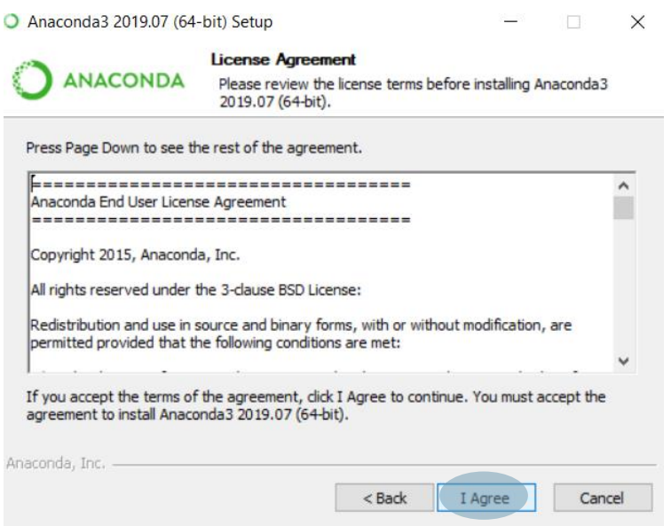
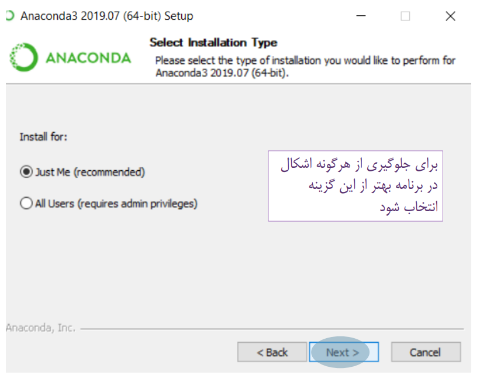
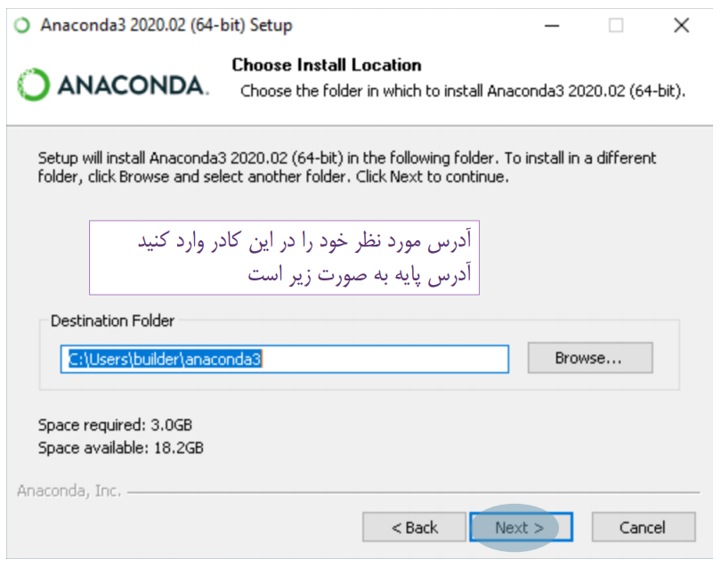
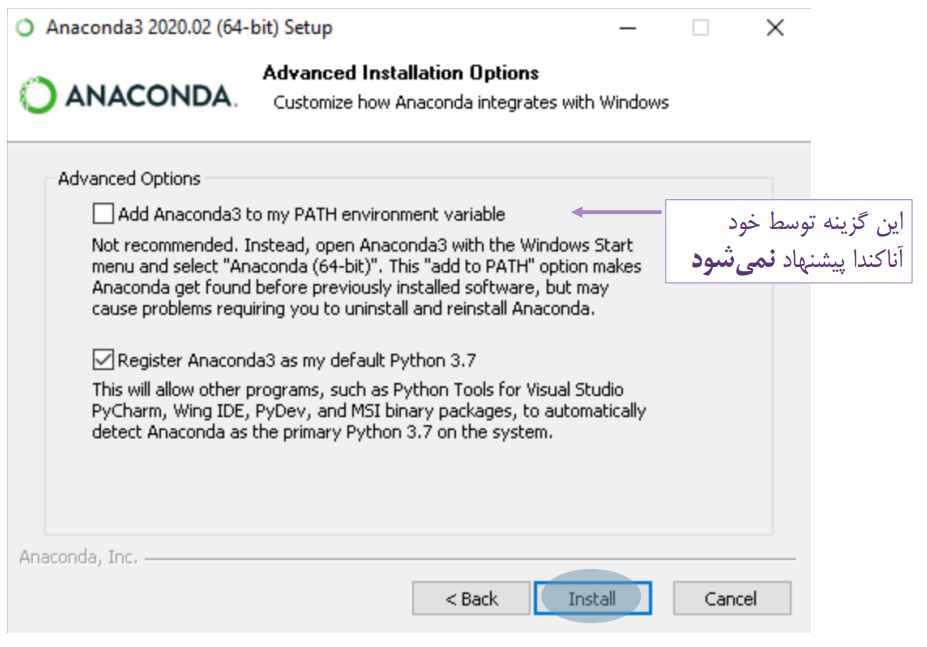
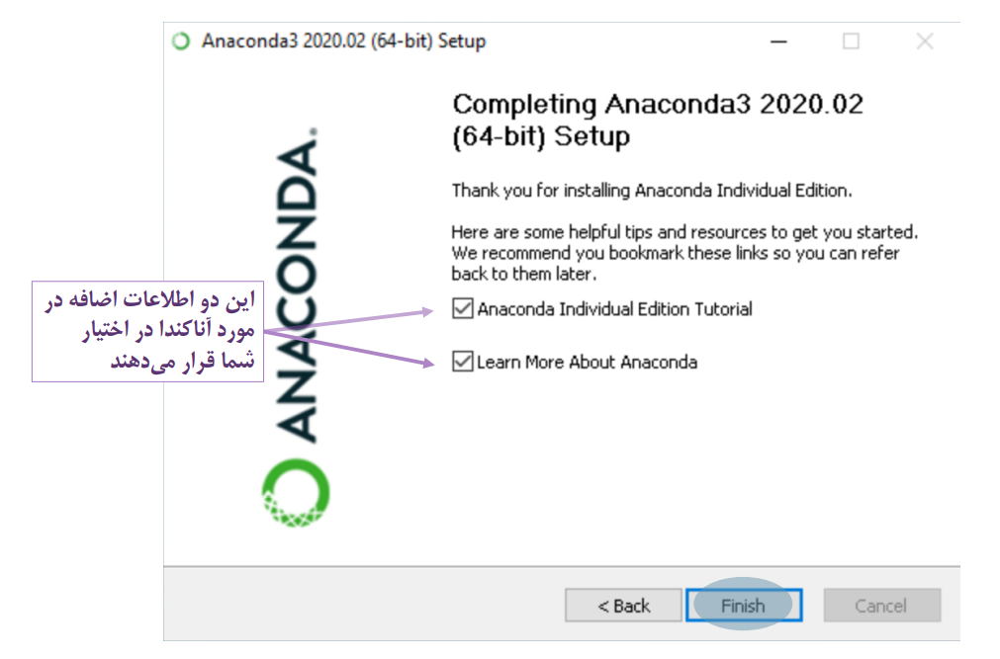
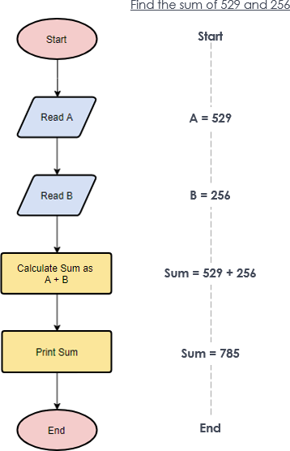
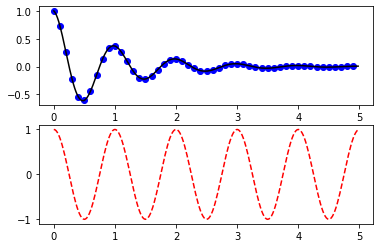
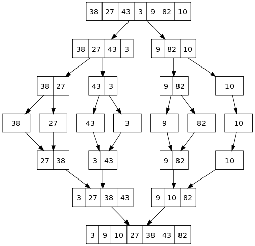
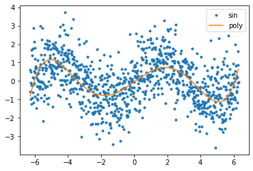

<div style="direction:rtl;line-height:300%;"><font face="XB Nazanin" size=5>
<div align=center>
<font face="IranNastaliq" size=40 color=#C35513>
<p></p>
به نام خدا
</font>
<br>
<font>
دانشگاه علامه طباطبائی - دانشکده آمار، علوم ریاضی و کامپیوتر
</font>
<br>
<font color=blue>
آموزش پایتون
</font>
<br>
نویسنده: نیلوفر مینوئی
، دکتر محمدرضا اصغری اسکوئی
    <br>
    استاد مدرس:  دکتر محمدرضا اصغری اسکوئی
    </div>
<hr/>
</font>
</div></div>

<div style="direction:rtl;line-height:300%;"><font face="XB Nazanin" size=5>
<div align=center>
<font color=#C35513>
معرفی درس و هدف درس
</font><p></p> 
</div>
 هدف از درس برنامه سازی (پایتون) توسعه و تعمیق دانش و مهارت دانشجویان در زمینه تفکر سیستمی، آلگوریتم و برنامه نویسی در محیط پایتون است. اهداف اصلی در این درس عبارتند از:
<br>
<ul>
<li>آشنائی با مبانی برنامه نویسی و ساختارهای برنامه سازی در پایتون </li>   
<li>آشنائی با توابع و ساختارهای پیشرفته از جمله لیست، دیکشنری، کلاس و آبجکت و ساختار توابع بازگشتی</li> 
<li>آشنائی با برنامه نویسی شی گرا، وراثت، برنامه های مرتب سازی و جستجو و مفهوم پیچیدگی محاسباتی </li>
<li>آشنائی با کتابخانه های پایتون Python, Numpy, Matplotlib … </li> 
<li> پیاده سازی و کسب مهارت انجام پروژه‌های درسی </li> 
</ul>
<hr> 
</font>
</div>

<div style="direction:rtl;line-height:300%;"><font face="XB Zar" size=4>
<h3><a  name="menu"> فهرست محتویات</a></h3>
<ol style="margin-right: 0;">
<li><a href="#section1">مقدمه بر ساختار رایانه و مبانی زبان های برنامه نویسی 	</a></li>
<li><a href="#section2">ویژگی‌های زبان پایتون و برنامه سازی و نصب محیط ژوپیتر پایتون 	</a></li>
<li><a href="#section3">متغیر، عبارت (Expression) و دستور (Statement)، اولین برنامه</a></li>
<li><a href="#section4">ساختار کنترل شرطی if و چند نمونه برنامه </a></li>
<li><a href="#section5">ساختار کنترل حلقه while, for  و چند نمونه برنامه </a></li>
<li><a href="#section6">تابع و انواع توابع، کتابخانه‌ای، ماجول و پکیج، تعریف تابع</a></li>
<li><a href="#section7">متغیر، عبارت عملگرهای محاسباتی و اعشاری </a></li>
<li><a href="#section8">متغیر، عبارترشته های حرفی (Strings) </a></li>
<li><a href="#section9">ساختارهای تاپل و لیست (List, Tuples) و ماتریس </a></li>
<li><a href="#section10">ماجول‌های محاسباتی، تصادفی و رسم نمودار  </a></li>
<li><a href="#section11">کار با فایل‌ها و ذخیره و بازیابی داده در فایل </a></li>
<li><a href="#section12">توابع بازگشتی و ساختار مجموعه و دیکشنری (Set, Dictionary) </a></li>
<li><a href="#section13">مفهوم کلاس و برنامه سازی شی گرا </a></li>
<li><a href="#section14">الگوریتم جستجو و مرتب سازی </a></li>
<li><a href="#section15">محاسبات ماتریسی با کتابخانه Numpy  و Scipy</a></li>
<li><a href="#section16">مروری بر مباحث </a></li>
</ol>
</font>
</div>

<font color=135FC3 size=6>
<p></p>
<div align=center><a  name="section1" href="#menu">فصل 1: مقدمه بر ساختار رایانه و مبانی زبان های برنامه نویسی</a></div>
</font>
<div style="direction:rtl;line-height:300%;"><font face="XB Nazanin" size=5>
<font color=#C31330>
<br>
در این بخش با مطالب زیر آشنا می‌شویم:
<ol>
 <li><a  href="#sub1sec1">برنامه چیست</a></li>
 <li><a  href="#sub2sec1">زبان برنامه‌نویسی چیست</a></li>
</ol>
</font>
<font color=#C31330>
<a  href="#menu">بازگشت به فهرست</a>
</font>
</font></div>

<div style="direction:rtl;line-height:300%;"><font face="XB Nazanin" size=5>
    <font color=#C31330 size=5>
    <p></p>
    <div align=center><a  name="sub1sec1">برنامه چیست</a>
    </div></font>
    <p></p>
    برنامه یک سری فعالیت ها و دستورات است که شما را به هدف یا جوابی که می‌خواهید می‌رساند. برای یک برنامه ابتدا باید یک مسئله وجود داشته باشد. سپس برای آن مسئله یک برنامه نوشته می‌شود که بتواند شما را به جواب برساند. 
    ممکن از یک جواب حدودی برای شما معیین شده باشد؛ اما در اکثر موارد جوابی در دست شما نیست و برنامه را به قصد یافتن جواب می‌نویسید. 
    <br>
</font>
</div>


<div style="direction:rtl;line-height:300%;"><font face="XB Nazanin" size=5>
    <font color=#C31330 size=5>
    <p></p>
    <div align=center><a  name="sub2sec1">زبان برنامه‌نویسی چیست</a>
    </div></font>
    <p></p>
    زبان برنامه نویسی دستورات مد نظر شما در یک برنامه را به طوری تعریف می‌کند که برای یک سیستم قابل فهم باشد.
    برخی زبان‌ها بسیار پایه‌ای هستند و برخی زبان‌ها در سطح‌های بسیار بالا و قابل فهم‌تر برای انسان تعریف شده‌اند.
    <br>
    به طور کلی زبان‌ها شامل 2 دسته سطح بالا و سطح پایین می‌شوند.
    در زبان های سطح بالا کاربر یا برنامه‌نویس دخالتی در مدیریت حافظه ندارد و به زبان انسان بسیار نزدیکتر است. پایتون، جاوا، جاوا اسکریپت، c# و بسیاری از زبان‌های دیگر در این دسته از زبان‌ها قرار می‌گیرند.
    در زبان‌های سطح پایین زبان اسمبلی(assembly) جزو این دسته از زبان‌ها است.
    اما دسته دیگری از زبان‌ها موجود است که در بین این دو قرار دارد. هم ویژگی‌های زبان‌های سطح بالا را دارد و هم ویژگی‌های زبان‌های سطح پایین.
    زبان C و C++ در این دسته قرار می‌گیرند.
    <br>
    از طرفی دیگر زبان های سطح بالا خود دارای 2 نوع مختلف هستند: مفسری و کامپایلری.
    <br>
    در زبان های مفسری کد خط به خط به زبان سطح پایین تبدیل می‌شود و اگر آن خط ایرادی نداشته باشد توسط سیستم اجرا می‌شود تا زمانی که خطی دارای خطا باشد.
    در زبان‌های کامپایلری کل کد یکجا به زبان سطح پایین تبدیل شده و در صورت نداشتن خطا در هیچ یک از خط ها اجرا می‌شود.
    <br>
    اما زبان پایتون می‌تواند در هر دو دسته قرار بگیرد. بسته به تنظیمات می‌تواند به صورت مفسری و یا کامپایلری اجرا شود.
    <br>
    <br>
</font>
</div>

<font color=135FC3 size=6>
<p></p>

<div align=center><a  name="section2" href="#menu">فصل 2: ویژگی‌های زبان پایتون و برنامه سازی و نصب محیط ژوپیتر پایتون</a></div>
</font>
<div style="direction:rtl;line-height:300%;"><font face="XB Nazanin" size=5>
<font color=#C31330>
مقدمه
</font><p></p>
زبان پایتون یکی از محبوب‌ترین زبان‌های برنامه نویسی است. این زبان از سال 2017 در صدرجدول محبوب ترین زبان‌های برنامه‌نویسی دنیا قرار دارد. علت آن سادگی این زبان  نسبت به زبان‌های محبوب و پرکاربرد دیگر مانند جاوا، سی و سی پلاس پلاس است. برای تولید برنامه اگر زبان انگیلیسی را به عنوان زبان گفتاری در نظر بگیرید، برنامه نوشتن با زبان پایتون مانند صحبت به این زبان است.<br>
برنامه‌نویسی نیز نوعی از تفکر است که با آن می‌توان انجام کاری را به کامپیوتر یا سیستم تحت فرمان شما القا کرد. در آغاز درک این بخش می‌تواند یکی از سخت‌ترین قسمت‌های کد نویسی باشد زیرا درک چگونگی عملکرد مغز کامپیوتری در این بخش قرار دارد.<br>
در ادامه با نصب محیط برنامه نویسی آناکندا و جزئیات بیشتر در مورد پایتون و درک زبان کامپیوتر آشنا می‌شویم: <br>
<a  name="section2menu">فهرست این فصل:</a>
<ol>
 <li><a  href="#sub1sec2">نصب آناکندا</a></li>
 <li><a  href="#sub2sec2">درک زبان کامپیوتر</a></li>
 <li><a  href="#sub3sec2">آشنایی مقدماتی با پایتون</a></li>
</ol>
</font>
<br>
<font color=#C31330>
<a  href="#menu">بازگشت به فهرست</a>
</font></div>

<font color=#C31330 size=5>
<p></p>
<div align=center><a  name="sub1sec2">نصب آناکندا</a></div></font>
<div style="direction:rtl;line-height:300%;"><font face="XB Nazanin" size=5>
<p></p>
در پایین 3 مرحله دانلود آناکندا را مشاهده می‌کنید: <br>
<br />
<table cellspacing="0" cellpadding="0" border="0">
    <tr>
        <td style="text-align: center;">
            
            <br />
            مرحله 1: <a href="https://www.anaconda.com/products/individual">سایت آناکندا</a>
        </td>
        <td style="text-align: center;">
            
            <br />
            مرحله 2
        </td>
    </tr>
    <tr>
        <td style="text-align: center;">
            
            <br />
            مرحله 3
        </td>
    </tr>
</table>
<br>
با توجه به سیستم خود نسخه مورد نظر را دانلود کنید. سپس با استفاده از مراحل زیر اقدام به نصب آناکندا کنید:<br>
    <br />
<table cellspacing="0" cellpadding="0" border="0">
    <tr>
        <td style="text-align: center;">
            
            <br />
            مرحله 1
        </td>
        <td style="text-align: center;">
            
            <br />
            مرحله 2
        </td>
    </tr>
    <tr>
        <td style="text-align: center;">
            
            <br />
            مرحله 3
        </td>
        <td style="text-align: center;">
            
            <br />
            مرحله 4
        </td>
    </tr>
    <tr>
        <td style="text-align: center;">
            
            <br />
            مرحله 5
        </td>
        <td style="text-align: center;">
            
            <br />
            مرحله 6
        </td>
    </tr>
    <tr>
        <td style="text-align: center;">
            
            <br />
            مرحله 7
        </td>
        <td style="text-align: center;">
            
            <br />
            مرحله 8
        </td>
    </tr>
</table>
<br>
با استفاده از مراحل بالا قادر به نسب آناکندا خواهید بود. آناکندا یک محیط کلی است که در آن می‌توانید به محیط های مختلف برای برنامه نویسی پایتون دسترسی پیدا کنید.
برای مثال در تصویر آخر 3 محیط مختلف مشاهده می‌کنید که هر کدام دسترسی‌های  خاصی را در اختیار شما قرار می‌دهند. در این کلاس بیشتر از دو محیط ژوپیتر نوت بوک و ژوپیتر لب استفاده می‌شود. این دو محیط سبک بوده و امکان اجرای جز به جز کد را برای ما فراهم می‌آورد. <br>
اسپایدر عموما برای اجرای یک فایل کامل پایتون به صورت یکجا مورد استفاده قرار می‌گیرد. فرمت فایل های ایجاد شده در ژوپیتر .ipynb
است و فرمت فایل های پایتون که در اسپایدر ایجاد می‌شوند عموما .py 
است که به عنوان فایل پایتون شناخته می‌شوند.
<br>
</font>
<br>
<font color=#C31330>
<a  href="#section2menu">بازگشت به فهرست</a>
</font></div>

<font color=#C31330 size=5>
<p></p>
<div align=center><a name="sub2sec2">درک زبان کامپیوتر</a></div></font>
<div style="direction:rtl;line-height:300%;"><font face="XB Nazanin" size=5>
<p></p>
برای برنامه نویسی نیاز است ابتدا هدف خود را مشخص کنید سپس آن را دسته بندی کنید. دسته بندی کار به صورت مرحله ای خواهد بود. هیچگاه نیاز نیست از ابتدای کار برنامه شما کامل و بدون ایراد باشد. برنامه کامل در ابتدا همیشه با آزمون و خطا به وجود می‌آید.
<br>
برای حل یک مسئله ابتدا باید مسئله را درک کرده، سپس یک راه حل اولیه برای آن در ذهن خود طراحی کنیم. پس از این مراحل نوبت به برنامه نویسی اولیه طرح ما می‌رسد. در نهایت برنامه را می‌آزماییم و در صورتی که نیاز به تغییرات داشت و یا خطایی در حین اجرای آن به وجود آمد، به مرحله قبل برمی‌گردیم و برنامه را بازنویسی می‌کنیم. در صورتی که در بازنویسی برنامه هیچ روند صعودی‌ای مشاهده نشود باید به مرحله قبل تر باز گشت و در طراحی اولیه بازبینی انجام شود.
<br>
برای مثال به نمونه زیر توجه کنید:
 
<br>
 یک مسئله ساده روشن نشدن چراغ می‌تواند مثال خوبی از فهم روند کار باشد. اولین روشی که به ذهن میرسد بررسی اتصال به برق است. در صورت جدا بودن از برق آن را روشن می‌کنیم. در صورتی که اتصال برقرار باشد و همچنان برق روشن نشود، سوختگی لامپ را بررسی می‌کنیم. اگر سوخته باشد لامپ را تعویض می‌کنیم. در غیر این صورت نیاز به یک چراغ جدید است.
<br>
نمونه دیگری از برنامه که به کد نویسی و زبان کامپیوتر نزدیک تر است نمونه برنامه زیر است که اعداد بزرگتر از صفر را تشخیص می‌دهد: 
 
<br>
ساده ترین کار برای تشخیص یک عدد مثبت استفاده از نماد ریاضی «بزرگتری» است. اگر عدد از صفر بزرگتر باشد به عنوان عدد بزرگتر از صفر یا مثبت اعلام می‌شود. در غیر این صورت هیچگونه اعلامی وجود ندارد.
<br>
اگر نیاز به اعلام عددهای کوچک تر از صفر بود به مراحل بالا چه چیزی اضافه می‌شد؟
<br>
کمی فراتر برویم. اگر بخواهیم 2 عدد را با هم جمع کنیم چه؟
<br>
ابتدا نیاز داریم 2 عدد را بگیریم (یا بخوانیم) سپس آن دو عدد را با هم جمع کنیم و در آخر مجموع را نمایش دهیم. فلوچارت این روند مشابه تصویر زیر خواهد بود:
    
<br>
حال فلوچارت بالا را به زبان خود توضیح دهید.
<br>
<font color=#C31330 size=4>
(یادگیری فلوچارت ضروری نیست و فقط برای درک بهتر از زبان کامپیوتر مورد استفاده قرار گرفته است)
</font>
<br>
حال روند مثال های زیر را به زبان خود بیان کنید:
<ol>
    <li>تبدیل دما از فارنهایت به درجه سانتیگراد</li>
    <li>عددی را به توان 2 رساندن</li>
    <li>به دست آوردن محیط یک مثلث</li>
</ol>
</font>
<br>
<font color=#C31330>
<a  href="#section2menu">بازگشت به فهرست</a>
</font></div>

<font color=#C31330 size=5>
<p></p>
<div align=center><a name="sub3sec2">آشنایی مقدماتی با پایتون</a></div></font>
<div style="direction:rtl;line-height:300%;"><font face="XB Nazanin" size=5>
<p></p>
    برای آن که با پایتون آشنایی اولیه پیدا کنیم، نیاز است ابتدا با برخی از تعریف‌های اولیه آشنا شویم:
    <br>
    
    برخی از کلمات خاص در زبان پایتون هستند که با آنها در آینده بیشتر آشنا می‌شویم.
    <br>
    برای مثال کلمه print از جمله این کلمات است که کاربرد آن نمایش هر آنچه درون آن نوشته شده است می‌باشد.
</font>
</div>


```python
print("به کلاس پایتون خوش آمدید")
```

    به کلاس پایتون خوش آمدید
    


```python
print("مقدار شما میتواند عدد باشد: ")
print(123)
print(-5)
print(3.14)
```

    مقدار شما میتواند عدد باشد: 
    123
    -5
    3.14
    


```python
print("شما میتوانید ابتدا عدد را به عنوان متغیر تعریف کنید و سپس آن را چاپ کنید")
a = 12
print(a)
```

    شما میتوانید ابتدا عدد را به عنوان متغیر تعریف کنید و سپس آن را چاپ کنید
    12
    

<div style="direction:rtl;line-height:300%;"><font face="XB Nazanin" size=5>
در واقع تابع print() برای خروجی در پایتون استفاده می‌شود.
<br>
    برای گرفتن ورودی از کاربر برنامه از کلمه input همانند نمونه زیر استفاده می‌شود:
</font></div>


```python
input()
```

    12
    


    '12'


<div style="direction:rtl;line-height:300%;"><font face="XB Nazanin" size=5>
برای نگهداری مقدار ورودی آن را در یک متغیر ذخیره می‌کنیم. در این حالت بعدا میتوانید از آن استفاده کنید.
    <br>
     برای درک بهتر مثال جمع دو عدد را در نظر بگیرید. آن را به صورت زیر پیاده سازی می‌کنیم:
</font></div>


```python
number1 = input()
number2 = input('عدد دوم را وارد کنید ')
sum_of_2_numbers = number1+number2
print(sum_of_2_numbers)
```

    2
    عدد دوم را وارد کنید 3
    23
    

<div style="direction:rtl;line-height:300%;"><font face="XB Nazanin" size=5>
با آن که راه حل ما درست به نظر می‌رسد اما جواب ما درست نیست. دلیل آن این است که ورودی ها در پایتون به صورت رشته هستند.
    <br>
    اما رشته چیست؟
    <br>
    تمام مقادیر در پایتون به شکلی تعریف می‌شوند. انواع متغیرها شامل رشته، اعداد(عدد صحیح، عدد اعشار و عدد مختلط) و انواع دیگری از مقادیر مانند لیست، دیکشنری و ... هستند.
    <br>
    با توجه به توضیحات برای آن که یک مقدار را به نوع دیگری از مقدار تبدیل کنیم نیاز به کَست کردن یا تبدیل یک نوع به نوع دیگر داریم.
</font></div>


```python
number1 = input("enter first number: ")
number2 = input('enter second number: ')
n1 = int(number1)
n2 = int(number2)
sum_of_2_numbers = n1+n2
print("The sum is ",sum_of_2_numbers)
```

    enter first number: 2
    enter second number: 3
    The sum is  5
    

<font color=#C31330>
<a  href="#section2menu">بازگشت به فهرست</a>
</font>

<div style="direction:rtl;line-height:300%;"><font face="XB Nazanin" size=5>
    <font color=135FC3 size=6>
<p></p>
<div align=center><a  name="section3" href="#menu">فصل 3: متغیر، عبارت (Expression) و دستور (Statement)، اولین برنامه</a></div>
</font>
<font color=#C31330>
مقدمه
</font><p></p>
در فصل گذشته با تعدادی از متغیرها آشنا شدیم. در این فصل مثال‌های بیشتری از آنها می‌بینیم. سپس عبارات بیشتر و دستورهای بیشتری را مرور کرده و برنامه های ساده‌ای را می‌نویسیم.<br>
<a  name="section3menu">فهرست این فصل:</a>
<ol>
 <li><a  href="#sub1sec3">انواع متغیر</a></li>
 <li><a  href="#sub2sec3">عبارت و دستور</a></li>
 <li><a  href="#sub3sec3">برنامه‌های ساده</a></li>
</ol>
</font>
<br>
<font color=#C31330>
<a  href="#menu">بازگشت به فهرست اصلی</a>
</font></div>

<font color=#C31330 size=5>
<p></p>
<div align=center><a name="sub1sec3">انواع متغیر</a></div></font>
<div style="direction:rtl;line-height:300%;"><font face="XB Nazanin" size=5>
<p></p>
    همان طور که در فصل گذشته به آن اشاره شد، انواع متغیرها در پایتون شامل اعداد، رشته ها، لیست، تاپل و دیکشنری است. برخلاف برخی دیگر از زبان‌های برنامه نویسی مانند cو java ، در پایتون نیاز به مشخص کردن نوع متغیر هنگام تعریف آن نیست. بسته به مقداری که برای متغیر تعیین می‌شود، نوع متغیر برای زبان پایتون مشخص می‌شود.
    بنابراین در صورتی که به متغیر به طور مثال a مقدار 2 تعریف شود، پایتون نوع آن را int در نظر می‌گیرد که عدد صحیح است.
    اگر برای آن مقدار 2.1 در نظر گرفته شود، متغیر a به عنوان float در نظر گرفته می‌شود که به معنای اعداد اعشاری است.
    اگر به آن مقدار '2' داده شود، آن را به عنوان یک رشته در نظر می‌گیرد.
    <br>
    به مثال های زیر در مورد انواع متغیر ها توجه کنید:
</font>
</div>


```python
a = 2
type(a) # عدد صحیح
```


    int


```python
a = 2.0
type(a) # عدد اعشار
```


    float


```python
a = '2'
type(a) # رشته
```


    str


<div style="direction:rtl;line-height:300%;"><font face="XB Nazanin" size=5>
<p></p>
    همان طور که مشاهده می‌کنید، متغیری به نام a سه مقدار متفاوت گرفته و با هر بار تعلق متغیر به آن، نوع آن نیز تغییر کرده است.
    بنابراین اگر در حین برنامه مقدار یک متغیر را تغییر بدهید دیگر نمی‌توانید به عملکرد سابق آن بازگردید.
    <br>
    <font color=#C31330>
    به همین دلیل از استفاده از کلمات کلیدی به عنوان نام متغیر خودداری کنید.
    </font>
    زیرا این کار باعث می‌شود این نام‌ها کارایی خود را از دست بدهند.
    <br>
    همچنین کلمه typeکه یکی از کلمات کلیدی هستند برای تشخیص نوع یک متغیر یا به طور کلی یک نام مورد استفاده قرار می‌گیرد.
    type می‌تواند انواع دیگری مانند توابع، کلاس‌ها و ... را نیز تشخیص بدهد.
    <br>
    <br>
    در برخی از توابع از پیش تعیین شده مانند print می‌توانید بیش از یک مقدار قرار دهید:
</font>
</div>


```python
a = "a string"
b = 123
print(a,b)
print('a is',a , 'and b is', b)
```

    a string 123
    a is a string and b is 123
    

<div style="direction:rtl;line-height:300%;"><font face="XB Nazanin" size=5>
<p></p>
    همچنین امکان کَست دو مقدار به هم (در صورت امکان تبدیل دو مثدار به هم) را نیز داریم. به این معنا که اگر عددی در غالب رشته باشد توانایی تبدیل آن به عدد را داریم.
    یا میتوانیم در صورت نیاز عددی را به رشته تبدیل کنیم. 
    <br>
    همچنین در برخی موارد پیش می‌آید که نیاز داریم در یک عدد اعشار تنها از قسمت صحیح آن استفاده کنیم. این کار هم با استفاده از کَست قابل انجام است:
</font>
</div>


```python
a = '2.3'
print(a,'before casting',type(a))
a = float(a)
print(a,'after casting',type(a))
```

    2.3 before casting <class 'str'>
    2.3 after casting <class 'float'>
    


```python
a = 3.14
print(a,'before casting',type(a))
a = str(a)
print(a,'after casting',type(a))
a = float(a)
print(a,'after casting again',type(a))
a = int(a)
print(a,'after casting again from float to int',type(a))
```

    3.14 before casting <class 'float'>
    3.14 after casting <class 'str'>
    3.14 after casting again <class 'float'>
    3 after casting again from float to int <class 'int'>
    

<div style="direction:rtl;line-height:300%;"><font face="XB Nazanin" size=5>
<p></p>
     به خاطر داشته باشید برخی از توابع در حالت عادی خروجی چاپی ندارند مانند type، به این معنا که اگر چند مورد از این توابع را پشت هم صدا کنید تنها آخرین عمل شما نمایش داده می‌شود.
    نمایش آخرین مقدار هم تنها به دلیل استفاده شما از ژوپیتر است زیرا ژوپیتر این امکان را به شما می‌دهد که خروجی یک تابع را بدون استفاده از تابع print ببینید.
    بنابراین برای مشاهده تمام خروجی‌ها حتما از print استفاده کنید.
    <br>
    
</font>
</div>


```python
a = "a string"
b = 123
type(a)
type(b)
```


    int


```python
print("a's type is",type(a))
print("b's type is", type(b))
```

    a's type is <class 'str'>
    b's type is <class 'int'>
    

<div style="direction:rtl;line-height:300%;"><font face="XB Nazanin" size=5>
<p></p>
    انواع دیگری از متغیرها که بعدا با آنها بیشتر آشنا می‌شوید به صورت زیر هستند:    
</font>
</div>


```python
b = True #  بولین که دو مقدار درست و غلط را به خود میگیرد
print(b, type(b))
```

    True <class 'bool'>
    


```python
l = [1,2,3,4] #لیست
print(l, type(l))
```

    [1, 2, 3, 4] <class 'list'>
    


```python
t = (1,2,3,4) # تاپل
print(t, type(t))
```

    (1, 2, 3, 4) <class 'tuple'>
    


```python
st = {1,2,2,3,4,5} # مجموعه
print(st, type(st))
```

    {1, 2, 3, 4, 5} <class 'set'>
    


```python
d = {'key1':1, 'key2':2} # دیکشنری
print(d, type(d))
```

    {'key1': 1, 'key2': 2} <class 'dict'>
    

<font color=#C31330>
<a  href="#section3menu">بازگشت به فهرست</a>
</font>

<font color=#C31330 size=5>
<p></p>
<div align=center><a name="sub2sec3">عبارت و دستور</a></div></font>
<div style="direction:rtl;line-height:300%;"><font face="XB Nazanin" size=5>
<p></p>
    در پایتون و تمامی زبان‌های برنامه نویسی دیگر، برای نوشتن یک کد نیاز به مجموعه ای از عبارات و دستورات دارید. هر خطی از کد که نوشته می‌شود مجموعه‌ای از دستورات و عبارات است.
    برای مثال کلمه print یک دستور و مقادیری که درون پرانتز آن قرار می‌گیرند عبارت است.
    <br>
    تمامی کلمات کلیدی نوعی دستور هستند. برای مثال کلمه بررسی شرط یا if یک نوع دستور است که مسئولیت آن بررسی درستی عبارتی است که درون آن قرار می‌گیرد.
    برخی از عبارات را در ادامه با هم میبینیم:
</font>
</div>


```python
1>2
```


    False


```python
1<2
```


    True


```python
1==1
```


    True


```python
2<=2
```


    True


```python
2<2
```


    False


<div style="direction:rtl;line-height:300%;"><font face="XB Nazanin" size=5>
<p></p>
    برخی عبارات بسیار ساده هستند. برای مثال عملیاتی مانند + و یا - برخی از عملگرهای ساده‌ای هستند که کار مشخص خود را انجام می‌دهند. 
    <br>
    <code>*</code> عملگرمربوط به ضرب دو مقدار
    <br>
    <code>/</code> عملگر مربوط به تقسیم
    <br>
    <code>**</code> عملگر مربوط به توان
    <br>
    <code>%</code> باقی مانده عدد اول نسبت به عدد دوم را نشان میدهد
    <br>
    <code>//</code> خارج قسمت عدد اول نسبت به عدد دوم را نشان میدهد
    <br>
    <br>
    همچنین عملگرهای دیگری هم هستند که برای بررسی صحیح یا غلط بودنِ وضعیت دو مقدار نسبت به هم از آنها استفاده می‌شود. برای مثال:
    <br>
    <code>==</code> آیا دو مقدار با هم برابرند
    <br>
    <code>=!</code> آیا دو مقدار با هم برابر نیستند
    <br>
    <code>&lt;</code> آیا مقدار اول بزرگتر از مقدار دوم است
    <br>
    <code>&gt;</code> آیا مقدار اول کوچکتر از مقدار دوم است
    <br>
    <code>=&lt;</code> آیا مقدار اول بزرگتر مساوی از مقدار دوم است
    <br>
    <code>=&gt;</code>   آیا مقدار اول کوچکتر مساوی از مقدار دوم است                
<br>
<br>
    از جمله برخی دستورات ساده می‌توان به دستورات شرطی و دستور حلقه اشاره کرد.
    دستور شرطی با عبارت ifشروع می‌شود. همانطور که در انگلیسی نیز از این کلمه استفاده می‌شود، در صورت استفاده از آن به دنبال درستی و یا نا درستی عبارت بعد آن هستیم:
    <br>
    برای مثال اگر عدد 1 بزرگتر از 2 باشد:
    <br>
    <div style="direction:ltr;line-height:300%;">
    <code>if 1>2:</code>
    </div>
    <br>
    همانطور که مشخص است منتظر یک عبار آنگاه هستیم ...
    <br>
    به عبارت بعد if عبارت شرطی می‌گویند که در صورت درست بودن آن وارد مرحله بعد در شرط می‌شود که همان عبارت آنگاه است و همچنین اگر عبارت شرطی درست نباشد، از دستورات داخل شرط صرف نظر می‌شود.
    <br>
     به مرور با این مطالب با مثال‌های متعدد بیشتر آشنا می‌شویم. به مثال‌های زیر توجه کنید:
</font>
</div>


```python
a = 1
b = 1.1
if a>b: #عبارت شرطی درست نیست پس وارد عبارت آنگاه که پرینت است نمیشویم
    print('a is bigger than b')
if a<b:# عبارت شرطی درست است پس وارد آنگاه میشویم
    print('a is smaller than b')
    
```

    a is smaller than b
    

<font color=#C31330 size=4>
<a  href="#section3menu">بازگشت به فهرست</a>
</font>

<font color=#C31330 size=5>
<p></p>
<div align=center><a name="sub2sec3">برنامه‌های ساده</a></div></font>
<div style="direction:rtl;line-height:300%;"><font face="XB Nazanin" size=5>
<p></p>
    با دانستن اطلاعات بالا می‌توانیم برخی از برنامه‌های ساده را نوشته و اجرا کنیم.
    <br>
</font>
</div>


```python
# محاسبه مساحت دایره
pi = 3.14159 # تعریف عدد پی
radius = 2.2 # تعریف اندازه شعاع
area = pi*(radius**2) # محاسبه مساحت با فرمول مریوطه
print(area) # نمایش مقدار مساحت
```

    15.205295600000001
    


```python
# حال استفاده از مقادیر بالا که از قبل تعیین شده
radius = radius + 1 # افزودن 1 به مقدار قبلی
print(area)     # در حال حاضر مقدار مساحت تغییری نکرده است
area = pi*(radius**2) # مساحت را دوباره حساب میکنیم 
print(area) # حال مساحت تغییر میکند
```

    15.205295600000001
    32.169881600000004
    


```python
#  جا به جایی دو متغیر با هم
x = input('Enter value of x: ')
y = input('Enter value of y: ')
temp = x
x = y
y = temp

print('The value of x after swapping: {}'.format(x)) # نوعی دیگر از روش های پرینت کردن
print('The value of y after swapping: {}'.format(y))
```

    Enter value of x: 10
    Enter value of y: 5
    The value of x after swapping: 5
    The value of y after swapping: 10
    


```python
# نوعی دیگر از جا به جایی دو متغیر با هم
x = 5
y = 10

x, y = y, x
print("x =", x)
print("y =", y)
```

    x = 10
    y = 5
    

<font color=#C31330 size=4>
<a  href="#menu">بازگشت به فهرست اصلی</a>
</font>

<div style="direction:rtl;line-height:300%;"><font face="XB Nazanin" size=5>
    <font color=135FC3 size=6>
<p></p>
<div align=center><a  name="section4" href="#menu">فصل 4: ساختار کنترل شرطی if چند نمونه برنامه</a></div>
</font>
<font color=#C31330>
مقدمه
</font><p></p>
    در فصل گذشته با شرط کمی آشنا شدیم. در این فصل آن را به دقت مورد بررسی قرار می‌دهیم و با چند نمونه برنامه با استفاده از if پیاده‌سازی می‌کنیم.<br>
    ابتدا از تعاریف اولیه عبارات شرطی شروع می‌کنیم و سپس به سراغ نمونه‌های ساده تا پیشرفته از عبارات شرطی می‌رویم.<br>
    همانطور که در فصل گذشته خواندیم، در if یک شرط قرار داده می‌شود. اگر این شرط برقرار باشد و جواب درست بدهد وارد شرط می‌شویم و کد آن را اجرا می‌کنیم.
    اگر این شرط برقرار نباشد از کدهای داخل شرط if رد می‌شویم و آنها را نادیده می‌گیریم.
    درک بهتری از این توصیفات در تصویر زیر قابل مشاهده است:
    <br>
    
    <br>
    به چند مثال ساده زیر توجه کنید:
</font>
</div>


```python
if 1>2:
    print('یک محال')
if 2>1:
    print('یک اتفاق همیشگی')
```

    یک اتفاق همیشگی
    


```python
name = 'Niloofar'
if name=='Niloofar': # بررسی برابری عبارت با استفاده از دو مساوی
    print('Your name is Niloofar')
else: # در صورتی که عبارت شرطی برقرار نباشد وارد این قسمت میشود
    print('Your name in not Niloofar but '+name)# نوعی دیگر از چاپ
```

    Your name is Niloofar
    

<div style="direction:rtl;line-height:300%;"><font face="XB Nazanin" size=5>
<p></p>
    در نمونه بالا عبارتی جدید مشاهده می‌کنید.
    در کل دستور if با دو عبارت elif و else همراه است.
    دستور elif به معنای "اگرنه" است و در صورتی بررسی می‌شود که عبارت شرطی قبلی درست نباشد.
    دستور else نیز حالتی است که هیچ یک از دستورات شرطی قبلی بر قرار نباشند و در نهایت به این دستور می‌رسیم. بنابراین بدون هیچ شرطی وارد این دستور می‌شود.
    <br>
    <font color='C31330'>
    به خاطر داشته باشید که این دو دستور همیشه به دنبال دستور if می‌آیند و بدون آن بی معنی هستند.
    </font><br>
    به مثال‌های زیر توجه کنید:
</font>
</div>


```python
n = input('Enter a number: ') #به خاطر داشته باشید عددی که وارد میکنید به صورت رشته است و باید به عدد تبدیل شود
n = int(n)
if n>0:
    print('Your number is positive')
elif n<0:
    print('Your number is negative')
else:
    print('Your number is 0')

```

    Enter a number: 0
    Your number is 0
    

<div style="direction:rtl;line-height:300%;"><font face="XB Nazanin" size=5>
<p></p>
    در مثال بالا در صورتی که عدد مثبت وارد کنید، عبارت داخل if اجرا می‌شود و دیگر دستورات بعدی که elif و else هستند خوانده نمی‌شوند.
    اگر عدد وارد شده منفی باشد، دستور if بررسی می‌شود و چون برقرار نیست بدون وارد شدن به کد داخل آن به بررسی دستور بعدی می‌رود.
    از آنجایی که عدد منفی است و این شرط برقرار می‌شود برنامه های داخل آن خوانده می‌شوند و از دستورات شرطی بعدی صرف نظر می‌شود.
    در صورتی که عدد وارد شده صفر باشد، دستور if بررسی می‌شود سپس دستور elif بررسی می‌شود و در آخر بدون هیچ بررسی اضافه‌ای وارد else می‌شود و دستورات آن را اجرا می‌کند.
    <br>
    حال یک بازی میسازیم.
    در این بازی یک عدد به طور تصادفی توسط کامپیوتر بین 1 تا 10 انتخاب می‌شود. سپس از شما خواسته می‌شود که عدد را حدس بزنید.
    در نهایت حدس شما با حدس برنامه مقایسه می‌شود و نتیجه به شما اعلام می‌شود.
</font>
</div>


```python
### این قسمت مربوط به حدس است و فعلا نیازی به یادگیری آن نیست ####
from numpy.random import randint
n = randint(1,11)
################################################################
guess = int(input('Enter your guess: ')) # عدد حدسی خود را وارد میکنید. این عدد همینجا تبدیل به اینت میشود

if guess==n:
    print('حدس شما درست بود')
elif guess<1 or guess>10:
    print('شما بین 1 تا 10 حدس نزدید')
elif guess>n:
    print('حدس شما بیشتر از عدد بود')
else:
    print('حدس شما کمتر از عدد بود')
    
print('The number was',n)
```

    Enter your guess: 2
    حدس شما کمتر از عدد بود
    The number was  8
    

<div style="direction:rtl;line-height:300%;"><font face="XB Nazanin" size=5>
<p></p>
    با استفاده از شرط‌های تو در تو می‌توان حالت های بیشتری را بررسی کرد.
    <br>
    شرط‌های تو در تو را می‌توان به طورت زیر پیاده‌سازی کرد:
</font>
</div>


```python
### این قسمت مربوط به حدس است و فعلا نیازی به یادگیری آن نیست ####
from numpy.random import randint
n = randint(1,11)
################################################################
guess = int(input('Enter your guess: ')) # عدد حدسی خود را وارد میکنید. این عدد همینجا تبدیل به اینت میشود

if guess==n:
    print('حدس شما درست بود')
elif guess<1 or guess>10:
    print('شما بین 1 تا 10 حدس نزدید')
elif guess>n:
    print('حدس شما بیشتر از عدد بود')
    print("یک عدد دیگر بین 1 و  "+str(guess)+" انتخاب کنید")
    newguess = int(input('Enter your new guess: '))
    if guess==n:
        print('حدس شما درست بود')
    elif newguess<1 or newguess>10:
        print('شما بین 1 تا 10 حدس نزدید')
    elif newguess>n:
        print('حدس شما بیشتر از عدد بود')
    else:
        print('حدس شما کمتر از عدد بود')
else:
    print('حدس شما کمتر از عدد بود')
    print("یک عدد دیگر بین "+str(guess)+" و 10 انتخاب کنید")
    newguess = int(input('Enter your new guess: '))
    if guess==n:
        print('حدس شما درست بود')
    elif newguess<1 or newguess>10:
        print('شما بین 1 تا 10 حدس نزدید')
    elif newguess>n:
        print('حدس شما بیشتر از عدد بود')
    else:
        print('حدس شما کمتر از عدد بود')
    
print('The number was',n)
```

    Enter your guess: 5
    حدس شما کمتر از عدد بود
    یک عدد دیگر بین 5 و 10 انتخاب کنید
    Enter your new guess: 9
    حدس شما بیشتر از عدد بود
    The number was 7
    

<div style="direction:rtl;line-height:300%;"><font face="XB Nazanin" size=5>
<p></p>
    در مثال بالا در نگاه اول یک پیچیدگی در کد میبینیم. اما در صورت دقت بیشتر به میبینیم که در هر یک از شرایط بالا بار دیگر از همان روند حدسی استفاده شده است و به این صورت برای بار دیگر عدد حدسی بررسی می‌شود و نتیجه را به بیننده اعلام می‌کند.
</font>
    <br>
<font color=#C31330 size=4>
<a  href="#menu">بازگشت به فهرست اصلی</a>
</font>
</div>

<div style="direction:rtl;line-height:300%;"><font face="XB Nazanin" size=5>
    <font color=135FC3 size=6>
<p></p>
<div align=center><a  name="section5" href="#menu">فصل 5: ساختار کنترل حلقه while, for و چند نمونه برنامه</a></div>
</font>
<font color=#C31330>
مقدمه
</font><p></p>
    در فصل قبل در مورد عبارت های شرطی صحبت کردیم و یک بازی نوشتیم که در آن باید یک عدد را که توسط کامپیوتر انتخاب شده بود را حدس می‌زدیم.
    پیش بردن این برنامه تنها با عبارت های شرطی بسیار زمانبر است. برای آنکه بتوانیم با شیوه بهتری کد بنویسیم نیازمند حلقه‌ها نیز هستیم.
    <br>
    حلقه‌ها در پیاده سازی برنامه‌ها به شدت به کمک برنامه نویس می‌آیند. یکی از استفاده‌های آنها(همانطور که گفته شد) در پیاده‌سازی برنامه‌هایی است که نیازمند تکرار یک سری کد هستند.
    <br>
    برای مثال فرض کنید می‌خواهید اعداد 1 تا 10 را به ترتیب چاپ کنید و یا یک دنباله را پیاده‌سازی کنید و یا کارهایی از این دست؛ در این حالت‌ها نیازمند استفاده از حلقه‌ها هستید.
    <br>
    برای نوشتن حلقه در پایتون می‌توان از دو مدل 
    <code>for</code>
    و
    <code>while</code>
    استفاده کرد.
    هر یک از این حلقه‌ها، ویژگی مربوط به خود را دارند و بنا به این ویژگی و کاری که می‌خواهید در آن از این دو استفاده کنید می‌توانند گزینه بهتری برای کد شما باشند.
    در این فصل با هر دوی این نمونه‌ها آشنا می‌شویم.
    <br>
    <br>
    حال با هم دو نمونه ساده از یک برنامه ساده جهت چاپ اعداد از 0 تا 9 را می‌بینیم و آنها را به دقت و ریز به ریز بررسی می‌کنیم:
</font>
</div>


```python
for i in range(10):
    print(i)
```

    0
    1
    2
    3
    4
    5
    6
    7
    8
    9
    

<div style="direction:rtl;line-height:300%;"><font face="XB Nazanin" size=5>
<p></p>
در این کد بالا برای نوشتن اعداد از 0 تا 9 تنها از 2 خط کد استفاده شده است.
در خط اول عبارت
<code>for</code>
را داریم. برای پیاده‌سازی حلقه
<code>for</code>
به چند قسمت نیاز داریم:
    <br>
    1. متغیری که آن را در حلقه جلو می‌بریم (در اینجا از i استفاده شده است)
    <br>
    2. یک ویژگی  قابل جلو بردن، برای مثال یک لیست یا ماژول range* که یک ویژگی از پیش تعیین شده است و در آن می‌توان تکرار** را تعریف کرد.
    <br>
    <br>
    با استفاده از این ویژگی‌ها می‌توان یک حلقه را نوشت و از آن استفاده کرد.
    <br>
    <br>
    * عبارت 
    <code>range</code>
    یک تابع است (با توابع در ادامه درس بیشتر آشنا می‌شویم) که در آن می‌توانیم به چند روش پیش برویم. ساده‌ترین حالت استفاده از آن که در این کد از آن بهره گرفته شده است آوردن تنها مقدار پایانی است.
    برای مثال 
    <code>range(10)</code>
    به این معنا است که از 0 شروع کن و تا یکی قبل از 10 پیش برو که همان 9 است.
    حالت بعدی زمانی است که هم شروع و هم پایان رو برای آن تعیین می‌کنیم.
    برای مثال
    <code>range(1,11)</code>
     که در این حالت عدد ما به جای شروع از 0، از 1 شروع می‌شود و تا 10 جلو می‌رود و دیگر به 11 نمی‌رسد.
    و در حالت آخر می‌توانیم قدم را هم برای آن مشخص کنیم. برای مثال می‌گوییم دوتا دوتا جلو برود.
    در این صورت داریم
    <code>range(1,11,2)</code>
    که در آن 2 عدد قدم است و بعد از 1، 3 و سپس 5 و ...، تا 9 را داریم و دیگر 11 اجرا نمی‌شود.
    <br>
    <font color='C31330'>
    نکته: به خاطر داشته باشید که در range تنها اعداد صحیح قرار می‌گیرند و به محض اعشاری شدن، به شما خطا می‌دهد.
    </font>
    <br>
    ** منظور از تکرار کلمه iteration است. در iterator ها یک اتفاق به ترتیبی که در آن تعریف شده جلو می‌رود. range یک نوع iterator است.
    <br>
    <br>
    در پایین همان برنامه بالا را با استفاده از حلقه
    <code>while</code>
    تعریف کرده‌ایم:
</font>
</div>


```python
i = 0
while i<10:
    print(i)
    i=i+1
```

    0
    1
    2
    3
    4
    5
    6
    7
    8
    9
    

<div style="direction:rtl;line-height:300%;"><font face="XB Nazanin" size=5>
<p></p>
    حلقه 
    <code>while</code>
    مانند یک عبارت شرطی می‌ماند؛ با این تقاوت که تا زمانی که شرط آن برقرار نشود از محدوده آن بیرون نمی‌آید. بنابراین اگر بنویسید
    <code>while(True):</code>
    یا هر شرطی که هیچ وقت اتفاق نمی‌افتد را به عنوان شرط خروجی بگذارید، هیچگاه از این حلقه خارج نمی‌شود و رم شما بعد از مدتی پر شده و پیام خطا دریافت می‌کنید.
    <font color='C31330'>
    به خاطر داشته باشید که این عبارت مانند if است و اگر عبارت غلطی در ورودی آن بگذارید وارد while نخواهد شد.
    </font>
    <br>
    بنابراین برای تولید یک حلقه با استفاده از
    <code>while</code>
    تنها به یک شرط نیاز داریم؛ اما باید حواسمان باشد در داخل این حلقه طوری برنامه نوشته شود که به آن شرط برسیم.
    مثلا در برنامه بالا، شرط ما رساندن متغیر تعریف شده i به عدد 9 است ( از آنجایی که گفته‌ایم i اکید کوچکتر از 10 باشد).
    سپس با استفاده از عبارت
    <code>i = i+1</code>
    در هر بار تکرار حلقه یک واحد به آن اضافه کردیم تا زمانی که به 10 برسد و حلقه دیگر ادامه پیدا نکند و قبل از چاپ از آن خارج شود.
    <br>
    <br>
    حال چند مثال دیگر را با هم در زیر می‌بینیم:
    <br>
    ابتدا دنباله زیر را پیاده‌سازی می‌کنیم:
    <br>
    <code>a(n) = 2*a(n-1), a(1) = 1</code>
    <br>
    در دنباله بالا بنا به عددی که انتخاب می‌شود به همان تعداد 2 در مقدار قبلی ضرب می‌شود. به طور کلی 2 به توان عدد n می‌رسد.
</font>
</div>


```python
# پیاده سازی با for
a = 1
n = 10
for i in range(n):
    a = 2*a
print(a)
```

    1024
    


```python
# پیاده سازی با while
a = 1
n = 10
i = 0
while i<n:
    a=2*a
    i+=1 #همان i=i+1
    # عبارت بالا نوعی دیگر برای پیاده سازی این نوع عبارت ها است و برای تمامی اعمال ریاضی کاربردی است
print(a)
```

    1024
    

<div style="direction:rtl;line-height:300%;"><font face="XB Nazanin" size=5>
<p></p>
    حال فرض کنید می‌خواهیم اعداد را با یک فاصله کنار هم چاپ کنیم. اینجا تنها مهارتی که لازم است نوع استفاده از print است:
</font>
</div>


```python
# with for:
n=5
for i in range(n):
    print(i, end='\t')# اند مشخص میکند که پس از چاپ تابع چه کاری انجام دهد و ما به آن گفتیم که از تَب استفاده کند
    
```

    0	1	2	3	4	


```python
# with while:
n = 5
i = 0
while i<n:
    print(i, end = '\t')
    i+=1
```

    0	1	2	3	4	

<div style="direction:rtl;line-height:300%;"><font face="XB Nazanin" size=5>
<p></p>
    با دانستن مراحل بالا به سراغ چاپ یک ماتریس می‌رویم.
    همانطور که می‌دانید برای نوشتن یک ماتریس(منظور نوشتن اعداد به شکل ماتریسی است و نه خود ماتریس در پایتون) نیاز است تا اعداد به تعداد کنار هم و به تعدادی زیر هم نوشته شوند.
    <font color='C31330'>
    در این حالت نیاز است از حلقه‌های تو در تو استفاده شود.
    </font>
    در ادامه با استفاده از for یک نوشتار ماتریسی را پیاده سازی می‌کنیم.
</font>
</div>


```python
# پیاده سازی نوشتاری یک ماتریس 3 در 3
for i in range(3):# تعداد سطر ها را مشخص میکند
    for j in range(3):# تعداد ستون ها را مشخص میکند
        print(1, end = '\t')
    print()#برای آن که در انتهای خط یک اینتر داشته باشیم و به خط بعد برویم
```

    1	1	1	
    1	1	1	
    1	1	1	
    

<div style="direction:rtl;line-height:300%;"><font face="XB Nazanin" size=5>
<p></p>
    با استفاده از مثال بالا یک ماتریس 4 در 4 بنویسید که درایه های آن از 1 تا 16 برود.
    (این مثال را خود پیاده سازی کنید)
</font>
</div>


```python

```

<div style="direction:rtl;line-height:300%;"><font face="XB Nazanin" size=5>
<p></p>
    حال بازی قبل را که حدس زدن عدد بود با استفاده از حلقه تکمیل می‌کنیم.
    من در اینجا از حلقه while استفاده می‌کنم.
</font>
</div>


```python
### این قسمت مربوط به حدس است و فعلا نیازی به یادگیری آن نیست ####
from numpy.random import randint
n = randint(1,11)
################################################################
guess = int(input('Enter your guess: ')) # عدد حدسی خود را وارد میکنید. این عدد همینجا تبدیل به اینت میشود

while guess!=n: #تبدیل ایف به وایل
    if guess<1 or guess>10:
        print('شما بین 1 تا 10 حدس نزدید')
    elif guess>n:
        print('حدس شما بیشتر از عدد بود')
    else:
        print('حدس شما کمتر از عدد بود')
    guess = int(input('Enter your guess: ')) # گرفتن دوباره حدس قبل از تکرار دوباره حلقه
    

print('حدس شما درست بود')
print('The number was',n)
```

    Enter your guess: 5
    حدس شما کمتر از عدد بود
    Enter your guess: 7
    حدس شما درست بود
    The number was 7
    

<div style="direction:rtl;line-height:300%;"><font face="XB Nazanin" size=5>
<p></p>
    در پایان نیاز است در مورد عملگر break و کاربرد آن در حلقه ها نیز صحبت کنیم.
    در برخی موارد نمی‌توانیم شرط خاصی در ابتدا برای حلقه while تعیین کنیم و یا پس از اتفاقی می‌خواهیم به کار حلقه پایان بدهیم.
    در این صورت می‌توانیم با استفاده از عبارت شرطی if، اگر اتفاق مورد نظر افتاد به کار حلقه پایان بدهیم و این کار بدون در نظر گرفتن شرط while و ادامه تکرارهای for اتفاق می‌افتد.
    نمونه ای از این عملکرد را در زیر می‌بینیم:
</font>
</div>


```python
# نمونه ای ساده در استفاده از برک در فور
for i in range(2,100000):
    print(i)
    if i%973==0:
        break

```

    2
    3
    4
    5
    6
    7
    8
    9
    10
    11
    12
    13
    14
    15
    16
    17
    18
    19
    20
    21
    22
    23
    24
    25
    26
    27
    28
    29
    30
    31
    32
    33
    34
    35
    36
    37
    38
    39
    40
    41
    42
    43
    44
    45
    46
    47
    48
    49
    50
    51
    52
    53
    54
    55
    56
    57
    58
    59
    60
    61
    62
    63
    64
    65
    66
    67
    68
    69
    70
    71
    72
    73
    74
    75
    76
    77
    78
    79
    80
    81
    82
    83
    84
    85
    86
    87
    88
    89
    90
    91
    92
    93
    94
    95
    96
    97
    98
    99
    100
    101
    102
    103
    104
    105
    106
    107
    108
    109
    110
    111
    112
    113
    114
    115
    116
    117
    118
    119
    120
    121
    122
    123
    124
    125
    126
    127
    128
    129
    130
    131
    132
    133
    134
    135
    136
    137
    138
    139
    140
    141
    142
    143
    144
    145
    146
    147
    148
    149
    150
    151
    152
    153
    154
    155
    156
    157
    158
    159
    160
    161
    162
    163
    164
    165
    166
    167
    168
    169
    170
    171
    172
    173
    174
    175
    176
    177
    178
    179
    180
    181
    182
    183
    184
    185
    186
    187
    188
    189
    190
    191
    192
    193
    194
    195
    196
    197
    198
    199
    200
    201
    202
    203
    204
    205
    206
    207
    208
    209
    210
    211
    212
    213
    214
    215
    216
    217
    218
    219
    220
    221
    222
    223
    224
    225
    226
    227
    228
    229
    230
    231
    232
    233
    234
    235
    236
    237
    238
    239
    240
    241
    242
    243
    244
    245
    246
    247
    248
    249
    250
    251
    252
    253
    254
    255
    256
    257
    258
    259
    260
    261
    262
    263
    264
    265
    266
    267
    268
    269
    270
    271
    272
    273
    274
    275
    276
    277
    278
    279
    280
    281
    282
    283
    284
    285
    286
    287
    288
    289
    290
    291
    292
    293
    294
    295
    296
    297
    298
    299
    300
    301
    302
    303
    304
    305
    306
    307
    308
    309
    310
    311
    312
    313
    314
    315
    316
    317
    318
    319
    320
    321
    322
    323
    324
    325
    326
    327
    328
    329
    330
    331
    332
    333
    334
    335
    336
    337
    338
    339
    340
    341
    342
    343
    344
    345
    346
    347
    348
    349
    350
    351
    352
    353
    354
    355
    356
    357
    358
    359
    360
    361
    362
    363
    364
    365
    366
    367
    368
    369
    370
    371
    372
    373
    374
    375
    376
    377
    378
    379
    380
    381
    382
    383
    384
    385
    386
    387
    388
    389
    390
    391
    392
    393
    394
    395
    396
    397
    398
    399
    400
    401
    402
    403
    404
    405
    406
    407
    408
    409
    410
    411
    412
    413
    414
    415
    416
    417
    418
    419
    420
    421
    422
    423
    424
    425
    426
    427
    428
    429
    430
    431
    432
    433
    434
    435
    436
    437
    438
    439
    440
    441
    442
    443
    444
    445
    446
    447
    448
    449
    450
    451
    452
    453
    454
    455
    456
    457
    458
    459
    460
    461
    462
    463
    464
    465
    466
    467
    468
    469
    470
    471
    472
    473
    474
    475
    476
    477
    478
    479
    480
    481
    482
    483
    484
    485
    486
    487
    488
    489
    490
    491
    492
    493
    494
    495
    496
    497
    498
    499
    500
    501
    502
    503
    504
    505
    506
    507
    508
    509
    510
    511
    512
    513
    514
    515
    516
    517
    518
    519
    520
    521
    522
    523
    524
    525
    526
    527
    528
    529
    530
    531
    532
    533
    534
    535
    536
    537
    538
    539
    540
    541
    542
    543
    544
    545
    546
    547
    548
    549
    550
    551
    552
    553
    554
    555
    556
    557
    558
    559
    560
    561
    562
    563
    564
    565
    566
    567
    568
    569
    570
    571
    572
    573
    574
    575
    576
    577
    578
    579
    580
    581
    582
    583
    584
    585
    586
    587
    588
    589
    590
    591
    592
    593
    594
    595
    596
    597
    598
    599
    600
    601
    602
    603
    604
    605
    606
    607
    608
    609
    610
    611
    612
    613
    614
    615
    616
    617
    618
    619
    620
    621
    622
    623
    624
    625
    626
    627
    628
    629
    630
    631
    632
    633
    634
    635
    636
    637
    638
    639
    640
    641
    642
    643
    644
    645
    646
    647
    648
    649
    650
    651
    652
    653
    654
    655
    656
    657
    658
    659
    660
    661
    662
    663
    664
    665
    666
    667
    668
    669
    670
    671
    672
    673
    674
    675
    676
    677
    678
    679
    680
    681
    682
    683
    684
    685
    686
    687
    688
    689
    690
    691
    692
    693
    694
    695
    696
    697
    698
    699
    700
    701
    702
    703
    704
    705
    706
    707
    708
    709
    710
    711
    712
    713
    714
    715
    716
    717
    718
    719
    720
    721
    722
    723
    724
    725
    726
    727
    728
    729
    730
    731
    732
    733
    734
    735
    736
    737
    738
    739
    740
    741
    742
    743
    744
    745
    746
    747
    748
    749
    750
    751
    752
    753
    754
    755
    756
    757
    758
    759
    760
    761
    762
    763
    764
    765
    766
    767
    768
    769
    770
    771
    772
    773
    774
    775
    776
    777
    778
    779
    780
    781
    782
    783
    784
    785
    786
    787
    788
    789
    790
    791
    792
    793
    794
    795
    796
    797
    798
    799
    800
    801
    802
    803
    804
    805
    806
    807
    808
    809
    810
    811
    812
    813
    814
    815
    816
    817
    818
    819
    820
    821
    822
    823
    824
    825
    826
    827
    828
    829
    830
    831
    832
    833
    834
    835
    836
    837
    838
    839
    840
    841
    842
    843
    844
    845
    846
    847
    848
    849
    850
    851
    852
    853
    854
    855
    856
    857
    858
    859
    860
    861
    862
    863
    864
    865
    866
    867
    868
    869
    870
    871
    872
    873
    874
    875
    876
    877
    878
    879
    880
    881
    882
    883
    884
    885
    886
    887
    888
    889
    890
    891
    892
    893
    894
    895
    896
    897
    898
    899
    900
    901
    902
    903
    904
    905
    906
    907
    908
    909
    910
    911
    912
    913
    914
    915
    916
    917
    918
    919
    920
    921
    922
    923
    924
    925
    926
    927
    928
    929
    930
    931
    932
    933
    934
    935
    936
    937
    938
    939
    940
    941
    942
    943
    944
    945
    946
    947
    948
    949
    950
    951
    952
    953
    954
    955
    956
    957
    958
    959
    960
    961
    962
    963
    964
    965
    966
    967
    968
    969
    970
    971
    972
    973
    


```python
# حال بازی خود را جوری طراحی میکنیم که اگر کاربر بین 1 تا 10 انتخاب نکرد جریمه شود
### این قسمت مربوط به حدس است و فعلا نیازی به یادگیری آن نیست ####
from numpy.random import randint
n = randint(1,11)
################################################################
guess = int(input('Enter your guess: ')) 

while guess!=n:
    if guess<1 or guess>10:# اگر کاربر قوانین بازی را رعایت نکند از بازی منع میشود
        print('شما بین 1 تا 10 حدس نزدید. از بازی خارج میشوید')
        break # در اینجا از حلقه خارج میشویم 
    elif guess>n:
        print('حدس شما بیشتر از عدد بود')
    else:
        print('حدس شما کمتر از عدد بود')
    guess = int(input('Enter your guess: ')) 

if guess == n: # به این شرط نیاز داریم تا اگر کاربر از قوانین سرپیچی کرد و از حلقه خارج شد چاپ پایین اجرا نشود
    print('حدس شما درست بود')

print('The number was',n)
```

    Enter your guess: 3
    حدس شما کمتر از عدد بود
    Enter your guess: 11
    شما بین 1 تا 10 حدس نزدید. از بازی خارج میشوید
    The number was 7
    

<div style="direction:rtl;line-height:300%;"><font face="XB Nazanin" size=5>
<p></p>
    بنابراین جا چند خط ساده بازی خودمان را تکمیل کردیم.
    در فصل آینده با توابع آشنا می‌شویم که یکی از کاربردی‌ترین و اصلی‌ترین بخش‌های برنامه نویسی است.
    <br>
    <a  href="#menu">بازگشت به فهرست اصلی</a>
</font>
</div>

<font color=135FC3 size=6>
<p></p>

<div align=center><a  name="section6" href="#menu">فصل 6: تابع و انواع توابع کتابخانه‌ای، ماجول و پکیج، تعریف تابع</a></div>
</font>
<div style="direction:rtl;line-height:300%;"><font face="XB Nazanin" size=5>
<font color=#C31330>
مقدمه
</font><p></p>
    تا اینجا با دانستن شرط و حلقه توانستیم برخی برنامه‌های ساده را بنویسیم. همچنین از برخی ویژگی‌های از پیش تعیین شده مانند print نیز استفاده کردیم.
    همانطور که گفتم print یک تابع است. از توابع استفاده‌های زیادی می‌شود.
    گاهی خودمان آنها را می‌نویسیم و گاهی از نمونه‌های از پیش تعیین شده مانند print استفاده می‌کنیم.
    توابع مانند حلقه‌ها دارای چند قسمت اساسی هستند.
    به شکل زیر توجه کنید:
    <br>
    
    <br>
    برای تعریف یک تابع نیازمند چند بخش هستیم.
    <br>
    1. تعریف کلمه کلیدی def
    <br>
    2. نامی که برای آن تابع در نظر داریم
    <br>
    3. تعریف نام برای ورودی هایی که قرار است در تابع از آن ها استفاده کنیم
    <br>
    4. دو نقطه که در تمامی تعاریف ( همانطور که قبلا در شرط و حلقه هم دیدیم) باید حتما آورده شود
    <br>
    5. تعریف بدنه تابع یا همان عملیاتی که قرار است برروی ورودی انجام گیرد
    <br>
    6. و در نهایت برگرداندن خروجی مد نظر با استفاده از کلمه کلیدی return
    <br>
    <br>
    تابع پرینت نیز یکی از همین انواع است.
    یک یا چند مقدار را به عنوان ورودی می‌گیرد و کار آن نمایش این ورودی‌ها در خروجی سیستم است. غیر از ورودی های نمایشی متغیرهای دیگری هم می‌تواند بگیرد که تنظیمات نمایش خروجی را تغییر می‌دهند؛ مانند تغییر کاراکتر پایانی از enter به tab و یا space و بسیاری ویژگی‌های دیگر که قابل تغییر هستند.
    <br>
    برای درک بهتر آنچه گفته شده به چند مثال ساده زیر توجه کنید:
</font>
</div>


```python
# برنامه ای برای بازگرداندن جمع 3 عدد
def add3(a,b,c):
    s = a+b+c
    return s
add3(1,2,3)# توجه کنید که این خط نمایش داده نمیشود زیرا آن زا پرینت نکرده ایم و این باعث میشود نمایش داده نشود
add3(2,2,3)
```


    7


```python
print(add3(2,2,2))
print(add3(3,4,5))
```

    6
    12
    


```python
# شما همچنین میتوانید خروجی را در یک متغیر ذخیره کنید و سپس از آن متغیر استفاده کنید
khoruji = add3(1,2,3)
print(khoruji)
```

    6
    


```python
# تابعی برای تبدیل کیلومتر به مایل

def KM2ML(kilometers):
    # conversion factor
    conv_fac = 0.621371
    # calculate miles
    miles = kilometers * conv_fac
    return miles

# مقدار کیلومتر را از کاربر میگیریم
kilometers = float(input("Enter value in kilometers: "))
# خروجی تابع را در متغیر زیر ذخیره میکنیم
ml = KM2ML(kilometers) # به خاطر داشته باشید که متغیری که در تابع تعریف میکنید میتواند هم نام متغیری باشد که به آن میفرستید
#                       اما این دو متغیر در حافظه دو متغیر جدا هستند و تنها نام مشابه دارند
# در نهایت آن ها را نمایش میدهیم
print('%0.2f kilometers is equal to %0.2f miles' %(kilometers,ml))
```

    Enter value in kilometers: 12
    12.00 kilometers is equal to 7.46 miles
    

<div style="direction:rtl;line-height:300%;"><font face="XB Nazanin" size=5>
<p></p>
    حال شما یک برنامه بنویسید که برعکس کار بالا را انجام بدهد.
    به این معنا که مایل را به کیلومتر تغییر دهید:
    <br>
</font>
</div>


```python

```

<div style="direction:rtl;line-height:300%;"><font face="XB Nazanin" size=5>
<p></p>
    تا اینجا به جز تابع print که بسیار از آن استفاده کردیم، توابع دیگری نیز بودند که بدون آن که بدانیم از آن ها استفاده کردیم.
    تابع 
    <code>type()</code>
    یکی دیگر از این توابع است.
    همچنین تمامی کست ها با استفاده از نوعی تابع انجام می‌گیرند:
    <br>
    <code>int, float, str</code>
    <br>
    برخی توابع دیگر هم هستند که هنوز با آنها آشنا نشدیم و به صورت ویژگی‌هایی درون یک ویژگی دیگر قرار دارند. برای مثال وقتی یک رشته را تعریف می‌کنیم، توابعی از پیش تعیین شده برای آن وجود دارد که می‌تواند تغییراتی در آن به وجود بیاورد و یا بخش خاصی از آن را برگرداند.
    در لیست‌ها نیز این توابع وجود دارند. تابعی داخلی در لیست موجود است که آن را مرتب می‌کند و یا جایگاه یک مقدار را به شما می‌دهد.
    <br>
    از این دست توابع به وفور در کلاس‌های مختلف پایتون یافت می‌شوند.
    در فصل‌های آتی که با این کلاس‌های مختلف آشنا می‌شویم، با توابع آنها نیز بیشتر آشنا می‌شویم.
    <br>
    با هم چند مثال دیگر از برنامه‌های ترکیبی از مطالبی که تا اینجا خوانده ایم را ببینیم:
</font>
</div>


```python
# در این برنامه میبینیم که آیا یک عدد زوج است یا نه:
def is_even(number):
    if number%2==0:
        return True
    return False #در این خط از اِلس استفاده نکردیم زیرا درصورتی که عبارت شرطی بالا درست باشد ریترن میشود و دیگر به این خط نمیرسد
```


```python
print(is_even(2), is_even(3))
```

    True False
    


```python
# در این برنامه از برنامه بالا استفاده میکنیم و برای یک تعداد خاص پرینت میکنیم که آیا عدد فرد است یا زوج
def check_odd_even(n):
    for i in range(n):
        if is_even(i): # استفاده از تابع قبلی در درون این تابع
            print(i, 'زوج است')
        else:
            print(i, 'فرد است')
```


```python
check_odd_even(10)
```

    0 زوج است
    1 فرد است
    2 زوج است
    3 فرد است
    4 زوج است
    5 فرد است
    6 زوج است
    7 فرد است
    8 زوج است
    9 فرد است
    


```python
# چاپ کردن تمام فاکتور های یک عدد:
def print_factors(x):
    print("The factors of",x,"are:")
    for i in range(1, x + 1):
        if x % i == 0:
            print(i)
print_factors(10)
```

    The factors of 10 are:
    1
    2
    5
    10
    

<div style="direction:rtl;line-height:300%;"><font face="XB Nazanin" size=5>
<p></p>
    به جز توابعی که تا اینجا تعریف شدند، کلاس‌هایی وجود دارند که دارای توابع بسیاری هستند و برای کمک و راحت سازی برنامه‌نویسی در اختیار ما قرار داده شده‌اند.
    کتابخانه numpy و random از کتابخانه های بسیار اولیه هستند که هر برنامه‌نویسی در مقطعی به آنها نیاز پیدا می‌کند.
    کتابخانه numpy مربوط به عملیات ریاضی است و یک کتابخانه بسیار بزرگ و جامع شامل کلاس‌های بسیار است که هر کدام توابع مخصوص به خود را دارند.
    برای مثال برخی از توابع ریاضی به راحتی توسط نامپای قابل دسترسی هستند. نمونه های زیر را در نظر بگیرید:
</font>
</div>


```python
# ابتدا نیاز داریم تا نامپای را صدا بزنیم و آن را فراخوانی کنیم تا بتوانیم از آن استفاده کنیم
import numpy
# حال میتوانیم از بخش های مختلف آن استفاده کنیم
print('sqrt(4) :', numpy.sqrt(4)) # تابع مربوط به جذر
print('abs(-10) :',numpy.abs(-10)) # قدرمطلق
print('sin(pi/2) :',numpy.sin(numpy.pi/2)) # محاسبه سینوس 90 درجه یا پی دوم
print('matrix zeros 2x2:', numpy.zeros((2,2))) # ساخت یک ماتریس صفر 2 در 2
```

    sqrt(4) : 2.0
    abs(-10) : 10
    sin(pi/2) : 1.0
    matrix zeros 2x2: [[0. 0.]
     [0. 0.]]
    

<div style="direction:rtl;line-height:300%;"><font face="XB Nazanin" size=5>
<p></p>
    بنا به استفاده میتوانید با یک سرچ ساده از توابع بسیار متنوع نامپای استفاده کنید.
    همچنین کتابخانه رندم با آن که به صورت جداگانه قابل فراخوانی و استفاده است، در داخل نامپای نیز وجود دارد و میتوانید از آن نیز استفاده کنید.
    اما اگر بخواهیم random را فراخوانی کنیم به صورت زیر خواهد بود:
</font>
</div>


```python
import random
for _ in range(10):
    print(random.randint(1,10))
```

    4
    2
    7
    9
    3
    9
    8
    7
    1
    10
    

<div style="direction:rtl;line-height:300%;"><font face="XB Nazanin" size=5>
<p></p>
    در کد بالا برخی موارد متفاوت وجود دارند. ابتدا از for استفاده کردیم و به جای متغیر مربوط به شمارنده از _ استفاده کردیم. از آنجایی که نیاز به متغیر شمارنده نداریم، می‌توانیم به جای تعریف یک متغیر در این جایگاه از _ استفاده کنیم و آن را ندید بگیریم.
    در قسمت بعد از randint استفاده کرده‌ایم؛ به این معنی که یک عدد تصادفی صحیح می‌خواهیم و عدد 1 و 10 نیز بازه بسته مورد نظر ما برای این کار است.
    تابع random نیز خود یک عدد تصادفی بین 0 تا 1 در اختیار شما قرار می‌دهد:
</font>
</div>


```python
random.random()
```


    0.06604910926804664


<div style="direction:rtl;line-height:300%;"><font face="XB Nazanin" size=5>
<p></p>
    بنابراین با دانستن پایه مطالب تا اینجا پیاده‌سازی بسیاری از برنامه‌های ساده امکان پذیر هستند.
    در فصل آینده بیشتر در مورد عملگرها و اعداد اعشاری صحبت می‌کنیم و آشنا می‌شویم.
</font>
    <br>
<font color=#C31330 size=4>
<a  href="#menu">بازگشت به فهرست اصلی</a>
</font>
</div>

<font color=135FC3 size=6>
<p></p>

<div align=center><a  name="section7" href="#menu">فصل 7: متغیر، عبارت عملگرهای محاسباتی و اعشاری</a></div>
</font>
<div style="direction:rtl;line-height:300%;"><font face="XB Nazanin" size=5>
<font color=#C31330>
مقدمه
</font><p></p>
    تا اینجا با ساخت عبارت‌های اعشاری آشنا شدیم. در این فصل چند مثال ساده و پیچیده از برنامه‌نویسی و کار با این نوع متغیر‌ها می‌بینیم.
    <br>
    <br>
    در مثال زیر میخواهیم یک بهره وامی ساده را با استفاده از فرمول زیر محاسبه کنیم:
    <br>
    Simple Interest = (P x T x R)/100
    <br>
    که در آن P مقدار وامی که می‌گیرید، T مدت زمانی است که پول را باز می‌گردانید و در نهایت R درصد بهره است.
    اگر بخواهیم این مقادیر را به صورت ورودی به یک تابع بدهیم،
    کد مربوط به آن به صورت زیر خواهد بود:
</font>
</div>


```python
p = float(input('Enter principle amount: ')) # آن را به عدد اعشار کست کردیم
t = int(input('Enter time(days): ')) # آن را به عدد صحیح کست کردیم
r = float(input('Enter rate: ')) # آن را به عدد اعشار کست کردیم

def cal_interest(p,t,r):
    return (p*t*r)/100

cal_interest(p,t,r)
```

    Enter principle amount: 1000000
    Enter time(days): 30
    Enter rate: 8.5
    


    2550000.0


<div style="direction:rtl;line-height:300%;"><font face="XB Nazanin" size=5>
    حال اگر نوع بهره را به یک حالت پیچیده تر تبدیل کنیم، تابع را برای آن پیاده سازی کنید. فرمول آن به صورت زیر است:
    <br>
    A = P(1 + R/100)^t 
    <br>
    Compound Interest = A – P 

</font>
</div>


```python

```

<div style="direction:rtl;line-height:300%;"><font face="XB Nazanin" size=5>
    حال فرض کنید می‌خواهید نمرات یک کلاس را بگیرید و میانگین و واریانس آنها را حساب کنید.
    <br>
    این کار را به صورت زیر انجام می‌دهید:
</font>
</div>


```python
# ابتدا فرض میکنیم کلاس شامل 5 نفر است و نمرات آن ها را با استفاده از فور میگیریم
n = 5
s = 0 # یک متغیر برای جمع تمامی نمرات تعریف میکنیم.
# میخواهیم نمرات را دانه دانه از افراد بپرسیم و بالافاصله جمع بزنیم
for _ in range(n):
    newScore = float(input('What is your score? '))
    s = s+newScore
# حال معدل کلاس را در زیر نمایش میدهیم
print('معدل کلاس برابر است با :', s/n)
```

    What is your score? 10
    What is your score? 15
    What is your score? 17
    What is your score? 14
    What is your score? 9
    معدل کلاس برابر است با : 13.0
    

<div style="direction:rtl;line-height:300%;"><font face="XB Nazanin" size=5>
    یکم آن را پیچیده تر می‌کنیم. این بار واریانس را نیز حساب می‌کنیم
    برای آن به جای استفاده از فرمول معروف و اولیه، از فرمول زیر استفاده می‌کنیم
    که اثبات تبدیل از فرمول اولیه آن نیز قابل مشاهده است:
    
</font>
</div>


```python
n = 5
s = 0
varInsideSum = 0 # متغیر اولیه برای محاسبه سام داخلی را نیز تغریف میکنیم
for _ in range(n):
    newScore = float(input('What is your score? '))
    s = s+newScore
    varInsideSum = varInsideSum+ newScore**2
# حال معدل کلاس را در زیر نمایش میدهیم
mean = s/n
print('معدل کلاس برابر است با :', mean)
print('واریانس کلاس برابر است با :', (varInsideSum/n) - mean**2)

```

    What is your score? 20
    What is your score? 15
    What is your score? 16
    What is your score? 13
    What is your score? 17
    معدل کلاس برابر است با : 16.2
    واریانس کلاس برابر است با : 5.360000000000014
    

<div style="direction:rtl;line-height:300%;"><font face="XB Nazanin" size=5>
    حال با دانستن این داده ها به سراغ مرحله بعد می‌رویم.
    این بار به جای آن که از for استفاده کنیم، از while استفاده می‌کنیم و می‌گوییم تا زمانی محاسبه را ادامه بدهد که عبارت ورودی برابر عدد -1 است.
    <br>
    آیا می‌توانید این برنامه را خود پیاده سازی کنید؟
</font>
</div>


```python

```

<div style="direction:rtl;line-height:300%;"><font face="XB Nazanin" size=5>
    در برنامه بعد یک تابع مینویسیم که با توجه به شعاع داده شده به آن، مساحت یک دایره را محاسبه کند:
</font>
</div>


```python
def circle_area(r):
    import numpy as np # در اینجا به نامپای نام ان پی دادیم تا در صدا کردن آن راحت تر باشم
    return np.pi*r*r

radius = 10
circle_area(radius)
```


    314.1592653589793


```python
# حال برای محیط دایره مانند کد بالا پیاده سازی کنید:
def circle_perimeter(r):
    # در اینجا پَس را پاک کنید و کد خود را بنویسید
    pass 

radius = 10
circle_perimeter(radius)
```

<div style="direction:rtl;line-height:300%;"><font face="XB Nazanin" size=5>
<p></p>
    بنابراین، یک نگاه اجمالی دیگر به اعداد اعشار و استفاده از آنها داشتیم.
    در فصل آینده به طور مفصل با رشته و و انواع توابع آن آشنا می‌شویم.
</font>
    <br>
<font color=#C31330 size=4>
<a  href="#menu">بازگشت به فهرست اصلی</a>
</font>
</div>

<div style="direction:rtl;line-height:300%;"><font face="XB Nazanin" size=5>
    <font color=135FC3 size=6>
<p></p>
<div align=center><a  name="section8" href="#menu">فصل 8:متغیر، عبارت رشته های حرفی (Strings)</a></div>
</font>
<font color=#C31330>
مقدمه
</font><p></p>
    پس از آشنایی با برخی مبانی برنامه نویسی به سراغ آشنایی کامل‌تر با رشته‌ها، برخی توابع موجود در آن و استفاده‌های متفاوتی که می‌توان از یک رشته داشت، می‌رویم.
    از جمله کارهایی که می‌توان با رشته ها کرد جدا کردن قسمتی از آن است؛ یا گشتن به دنبال یک کاراکتر خاص در آن، بررسی تعداد یک کاراکتر در آن، بزرگ کردن و یا کوچک کردن تمامی کاراکترها، چسباندن دو رشته و یا قسمتی از دو رشته  به هم و بسیاری از کارهای دیگر که در این فصل با آنها آشنا می‌شویم.
    <br>
    <br>
    در ادامه به سراغ انواع ترکیب رشته‌ها با هم می‌رویم:
</font>
</div>


```python
s = "I'm here to learn how to code with Java."
s
```


    "I'm here to learn how to code with Java."


```python
#اندازه یک رشته را بر میگرداند 
len(s)
```


    40


```python
# میگوییم که اول تا اخر یک رشته را به ما بدهد
s[0:len(s)]
```


    "I'm here to learn how to code with Java."


```python
# همان عملکرد بالا را دارد که به زبان ساده تر بیان شده است
s[:]
```


    "I'm here to learn how to code with Java."


```python
# چک میکنیم که آیا با هم برابرند یا نه؟
s[0:len(s)]==s[:]
```


    True


```python
#حذف 5 کاراکتر آخر شامل جاوا و نقطه
s[:-5]
```


    "I'm here to learn how to code with "


```python
# حال به جای جاوا کلمه پایتون را جایگذاری میکنیم
s[:-5]+'python.'
# همانطور که میبینید در اینجا از جمع استفاده کردیم تا دو رشته را به هم بچسبانیم
```


    "I'm here to learn how to code with python."


```python
# حال این جایگذینی را ذخیره میکنیم و آن را نمایش میدهیم
new_s = s[:-5] + 'python.'
print(new_s)
```

    I'm here to learn how to code with python.
    


```python
# با دستور زیر تمامی حروف در رشته کوچک میشوند
s_lowered = new_s.lower()
s_lowered
```


    "i'm here to learn how to code with python."


```python
# با دستور زیر، تمامی حروف در رشته بزرگ میشوند
s_uppered = s_lowered.upper()
s_uppered
```


    "I'M HERE TO LEARN HOW TO CODE WITH PYTHON."


```python
#و در دستور زیر جمله به حالت اصلی خود برمیگردد، به این منظور که کلمه اول در جمله با حرف بزرگ آغاز میشود
s_cap = s_uppered.capitalize()
s_cap
```


    "I'm here to learn how to code with python."


```python
#در دستور زیر تعداد یک کاراکتر و یا یک زیر رشته در رشته اصلی شمرده و نمایش داده میشود
s.count('a')
```


    3


```python
# دستور زیر جایگاه شروع اولین اتفاق یک کاراکتر و یا زیررشته را نشان میدهد
s.index('to')
```


    9


```python
#حال در دستور زیر همان عملکرد جایگذینی بالا به صورت اتوماتیک توسط توابع آماده اتفاق می افتد.
new_s = s.replace('Java','python')
print(s)
print(new_s)
```

    I'm here to learn how to code with Java.
    I'm here to learn how to code with python.
    


```python
# حال اگر بخواهیم یک رشته را چندین بار تکرار کنیم کافی است آن را ضرب کنیم
print('*--*'*10)
# در زیر به عنوان خروجی رشته بالا 10 بار پشت هم تکرار میشود. انگار رشته را 10 بار به خودش چسبانده ایم
```

    *--**--**--**--**--**--**--**--**--**--*
    


```python
# میتوانید به راحتی وجود یک کاراکتر یا زیر رشته را در یک رشته بررسی کنید
'am' in s
```


    False


```python
'Java' in s
```


    True


```python
#حتی اگر بخواهید ببینید آیا زیر رشته ای در یک رشته نیست نیز میتوانید از یک نات استفاده کنید
'python' not in s
```


    True


<div style="direction:rtl;line-height:300%;"><font face="XB Nazanin" size=5>
    حال برخی توابع رشته را بررسی میکنیم که خود بررسی کننده هستند. این توابع می‌توانند چک کنند که آیا یک رشته به صورت کامل عددی است، حرفی است و یا تمام کاراکترهای آن کوچک هستند:
</font>
</div>


```python
'1234'.isnumeric()
```


    True


```python
'1d3df'.isnumeric()
```


    False


```python
'3.14'.isnumeric() # then you can not use them to identify float numbers
```


    False


```python
'1234'.isalpha()
```


    False


```python
'abc'.isalpha()
```


    True


```python
'abc'.islower()
```


    True


```python
'ABC'.isupper()
```


    True


<div style="direction:rtl;line-height:300%;"><font face="XB Nazanin" size=5>
    برخی دیگر از توابع نیز هستند که می‌توان از آنها استفاده کرد و کاربرد های خود را دارند:
    
</font>
</div>


```python
'uberraschung ist schon'.split()
```


    ['uberraschung', 'ist', 'schon']


<div style="direction:rtl;line-height:300%;"><font face="XB Nazanin" size=5>
    در دستور بالا تابع split را داریم که با استفاده از آن می‌توانیم یک جمله را به صورت کلمه کلمه و یا با استفاده از کاراکتر یا زیررشته دلخواه جدا کنیم.
    برای مثال جدا سازی کاراکتری به نمونه زیر توجه کنید:
</font>
</div>


```python
"let's see what can we do with this sentence? what? what can we create?".split('what')
```


    ["let's see ", ' can we do with this sentence? ', '? ', ' can we create?']


<div style="direction:rtl;line-height:300%;"><font face="XB Nazanin" size=5>
    حالت معمول برای استفاده از کاراکترها برای جدا سازی، قرار دادن کاراکترهای علامت‌های پایانی به عنوان کاراکتر جداسازی هست؛ ولی همانطور که در بالا دیدیم هر چیزی قابل استفاده است.
    <br>
    خروجی این تابع یک لیست است که تمام زیر رشته های جدا شده را در یک لیست به شما تحویل می‌دهد. با لیست ها در فصل بعد بیشتر آشنا می‌شویم.
    <br>
    <br>
    حال وقت آن است که تعدادی مثال از رشته ها با هم حل کنیم:
    <br>
    1.یک رشته را به صورت برعکس چاپ کنیم:
</font>
</div>


```python
s = 'abcdefg'
print('First approach: ')
for i in range(len(s)-1,-1,-1):
    print(s[i], end=' ')
print()
print('Second approach: ')
print(s[::-1]) # اینجا میگوییم تمام رشته را به از -1 به عقب برود که در واقع همان آخرین مقدار است

```

    First approach: 
    g f e d c b a 
    Second approach: 
    gfedcba
    

<div style="direction:rtl;line-height:300%;"><font face="XB Nazanin" size=5>
    2. اندازه یک رشته را بدون استفاده از تابع len به دست بیاورید:
</font>
</div>


```python
s = 'Python  Claassss !'
counter = 0
for ch in s:
    counter+=1 # same as --> counter=counter+1
print('length of String is '+str(counter))
```

    length of String is 18
    

<div style="direction:rtl;line-height:300%;"><font face="XB Nazanin" size=5>
    3. تابعی برای پیدا کردن تعداد یک کاراکتر خاص در رشته بدون استفاده از تابع آماده:
</font>
</div>


```python
s = 'aaa, This is a sentence with a lot of a, aaaa.'
def countCharacter(char):
    counter = 0
    for ch in s:
        if ch==char:
            counter+=1 # same as --> counter=counter+1
    print('Count of character \''+char+'\' in this sentence is '+str(counter))
    # \' is a way to add ' in a string defined with ''
countCharacter('a')
```

    Count of character 'a' in this sentence is 10
    

<div style="direction:rtl;line-height:300%;"><font face="XB Nazanin" size=5>
    4. چک کنیم که یک رشته متقارن است یا خیر:
    <br>
    <font size=4>
    در راه حل زیر نوع پیچیده تری از برنامه نویسی را می‌بینید.
    برای بررسی متقارن بودن یا نبودن از یک بولین (boolean) استفاده شده است.
    برای چاپ نیز از یک روش یک خطی جهت بررسی بولین بالا استفاده شده است که if و else را یکجا در خود دارد.
    در حال حاضر نیاز به یادگیری این روش و فهم آن نیست اما بد نیست بدانیم روش‌های دیگری نیز برای کد زدن هستند.
    </font>
</font>
</div>


```python
snt = s = 'asdsa'

isPalindrome = True
while len(s)>1:
    if s[-1]!=s[0]:
        isPalindrome = False
        break
    s = s[1:-1]
print('"'+snt+'" is Palindrome') if isPalindrome else print('"'+snt+'" is not Palindrome')
        
```

    "asdsa" is Palindrome
    

<div style="direction:rtl;line-height:300%;"><font face="XB Nazanin" size=5>
    مثال های بسیاری در مورد رشته‌ها وجود دارند که می‌توانید خود آنها را حل کنید.
    با یک سرچ کوچک در گوگل می‌توانید به تعداد بسیاری منبع دسترسی پیدا کنید که در آنها مثال‌های حل شده یافت می‌شوند.
    در اینجا به همین چند مثال بسنده می‌کنیم.
    <br>
    در فصل آینده با لیست‌ها و تاپل‌ها آشنا می‌شویم و مثال‌های مختلف از آنها را می‌بینیم.
    <br>
    </font>
<font color=#C31330 size=4>
<a  href="#menu">بازگشت به فهرست اصلی</a>
</font>
</div>

<div style="direction:rtl;line-height:300%;"><font face="XB Nazanin" size=5>
    <font color=135FC3 size=6>
<p></p>
<div align=center><a  name="section9" href="#menu">فصل 9: ساختارهای تاپل و لیست (List, Tuples) و ماتریس</a></div>
</font>
<font color=#C31330>
مقدمه
</font><p></p>
    در این فصل با مفهوم های پیچیده تری در زبان برنامه نویسی پایتون آشنا می‌شویم. لیست‌ها و تاپل‌ها کاربردهای بسیاری در برنامه نویسی دارند و در موارد مختلف از آنها استفاده می‌شود. در فصل قبل نیز مشاهده کردیم که برای جدا کردن اجزای یک جمله یا متن از متدی استفاده می‌شود که داده‌ها را در نهایت در یک لیست می‌ریزد.
    <br>
    در این فصل با زیر بخش‌های آشنا می‌شویم:
    <br>
    <a  name="section9menu">فهرست این فصل:</a>
    <ol>
     <li><a  href="#sub1sec9">لیست</a></li>
     <li><a  href="#sub2sec9">تاپل</a></li>
     <li><a  href="#sub3sec9">لیست و تاپل تودرتو و ماتریس</a></li>
    </ol>
</font>
</div>

<font color=#C31330 size=5>
<p></p>
<div align=center><a name="sub1sec9">لیست</a></div></font>
<div style="direction:rtl;line-height:300%;"><font face="XB Nazanin" size=5>
<p></p>
    لیست‌ها یک کلاس از پیش تعریف شده در پایتون هستند که دارای ویژگی تکرار هستند.
    به این معنا که در یک لیست می‌توان تعداد زیادی متغیر از هر نوع داشت.
    برای تعریف آنها می‌توان از دو روش استفاده کرد که با هم در ادامه می‌بینیم.
    <br>
    این نکته را در خاطر داشته باشید که برای ذخیره لیست‌ها نیز، مانند هر متغیر دیگری نیاز به تعریف آنها با یک نام هست:
</font>
<br>
<font color=#C31330>
<a  href="#section9menu">بازگشت به فهرست</a>
</font></div>


```python
l1 = [1,2,3,4]# روش معمول تر برای تعریف یک لیست از پایه
print('l1 is ',l1)
l2 = list(range(4))# اینجا رینج را تبدیل به یک لیست کرده ایم. رینج خود یک ویژگی جدا است و با لیست متفاوت است
print('l2 is ',l2)
```

    l1 is  [1, 2, 3, 4]
    l2 is  [0, 1, 2, 3]
    


```python
# تعریف یک لیست خالی
l3 = []
print(l3)
```

    []
    


```python
# حال به لیست حالی مقدار اضافه میکنیم
l3.append('an element')
l3.append('another element')
l3.append(2)
l3.append(13)
l3.append(1.618)
print(l3)
```

    ['an element', 'another element', 2, 13, 1.618]
    

<div style="direction:rtl;line-height:300%;"><font face="XB Nazanin" size=5>
<p></p>
    تابع append برای اضافه کردن المان در لیست ساخته شده و به راحتی هر نوع متغیری را به لیست اضافه می‌کند.
    همانطور که در متغیرهای رشته ای نیز دیدیم، متغیرهای لیستی نیز دارای تعداد بسیاری توابع داخلی هستند که در ادامه با برخی از آنها آشنا می‌شویم:
    <br>
    این کار را با لیست l3 که در بالا تعریف کردیم ادامه می‌دهیم.
    <font color=#C31330>
    توجه داشته باشید که پس از تعریف یک متغیر و اجرای آن در یک session، تا زمان بستن آن session و یا ری استارت کردن کرنل آن متغیر قابل استفاده است. 
    </font>
</font>
</div>


```python
l3.remove(13) #حذف یک المان خاص از لیست
print(l3)
```

    ['an element', 'another element', 2, 1.618]
    


```python
l3.remove(13) # اگر چیزی که در لیست نیست را حذف کنیم به ارور بر میخوریم
print(l3)
```


    ---------------------------------------------------------------------------

    ValueError                                Traceback (most recent call last)

    <ipython-input-13-bc9b9c8fe723> in <module>
    ----> 1 l3.remove(13) #
          2 print(l3)
    

    ValueError: list.remove(x): x not in list


```python
print(l3.pop()) # این دستور اخرین مقدار لیست را از آن خارج میکند و به عنوان یک مقدار به شما میدهد
print(l3)
```

    1.618
    ['an element', 'another element', 2]
    


```python
l3.append(3.14)
l3.append(2)
l3.append(2)
print(l3)
# میتوانید تعداد یک مقدار را در لیست جست و جو کنید
print('There is',l3.count(2),'2s in l3.')
```

    ['an element', 'another element', 2, 3.14, 2, 2]
    There is 3 2s in l3.
    


```python
l3.index(2) # مقدار اولین بار دیده شدنِ المانی که در ورودی برای آن مشخص کرده اید را برمیگرداند
```


    2


<div style="direction:rtl;line-height:300%;"><font face="XB Nazanin" size=5>
<p></p>
    تا اینجا با برخی توابع داخلی لیست آشنا شدیم. دیگر توابع هستند که برخی از آنها را در ادامه می‌بینیم و باقی را می‌توانید خود با استفاده از 
    <font color=#C31330>
    کلید های کمکی
    </font>
    در ژوپیتر ببینید و یا گوگل کنید.
    <br>
    کلید های کمکی به صورت زیر است.
    <br>
    نام مد نظر را می‌زنید برای مثال l3 و پس از گذاشتن . جلوی آن دکمه 
    <font color=#C31330>
    shift + tab
    </font>
    را میزنید.
    در این حالت انتخاب هایی که دارید به شما نمایش داده می‌شود و توابعی که برای آن کلاس تعریف شده است به شما نمایش داده می‌شود.
    <br>
    حال اگر بخواهیم به یک لیست تعدادی بیشتر از یک مقدار را اضافه کنیم به صورت زیر عمل می‌کنیم:
</font>
</div>


```python
l3.extend([1.618, 123, 56, 26])
print(l3)
```

    ['an element', 'another element', 2, 3.14, 2, 2, 1.618, 123, 56, 26]
    


```python
# or you can go with this method
l3 = l3 + [1.618, 123, 56, 26]
```


```python
print(l3)
```

    ['an element', 'another element', 2, 3.14, 2, 2, 1.618, 123, 56, 26, 1.618, 123, 56, 26]
    

<div style="direction:rtl;line-height:300%;"><font face="XB Nazanin" size=5>
<p></p>
    اما تا اینجا صرفا با توابع لیست آشنا شدیم و همانطور که متوجه شدید بسیار مشابه با رشته است.
    در رشته ها هر یک از کارکترها یک المان از رشته کامل حساب می‌شوند.
    تفاوت اصلی رشته و لیست در قابلیت تغییر در المان ها پس از تعریف آن است.
    به این مفهوم mutability می‌گویند.
    یک رشته immutable است اما یک لیست mutable است.
    <br>
    حال جا دارد که دسترسی به یک عضو و چگونگی تغییر آن را ببینیم:
</font>
</div>


```python
print('first element of l3 is:', l3[0])
print('The second one is:',l3[1])
```

    first element of l3 is: an element
    The second one is: another element
    

<div style="direction:rtl;line-height:300%;"><font face="XB Nazanin" size=5>
<p></p>
    بنابراین تنها با نوشتن کروشه باز و بسته و قرار دادن عدد مکانی آنها می‌توانیم به متغیر مورد نظر دسترسی پیدا کنیم.
    <br>
    <font color=#C31330>
    توجه کنید که درلیست ها، جایگاه از 0 شروع می‌شود. بنابراین عدد مکان مقدار اول برابر 0 است.
    </font>
    <br>
    <font color=#C31330>
        نکته دیگری که باید توجه شود توانایی استفاده از اعداد منفی برای دسترسی به داده از انتهای لیست است.
    </font>
    به مثال زیر دقت کنید:
</font>
</div>


```python
print(l3)
print('Last element is:',l3[-1])
```

    ['an element', 'another element', 2, 3.14, 2, 2, 1.618, 123, 56, 26, 1.618, 123, 56, 26]
    Last element is: 26
    

<div style="direction:rtl;line-height:300%;"><font face="XB Nazanin" size=5>
<p></p>
    همانطور که می‌بینید 1- مقدار آخر لیست است، به همین ترتیب باقی نیز از طریق اعداد منفی قابل دسترسی هستند.
    <br>
    اما اگر بخواهیم یک مقدار خاص در لیست را تغییر بدهیم کافی است بگوییم در جایگاهی که آن مقدار قرار دارن چیز دیگری جایگزین شود.
</font>
</div>


```python
print('previous one: ',l3)
l3[2] = 'changing 2 to this'
print('after change: ',l3)
```

    previous one:  ['an element', 'another element', 2, 3.14, 2, 2, 1.618, 123, 56, 26, 1.618, 123, 56, 26]
    after change:  ['an element', 'another element', 'changing 2 to this', 3.14, 2, 2, 1.618, 123, 56, 26, 1.618, 123, 56, 26]
    

<div style="direction:rtl;line-height:300%;"><font face="XB Nazanin" size=5>
<p></p>
    مرتب کردن و برعکس کردن نیز از توابعی است که به صورت پیش فرض برای لیست ها تعریف شده است:
</font>
</div>


```python
l4 = [2,5,1,7,3,9,45]
l4.reverse()
print(l4)
```

    [45, 9, 3, 7, 1, 5, 2]
    


```python
l4.sort()
print(l4)
```

    [1, 2, 3, 5, 7, 9, 45]
    

<div style="direction:rtl;line-height:300%;"><font face="XB Nazanin" size=5>
<p></p>
    همانطور که می‌بینید این دو تابع برروی خود لیست تغییرات می‌دهد و اگر آنها را پرینت کنید ورودی null می‌دهند زیرا هیچ return ای برای آنها تعریف نشده است.
    <br>
    حال چند مثال را با هم حل می‌کنیم:
    <br>
    1. برنامه ای که مقدار اول و آخر یک لیست را با هم جا به جا کند:
</font>
</div>


```python
l = [7,4,6,3,5,2,9,1]
temp = l[0]# مقدار اول را در یک متغیر موقت قرار میدهیم
l[0] = l[-1]# مقدار اخر را در مقدار اول میگذاریم
l[-1] = temp# مقدار موقت را در مقدار آخر میگذاریم
print(l)
```

    [1, 4, 6, 3, 5, 2, 9, 7]
    


```python
l = [7,4,6,3,5,2,9,1]
l[0],l[-1] = l[-1],l[0] # یکجا و قبل تغییر مقدار اول را در مقدار آخر و مقدار آخر را در مقدار اول میگذاریم
print(l)
```

    [1, 4, 6, 3, 5, 2, 9, 7]
    

<div style="direction:rtl;line-height:300%;"><font face="XB Nazanin" size=5>
<p></p>
    کد بالا با استفاده از ویژگی های پایتون امکان پذیر است و کد نویسی را بسیار راحت تر می‌کند.
    <br>
    2. اندازه گیری تعداد المان ها در یک لیست:
</font>
</div>


```python
l = [7,4,6,3,5,2,9,1]
counter = 0
for x in l: # you can go into a list element by element like this
    counter= counter+1
print('Length of the list is',counter)
```

    Length of the list is 8
    


```python
# ! with defult defs:
len(l)
```


    8


<div style="direction:rtl;line-height:300%;"><font face="XB Nazanin" size=5>
<p></p>
    3.اعداد فرد در یک لیست را نمایش دهید:
</font>
</div>


```python
l = [7,4,6,3,5,2,9,1]
for x in l:
    if x%2==1:
        print(x)
```

    7
    3
    5
    9
    1
    


```python
l = [7,4,6,3,5,2,9,1]
# دسترسی مستقیم به مقادیر با استفاده از حلقه زیر امکانپذیر است
for i in range(len(l)):
    if l[i]%2==1:
        print(l[i])
```

    7
    3
    5
    9
    1
    

<div style="direction:rtl;line-height:300%;"><font face="XB Nazanin" size=5>
<p></p>
    <br>
    4. مقادیر لیست را یکی در میان منفی کنید:
</font>
</div>


```python
l = [7,4,6,3,5,2,9,1]
for i in range(len(l)):
    if i%2==1:
        l[i] = -l[i]
print(l)
```

    [7, -4, 6, -3, 5, -2, 9, -1]
    

<font color=#C31330 size=5>
<p></p>
<div align=center><a name="sub2sec9">تاپل</a></div></font>
<div style="direction:rtl;line-height:300%;"><font face="XB Nazanin" size=5>
<p></p>
    اما پس از آشنایی با لیست، لازم است با تاپل ها نیز آشنا شویم.
    تاپل بسیار شبیه به لیست است اما تفاوتی که دارد این است که مانند رشته، پس از تعریف غیرقابل تغییر یا immutable است.
    برای تعریف آن از پرانتز استفاده می‌شود.
    مانند لیست می‌تواند شامل هر نوع متغیری درون خود باشد.
    <br>
    چند نمونه از تاپل و توابع آن را در زیر می‌بینیم:
</font>
<br>
<a  href="#section9menu">بازگشت به فهرست</a>
</div>


```python
tup1 = (1,2,3,4)
print("tup1:", tup1)
tup2 = ('elem1', 'elem2','elem3')
print('tup2:',tup2)
tup3 = ('math',12,'science',18.25)
print('tup3:',tup3)
```

    tup1: (1, 2, 3, 4)
    tup2: ('elem1', 'elem2', 'elem3')
    tup3: ('math', 12, 'science', 18.25)
    


```python
# empty tuple:
tup4 = ()
print(type(tup4))
```

    <class 'tuple'>
    


```python
# tuple with one emelent: !do not do this
tup5 = (21)
print('type tup5:',type(tup5))

# do this
tup5 = (21,)
print('type tup5:',type(tup5))
```

    type tup5: <class 'int'>
    type tup5: <class 'tuple'>
    


```python
#گرفتن بخش خاصی از تاپل
tup3 = ('math',12,'science',18.25)
print('tup[1:3]:', tup3[1:3])
```

    tup[1:3]: (12, 'science')
    


```python
# افزودن دو تاپل به هم
tup6 = tup1 + tup2
print('tup6 (tup1 + tup2):',tup6)
```

    tup6 (tup1 + tup2): (1, 2, 3, 4, 'elem1', 'elem2', 'elem3')
    


```python
#میتوانید به یک مقدار دسترسی پیدا کنید
tup6[0]
```


    1


```python
# اما نمیتوانید آن را تغییر دهید
tup6[0] = 2
```


    ---------------------------------------------------------------------------

    TypeError                                 Traceback (most recent call last)

    <ipython-input-11-68882d828b54> in <module>
          1 #
    ----> 2 tup6[0] = 2
    

    TypeError: 'tuple' object does not support item assignment


```python
# برگرداندن تعداد یک مقدار خاص که در تاپل موجود است.
tup6.count(2)
```


    1


```python
# برگرداندن اندیس یک مقدار که در تاپل وجود دارد
tup6.index(3)
```


    2


<div style="direction:rtl;line-height:300%;"><font face="XB Nazanin" size=5>
<p></p>
    در تاپل ها نمی‌توان مقداری را حذف کرد اما می‌توان همیشه با join دو تاپل به هم و ساخت تاپل جدید مقادیر را اضافه و کم کرد.
    اضافه کردن یک مقدار به میان یک تاپل به صورت زیر انجام می‌شود.
<br>
    اما اگر بخواهیم با همین روش یک مقدار را حذف کنیم چه؟ پاسخ این پرسش با شما.
</font>
</div>


```python
print('old tup6 :',tup6)
tup6 = tup6[:4]+(5,)+tup6[4:]
print('tup6 after adding 5 to it :', tup6)
```

    old tup6 : (1, 2, 3, 4, 'elem1', 'elem2', 'elem3')
    tup6 after adding 5 to it : (1, 2, 3, 4, 5, 'elem1', 'elem2', 'elem3')
    

<div style="direction:rtl;line-height:300%;"><font face="XB Nazanin" size=5>
<p></p>
    بنابراین تاپل ها نیز به همین سادگی به پایان رسیدند.
</font>
</div>
<br>
<br>
<font color=#C31330 size=5>
<p></p>
<div align=center><a name="sub3sec9">ماتریس ها و تاپل های تو در تو</a></div></font>
<div style="direction:rtl;line-height:300%;"><font face="XB Nazanin" size=5>
<p></p>
    پس از آشنایی با تاپل ها و لیست ها، نوبت به استفاده آن ها به صورت تودرتو می‌رسد.
    چند مثال زیر به عنوان نمونه برنامه هایی از لیست ها و تاپل های تو در تو است.
</font>
<br>
<a  href="#section9menu">بازگشت به فهرست</a>
</div>


```python
#1 تعریف یک ماتریس:
mat1 = [[1,2,3],[4,5,6]]
print(mat1)
```

    [[1, 2, 3], [4, 5, 6]]
    


```python
#2 چاپ یک ماتریس تعریف شده:
mat1 = [[1,2,3],[4,5,6]]

print('First approach:')
for x in mat1:
    for y in x:
        print(y, end='\t')
    print()
    
print('-*-'*10)
print('Second approach:')
for i in range(len(mat1)):
    for j in range(len(mat1[i])):
        print(mat1[i][j], end='\t')
    print()
```

    First approach:
    1	2	3	
    4	5	6	
    -*--*--*--*--*--*--*--*--*--*-
    Second approach:
    1	2	3	
    4	5	6	
    


```python
#3 یک ماتریس تعریف کنید که اسم و معدل افراد را به صورت تاپل در خود داشته باشد
#آن را از کاربر بگیرید :

students = []
while True:
    inpt = input('Would you like to proceed: ')
    if inpt in ['No','no','','n']:
        break
    name = input('Enter person\'s name: ')
    score = float(input('Add the score: '))
    students.append((name,score))
print(students)
```

    Would you like to proceed: yes
    Enter person's name: Mohammad
    Add the score: 10
    Would you like to proceed: yes
    Enter person's name: Yasaman
    Add the score: 16.5
    Would you like to proceed: yes
    Enter person's name: Sasan
    Add the score: 20
    Would you like to proceed: y
    Enter person's name: Mina
    Add the score: 20
    Would you like to proceed: y
    Enter person's name: Sina
    Add the score: 13.75
    Would you like to proceed: no
    [('Mohammad', 10.0), ('Yasaman', 16.5), ('Sasan', 20.0), ('Mina', 20.0), ('Sina', 13.75)]
    


```python
#4 دو ماتریس را با هم جمع کنید :
m1 = [[1,1,1],[1,1,1]]
m2 = [[1,23,41],[65,12,9]]

# این کار را نکنید
m3 = m1+m2
print('m1+m2:',m3)

#از این روش یا هر روش مشابه استفاده کنید
m3 = []
for i in range(len(m1)):
    temp = []
    for j in range(len(m1[i])):
        temp.append(m1[i][j]+m2[i][j])
    m3.append(temp)
print('The right answer is:',m3)
    
```

    m1+m2: [[1, 1, 1], [1, 1, 1], [1, 23, 41], [65, 12, 9]]
    The right answer is: [[2, 24, 42], [66, 13, 10]]
    


```python
#5 یک تابع بسازید که ماتریس مربعی با اندازه دلخواه بسازد :
def matn(n):
    mat = []
    for i in range(n):
        temp = []
        for j in range(n):
            inpt = float(input('you value for row %i, col %i : '%(i,j)))
            temp.append(inpt)
        mat.append(temp)
    return mat

n = int(input('Enter n for nxn matrix: '))
yourMat = matn(n)
print(yourMat)
```

    Enter n for nxn matrix: 2
    you value for row 0, col 0 : 1
    you value for row 0, col 1 : 2
    you value for row 1, col 0 : 3
    you value for row 1, col 1 : 4
    [[1.0, 2.0], [3.0, 4.0]]
    


```python
### 6 مقادیر یک تاپل تو در تو را نشان دهید
# اینجا مقادیر منحصر به فرد مد نظر است بنابراین از مجموعه استفاده کنید :
tup = ((2,1),(2,4),(21,4),(32,65),(35,4),(6,12))

myNumbers = []
for x,y in tup:
    myNumbers = myNumbers + [x,y]
mySet = set(myNumbers)
print(mySet)
```

    {32, 1, 2, 65, 4, 35, 6, 12, 21}
    


```python
# نمونه دیگری از مثال بالا
tup = ((2,1),(2,4,21,4),(32,65),(35,46,12))

myNumbers = []
for t in tup:
    myNumbers = myNumbers + list(t)
mySet = set(myNumbers)
print(mySet)
```

    {32, 1, 2, 65, 4, 35, 12, 46, 21}
    

<div style="direction:rtl;line-height:300%;"><font face="XB Nazanin" size=5>
<p></p>
    تا اینجا چند مثال ساده از ماتریس ها و تاپل های تو در تو حل کردیم. بنابراین تا حدی یاد گرفتیم که چگونه می‌توان با آنها برخورد کرد.
    هرچند همیشه مطالبی برای یادگیری هست.
    به نوع برنامه نویسی گفته شده در این متن بسنده نکنید.
    کدنویسی مانند شخصیت است و بنا به هر فرد می‌تواند متفاوت باشد.
    در اینجا ساده ترین و قابل‌فهمترین نوع کد نویسی برای مبتدی ها آورده شده اما برای اطلاعات بیشتر و کد نویسی ها متفاوت می‌توانید نمونه های نوشته شده توسط افراد مختلف را بخوانید و از آنها نوع کدنویسی مورد نظر خود را استخراج کنید.
    گاهی راه حل های پیچیده تر می‌توانند در عین حال که خطوط کد نویسی شما را کمتر می‌کنند، ساده تر و قابل فهم تر باشند.
<br>
    در فصل آینده با چگونگی کشیدن نمودار ها و استفاده از مقادیر تصادفی آشنا می‌شویم.
    <br>
    <br>
<a  href="#menu">بازگشت به فهرست اصلی</a>
</font>
</div>

<div style="direction:rtl;line-height:300%;"><font face="XB Nazanin" size=5>
    <font color=135FC3 size=6>
<p></p>
<div align=center><a  name="section10" href="#menu">فصل 10: ماژول‌های محاسباتی، تصادفی و رسم نمودار</a></div>
</font>
<font color=#C31330>
مقدمه
</font><p></p>
    در این فصل با کتابخانه‌های numpy و random و مهمترین کتابخانه پس از این دو یا همان matplotlib آشنا می‌شویم.
    کتابخانه‌ها به ترتیب برای عملیات محاسباتی و ریاضی، استفاده از داده‌های تصادفی و در نهایت کشیدن انواع نمودار هستند.
    <br>
    به دلیل در هم تنیدگی مثال ها در این فصل قادر به جدا کردن آنها از هم نیستیم.
    بنابراین ابتدا آنها را به صورت جدا تعریف کرده و در نهایت مثالهای آنها را می‌بینیم.
    <br>
    <a  name="section10menu">فهرست این فصل:</a>
    <ol>
     <li><a  href="#sub1sec10">کتابخانه های numpy و random</a></li>
     <li><a  href="#sub2sec10">کتابخانه matplotlib</a></li>
     <li><a  href="#sub3sec10">مثال های این فصل</a></li>
    </ol>
</font>
</div>

<div style="direction:rtl;line-height:300%;"><font face="XB Nazanin" size=5>
    <font color=#C31330 size=5>
    <p></p>
    <div align=center><a name="sub1sec10">کتابخانه های numpy و random</a></div></font>
    <p></p>
    این دو کتابخانه، همانطور که قبلا هم به آن اشاره شد، دو کتابخانه اصلی در پایتون هستند و بسیاری از کارهای محاسباتی و ریاضی به صورت پایه ای با این دو کتابخانه و به خصوص با استفاده از numpy پیاده سازی می‌شود.
    تا حدودی در فصل 6 با این دو کتابخانه آشنا شدیم.
    وقت آن است که به صورت عمیق تری وارد آنها بشویم.
    <br>
    در ادامه به سراغ استفاده از numpy میرویم:
</font>
<br>
<a  href="#section10menu">بازگشت به فهرست</a>
</div>


```python
import numpy as np

a = np.arange(15).reshape(3, 5) 
# ارینج تابعی مشابه رینج است که قابلیت های بیشتری را در خود دارد
# ریشیپ نیز قابلیتی است که میتوانید با استفاده از آن یه آرایه را به صورت خطی یا به صورت ماتریسی نمایش بدهید
# فقط به خاطر داشته باشید تعداد مقادیر با تعداد مقادیری که آن را تبدیل میکنید برابر باشد
# برای مثال در ماتریس بالا نمیتوان ریشیپ 4 و 4 را استفاده کرد زیرا تعداد ارقام ما 15 تاست و نه 16 تا
a
```


    array([[ 0,  1,  2,  3,  4],
           [ 5,  6,  7,  8,  9],
           [10, 11, 12, 13, 14]])


```python
# با استفاده از شیپ که یک تابع بسیار پرکاربردی است میتوانید ابعاد یک ماتریس یا آرایه را به دست بیاورید
a.shape
```


    (3, 5)


```python
a.ndim # دایمنشن یا بعد آرایه را به شما میدهد. برای مثال اینجا ماتریس ما دارای دو بعد است
```


    2


```python
# میتوانید آرایه خود را با استفاده از یک مارتریس یا لیست تعریف شده در پایتون بسازید
b = np.array([6, 7, 8]) 
b
```


    array([6, 7, 8])


<div style="direction:rtl;line-height:300%;"><font face="XB Nazanin" size=5>
    <p></p>
    اما سوالی که اینجا پیش می‌آید این است که "فرق لیست معمولی و آرایه چیست؟"
    برای پاسخ به این سوال می‌توان گفت لیست یک کلاس از پیش تعریف شده در پایتون است و ویژگی های مربوط به خود را دارد.
    در صورتی که آرایه یک زیر مجموعه از کتابخانه numpy است و ویژگی های آن به مراتب بیشتر از لیست است.
    دلیل آن هم از استفاده های مختلف آرایه ها در ریاضیات نشأت می‌گیرد.
    <br>
    تقریبا در تمامی توابع و کلاس های تعریف شده در  numpy از آرایه استفاده می‌شود. حتی اگر ورودی شما به صورت لیست باشد و ایرادی هم به شما وارد نشود، در نهایت خروجی شما آرایه است. 
    این به آن معناست که در طی عملیات ورودی شما به آرایه تبدیل شده است.
    به مرور با ویژگی‌های مختلف آرایه آشنا می‌شویم.
    <br>
     برای ساخت ماتریس‌های تمام صفر، تمام یک و همانی می‌توان از توابع آماده استفاده کرد:
</font>
</div>


```python
np.zeros((3, 4))
```


    array([[0., 0., 0., 0.],
           [0., 0., 0., 0.],
           [0., 0., 0., 0.]])


```python
np.ones((2, 3, 4)) # یک ماتریس 3 بعدی
```


    array([[[1., 1., 1., 1.],
            [1., 1., 1., 1.],
            [1., 1., 1., 1.]],
    
           [[1., 1., 1., 1.],
            [1., 1., 1., 1.],
            [1., 1., 1., 1.]]])


```python
 np.eye(3)
```


    array([[1., 0., 0.],
           [0., 1., 0.],
           [0., 0., 1.]])


```python
# همانطور که گفتم تابع ارنج از رینج قابلیت های بیشتری دارد:
np.arange(0, 2, 0.3)
```


    array([0. , 0.3, 0.6, 0.9, 1.2, 1.5, 1.8])


<div style="direction:rtl;line-height:300%;"><font face="XB Nazanin" size=5>
    <p></p>
    می‌توانید به روش زیر یک تابع یا مقدار خاص تعریف شده را از یک کتابخانه به صورت جدا فراخوانی کنید و از آن استفاده کنید.
    <br>
    در مثال زیر تابع linspace را فراخوانی کرده ایم و از آن استفاده می‌کنیم.
    به این صورت از فراخوانی تمام کتابخانه تنها برای استفاده از یک تابع جلوگیری می‌کنیم:
    <br>
    (توجه داشته باشید که می‌توانیم چند مقدار مختلف را نیز فراخوانی کنیم)
</font>
</div>


```python
from numpy import linspace

linspace(0, 2, 9)   # این تابع از 0 تا 2 پی، 100 مقدار تعریف میکند که فاصله یکسانی از هم دارند
```


    array([0.  , 0.25, 0.5 , 0.75, 1.  , 1.25, 1.5 , 1.75, 2.  ])


```python
from numpy import sin,pi

x = linspace(0, 2 * pi, 100)
# یکی از ویژگی های بسیار مورد استفاده در نامپای این است که یک تابع را میتوانید برروی یک آرایه پیاده سازی کنید و همه نتایج را یکجا بگیرد
f = sin(x)
print(f)
```

    [ 0.00000000e+00  6.34239197e-02  1.26592454e-01  1.89251244e-01
      2.51147987e-01  3.12033446e-01  3.71662456e-01  4.29794912e-01
      4.86196736e-01  5.40640817e-01  5.92907929e-01  6.42787610e-01
      6.90079011e-01  7.34591709e-01  7.76146464e-01  8.14575952e-01
      8.49725430e-01  8.81453363e-01  9.09631995e-01  9.34147860e-01
      9.54902241e-01  9.71811568e-01  9.84807753e-01  9.93838464e-01
      9.98867339e-01  9.99874128e-01  9.96854776e-01  9.89821442e-01
      9.78802446e-01  9.63842159e-01  9.45000819e-01  9.22354294e-01
      8.95993774e-01  8.66025404e-01  8.32569855e-01  7.95761841e-01
      7.55749574e-01  7.12694171e-01  6.66769001e-01  6.18158986e-01
      5.67059864e-01  5.13677392e-01  4.58226522e-01  4.00930535e-01
      3.42020143e-01  2.81732557e-01  2.20310533e-01  1.58001396e-01
      9.50560433e-02  3.17279335e-02 -3.17279335e-02 -9.50560433e-02
     -1.58001396e-01 -2.20310533e-01 -2.81732557e-01 -3.42020143e-01
     -4.00930535e-01 -4.58226522e-01 -5.13677392e-01 -5.67059864e-01
     -6.18158986e-01 -6.66769001e-01 -7.12694171e-01 -7.55749574e-01
     -7.95761841e-01 -8.32569855e-01 -8.66025404e-01 -8.95993774e-01
     -9.22354294e-01 -9.45000819e-01 -9.63842159e-01 -9.78802446e-01
     -9.89821442e-01 -9.96854776e-01 -9.99874128e-01 -9.98867339e-01
     -9.93838464e-01 -9.84807753e-01 -9.71811568e-01 -9.54902241e-01
     -9.34147860e-01 -9.09631995e-01 -8.81453363e-01 -8.49725430e-01
     -8.14575952e-01 -7.76146464e-01 -7.34591709e-01 -6.90079011e-01
     -6.42787610e-01 -5.92907929e-01 -5.40640817e-01 -4.86196736e-01
     -4.29794912e-01 -3.71662456e-01 -3.12033446e-01 -2.51147987e-01
     -1.89251244e-01 -1.26592454e-01 -6.34239197e-02 -2.44929360e-16]
    

<div style="direction:rtl;line-height:300%;"><font face="XB Nazanin" size=5>
    <p></p>
    عملیات ساده ماتریسی به راحتی با استفاده از آرایه ها امکان پذیر است:
    <br>
</font>
</div>


```python
A = np.array([[1, 1],
              [0, 1]])
B = np.array([[2, 0],
              [3, 4]])
A * B # ضرب ارایه در ارایه
```


    array([[2, 0],
           [0, 4]])


```python
A + B 
```


    array([[3, 1],
           [3, 5]])


```python
A.dot(B) # ضرب ماتریسی
```


    array([[5, 4],
           [3, 4]])


<div style="direction:rtl;line-height:300%;"><font face="XB Nazanin" size=5>
    <p></p>
    تمامی توابع رندم در numpy نیز یافت می‌شوند. 
    در برخی موارد با نام های متفاوت و نوع استفاده متفاوت در دسترس هستند.
    <br>
    در اینجا برای استفاده از توابع رندم از توابع تعریف شده در کتابخانه numpy استفاده می‌کنیم.
</font>
</div>


```python
# ساخت یک ماتریس رندم:
a = np.random.random((2,3))
a
```


    array([[0.8579226 , 0.0089118 , 0.63352182],
           [0.53982644, 0.98585598, 0.36547568]])


```python
# میتوانید تمامی مقادیر موجود را جمع کنید
a.sum()
```


    3.391514328048655


```python
# کمترین مقدار در تمامی مقادیر را بگیرید
a.min()
```


    0.008911802854719708


```python
# بیشترین مقدار در تمامی مقادیر:
a.max()
```


    0.985855981384956


<div style="direction:rtl;line-height:300%;"><font face="XB Nazanin" size=5>
    <p></p>
    قبل از آنکه به سراغ توابع مختلف کتابخانه random برویم لازم است اشاره ای به بانک اطلاعات کتابخانه numpy در آدرس زیر بکنم.
    <br>
    <a  href=https://numpy.org/doc/stable/user/quickstart.html>https://numpy.org/doc/stable/user/quickstart.html</a>
    <br>
    در اینجا می‌توانید با کتابخانه numpy به صورت کامل آشنا شوید و مطالب بسیاری در مورد این کتابخانه و قابلیت‌های آن بیاموزید.
    <br>
    حال نوبت به بررسی بیشتر کتابخانه random می‌رسد.
    ایجاد اعداد تصادفی در پایتون کاملا تصادفی نیست.
    این اعداد به روند خاصی تولید می‌شوند اما تعداد این روند‌های خاص آنقدر زیاد است که میتوان آنها را تصادفی در نظر گرفت. به همین دلیل به آن نام شبه تصادفی داده‌اند.
    <br>
    روند تولید این اعداد به این صورت است که یک عدد به عنوان پایه و شروع کنند در نظر گرفته می‌شود و اعداد تصادفی بعد از آن همیشه یک مقدار خاص هستند.
    این عدد به عنوان هسته یا seed نامیده می‌شود و در صف طولانی اعداد شبیه تصادفی به عنوان پایه آن است.
    برای مثال اگر هسته را 1 انتخاب کنیم روند به صورت زیر خواهد بود:
</font>
</div>


```python
import random
random.seed(1)
print(random.random())
print(random.random())
print(random.random())
print(random.random())
print('-*-'*10)
random.seed(1)
print(random.random())
print(random.random())
print(random.random())
print(random.random())
```

    0.13436424411240122
    0.8474337369372327
    0.763774618976614
    0.2550690257394217
    -*--*--*--*--*--*--*--*--*--*-
    0.13436424411240122
    0.8474337369372327
    0.763774618976614
    0.2550690257394217
    

<div style="direction:rtl;line-height:300%;"><font face="XB Nazanin" size=5>
    <p></p>
    همانطور که می‌بینید این روند تغییر نمی‌کند تا زمانی که برای آن seed مشخص می‌کنید.
    در واقع عدد بعد یک هسته همیشه یک مقدار خاص است.
    <br>
    <font color=#C31330>
    اما اگر برای اعداد تصادفی هسته مشخص نکنید چه؟
    </font>
    <br>
    در این صورت از زمان سیستم شما استفاده می‌شود.
    عدد این زمان به عنوان هسته در نظر گرفته می‌شود و به این صورت اعداد شما همیشه متفاوت خواهند بود.
    <br>
</font>
</div>


```python
print(random.random())
print(random.random())
print(random.random())
print(random.random())
```

    0.49543508709194095
    0.4494910647887381
    0.651592972722763
    0.7887233511355132
    


```python
random.seed()
print(random.random())
print(random.random())
print(random.random())
print(random.random())
```

    0.918528949834484
    0.188264971272462
    0.3241377292065952
    0.5110727620015786
    

<div style="direction:rtl;line-height:300%;"><font face="XB Nazanin" size=5>
    <p></p>
    حال به سراغ انواع مختلف تولید داده می‌رویم و یکی یکی آنها را بررسی می‌کنیم:
    <br>
</font>
</div>


```python
# تابع زیر مانند انتخاب یک عدد در رینج یک سری اعداد است
# تنها یک عدد تولید میکند و در ورژنهای جدید این اعداد با شانس مساوی ایجاد میشود.
print(random.randrange(10))
print(random.randrange(0,10))
print(random.randrange(10,20))
print(random.randrange(2,6))
```

    3
    2
    10
    4
    


```python
# تابع زیر مشابه بالایی است با این تفاوت که عدد پایانی نیز میتواند جزو انتخاب ها باشد
random.randint(10, 20)
```


    13


```python
# در تابع زیر میتوانیم در یک لیست یا یک مقدار تکرار شونده یکی را انتخاب کنیم
random.choice([2,5,7,9])
```


    5


```python
# با استفاده از تابع زیر میتوانید یک مقدار تکرار شونده مانند لیست را به هم بریزید
l = [1,2,3,4]
random.shuffle(l)
print(l)
```

    [3, 1, 4, 2]
    


```python
# یک مقدار را به صورت رندم از بین 0 تا 1 انتخاب میکند. 1 در این مقادیر هیچگاه ظاهر نمیشود
random.random()
```


    0.4251803400480886


```python
# تولید یک عدد با استفاده از توزیع یکنواخت
random.uniform(1,10)
```


    1.701178533243477


```python
# در تابع زیر مقدار تصادفی شما از توزیع گوسین با میانگین و واریانس تعیین شده تولید میشود
random.gauss(mu=10, sigma=3.5)
```


    14.576503773085825


```python
# در تابع زیر مقدار تصادفی شما از توزیع نرمال با میانگین و واریانس تعیین شده تولید میشود
random.normalvariate(mu=10, sigma=3.5)
```


    8.648983407302723


<div style="direction:rtl;line-height:300%;"><font face="XB Nazanin" size=5>
    <p></p>
    باقی توزیع ها و انواع ایجاد مقادیر تصادفی در کتابخانه random را می‌توانید در سایت زیر بیابید:
    <br>
    <a  href=https://docs.python.org/3/library/random.html>https://docs.python.org/3/library/random.html</a>
    <br>
     در بخش بعد با کتابخانه matplotlib آشنا می‌شویم و آن را بررسی می‌کنیم.
    <br>
</font>
</div>

<div style="direction:rtl;line-height:300%;"><font face="XB Nazanin" size=5>
    <font color=#C31330 size=5>
    <p></p>
    <div align=center><a name="sub2sec10">کتابخانه matplotlib</a></div></font>
    <p></p>
     با استفاده از این کتابخانه می‌توان انواع نمودارها را نشان داد.
    قسمت های مختلف کتابخانه به شما دسترسی های مختلفی از رنگ، نوع و ویژگی‌های اضافه به شما می‌دهند.
    در اینجا به ساده ترین حالت برای ساخت یک یا چند نمودار می‌پردازیم.
    <br>
    ابتدا نمودارهای مختلف با امتحان می‌کنیم، سپس به سراغ کشیدن چند نمودار در کنار هم می‌رویم.
    <br>
</font>
<br>
<a  href="#section10menu">بازگشت به فهرست</a>
</div>

<div style="direction:rtl;line-height:300%;"><font face="XB Nazanin" size=5>
    <p></p>
    در مثال های زیر به ترتیب کشیدن نمودار ها را میبینیم. اما اول باید یک سری نکات در مورد کشیدن نمودارها را بیان کنم. 
    <br>
    برای کشیدن نمودارها نیاز به فراخوانی کلاس  pyplot از کتابخانه matplotlib داریم.
    در این کلاس نمودارهای مختلف تعریف شده‌اند و می‌توانیم به راحتی از آنها استفاده کنیم.
    <br>
    نکته بعدی به  نمایش نمودار باز می‌گردد.
    برای نمایش یک نمودار حتما باید از تابع show استفاده شود.
    در غیر این صورت در محیط های دیگر تابع خود را نمی‌بینید.
    این تابع در واقع کار print را برای نمودار انجام می‌دهد.
    (قابل ذکر است که مانند تمام خروجی های دیگر نمایش آخرین نمودار به عنوان خروجی در ژوپیتر نیز جزو ویژگی های این محیط است.)
</font>
</div>


```python
#یک لیست تعریف میکنیم تا تمامی نمودار های را با استفاده از آن رسم کنیم
l = [1,2,3,1,2,7,1,2,9,1,5,7,5,9,3,5,7,4,2,8,7,4,2,4,7,4,3,2,5,6,7,8,9,8,6,5,4,3,3,2]
```


```python
from matplotlib import pyplot as plt # تعریف کلاس پایپلات به عنوان پی ال تی
plt.plot(l)
# این تابع به ترتیب اعضای داخل لیست را برروی نمودار نقطه گذاری میکند
# در حالت دیفالت این تابع حالت خطی و رنگ آبی را برای نمایش لیست شما انتخاب میکند
plt.show()
```


    

    


```python
# برای تغییر حالت نمودار از خطی به نقطه ای کافی است
# به عنوان آخرین ورودی به آن یک استرینگ بدهیم که شکل آن را مشخص کند
plt.plot(l,'.') # other formats: o , *, ^, +, x, v, p, d, h, -*, --, 1,2,3,4
plt.show()
```


    

    


```python
# میتوانید رنگ را نیز تغییر دهید
plt.plot(l,'r') # other colors: b,g,k,w,c,m,y ... 
# and you can use some names like orange if using separately from pattern
plt.show()
```


    

    


```python
# حال ترکیب دو دستور بالا
plt.plot(l, 'co')
plt.show()
```


    

    


```python
#  در اینجا برای مقادیر ایکس نمودار نیز مقدار تعیین میکنیم:
x = range(2,2*len(l)+1,2)
print(list(x))
plt.plot(x,l,'m.')
plt.show()
```

    [2, 4, 6, 8, 10, 12, 14, 16, 18, 20, 22, 24, 26, 28, 30, 32, 34, 36, 38, 40, 42, 44, 46, 48, 50, 52, 54, 56, 58, 60, 62, 64, 66, 68, 70, 72, 74, 76, 78, 80]
    


    

    


<div style="direction:rtl;line-height:300%;"><font face="XB Nazanin" size=5>
    <p></p>
    با استفاده از تابع plot می‌توان بسیاری از موارد دلخواه را نمایش داد.
    تنظیمات دیگری نیز وجود دارد که پس از تعریف باقی نمودار ها به آن ها نیز می‌پردازیم.
    <br>
</font>
</div>


```python
# تعداد ایکس و لیست دوم باید برابر باشند زیرا لیست دوم بلندی اعضای لیست اول است
plt.bar(range(len(l)),l)
plt.show()
```


    

    


```python
# نمودار زیر مانند پلاتی عمل میکند که پترن آن نقطه ای است
# تفاوتی که اینجا وچود دارد امکانات بیشتری است که این تابع به شما میدهد
plt.scatter(range(len(l)),l)
plt.show()
```


    

    


```python
# در نموداری زیر، هیستوگرام یک لیست را میبینید.
# میتوانید تعداد ستون ها و یا فاصله ستون ها را نیز در آن مشخص کنید
plt.hist(l)
plt.show()
```


    

    


<div style="direction:rtl;line-height:300%;"><font face="XB Nazanin" size=5>
    <p></p>
    حال با داشتن آشنایی به باقی انواع نمودار، نوبت به اطلاعات بیشتر است.
    <br>
    در مثال زیر جزئیات بیشتر را در کشیدن یک نمودار میبینیم:
</font>
</div>


```python
l.sort() # ابتدا لیست خود را مرتب میکنیم که نمای بهتری از آن را ببینیم
plt.figure(figsize=(10,5))  # مشخص کردن اندازه پلات : مقدار اول مربوط به محور افقی و مقدار دوم مربوط به محور عمودی است
plt.plot(l,'g--')
plt.title('This is a plot!') # نام کلی پلات
plt.xlabel('this is x axis') # نام محور ایکس
plt.ylabel('this is y axis') # نام محور وای
plt.xticks(range(0, len(l) ,2), rotation=45) # مقادیر روی محور ایکس
plt.grid(True, axis='x') # داشتن یا نداشتن گرید 

plt.show()
```


    

    


<div style="direction:rtl;line-height:300%;"><font face="XB Nazanin" size=5>
    <p></p>
    حال در زیر یاد می‌گیریم چگونه چند نمودار را همزمان و کنار هم رسم کنیم: 
    <br>
</font>
</div>


```python
plt.figure(figsize=(9, 3))
# پلات مورد نظر با تنظیمات مورد نظر را انتخاب میکنیم
# در کد زیر تعدا پلات های ما 1 در 3 است
# یعنی یک سطر و 3 ستون
plt.subplot(131) # اولین پلات از 3 پلات: مقدار اول تعداد سطر، دوم تعداد ستون و اخرین عدد مربوط به پلات است
plt.bar(range(len(l)),l)
plt.xlabel('this is x label plot1')

plt.subplot(132) # پلات دوم از سری پلات
plt.scatter(range(len(l)),l)
plt.ylabel('this is y label plot2')

plt.subplot(133) # سومین پلات
plt.plot(l)
plt.title('this is plot3')
# مقدار زیر برای کل پلات هاست
plt.suptitle('Categorical Plotting')
plt.show()
```


    

    


<div style="direction:rtl;line-height:300%;"><font face="XB Nazanin" size=5>
    <p></p>
    همانطور که می‌بینید میتوان برای هر subplot تنظیمات مربوط به خودش را انجام داد
    <br>
    چند نکته مهم وجود دارد که باید به آنها اشاره شود.
    اول آن که عدد subplot ها از 1 شروع می‌شود و نه 0. به آن دقت کنید.
    دوم آنکه اگر شما 2 سطر و 3 ستون داشتید آنگاه در سطر 2 ستون 1، نمودار 4 ام قرار می‌گیرد و به همین ترتیب تا عدد 6 ام که سطر 2 و ستون 3 است.
</font>
</div>

<div style="direction:rtl;line-height:300%;"><font face="XB Nazanin" size=5>
    <font color=#C31330 size=5>
    <p></p>
    <div align=center><a name="sub3sec10">مثال های این فصل</a></div></font>
    <p></p>
    نوبت به آن می‌رسد که مثال های مختلفی از مجموع مطالب یاد گرفته شده در این فصل را ببینیم:
    <br>
</font>
<br>
<a  href="#section10menu">بازگشت به فهرست</a>
</div>


```python
# در مثال زیر  که یک مثال از آموزش خود کتابخانه متپلاتلیب است میخواهیم 3 نمودار ایکس، دو ایکس و سه ایکس را ببینیم:
import numpy as np
from matplotlib import pyplot as plt 

t = np.arange(0., 5., 0.2)

# میتوان 3 نمودار را در یک جا نمایش داد
# به این ترتیب که 3 مقدار اول ایکس، ایگرگ و پترن نمودار اول، 3 مقدار دوم مربوط به نمودار 2 و 3 مقدار سوم مربوط به نمودار 3 است.
plt.plot(t, t, 'r--', t, t**2, 'bs', t, t**3, 'g^')
plt.show()
```


    

    


----


```python
# نمایش دو نمودار با استفاده از تابع کوسینوس و یک تابع تعریف شده
import numpy as np
from matplotlib import pyplot as plt 

def f(t):
    return np.exp(-t) * np.cos(2*np.pi*t)

t1 = np.arange(0.0, 5.0, 0.1) # تغریف نقاط مربوط به دایره های نمودار اول
t2 = np.arange(0.0, 5.0, 0.02)## تعریف نقطه برای خط نمودار اول

plt.figure()
plt.subplot(211)
plt.plot(t1, f(t1), 'bo', t2, f(t2), 'k') # نمودار اول

plt.subplot(212)
plt.plot(t2, np.cos(2*np.pi*t2), 'r--')  # نمودار دوم
plt.show()
```


    

    


---


```python
#  نمایش هیستوگرام و تابع اصلی برای یک نمونه داده

import numpy as np
import matplotlib.pyplot as plt

np.random.seed(19680801) # معرفی یک هسته خاص برای آنکه نمودار همیشه یک شکل باشد

# تعریف داده
mu = 100  # تعریف میانگین
sigma = 15  # تعریف انحراف معیار
# تعریف 437 مقدار در یک توزیع نرمال ک توسط میانگین و انحراف معیار دلخواه ما تغییر میکنند
x = mu + sigma * np.random.randn(437) 

# مشخص کردن تعداد ستون ها
num_bins = 50

# داده های هیستوگرام 3 دسته هستند که مقدار مورد نظر ما در بینز وجود دارد
n, bins, patches = plt.hist(x, num_bins, density=True)

# در زیر تابع مربوط به تعریف تابع نرمال با میانگین و انحراف معیار ما است
y = ((1 / (np.sqrt(2 * np.pi) * sigma)) * 
     np.exp(-0.5 * (1 / sigma * (bins - mu))**2))
plt.plot(bins, y, '--') # بینز به تنهایی دارای این ویژگی است که هیستوگرام را در پلات به صورت کامل نمایش بدهد
plt.xlabel('Smarts')
plt.ylabel('Probability density')
plt.title(r'Histogram of IQ: $\mu=100$, $\sigma=15$')

plt.show()
```


    

    


---


```python
# فرض کنید چند نقطه دارید و میخواهید خطی میان آنها رسم کنید و سپس میزان خطای حدودی خود را نمایش دهید:
import numpy as np
import matplotlib.pyplot as plt

N = 21 
x = np.linspace(0, 10, 11) # یازده نقطه بین 0 و 10
y = [3.9, 4.4, 10.8, 10.3, 11.2, 13.1, 14.1,  9.9, 13.9, 15.1, 12.5] # مقادیر آن 11 نقطه به شرح زیر است

# fit a linear curve an estimate its y-values and their error.
a, b = np.polyfit(x, y, deg=1) # این تابع یک خط حدودی که نزدیک ترین به تمام نقاط شماست را به آنها فیت میکند
# مقادیر به دست آمده از تابع بالا مقادیر مربوط به یک پولی نومیال هستند که در مورد ما یک خط است
y_est = a * x + b # مقادیر خطی را در جای خود میگذاریم و در ایکس ضرب میکنیم تا ایگرگ را به ما بدهد
y_err = x.std() * np.sqrt(1/len(x) +
                          (x - x.mean())**2 / np.sum((x - x.mean())**2)) # مقدار خطا را با استفاده از این تابع محاسبه میکنیم

# نمودار اصلی را میکشید
plt.plot(x, y_est, '-')
# تابع زیر نمودار خطا را رسم میکند
plt.fill_between(x, y_est - y_err, y_est + y_err, alpha=0.2)
# حال وقت کشید نقاط اصلی است
plt.plot(x, y, 'o', color='tab:brown')
plt.show()
```


    

    


برای مثال های بیشتر به سایت زیر سر بزنید:
---

https://matplotlib.org/stable/gallery/index.html

<a  href="#menu">بازگشت به فهرست اصلی</a>
--
---

<div style="direction:rtl;line-height:300%;"><font face="XB Nazanin" size=5>
    <font color=135FC3 size=6>
<p></p>
<div align=center><a  name="section11" href="#menu">فصل 11: کار با فایل‌ها و ذخیره و بازیابی داده در فایل</a></div>
</font>
<font color=#C31330>
مقدمه
</font><p></p>
    فایل ها بخش جزء جدا نشدنی از برنامه نویسی هستند. 
    در صورتی که بخواهید اطلاعات پایانی یک برنامه را ذخیره کنید و یا داده‌های آمده از جای دیگری را مورد ارزیابی و یا بررسی قرار دهید نیاز به خواندن و نوشتن فایل‌ها دارید.
    <br>
    در اینجا با قسمت کوچکی از کار با فایل ها آشنا می‌شویم.
    <br>
    یاد می‌گیریم چگونه داده ها را در فایل ذخیره کنیم، از فایل بخوانیم و خطاهای مربوط به فایل را کنترل کنیم.
    <br>
    پس به سراغ مثال های این فصل می‌رویم تا کار با فایل را به صورت عملی ببینیم:
    <br>
    <font color = C31330 size=4>
    در ابتدا نیاز است به این نکته اشاره کنم که در فراخوانی فایل نیاز است مُد آن را مشخص کنیم.
    در اینجا w به معنای نوشتن است و r به معنای خواندن. مد های دیگری هم هست که در صورت نیاز به مرور به آنها اشاره می‌شود.
</font>
</font>
</div>


```python
s = 'I want to add this sentence in the file with name myfile.txt'
#ابتدا نیاز است فایل خود را باز کنید
f = open('myfile.txt','w')
# سپس در اینجا با استفاده از پرینت مقداری که میخواهیم را در فایل اضافه میکنیم:
print(s,file=f)
# در اینجا با استفاده از رایت این کار را انجام میدهیم:
f.write(s)
f.write('this is the end!')
# در نهایت حتما فایل خود را ببندید
f.close()
```


```python
# حال وقت آن است که فایل خود را بخوانیم:

# این بار از یک روش دیگر برای باز کردن فایل استفاده میکنیم که کار را برای ما راحت تر کند
# با این شیوه نیاز به بستن فایل در خواندن نیست
with open('myfile.txt','r') as f:
    myContent = f.read()
    print(myContent)
```

    I want to add this sentence in the file with name myfile.txt
    I want to add this sentence in the file with name myfile.txtthis is the end!
    

<div style="direction:rtl;line-height:300%;"><font face="XB Nazanin" size=5>
    <p></p>
    در بالا میبینید که در خط دوم جمله مورد نظر به جمله دوم چسبیده است.
    این اتفاق به این دلیل افتاده است که بین write های متوالی هیچ اتفاقی رخ نمی‌دهد.
    به این معنا که در صورت استفاده از write اگر می‌خواهید جمله بعدی شما در خط بعد باشد در انتهای جمله خود یک
    <code>n\</code>
    اضافه کنید.
    در غیر این صورت یک space قرار دهید که جمله بعد شما فاصله بگیرد و یا space را به صورت جداگانه write کنید.
    <br>
    به مثال زیر دقت کنید:
</font>
</div>


```python
s = 'I want to add this sentence in the file with name myfile.txt'

with open('myfile.txt','w') as f:
    f.write(s)
    f.write('\n')
    f.write('Again, '+s)
f.close()

# حال فایل را میخوانیم تا ببینیم در آن چه اتفاقی افتاده است
with open('myfile.txt','r') as f:
    myContent = f.read()
    print(myContent)
```

    I want to add this sentence in the file with name myfile.txt
    Again, I want to add this sentence in the file with name myfile.txt
    

<div style="direction:rtl;line-height:300%;"><font face="XB Nazanin" size=5>
    <p></p>
    اگر دقت کرده باشید فایل myfile را بار دیگر صدا کردیم و در آن مقادیر جدید ریختیم اما چیزی که به ما نمایش داده می‌شود تنها مقادیر جدید است.
    دلیل آن به مد بر‌می‌گردند. در مد w ما هربار که فایل را صدا می‌زنیم به چشم فایل جدید به آن نگاه می‌کند.
    اگر وجود داشته باشد از اول ذخیره می‌شود و اگر وجود نداشته باشد ساخته می‌شود.
    <br>
    در صورتی که می‌خواهید به فایل خود مقداری جدید اضافه کنید از مد a استفاده کنید که به معنای append است.
    در این حالت اگر فایل شما موجود نباشد به خطا برمی‌خورید. این اتفاق در خواندن فایل هم ممکن است رخ بدهد.
    <br>
    برای برطرف کردن این موضوع میتوان از متد های مختلفی در پایتون استفاده کرد. به مثال زیر دقت کنید:
</font>
</div>


```python
with open('notmyfile.txt','r') as f:
    myContent = f.read()
    print(myContent)
```


    ---------------------------------------------------------------------------

    FileNotFoundError                         Traceback (most recent call last)

    <ipython-input-9-525b2de9464b> in <module>
    ----> 1 with open('notmyfile.txt','r') as f:
          2     myContent = f.read()
          3     print(myContent)
    

    FileNotFoundError: [Errno 2] No such file or directory: 'notmyfile.txt'


```python
# امتحان کردن یک دستور:
try:
    with open('notmyfile.txt','r') as f:
        myContent = f.read()
        print(myContent)
# در صورتی که دستور به خطا بر بخورد:
except Exception as e:
    # خطای ای دارای دو مقدار است. خط رخداد و اتفاق افتاده
    print("Oops! '", e.args[1], "' occurred in line",e.args[0])
```

    Oops! ' No such file or directory ' occurred in line 2
    

<div style="direction:rtl;line-height:300%;"><font face="XB Nazanin" size=5>
    <p></p>
    بنابراین با در خط بالا استفاده از try و except را نیز دیدید.
    <br>
    اما تا اینجا ما فقط نام و فرمت فایل مد نظر را نوشتیم.
    <br>
    این فایل کجا ذخیره می‌شود؟
    <br>
    چگونه می‌توان فایل ها را از قسمت های دیگر خواند؟
    <br>
    جواب این سوالات به ترتیب این است:
    <br>
    این فایل در جایی ذخیره می‌شود که فایل ژوپیتر شما یا همان فایل .ipynb شما در آنجا قرار دارد.
    <br>
    در صورتی که می‌خواهید فایل را از یک جای دیگر بخوانید آدرس آن را کپی کنید و جای تمامی \ ها را با / تغییر دهید.
</font>
</div>


```python
try:
    with open('C:/Users/Niloo/Documents/My Python Project/myfile.txt','r') as f:
        myContent = f.read()
        print(myContent)
except Exception as e:
    print("Oops! '", e.args[1], "' occurred in line",e.args[0])
```

    I want to add this sentence in the file with name myfile.txt
    Again, I want to add this sentence in the file with name myfile.txt
    

<div style="direction:rtl;line-height:300%;"><font face="XB Nazanin" size=5>
    <p></p>
    برخی دیگر از توابع هستند که در خطوط زیر با آنها نیز آشنا می‌شویم:
    <br>
</font>
</div>


```python
with open('myfile.txt','r') as f:
    # یک لاین را میخواند و فایل را سر خط بعدی نگه میدارد:
    myContent = f.readline()
    # خط بعدی را میخواند
    myContent2 = f.readline()
    print('first line:')
    print(myContent)
    print('second line:')
    print(myContent2)
```

    first line:
    I want to add this sentence in the file with name myfile.txt
    
    second line:
    Again, I want to add this sentence in the file with name myfile.txt
    


```python
with open('myfile.txt','r') as f:
    #تمام خط ها را در مقادیر جدا میخواند و آنها را در لیست قرار میدهد:
    myContent = f.readlines()
    print(myContent)
```

    ['I want to add this sentence in the file with name myfile.txt\n', 'Again, I want to add this sentence in the file with name myfile.txt']
    


```python
with open('myfile.txt','r') as f:
    #چند مقدار داخلی کلاس فایل:
    print("File name:",f.name)
    print('File mode:',f.mode)
    # چند تابع کلاس فایل:
    print('Is it readable? ',f.readable())
    print('Is it writable? ',f.writable())
    
```

    File name: myfile.txt
    File mode: r
    Is it readable?  True
    Is it writable?  False
    

<div style="direction:rtl;line-height:300%;"><font face="XB Nazanin" size=5>
    <p></p>
    حال چند مثال را با هم حل می‌کنیم:
    <br>
    اما قبل از آن که به سراغ حل مسائل برویم نیاز است یک فایل داشته باشیم تا بتوانیم مثال های خود را روی آن اعمال کنیم.
    بنابراین ابتدا این فایل را تعریف می‌کنیم:
    <br>
    \n\ هایی که در رشته می‌بینید جهت راحتی ما و فهم رشته تعریف شده است.
    \ در آخر هر خط به تنهایی می‌گوید که رشته در خط بعد ادامه دارد.
</font>
</div>


```python
s = "Buddy, you're a boy, make a big noise\n\
Playing in the street, gonna be a big man someday\n\
You got mud on your face, you big disgrace\n\
Kicking your can all over the place, singin'\n\
We will, we will rock you\n\
We will, we will rock you\n\
Buddy, you're a young man, hard man\n\
Shouting in the street, gonna take on the world someday\n\
You got blood on your face, you big disgrace\n\
Waving your banner all over the place\n\
We will, we will rock you, sing it!\n\
We will, we will rock you, yeah\n\
Buddy, you're an old man, poor man\n\
Pleading with your eyes, gonna get you some peace someday\n\
You got mud on your face, big disgrace\n\
Somebody better put you back into your place, do it!\n\
We will, we will rock you, yeah, yeah, come on\n\
We will, we will rock you, alright, louder!\n\
We will, we will rock you, one more time\n\
We will, we will rock you\n\
Yeah"

with open('we will rock you.txt','w') as f:
    f.write(s)
f.close()    

with open('we will rock you.txt','r') as f:
    myContent = f.read()
    print(myContent)
```

    Buddy, you're a boy, make a big noise
    Playing in the street, gonna be a big man someday
    You got mud on your face, you big disgrace
    Kicking your can all over the place, singin'
    We will, we will rock you
    We will, we will rock you
    Buddy, you're a young man, hard man
    Shouting in the street, gonna take on the world someday
    You got blood on your face, you big disgrace
    Waving your banner all over the place
    We will, we will rock you, sing it!
    We will, we will rock you, yeah
    Buddy, you're an old man, poor man
    Pleading with your eyes, gonna get you some peace someday
    You got mud on your face, big disgrace
    Somebody better put you back into your place, do it!
    We will, we will rock you, yeah, yeah, come on
    We will, we will rock you, alright, louder!
    We will, we will rock you, one more time
    We will, we will rock you
    Yeah
    

<div style="direction:rtl;line-height:300%;"><font face="XB Nazanin" size=5>
    <p></p>
    حال با داشتن فایل به سراغ مثال می‌رویم.
    <br>
    1. می‌خواهیم تعداد خط های فایل را به دست بیاوریم.
</font>
</div>


```python
with open('we will rock you.txt','r') as f:
    myContent = f.readlines()
    print('We have',len(myContent),'line(s).')
```

    We have 21 line(s).
    

<div style="direction:rtl;line-height:300%;"><font face="XB Nazanin" size=5>
    <p></p>
    برای مثال بالا می‌توان راه حل های دیگر هم داشت. اینجا این راه حل را برای آن انتخاب کردیم.
    <br>
    2. تعداد اتفاق کلمه will را در فایل به دست بیاورید.
</font>
</div>


```python
with open('we will rock you.txt','r') as f:
    myContent = f.read()
    
words = myContent.split()
count = 0
for w in words:
    if w=='will':
        count+=1
print('Number of "will" occurrence is',count)
```

    Number of "will" occurrence is 8
    

<div style="direction:rtl;line-height:300%;"><font face="XB Nazanin" size=5>
    <p></p>
    در مثال بالا انتظار میرود تعداد willها بسیار بیشتر از 8 باشد. اما دلیل این که ما عدد 8 را میبینیم چیست؟
    <br>
    به لیست زیر دقت کنید.
    تقریبا نیمی کلمه های will دارای یک ویرگول هستند که از کلمه جدا نشده‌اند. بنابراین در چک بالا لحاظ نمی‌شوند.
</font>
</div>


```python
words
```


    ['Buddy,',
     "you're",
     'a',
     'boy,',
     'make',
     'a',
     'big',
     'noise',
     'Playing',
     'in',
     'the',
     'street,',
     'gonna',
     'be',
     'a',
     'big',
     'man',
     'someday',
     'You',
     'got',
     'mud',
     'on',
     'your',
     'face,',
     'you',
     'big',
     'disgrace',
     'Kicking',
     'your',
     'can',
     'all',
     'over',
     'the',
     'place,',
     "singin'",
     'We',
     'will,',
     'we',
     'will',
     'rock',
     'you',
     'We',
     'will,',
     'we',
     'will',
     'rock',
     'you',
     'Buddy,',
     "you're",
     'a',
     'young',
     'man,',
     'hard',
     'man',
     'Shouting',
     'in',
     'the',
     'street,',
     'gonna',
     'take',
     'on',
     'the',
     'world',
     'someday',
     'You',
     'got',
     'blood',
     'on',
     'your',
     'face,',
     'you',
     'big',
     'disgrace',
     'Waving',
     'your',
     'banner',
     'all',
     'over',
     'the',
     'place',
     'We',
     'will,',
     'we',
     'will',
     'rock',
     'you,',
     'sing',
     'it!',
     'We',
     'will,',
     'we',
     'will',
     'rock',
     'you,',
     'yeah',
     'Buddy,',
     "you're",
     'an',
     'old',
     'man,',
     'poor',
     'man',
     'Pleading',
     'with',
     'your',
     'eyes,',
     'gonna',
     'get',
     'you',
     'some',
     'peace',
     'someday',
     'You',
     'got',
     'mud',
     'on',
     'your',
     'face,',
     'big',
     'disgrace',
     'Somebody',
     'better',
     'put',
     'you',
     'back',
     'into',
     'your',
     'place,',
     'do',
     'it!',
     'We',
     'will,',
     'we',
     'will',
     'rock',
     'you,',
     'yeah,',
     'yeah,',
     'come',
     'on',
     'We',
     'will,',
     'we',
     'will',
     'rock',
     'you,',
     'alright,',
     'louder!',
     'We',
     'will,',
     'we',
     'will',
     'rock',
     'you,',
     'one',
     'more',
     'time',
     'We',
     'will,',
     'we',
     'will',
     'rock',
     'you',
     'Yeah']


<div style="direction:rtl;line-height:300%;"><font face="XB Nazanin" size=5>
    <p></p>
    برای آنکه این مسئله را حل کنیم نیاز است از ویژگی های رشته استفاده کنیم و ابتدا تمامی ویرگول ها را از آن حذف کنیم.
    <br>
</font>
</div>


```python
with open('we will rock you.txt','r') as f:
    myContent = f.read()
# به خط زیر دفت کنید:
myContent = myContent.replace(',','') # در ابتدا ویرگول ها با هیچی جایگزین میشوند

words = myContent.split()
count = 0
for w in words:
    if w=='will':
        count+=1
print('Number of "will" occurrence is',count)
```

    Number of "will" occurrence is 16
    

<div style="direction:rtl;line-height:300%;"><font face="XB Nazanin" size=5>
    <p></p>
    با این دو مثال این فصل را به پایان می‌رسانیم.
    <br>
    مثال های بیشتری در طول مسیر یادگیری به چشم شما خواهد خورد.
    در فصل بعد با یادگیری دیکشنری چند مثال از فایل نیز می‌بینیم.
    <br>
    همچنین توابع بازگشتی نیز در فصل بعد مورد بررسی قرار می‌گیرند.
</font>
</div>

<a  href="#menu">بازگشت به فهرست اصلی</a>
---

<div style="direction:rtl;line-height:300%;"><font face="XB Nazanin" size=5>
    <font color=135FC3 size=6>
<p></p>
<div align=center><a  name="section12" href="#menu">فصل 12: توابع بازگشتی و ساختار مجموعه و دیکشنری (Set, Dictionary)</a></div>
</font>
<font color=#C31330>
مقدمه
</font><p></p>
    می‌توان گفت درک توابع بازگشتی کمی سخت تر از مباحث دیگری است که تا اینجا با آن آشنا شدید.
    در این فصل با مثال های متعدد، از آسان به سخت، سعی می‌شود این توابع به طور کامل برای شما جا بیافتد.
    <br>
    در بخش بعدی مجموعه و دیکشنری را داریم. با مجموعه سابقا آشنا شده اید؛ اما اینجا دوباره آن را خواهیم دید.
    دیکشنری یک ساختار بسیار کاربردی است که بالاخره در این فصل با آن آشنا خواهیم شد و چند مثال از آن را با هم می‌بینیم.
    <br>
    <a  name="section12menu">فهرست این فصل را به دو قسمت تقسیم می‌کنیم:</a>
    <ol>
     <li><a  href="#sub1sec12">توابع بازگشتی</a></li>
     <li><a  href="#sub2sec12">مجموعه و دیکشنری</a></li>
    </ol>
    <font color = C31330 size=4>
</font>
</font>
</div>

<div style="direction:rtl;line-height:300%;"><font face="XB Nazanin" size=5>
    <font color=#C31330 size=5>
    <p></p>
    <div align=center><a name="sub1sec12">توابع بازگشتی</a></div></font>
    <p></p>
    توابع بازگشتی نوعی از توابع هستند که خود را در داخل خود صدا می‌زنند.
    به این ترتیب در هر باز اجرای تابع، در میان دستورها بار دیگر به خود باز می‌گردند.
    به تصویر زیر توجه کنید:
    <br>
      
    <br>
    در خارج از تابع، مانند تمام توابع دیگر، آن را صدا می‌زنیم.
    در داخل تابع نیز آن را صدا زدیم و هر با به خط مربوطه برسد، به ابتدای تابع باز می‌گردد.
    تا زمانی که طبق شرطی، بازگشت قبل از صدا زدن تابع اتفاق بیافتد و یا شرطی برای بازگشت بگذاریم که از یک جایی به بعد آن خط را رد کند.
    <br>
    این صحبت ها ممکن از در حال حاضر برای شما بی معنی به نظر برسد. بنابراین پیشنهاد می‌کنم بعد از دیدن چند مثال این توضیحات را دوباره بخوانید تا فهم آن برای شما آسان تر شود.
    <br>
    اما وقت آن است که به سراغ مثال ها برویم و برخی از آنها را به صورت مو به مو بررسی کنیم.
    <br>
    <a  href="#section12menu">بازگشت به فهرست</a>
    <br>
    <br>
    مثال اول: می‌خواهیم برای n بار 2 را در خودش ضرب کنیم؛ در واقع 2 را به توان n برسانیم:
</font>
</div>


```python
# تابع را تعریف میکنیم
def power2(n):
    # یک شرط برای تمام شدن تابع قرار میدهیم
    if n==1:
        return 2
    # بازگشت را برای آن تعریف میکنیم
    return 2*power2(n-1)
```


```python
power2(3) # دو به توان 3 میرسد
```


    8


<div style="direction:rtl;line-height:300%;"><font face="XB Nazanin" size=5>
    <p></p>
    در تابع بالا همانطور که می‌بینیم یک شرط وجود دارد که اگر مقدار ورودی یا همان توان برابر 1 بود تنها 2 را برگرداند.
    این تابع را می‌توان بهبود هم بخشید. برای مثال بگوییم اگر توان برابر صفر بود مقدار 1 را برگرداند.
    این برگرداندن زود موقع باعث می‌شود تابع به خطوط دیگر دسترسی نداشته باشد
    <br>
    اما قسمت اصلی در خط بعد قرار می‌گیرد. جایی که خود تابع را صدا می‌زنیم.
    این قسمت به دو بخش تقسیم می‌شود:
    <br>
    1. قسمت return
    <br>
    2. قسمت صدا کردن تابع
    <br>
    در قسمت اول یک بازگشت تعریف می‌کنیم که نتیجه ما را در نهایت بازگرداند و ما بتوانیم ان را ببینیم.
    همچنین هر باز مقدار برگردد تا بتوان آن را در 2 ضرب کرد و به مقدار بعدی برسیم.
    بنابراین اگر بخواهیم این تابع را برای n=4 نمایش بدهیم به صورت زیر خواهد بود:
    <br>
      
    <br>
    همانطور که در تصویر بالا می‌بینید هر باز تابع در خودش صدا زده می‌شود یک فضا در حافظه باز می‌کند و محاسبات داخل آن را انجام می‌دهد.
    این کار آن قدر ادامه پیدا می‌کند تا دیگر تابعی باز نشود و یک مقدار بازگردد. سپس محاسبات توابع یکی یکی کامل می‌شود و عقب باز می‌گردد.
    <br>
    <br>
    مثال دوم فاکتوریل است.
    در تابع فاکتوریل داریم  n! = n*(n-1)*...*3*2*1 .
    تا اینجا می‌دانیم چگونه می‌توان این تابع را به صورت تکراری و با استفاده از for پیاده سازی کرد.
    حال این تابع را به صورت بازگشتی در زیر پیاده سازی می‌کنیم.
</font>
</div>


```python
def fact(n):
    # شرط پایانی برای تابع همانطور که در فاکتوریل وجود دارد
    if n==0 or n==1:
        return 1
    # حال هر بار فاکتوریل را در مقادیر قبلی ضرب میکنیم
    return n*fact(n-1)
```


```python
fact(3)
```


    6


<div style="direction:rtl;line-height:300%;"><font face="XB Nazanin" size=5>
    <p></p>
    کاری که در مثال بالا انجام می‌دهیم این است که می‌نویسیم n! = n*((n-1)!) .
    <br>
    سپس در مرحله بعد خواهیم داشت :
    <div style="direction:ltr">(n-1)! = (n-1)*(n-2)!</div>
    این کار تا زمانی ادامه دارد که به 1! برسیم. در این حالت دیگر تابع فراخوانی نمی‌شود و عدد 1 برمی‌گردد. 
    سپس مانند مثال قبل تمام توابع باز شده یکی یکی مقادیر را برمی‌گردانند.
    <br>
    <br>
    در مثال سوم محاسبه عدد nام فیبوناتچی را داریم.
    <br>
    تابع فیبوناتچی به صورت زیر است:
    <br>
    <div style="direction:ltr">
        n if n = 0, n = 1 
        <br>
        otherwise fib(n) = fib(n-1) + fib(n-2)
    </div>
</font>
</div>


```python
def fibo(n):
    if n==1 or n==0:
        return n
    return fibo(n-1)+fibo(n-2)

# حال مقادیر 1 تا 9 دنباله را میبینیم:
for i in range(1,10):
    print(fibo(i), end = '\t')
```

    1	1	2	3	5	8	13	21	34	

<div style="direction:rtl;line-height:300%;"><font face="XB Nazanin" size=5>
    <p></p>
    تفاوت مسئله بالا در تعداد بارهایی است که تابع در خودش فراخوانی می‌شود.
    روند در تابع بالا له این صورت است که تمامی مراحل مربوط به تابع قبل+ انجام می‌شود سپس به سراغ مراحل تابع دومی یا همان فراخوانی بعد + می‌رود.
    در آخر کار نیز، پس از پایان کار تابع دوم مقدار نهایی برمی‌گردد
    <br>
    همانطور که متوجه شدید این به این معنی است که یک کار دوبار انجام می‌شود.
    با این که حل این مسئله به این روش بهینه نیست اما فهم مسئله را برای ما آسان تر می‌کند.
    <br>
    <br>
    در مثال چهارم مسئله برج هانوی را داریم که یکی از مسائل معروف در توابع بازگشتی در ریاضی است.
    <br>
    این مسئله به این صورت است که سه میله داریم و در یکی از آن ها تعدادی حلقه بازی از بزرگ به کوچک مانند شکل زیر چیده شده اند، می‌خواهیم آن ها را به همین صورت به ستون آخر منتقل کنیم:
    <br>
      
    <br>
    شاید فکر کنید راحت است. اما پیچیدگی مسئله به آن قسمت برمی‌گردد که هر بار تنها می‌توانید یک حلقه را جابه‌جا کنید.
    بنا براین تابع ریاضی آن برای حداقل تعداد حرکت در این مسیر به صورت ریاضی در زیر تعریف شده است:
    <div style="direction:ltr">
        1 if n = 1 
        <br>
        otherwise h(n) = 2*h(n-1)+1
    </div>
    در این تابع n تعداد حلقه هاست.
</font>
</div>


```python
def hanoi(n):
    if n==1:
        return 1
    return 2*hanoi(n-1)+1


hanoi(4)
```


    15


<div style="direction:rtl;line-height:300%;"><font face="XB Nazanin" size=5>
    <p></p>
    برای آن که روند را با هم ببینیم می‌توانید به گیف زیر دقت کنید و تعداد حرکات را بشمارید:
    <br>
      
    <br>
    <br>
    مسائل بسیاری از این دست وجود دارند. که برخی از آن ها را دیدیم.
    <br>
    به عنوان آخرین مثال فرض کنیم می‌خواهیم یک لیست را آن قدر تقسیم کنیم که تمامی داده های آن جدا شوند.
    <br>
</font>
</div>


```python
def devider(l):
    #اگر لیست شامل یک مقدار بود آن را چاپ کند:
    if len(l)<2:
        print(l)
        return # این فسمت برای پایان دادن به بازگشت است
    # عدد عنصر میانه ی لیست را میگیرد تا بتوانیم هر بار لیست را تفسیم کنیم
    mid = len(l)//2
    # حال بخش سمت راست را دوباره به تابع میفرستیم
    devider(l[:mid])
    # حال بخش سمت چپ را دوباره برای تقسیم میفرستیم
    devider(l[mid:])
    

    
l = [1,2,3,4,5,6,7]
devider(l)
```

    [1]
    [2]
    [3]
    [4]
    [5]
    [6]
    [7]
    

<div style="direction:rtl;line-height:300%;"><font face="XB Nazanin" size=5>
    <p></p>
    با دیدن این مثال این بخش را به پایان می‌رسانیم.
    <br>
    در بخش آینده به آشنایی با دیکشنری و مجموعه می‌پردازیم.
    <br>
    <br>
    <a  href="#section12menu">بازگشت به فهرست این فصل</a>
</font>
</div>

<div style="direction:rtl;line-height:300%;"><font face="XB Nazanin" size=5>
    <font color=#C31330 size=5>
    <p></p>
    <div align=center><a name="sub1sec12">مجموعه و دیکشنری</a></div></font>
    <p></p>
    دو ساختار مجموعه و دیکشنری از یک مدل برای پیاده‌سازی تبعیت می‌کنند.
    هر دوی آنها با استفاده از {} تعریف می‌شوند؛ اما فرق اساسی آن ها در ساختار داخلی آنها است.
    <br>
    با چگونگی ساختار داخلی مجموعه در فصل های قبل آشنا شدید اما برای آن که بار دیگر مروری بر آن داشته باشیم، در اینجا نیز به آن اشاره می‌کنیم.
    <br>
    مجموعه ها در پایتون و تمام زبان های دیگر برنامه نویسی، مانند مجموعه در ریاضی عمل می‌کنند. 
    به این مفهوم که از هر شیء تنها یک مورد می‌تواند در آنها وجود داشته باشد.
    بنابراین نوشتن آن مانند لیستی از اشیاء است که تنها یک مورد از هر کدام را نگه می‌دارد. در ضمن همانطور که گفته شد با {} تعریف می‌شود.
    <br>
    <br>
    در مورد دیکشنری لازم است ابتدا یک تعریف مختصر از آن را داشته باشیم؛ سپس پیاده سازی آن را با هم ببینیم.
    <br>
    در دیکشنری‌ها هر عضو دارای یک کلید و یک مقدار است. 
    در لیست‌ها داشتیم عنصر یکم برابر فلان مقدار. 
    در اینجا به جای آن که عنصر یکم را صدا بزنیم می‌گوییم عنصر فلان کلید برابر فلان مقدار است.
    <br>
    <a  href="#section12menu">بازگشت به فهرست</a>
    <br>
    <br>
    حال برای آن که این موارد را به طور کامل متوجه شویم نیاز به مثال است.
    ابتدا به سراغ مثال‌های مجموعه و سپس به سراغ مثال‌های دیکشنری می‌رویم:
</font>
</div>


```python
st = {1,2,3,1,2,3,4,2,3,1,5}
print(st)
```

    {1, 2, 3, 4, 5}
    


```python
st = set([1,2,3,1,2,3,4,2,3,1,5]) # یک لیست را تبدیل به مجموعه میکند و یا یک مجموعه خالی میسازد
print(st)
```

    {1, 2, 3, 4, 5}
    


```python
# میخواهیم در لیست زیر تعداد اعضا و تعداد اعضای منحصر به فرد را بیابیم
l = [2,1,5,3,6,2,4,6,9,6,12,5,3,12,6,65,124,356,1,2,43,12,43,64,21]

print('Number of elements:', len(l))
print('Number of unique elements:',len(set(l)))
# همانطور که در زیر میبینید یک تابع از پیش تعریف شده در پایتون وجود دارد که همه ساختارهای تکراری را مرتب میکند
print('Unique elements are:', sorted(set(l)))
# برخلاف سورت لیست، این تابع یک کپی از ساخ÷تار تکراری را بازمیگرداند و نه خود ساختار را
```

    Number of elements: 25
    Number of unique elements: 14
    Unique elements are: [1, 2, 3, 4, 5, 6, 9, 12, 21, 43, 64, 65, 124, 356]
    

<div style="direction:rtl;line-height:300%;"><font face="XB Nazanin" size=5>
    <p></p>
    حال چند مثال  و تعریف از دیکشنری ببینیم:
    <br>
</font>
</div>


```python
# دیکشنری خالی:
dic = dict()
print(dic, type(dic))

# دیکشنری با تعریف داده در آن:
dic = {0:123, '1':'fist val', 2:'second val', '4th key': 3}
print('dic = ',dic)

# دسترسی به مقادیر با استفاده از کلید:
print("dic['1']: ",dic['1'])
print("dic[2]: ",dic[2])
print("dic['4th key']: ",dic['4th key'])

# تغییر یک مقدار از یک کلید:
dic['1'] = 43
print("dictionary after changing dic['1']: ",dic)

# اضافه کردن یک کلید و مقدار آن:
dic[534] = 'new val'
print("dictionary after adding new key and value: ",dic)

# حذف یک مقدار و کلید آن:
del(dic['1'])
print("dictionary after deleting dic['1']: ",dic)

```

    {} <class 'dict'>
    dic =  {0: 123, '1': 'fist val', 2: 'second val', '4th key': 3}
    dic['1']:  fist val
    dic[2]:  second val
    dic['4th key']:  3
    dictionary after changing dic['1']:  {0: 123, '1': 43, 2: 'second val', '4th key': 3}
    dictionary after adding new key and value:  {0: 123, '1': 43, 2: 'second val', '4th key': 3, 534: 'new val'}
    dictionary after deleting dic['1']:  {0: 123, 2: 'second val', '4th key': 3, 534: 'new val'}
    

<div style="direction:rtl;line-height:300%;"><font face="XB Nazanin" size=5>
    <p></p>
    اما اطلاعات دیگری هم هست که می‌توانید از دیکشنری بگیرید:
    <br>
</font>
</div>


```python
# از دیکشنری تعریف شده در بالا استفاده میکنیم:

print('dictionary keys: ',dic.keys()) #کلید های دیکشنری را بر میگرداند
print('dictionary values: ',dic.values()) # مقادیر دیکشنری را برمیگرداند
print('items: ',dic.items()) # تمام داده ها را به صورت لیستی از تاپل ها بازمیگرداند
print('pop last item: ', dic.popitem()) # اخرین تاپل کلید و مقدار را باز میگرداند
print('pop a  of a key',dic.pop(0))# مقدار یک کلید مشخص شده را بر میگرداند.
# اگر پاپ را به خاطر داشته باشید، بازگرداندن همراه با حذف آن مقدار است
```

    dictionary keys:  dict_keys([0, 2, '4th key', 534])
    dictionary values:  dict_values([123, 'second val', 3, 'new val'])
    items:  dict_items([(0, 123), (2, 'second val'), ('4th key', 3), (534, 'new val')])
    pop last item:  (534, 'new val')
    pop a value 123
    


```python
dic
```


    {2: 'second val', '4th key': 3}


<div style="direction:rtl;line-height:300%;"><font face="XB Nazanin" size=5>
    <p></p>
    اما نوبت به حل چند مثال می‌رسد:
    <br>
    <br>
    1. می‌خواهیم نمرات یک کلاس را در درس های متفاوت در یک دیکشنری ذخیره کنیم
</font>
</div>


```python
dic = {'math':[10,14,20,19,15,17], 'art':[20,19,20,14,13,15], 'science':[20,19,18,19,16,20]}

# mean of every course:
for key in dic.keys():
    m = sum(dic[key])/len(dic[key]) # میانگین برای لیست هر کلید محاسبه میشود
    print("{} mean is {:.6f}".format(key,m)) # مقادیر میانگین تا 6 رقم رند میشوند
```

    math mean is 15.833333
    art mean is 16.833333
    science mean is 18.666667
    

<div style="direction:rtl;line-height:300%;"><font face="XB Nazanin" size=5>
    <p></p>
    <br>
    <br>
    2.حال می‌خواهیم با استفاده از فایل یک متن را بخوانیم و تعداد کلمات یونیک یا منحصر به فرد را به استفاده از دیکشنری ذخیره کنیم:
</font>
</div>


```python
# از فایل ذخیره شده در فصل قبل استفاده میکنیم:
with open('we will rock you.txt','r') as f:
    myContent = f.read()
myContent = myContent.replace(',','')
words = myContent.split()
# تا اینجا از اطلاعات فصل قبل استفاده کردیم
# حال به سراغ ذخیره تعداد هر کلمه یونیک در لیست بالا میرویم:
# برای این کار دو روش داریم.
# 1. میتوانیم ابتدا از مجموعه استفاده کنیم و سپس تعداد را با استفاده از حلقه بشماریم:

# مجموعه و دیکشنری خود را میسازیم
uniqueWords = set(words)
wordDict1 = dict()

for w in uniqueWords:
    wordDict1[w] = 0 # برای تمام کلمات موجود یک کلید میسازیم با مقدار 0
# حال زمان محاسبه تعداد است
for w in words:
    wordDict1[w]+=1 # هر کلمه ای که میبینیم، یک عدد به مقدار آن کلمه در دیکشنری اضافه میکنیم.

print('Our dictionary in first method:\n ', wordDict1)        


# البته روش بالا هزینه بر است.
# زیرا هم از مجموعه و هم از دیکشنری استفاده شده است. بنابراین به سراغ روش دوم میرویم:
# 2. برای کم کردن هزینه تنها استفاده از دیکشنری کافی است:

# این بار تنها دیکشنری را میسازیم
wordDict2 = dict()

for w in words:
    if w in wordDict2.keys():
        wordDict2[w]+=1 # اگر آن کلمه در کلید وجود داشت به مقدار آن یکی اضافه شود
    else:
        wordDict2[w]=1 # اگر کلمه برای اولین بار دیده میشود و هنوز در کلید نیست آن را با مقدار یک اضافه کن

print('Our dictionary in second method:\n ', wordDict2)    
```

    Our dictionary in first method:
      {'in': 2, 'hard': 1, 'on': 5, 'it!': 2, 'one': 1, 'Yeah': 1, 'noise': 1, 'we': 8, 'take': 1, 'Buddy': 3, 'peace': 1, 'some': 1, 'time': 1, 'mud': 2, 'old': 1, 'with': 1, 'Waving': 1, 'alright': 1, 'Playing': 1, 'poor': 1, "singin'": 1, 'street': 2, 'will': 16, 'the': 5, 'Somebody': 1, 'back': 1, 'banner': 1, 'your': 7, 'more': 1, 'put': 1, 'be': 1, 'do': 1, 'man': 5, 'an': 1, 'young': 1, 'Pleading': 1, 'You': 3, 'got': 3, 'boy': 1, 'face': 3, 'you': 12, 'make': 1, 'disgrace': 3, 'Shouting': 1, 'louder!': 1, 'yeah': 3, "you're": 3, 'a': 4, 'big': 5, 'into': 1, 'get': 1, 'better': 1, 'Kicking': 1, 'We': 8, 'come': 1, 'can': 1, 'sing': 1, 'gonna': 3, 'eyes': 1, 'world': 1, 'blood': 1, 'all': 2, 'someday': 3, 'rock': 8, 'over': 2, 'place': 3}
    Our dictionary in second method:
      {'Buddy': 3, "you're": 3, 'a': 4, 'boy': 1, 'make': 1, 'big': 5, 'noise': 1, 'Playing': 1, 'in': 2, 'the': 5, 'street': 2, 'gonna': 3, 'be': 1, 'man': 5, 'someday': 3, 'You': 3, 'got': 3, 'mud': 2, 'on': 5, 'your': 7, 'face': 3, 'you': 12, 'disgrace': 3, 'Kicking': 1, 'can': 1, 'all': 2, 'over': 2, 'place': 3, "singin'": 1, 'We': 8, 'will': 16, 'we': 8, 'rock': 8, 'young': 1, 'hard': 1, 'Shouting': 1, 'take': 1, 'world': 1, 'blood': 1, 'Waving': 1, 'banner': 1, 'sing': 1, 'it!': 2, 'yeah': 3, 'an': 1, 'old': 1, 'poor': 1, 'Pleading': 1, 'with': 1, 'eyes': 1, 'get': 1, 'some': 1, 'peace': 1, 'Somebody': 1, 'better': 1, 'put': 1, 'back': 1, 'into': 1, 'do': 1, 'come': 1, 'alright': 1, 'louder!': 1, 'one': 1, 'more': 1, 'time': 1, 'Yeah': 1}
    


```python
# ممکن است در خطوط بالا یکسانی دو دیکشنری دیده نشود
# بنابراین در خطوط پایین آن ها را از بیشترین مقدار اتفاق تا کمترین مرتب میکنیم تا مقایسه راحت شود:

print('Our dictionary in first method after sort:\n ',
      dict(sorted(wordDict1.items(),key=lambda i: i[1], reverse=True)))
print('Our dictionary in second method after sort:\n ',
      dict(sorted(wordDict2.items(),key=lambda i: i[1], reverse=True)))
#! نیاز نیست کد های مربوط به مرتب سازی را یاد بگیرید
```

    Our dictionary in first method after sort:
      {'will': 16, 'you': 12, 'we': 8, 'We': 8, 'rock': 8, 'your': 7, 'on': 5, 'the': 5, 'man': 5, 'big': 5, 'a': 4, 'Buddy': 3, 'You': 3, 'got': 3, 'face': 3, 'disgrace': 3, 'yeah': 3, "you're": 3, 'gonna': 3, 'someday': 3, 'place': 3, 'in': 2, 'it!': 2, 'mud': 2, 'street': 2, 'all': 2, 'over': 2, 'hard': 1, 'one': 1, 'Yeah': 1, 'noise': 1, 'take': 1, 'peace': 1, 'some': 1, 'time': 1, 'old': 1, 'with': 1, 'Waving': 1, 'alright': 1, 'Playing': 1, 'poor': 1, "singin'": 1, 'Somebody': 1, 'back': 1, 'banner': 1, 'more': 1, 'put': 1, 'be': 1, 'do': 1, 'an': 1, 'young': 1, 'Pleading': 1, 'boy': 1, 'make': 1, 'Shouting': 1, 'louder!': 1, 'into': 1, 'get': 1, 'better': 1, 'Kicking': 1, 'come': 1, 'can': 1, 'sing': 1, 'eyes': 1, 'world': 1, 'blood': 1}
    Our dictionary in second method after sort:
      {'will': 16, 'you': 12, 'We': 8, 'we': 8, 'rock': 8, 'your': 7, 'big': 5, 'the': 5, 'man': 5, 'on': 5, 'a': 4, 'Buddy': 3, "you're": 3, 'gonna': 3, 'someday': 3, 'You': 3, 'got': 3, 'face': 3, 'disgrace': 3, 'place': 3, 'yeah': 3, 'in': 2, 'street': 2, 'mud': 2, 'all': 2, 'over': 2, 'it!': 2, 'boy': 1, 'make': 1, 'noise': 1, 'Playing': 1, 'be': 1, 'Kicking': 1, 'can': 1, "singin'": 1, 'young': 1, 'hard': 1, 'Shouting': 1, 'take': 1, 'world': 1, 'blood': 1, 'Waving': 1, 'banner': 1, 'sing': 1, 'an': 1, 'old': 1, 'poor': 1, 'Pleading': 1, 'with': 1, 'eyes': 1, 'get': 1, 'some': 1, 'peace': 1, 'Somebody': 1, 'better': 1, 'put': 1, 'back': 1, 'into': 1, 'do': 1, 'come': 1, 'alright': 1, 'louder!': 1, 'one': 1, 'more': 1, 'time': 1, 'Yeah': 1}
    

<div style="direction:rtl;line-height:300%;"><font face="XB Nazanin" size=5>
    <p></p>
    <br>
    <br>
    3. به عنوان آخرین مثال می‌خواهیم دو دیکشنری را با هم ترکیب کنیم.
    ابتدا دو دیکشنری از تعداد کلمات می‌سازیم، سپس این دو را یکی می‌کنیم:
    </font>
</div>


```python
hotelCalifornia = " On a dark desert highway, cool wind in my hair \
Warm smell of colitas, rising up through the air \
Up ahead in the distance, I saw a shimmering light \
My head grew heavy and my sight grew dim \
I had to stop for the night \
There she stood in the doorway; \
I heard the mission bell \
And I was thinking to myself, \
\"This could be Heaven or this could be Hell\" \
Then she lit up a candle and she showed me the way \
There were voices down the corridor, \
I thought I heard them say... \
Welcome to the Hotel California \
Such a lovely place (Such a lovely place) \
Such a lovely face \
Plenty of room at the Hotel California \
Any time of year (Any time of year) \
You can find it here \
Her mind is Tiffany-twisted, she got the Mercedes bends \
She got a lot of pretty, pretty boys she calls friends \
How they dance in the courtyard, sweet summer sweat. \
Some dance to remember, some dance to forget \
So I called up the Captain, \
\"Please bring me my wine\" \
He said, \"We haven't had that spirit here since nineteen sixty nine\" \
And still those voices are calling from far away, \
Wake you up in the middle of the night \
Just to hear them say... \
Welcome to the Hotel California \
Such a lovely place (Such a lovely place)\
Such a lovely face \
They livin' it up at the Hotel California\
What a nice surprise (what a nice surprise)\
Bring your alibis\
Mirrors on the ceiling,\
The pink champagne on ice\
And she said \"We are all just prisoners here, of our own device\" \
And in the master's chambers, \
They gathered for the feast \
They stab it with their steely knives, \
But they just can't kill the beast \
Last thing I remember, I was \
Running for the door \
I had to find the passage back \
To the place I was before \
Relax,  said the night man, \
We are programmed to receive . \
You can check-out any time you like, \
But you can never leave!"


weWillRockYou = "Buddy, you're a boy, make a big noise\n\
Playing in the street, gonna be a big man someday\n\
You got mud on your face, you big disgrace\n\
Kicking your can all over the place, singin'\n\
We will, we will rock you\n\
We will, we will rock you\n\
Buddy, you're a young man, hard man\n\
Shouting in the street, gonna take on the world someday\n\
You got blood on your face, you big disgrace\n\
Waving your banner all over the place\n\
We will, we will rock you, sing it!\n\
We will, we will rock you, yeah\n\
Buddy, you're an old man, poor man\n\
Pleading with your eyes, gonna get you some peace someday\n\
You got mud on your face, big disgrace\n\
Somebody better put you back into your place, do it!\n\
We will, we will rock you, yeah, yeah, come on\n\
We will, we will rock you, alright, louder!\n\
We will, we will rock you, one more time\n\
We will, we will rock you\n\
Yeah"

# علائم نگارشی را حذف میکنیم:
for p in '.,"\'!;()':
    hotelCalifornia = hotelCalifornia.replace(p,'')
    weWillRockYou = weWillRockYou.replace(p,'')
#کلمات را جدا میکنیم
wordsWWRY = weWillRockYou.split()
wordsHC = hotelCalifornia.split()

#دیکشنری را برای هر کدام به صورت جدا میسازیم
dictWWRY = dict()
dictHC = dict()
for w in wordsWWRY:
    if w in dictWWRY.keys():
        dictWWRY[w]+=1
    else:
        dictWWRY[w]=1

for w in wordsHC:
    if w in dictHC.keys():
        dictHC[w]+=1
    else:
        dictHC[w]=1

#------------------------------------------------------        
# حال وقت ترکیب دو دیکشنری است
#حال داده ها را با هم مخلوط میکنیم
# من در اینجا تصمیم گرفتم داده های دیکشنری وی ویل راک یو را در هتل کالیفورنیا بریزم

for (k,v) in dictWWRY.items():
    if k in dictHC.keys():
        dictHC[k]+=dictWWRY[k]
    else:
        dictHC[k]=dictWWRY[k]
print(dictHC)
```

    {'On': 1, 'a': 16, 'dark': 1, 'desert': 1, 'highway': 1, 'cool': 1, 'wind': 1, 'in': 8, 'my': 3, 'hair': 1, 'Warm': 1, 'smell': 1, 'of': 7, 'colitas': 1, 'rising': 1, 'up': 5, 'through': 1, 'the': 29, 'air': 1, 'Up': 1, 'ahead': 1, 'distance': 1, 'I': 11, 'saw': 1, 'shimmering': 1, 'light': 1, 'My': 1, 'head': 1, 'grew': 2, 'heavy': 1, 'and': 2, 'sight': 1, 'dim': 1, 'had': 3, 'to': 9, 'stop': 1, 'for': 3, 'night': 3, 'There': 2, 'she': 6, 'stood': 1, 'doorway': 1, 'heard': 2, 'mission': 1, 'bell': 1, 'And': 3, 'was': 3, 'thinking': 1, 'myself': 1, 'This': 1, 'could': 2, 'be': 3, 'Heaven': 1, 'or': 1, 'this': 1, 'Hell': 1, 'Then': 1, 'lit': 1, 'candle': 1, 'showed': 1, 'me': 2, 'way': 1, 'were': 1, 'voices': 2, 'down': 1, 'corridor': 1, 'thought': 1, 'them': 2, 'say': 2, 'Welcome': 2, 'Hotel': 4, 'California': 3, 'Such': 5, 'lovely': 6, 'place': 7, 'face': 5, 'Plenty': 1, 'room': 1, 'at': 2, 'Any': 2, 'time': 4, 'year': 2, 'You': 5, 'can': 4, 'find': 2, 'it': 5, 'here': 3, 'Her': 1, 'mind': 1, 'is': 1, 'Tiffany-twisted': 1, 'got': 5, 'Mercedes': 1, 'bends': 1, 'She': 1, 'lot': 1, 'pretty': 2, 'boys': 1, 'calls': 1, 'friends': 1, 'How': 1, 'they': 2, 'dance': 3, 'courtyard': 1, 'sweet': 1, 'summer': 1, 'sweat': 1, 'Some': 1, 'remember': 2, 'some': 2, 'forget': 1, 'So': 1, 'called': 1, 'Captain': 1, 'Please': 1, 'bring': 1, 'wine': 1, 'He': 1, 'said': 3, 'We': 11, 'havent': 1, 'that': 1, 'spirit': 1, 'since': 1, 'nineteen': 1, 'sixty': 1, 'nine': 1, 'still': 1, 'those': 1, 'are': 3, 'calling': 1, 'from': 1, 'far': 1, 'away': 1, 'Wake': 1, 'you': 15, 'middle': 1, 'Just': 1, 'hear': 1, 'placeSuch': 1, 'They': 3, 'livin': 1, 'CaliforniaWhat': 1, 'nice': 2, 'surprise': 1, 'what': 1, 'surpriseBring': 1, 'your': 8, 'alibisMirrors': 1, 'on': 7, 'ceilingThe': 1, 'pink': 1, 'champagne': 1, 'iceAnd': 1, 'all': 3, 'just': 2, 'prisoners': 1, 'our': 1, 'own': 1, 'device': 1, 'masters': 1, 'chambers': 1, 'gathered': 1, 'feast': 1, 'stab': 1, 'with': 2, 'their': 1, 'steely': 1, 'knives': 1, 'But': 2, 'cant': 1, 'kill': 1, 'beast': 1, 'Last': 1, 'thing': 1, 'Running': 1, 'door': 1, 'passage': 1, 'back': 2, 'To': 1, 'before': 1, 'Relax': 1, 'man': 6, 'programmed': 1, 'receive': 1, 'check-out': 1, 'any': 1, 'like': 1, 'never': 1, 'leave': 1, 'Buddy': 3, 'youre': 3, 'boy': 1, 'make': 1, 'big': 5, 'noise': 1, 'Playing': 1, 'street': 2, 'gonna': 3, 'someday': 3, 'mud': 2, 'disgrace': 3, 'Kicking': 1, 'over': 2, 'singin': 1, 'will': 16, 'we': 8, 'rock': 8, 'young': 1, 'hard': 1, 'Shouting': 1, 'take': 1, 'world': 1, 'blood': 1, 'Waving': 1, 'banner': 1, 'sing': 1, 'yeah': 3, 'an': 1, 'old': 1, 'poor': 1, 'Pleading': 1, 'eyes': 1, 'get': 1, 'peace': 1, 'Somebody': 1, 'better': 1, 'put': 1, 'into': 1, 'do': 1, 'come': 1, 'alright': 1, 'louder': 1, 'one': 1, 'more': 1, 'Yeah': 1}
    

<div style="direction:rtl;line-height:300%;"><font face="XB Nazanin" size=5>
    <p></p>
    بنابراین با مثال بالا این بخش را نیز به پایان می‌رسانیم.
    <br>
    کار با دیکشنری بسیار ساده و لذت بخش است و کاربرد های بسیاری در دنیای واقعی دارد.
    <br>
    در فصل آینده با کلاس ها آشنا می‌شویم.
    یکی از مهم ترین بخش ها در برنامه نویسی کلاس ها هستند که در فصل بعد با آنها در سطح اولیه آشنا می‌شویم.
    <br>
    <br>
    <a  href="#menu">بازگشت به فهرست اصلی</a>
</font>
</div>

<div style="direction:rtl;line-height:300%;"><font face="XB Nazanin" size=5>
    <font color=135FC3 size=6>
<p></p>
<div align=center><a  name="section13" href="#menu" href="#menu">فصل 13: مفهوم کلاس و برنامه سازی شی گرا</a></div>
</font>
<font color=#C31330>
مقدمه
</font><p></p>
    برنامه نویسی شیء گرا یا Object Oriented Programming جزء مطالبی است که خیلی به گوش شما می‌خورد اما ممکن است مفهوم آن هیچگاه برای شما واضح نباشد.
    برای آن که این مفهوم برای شما جا بیافتد نیاز است به آن به چشم ساده تری نگاه کنید.
    <br>
    در پایتون به محض تعریف کردن کلاس و موارد وابسته به آن، شما با برنامه نویسی شیء گرا رو به رو هستید.
    بنابراین حتی ممکن است از این که از روش OOP استفاده می‌کنید مطلع هم نباشید.
    <br>
    بگذارید در این فصل این نام را کنار بگذاریم و به چشم ساده به مطالب نگاه کنیم.
    تنها لازم است به خاطر داشته باشید در ادامه هر مطلبی که به کلاس و اجزای آن مرتبت است جزء برنامه نویسی شیء گرا تلقی می‌شود.
    <br>
    شاید از قبل بدانید که یک کتابخانه از تعداد متعددی کلاس تشکیل شده است؛
    و یا تمامی ویژگی هایی که در پایتون از آن ها استفاده می‌کنید یک کلاس هستند.
    برای مثال لیست در پایتون به صورت کلاس تعریف شده است. رشته، عدد، مجموعه و دیکشنری نیز کلاس های متفاوتی هستند به صورت از پیش تعیین شده در پایتون وجود دارند.
    اگر دقت کرده باشید زمانی که از type استفاده می‌کنیم از عبارت class استفاده می‌کند.
    <br>
    وقت آن است که به سراغ تعریف کلاس و چند مثال برویم:
    <font color = C31330 size=4>
</font>
</font>
</div>


```python
class name_of_your_class(): # در پرانتز ارث بری را خواهیم داشت که بعدا در مورد آن صحبت میکنیم
    def __init__(self): # *
        print('In the initial defenition!')
    
myclass = name_of_your_class() #**
```

    In the initial defenition!
    

<div style="direction:rtl;line-height:300%;"><font face="XB Nazanin" size=5>
    <p></p>
    * در بالا یک تابع اولیه است که در تمامی کلاس ها وجود دارد.
    در آن یک ورودی self هست که حتما باید در تابع اولیه باشد.
    self یک مقدار اولیه است که با استفاده از آن می‌توان از ویژگی های از پیش تعیین شده کلاس استفاده کرد.
    به مرور با این ویژگی ها آشنا می‌شویم.
    <br>
    در تابع اولیه یک پرینت گذاشته ایم. همان طور که در ** می‌بینید ما تنها از کلاس یک مقدار تعریف کردیم. به محض تعریف کلاس تابع اولیه اجرا می‌شود.
    به همین دلیل پرینت اجرا شده است.
    <br>
    حال به مثال خود می افزاییم:
</font>
</div>


```python
class name_of_your_class():
    def __init__(self): 
        print('In the initial defenition!')
    
    def myPrint(self, val):
        print(str(val))
        
myclass = name_of_your_class()
myclass.myPrint('print this.')
```

    In the initial defenition!
    print this.
    

<div style="direction:rtl;line-height:300%;"><font face="XB Nazanin" size=5>
    <p></p>
    در بالا یک تابع دیگر نیز به کلاس اضافه کردیم.
    در ورودی دو مقدار گرفته است. یکی همان self که مقدار اولیه است و اجازه استفاده از ویژگی های کلاس را به ما می‌دهد.
    دومی مقداری که قرار است در پرینت از آن استفاده شود.
    <br>
    استفاده از SELF برای این است که می‌خواهیم در خارج از کلاس از این تابع استفاده کنیم.
    <br>
    پس از تعریف کلاس در خط آخر (9) از تابع پرینت استفاده کردیم و یک مقدار را برای آن ارسال کردیم تا پرینت کند.
    <br>
    حال به مثال زیر توجه کنید. اگر خود کلاس را پرینت کنیم چه می‌شود؟
</font>
</div>


```python
class name_of_your_class():
    def __init__(self): 
        print('In the initial defenition!')
    
    def myPrint(self, val):
        print(str(val))
        
myclass = name_of_your_class()
print(myclass)
```

    In the initial defenition!
    <__main__.name_of_your_class object at 0x000001E60C4A9B08>
    

<div style="direction:rtl;line-height:300%;"><font face="XB Nazanin" size=5>
    <p></p>
    فرض کنید می‌خواهیم در صورت پرینت کلاس اطلاعات خاصی را به شما نشان دهد.
    در آن صورت از تابع زیر استفاده می‌کنیم که ویژگی های آن باز هم از پیش تعیین شده هستند
    <br>
</font>
</div>


```python
class name_of_your_class():
    def __init__(self): 
        print('In the initial defenition!')
    
    def myPrint(self, val):
        print(str(val))
        
    def __str__(self):
        return 'This is class name_of_your_class'
        
myclass = name_of_your_class()
print(myclass)
```

    In the initial defenition!
    This is class name_of_your_class
    

<div style="direction:rtl;line-height:300%;"><font face="XB Nazanin" size=5>
    <p></p>
    همانطور که می‌بینید یک رشته بازمی‌گرداند که در آن می‌توانید هر اطلاعاتی که مایل هستید را نشان بدهید.
    <br>
    <br>
    اما بیایید کلاسی تعریف کنیم که در آن اطلاعات یک انسان را ثبت کنیم.
    به این معنا که هر انسان یک کلاس باشد.
</font>
</div>


```python
class person():
    def __init__(self, name): # در مرحله اول نام فرد را به عنوان ورودی میگیریم
        self.name = name # در اینجا نام را به عنوان یک متغیر داخل کلاس تعریف میکنیم که آن را نگهداری کنیم
        self.age = None # یک متغیر سن نیز تعریف میکنیم تا بعدا آن را مقدار دهی کنیم
        
    # در تابع زیر سن را مشخص میکنیم
    def set_age(self, age): 
        self.age = age
    # در زیر نیز سن را بر میگردانیم   
    def get_age(self):
        return self.age
    
    # اضافه کردن دو کلاس به هم این تابع را صدا میکند
    # به خط 34 دقت کنید
    def __add__(self, otherPerson):
        return self.age + otherPerson.age
        
    def __str__(self):
        return "This person's name is "+self.name+" and they are "+str(self.age)+" year(s) old."

    
# حال زمان آن رسیده است که یک فرد را تعریف کنیم:
person1 = person('Niloofar')
print(person1)
person1.set_age(26)
print(person1)

# نفر دوم را معرفی میکنیم:
person2 = person('Your Name')
person2.set_age(20)
print(person2)

# حال دو نفر را با هم جمع میکنیم
print('add two peaple: ', person2+person1)
```

    This person's name is Niloofar and they are None year(s) old.
    This person's name is Niloofar and they are 26 year(s) old.
    This person's name is Your Name and they are 20 year(s) old.
    add two peaple:  46
    

<div style="direction:rtl;line-height:300%;"><font face="XB Nazanin" size=5>
    <p></p>
    در عمل جمع می‌توانید خیلی کار ها انجام دهید. 
    در اینجا تعریف ما برای جمع سن آنها بود.
    <br>
    <br>
    می‌توانیم با همین روش اطلاعات دیگری را نیز به کلاس خود اضافه کنیم.
    این بار یک ساز را تعریف می‌کنیم:
</font>
</div>


```python
class instrument():
    def __init__(this, name_of_instrument, voice_of_instrument = None, age_of_instrument=None, type_of = None):
        this.name = name_of_instrument
        this.voice = voice_of_instrument
        this.age = age_of_instrument
        this.type = type_of
        
    def set_voice(this,voice_of_instrument):
        this.voice = voice_of_instrument
        
    def set_age(this, age_of_instrument):
        this.age = age_of_instrument 
    
    def set_type(this, type_of):
        this.type = type_of
        
    def __add__(this, other):
        return str(this.voice)+' and '+str(other.voice)
    def __str__(this):
        return str(this.voice)
    
#
ins1 = instrument('Guitar',voice_of_instrument='ring ring')
ins2 = instrument('Piano', 'ding dong')
print(ins1)
print(ins2)
print(ins1+ins2)
print(ins2+ins1)
```

    ring ring
    ding dong
    ring ring and ding dong
    ding dong and ring ring
    

<div style="direction:rtl;line-height:300%;"><font face="XB Nazanin" size=5>
    <p></p>
    در تابع ابتدایی کلاس بالا نوع دیگری از تعریف متغیر ها را می‌بینید.
    می‌توانید به این صورت اجازه تعریف متغیر در اول کار یا بعدا را به کاربر بدهید.
    اگر نام ورودی ها را بیان کنید می‌توانید به هر ترتیبی ورودی های خود را بدهید. 
    اما اگر نام ورودی ها را وارد نکنید حتما باید به ترتیب داخل تابع ورودی ها را وارد کنید.
    <br>
    برای مثال اگر بخواهید تنها سن ساز را مشخص کنید و نه صدای آن را؛ نیاز است بنویسید
    age_of_instrument=1
    که به این ترتیب از انتخاب مقدار صدا صرف نظر کرده اید.
    <br>
    <font color = C31330>
    نکته دیگری که در کلاس بالا وجود دارد استفاده از کلمه this به جای کلمه self است.
    با این روش به شما نشان داده شد که نام برای این متغیر اهمیتی ندارد و هر نامی به عنوان اولین متغیر تعریف شود متغیر مربوط به کلاس برای استفاده از ویژگی های آن است.
        </font>
    <br>
    <br>
    حال در زیر یک کلاس تعریف می‌کنیم برای یک کلاس درس که در آن می‌توانیم شماره دانشجویی افراد را به همراه نمره آنان تعریف کنیم:
</font>
</div>


```python
class math():
    def __init__(self):
        self.classDict = dict()
        
    def add_score(self, stdID, score):
        if stdID in self.classDict.keys():
            print('This ID is already in the list.')
        else:
            self.classDict[stdID] = score
        
    def change_score(self, stdID, score):
        if stdID not in self.classDict.keys():
            print('This student ID is not in the class yet. please try adding the score.')
            print('Current scudents are ', list(self.classDict.keys()))
        else:
            self.classDict[stdID] = score
    
    def mean_of_class(self):
        return sum(self.classDict.values())/len(self.classDict)
    
    def __sub__(self, stdID):
        if stdID in self.classDict.keys():
            self.classDict.pop(stdID)
        else:
            print('No such student ID in list.')
    
    def __str__(self):
        return str(self.classDict)
            
myMath = math()
myMath.add_score('10',20)
myMath.add_score('12',19)
myMath.add_score('11',12)
myMath.add_score('20',18)
myMath.add_score('18',20)

#افزودن مقداری که قبلا در دیکشنری وجود داشته
myMath.add_score('11',15)

# تغییر مقدار بالا
myMath.change_score('11',15)

# تغییر مقداری که در کلید های دیکشنری نیست
myMath.change_score('111',16)

print('Mean of class:',myMath.mean_of_class())

# حذف یک کلید با مقدار آن
myMath-'10'
print(myMath)

```

    This ID is already in the list.
    This student ID is not in the class yet. please try adding the score.
    Current scudents are  ['10', '12', '11', '20', '18']
    Mean of class: 18.4
    {'12': 19, '11': 15, '20': 18, '18': 20}
    

<div style="direction:rtl;line-height:300%;"><font face="XB Nazanin" size=5>
    <p></p>
    در کلاس بالا در ابتدا هیچ ورودی ای نگرفتیم و تنها یک دیکشنری خالی تعریف کردیم.
    سپس با تعریف یک تابع، داده ها را به صورت یکی یکی به آن اضافه کردیم.
    اما برای بهبود از افزودن دوباره یا همان تغییر مقدار یک کلید جلوگیری کردیم. به جای آن در تابع دیگری امکان تغییر مقدار را دادیم.
    <br>
    در تابع دیگری امکان درخواست میانگین کلاس را فراهم کردیم.
    <br>
    تابع پرینت مخصوص پرینت را نیز به شکلی تعریف کردیم که دیکشنری را به ما نشان دهد.
    <br>
    اما نکته قابل توجه تابع 
    <font color = C31330>__sub__</font>
    است که باز هم یک تابع با ویژگی های از پیش تعیین شده است.
    در این تابع اگر کلاس منهای یک مقدار شود (که در اینجا آن مقدار رشته و کلید است) این تابع فراخوانی می‌شود.
    کاری که برای این تابع در نظر گرفته شده است حذف آن کلید و مقدارش از دیکشنری است.
    <br>
    شما می‌توانید هر تابعی که می‌خواهید و مد نظر دارید را به توابع بالا اضافه کنید و کارایی مورد نظر را در کلاس پیاده سازی کنید.
    <br>
    <br>
    حال با یادگیری کلاس و دیدن چند نمونه از آن به سراغ مفهوم ارث بری می‌رویم.
    <br>
    ارث بری در کلاس مفهوم جدیدی نیست. 
    چرا؟
    زیرا حتی زمانی که یک کلاس را به صورت معمولی تعریف می‌کنید از مفهوم ارث بری استفاده می‌کنید.
    به مثال زیر دقت کنید:
</font>
</div>


```python
class name_of_your_class(object):
    def __init__(self): 
        print('In the initial defenition!')
    
myclass = name_of_your_class()
```

    In the initial defenition!
    

<div style="direction:rtl;line-height:300%;"><font face="XB Nazanin" size=5>
    <p></p>
    کلاس بالا را در ابتدای این فصل دیدید.
    اما در اینجا کلاس از object ارث برده است.
    دلیل نداشتن تفاوت آن با کلاس اول این است که پایتون این امکان را می‌دهد که کلاس ها ارث بری پنهان از ویژگی های اولیه داشته باشند.
    به همین دلیل نیاز به نوشتن object نداریم.
    <br>
    <br>
    اما با این مثال متوجه شدیم که برای ارث بری کافی است نام کلاس قبلی (که از آن ارث برده میشود و کلاس پدر نام دارد) را هنگام تعریف کلاس در پرانتز بنویسیم.
    حال می‌خواهیم یک کلاس دانشجو تعریف کنیم که از کلاس انسان که بالا تر تعریف شده است ارث ببرد:
</font>
</div>


```python
# کلاس انسان که قبلا تعریف شده بود:
class person():
    def __init__(self, name):
        self.name = name
        self.age = None
    
    def set_age(self, age): 
        self.age = age
    def get_age(self):
        return self.age
    def __add__(self, otherPerson):
        return self.age + otherPerson.age
    def __str__(self):
        return "This person's name is "+self.name+" and they are "+str(self.age)+" year(s) old."

# کلاس دانشجو:
class student(person):
    def __init__(self, name, stdID):
        # ابتدا اطلاعاتی که در کلاس پدر وجود دارند و نیاز به تعریف دوباره ندارند را به کلاس پدر باز میگردانیم
        person.__init__(self,name) 
        self.stdid = stdID
        
    def __str__(self):
        return self.name+' '+self.stdid

std1 = student('Asta','10')
std1.set_age(16) # تابعی در کلاس پدر که به آن دسترسی داریم
print('age: ',std1.get_age()) # باز هم تابعی در کلاس پدر
print(std1)

```

    age:  16
    Asta 10
    

<div style="direction:rtl;line-height:300%;"><font face="XB Nazanin" size=5>
    <p></p>
    با مثال بالا به راحتی از ارث بری استفاده کردیم و راحتی کار با آن را دیدیم.
    <br>
    <br>
    به مثال زیر نیز توجه کنید:
</font>
</div>


```python
# کلاس ساز که قبلا پیاده سازی شده بود:
class instrument():
    def __init__(this, name_of_instrument, voice_of_instrument = None, age_of_instrument=None, type_of = None):
        this.name = name_of_instrument
        this.voice = voice_of_instrument
        this.age = age_of_instrument
        this.type = type_of
        
    def set_voice(this,voice_of_instrument):
        this.voice = voice_of_instrument
        
    def set_age(this, age_of_instrument):
        this.age = age_of_instrument 
    
    def set_type(this, type_of):
        this.type = type_of
        
    def __add__(this, other):
        return str(this.voice)+' and '+str(other.voice)
    def __str__(this):
        return str(this.voice)

    
# کلاس ساز سیمی را پیاده سازی میکنیم:
class string_instrument(instrument):
    def __init__(self, name_of_instrument, age_of_instrument=None):
        instrument.__init__(self, name_of_instrument, 'ring ring', 
                            age_of_instrument = age_of_instrument, type_of='string')
        self.material_of_body = 'wood'
        
    def set_material_of_body(self, material):
        self.material_of_body = material


# تعریف دو مقدار از کلاس
guitarC = string_instrument('guitar')
print(guitarC)

guitarE = string_instrument('guitar El')
guitarE.set_material_of_body('metal')
print(guitarE)
```

    ring ring
    ring ring
    

<div style="direction:rtl;line-height:300%;"><font face="XB Nazanin" size=5>
    <p></p>
    در مثال بالا کلاس فرزند اطلاعات خاصی در خود ندارد.
    حتی برای آن تابع مخصوص پرینت هم تعریف نشده است. بنابراین به میزان زیادی به تابع پدر تکیه می‌کند.
    <br>
    شما می‌توانید از تمامی ویژگی های پدر استفاده کنید. فرقی ندارد این اطلاعات چه باشند.
    تا زمانی که همان نام بار دیگر در کلاس فرزند دوباره تعریف نشده باشند به سراغ توابع کلاس پدر می‌رود.
    <br>
    <br>
    برای این فصل تا همینجا کافی است.
    با کلاس ها آشنا شدیم و یک آشنایی سطحی با ارث بری نیز پیدا کردیم.
    در فصل آینده به سراغ الگوریتم های مرتب سازی و جستوجو میرویم و چند نمونه از آن را را با هم بررسی می‌کنیم.
    <br>
</font>
    <a  href="#menu">بازگشت به فهرست اصلی</a>
</div>

<div style="direction:rtl;line-height:300%;"><font face="XB Nazanin" size=5>
    <font color=135FC3 size=6>
<p></p>
<div align=center><a  name="section14" href="#menu">فصل 14: الگوریتم جستجو و مرتب سازی</a></div>
</font>
<font color=#C31330>
مقدمه
</font><p></p>
    به طور کلی الگوریتم های بسیار متفاوتی در طول زمان برای مرتب سازی به وجود آمده‌اند.
    تفاوت آنها در روند و زمان مرتب‌سازی است.
    برخی از دیگری بهینه‌تر هستند.
    برای مثال الگوریتم استفاده شده در توابع از پیش تعریف شدۀ مرتب سازی در عموم زبان‌های برنامه نویسی، بهینه ترین حالت مرتب سازی است.
    <br>
    در اینجا با برخی از این الگوریتم‌ها از جمله مرتب سازی حبابی 
    (bubble sort)،
    مرتب سازی انتخابی
    (selction sort)،
    و مرتب سازی ادغامی
    (merge sort)
    آشنا می‌شویم.
    <br>
    سپس به سراغ چند نوع از روش جستوجو می‌رویم و آنها را با هم مرور می‌کنیم.
    <font color = C31330 size=4>
</font>
</font>
</div>

<div style="direction:rtl;line-height:300%;"><font face="XB Nazanin" size=5>
    <p></p>
    می‌دانیم که اگر یک تعداد کارت شامل عدد را به تعداد بی نهایت بار به هم بریزیم بالاخره در جایی به ترتیبی بر می‌خوریم که در آن کارت ها به صورت مرتب چیده شده‌اند.
    اما زندگی این زمان را به ما نمی‌دهد. :)
    <br>
    بنابراین به سراغ روش‌های هوشمندانه تر می‌رویم.
    یکی از این روش ها مرتب سازی حبابی است که روند آن به صورت زیر است:
    <br>
     
    <br>
    با توجه به تصویر، هر دو مقدار به صورت دوتا دوتا با هم مقایسه می‌شوند و تا آخر لیست می‌رود.
    بار دیگر از ابتدای لیست شروع می‌کنیم و این کار را آن قدر انجام می‌دهیم تا تمام لیست مرتب شود و دیگر هیچ عنصری جا به جا نشود.
    آن موقع است که مرتب سازی به پایان رسیده است.
    <br>
    اما توضیح تا اینجا کافی است. وقت آن است که به سراغ کد برویم.
</font>
</div>


```python
def bubble_sort(L):
    swap = True
    while swap:                         # تا زمانی که جا به جایی انجام میشود در داخل حلقه میمانیم
        print('bubble sort: ' + str(L)) # هر مرحله را به شما نشان میدهد
        swap =False                     # فرض میکنیم جا به جایی نداریم
        for j in range(1, len(L)):      # هر بار از عنصر دوم شروع میکنیم تا آخر میرویم
            if L[j-1] > L[j]:           # اگر عنصری که روی آن هستیم از عنصر قبل خودش کوچکتر بود آنها را جا به جا میکنیم
                swap = True
                L[j-1],L[j] = L[j],L[j-1]
```


```python
testList = [1,3,5,7,2,6,25,18,13]

print(bubble_sort(testList)) # چیزی باز نمیگرداند زیرا در تابع ریترن تعریف نشده است
print(testList)# همان لیست اصلی مرتب شده است
```

    bubble sort: [1, 3, 5, 7, 2, 6, 25, 18, 13]
    bubble sort: [1, 3, 5, 2, 6, 7, 18, 13, 25]
    bubble sort: [1, 3, 2, 5, 6, 7, 13, 18, 25]
    bubble sort: [1, 2, 3, 5, 6, 7, 13, 18, 25]
    None
    [1, 2, 3, 5, 6, 7, 13, 18, 25]
    

<div style="direction:rtl;line-height:300%;"><font face="XB Nazanin" size=5>
    <p></p>
    مرحله به مرحله اتفاقی که در تابع می افتد را می‌بینید.
    در نهایت نتیجه خود لیست است که مرتب شده است و لیست جدیدی بر نمی‌گردد.
    <br>
    در زیر به سراغ مرتب سازی انتخابی می‌رویم.
    ابتدا به گیف زیر دقت کنید:
    <br>
     
    <br>
    در مرتب سازی انتخابی، از ابتدای لیست شروع می‌کنیم. آن را به عنوان عضو مقایسه شوند در نظر می‌گیریم و دانه دانه با باقی داده ها مقایسه می‌کنیم.
    اگر در طول مقایسه عضو کوچکتری یافت شد آن را به عنوان جایگزین در نظر می‌گیریم و باز هم جلوتر می‌رویم. 
    اگر تا اخر لیست عضو کوچکتری یافت شد آن جایگزین می‌کنیم.
    <br>
    این توضیحات مربوط به الگوریتم اصلی است که در تصویر هم می‌بینید.
    اما از آنجا که پیاده سازی آن کمی سخت تر است، در پیاده سازی زیر روشی را می‌بینیم که در طول مقایسه هرگاه به مقدار کوچکتر رسید آن را جایگزین می‌کند و سپس مقایسه را با آن مقدار کوچکتر انجام می‌دهد:
</font>
</div>


```python
def selection_sort(L):
    suffixSt = 0                           # شمارنده انتخابی جایگاه
    while suffixSt != len(L):              # تازمانی که به ته لیست نرسیده ایم
        print('selection sort: ' + str(L)) # جهت دیدن لیست در هر مرحله
        for i in range(suffixSt, len(L)):  # از جایگاه انتخابی به بعد را با آن جایگاه مقایسه میکنیم
            if L[i] < L[suffixSt]:         # هربار هنصر جایگاه انتخابی بزرگتر از عنصر جایگاه مقایسه ای بود وارد این شرط میشود
                L[suffixSt], L[i] = L[i], L[suffixSt] # جای دو عنصر را عوض میکند
        suffixSt += 1                      # جایگاه انتخابی را یکی به جلو میبریم
    
```


```python
testList = [1,3,5,7,2,6,25,18,13]

print(selection_sort(testList)) # باز هم اطلاعاتی باز نمیگرداند زیرا مرتب سازی روی لیست اولیه انجام میگیرد
print(testList)
```

    selection sort: [1, 3, 5, 7, 2, 6, 25, 18, 13]
    selection sort: [1, 3, 5, 7, 2, 6, 25, 18, 13]
    selection sort: [1, 2, 5, 7, 3, 6, 25, 18, 13]
    selection sort: [1, 2, 3, 7, 5, 6, 25, 18, 13]
    selection sort: [1, 2, 3, 5, 7, 6, 25, 18, 13]
    selection sort: [1, 2, 3, 5, 6, 7, 25, 18, 13]
    selection sort: [1, 2, 3, 5, 6, 7, 25, 18, 13]
    selection sort: [1, 2, 3, 5, 6, 7, 13, 25, 18]
    selection sort: [1, 2, 3, 5, 6, 7, 13, 18, 25]
    None
    [1, 2, 3, 5, 6, 7, 13, 18, 25]
    

<div style="direction:rtl;line-height:300%;"><font face="XB Nazanin" size=5>
    <p></p>
    به عنوان آخرین مرتب سازی که در این درس با آن رو به رو هستیم مرتب سازی ترکیبی یا ادغامی را داریم.
    این مرتب سازی از دیگر مرتب سازی هایی که تا اینجا دیدیم سریع تر است اما فضای بیشتری را به خود اختصاص می‌دهد.
    همچنین لیست را در یک لیست جدید باز می‌گرداند.
    این الگوریتم یکی از سریع ترین الگوریتم ها در نوع مقایسه ای و البته نسبت به دو تای دیگر کمی پیچیده تر است.
    به تصویر زیر دقت کنید:
    <br>
     
    <br>
    این تصویر نشان دهنده کاری است که در الگوریتم ادغامی انجام می‌گیرد.
    ابتدا لیست به عناصر تکی باز می‌شود.
    سپس این لیست ها دو به دو با هم مقایسه و داده ها از کوچک به بزرگ چیده می‌شوند.
    در نهایت تمامی این لیست ها جمع شده و یک لیست مرتب را تحویل می‌دهند.
    <br>
    اما بخش جمع شدن داده ها کمی به توضیح بیشتر نیاز دارد.
    به همین تصویر بالا دقت کنید.
    دو لیست در بالا را در پایین به صورت جزئی مورد بررسی قرار می‌دهیم:
    <br>
     
    <br>
    در مرحله اول دو لیست کوچک را به صورت دستی مقایسه کردیم و روش انسانی را دیدیم.
    در مرحله بعد از روش کامپیوتری استفاده کردیم و i و j را به جلو بردیم و داده ها را در لیست بزرگتر قرار دادیم.
    <br>
    برای آن که مرحله دوم بهتر جا بیافتد به صورت نوشته مراحل را توضیح می‌دهم:
    <br>
</font>
</div>

<div style="direction:rtl;line-height:300%;"><font face="XB Nazanin" size=5>
    <p></p>
    1.
    ابتدا شمارنده i بر روی 3 قرار دارد و شمارنده j برروی 9.
    3 از 9 کوچکتر است پس 3 نوشته می‌شود و شمارنده ی i یکی به جلو می‌رود.
    <br>
    2.
    حال شمانده i برروی27 قرار دارد و شمارنده j همچنان برروی 9 است.
    این بار 9 نوشته می‌شود و شمارنده j یکی به جلو می‌رود.
    <br>
    3.
    در مرحله بعد باز هم 10 از 27 کوچکتر است پس شمارنده i همچنان در جای خود است و شمارنده j یکی به جلو می‌رود.
    <br>
    4.
    حال شمارنده j به 82 می‌رسد.
    جون از 27 بزرگتر است این بار شمارنده i به جلو می‌رود.
    <br>
    5.
    در مرحله بعد باز هم 38 از 82 کوچکتر است بنابراین باز هم شمارنده i  به جلو می‌روند و شمارنده j تکان نمی‌خورد.
    <br>
    6.
     در مرحله بعدی نیز بار دیگر 43 کوچکتر از 82 است.
    پس لیست اول به اتمام می‌رسد و از لیست دوم مقادیری می‌ماند.
    <br>
    7.
    در این مرحله هر چه از لیست دوم مانده را به ته لیست بزرگ اضافه می‌کنیم.
    <br>
</font>
</div>


```python
# در تابع زیر اعضای جدا شده با هم مقایسه میشود.
# بنابراین ورودی یک لیست در چپ و یک لیست در راست است
def merge(left, right):
    result = []
    i,j = 0,0
    while i < len(left) and j < len(right): # تا زمانی که میتوان بین دوتا مقایسه کرد انجام میشود
        if left[i] < right[j]:
            result.append(left[i])
            i += 1
        else:
            result.append(right[j])
            j += 1
    # به خاطر داشته باشید که پس از اتمام حلقه بالا تنها یکی از حلقه های پایین رخ میدهد
    while (i < len(left)): # اگر داده های از لیست چپ مانده بود همه را اضافه میکند
        result.append(left[i])
        i += 1
    while (j < len(right)): # اگر داده از لیست راست مانده بود آنها را اضافه میکند
        result.append(right[j])
        j += 1
    print('merge: ' + str(left) + '&' + str(right) + ' to ' +str(result)) # چاپ هر مرحله
    return result

# در زیر  لیست بزرگ تا زمانی که دارای یک مقدار یکی باشد به صورت کپی  از هم جدا میشود
# و پس از باز شدن توسط تابع بالا مرتب میشود
def merge_sort(L):
    print('merge sort: ' + str(L)) # برای آن که هر مرحله ببینیم چه اتفاقی می افتد
    if len(L) < 2: # اگر اندازه لیست کمتر از 2 بود خود لیست عددی را بر میگرداند
        return L[:] # لیستی از یک عدد
    else:
        middle = len(L)//2 # میانه ی لیست را در نظر میگیریم
        left = merge_sort(L[:middle]) # شما چپ لیست را دوباره باز میگردانیم و آن را در چپ ذخیره میکنیم
        right = merge_sort(L[middle:]) # سمت راس را دوباره برای تکه شدن بر میگردانیم و آن را در راست ذخیره میکنیم
        return merge(left, right) # در نهایت راست و چپ را برای اتصال به هم به تابع بالا میفرستیم
```


```python
testList = [1,3,5,7,2,6,25,18,13]

print(merge_sort(testList)) # اینجا در نهایت یک لیست بازگردانده میشود
```

    merge sort: [1, 3, 5, 7, 2, 6, 25, 18, 13]
    merge sort: [1, 3, 5, 7]
    merge sort: [1, 3]
    merge sort: [1]
    merge sort: [3]
    merge: [1]&[3] to [1, 3]
    merge sort: [5, 7]
    merge sort: [5]
    merge sort: [7]
    merge: [5]&[7] to [5, 7]
    merge: [1, 3]&[5, 7] to [1, 3, 5, 7]
    merge sort: [2, 6, 25, 18, 13]
    merge sort: [2, 6]
    merge sort: [2]
    merge sort: [6]
    merge: [2]&[6] to [2, 6]
    merge sort: [25, 18, 13]
    merge sort: [25]
    merge sort: [18, 13]
    merge sort: [18]
    merge sort: [13]
    merge: [18]&[13] to [13, 18]
    merge: [25]&[13, 18] to [13, 18, 25]
    merge: [2, 6]&[13, 18, 25] to [2, 6, 13, 18, 25]
    merge: [1, 3, 5, 7]&[2, 6, 13, 18, 25] to [1, 2, 3, 5, 6, 7, 13, 18, 25]
    [1, 2, 3, 5, 6, 7, 13, 18, 25]
    

<div style="direction:rtl;line-height:300%;"><font face="XB Nazanin" size=5>
    <p></p>
    <br>
    با این توضیحات مرتب سازی به پایان میرسد و به سراغ جستوجو می‌رویم.
    <br>
    ساده ترین الگوریتم جستوجویی که می‌توانیم پیاده سازی کنیم الگوریتم جستوجوی خطی است.
    به این صورت که می‌توانیم یکی یکی اعضای یک لیست را جلو برویم و به دنبال هدف مورد نظر باشیم.
    <br>
    پیاده سازی آن را در زیر می‌بینیم:
    <br>
</font>
</div>


```python
def linear_search(l, element):
    place = -1 # اگر  المان هیچگاه پیدا نشد مقدار -1 میدهد
    for i in range(len(l)):
        if l[i]==element: #اگر پیدا شد عدد مکان
            place=i
            break
    return place


testList = [1,3,5,7,2,6,25,18,13]
we_search_for = 18
print(linear_search(testList,we_search_for))
```

    7
    

<div style="direction:rtl;line-height:300%;"><font face="XB Nazanin" size=5>
    <p></p>
    <br>
    در جستوجوی زیر جستوجوی باینری یا دودویی را داریم.
    در این جستوجو ابتدا لیست مرتب شده است. به همین دلیل کار بسیار سریع تر انجام می‌شود.
    <br>
    این جستوجو بسیار سریع تر از قبلی است و به این صورت است که ابتدا المان وسط را بررسی می‌کند. 
    اگر مقدار شما بیشتر از آن باشد قسمت راست و اگر کمتر باشد بخش چپ را بررسی می‌کند.
    دوباره به سراغ المان وسط آن بخش می‌رود و این کار را تا زمانی ادامه می‌دهد که آن المان را پیدا کند و یا به آخرین مقدار رسیده باشد.
    <br>
    به تصویر زیر دقت کنید:
    <br>
     
    <br>
    هر بار عنصر وسط لیست را چک می‌کنیم تا به هدف برسیم.
    <br>
    حال مقایسه زیر را نیز ببینید که تفاوت بین تعداد حرکات جستوجوی دودویی و خطی است:
    <br>
     
    <br>
    اما کد بازگشتی این جستوجو به صورت زیر است:
</font>
</div>


```python
# مقادیر لیست، المانی که دنبال آن هستیم، بخش شروع و پایان را برای تابع میفرستیم.
# در ابتدا شروع و پایان ابتدا و انتهای لیست هستند
def binary_search_recursive(array, element, start, end):
    # شزط پایانی بازگشتی
    if start > end: # اگر عدد شروع بزرگتر از عدد پایان شد کار را به اتمام میرسانیم
        return -1
    print('Now we are in this part: ',array[start:end])
    # برای باقی حالات ابتدا میانه را برای شروع و پایان به دست می آوریم
    mid = (start + end) // 2
    # اگر مقدار همان چیزی بود که دنبالس هستیم آن را بر میگردانیم
    if element == array[mid]:
        return mid
    # اگر میانه از مقدار مورد نظر بزرگتر بود به سمت چپ میرویم
    if element < array[mid]:
        return binary_search_recursive(array, element, start, mid-1)
    # اگر میانه از مقدار مورد نظر  کوچکتر بود به سمت راست میرویم
    else:
        return binary_search_recursive(array, element, mid+1, end)
```


```python
test_list = [1,3,4,5,6,7,12,14,24,45,67]
elem = 45
binary_search_recursive(test_list, elem, 0, len(test_list))
```

    Now we are in this part:  [1, 3, 4, 5, 6, 7, 12, 14, 24, 45, 67]
    Now we are in this part:  [12, 14, 24, 45, 67]
    Now we are in this part:  [45, 67]
    Now we are in this part:  []
    


    9


<div style="direction:rtl;line-height:300%;"><font face="XB Nazanin" size=5>
    <p></p>
    با پیاده سازی جستوجوی باینری، این فصل به پایان می‌رسد.
    <br>
    در این فصل با برخی از الگوریتم های مرتب سازی و جستوجو آشنا شدیم.
    در فصل آینده به سراغ برخی از محاسبات ماتریسی با کمک دو کتابخانه scipy و numpy می‌رویم.
    <br>
</font>
    <a  href="#menu">بازگشت به فهرست اصلی</a>
</div>

<div style="direction:rtl;line-height:300%;"><font face="XB Nazanin" size=5>
    <font color=135FC3 size=6>
<p></p>
<div align=center><a  name="section15" href="#menu">فصل 15: محاسبات ماتریسی با کتابخانه Numpy و Scipy</a></div>
</font>
<font color=#C31330>
مقدمه
</font><p></p>
    کتابخانه  scipy برپایه کتابخانه numpy تولید شده است و برای برنامه نویسی خطی مورد استفاده قرار می‌گیرد.
    این برنامه به طور کلی برای بهینه سازی است.
    بنابراین در این فصل تنها اشاره کوچکی به آن خواهیم داشت.
    <br>
    به عنوان یک معرفی کلی از کتابخانه scipy، می‌توان به برخی از زیر بخش های آن در پایین اشاره کرد:
    <br>
    برخی توابع خاص (scipy.special)
    <br>
    انتگرال گیری (scipy.integrate)
    <br>
    بهینه سازی (scipy.optimize)
    <br>
    جبر خطی (scipy.linalg)
    <br>
    محاسبات آماری (scipy.stats)
    <br>
    و بسیاری دیگر که در اینجا به آنها اشاره نشده است.
    <font color = C31330 size=4></font>
    <br>
    به عنوان  شروع به سراغ برخی توابع خاص می‌رویم:
</font>
</div>


```python
import numpy as np
import scipy.special as sc
import matplotlib.pyplot as plt

x= np.linspace(0, 1, 50)


def binary_entropy(x):
    return -(sc.xlogy(x, x) + sc.xlog1py(1 - x, -x))/np.log(2)


be = binary_entropy(x)
plt.plot(x,be)
plt.show()
```


    

    


```python
# با استفاده از کد زیر میتوانید به تمامی تابع های مختلفی که در اسپشال تعریف شده اند دسترسی پیدا کنید
#و به هر کدام نیاز داشتید آن را  مورد استفاده قرار بدهید
help(sc)
```

<div style="direction:rtl;line-height:300%;"><font face="XB Nazanin" size=5>
    <p></p>
    توابع بسیاری در این بخش وجود دارند و برای محاسبات پیچیده ریاضی، بسیار به کار می آیند.
    در بالا بخشی از این توابع را دیدیم.
    در قسمت help نیز تمامی توابع را می‌توانید ببینید.
    البته تعداد این توابع بسیار زیاد هستند.
    <br>
    در ادامه به سراغ بخش جبر خطی می‌رویم . قسمتی از توابع آن را با هم مرور می‌کنیم:
</font>
</div>


```python
import numpy as np
from scipy import linalg
A = np.array([[1,2],[3,4]])
print(A)

print('1. inv: \n', linalg.inv(A))


b = np.array([[5,6]]) 
print('b 2d:', b) #به صورت ماتریسی ترانهاده میشود

print('2. transpose:\n',b.T)

print('3. A*b:\n', A*b)

print('4. A.bT:\n',A.dot(b.T))

b = np.array([5,6])
print('b 1d:', b) # حالت ماتریسی نیست اما نوعی ترانهاده است

print('5. b 1d transpose: \n',b.T)

print('6. A.bT:\n',A.dot(b.T))

```

    [[1 2]
     [3 4]]
    1. inv: 
     [[-2.   1. ]
     [ 1.5 -0.5]]
    b 2d: [[5 6]]
    2. transpose:
     [[5]
     [6]]
    3. A*b:
     [[ 5 12]
     [15 24]]
    4. A.bT:
     [[17]
     [39]]
    b 1d: [5 6]
    5. b 1d transpose: 
     [5 6]
    6. A.bT:
     [17 39]
    


```python
import numpy as np
from scipy import linalg
A = np.array([[1,3,5],[2,5,1],[2,3,8]])
print('A:\n',A)

print('A^(-1):\n',linalg.inv(A))

print('A*A^(-1):\n',A.dot(linalg.inv(A)) )
```

    A:
     [[1 3 5]
     [2 5 1]
     [2 3 8]]
    A^(-1):
     [[-1.48  0.36  0.88]
     [ 0.56  0.08 -0.36]
     [ 0.16 -0.12  0.04]]
    A*A^(-1):
     [[ 1.00000000e+00 -1.11022302e-16  4.85722573e-17]
     [ 3.05311332e-16  1.00000000e+00  7.63278329e-17]
     [ 2.22044605e-16 -1.11022302e-16  1.00000000e+00]]
    

<div style="direction:rtl;line-height:300%;"><font face="XB Nazanin" size=5>
    <p></p>
    ماتریس نتیجه ای که در بالا می‌بینید در واقع همان ماتریس همانی است.
    هرچند چیزی که می‌بینید دقیقا 0 و 1 نیست و مقادیر 0 آن آنچنان هم صفر نیستند.
    اما اگر دقت کنید بسیار کوچک هستند و ارزش عددی چندانی ندارند. با یک رند کوچک این مقادیر صفر می‌شود.
    <br>
    چیزی که باید به آن توجه کرد دلیل این مورد است. در کامپیوتر تمام اعداد در مبنای 2 هستند. 
    به این معنا که اعداد ابتدا به پای 2 برده می‌شوند، محاسبات برروی آن ها انجام می‌شود؛ و سپس دوباره به مبنای 10 باز می‌گردند.
    در این تغییر مبنا، برخی داده ها از بین می‌روند. خصوصا در مواردی که اعشار داریم این مورد بیشتر به چشم می‌خورد.
    <br>
    <br>
    در مثال زیر می‌خواهیم معادله
    Ax+b=0
    را محاسبه کنیم و مقدار x را به دست بیاوریم.
    این کار را با استفاده از روش دستی و روش تعریف شده در linalg محاسبه می‌کنیم:
</font>
</div>


```python
import numpy as np
from scipy import linalg
import time
A = np.array([[1, 2], [3, 4]])
b = np.array([[5], [6]])

t1 = time.time()
result = linalg.inv(A).dot(b)
tm = time.time() - t1
print('slow ('+str(round(tm*1000,6))+'ms) version:\n', result) 

print('check:\n',A.dot(linalg.inv(A).dot(b)) - b)  
```

    slow (4.985809ms) version:
     [[-4. ]
     [ 4.5]]
    check:
     [[0.]
     [0.]]
    


```python
t1 = time.time()
result = np.linalg.solve(A, b)
tm = time.time() - t1
print('fast ('+str(round(tm*1000,6))+'ms) version: \n', result)

print('check:\n',A.dot(np.linalg.solve(A, b)) - b)
```

    fast (0.0ms) version: 
     [[-4. ]
     [ 4.5]]
    check:
     [[0.]
     [0.]]
    

<div style="direction:rtl;line-height:300%;"><font face="XB Nazanin" size=5>
    <p></p>
    همانطور که می‌بینید حل با استفاده از توابع از پیش تعیین شده linalg بسیار سریعتر است.
    <br>
    <br>
    اما فرض کنید می‌خواهیم یک معادله درجه n را حل کنیم.
    برای این کار نمی‌توانیم به راحتی بالا تبدیل ها را خود انجام دهیم.
    در اینجا کتابخانه numpy به کمک ما می‌آید و سریع ترین حل معادله درجه n را در اختیار ما قرار می‌دهد. 
</font>
</div>


```python
import numpy as np
# ضریب های هر درجه:
# y = 𝑥^3 + 4𝑥^2 − 2𝑥 + 3
p = np.array([1, 4, -2, 3])
ys = np.polyval(p, [1, 2, 3])
print('y for these [1, 2, 3] xs is', ys)
 # for y=0 x is:
roots = np.roots(p)
print('roots are: ',roots)

# محاسبه انتگرال تابع بالا:
intgr = np.polyint(p)
print(intgr)
print('the integrate is %fx^4 +(%f)x^3 +(%f)x^2 +(%f)x +(%f) '%tuple(intgr)) 

# مشتق آن نیز به صورت زیر است:
der  = np.polyder(p)
print('the derivation is %fx^2 +(%f)x +(%f) '%tuple(der)) 

```

    y for these [1, 2, 3] xs is [ 6 23 60]
    roots are:  [-4.5797401 +0.j          0.28987005+0.75566815j  0.28987005-0.75566815j]
    [ 0.25        1.33333333 -1.          3.          0.        ]
    the integrate is 0.250000x^4 +(1.333333)x^3 +(-1.000000)x^2 +(3.000000)x +(0.000000) 
    the derivation is 3.000000x^2 +(8.000000)x +(-2.000000) 
    

<div style="direction:rtl;line-height:300%;"><font face="XB Nazanin" size=5>
    <p></p>
    در تابع بالا تنها 1 ریشه از روی خط x=0 رد شده است و آن هم ریشه اولی است.
    2 ریشه دیگر بر اساس فضای i+j تعریف شده‌اند.
    <br>
    <br>
    در ادامه تابع نرم را داریم.
    می‌توانید انواع نرم را با استفاده از این تابع بدست بیاورید:
</font>
</div>


```python
import numpy as np
from scipy import linalg
A=np.array([[1,2],[3,4]])

print(linalg.norm(A))
print(linalg.norm(A,'fro')) # نرم فروبنیوس یا نرم 2

print()
print('L1:',linalg.norm(A,1))

print('Linf:',linalg.norm(A,np.inf)) # نرم بینهایت
```

    5.477225575051661
    5.477225575051661
    
    L1: 6.0
    Linf: 7.0
    


```python
help(linalg)
```

<div style="direction:rtl;line-height:300%;"><font face="XB Nazanin" size=5>
    <p></p>
    دیگر توابع این زیربخش را می‌توانید در بالا ببینید.
    محاسبات متفاوتی وجود دارد که می‌توانید با استفاده از زیر بخش linalg آنها را به سادگی پیاده سازی کنید.
    از جمله محاسبات ماتریسی svd، دسترسی برخی توابع برای ماتریس
    و دسترسی به برخی ماتریس های خاص
    از جمله دیگر ویژگی هایی است که این زیربخش در اختیار شما قرار می‌دهد.
    <br>
    <br>
    همچنین در زیربخش stats می‌توانید به برخی توابع ارزیابی پیچیده دسترسی پیدا کنید که بیشتر به مباحث آماری در سطح های بالاتر مربوط می‌شوند.
</font>
</div>


```python
from scipy import stats
help(stats) # با کمک هلپ میتوانید اطلاعات مورد نیاز خود از زیربخش را به دست بیاورید
```
 
    

<div style="direction:rtl;line-height:300%;"><font face="XB Nazanin" size=5>
    <p></p>
    جا دارد در اینجا کمی بیشتر در مورد کتابخانه numpy و کارهایی که میتوان با استفاده از آن برروی چند جمله ای ها انجام داد صحبت کنیم.
    <br>
    در بالاتر با محاسبه مقدار، محاسبه ریشه، انتگرال و مشتق گیری توابع چند جمله ای آشنا شدیم.
    <br>
    در زیر با برخی ویژگی های دیگر numpy برای چند جمله ای ها نیز آشنا می‌شویم.
</font>
</div>


```python
p = np.array([1, 4, -2, 3])
q = np.array([2, 7]) # 2x + 7

# افزودن دو چند جمله ای به هم:
print('addition:', np.polyadd(p, q) )
# کم کردن دو چند جمله ای از هم:
print('subtraction: ',np.polysub(p, q) )
```

    addition: [ 1  4  0 10]
    subtraction:  [ 1  4 -4 -4]
    


```python
p = np.array([1, 4, -2, 3])
q = np.array([2, 7]) # 2x + 7

# ضرب دو چند جمله ای در هم:
print('multiplication: ',np.polymul(p, q) )
# تقسیم دو چند جمله ای:
print('division: ', np.polydiv(p, q) )
```

    multiplication:  [ 2 15 24 -8 21]
    division:  (array([ 0.5  ,  0.25 , -1.875]), array([16.125]))
    

<div style="direction:rtl;line-height:300%;"><font face="XB Nazanin" size=5>
    <p></p>
    اما فرض کنید چند نقطه دارید. می‌خواهید نزدیک ترین چند جمله ای را به آن فیت کنید.
    <br>
    در این حالت از ویژگی زیر در numpy استفاده می‌کنید.
</font>
</div>


```python
x = [1, 2, 3, 4, 5, 6, 7, 8]
y = [0, 2, 1, 3, 7, 10, 11, 19]
np.polyfit(x, y, 2)
```


    array([ 0.375     , -0.88690476,  1.05357143])


```python
import numpy as np
import matplotlib.pyplot as plt
size = 1000 # تعدادی نقطه در نظر میگیریم
x = np.linspace(-2 * np.pi, 2 * np.pi, size) # به آن تعداد بین منقی 2پی و 2پی نقطخ تعریف میکنیم
y = np.sin(x) + np.random.randn(size) # مقدار ایگرگ آن ها را توسط سینوس و اضافه کردن نویز به دست میاوریم
degree = 5
p = np.polyfit(x, y, degree) # یک چندجمله ای با درجه 5 به آن فیت میکنیم
z = np.polyval(p, x) # مقادیر ایکس را در آن چند جمله ای میگذاریم تا ایگرگ را به دست بیاوریم
plt.plot(x, y, '.') # مقادیر نویزی سینوسی را میکشیم
plt.plot(x, z)# مقادیر چند جمله ای را میکشیم
plt.legend(['sin', 'poly']) # برای نمایش لیبل از این دستور استفاده میکنیم
plt.show()
```


    

    


<div style="direction:rtl;line-height:300%;"><font face="XB Nazanin" size=5>
    <p></p>
    با دانستن این مطالب و آشنایی ابتدایی با کتابخانه scipy این فصل را به پایان می‌رسانیم.
    <br>
    در فصل آینده چند مثال برای مروری بر درس های آموخته شده می‌بینیم.
    <br>
</font>
    <a  href="#menu">بازگشت به فهرست اصلی</a>
</div>

<div style="direction:rtl;line-height:300%;"><font face="XB Nazanin" size=5>
    <font color=135FC3 size=6>
<p></p>
<div align=center><a  name="section16" href="#menu">فصل 16: مروری بر مباحث</a></div>
</font>
    <p></p>
    در این فصل به سراغ حل یک سری از مسائل می‌رویم:
    <br>
    <br>
</font>
</div>

<div style="direction:rtl;line-height:300%;"><font face="XB Nazanin" size=5>
    <p></p>
    <br>
    1.سه عدد را با هم مقایسه کنید و بزرگترین آن ها را برگردانید؟
    <br>
</font>
</div>


```python
num1 = 10
num2 = 14
num3 = 12
# میتوانید اعداد را به صورت ورودی بگیرید
#num1 = float(input("Enter first number: "))
#num2 = float(input("Enter second number: "))
#num3 = float(input("Enter third number: "))

if (num1 >= num2) and (num1 >= num3):
    largest = num1
elif (num2 >= num1) and (num2 >= num3):
    largest = num2
else:
    largest = num3

print("The largest number is", largest)

```

    The largest number is 14
    

<div style="direction:rtl;line-height:300%;"><font face="XB Nazanin" size=5>
    <p></p>
    <br>
    2.حال این کار را برای یافتن بزرگترین مقدار در یک لیست انجام دهید.
    <br>
</font>
</div>


```python
l = [2,1,5,2,6,4,7,2,8,12,8,5,23,53,7,4,5]

maxNum = l[0]
for x in l:
    if maxNum<x:
        maxNum = x
print('The largest is',maxNum)
```

    The largest is 53
    

<div style="direction:rtl;line-height:300%;"><font face="XB Nazanin" size=5>
    <p></p>
    <br>
    3.
    یک تابع بنویسید که مقدار جذر اعداد را محاسبه کند.
    <br>
</font>
</div>


```python
def sqareRoot(n):
    return n**(.5)

sqareRoot(8)
```


    2.8284271247461903


<div style="direction:rtl;line-height:300%;"><font face="XB Nazanin" size=5>
    <p></p>
    <br>
    4.
    برنامه ای بنویسید که جدول ضرب را برای عدد 23 نمایش دهد:
    <br>
</font>
</div>


```python
num = 23

# اگر میخواهید از کاربر بگیرید
# num = int(input("Display multiplication table of? "))


for i in range(1, 11):
    print(num, 'x', i, '=', num*i)
```

    23 x 1 = 23
    23 x 2 = 46
    23 x 3 = 69
    23 x 4 = 92
    23 x 5 = 115
    23 x 6 = 138
    23 x 7 = 161
    23 x 8 = 184
    23 x 9 = 207
    23 x 10 = 230
    

<div style="direction:rtl;line-height:300%;"><font face="XB Nazanin" size=5>
    <p></p>
    <br>
    5.
    محاسبه توان 2 چند عدد طبیعی:
    Σn^2 
    <br>
</font>
</div>


```python
def squaresum(n) :
    sm = 0
    for i in range(1, n+1) :
        sm = sm + (i * i)
      
    return sm
  
n = 4
print(squaresum(n))
  
```

    30
    

<div style="direction:rtl;line-height:300%;"><font face="XB Nazanin" size=5>
    <p></p>
    <br>
    6.
    محاسبه توان 3 چند عدد طبیعی:
    Σn^3 
    <br>
    (این کد را خود بزنید.)
</font>
</div>


```python

```

<div style="direction:rtl;line-height:300%;"><font face="XB Nazanin" size=5>
    <p></p>
    <br>
    7.
    محاسبه کنید آیا یک عدد اول است یا خیر:
    <br>
</font>
</div>


```python
def is_prime(n):
    for i in range(2,n):
        if(n % i==0):
            print(n,'is not prime.')
            break
    else:
        print(n, ' is prime.')
        
is_prime(10)
is_prime(7)
```

    10 is not prime.
    7  is prime.
    

<div style="direction:rtl;line-height:300%;"><font face="XB Nazanin" size=5>
    <p></p>
    <br>
    8.
    حال تمامی اعداد در یک رینج که اول هستند را چاپ کنید:
    <br>
</font>
</div>


```python
def is_prime(n):
    for i in range(2,n):
        if(n % i==0):
            return False
    else:
        return True
        
def all_prime(first, last):
    for i in range(first,last+1):
        if is_prime(i):
            print(i)

all_prime(11,20)
```

    11
    13
    17
    19
    

<div style="direction:rtl;line-height:300%;"><font face="XB Nazanin" size=5>
    <p></p>
    <br>
    9.
    یک ماشین حساب ساده بسازید.
    <br>
</font>
</div>


```python
def add(x, y):
    return x + y

def subtract(x, y):
    return x - y

def multiply(x, y):
    return x * y

def divide(x, y):
    return x / y


print("Select operation.")
print("1.Add")
print("2.Subtract")
print("3.Multiply")
print("4.Divide")

while True:
    choice = input("Enter choice(1/2/3/4): ")

    if choice in ('1', '2', '3', '4'):
        num1 = float(input("Enter first number: "))
        num2 = float(input("Enter second number: "))

        if choice == '1':
            print(num1, "+", num2, "=", add(num1, num2))

        elif choice == '2':
            print(num1, "-", num2, "=", subtract(num1, num2))

        elif choice == '3':
            print(num1, "*", num2, "=", multiply(num1, num2))

        elif choice == '4':
            print(num1, "/", num2, "=", divide(num1, num2))
        
        next_calculation = input("Let's do next calculation? (yes/no): ")
        if next_calculation == "no":
            break
    
    else:
        print("Invalid Input")
```

    Select operation.
    1.Add
    2.Subtract
    3.Multiply
    4.Divide
    Enter choice(1/2/3/4): 1
    Enter first number: 23
    Enter second number: 32
    23.0 + 32.0 = 55.0
    Let's do next calculation? (yes/no): yes
    Enter choice(1/2/3/4): 2
    Enter first number: 23
    Enter second number: 12
    23.0 - 12.0 = 11.0
    Let's do next calculation? (yes/no): y
    Enter choice(1/2/3/4): 3
    Enter first number: 12
    Enter second number: 3
    12.0 * 3.0 = 36.0
    Let's do next calculation? (yes/no): y
    Enter choice(1/2/3/4): 4
    Enter first number: 34
    Enter second number: 5
    34.0 / 5.0 = 6.8
    Let's do next calculation? (yes/no): no
    

<div style="direction:rtl;line-height:300%;"><font face="XB Nazanin" size=5>
    <p></p>
    <br>
    10.
    یک برنامه بنویسید که اعداد برپایه 10 یا دسیمال را به مبنای باینری یا برپایه 2 ببرد.
    <br>
</font>
</div>


```python
def convertToBinary(n):
    b = ''
    while n>1:
        b = str(n%2)+b
        n = n//2
    b = str(n)+b
    return b

dec = 34
convertToBinary(dec)
```


    '100010'


<div style="direction:rtl;line-height:300%;"><font face="XB Nazanin" size=5>
    <p></p>
    <br>
    11.
    مثال بالا را به صورت بازگشتی پیاده سازی کنید:
    <br>
</font>
</div>


```python
def convertToBinary(n):
    if n > 1:
        convertToBinary(n//2)
    print(n % 2,end = '')

# decimal number
dec = 34

convertToBinary(dec)
```

    100010

<div style="direction:rtl;line-height:300%;"><font face="XB Nazanin" size=5>
    <p></p>
    <br>
    12.
    فرض کنید با استفاده از یک دستگاه می‌خواهید خرید کنید.
    مبلغ به شما نمایش داده می‌شود. شما پول را پرداخت می‌کنید و باقی آن به علاوه محصول را دریافت می‌کنید.
    فرض کنید سکه های زیر را داریم:
    <br>
    1 , 2 , 5 cent
    <br>
    10, 20, 50 cent
    <br>
    1, 2 euro
    <br>
    و اسکناس های زیر را:
    5,10,20,50 euro
    <br>
    و هر 100 سنت یک یورو است.
    <br>
    حال ماشینی طراحی کنید که مبلغ خواسته شده و مبلغ ورودی را بگیرد و کمترین تعداد سکه و پول نقد را برگرداند:
    <br>
</font>
</div>


```python
def changeCalculator(income, price):
    listOfChanges = [50,20,10,5,2,1,.50,.20,.10,.05,.02,.01]
    change = income-price
    outcome = []
    
    while round(change,3)>0: # روند کردن در اینجا یک رکن اساسی است زیرا در صورت نبود آن هیچگاه صفر نخواهیم داشت
        print(change) # خرده هایی که در ادامه اعشار دیده میشود به دلیل محاسبات کامپیوتری بر پایه 0 و 1 ایجاد شده است
        for ch in listOfChanges:
            if change-ch>=0:
                change -= ch
                outcome.append(ch)
                break
    return outcome

changeCalculator(50,34.65)
```

    15.350000000000001
    5.350000000000001
    0.3500000000000014
    0.1500000000000014
    0.050000000000001404
    


    [10, 5, 0.2, 0.1, 0.05]


<div style="direction:rtl;line-height:300%;"><font face="XB Nazanin" size=5>
    <p></p>
    <br>
    با جست و جو در اینترنت می‌توانید مثال های بسیاری را برای حل پیدا کنید.
    سایت های زیر نمونه هایی از آن ها هستند که بسیار در فراهم آوری مطالب این فایل به من کمک کرده اند:
    <br>
    <div style="direction:ltr">
    <a href='https://www.tutorialspoint.com/python/index.htm'> https://www.tutorialspoint.com/</a>
    <br>
    <a href='https://www.geeksforgeeks.org/'> https://www.geeksforgeeks.org/ </a>
    <br>
    <a href='https://www.programiz.com/'> https://www.programiz.com/ </a>
    </div>
    برخی دیگر از سایت هایی که می‌توانید در آنها نمونه هایی برای تمرین بیابید:
    <div style="direction:ltr">
    <a href='https://www.w3schools.com/python/python_examples.asp'> https://www.w3schools.com/ </a>
    <br>
    <a href='https://wiki.python.org/moin/SimplePrograms'> https://wiki.python.org/moin/SimplePrograms </a>
    </div>
    بعد از مرحله یادگیری نوبت به تست خودتان می‌رسد.
    می‌توانید در این سایت ها این کار را انجام دهید:
    <div style="direction:ltr">
    <a href='https://edabit.com/challenges/python3'> https://edabit.com/challenges/python3</a>
    <br>
    <a href='https://www.hackerrank.com/domains/python'> https://www.hackerrank.com/domains/python </a>
        <br>
    <a href='https://coderbyte.com/challenges'> https://coderbyte.com/challenges</a>
    </div>
    <br>
    <div align=center>
    امیدوارم در طول این مسیر به مهارت مناسبی از برنامه نویسی با استفاده از پایتون رسیده باشید.
    <br>
    از یادگیری دست برندارید.
    <br>
    موفق باشید.
        </div>
    <br>
    <a href=#menu>بازگشت به منوی اصلی</a>
</font>
</div>
